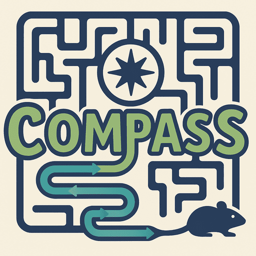
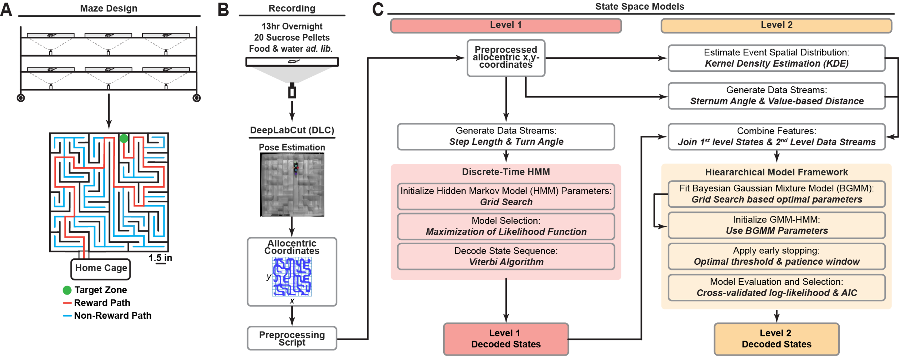

# CoMPASS-Labyrinth

CoMPASS-Labyrinth is a unified computational and behavioral framework for analyzing goal-directed navigation in complex, ethologically valid maze environments using hierarchical probabilistic models. This project integrates behavioral modeling with neural data analysis to uncover latent cognitive states and their underlying neural dynamics during complex decision-making tasks.

  
  &nbsp;&nbsp;&nbsp;
  
  &nbsp;&nbsp;&nbsp;
  

░▒▓█▓▒░ ░▒▓█▓▒░ ░▒▓█▓▒░

  

## Key Features

1. **Naturalistic Maze Framework**: A Novel Labyrinth maze paradigm that elicits spontaneous, intrinsically motivated, and untrained navigation behavior in rodents, closely mimicking real-world foraging.

2. **CoMPASS**: A Hierarchical Probabilistic Framework integrating local movement dynamics with goal-directed cognitive states.

3. **Latent State Inference**: Identification of fine-grained cognitive states that underlie navigation strategies, beyond what is captured by task performance alone.

4. **Neural-Behavioral Integration**: Linking probabilistically inferred behavioral states with neural oscillatory signatures, reflecting how internal cognitive processes manifest in circuit-level dynamics.

5. **Translational Relevance**: Sensitive detection of early cognitive deficits in models of neurodegenerative disease (e.g., App-KI mice), with broader implications for human cognition, learning, and memory.

## Installation

* Recommended with conda environment

1. Clone repo from github

In anaconda prompt:
2. Navigate to cloned repo folder with `cd`

3. `conda env create -f environment.yml`

4. `conda activate compass-labyrinth`

5. `Rscript set_R_Packages.R`

6. type `code` to open VScode through the compass-labyrinth environment

## Instructions

1. See individual README.md files within **CoMPASS-Labyrinth\src** for detailed instructions for descriptions of individual modules and code elements.

2. See **CoMPASS-Labyrinth\notebooks** for examples of running the code and instructions for usage. See `data` for example data, dataset information, and metadata. Example datasets are already preprocessed, so avoid notebooks 01, 02, 08

3. Set paths within the **CoMPASS-Labyrinth\notebooks\init_config.py** and **CoMPASS-Labyrinth\src\compass\level_2\compass_config.py**

4. Run **CoMPASS-Labyrinth\notebooks**. Jupyter is highly recommended for interactive features.

## Citation
If you use this framework, please cite the below manuscript:
