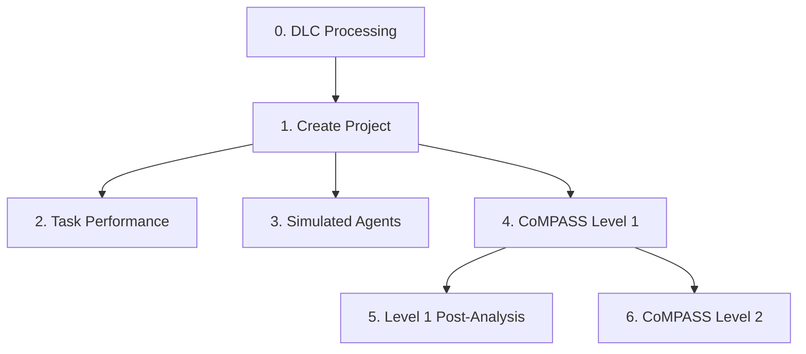

# Tutorials

The following Jupyter notebook tutorials demonstrate how to use CoMPASS-Labyrinth for various analysis tasks. The tutorials are numbered in the recommended order of usage.

## Available Tutorials

### 0. DLC Grid Processing
**Notebook:** [00_dlc_grid_processing.ipynb](https://github.com/CoMPASS-Framework/CoMPASS-Labyrinth/blob/main/tutorials/00_dlc_grid_processing.ipynb)

Custom processing using DeepLabCut (DLC) for pose estimation. This tutorial is run outside of the compass-labyrinth environment.

---

### 1. Create Project
**Notebook:** [01_create_project.ipynb](https://github.com/CoMPASS-Framework/CoMPASS-Labyrinth/blob/main/tutorials/01_create_project.ipynb)

Learn how to:
- Initialize a new CoMPASS-Labyrinth project
- Concatenate post-DLC results
- Set up the project structure for analysis

---

### 2. Task Performance Analysis
**Notebook:** [02_task_performance_analysis.ipynb](https://github.com/CoMPASS-Framework/CoMPASS-Labyrinth/blob/main/tutorials/02_task_performance_analysis.ipynb)

Explore various task performance metrics including:
- Success rates
- Trajectory analysis
- Region usage statistics
- Entropy measurements

---

### 3. Simulated Agent Modeling
**Notebook:** [03_simulated_agent_modelling.ipynb](https://github.com/CoMPASS-Framework/CoMPASS-Labyrinth/blob/main/tutorials/03_simulated_agent_modelling.ipynb)

Build and analyze computational models of navigation behavior:
- Create simulated agents
- Compare agent behavior with real data
- Explore explore-exploit dynamics

---

### 4. CoMPASS Level 1
**Notebook:** [04_compass_level_1.ipynb](https://github.com/CoMPASS-Framework/CoMPASS-Labyrinth/blob/main/tutorials/04_compass_level_1.ipynb)

Run the CoMPASS Level 1 model to:
- Infer fine-grained motor states using Hidden Markov Models
- Identify surveillance and ambulation states
- Analyze step length and turn angle distributions

---

### 5. CoMPASS Level 1 Post-Analysis
**Notebook:** [05_compass_level_1_post_analysis.ipynb](https://github.com/CoMPASS-Framework/CoMPASS-Labyrinth/blob/main/tutorials/05_compass_level_1_post_analysis.ipynb)

Post-hoc analysis of Level 1 results:
- Spatial analysis of state distributions
- Temporal analysis of state transitions
- Bout-wise analysis
- Grid-based heatmaps

---

### 6. CoMPASS Level 2
**Notebook:** [06_compass_level_2.ipynb](https://github.com/CoMPASS-Framework/CoMPASS-Labyrinth/blob/main/tutorials/06_compass_level_2.ipynb)

Apply the CoMPASS Level 2 model to:
- Infer goal-directed cognitive states
- Identify oriented vs. non-oriented states
- Combine Level 1 and Level 2 for composite state analysis
- Analyze hierarchical state dynamics

---

## Running the Tutorials

### Prerequisites

Make sure you have installed CoMPASS-Labyrinth with Jupyter support:

```bash
pip install -e ".[dev]"
```

### Launching Jupyter

Navigate to the tutorials directory and launch Jupyter:

```bash
cd tutorials
jupyter lab
```

### Test Data

Test datasets are available in the `tests/assets` directory for practicing with the tutorials.

---

## Tutorial Workflow

The tutorials follow the CoMPASS-Labyrinth workflow:



!!! tip "Getting Started"
    If you're new to CoMPASS-Labyrinth, we recommend starting with **Tutorial 1** (Create Project) and following the numbered sequence.


