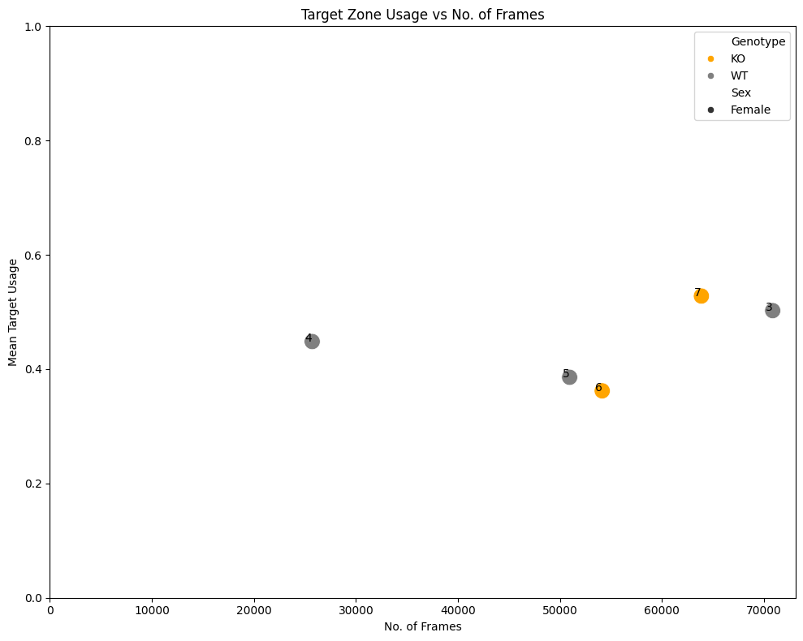
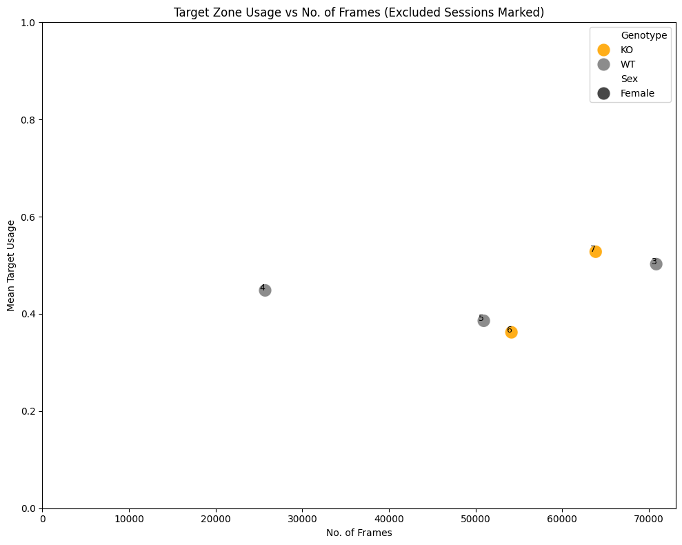
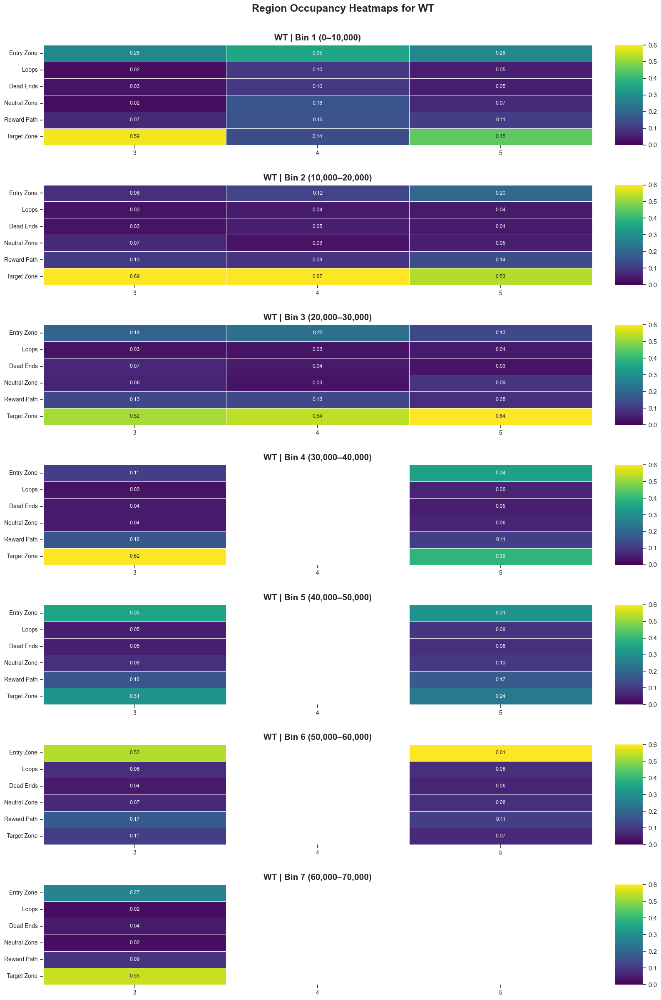
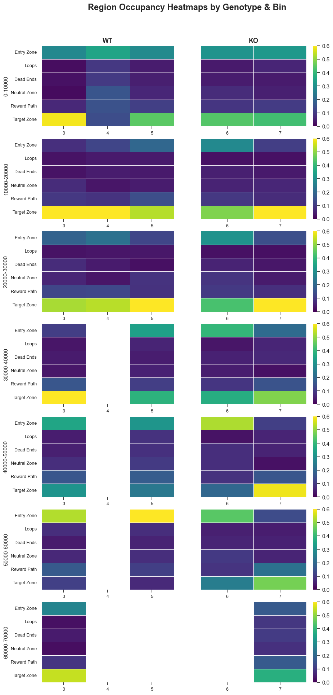
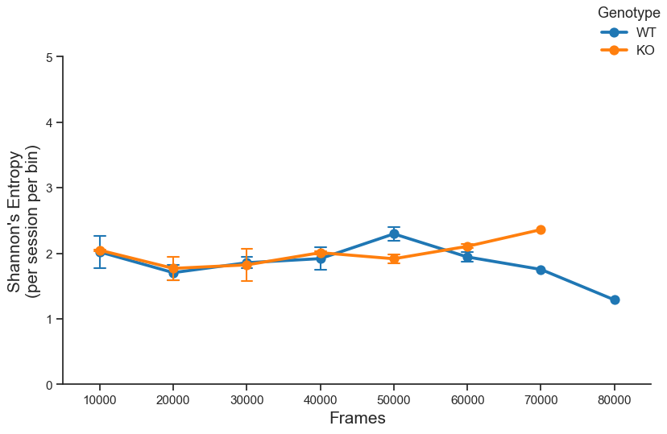
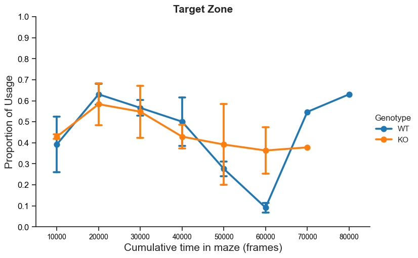
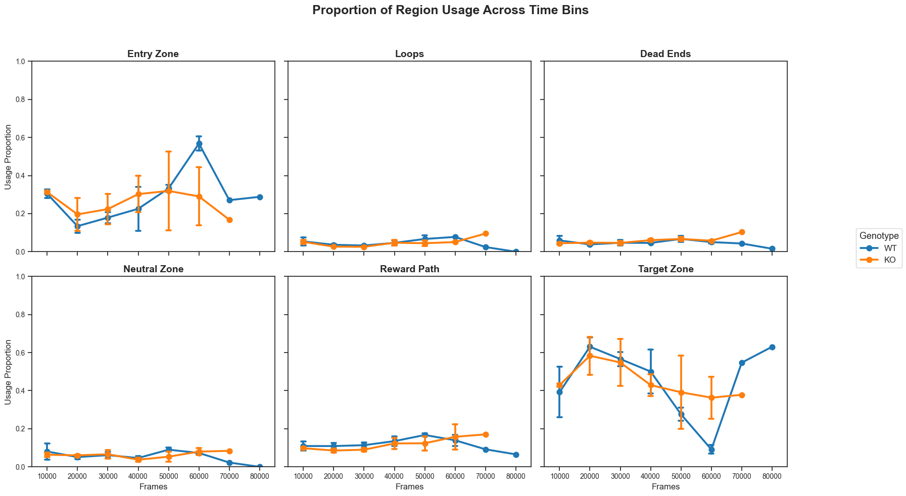
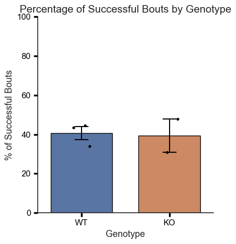
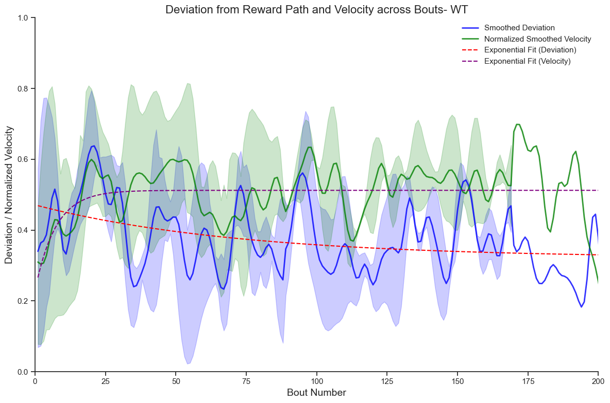

# Table of Contents

1. [Load project](#Load-project)
2. [Import Combined DLC CSV](#import-combined-dlc-csv)
3. [Create time-binned dictionary](##create-time-binned-dictionary)
4. [Exclusion Criteria](#exclusion-criteria)
    1. [Save new preprocessed csv post exclusions](#Save-new-preprocessed-csv-post-exclusions)
    2. [Subset the Time-Binned Dictionary based on Valid Sessions](#Subset-the-Time-Binned-Dictionary-based-on-Valid-Sessions)
5. [Plot 1: Heatmap Representations](#plot-1-heatmap-representations)
    1. [Heatmap Representations across all Genotypes](#EXTRA:-Heatmap-Representations-across-all-Genotypes-(when-multiple-genotypes))
6. [Shannon's Entropy](#shannons-entropy)
    1. [Plot 2: Plotting Shannon's Entropy across Sessions](#plot-2-plotting-shannons-entropy-across-sessions-mice)
    2. [Statistical tests - Entropy](#Statistical-tests---Entropy)
7. [Proportion of Region-based usage across Time bins](#Proportion-of-Region-based-usage-across-Time-bins)
    1. [Plot 3: Proportion of usage per Region across time](#plot-3-proportion-of-usage-per-region-across-time)
    2. [Statistical tests - region usage](#Statistical-tests---region-usage)
    3. [Plot 4: Proportion of usage across all Regions](#Plot-4:-Proportion-of-usage-across-all-Regions)
8. [Bout-Level Success metrics](#Bout-Level-Success-Metrics)
    1. [Plot 5: Cumulative Successful Bout Percentage](#Plot-5:-Cumulative-Successful-Bout-Percentage)
    2. [Statistical tests - genotypes](#Statistical-tests---genotypes)
    3. [Plot 6: Time-based Successful Bout Percentage](#Plot-6:-Time-based-Successful-Bout-Percentage)
    4. [Statistical tests - time-based](#Statistical-tests---time-based)
9. [Plot 7: Deviation from Reward Path and Velocity](#Plot-7:-Deviation-from-Reward-Path-and-Velocity)
    1. [Deviation from Reward Path and Velocity for all Genotypes](#Deviation-from-Reward-Path-and-Velocity-for-all-Genotypes)

# Load project

```python
from pathlib import Path
import pandas as pd
from compass_labyrinth import load_project


project_path = Path(".").resolve() / "my_project_2"

config, cohort_metadata = load_project(project_path=project_path)
config
```


    {'bodyparts': ['nose',
      'sternum',
      'belly',
      'tailbase',
      'leftflank',
      'rightflank'],
     'creation_date_time': '2025-10-14T16:13:40.839920',
     'dlc_scorer': 'DLC_resnet50_LabyrinthMar13shuffle1_1000000',
     'experimental_groups': ['A', 'B', 'C', 'D'],
     'file_ext': '.csv',
     'palette': 'grey',
     'project_name': 'my_project_2',
     'project_path_full': '/Users/luiztauffer/Github/CoMPASS-Labyrinth/notebooks/my_project_2',
     'session_names': ['Session-3',
      'Session-4',
      'Session-5',
      'Session-6',
      'Session-7'],
     'trial_type': 'Labyrinth_DSI',
     'video_type': '.mp4'}


```python
cohort_metadata
```


<div>
<style scoped>
    .dataframe tbody tr th:only-of-type {
        vertical-align: middle;
    }

    .dataframe tbody tr th {
        vertical-align: top;
    }

    .dataframe thead th {
        text-align: right;
    }
</style>
<table border="1" class="dataframe">
  <thead>
    <tr style="text-align: right;">
      <th></th>
      <th>Session #</th>
      <th>Run Date</th>
      <th>Time Of Day</th>
      <th>Rack Location</th>
      <th>Computer</th>
      <th>Noldus Chamber</th>
      <th>Camera #</th>
      <th>Noldus Trial</th>
      <th>Noldus Project Name</th>
      <th>DSI Trial</th>
      <th>...</th>
      <th>Birth Date</th>
      <th>Age (months)</th>
      <th>Housing ID</th>
      <th>Transmitter #</th>
      <th>Exclude Trial</th>
      <th>X1</th>
      <th>X2</th>
      <th>Y1</th>
      <th>Y2</th>
      <th>NOTES</th>
    </tr>
  </thead>
  <tbody>
    <tr>
      <th>0</th>
      <td>3</td>
      <td>2024-11-18T00:00:00</td>
      <td>17:15:00</td>
      <td>BR</td>
      <td>1</td>
      <td>TR</td>
      <td>6</td>
      <td>1</td>
      <td>20241118_WT_DSI_Labyrinth_2</td>
      <td>2</td>
      <td>...</td>
      <td>2024-06-01T00:00:00</td>
      <td>5m13d</td>
      <td>H-11495-17</td>
      <td>3,4</td>
      <td>NaN</td>
      <td>1486</td>
      <td>2399</td>
      <td>70</td>
      <td>986</td>
      <td>Grabbed all pellets early on</td>
    </tr>
    <tr>
      <th>1</th>
      <td>4</td>
      <td>2024-11-18T00:00:00</td>
      <td>17:15:00</td>
      <td>TR</td>
      <td>1</td>
      <td>BR</td>
      <td>2</td>
      <td>1</td>
      <td>20241118_WT_DSI_Labyrinth_2</td>
      <td>2</td>
      <td>...</td>
      <td>2024-06-02T00:00:00</td>
      <td>5m12d</td>
      <td>H-11497-17</td>
      <td>5,6</td>
      <td>NaN</td>
      <td>1435</td>
      <td>2359</td>
      <td>1086</td>
      <td>2015</td>
      <td>Light turned off; slightly dark</td>
    </tr>
    <tr>
      <th>2</th>
      <td>5</td>
      <td>2024-11-20T00:00:00</td>
      <td>17:15:00</td>
      <td>BR</td>
      <td>1</td>
      <td>TR</td>
      <td>4</td>
      <td>3</td>
      <td>20241118_WT_DSI_Labyrinth_2</td>
      <td>4</td>
      <td>...</td>
      <td>2024-06-01T00:00:00</td>
      <td>5m13d</td>
      <td>H-11495-17</td>
      <td>3,4</td>
      <td>NaN</td>
      <td>1486</td>
      <td>2399</td>
      <td>70</td>
      <td>986</td>
      <td>Entered</td>
    </tr>
    <tr>
      <th>3</th>
      <td>6</td>
      <td>2024-12-02T00:00:00</td>
      <td>17:15:00</td>
      <td>BR</td>
      <td>1</td>
      <td>TR</td>
      <td>4</td>
      <td>5</td>
      <td>20241118_WT_DSI_Labyrinth_2</td>
      <td>6</td>
      <td>...</td>
      <td>2024-06-02T00:00:00</td>
      <td>5m12d</td>
      <td>H-11497-17</td>
      <td>3,4</td>
      <td>NaN</td>
      <td>1486</td>
      <td>2399</td>
      <td>70</td>
      <td>986</td>
      <td>Entered</td>
    </tr>
    <tr>
      <th>4</th>
      <td>7</td>
      <td>2024-12-03T00:00:00</td>
      <td>17:15:00</td>
      <td>BL</td>
      <td>1</td>
      <td>TL</td>
      <td>1</td>
      <td>6</td>
      <td>20241118_WT_DSI_Labyrinth_2</td>
      <td>7</td>
      <td>...</td>
      <td>2024-06-01T00:00:00</td>
      <td>5m13d</td>
      <td>H-11495-17</td>
      <td>1,2</td>
      <td>NaN</td>
      <td>144</td>
      <td>1075</td>
      <td>19</td>
      <td>954</td>
      <td>Entered</td>
    </tr>
  </tbody>
</table>
<p>5 rows × 26 columns</p>
</div>


# Import Combined DLC CSV

```python
df_all_csv = pd.read_csv(project_path / "csvs" / "combined" / "Preprocessed_combined_file.csv")
df_all_csv
```


<div>
<style scoped>
    .dataframe tbody tr th:only-of-type {
        vertical-align: middle;
    }

    .dataframe tbody tr th {
        vertical-align: top;
    }

    .dataframe thead th {
        text-align: right;
    }
</style>
<table border="1" class="dataframe">
  <thead>
    <tr style="text-align: right;">
      <th></th>
      <th>x</th>
      <th>y</th>
      <th>Grid Number</th>
      <th>likelihood</th>
      <th>S_no</th>
      <th>Region</th>
      <th>Session</th>
      <th>Genotype</th>
      <th>Sex</th>
      <th>NodeType</th>
      <th>Velocity</th>
    </tr>
  </thead>
  <tbody>
    <tr>
      <th>0</th>
      <td>275.057129</td>
      <td>875.337219</td>
      <td>47</td>
      <td>0.983259</td>
      <td>748</td>
      <td>entry_zone</td>
      <td>3</td>
      <td>WT</td>
      <td>Female</td>
      <td>Entry Nodes</td>
      <td>0.000000</td>
    </tr>
    <tr>
      <th>1</th>
      <td>271.037537</td>
      <td>872.005432</td>
      <td>47</td>
      <td>0.989085</td>
      <td>749</td>
      <td>entry_zone</td>
      <td>3</td>
      <td>WT</td>
      <td>Female</td>
      <td>Entry Nodes</td>
      <td>26.104563</td>
    </tr>
    <tr>
      <th>2</th>
      <td>267.526978</td>
      <td>873.733704</td>
      <td>47</td>
      <td>0.986050</td>
      <td>750</td>
      <td>entry_zone</td>
      <td>3</td>
      <td>WT</td>
      <td>Female</td>
      <td>Entry Nodes</td>
      <td>19.564603</td>
    </tr>
    <tr>
      <th>3</th>
      <td>265.571991</td>
      <td>873.412659</td>
      <td>47</td>
      <td>0.953975</td>
      <td>751</td>
      <td>entry_zone</td>
      <td>3</td>
      <td>WT</td>
      <td>Female</td>
      <td>Entry Nodes</td>
      <td>9.905860</td>
    </tr>
    <tr>
      <th>4</th>
      <td>266.325684</td>
      <td>874.166748</td>
      <td>47</td>
      <td>0.958631</td>
      <td>752</td>
      <td>entry_zone</td>
      <td>3</td>
      <td>WT</td>
      <td>Female</td>
      <td>Entry Nodes</td>
      <td>5.330815</td>
    </tr>
    <tr>
      <th>...</th>
      <td>...</td>
      <td>...</td>
      <td>...</td>
      <td>...</td>
      <td>...</td>
      <td>...</td>
      <td>...</td>
      <td>...</td>
      <td>...</td>
      <td>...</td>
      <td>...</td>
    </tr>
    <tr>
      <th>265495</th>
      <td>228.690262</td>
      <td>814.897949</td>
      <td>34</td>
      <td>0.999385</td>
      <td>225311</td>
      <td>reward_path</td>
      <td>7</td>
      <td>KO</td>
      <td>Female</td>
      <td>Non-Decision (Reward)</td>
      <td>293.221609</td>
    </tr>
    <tr>
      <th>265496</th>
      <td>292.517883</td>
      <td>837.722717</td>
      <td>46</td>
      <td>0.999992</td>
      <td>225312</td>
      <td>entry_zone</td>
      <td>7</td>
      <td>KO</td>
      <td>Female</td>
      <td>Entry Nodes</td>
      <td>338.929760</td>
    </tr>
    <tr>
      <th>265497</th>
      <td>295.305054</td>
      <td>862.294739</td>
      <td>47</td>
      <td>0.999458</td>
      <td>225313</td>
      <td>entry_zone</td>
      <td>7</td>
      <td>KO</td>
      <td>Female</td>
      <td>Entry Nodes</td>
      <td>123.647944</td>
    </tr>
    <tr>
      <th>265498</th>
      <td>295.361694</td>
      <td>876.922546</td>
      <td>47</td>
      <td>0.999976</td>
      <td>225314</td>
      <td>entry_zone</td>
      <td>7</td>
      <td>KO</td>
      <td>Female</td>
      <td>Entry Nodes</td>
      <td>73.139586</td>
    </tr>
    <tr>
      <th>265499</th>
      <td>294.444183</td>
      <td>901.016602</td>
      <td>47</td>
      <td>0.962276</td>
      <td>225315</td>
      <td>entry_zone</td>
      <td>7</td>
      <td>KO</td>
      <td>Female</td>
      <td>Entry Nodes</td>
      <td>120.557592</td>
    </tr>
  </tbody>
</table>
<p>265500 rows × 11 columns</p>
</div>


# Create Time-Binned Dictionary

This workflow bins data from each session into defined intervals and calculates normalized region occupancy for each genotype. Each pivot table summarizes the proportion of time spent in each region across all sessions for a given bin.

### Recommended Use:
1. Ensure `df_all_csv` contains 'Session', 'Genotype', and 'Region' columns.
2. Set `LOWER_LIMIT` and `UPPER_LIMIT` to define the full range of timepoints to analyze.
3. Set `BIN_SIZE` (used as `difference`) to determine the duration of each bin (e.g., 10000).
4. Provide `region_lengths` as a dictionary mapping region names to their total grid lengths.
5. The function returns a dictionary of pivot tables (one per genotype), useful for heatmap plotting.

Let's generate pivot tables for each genotype and time bin:

```python
from compass_labyrinth.behavior.behavior_metrics.task_performance_analysis import generate_region_heatmap_pivots


pivot_dict = generate_region_heatmap_pivots(
    df=df_all_csv,
    lower_lim=0,        # Start of time window
    upper_lim=80000,    # End of time window
    difference=10000,   # Bin width in timepoints
)
pivot_dict
```


    {'WT': [Session              3         4         5    6    7
      Region                                              
      dead_ends     0.026238  0.102472  0.049415  NaN  NaN
      entry_zone     0.27963  0.350917  0.283783  NaN  NaN
      loops         0.020899  0.096457  0.045463  NaN  NaN
      neutral_zone  0.017005  0.158748  0.065333  NaN  NaN
      reward_path   0.066233  0.151273  0.110471  NaN  NaN
      target_zone   0.589995  0.140132  0.445534  NaN  NaN,
      Session              3         4         5    6    7
      Region                                              
      dead_ends     0.029137  0.045469  0.040759  NaN  NaN
      entry_zone    0.081512  0.122688  0.198544  NaN  NaN
      loops         0.029018  0.040293  0.039939  NaN  NaN
      neutral_zone  0.073554   0.03325  0.046698  NaN  NaN
      reward_path   0.097059  0.088841  0.141311  NaN  NaN
      target_zone   0.689719  0.669459  0.532749  NaN  NaN,
      Session              3         4         5    6    7
      Region                                              
      dead_ends      0.07332  0.042224  0.025213  NaN  NaN
      entry_zone     0.18708  0.224646  0.125912  NaN  NaN
      loops         0.029001  0.033814  0.035429  NaN  NaN
      neutral_zone  0.062257  0.033544  0.088323  NaN  NaN
      reward_path   0.125924  0.130415  0.084648  NaN  NaN
      target_zone   0.522419  0.535356  0.640475  NaN  NaN,
      Session              3    4         5    6    7
      Region                                         
      dead_ends     0.043817  NaN  0.048661  NaN  NaN
      entry_zone    0.109593  NaN  0.341505  NaN  NaN
      loops         0.033375  NaN  0.059773  NaN  NaN
      neutral_zone  0.037078  NaN  0.055517  NaN  NaN
      reward_path   0.161017  NaN  0.108825  NaN  NaN
      target_zone    0.61512  NaN  0.385719  NaN  NaN,
      Session              3    4         5    6    7
      Region                                         
      dead_ends     0.051835  NaN  0.082675  NaN  NaN
      entry_zone    0.351637  NaN  0.313184  NaN  NaN
      loops         0.047363  NaN  0.086704  NaN  NaN
      neutral_zone  0.078946  NaN  0.101196  NaN  NaN
      reward_path   0.159491  NaN  0.174884  NaN  NaN
      target_zone   0.310728  NaN  0.241358  NaN  NaN,
      Session              3    4         5    6    7
      Region                                         
      dead_ends     0.043033  NaN   0.05823  NaN  NaN
      entry_zone    0.530307  NaN  0.605594  NaN  NaN
      loops         0.078033  NaN  0.077525  NaN  NaN
      neutral_zone  0.066665  NaN   0.07914  NaN  NaN
      reward_path   0.167965  NaN  0.110694  NaN  NaN
      target_zone   0.113996  NaN  0.068817  NaN  NaN,
      Session              3    4    5    6    7
      Region                                    
      dead_ends     0.043239  NaN  NaN  NaN  NaN
      entry_zone    0.270779  NaN  NaN  NaN  NaN
      loops         0.024505  NaN  NaN  NaN  NaN
      neutral_zone  0.022525  NaN  NaN  NaN  NaN
      reward_path   0.092019  NaN  NaN  NaN  NaN
      target_zone   0.546933  NaN  NaN  NaN  NaN,
      Session              3    4    5    6    7
      Region                                    
      dead_ends     0.015728  NaN  NaN  NaN  NaN
      entry_zone    0.288438  NaN  NaN  NaN  NaN
      loops              0.0  NaN  NaN  NaN  NaN
      neutral_zone       0.0  NaN  NaN  NaN  NaN
      reward_path   0.065409  NaN  NaN  NaN  NaN
      target_zone   0.630425  NaN  NaN  NaN  NaN],
     'KO': [Session         3    4    5         6         7
      Region                                         
      dead_ends     NaN  NaN  NaN  0.045004  0.044383
      entry_zone    NaN  NaN  NaN  0.307047  0.319502
      loops         NaN  NaN  NaN  0.041874  0.061598
      neutral_zone  NaN  NaN  NaN  0.074687  0.052373
      reward_path   NaN  NaN  NaN  0.092255  0.103164
      target_zone   NaN  NaN  NaN  0.439133  0.418981,
      Session         3    4    5         6         7
      Region                                         
      dead_ends     NaN  NaN  NaN  0.053663  0.041702
      entry_zone    NaN  NaN  NaN  0.281968  0.110074
      loops         NaN  NaN  NaN   0.02657  0.026993
      neutral_zone  NaN  NaN  NaN  0.057004  0.063573
      reward_path   NaN  NaN  NaN  0.096596  0.074752
      target_zone   NaN  NaN  NaN  0.484198  0.682905,
      Session         3    4    5         6         7
      Region                                         
      dead_ends     NaN  NaN  NaN   0.05693  0.035876
      entry_zone    NaN  NaN  NaN  0.302763  0.145048
      loops         NaN  NaN  NaN  0.027042  0.024638
      neutral_zone  NaN  NaN  NaN  0.089156  0.043116
      reward_path   NaN  NaN  NaN  0.099508  0.080032
      target_zone   NaN  NaN  NaN  0.424601  0.671289,
      Session         3    4    5         6         7
      Region                                         
      dead_ends     NaN  NaN  NaN  0.055025  0.066398
      entry_zone    NaN  NaN  NaN   0.39776  0.207308
      loops         NaN  NaN  NaN  0.033348  0.061158
      neutral_zone  NaN  NaN  NaN  0.048632   0.02619
      reward_path   NaN  NaN  NaN  0.092559  0.153013
      target_zone   NaN  NaN  NaN  0.372676  0.485933,
      Session         3    4    5         6         7
      Region                                         
      dead_ends     NaN  NaN  NaN   0.07803  0.056418
      entry_zone    NaN  NaN  NaN  0.527229  0.111492
      loops         NaN  NaN  NaN  0.029762  0.059491
      neutral_zone  NaN  NaN  NaN  0.079348  0.027319
      reward_path   NaN  NaN  NaN   0.08669  0.160993
      target_zone   NaN  NaN  NaN  0.198941  0.584287,
      Session         3    4    5         6         7
      Region                                         
      dead_ends     NaN  NaN  NaN   0.05972  0.055855
      entry_zone    NaN  NaN  NaN  0.443182   0.13774
      loops         NaN  NaN  NaN  0.053432   0.04803
      neutral_zone  NaN  NaN  NaN  0.099545  0.060367
      reward_path   NaN  NaN  NaN  0.091393  0.224139
      target_zone   NaN  NaN  NaN  0.252727   0.47387,
      Session         3    4    5    6         7
      Region                                    
      dead_ends     NaN  NaN  NaN  NaN  0.103525
      entry_zone    NaN  NaN  NaN  NaN  0.168228
      loops         NaN  NaN  NaN  NaN  0.095542
      neutral_zone  NaN  NaN  NaN  NaN  0.084114
      reward_path   NaN  NaN  NaN  NaN  0.170478
      target_zone   NaN  NaN  NaN  NaN  0.378113]}


# Exclusion Criteria

This workflow quantifies target zone engagement across bouts and sessions, plots the relationship between target usage and session duration, and interactively excludes low-performing sessions based on user-defined thresholds.

### Recommended Use:
1. Ensure `df_all_csv` contains 'Session', 'Genotype', 'Grid.Number', and 'Bout_Index' columns.
2. Run `compute_frames_per_session()` to get the number of frames per session.
3. Use `compute_target_zone_usage()` to calculate per-bout usage for a specified region; set `region` and `difference` accordingly.
4. Summarize target usage at the session level using `summarize_target_usage()` with `mouseinfo` to add sex/genotype metadata.
5. Visualize the relationship between number of frames and target usage using `plot_target_usage_vs_frames()`.
6. Call `exclude_low_performing_sessions()` to interactively remove sessions below usage and duration thresholds.

Example Workflow:

```python
from compass_labyrinth.behavior.behavior_metrics.task_performance_analysis import (
    compute_frames_per_session,
    compute_target_zone_usage,
    summarize_target_usage,
    plot_target_usage_vs_frames,
    exclude_low_performing_sessions,
    plot_target_usage_with_exclusions
)


# Set these values
BIN_SIZE = 10000               # BASED ON THE TIME-BINNED DICTIONARY
REGION = "target_zone"         # Region to evaluate usage

# Step 1: Total frames per session
frames_df = compute_frames_per_session(df=df_all_csv)

# Step 2: Target zone usage per bout
region_target = compute_target_zone_usage(
    df=df_all_csv,
    pivot_dict=pivot_dict,
    region=REGION,
    difference=BIN_SIZE,
)

# Step 3: Session-level summary
region_summary = summarize_target_usage(
    region_target=region_target,
    frames_df=frames_df,
    cohort_metadata=cohort_metadata,
)

# Step 4: Visualize usage vs. session duration
plot_target_usage_vs_frames(
    config=config,
    summary_df=region_summary,
)

# Step 5: Interactive exclusion based on usage and frame thresholds
df_all_csv = exclude_low_performing_sessions(
    df=df_all_csv,
    summary_df=region_summary,
    usage_threshold=0.4,
    min_frames=30000,
)

# Step 6: Replot the target usage v/s frames plot with the excluded sessions 'X' out
sessions_to_exclude = region_summary.loc[
    ~region_summary['Session'].isin(df_all_csv['Session'])
]['Session'].tolist()

plot_target_usage_with_exclusions(
    config=config,
    summary_df=region_summary,
    sessions_to_exclude=sessions_to_exclude,
)
```

    Figure saved at: /Users/luiztauffer/Github/CoMPASS-Labyrinth/notebooks/my_project_2/figures/target_usage_vs_frames.png


    

    


    
    Excluding 0 session(s): []
    Figure saved at: /Users/luiztauffer/Github/CoMPASS-Labyrinth/notebooks/my_project_2/figures/target_usage_vs_frames_exclusions.png


    

    


### Save new preprocessed csv post exclusions

```python
# Define path to the 'csvs' folder and final output file
base_path = Path(config["project_path_full"])
output_file = base_path / "csvs" / "combined" / "Preprocessed_combined_file_exclusions.csv"

# Save the DataFrame
df_all_csv.to_csv(output_file, index=False)
```

### Subset the Time-Binned Dictionary based on Valid Sessions

```python
from compass_labyrinth.behavior.behavior_metrics.task_performance_analysis import subset_pivot_dict_sessions


pivot_dict = subset_pivot_dict_sessions(pivot_dict, df_all_csv)
pivot_dict
```


    {'WT': [Session              3         4         5
      Region                                    
      dead_ends     0.026238  0.102472  0.049415
      entry_zone     0.27963  0.350917  0.283783
      loops         0.020899  0.096457  0.045463
      neutral_zone  0.017005  0.158748  0.065333
      reward_path   0.066233  0.151273  0.110471
      target_zone   0.589995  0.140132  0.445534,
      Session              3         4         5
      Region                                    
      dead_ends     0.029137  0.045469  0.040759
      entry_zone    0.081512  0.122688  0.198544
      loops         0.029018  0.040293  0.039939
      neutral_zone  0.073554   0.03325  0.046698
      reward_path   0.097059  0.088841  0.141311
      target_zone   0.689719  0.669459  0.532749,
      Session              3         4         5
      Region                                    
      dead_ends      0.07332  0.042224  0.025213
      entry_zone     0.18708  0.224646  0.125912
      loops         0.029001  0.033814  0.035429
      neutral_zone  0.062257  0.033544  0.088323
      reward_path   0.125924  0.130415  0.084648
      target_zone   0.522419  0.535356  0.640475,
      Session              3    4         5
      Region                               
      dead_ends     0.043817  NaN  0.048661
      entry_zone    0.109593  NaN  0.341505
      loops         0.033375  NaN  0.059773
      neutral_zone  0.037078  NaN  0.055517
      reward_path   0.161017  NaN  0.108825
      target_zone    0.61512  NaN  0.385719,
      Session              3    4         5
      Region                               
      dead_ends     0.051835  NaN  0.082675
      entry_zone    0.351637  NaN  0.313184
      loops         0.047363  NaN  0.086704
      neutral_zone  0.078946  NaN  0.101196
      reward_path   0.159491  NaN  0.174884
      target_zone   0.310728  NaN  0.241358,
      Session              3    4         5
      Region                               
      dead_ends     0.043033  NaN   0.05823
      entry_zone    0.530307  NaN  0.605594
      loops         0.078033  NaN  0.077525
      neutral_zone  0.066665  NaN   0.07914
      reward_path   0.167965  NaN  0.110694
      target_zone   0.113996  NaN  0.068817,
      Session              3    4    5
      Region                          
      dead_ends     0.043239  NaN  NaN
      entry_zone    0.270779  NaN  NaN
      loops         0.024505  NaN  NaN
      neutral_zone  0.022525  NaN  NaN
      reward_path   0.092019  NaN  NaN
      target_zone   0.546933  NaN  NaN,
      Session              3    4    5
      Region                          
      dead_ends     0.015728  NaN  NaN
      entry_zone    0.288438  NaN  NaN
      loops              0.0  NaN  NaN
      neutral_zone       0.0  NaN  NaN
      reward_path   0.065409  NaN  NaN
      target_zone   0.630425  NaN  NaN],
     'KO': [Session              6         7
      Region                          
      dead_ends     0.045004  0.044383
      entry_zone    0.307047  0.319502
      loops         0.041874  0.061598
      neutral_zone  0.074687  0.052373
      reward_path   0.092255  0.103164
      target_zone   0.439133  0.418981,
      Session              6         7
      Region                          
      dead_ends     0.053663  0.041702
      entry_zone    0.281968  0.110074
      loops          0.02657  0.026993
      neutral_zone  0.057004  0.063573
      reward_path   0.096596  0.074752
      target_zone   0.484198  0.682905,
      Session              6         7
      Region                          
      dead_ends      0.05693  0.035876
      entry_zone    0.302763  0.145048
      loops         0.027042  0.024638
      neutral_zone  0.089156  0.043116
      reward_path   0.099508  0.080032
      target_zone   0.424601  0.671289,
      Session              6         7
      Region                          
      dead_ends     0.055025  0.066398
      entry_zone     0.39776  0.207308
      loops         0.033348  0.061158
      neutral_zone  0.048632   0.02619
      reward_path   0.092559  0.153013
      target_zone   0.372676  0.485933,
      Session              6         7
      Region                          
      dead_ends      0.07803  0.056418
      entry_zone    0.527229  0.111492
      loops         0.029762  0.059491
      neutral_zone  0.079348  0.027319
      reward_path    0.08669  0.160993
      target_zone   0.198941  0.584287,
      Session              6         7
      Region                          
      dead_ends      0.05972  0.055855
      entry_zone    0.443182   0.13774
      loops         0.053432   0.04803
      neutral_zone  0.099545  0.060367
      reward_path   0.091393  0.224139
      target_zone   0.252727   0.47387,
      Session         6         7
      Region                     
      dead_ends     NaN  0.103525
      entry_zone    NaN  0.168228
      loops         NaN  0.095542
      neutral_zone  NaN  0.084114
      reward_path   NaN  0.170478
      target_zone   NaN  0.378113]}


# Plot 1: Heatmap Representations

Use this function to visualize how region occupancy evolves over time for a specific genotype or group in your behavioral dataset. Each heatmap corresponds to a fixed-length time bin and shows normalized region occupancy per session, allowing for temporal comparison.

### Recommended Use:
1. Ensure that `pivot_dict` is generated using `generate_region_heatmap_pivots()`.
2. Specify the genotype/group you want to plot (e.g., 'WT').
3. Define the time binning parameters: `lower_lim`, `upper_lim`, and `difference`.
4. Optionally set a custom region order and vmax for consistent color scaling.
5. Run the function to display vertically stacked heatmaps across time bins.

Example Workflow:

```python
from compass_labyrinth.behavior.behavior_metrics.task_performance_analysis import (
    get_max_session_row_bracket,
    plot_region_heatmaps,
)


# Set these values
GENOTYPE_DISP = 'WT'
LOWER_LIMIT = 0       # lower limit for bins 
BIN_SIZE = 10000      # bin size for the heatmap plot
VMAX = 0.6            # max range on colorbar

UPPER_LIMIT = get_max_session_row_bracket(df_all_csv)  # upper limit for bins 

# Store valid sessions post exclusion, specific to the genotype/group wanting to visualize
valid_sessions = df_all_csv[df_all_csv.Genotype == GENOTYPE_DISP]['Session'].unique().tolist()
if len(valid_sessions) == 0:
    raise ValueError("Valid sessions list is empty! Choose a valid Genotype.")

# Plot the region-based heatmap
plot_region_heatmaps(
    config=config,
    pivot_dict=pivot_dict,
    group_name=GENOTYPE_DISP,
    lower_lim=LOWER_LIMIT,
    upper_lim=UPPER_LIMIT,
    difference=BIN_SIZE,
    vmax=VMAX,
    included_sessions=valid_sessions,
)
```

    Figure saved at: /Users/luiztauffer/Github/CoMPASS-Labyrinth/notebooks/my_project_2/figures/region_heatmaps_WT.pdf


    

    


### EXTRA: Heatmap Representations across all Genotypes (when multiple genotypes)

```python
from compass_labyrinth.behavior.behavior_metrics.task_performance_analysis import plot_region_heatmaps_all_genotypes


# Set these values
included_genotypes = ["WT", "KO"]  # add more genotypes
LOWER_LIMIT = 0              # lower limit for bins 
BIN_SIZE = 10000             # bin size for the heatmap plot
VMAX = 0.6                   # Max. range on colorbar

UPPER_LIMIT = get_max_session_row_bracket(df_all_csv) # upper limit for bins 

plot_region_heatmaps_all_genotypes(
    config=config,
    pivot_dict=pivot_dict,
    df_all_csv=df_all_csv, 
    lower_lim=LOWER_LIMIT,
    upper_lim=UPPER_LIMIT,
    difference=BIN_SIZE,
    included_genotypes=included_genotypes,
    spacing_w=0.2,
    spacing_h=0.15,
    show_colorbar=True,
    vmax=VMAX
)
```

    Figure saved at: /Users/luiztauffer/Github/CoMPASS-Labyrinth/notebooks/my_project_2/figures/region_heatmaps_all_genotypes.pdf


    

    


# Shannon's Entropy

This function calculates Shannon entropy over time, reflecting the diversity of region occupancy for each mouse/session within each time bin. A higher entropy indicates more distributed (less selective) region occupancy, whereas lower entropy suggests focused behavior within fewer regions.

### Recommended Use:
1. Ensure `pivot_dict` has been generated using `generate_region_heatmap_pivots()`.
2. Ensure `cohort_metadata` includes metadata 

```python
from compass_labyrinth.behavior.behavior_metrics.task_performance_analysis import compute_shannon_entropy_per_bin


# Compute entropy values
entropy_df = compute_shannon_entropy_per_bin(
    pivot_dict=pivot_dict, 
    df_all_csv=df_all_csv,
    bin_size=BIN_SIZE   # As used and specified in pivot_dict creation
)
entropy_df
```


<div>
<style scoped>
    .dataframe tbody tr th:only-of-type {
        vertical-align: middle;
    }

    .dataframe tbody tr th {
        vertical-align: top;
    }

    .dataframe thead th {
        text-align: right;
    }
</style>
<table border="1" class="dataframe">
  <thead>
    <tr style="text-align: right;">
      <th></th>
      <th>Session</th>
      <th>Bin</th>
      <th>Entropy</th>
      <th>Genotype</th>
    </tr>
  </thead>
  <tbody>
    <tr>
      <th>0</th>
      <td>3</td>
      <td>10000</td>
      <td>1.576969</td>
      <td>WT</td>
    </tr>
    <tr>
      <th>1</th>
      <td>3</td>
      <td>20000</td>
      <td>1.564810</td>
      <td>WT</td>
    </tr>
    <tr>
      <th>2</th>
      <td>3</td>
      <td>30000</td>
      <td>1.992102</td>
      <td>WT</td>
    </tr>
    <tr>
      <th>3</th>
      <td>3</td>
      <td>40000</td>
      <td>1.742714</td>
      <td>WT</td>
    </tr>
    <tr>
      <th>4</th>
      <td>3</td>
      <td>50000</td>
      <td>2.195503</td>
      <td>WT</td>
    </tr>
    <tr>
      <th>5</th>
      <td>3</td>
      <td>60000</td>
      <td>2.017632</td>
      <td>WT</td>
    </tr>
    <tr>
      <th>6</th>
      <td>3</td>
      <td>70000</td>
      <td>1.753554</td>
      <td>WT</td>
    </tr>
    <tr>
      <th>7</th>
      <td>3</td>
      <td>80000</td>
      <td>1.288536</td>
      <td>WT</td>
    </tr>
    <tr>
      <th>8</th>
      <td>4</td>
      <td>10000</td>
      <td>2.423388</td>
      <td>WT</td>
    </tr>
    <tr>
      <th>9</th>
      <td>4</td>
      <td>20000</td>
      <td>1.621939</td>
      <td>WT</td>
    </tr>
    <tr>
      <th>10</th>
      <td>4</td>
      <td>30000</td>
      <td>1.872103</td>
      <td>WT</td>
    </tr>
    <tr>
      <th>11</th>
      <td>4</td>
      <td>40000</td>
      <td>NaN</td>
      <td>WT</td>
    </tr>
    <tr>
      <th>12</th>
      <td>4</td>
      <td>50000</td>
      <td>NaN</td>
      <td>WT</td>
    </tr>
    <tr>
      <th>13</th>
      <td>4</td>
      <td>60000</td>
      <td>NaN</td>
      <td>WT</td>
    </tr>
    <tr>
      <th>14</th>
      <td>4</td>
      <td>70000</td>
      <td>NaN</td>
      <td>WT</td>
    </tr>
    <tr>
      <th>15</th>
      <td>4</td>
      <td>80000</td>
      <td>NaN</td>
      <td>WT</td>
    </tr>
    <tr>
      <th>16</th>
      <td>5</td>
      <td>10000</td>
      <td>2.060735</td>
      <td>WT</td>
    </tr>
    <tr>
      <th>17</th>
      <td>5</td>
      <td>20000</td>
      <td>1.926173</td>
      <td>WT</td>
    </tr>
    <tr>
      <th>18</th>
      <td>5</td>
      <td>30000</td>
      <td>1.703479</td>
      <td>WT</td>
    </tr>
    <tr>
      <th>19</th>
      <td>5</td>
      <td>40000</td>
      <td>2.094408</td>
      <td>WT</td>
    </tr>
    <tr>
      <th>20</th>
      <td>5</td>
      <td>50000</td>
      <td>2.397081</td>
      <td>WT</td>
    </tr>
    <tr>
      <th>21</th>
      <td>5</td>
      <td>60000</td>
      <td>1.869875</td>
      <td>WT</td>
    </tr>
    <tr>
      <th>22</th>
      <td>5</td>
      <td>70000</td>
      <td>NaN</td>
      <td>WT</td>
    </tr>
    <tr>
      <th>23</th>
      <td>5</td>
      <td>80000</td>
      <td>NaN</td>
      <td>WT</td>
    </tr>
    <tr>
      <th>24</th>
      <td>6</td>
      <td>10000</td>
      <td>2.034192</td>
      <td>KO</td>
    </tr>
    <tr>
      <th>25</th>
      <td>6</td>
      <td>20000</td>
      <td>1.948439</td>
      <td>KO</td>
    </tr>
    <tr>
      <th>26</th>
      <td>6</td>
      <td>30000</td>
      <td>2.065053</td>
      <td>KO</td>
    </tr>
    <tr>
      <th>27</th>
      <td>6</td>
      <td>40000</td>
      <td>1.983480</td>
      <td>KO</td>
    </tr>
    <tr>
      <th>28</th>
      <td>6</td>
      <td>50000</td>
      <td>1.984297</td>
      <td>KO</td>
    </tr>
    <tr>
      <th>29</th>
      <td>6</td>
      <td>60000</td>
      <td>2.137225</td>
      <td>KO</td>
    </tr>
    <tr>
      <th>30</th>
      <td>6</td>
      <td>70000</td>
      <td>NaN</td>
      <td>KO</td>
    </tr>
    <tr>
      <th>31</th>
      <td>6</td>
      <td>80000</td>
      <td>NaN</td>
      <td>KO</td>
    </tr>
    <tr>
      <th>32</th>
      <td>7</td>
      <td>10000</td>
      <td>2.059821</td>
      <td>KO</td>
    </tr>
    <tr>
      <th>33</th>
      <td>7</td>
      <td>20000</td>
      <td>1.590435</td>
      <td>KO</td>
    </tr>
    <tr>
      <th>34</th>
      <td>7</td>
      <td>30000</td>
      <td>1.581019</td>
      <td>KO</td>
    </tr>
    <tr>
      <th>35</th>
      <td>7</td>
      <td>40000</td>
      <td>2.034930</td>
      <td>KO</td>
    </tr>
    <tr>
      <th>36</th>
      <td>7</td>
      <td>50000</td>
      <td>1.848143</td>
      <td>KO</td>
    </tr>
    <tr>
      <th>37</th>
      <td>7</td>
      <td>60000</td>
      <td>2.075423</td>
      <td>KO</td>
    </tr>
    <tr>
      <th>38</th>
      <td>7</td>
      <td>70000</td>
      <td>2.361065</td>
      <td>KO</td>
    </tr>
    <tr>
      <th>39</th>
      <td>7</td>
      <td>80000</td>
      <td>NaN</td>
      <td>KO</td>
    </tr>
  </tbody>
</table>
</div>


## Plot 2: Plotting Shannon's Entropy across Sessions (/Mice)

```python
from compass_labyrinth.behavior.behavior_metrics.task_performance_analysis import plot_entropy_over_bins


# Plot entropy over time
plot_entropy_over_bins(
    config=config,
    entropy_df=entropy_df,
)
```

    Figure saved at: /Users/luiztauffer/Github/CoMPASS-Labyrinth/notebooks/my_project_2/figures/shannon_entropy.pdf


    

    


### Statistical tests - Entropy

```python
from compass_labyrinth.behavior.behavior_metrics.task_performance_analysis import (
    run_entropy_anova,
    run_fdr_pairwise_tests,
    run_mixed_model_per_genotype_pair,
)

## Need more than one genotype to run these

# Repeated Measures ANOVA
anova_result = run_entropy_anova(entropy_df)

# Pairwise t-tests + FDR correction (per bin, per genotype pair)
fdr_results = run_fdr_pairwise_tests(entropy_df)
print(fdr_results)

# Run per-pair mixed models
mixed_results, interaction_table = run_mixed_model_per_genotype_pair(entropy_df)

# View pairwise Bin × Genotype interaction summary
print(interaction_table)
```

    Repeated Measures ANOVA (within-subject Bin):
                  Anova
    =================================
        F Value Num DF  Den DF Pr > F
    ---------------------------------
    Bin  4.1115 7.0000 28.0000 0.0032
    =================================
    
         Bin Group1 Group2    t-stat     raw-p     FDR-p  Significant
    0  10000     WT     KO -0.108520  0.923442  0.923442        False
    1  20000     WT     KO -0.308332  0.789796  0.923442        False
    2  30000     WT     KO  0.128312  0.915462  0.923442        False
    3  40000     WT     KO -1.126728  0.376559  0.923442        False
    4  50000     WT     KO -0.500042  0.665967  0.923442        False
    5  60000     WT     KO -1.246799  0.338204  0.923442        False
    6  70000     WT     KO -0.452447  0.707578  0.923442        False
    7  80000     WT     KO  1.000000  0.422650  0.923442        False
    
     MixedLM failed for WT vs KO: Singular matrix
      Genotype1 Genotype2 Interaction_pvals  Significant
    0        WT        KO                {}        False


# Proportion of Region-based usage across Time bins

This function computes the proportion of usage of a specified region across sequential time bins, grouped by session and genotype, using the binned pivot tables.

### Recommended Use:
1. Ensure `pivot_dict` is the output from `generate_region_heatmap_pivots()` and contains binned region usage per genotype.
2. Use `cohort_metadata` to map session IDs to genotypes for grouping.
3. Set `region` to the name of the region you want to evaluate (e.g., "target_zone").
4. Set `bin_size` to match the time resolution used when generating `pivot_dict`.

```python
from compass_labyrinth.behavior.behavior_metrics.task_performance_analysis import compute_region_usage_over_bins


# Set these values
REGION = "target_zone"
BIN_SIZE = BIN_SIZE    # Based on pivot_dict

# Compute region usage over time bins
reg_binned = compute_region_usage_over_bins(
    pivot_dict=pivot_dict,
    df_all_csv=df_all_csv,
    region=REGION,
    bin_size=BIN_SIZE
)
reg_binned
```


<div>
<style scoped>
    .dataframe tbody tr th:only-of-type {
        vertical-align: middle;
    }

    .dataframe tbody tr th {
        vertical-align: top;
    }

    .dataframe thead th {
        text-align: right;
    }
</style>
<table border="1" class="dataframe">
  <thead>
    <tr style="text-align: right;">
      <th>Region</th>
      <th>Session</th>
      <th>target_zone</th>
      <th>Bin</th>
      <th>Genotype</th>
    </tr>
  </thead>
  <tbody>
    <tr>
      <th>0</th>
      <td>3</td>
      <td>0.589995</td>
      <td>10000</td>
      <td>WT</td>
    </tr>
    <tr>
      <th>1</th>
      <td>4</td>
      <td>0.140132</td>
      <td>10000</td>
      <td>WT</td>
    </tr>
    <tr>
      <th>2</th>
      <td>5</td>
      <td>0.445534</td>
      <td>10000</td>
      <td>WT</td>
    </tr>
    <tr>
      <th>3</th>
      <td>3</td>
      <td>0.689719</td>
      <td>20000</td>
      <td>WT</td>
    </tr>
    <tr>
      <th>4</th>
      <td>4</td>
      <td>0.669459</td>
      <td>20000</td>
      <td>WT</td>
    </tr>
    <tr>
      <th>5</th>
      <td>5</td>
      <td>0.532749</td>
      <td>20000</td>
      <td>WT</td>
    </tr>
    <tr>
      <th>6</th>
      <td>3</td>
      <td>0.522419</td>
      <td>30000</td>
      <td>WT</td>
    </tr>
    <tr>
      <th>7</th>
      <td>4</td>
      <td>0.535356</td>
      <td>30000</td>
      <td>WT</td>
    </tr>
    <tr>
      <th>8</th>
      <td>5</td>
      <td>0.640475</td>
      <td>30000</td>
      <td>WT</td>
    </tr>
    <tr>
      <th>9</th>
      <td>3</td>
      <td>0.61512</td>
      <td>40000</td>
      <td>WT</td>
    </tr>
    <tr>
      <th>10</th>
      <td>4</td>
      <td>NaN</td>
      <td>40000</td>
      <td>WT</td>
    </tr>
    <tr>
      <th>11</th>
      <td>5</td>
      <td>0.385719</td>
      <td>40000</td>
      <td>WT</td>
    </tr>
    <tr>
      <th>12</th>
      <td>3</td>
      <td>0.310728</td>
      <td>50000</td>
      <td>WT</td>
    </tr>
    <tr>
      <th>13</th>
      <td>4</td>
      <td>NaN</td>
      <td>50000</td>
      <td>WT</td>
    </tr>
    <tr>
      <th>14</th>
      <td>5</td>
      <td>0.241358</td>
      <td>50000</td>
      <td>WT</td>
    </tr>
    <tr>
      <th>15</th>
      <td>3</td>
      <td>0.113996</td>
      <td>60000</td>
      <td>WT</td>
    </tr>
    <tr>
      <th>16</th>
      <td>4</td>
      <td>NaN</td>
      <td>60000</td>
      <td>WT</td>
    </tr>
    <tr>
      <th>17</th>
      <td>5</td>
      <td>0.068817</td>
      <td>60000</td>
      <td>WT</td>
    </tr>
    <tr>
      <th>18</th>
      <td>3</td>
      <td>0.546933</td>
      <td>70000</td>
      <td>WT</td>
    </tr>
    <tr>
      <th>19</th>
      <td>4</td>
      <td>NaN</td>
      <td>70000</td>
      <td>WT</td>
    </tr>
    <tr>
      <th>20</th>
      <td>5</td>
      <td>NaN</td>
      <td>70000</td>
      <td>WT</td>
    </tr>
    <tr>
      <th>21</th>
      <td>3</td>
      <td>0.630425</td>
      <td>80000</td>
      <td>WT</td>
    </tr>
    <tr>
      <th>22</th>
      <td>4</td>
      <td>NaN</td>
      <td>80000</td>
      <td>WT</td>
    </tr>
    <tr>
      <th>23</th>
      <td>5</td>
      <td>NaN</td>
      <td>80000</td>
      <td>WT</td>
    </tr>
    <tr>
      <th>24</th>
      <td>6</td>
      <td>0.439133</td>
      <td>10000</td>
      <td>KO</td>
    </tr>
    <tr>
      <th>25</th>
      <td>7</td>
      <td>0.418981</td>
      <td>10000</td>
      <td>KO</td>
    </tr>
    <tr>
      <th>26</th>
      <td>6</td>
      <td>0.484198</td>
      <td>20000</td>
      <td>KO</td>
    </tr>
    <tr>
      <th>27</th>
      <td>7</td>
      <td>0.682905</td>
      <td>20000</td>
      <td>KO</td>
    </tr>
    <tr>
      <th>28</th>
      <td>6</td>
      <td>0.424601</td>
      <td>30000</td>
      <td>KO</td>
    </tr>
    <tr>
      <th>29</th>
      <td>7</td>
      <td>0.671289</td>
      <td>30000</td>
      <td>KO</td>
    </tr>
    <tr>
      <th>30</th>
      <td>6</td>
      <td>0.372676</td>
      <td>40000</td>
      <td>KO</td>
    </tr>
    <tr>
      <th>31</th>
      <td>7</td>
      <td>0.485933</td>
      <td>40000</td>
      <td>KO</td>
    </tr>
    <tr>
      <th>32</th>
      <td>6</td>
      <td>0.198941</td>
      <td>50000</td>
      <td>KO</td>
    </tr>
    <tr>
      <th>33</th>
      <td>7</td>
      <td>0.584287</td>
      <td>50000</td>
      <td>KO</td>
    </tr>
    <tr>
      <th>34</th>
      <td>6</td>
      <td>0.252727</td>
      <td>60000</td>
      <td>KO</td>
    </tr>
    <tr>
      <th>35</th>
      <td>7</td>
      <td>0.47387</td>
      <td>60000</td>
      <td>KO</td>
    </tr>
    <tr>
      <th>36</th>
      <td>6</td>
      <td>NaN</td>
      <td>70000</td>
      <td>KO</td>
    </tr>
    <tr>
      <th>37</th>
      <td>7</td>
      <td>0.378113</td>
      <td>70000</td>
      <td>KO</td>
    </tr>
  </tbody>
</table>
</div>


## Plot 3: Proportion of usage per Region across time

Plot the region usage over time bins:

```python
from compass_labyrinth.behavior.behavior_metrics.task_performance_analysis import plot_region_usage_over_bins


fig = plot_region_usage_over_bins(
    config=config,
    region_data=reg_binned,
    region_name=REGION,
    return_fig=True
)
```

    Figure saved at: /Users/luiztauffer/Github/CoMPASS-Labyrinth/notebooks/my_project_2/figures/target_zone_prop_usage.pdf


    

    


### Statistical tests - region usage

```python
from compass_labyrinth.behavior.behavior_metrics.task_performance_analysis import (
    run_region_usage_stats_mixedlm,
    run_region_usage_stats_fdr,
)


# Run a Mixed Effects Model
run_region_usage_stats_mixedlm(reg_binned, region_col=REGION)

# Run pairwise comparison across genotypes with FDR correction
fdr_results = run_region_usage_stats_fdr(reg_binned, region_col=REGION)
```

    
    === Mixed Effects Model (missing values preserved) ===
    MixedLM error: endog has evaluated to an array with multiple columns that has shape (30, 30). This occurs when the variable converted to endog is non-numeric (e.g., bool or str).
    
    === Pairwise t-tests between Genotypes at each Bin (FDR corrected) ===
      Bin Group1 Group2     pval  pval_fdr  significant
    10000     WT     KO 0.805851  0.981351        False
    20000     WT     KO 0.723857  0.981351        False
    30000     WT     KO 0.908117  0.981351        False
    40000     WT     KO 0.654551  0.981351        False
    50000     WT     KO 0.463393  0.981351        False
    60000     WT     KO 0.199917  0.981351        False
    70000     WT     KO 0.981351  0.981351        False


## Plot 4: Proportion of usage across all Regions

Plot usage over time bins for all Regions:

```python
from compass_labyrinth.behavior.behavior_metrics.task_performance_analysis import plot_all_regions_usage_over_bins


region_list = ['entry_zone', 'loops','dead_ends', 'neutral_zone', 'reward_path', 'target_zone']

plot_all_regions_usage_over_bins(
    config=config,
    pivot_dict=pivot_dict,
    df_all_csv=df_all_csv,
    region_list=region_list,
    bin_size=BIN_SIZE,
)
```

    Figure saved at: /Users/luiztauffer/Github/CoMPASS-Labyrinth/notebooks/my_project_2/figures/all_regions_prop_usage.pdf


    

    


# Bout-Level Success Metrics

## Plot 5: Cumulative Successful Bout Percentage

A bout is defined as a continuous sequence starting from the Entry Zone, passing through non-entry nodes, and returning to the Entry Zone. 

A successful bout is defined as one in which the animal reaches the Target Zone at least once before returning to the Entry Zone.

```python
from compass_labyrinth.behavior.behavior_metrics.task_performance_analysis import (
    assign_bout_indices_from_entry_node,
    summarize_bout_success_by_session,
    plot_success_rate,
)


# 1. Assign bout indices to the navigation dataframe
df_all_csv_wbouts = assign_bout_indices_from_entry_node(df_all_csv)

# 2. Compute success summary statistics
bout_summary = summarize_bout_success_by_session(df_all_csv_wbouts)

# 3. Plot % of successful bouts per genotype
plot_success_rate(
    config=config,
    summary_table=bout_summary,
)
```

    Figure saved at: /Users/luiztauffer/Github/CoMPASS-Labyrinth/notebooks/my_project_2/figures/cumulative_successful_bouts.pdf


    

    


### Statistical tests - genotypes

Perform t-test on Success Rate:

```python
from compass_labyrinth.behavior.behavior_metrics.task_performance_analysis import perform_genotype_ttests


ttest_results_success = perform_genotype_ttests(bout_summary, rate_col='success_rate')
print("T-Test on Success Rate:")
for k, v in ttest_results_success.items():
    print(f"{k}: t={v['t_stat']:.3f}, p={v['p_value']:.4f}, mean1={v['mean_1']:.2f}, mean2={v['mean_2']:.2f}")
```

    T-Test on Success Rate:
    WT vs KO: t=0.138, p=0.9082, mean1=40.72, mean2=39.46


## Plot 6: Time-based Successful Bout Percentage

This function computes the percentage of successful bouts within sequential time bins across all sessions, allowing time-resolved assessment of goal-directed behavior.

### Recommended Use:
1. Ensure `df_all_csv` includes 'Session', 'Grid.Number', 'Bout_Index', and time-ordered rows.
2. Set `lower_succ_lim` and `upper_succ_lim` to define the full range of timepoints to analyze.
3. Set `diff_succ` as the size of each time bin (e.g., 5000).
4. Use `valid_bout_threshold` to exclude short bouts (e.g., < 19 steps).
5. Set `optimal_path_regions` to define which regions are required for optimal navigation.
6. Set `target_zone` to specify the region that marks a successful bout.

```python
from compass_labyrinth.behavior.behavior_metrics.task_performance_analysis import compute_binned_success_summary


# Set these values
BIN_SIZE = 5000
LOWER_BOUND = 0
UPPER_BOUND = 90000

summary_df = compute_binned_success_summary(
    df_all_csv=df_all_csv_wbouts,
    lower_succ_lim=LOWER_BOUND,
    upper_succ_lim=UPPER_BOUND,
    diff_succ=BIN_SIZE,
    valid_bout_threshold=19,
    optimal_path_regions=['entry_zone', 'reward_path', 'target_zone'],
    target_zone='target_zone'
)
summary_df
```


<div>
<style scoped>
    .dataframe tbody tr th:only-of-type {
        vertical-align: middle;
    }

    .dataframe tbody tr th {
        vertical-align: top;
    }

    .dataframe thead th {
        text-align: right;
    }
</style>
<table border="1" class="dataframe">
  <thead>
    <tr style="text-align: right;">
      <th></th>
      <th>Session</th>
      <th>Genotype</th>
      <th>Bout_num</th>
      <th>No_of_Bouts</th>
      <th>No_Valid_bouts</th>
      <th>No_of_Succ_Bouts</th>
      <th>No_of_perfect_bouts</th>
      <th>Succ_bout_perc</th>
    </tr>
  </thead>
  <tbody>
    <tr>
      <th>0</th>
      <td>3</td>
      <td>WT</td>
      <td>5000</td>
      <td>32</td>
      <td>19</td>
      <td>3</td>
      <td>0</td>
      <td>15.789474</td>
    </tr>
    <tr>
      <th>1</th>
      <td>3</td>
      <td>WT</td>
      <td>10000</td>
      <td>8</td>
      <td>6</td>
      <td>4</td>
      <td>0</td>
      <td>66.666667</td>
    </tr>
    <tr>
      <th>2</th>
      <td>3</td>
      <td>WT</td>
      <td>15000</td>
      <td>10</td>
      <td>8</td>
      <td>4</td>
      <td>0</td>
      <td>50.000000</td>
    </tr>
    <tr>
      <th>3</th>
      <td>3</td>
      <td>WT</td>
      <td>20000</td>
      <td>12</td>
      <td>8</td>
      <td>4</td>
      <td>0</td>
      <td>50.000000</td>
    </tr>
    <tr>
      <th>4</th>
      <td>3</td>
      <td>WT</td>
      <td>25000</td>
      <td>12</td>
      <td>9</td>
      <td>3</td>
      <td>0</td>
      <td>33.333333</td>
    </tr>
    <tr>
      <th>5</th>
      <td>3</td>
      <td>WT</td>
      <td>30000</td>
      <td>17</td>
      <td>9</td>
      <td>6</td>
      <td>0</td>
      <td>66.666667</td>
    </tr>
    <tr>
      <th>6</th>
      <td>3</td>
      <td>WT</td>
      <td>35000</td>
      <td>9</td>
      <td>8</td>
      <td>4</td>
      <td>0</td>
      <td>50.000000</td>
    </tr>
    <tr>
      <th>7</th>
      <td>3</td>
      <td>WT</td>
      <td>40000</td>
      <td>11</td>
      <td>7</td>
      <td>5</td>
      <td>0</td>
      <td>71.428571</td>
    </tr>
    <tr>
      <th>8</th>
      <td>3</td>
      <td>WT</td>
      <td>45000</td>
      <td>23</td>
      <td>13</td>
      <td>6</td>
      <td>0</td>
      <td>46.153846</td>
    </tr>
    <tr>
      <th>9</th>
      <td>3</td>
      <td>WT</td>
      <td>50000</td>
      <td>23</td>
      <td>12</td>
      <td>2</td>
      <td>0</td>
      <td>16.666667</td>
    </tr>
    <tr>
      <th>10</th>
      <td>3</td>
      <td>WT</td>
      <td>55000</td>
      <td>16</td>
      <td>11</td>
      <td>2</td>
      <td>0</td>
      <td>18.181818</td>
    </tr>
    <tr>
      <th>11</th>
      <td>3</td>
      <td>WT</td>
      <td>60000</td>
      <td>23</td>
      <td>16</td>
      <td>0</td>
      <td>0</td>
      <td>0.000000</td>
    </tr>
    <tr>
      <th>12</th>
      <td>3</td>
      <td>WT</td>
      <td>65000</td>
      <td>18</td>
      <td>14</td>
      <td>2</td>
      <td>0</td>
      <td>14.285714</td>
    </tr>
    <tr>
      <th>13</th>
      <td>3</td>
      <td>WT</td>
      <td>70000</td>
      <td>15</td>
      <td>10</td>
      <td>3</td>
      <td>0</td>
      <td>30.000000</td>
    </tr>
    <tr>
      <th>14</th>
      <td>3</td>
      <td>WT</td>
      <td>75000</td>
      <td>8</td>
      <td>3</td>
      <td>1</td>
      <td>0</td>
      <td>33.333333</td>
    </tr>
    <tr>
      <th>18</th>
      <td>4</td>
      <td>WT</td>
      <td>5000</td>
      <td>23</td>
      <td>11</td>
      <td>1</td>
      <td>0</td>
      <td>9.090909</td>
    </tr>
    <tr>
      <th>19</th>
      <td>4</td>
      <td>WT</td>
      <td>10000</td>
      <td>18</td>
      <td>10</td>
      <td>2</td>
      <td>0</td>
      <td>20.000000</td>
    </tr>
    <tr>
      <th>20</th>
      <td>4</td>
      <td>WT</td>
      <td>15000</td>
      <td>22</td>
      <td>10</td>
      <td>6</td>
      <td>0</td>
      <td>60.000000</td>
    </tr>
    <tr>
      <th>21</th>
      <td>4</td>
      <td>WT</td>
      <td>20000</td>
      <td>9</td>
      <td>8</td>
      <td>5</td>
      <td>0</td>
      <td>62.500000</td>
    </tr>
    <tr>
      <th>22</th>
      <td>4</td>
      <td>WT</td>
      <td>25000</td>
      <td>17</td>
      <td>12</td>
      <td>5</td>
      <td>0</td>
      <td>41.666667</td>
    </tr>
    <tr>
      <th>23</th>
      <td>4</td>
      <td>WT</td>
      <td>30000</td>
      <td>9</td>
      <td>4</td>
      <td>1</td>
      <td>0</td>
      <td>25.000000</td>
    </tr>
    <tr>
      <th>36</th>
      <td>5</td>
      <td>WT</td>
      <td>5000</td>
      <td>27</td>
      <td>16</td>
      <td>2</td>
      <td>0</td>
      <td>12.500000</td>
    </tr>
    <tr>
      <th>37</th>
      <td>5</td>
      <td>WT</td>
      <td>10000</td>
      <td>12</td>
      <td>10</td>
      <td>5</td>
      <td>0</td>
      <td>50.000000</td>
    </tr>
    <tr>
      <th>38</th>
      <td>5</td>
      <td>WT</td>
      <td>15000</td>
      <td>17</td>
      <td>13</td>
      <td>7</td>
      <td>0</td>
      <td>53.846154</td>
    </tr>
    <tr>
      <th>39</th>
      <td>5</td>
      <td>WT</td>
      <td>20000</td>
      <td>14</td>
      <td>13</td>
      <td>6</td>
      <td>0</td>
      <td>46.153846</td>
    </tr>
    <tr>
      <th>40</th>
      <td>5</td>
      <td>WT</td>
      <td>25000</td>
      <td>14</td>
      <td>10</td>
      <td>3</td>
      <td>0</td>
      <td>30.000000</td>
    </tr>
    <tr>
      <th>41</th>
      <td>5</td>
      <td>WT</td>
      <td>30000</td>
      <td>12</td>
      <td>8</td>
      <td>5</td>
      <td>0</td>
      <td>62.500000</td>
    </tr>
    <tr>
      <th>42</th>
      <td>5</td>
      <td>WT</td>
      <td>35000</td>
      <td>18</td>
      <td>12</td>
      <td>5</td>
      <td>0</td>
      <td>41.666667</td>
    </tr>
    <tr>
      <th>43</th>
      <td>5</td>
      <td>WT</td>
      <td>40000</td>
      <td>24</td>
      <td>17</td>
      <td>6</td>
      <td>0</td>
      <td>35.294118</td>
    </tr>
    <tr>
      <th>44</th>
      <td>5</td>
      <td>WT</td>
      <td>45000</td>
      <td>21</td>
      <td>13</td>
      <td>5</td>
      <td>0</td>
      <td>38.461538</td>
    </tr>
    <tr>
      <th>45</th>
      <td>5</td>
      <td>WT</td>
      <td>50000</td>
      <td>21</td>
      <td>15</td>
      <td>6</td>
      <td>0</td>
      <td>40.000000</td>
    </tr>
    <tr>
      <th>46</th>
      <td>5</td>
      <td>WT</td>
      <td>55000</td>
      <td>10</td>
      <td>5</td>
      <td>1</td>
      <td>0</td>
      <td>20.000000</td>
    </tr>
    <tr>
      <th>54</th>
      <td>6</td>
      <td>KO</td>
      <td>5000</td>
      <td>24</td>
      <td>16</td>
      <td>6</td>
      <td>0</td>
      <td>37.500000</td>
    </tr>
    <tr>
      <th>55</th>
      <td>6</td>
      <td>KO</td>
      <td>10000</td>
      <td>24</td>
      <td>20</td>
      <td>6</td>
      <td>0</td>
      <td>30.000000</td>
    </tr>
    <tr>
      <th>56</th>
      <td>6</td>
      <td>KO</td>
      <td>15000</td>
      <td>27</td>
      <td>20</td>
      <td>5</td>
      <td>0</td>
      <td>25.000000</td>
    </tr>
    <tr>
      <th>57</th>
      <td>6</td>
      <td>KO</td>
      <td>20000</td>
      <td>32</td>
      <td>16</td>
      <td>6</td>
      <td>0</td>
      <td>37.500000</td>
    </tr>
    <tr>
      <th>58</th>
      <td>6</td>
      <td>KO</td>
      <td>25000</td>
      <td>32</td>
      <td>21</td>
      <td>7</td>
      <td>0</td>
      <td>33.333333</td>
    </tr>
    <tr>
      <th>59</th>
      <td>6</td>
      <td>KO</td>
      <td>30000</td>
      <td>27</td>
      <td>18</td>
      <td>9</td>
      <td>0</td>
      <td>50.000000</td>
    </tr>
    <tr>
      <th>60</th>
      <td>6</td>
      <td>KO</td>
      <td>35000</td>
      <td>25</td>
      <td>15</td>
      <td>5</td>
      <td>0</td>
      <td>33.333333</td>
    </tr>
    <tr>
      <th>61</th>
      <td>6</td>
      <td>KO</td>
      <td>40000</td>
      <td>40</td>
      <td>25</td>
      <td>6</td>
      <td>0</td>
      <td>24.000000</td>
    </tr>
    <tr>
      <th>62</th>
      <td>6</td>
      <td>KO</td>
      <td>45000</td>
      <td>60</td>
      <td>29</td>
      <td>6</td>
      <td>0</td>
      <td>20.689655</td>
    </tr>
    <tr>
      <th>63</th>
      <td>6</td>
      <td>KO</td>
      <td>50000</td>
      <td>55</td>
      <td>32</td>
      <td>5</td>
      <td>0</td>
      <td>15.625000</td>
    </tr>
    <tr>
      <th>64</th>
      <td>6</td>
      <td>KO</td>
      <td>55000</td>
      <td>44</td>
      <td>20</td>
      <td>4</td>
      <td>0</td>
      <td>20.000000</td>
    </tr>
    <tr>
      <th>72</th>
      <td>7</td>
      <td>KO</td>
      <td>5000</td>
      <td>29</td>
      <td>19</td>
      <td>1</td>
      <td>0</td>
      <td>5.263158</td>
    </tr>
    <tr>
      <th>73</th>
      <td>7</td>
      <td>KO</td>
      <td>10000</td>
      <td>11</td>
      <td>10</td>
      <td>5</td>
      <td>0</td>
      <td>50.000000</td>
    </tr>
    <tr>
      <th>74</th>
      <td>7</td>
      <td>KO</td>
      <td>15000</td>
      <td>14</td>
      <td>12</td>
      <td>5</td>
      <td>0</td>
      <td>41.666667</td>
    </tr>
    <tr>
      <th>75</th>
      <td>7</td>
      <td>KO</td>
      <td>20000</td>
      <td>13</td>
      <td>10</td>
      <td>4</td>
      <td>0</td>
      <td>40.000000</td>
    </tr>
    <tr>
      <th>76</th>
      <td>7</td>
      <td>KO</td>
      <td>25000</td>
      <td>14</td>
      <td>11</td>
      <td>5</td>
      <td>0</td>
      <td>45.454545</td>
    </tr>
    <tr>
      <th>77</th>
      <td>7</td>
      <td>KO</td>
      <td>30000</td>
      <td>8</td>
      <td>6</td>
      <td>4</td>
      <td>0</td>
      <td>66.666667</td>
    </tr>
    <tr>
      <th>78</th>
      <td>7</td>
      <td>KO</td>
      <td>35000</td>
      <td>12</td>
      <td>10</td>
      <td>7</td>
      <td>0</td>
      <td>70.000000</td>
    </tr>
    <tr>
      <th>79</th>
      <td>7</td>
      <td>KO</td>
      <td>40000</td>
      <td>15</td>
      <td>9</td>
      <td>5</td>
      <td>0</td>
      <td>55.555556</td>
    </tr>
    <tr>
      <th>80</th>
      <td>7</td>
      <td>KO</td>
      <td>45000</td>
      <td>8</td>
      <td>6</td>
      <td>1</td>
      <td>0</td>
      <td>16.666667</td>
    </tr>
    <tr>
      <th>81</th>
      <td>7</td>
      <td>KO</td>
      <td>50000</td>
      <td>7</td>
      <td>7</td>
      <td>4</td>
      <td>0</td>
      <td>57.142857</td>
    </tr>
    <tr>
      <th>82</th>
      <td>7</td>
      <td>KO</td>
      <td>55000</td>
      <td>6</td>
      <td>5</td>
      <td>2</td>
      <td>0</td>
      <td>40.000000</td>
    </tr>
    <tr>
      <th>83</th>
      <td>7</td>
      <td>KO</td>
      <td>60000</td>
      <td>16</td>
      <td>10</td>
      <td>3</td>
      <td>0</td>
      <td>30.000000</td>
    </tr>
    <tr>
      <th>84</th>
      <td>7</td>
      <td>KO</td>
      <td>65000</td>
      <td>9</td>
      <td>7</td>
      <td>3</td>
      <td>0</td>
      <td>42.857143</td>
    </tr>
  </tbody>
</table>
</div>


```python
from compass_labyrinth.behavior.behavior_metrics.task_performance_analysis import plot_binned_success


# Visualize the percentage of successful bouts within each time bin
plot_binned_success(
    config=config,
    summary_df=summary_df,
)
```

    Figure saved at: /Users/luiztauffer/Github/CoMPASS-Labyrinth/notebooks/my_project_2/figures/time_based_successful_bouts.pdf


    

    


### Statistical tests - time-based

```python
from compass_labyrinth.behavior.behavior_metrics.task_performance_analysis import (
    run_mixedlm_with_nans,
    run_repeated_measures_anova,
    run_pairwise_comparisons,
)


# Run Mixed Linear Model (preserves NaNs)
#run_mixedlm_with_nans(summary_df)

# Run Repeated Measures ANOVA (NaNs filled with 0)
run_repeated_measures_anova(summary_df)

# Run Pairwise Comparisons (with FDR correction)
run_pairwise_comparisons(summary_df)
```

    
    Running Repeated Measures ANOVA (NaNs filled with 0)...
    ANOVA failed: Between subject effect not yet supported!
    
    Running Pairwise Comparisons with Tukey HSD + FDR...
       group1 group2  meandiff   p-adj     lower     upper  reject  Bout_num  \
    0      KO     WT   -8.9215  0.5198  -47.9720   30.1291   False      5000   
    1      KO     WT    5.5556  0.7905  -55.3494   66.4606   False     10000   
    2      KO     WT   21.2821  0.0609   -1.8243   44.3884   False     15000   
    3      KO     WT   14.1346  0.1157   -6.3535   34.6227   False     20000   
    4      KO     WT   -4.3939  0.5394  -24.6389   15.8510   False     25000   
    5      KO     WT   -6.9444  0.7282  -64.8568   50.9680   False     30000   
    6      KO     WT   -5.8333  0.7857  -86.7269   75.0602   False     35000   
    7      KO     WT   13.5836  0.6283  -89.6230  116.7901   False     40000   
    8      KO     WT   23.6295  0.0321    4.9543   42.3047    True     45000   
    9      KO     WT   -8.0506  0.7675 -110.5083   94.4071   False     50000   
    10     KO     WT  -10.9091  0.3908  -54.1130   32.2949   False     55000   
    11     KO     WT  -30.0000     NaN       NaN       NaN   False     60000   
    12     KO     WT  -28.5714     NaN       NaN       NaN   False     65000   
    
        FDR_p  Significant  
    0     NaN        False  
    1     NaN        False  
    2     NaN        False  
    3     NaN        False  
    4     NaN        False  
    5     NaN        False  
    6     NaN        False  
    7     NaN        False  
    8     NaN        False  
    9     NaN        False  
    10    NaN        False  
    11    NaN        False  
    12    NaN        False  


# Plot 7: Deviation from Reward Path and Velocity

This function filters, normalizes, and smooths deviation and velocity values for the specified genotype, and fits exponential curves to the processed data.

### Recommended Use:
1. Ensure `df_deviation` includes 'Ind_no', 'Genotype', 'Deviation', and 'Velocity' columns.
2. Set `genotype` to filter the group of interest (e.g., 'WT-WT').

```python
from compass_labyrinth.behavior.behavior_metrics.task_performance_analysis import (
    ensure_velocity_column,
    ensure_bout_indices,
    compute_deviation_velocity,
    process_deviation_velocity,
)


GENOTYPE = 'WT'

# Ensures velocity column exists
df_all_csv_wvelocity = ensure_velocity_column(
    df=df_all_csv,
    frame_rate=5.0,
)

# Ensure Bout Index column Bout_ID exists
df_all_csv_wbouts = ensure_bout_indices(
    df=df_all_csv_wvelocity,
    delimiter_node=47,
)

# Compute deviation and velocity per bout
df_deviation = compute_deviation_velocity(df_all_csv_wbouts)

# Process deviation and velocity (normalize, smooth, fit curves)
df_processed, params_dev, params_vel = process_deviation_velocity(
    index_df=df_deviation,
    genotype=GENOTYPE,
)
```

```python
from compass_labyrinth.behavior.behavior_metrics.task_performance_analysis import plot_deviation_velocity_fit


# Plots smoothed deviation and normalized velocity trajectories across bouts, overlaid with exponential fit curves
plot_deviation_velocity_fit(
    config=config,
    df=df_processed,
    params_dev=params_dev,
    params_vel=params_vel,
    genotype=GENOTYPE,
    max_bouts=200,
)
```

    Figure saved at: /Users/luiztauffer/Github/CoMPASS-Labyrinth/notebooks/my_project_2/figures/WT_deviation_velocity_metric.pdf


    

    


### Deviation from Reward Path and Velocity for all Genotypes

Plot Deviation-Velocity plots for all genotypes

```python
from compass_labyrinth.behavior.behavior_metrics.task_performance_analysis import plot_deviation_velocity_all


plot_deviation_velocity_all(
    config=config,
    index_df=df_deviation,
    max_bouts=200,
)
```

    Figure saved at: /Users/luiztauffer/Github/CoMPASS-Labyrinth/notebooks/my_project_2/figures/all_genotypes_deviation_velocity_metric.pdf


    

    

