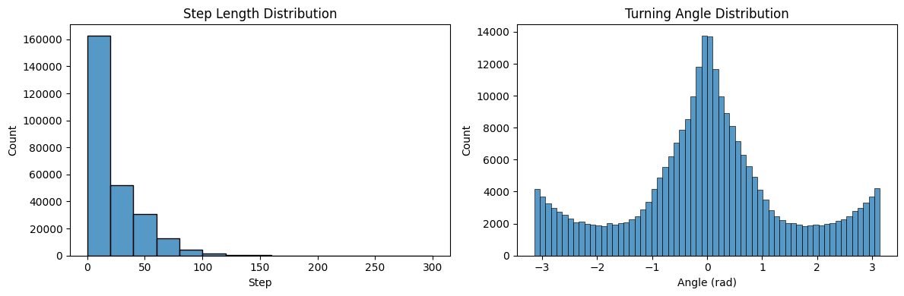

# Table of Contents

1. [Load Project](##Load-Project) 
2. [Calculate Step Length and Turn Angle](#Calculate-Step-Length-and-Turn-Angle)
    1. [Visualize Step and Angle Distribution](#Visualize-Step-and-Angle-Distribution)
3. [Run CoMPASS Level 1](#Run-CoMPASS-Level-1)
    1. [Check Results](#Check-results)
4. [Export HMM results](#Export-HMM-results---model-and-data)

# Load Project

```python
from pathlib import Path
import pandas as pd
from compass_labyrinth import load_project


project_path = Path(".").resolve() / "my_project_2"

# Import config and metadata
config, cohort_metadata = load_project(project_path=project_path)

# Import all sessions combined pose-estimation CSV
df_all_csv = pd.read_csv(project_path / "csvs" / "combined" / "Preprocessed_combined_file_exclusions.csv")

df_all_csv
```


<div>
<style scoped>
    .dataframe tbody tr th:only-of-type {
        vertical-align: middle;
    }

    .dataframe tbody tr th {
        vertical-align: top;
    }

    .dataframe thead th {
        text-align: right;
    }
</style>
<table border="1" class="dataframe">
  <thead>
    <tr style="text-align: right;">
      <th></th>
      <th>x</th>
      <th>y</th>
      <th>Grid Number</th>
      <th>likelihood</th>
      <th>S_no</th>
      <th>Region</th>
      <th>Session</th>
      <th>Genotype</th>
      <th>Sex</th>
      <th>NodeType</th>
      <th>Velocity</th>
    </tr>
  </thead>
  <tbody>
    <tr>
      <th>0</th>
      <td>275.057129</td>
      <td>875.337219</td>
      <td>47</td>
      <td>0.983259</td>
      <td>748</td>
      <td>entry_zone</td>
      <td>3</td>
      <td>WT</td>
      <td>Female</td>
      <td>Entry Nodes</td>
      <td>0.000000</td>
    </tr>
    <tr>
      <th>1</th>
      <td>271.037537</td>
      <td>872.005432</td>
      <td>47</td>
      <td>0.989085</td>
      <td>749</td>
      <td>entry_zone</td>
      <td>3</td>
      <td>WT</td>
      <td>Female</td>
      <td>Entry Nodes</td>
      <td>26.104563</td>
    </tr>
    <tr>
      <th>2</th>
      <td>267.526978</td>
      <td>873.733704</td>
      <td>47</td>
      <td>0.986050</td>
      <td>750</td>
      <td>entry_zone</td>
      <td>3</td>
      <td>WT</td>
      <td>Female</td>
      <td>Entry Nodes</td>
      <td>19.564603</td>
    </tr>
    <tr>
      <th>3</th>
      <td>265.571991</td>
      <td>873.412659</td>
      <td>47</td>
      <td>0.953975</td>
      <td>751</td>
      <td>entry_zone</td>
      <td>3</td>
      <td>WT</td>
      <td>Female</td>
      <td>Entry Nodes</td>
      <td>9.905860</td>
    </tr>
    <tr>
      <th>4</th>
      <td>266.325684</td>
      <td>874.166748</td>
      <td>47</td>
      <td>0.958631</td>
      <td>752</td>
      <td>entry_zone</td>
      <td>3</td>
      <td>WT</td>
      <td>Female</td>
      <td>Entry Nodes</td>
      <td>5.330815</td>
    </tr>
    <tr>
      <th>...</th>
      <td>...</td>
      <td>...</td>
      <td>...</td>
      <td>...</td>
      <td>...</td>
      <td>...</td>
      <td>...</td>
      <td>...</td>
      <td>...</td>
      <td>...</td>
      <td>...</td>
    </tr>
    <tr>
      <th>265495</th>
      <td>228.690262</td>
      <td>814.897949</td>
      <td>34</td>
      <td>0.999385</td>
      <td>225311</td>
      <td>reward_path</td>
      <td>7</td>
      <td>KO</td>
      <td>Female</td>
      <td>Non-Decision (Reward)</td>
      <td>293.221609</td>
    </tr>
    <tr>
      <th>265496</th>
      <td>292.517883</td>
      <td>837.722717</td>
      <td>46</td>
      <td>0.999992</td>
      <td>225312</td>
      <td>entry_zone</td>
      <td>7</td>
      <td>KO</td>
      <td>Female</td>
      <td>Entry Nodes</td>
      <td>338.929760</td>
    </tr>
    <tr>
      <th>265497</th>
      <td>295.305054</td>
      <td>862.294739</td>
      <td>47</td>
      <td>0.999458</td>
      <td>225313</td>
      <td>entry_zone</td>
      <td>7</td>
      <td>KO</td>
      <td>Female</td>
      <td>Entry Nodes</td>
      <td>123.647944</td>
    </tr>
    <tr>
      <th>265498</th>
      <td>295.361694</td>
      <td>876.922546</td>
      <td>47</td>
      <td>0.999976</td>
      <td>225314</td>
      <td>entry_zone</td>
      <td>7</td>
      <td>KO</td>
      <td>Female</td>
      <td>Entry Nodes</td>
      <td>73.139586</td>
    </tr>
    <tr>
      <th>265499</th>
      <td>294.444183</td>
      <td>901.016602</td>
      <td>47</td>
      <td>0.962276</td>
      <td>225315</td>
      <td>entry_zone</td>
      <td>7</td>
      <td>KO</td>
      <td>Female</td>
      <td>Entry Nodes</td>
      <td>120.557592</td>
    </tr>
  </tbody>
</table>
<p>265500 rows × 11 columns</p>
</div>


# Calculate Step Length and Turn Angle

```python
from compass_labyrinth.compass.level_1 import prep_data


# Run prep
final_df = prep_data(
    data=df_all_csv,
    type="UTM",                         # or "LL" if lon/lat in coordNames
    coordNames=("x", "y"),
    covNames=[],  # example covariates if present
    centers=None,                       # e.g., np.array([[0,0], [10,10]])
    centroids=None,                     # e.g., {"goal": goal_df_with_time}
    angleCovs=None,
    altCoordNames=None
)

print("\nSummary: Step")
print(final_df["step"].describe())

print("\nSummary: Angle (radians)")
print(final_df["angle"].describe())
```

    /opt/miniconda3/envs/compass-labyrinth/lib/python3.12/site-packages/tqdm/auto.py:21: TqdmWarning: IProgress not found. Please update jupyter and ipywidgets. See https://ipywidgets.readthedocs.io/en/stable/user_install.html
      from .autonotebook import tqdm as notebook_tqdm
    /Users/luiztauffer/Github/CoMPASS-Labyrinth/src/compass_labyrinth/compass/level_1/prep_data.py:159: FutureWarning: The default of observed=False is deprecated and will be changed to True in a future version of pandas. Pass observed=False to retain current behavior or observed=True to adopt the future default and silence this warning.
      for _id, g in df.groupby("ID", sort=False):


    
    Summary: Step
    count    265490.000000
    mean         21.121542
    std          23.254561
    min           0.000281
    25%           3.304319
    50%          12.055826
    75%          32.961413
    max         285.400817
    Name: step, dtype: float64
    
    Summary: Angle (radians)
    count    265490.000000
    mean          0.001154
    std           1.465752
    min          -3.141549
    25%          -0.723278
    50%           0.002277
    75%           0.723531
    max           3.141575
    Name: angle, dtype: float64


### Visualize Step and Angle Distribution

```python
from compass_labyrinth.compass.level_1 import plot_step_and_angle_distributions

plot_step_and_angle_distributions(
    config=config,
    df=final_df,
)
```

    Figure saved at: /Users/luiztauffer/Github/CoMPASS-Labyrinth/notebooks/my_project_2/figures/step_and_angle_distribution.pdf


    

    


# Run CoMPASS Level-1

Goal                               	R (momentuHMM)	                                  Python (SciPy analogue)
___________________________________________________________________________________________________________________________
Gradient-based optimization	      "BFGS", "L-BFGS-B"	                                 "BFGS", "L-BFGS-B"
Derivative-free (simplex)	         "Nelder-Mead"                                      	"Nelder-Mead"
Derivative-free (Newton-like)	         "nlm"                                              	"Powell

```python
from compass_labyrinth.compass.level_1 import fit_best_hmm
import numpy as np


# final_df must have: 'Session', 'step' (>0), 'angle' (radians)
res = fit_best_hmm(
    preproc_df=final_df,
    n_states=2,
    n_repetitions=1,
    opt_methods=["L-BFGS-B"],
    max_iter=50,
    use_abs_angle=(False,),          # True => |angle|~Gamma ; False => angle~VM
    stationary_flag="auto",
    use_data_driven_ranges=True,
    angle_mean_biased=(np.pi/2, 0.0),     # used for VM branch
    session_col="Session",
    seed=123,
    enforce_behavioral_constraints=False,
    show_progress=True
)
```

                                                                                                                                                                                                                                      

### Check results

- State 1 = low step + high turn angle
- State 2 = high step + low turn angle

```python
from compass_labyrinth.compass.level_1 import print_hmm_summary


print_hmm_summary(res.summary, res.model)

res.data.head()          # original df + HMM_State + posteriors
```

    
     Best Model Characteristics:
    • Angle type: von Mises
    • Optimizer: L-BFGS-B
    • AIC: 2836846.56 | logLik: -1418412.28
    • Start probs: [1.0, 0.0]
    • Transmat:
     [[0.8783 0.1217]
     [0.1102 0.8898]]
    • Step Means: [4.7984, 35.9023]
    • VM mu: [-3.057, 0.006]
    • VM kappa: [0.009, 1.98]
    • Met behavioral constraints: True
    • Final state ordering: State 1 = low step + high turn; State 2 = high step + low turn
    


<div>
<style scoped>
    .dataframe tbody tr th:only-of-type {
        vertical-align: middle;
    }

    .dataframe tbody tr th {
        vertical-align: top;
    }

    .dataframe thead th {
        text-align: right;
    }
</style>
<table border="1" class="dataframe">
  <thead>
    <tr style="text-align: right;">
      <th></th>
      <th>ID</th>
      <th>step</th>
      <th>angle</th>
      <th>x</th>
      <th>y</th>
      <th>Grid Number</th>
      <th>likelihood</th>
      <th>S_no</th>
      <th>Region</th>
      <th>Session</th>
      <th>Genotype</th>
      <th>Sex</th>
      <th>NodeType</th>
      <th>Velocity</th>
      <th>HMM_State</th>
      <th>Post_Prob_1</th>
      <th>Post_Prob_2</th>
    </tr>
  </thead>
  <tbody>
    <tr>
      <th>0</th>
      <td>3</td>
      <td>3.912921</td>
      <td>-1.149582</td>
      <td>267.526978</td>
      <td>873.733704</td>
      <td>47</td>
      <td>0.986050</td>
      <td>750</td>
      <td>entry_zone</td>
      <td>3</td>
      <td>WT</td>
      <td>Female</td>
      <td>Entry Nodes</td>
      <td>19.564603</td>
      <td>1.0</td>
      <td>NaN</td>
      <td>NaN</td>
    </tr>
    <tr>
      <th>1</th>
      <td>3</td>
      <td>1.981172</td>
      <td>0.620240</td>
      <td>265.571991</td>
      <td>873.412659</td>
      <td>47</td>
      <td>0.953975</td>
      <td>751</td>
      <td>entry_zone</td>
      <td>3</td>
      <td>WT</td>
      <td>Female</td>
      <td>Entry Nodes</td>
      <td>9.905860</td>
      <td>1.0</td>
      <td>NaN</td>
      <td>NaN</td>
    </tr>
    <tr>
      <th>2</th>
      <td>3</td>
      <td>1.066163</td>
      <td>-2.518697</td>
      <td>266.325684</td>
      <td>874.166748</td>
      <td>47</td>
      <td>0.958631</td>
      <td>752</td>
      <td>entry_zone</td>
      <td>3</td>
      <td>WT</td>
      <td>Female</td>
      <td>Entry Nodes</td>
      <td>5.330815</td>
      <td>1.0</td>
      <td>NaN</td>
      <td>NaN</td>
    </tr>
    <tr>
      <th>3</th>
      <td>3</td>
      <td>0.899351</td>
      <td>2.238799</td>
      <td>265.432495</td>
      <td>874.271851</td>
      <td>47</td>
      <td>0.932229</td>
      <td>753</td>
      <td>entry_zone</td>
      <td>3</td>
      <td>WT</td>
      <td>Female</td>
      <td>Entry Nodes</td>
      <td>4.496755</td>
      <td>1.0</td>
      <td>NaN</td>
      <td>NaN</td>
    </tr>
    <tr>
      <th>4</th>
      <td>3</td>
      <td>0.519677</td>
      <td>1.625876</td>
      <td>265.400269</td>
      <td>873.753174</td>
      <td>47</td>
      <td>0.909978</td>
      <td>754</td>
      <td>entry_zone</td>
      <td>3</td>
      <td>WT</td>
      <td>Female</td>
      <td>Entry Nodes</td>
      <td>2.598385</td>
      <td>1.0</td>
      <td>NaN</td>
      <td>NaN</td>
    </tr>
  </tbody>
</table>
</div>


```python
res.data.HMM_State.value_counts()
```


    HMM_State
    2.0    139108
    1.0    126382
    Name: count, dtype: int64


# Export HMM results - model and data

```python
res.save(config=config)
```

      ✓ Saved model summary: model_summary.json
      ✓ Saved data with states: data_with_states.csv
      ✓ Saved model selection records: model_selection_records.csv
      ✓ Saved fitted model: fitted_model.joblib
    
    📁 All CoMPASS Level 1 results saved to: /Users/luiztauffer/Github/CoMPASS-Labyrinth/notebooks/my_project_2/results/compass_level_1

