# Table of Contents

1. [Load Project](#Load-Project)
    1. [Load the HMM results](#Load-the-HMM-results)
2. [Data Stream 1: KDE](#Data-Stream-1:-Kernel-Density-Estimation-(KDE))
3. [Data Stream 2: Targeted Angle](#Data-Stream-2:-Targeted-Angle)
4. [Data Stream 3: Value-based Distance](#Data-Stream-3:-Value-based-Distance)
    1. [Spatial Embedding](#Spatial-Embedding-across-the-maze-(based-on-Value-map))
5. [Run CoMPASS Level-2](#Run-CoMPASS-Level-2)
    1. [Visualize CV results](#Visualize-CV-results)
6. [Create 4 level HHMM States](#Create-4-level-HHMM-States)
7. [Observe the raw state sequence](#Observe-the-raw-state-sequence)
8. [Observe the HHMM state sequence](#Observe-the-HHMM-state-sequence)

# Load Project

```python
from pathlib import Path
import pandas as pd
from compass_labyrinth import load_project


project_path = Path(".").resolve() / "my_project_2"

# Import config and metadata
config, cohort_metadata = load_project(project_path=project_path)
```

### Load the HMM results

```python
df_hmm = pd.read_csv(project_path / "results" / "compass_level_1" / "data_with_states.csv")
df_hmm
```


<div>
<style scoped>
    .dataframe tbody tr th:only-of-type {
        vertical-align: middle;
    }

    .dataframe tbody tr th {
        vertical-align: top;
    }

    .dataframe thead th {
        text-align: right;
    }
</style>
<table border="1" class="dataframe">
  <thead>
    <tr style="text-align: right;">
      <th></th>
      <th>ID</th>
      <th>step</th>
      <th>angle</th>
      <th>x</th>
      <th>y</th>
      <th>Grid Number</th>
      <th>likelihood</th>
      <th>S_no</th>
      <th>Region</th>
      <th>Session</th>
      <th>Genotype</th>
      <th>Sex</th>
      <th>NodeType</th>
      <th>Velocity</th>
      <th>HMM_State</th>
      <th>Post_Prob_1</th>
      <th>Post_Prob_2</th>
    </tr>
  </thead>
  <tbody>
    <tr>
      <th>0</th>
      <td>3</td>
      <td>3.912921</td>
      <td>-1.149582</td>
      <td>267.526978</td>
      <td>873.733704</td>
      <td>47</td>
      <td>0.986050</td>
      <td>750</td>
      <td>entry_zone</td>
      <td>3</td>
      <td>WT</td>
      <td>Female</td>
      <td>Entry Nodes</td>
      <td>19.564603</td>
      <td>1.0</td>
      <td>NaN</td>
      <td>NaN</td>
    </tr>
    <tr>
      <th>1</th>
      <td>3</td>
      <td>1.981172</td>
      <td>0.620240</td>
      <td>265.571991</td>
      <td>873.412659</td>
      <td>47</td>
      <td>0.953975</td>
      <td>751</td>
      <td>entry_zone</td>
      <td>3</td>
      <td>WT</td>
      <td>Female</td>
      <td>Entry Nodes</td>
      <td>9.905860</td>
      <td>1.0</td>
      <td>NaN</td>
      <td>NaN</td>
    </tr>
    <tr>
      <th>2</th>
      <td>3</td>
      <td>1.066163</td>
      <td>-2.518697</td>
      <td>266.325684</td>
      <td>874.166748</td>
      <td>47</td>
      <td>0.958631</td>
      <td>752</td>
      <td>entry_zone</td>
      <td>3</td>
      <td>WT</td>
      <td>Female</td>
      <td>Entry Nodes</td>
      <td>5.330815</td>
      <td>1.0</td>
      <td>NaN</td>
      <td>NaN</td>
    </tr>
    <tr>
      <th>3</th>
      <td>3</td>
      <td>0.899351</td>
      <td>2.238799</td>
      <td>265.432495</td>
      <td>874.271851</td>
      <td>47</td>
      <td>0.932229</td>
      <td>753</td>
      <td>entry_zone</td>
      <td>3</td>
      <td>WT</td>
      <td>Female</td>
      <td>Entry Nodes</td>
      <td>4.496755</td>
      <td>1.0</td>
      <td>NaN</td>
      <td>NaN</td>
    </tr>
    <tr>
      <th>4</th>
      <td>3</td>
      <td>0.519677</td>
      <td>1.625876</td>
      <td>265.400269</td>
      <td>873.753174</td>
      <td>47</td>
      <td>0.909978</td>
      <td>754</td>
      <td>entry_zone</td>
      <td>3</td>
      <td>WT</td>
      <td>Female</td>
      <td>Entry Nodes</td>
      <td>2.598385</td>
      <td>1.0</td>
      <td>NaN</td>
      <td>NaN</td>
    </tr>
    <tr>
      <th>...</th>
      <td>...</td>
      <td>...</td>
      <td>...</td>
      <td>...</td>
      <td>...</td>
      <td>...</td>
      <td>...</td>
      <td>...</td>
      <td>...</td>
      <td>...</td>
      <td>...</td>
      <td>...</td>
      <td>...</td>
      <td>...</td>
      <td>...</td>
      <td>...</td>
      <td>...</td>
    </tr>
    <tr>
      <th>265485</th>
      <td>7</td>
      <td>58.644322</td>
      <td>-0.866077</td>
      <td>228.690262</td>
      <td>814.897949</td>
      <td>34</td>
      <td>0.999385</td>
      <td>225311</td>
      <td>reward_path</td>
      <td>7</td>
      <td>KO</td>
      <td>Female</td>
      <td>Non-Decision (Reward)</td>
      <td>293.221609</td>
      <td>2.0</td>
      <td>NaN</td>
      <td>NaN</td>
    </tr>
    <tr>
      <th>265486</th>
      <td>7</td>
      <td>67.785952</td>
      <td>0.178698</td>
      <td>292.517883</td>
      <td>837.722717</td>
      <td>46</td>
      <td>0.999992</td>
      <td>225312</td>
      <td>entry_zone</td>
      <td>7</td>
      <td>KO</td>
      <td>Female</td>
      <td>Entry Nodes</td>
      <td>338.929760</td>
      <td>2.0</td>
      <td>NaN</td>
      <td>NaN</td>
    </tr>
    <tr>
      <th>265487</th>
      <td>7</td>
      <td>24.729589</td>
      <td>1.114421</td>
      <td>295.305054</td>
      <td>862.294739</td>
      <td>47</td>
      <td>0.999458</td>
      <td>225313</td>
      <td>entry_zone</td>
      <td>7</td>
      <td>KO</td>
      <td>Female</td>
      <td>Entry Nodes</td>
      <td>123.647944</td>
      <td>2.0</td>
      <td>NaN</td>
      <td>NaN</td>
    </tr>
    <tr>
      <th>265488</th>
      <td>7</td>
      <td>14.627917</td>
      <td>0.109074</td>
      <td>295.361694</td>
      <td>876.922546</td>
      <td>47</td>
      <td>0.999976</td>
      <td>225314</td>
      <td>entry_zone</td>
      <td>7</td>
      <td>KO</td>
      <td>Female</td>
      <td>Entry Nodes</td>
      <td>73.139586</td>
      <td>2.0</td>
      <td>NaN</td>
      <td>NaN</td>
    </tr>
    <tr>
      <th>265489</th>
      <td>7</td>
      <td>24.111518</td>
      <td>0.041934</td>
      <td>294.444183</td>
      <td>901.016602</td>
      <td>47</td>
      <td>0.962276</td>
      <td>225315</td>
      <td>entry_zone</td>
      <td>7</td>
      <td>KO</td>
      <td>Female</td>
      <td>Entry Nodes</td>
      <td>120.557592</td>
      <td>2.0</td>
      <td>NaN</td>
      <td>NaN</td>
    </tr>
  </tbody>
</table>
<p>265490 rows × 17 columns</p>
</div>


# Data Stream 1: Kernel Density Estimation (KDE)

This workflow optimizes and applies kernel density estimation (KDE) to spatial navigation data using Leave-One-Session-Out (LOSO) cross-validation. It selects the best spatial smoothing parameter (sigma), computes session-wise KDE values, and visualizes the resulting density maps.

```python
from compass_labyrinth.compass.level_2 import (
    loso_kde_cv,
    compute_kde_scaled,
)


# Define bandwidth search space
smoothing_factors = [0.5, 2, 4]

# Run LOSO CV to get best sigma
best_sigma = loso_kde_cv(df_hmm, smoothing_factors)

# Compute KDE using optimal sigma
df_hmm = compute_kde_scaled(df_hmm, best_sigma)
```

    Testing for sigma =  0.5
    Testing for sigma =  2
    Testing for sigma =  4
    Best Sigma =  0.5
    Computing KDE for Session 3...
    Computing KDE for Session 4...
    Computing KDE for Session 5...
    Computing KDE for Session 6...
    Computing KDE for Session 7...


# Data Stream 2: Targeted Angle

This workflow computes the angular deviation of the animal's movement from a defined reference axis for each grid location in the maze. It incorporates spatial smoothing by mapping each grid to a reference node, calculates mean node positions, and derives angular deviation vectors session-wise.

```python
from compass_labyrinth.compass.level_2 import (
    assign_reference_info,
    compute_angle_deviation,
)


ROLLING_WINDOW = 5

# Reference Info
df_hmm = assign_reference_info(df_hmm)

# Compute angle deviation
df_hmm = compute_angle_deviation(df_hmm, rolling_window=ROLLING_WINDOW)
```

# Data Stream 3: Value-based Distance

This workflow computes a normalized, value-weighted distance of each animal position from a central target region (e.g., Grid 84 and 85). This metric can be used to quantify how spatially aligned behavior is with goal-relevant zones.

```python
from compass_labyrinth.compass.level_2 import compute_value_distance


# Run the value distance computation pipeline
df_hmm = compute_value_distance(df_hmm, center_grids=[84, 85])
```

## Spatial Embedding across the maze (based on Value-map)

```python
from compass_labyrinth.compass.level_2 import (
    compute_spatial_embedding,
    create_embedding_grid,
    plot_spatial_embedding,
)


# Compute Smoothed Spatial Embedding
# Apply spatial smoothing over the dataframe using a Gaussian kernel (sigma = 2)
# This function generates a local average of behavioral or positional metrics
df_smoothed = compute_spatial_embedding(df_hmm, sigma=2)

# Convert Smoothed Data to Grid Format
embedding_grid = create_embedding_grid(df_smoothed)

# Visualize Spatial Embedding as Heatmap
# Plot a heatmap of the smoothed behavioral embedding
plot_spatial_embedding(
    config=config,
    embedding_grid=embedding_grid,
)
```

    Figure saved at: /Users/luiztauffer/Github/CoMPASS-Labyrinth/notebooks/my_project_2/figures/spatial_embedding_heatmap.pdf


    
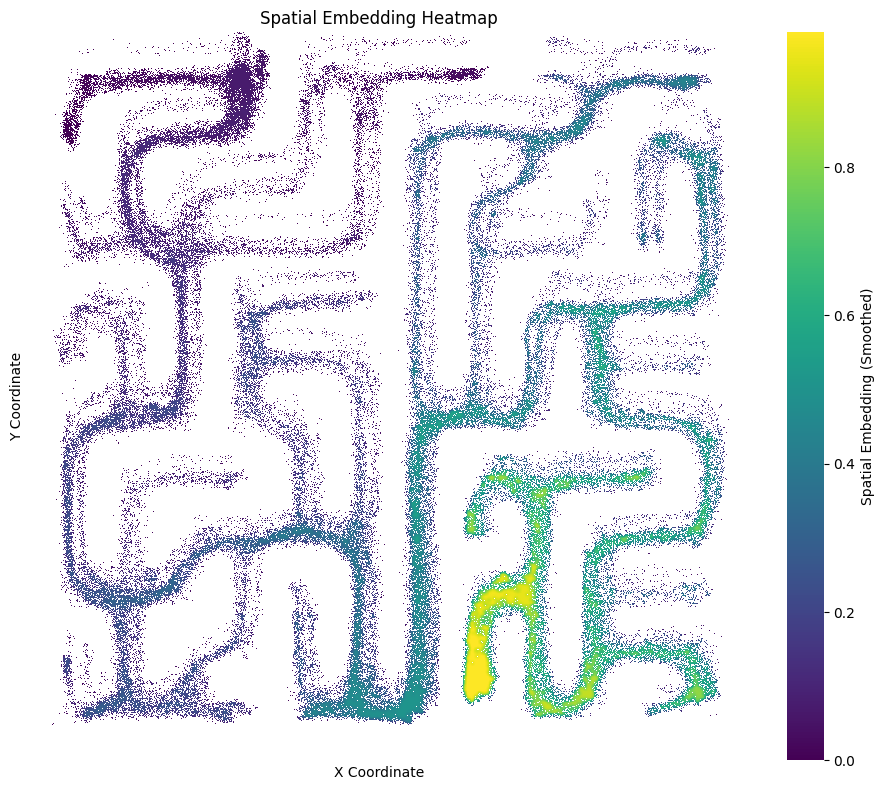
    


# Run CoMPASS Level-2

```python
from compass_labyrinth.compass.level_2 import run_compass


features = ['HMM_State','VB_Distance','Targeted_Angle_smooth_abs','KDE']

df_hier, cv_results = run_compass(
    config=config,
    df=df_hmm,
    features=features,
    phase_options=[5],                 # different phase options can be tested out
    ncomp_options=[2, 3],
    k_options=[2, 3],
    reg_options=[1e-4, 1e-5, 1e-6],
    terminal_values=[47],              # entry node --> starting point
    bout_col='Bout_ID',
    patience=None,
    patience_candidates=[2, 3, 5, 10]  # (only used if patience == 'tune')
)
```

    
    === CV | Test: Session 3 - Phase 1/5 ===


    Even though the 'weights_' attribute is set, it will be overwritten during initialization because 'init_params' contains 'w'
    Even though the 'means_' attribute is set, it will be overwritten during initialization because 'init_params' contains 'm'
    Even though the 'covars_' attribute is set, it will be overwritten during initialization because 'init_params' contains 'c'
    Model is not converging.  Current: 32802.802904054675 is not greater than 171976.91901323298. Delta is -139174.1161091783
    Covariance of state #1, mixture #0 has a null eigenvalue.
    Covariance of state #1, mixture #0 has a null eigenvalue.
    Even though the 'weights_' attribute is set, it will be overwritten during initialization because 'init_params' contains 'w'
    Even though the 'means_' attribute is set, it will be overwritten during initialization because 'init_params' contains 'm'
    Even though the 'covars_' attribute is set, it will be overwritten during initialization because 'init_params' contains 'c'
    Model is not converging.  Current: 32802.80290430626 is not greater than 171976.91901595655. Delta is -139174.11611165028
    Covariance of state #1, mixture #0 has a null eigenvalue.
    Covariance of state #1, mixture #0 has a null eigenvalue.
    Even though the 'weights_' attribute is set, it will be overwritten during initialization because 'init_params' contains 'w'
    Even though the 'means_' attribute is set, it will be overwritten during initialization because 'init_params' contains 'm'
    Even though the 'covars_' attribute is set, it will be overwritten during initialization because 'init_params' contains 'c'
    Model is not converging.  Current: 32802.802904054675 is not greater than 171976.91901323298. Delta is -139174.1161091783
    Covariance of state #1, mixture #0 has a null eigenvalue.
    Covariance of state #1, mixture #0 has a null eigenvalue.
    Even though the 'weights_' attribute is set, it will be overwritten during initialization because 'init_params' contains 'w'
    Even though the 'means_' attribute is set, it will be overwritten during initialization because 'init_params' contains 'm'
    Even though the 'covars_' attribute is set, it will be overwritten during initialization because 'init_params' contains 'c'
    Model is not converging.  Current: 95620.37265787195 is not greater than 338575.1680819058. Delta is -242954.79542403386
    Covariance of state #0, mixture #2 has a null eigenvalue.
    Covariance of state #1, mixture #0 has a null eigenvalue.
    Covariance of state #1, mixture #1 has a null eigenvalue.
    Covariance of state #1, mixture #2 has a null eigenvalue.
    Covariance of state #0, mixture #2 has a null eigenvalue.
    Covariance of state #1, mixture #0 has a null eigenvalue.
    Covariance of state #1, mixture #1 has a null eigenvalue.
    Covariance of state #1, mixture #2 has a null eigenvalue.
    Even though the 'weights_' attribute is set, it will be overwritten during initialization because 'init_params' contains 'w'
    Even though the 'means_' attribute is set, it will be overwritten during initialization because 'init_params' contains 'm'
    Even though the 'covars_' attribute is set, it will be overwritten during initialization because 'init_params' contains 'c'
    Model is not converging.  Current: 95620.83457358406 is not greater than 338206.8070622314. Delta is -242585.97248864736
    Covariance of state #0, mixture #2 has a null eigenvalue.
    Covariance of state #1, mixture #0 has a null eigenvalue.
    Covariance of state #1, mixture #1 has a null eigenvalue.
    Covariance of state #1, mixture #2 has a null eigenvalue.
    Covariance of state #0, mixture #2 has a null eigenvalue.
    Covariance of state #1, mixture #0 has a null eigenvalue.
    Covariance of state #1, mixture #1 has a null eigenvalue.
    Covariance of state #1, mixture #2 has a null eigenvalue.
    Even though the 'weights_' attribute is set, it will be overwritten during initialization because 'init_params' contains 'w'
    Even though the 'means_' attribute is set, it will be overwritten during initialization because 'init_params' contains 'm'
    Even though the 'covars_' attribute is set, it will be overwritten during initialization because 'init_params' contains 'c'
    Model is not converging.  Current: 95620.37265864675 is not greater than 338575.1680718925. Delta is -242954.79541324577
    Covariance of state #0, mixture #2 has a null eigenvalue.
    Covariance of state #1, mixture #0 has a null eigenvalue.
    Covariance of state #1, mixture #1 has a null eigenvalue.
    Covariance of state #1, mixture #2 has a null eigenvalue.
    Covariance of state #0, mixture #2 has a null eigenvalue.
    Covariance of state #1, mixture #0 has a null eigenvalue.
    Covariance of state #1, mixture #1 has a null eigenvalue.
    Covariance of state #1, mixture #2 has a null eigenvalue.
    Even though the 'weights_' attribute is set, it will be overwritten during initialization because 'init_params' contains 'w'
    Even though the 'means_' attribute is set, it will be overwritten during initialization because 'init_params' contains 'm'
    Even though the 'covars_' attribute is set, it will be overwritten during initialization because 'init_params' contains 'c'
    Model is not converging.  Current: 44353.59753314793 is not greater than 98592.81923030602. Delta is -54239.22169715809
    Covariance of state #1, mixture #1 has a null eigenvalue.
    Covariance of state #1, mixture #1 has a null eigenvalue.
    Even though the 'weights_' attribute is set, it will be overwritten during initialization because 'init_params' contains 'w'
    Even though the 'means_' attribute is set, it will be overwritten during initialization because 'init_params' contains 'm'
    Even though the 'covars_' attribute is set, it will be overwritten during initialization because 'init_params' contains 'c'
    Model is not converging.  Current: 44353.597533100285 is not greater than 98592.81922245116. Delta is -54239.221689350874
    Covariance of state #1, mixture #1 has a null eigenvalue.
    Covariance of state #1, mixture #1 has a null eigenvalue.
    Even though the 'weights_' attribute is set, it will be overwritten during initialization because 'init_params' contains 'w'
    Even though the 'means_' attribute is set, it will be overwritten during initialization because 'init_params' contains 'm'
    Even though the 'covars_' attribute is set, it will be overwritten during initialization because 'init_params' contains 'c'
    Model is not converging.  Current: 44353.59753315052 is not greater than 98592.81922654089. Delta is -54239.22169339037
    Covariance of state #1, mixture #1 has a null eigenvalue.
    Covariance of state #1, mixture #1 has a null eigenvalue.
    Even though the 'weights_' attribute is set, it will be overwritten during initialization because 'init_params' contains 'w'
    Even though the 'means_' attribute is set, it will be overwritten during initialization because 'init_params' contains 'm'
    Even though the 'covars_' attribute is set, it will be overwritten during initialization because 'init_params' contains 'c'
    Model is not converging.  Current: 133911.95454789212 is not greater than 135174.0969423839. Delta is -1262.1423944917915
    Covariance of state #0, mixture #0 has a null eigenvalue.
    Covariance of state #1, mixture #0 has a null eigenvalue.
    Covariance of state #1, mixture #2 has a null eigenvalue.
    Covariance of state #2, mixture #1 has a null eigenvalue.
    Covariance of state #2, mixture #2 has a null eigenvalue.
    Covariance of state #0, mixture #0 has a null eigenvalue.
    Covariance of state #1, mixture #0 has a null eigenvalue.
    Covariance of state #1, mixture #2 has a null eigenvalue.
    Covariance of state #2, mixture #1 has a null eigenvalue.
    Covariance of state #2, mixture #2 has a null eigenvalue.
    Even though the 'weights_' attribute is set, it will be overwritten during initialization because 'init_params' contains 'w'
    Even though the 'means_' attribute is set, it will be overwritten during initialization because 'init_params' contains 'm'
    Even though the 'covars_' attribute is set, it will be overwritten during initialization because 'init_params' contains 'c'
    Model is not converging.  Current: 133911.95454809134 is not greater than 135174.0969422785. Delta is -1262.1423941871617
    Covariance of state #0, mixture #0 has a null eigenvalue.
    Covariance of state #1, mixture #0 has a null eigenvalue.
    Covariance of state #1, mixture #2 has a null eigenvalue.
    Covariance of state #2, mixture #1 has a null eigenvalue.
    Covariance of state #2, mixture #2 has a null eigenvalue.
    Covariance of state #0, mixture #0 has a null eigenvalue.
    Covariance of state #1, mixture #0 has a null eigenvalue.
    Covariance of state #1, mixture #2 has a null eigenvalue.
    Covariance of state #2, mixture #1 has a null eigenvalue.
    Covariance of state #2, mixture #2 has a null eigenvalue.
    Even though the 'weights_' attribute is set, it will be overwritten during initialization because 'init_params' contains 'w'
    Even though the 'means_' attribute is set, it will be overwritten during initialization because 'init_params' contains 'm'
    Even though the 'covars_' attribute is set, it will be overwritten during initialization because 'init_params' contains 'c'
    Model is not converging.  Current: 133911.9545481414 is not greater than 135174.09694283892. Delta is -1262.1423946975265
    Covariance of state #0, mixture #0 has a null eigenvalue.
    Covariance of state #1, mixture #0 has a null eigenvalue.
    Covariance of state #1, mixture #2 has a null eigenvalue.
    Covariance of state #2, mixture #1 has a null eigenvalue.
    Covariance of state #2, mixture #2 has a null eigenvalue.
    Covariance of state #0, mixture #0 has a null eigenvalue.
    Covariance of state #1, mixture #0 has a null eigenvalue.
    Covariance of state #1, mixture #2 has a null eigenvalue.
    Covariance of state #2, mixture #1 has a null eigenvalue.
    Covariance of state #2, mixture #2 has a null eigenvalue.
    Even though the 'weights_' attribute is set, it will be overwritten during initialization because 'init_params' contains 'w'
    Even though the 'means_' attribute is set, it will be overwritten during initialization because 'init_params' contains 'm'
    Even though the 'covars_' attribute is set, it will be overwritten during initialization because 'init_params' contains 'c'
    Model is not converging.  Current: 34390.862594695376 is not greater than 70423.34389310931. Delta is -36032.481298413935
    Covariance of state #1, mixture #0 has a null eigenvalue.
    Covariance of state #1, mixture #0 has a null eigenvalue.
    Even though the 'weights_' attribute is set, it will be overwritten during initialization because 'init_params' contains 'w'
    Even though the 'means_' attribute is set, it will be overwritten during initialization because 'init_params' contains 'm'
    Even though the 'covars_' attribute is set, it will be overwritten during initialization because 'init_params' contains 'c'
    Model is not converging.  Current: 34390.862594850194 is not greater than 70423.34389350508. Delta is -36032.481298654886
    Covariance of state #1, mixture #0 has a null eigenvalue.
    Covariance of state #1, mixture #0 has a null eigenvalue.
    Even though the 'weights_' attribute is set, it will be overwritten during initialization because 'init_params' contains 'w'
    Even though the 'means_' attribute is set, it will be overwritten during initialization because 'init_params' contains 'm'
    Even though the 'covars_' attribute is set, it will be overwritten during initialization because 'init_params' contains 'c'
    Model is not converging.  Current: 34390.862594631624 is not greater than 70423.34389283406. Delta is -36032.48129820244
    Covariance of state #1, mixture #0 has a null eigenvalue.
    Covariance of state #1, mixture #0 has a null eigenvalue.
    Even though the 'weights_' attribute is set, it will be overwritten during initialization because 'init_params' contains 'w'
    Even though the 'means_' attribute is set, it will be overwritten during initialization because 'init_params' contains 'm'
    Even though the 'covars_' attribute is set, it will be overwritten during initialization because 'init_params' contains 'c'
    Model is not converging.  Current: 101329.93963045234 is not greater than 115265.47514679976. Delta is -13935.535516347416
    Covariance of state #0, mixture #2 has a null eigenvalue.
    Covariance of state #1, mixture #0 has a null eigenvalue.
    Covariance of state #1, mixture #1 has a null eigenvalue.
    Covariance of state #1, mixture #2 has a null eigenvalue.
    Covariance of state #0, mixture #2 has a null eigenvalue.
    Covariance of state #1, mixture #0 has a null eigenvalue.
    Covariance of state #1, mixture #1 has a null eigenvalue.
    Covariance of state #1, mixture #2 has a null eigenvalue.
    Even though the 'weights_' attribute is set, it will be overwritten during initialization because 'init_params' contains 'w'
    Even though the 'means_' attribute is set, it will be overwritten during initialization because 'init_params' contains 'm'
    Even though the 'covars_' attribute is set, it will be overwritten during initialization because 'init_params' contains 'c'
    Model is not converging.  Current: 101329.35960424923 is not greater than 115265.47514704274. Delta is -13936.115542793515
    Covariance of state #0, mixture #2 has a null eigenvalue.
    Covariance of state #1, mixture #0 has a null eigenvalue.
    Covariance of state #1, mixture #1 has a null eigenvalue.
    Covariance of state #1, mixture #2 has a null eigenvalue.
    Covariance of state #0, mixture #2 has a null eigenvalue.
    Covariance of state #1, mixture #0 has a null eigenvalue.
    Covariance of state #1, mixture #1 has a null eigenvalue.
    Covariance of state #1, mixture #2 has a null eigenvalue.
    Even though the 'weights_' attribute is set, it will be overwritten during initialization because 'init_params' contains 'w'
    Even though the 'means_' attribute is set, it will be overwritten during initialization because 'init_params' contains 'm'
    Even though the 'covars_' attribute is set, it will be overwritten during initialization because 'init_params' contains 'c'
    Model is not converging.  Current: 101329.93963040852 is not greater than 115265.47514701095. Delta is -13935.535516602424
    Covariance of state #0, mixture #2 has a null eigenvalue.
    Covariance of state #1, mixture #0 has a null eigenvalue.
    Covariance of state #1, mixture #1 has a null eigenvalue.
    Covariance of state #1, mixture #2 has a null eigenvalue.
    Covariance of state #0, mixture #2 has a null eigenvalue.
    Covariance of state #1, mixture #0 has a null eigenvalue.
    Covariance of state #1, mixture #1 has a null eigenvalue.
    Covariance of state #1, mixture #2 has a null eigenvalue.
    Even though the 'weights_' attribute is set, it will be overwritten during initialization because 'init_params' contains 'w'
    Even though the 'means_' attribute is set, it will be overwritten during initialization because 'init_params' contains 'm'
    Even though the 'covars_' attribute is set, it will be overwritten during initialization because 'init_params' contains 'c'
    Model is not converging.  Current: 124716.20243540707 is not greater than 177916.2958088644. Delta is -53200.093373457334
    Covariance of state #0, mixture #0 has a null eigenvalue.
    Covariance of state #0, mixture #1 has a null eigenvalue.
    Covariance of state #1, mixture #0 has a null eigenvalue.
    Covariance of state #1, mixture #1 has a null eigenvalue.
    Covariance of state #0, mixture #0 has a null eigenvalue.
    Covariance of state #0, mixture #1 has a null eigenvalue.
    Covariance of state #1, mixture #0 has a null eigenvalue.
    Covariance of state #1, mixture #1 has a null eigenvalue.
    Even though the 'weights_' attribute is set, it will be overwritten during initialization because 'init_params' contains 'w'
    Even though the 'means_' attribute is set, it will be overwritten during initialization because 'init_params' contains 'm'
    Even though the 'covars_' attribute is set, it will be overwritten during initialization because 'init_params' contains 'c'
    Model is not converging.  Current: 124716.20243059765 is not greater than 177916.29580660348. Delta is -53200.093376005825
    Covariance of state #0, mixture #0 has a null eigenvalue.
    Covariance of state #0, mixture #1 has a null eigenvalue.
    Covariance of state #1, mixture #0 has a null eigenvalue.
    Covariance of state #1, mixture #1 has a null eigenvalue.
    Covariance of state #0, mixture #0 has a null eigenvalue.
    Covariance of state #0, mixture #1 has a null eigenvalue.
    Covariance of state #1, mixture #0 has a null eigenvalue.
    Covariance of state #1, mixture #1 has a null eigenvalue.
    Even though the 'weights_' attribute is set, it will be overwritten during initialization because 'init_params' contains 'w'
    Even though the 'means_' attribute is set, it will be overwritten during initialization because 'init_params' contains 'm'
    Even though the 'covars_' attribute is set, it will be overwritten during initialization because 'init_params' contains 'c'
    Model is not converging.  Current: 124716.20243070989 is not greater than 177916.29580714685. Delta is -53200.093376436955
    Covariance of state #0, mixture #0 has a null eigenvalue.
    Covariance of state #0, mixture #1 has a null eigenvalue.
    Covariance of state #1, mixture #0 has a null eigenvalue.
    Covariance of state #1, mixture #1 has a null eigenvalue.
    Covariance of state #0, mixture #0 has a null eigenvalue.
    Covariance of state #0, mixture #1 has a null eigenvalue.
    Covariance of state #1, mixture #0 has a null eigenvalue.
    Covariance of state #1, mixture #1 has a null eigenvalue.
    Even though the 'weights_' attribute is set, it will be overwritten during initialization because 'init_params' contains 'w'
    Even though the 'means_' attribute is set, it will be overwritten during initialization because 'init_params' contains 'm'
    Even though the 'covars_' attribute is set, it will be overwritten during initialization because 'init_params' contains 'c'
    Model is not converging.  Current: 104319.09419682712 is not greater than 108177.0962452012. Delta is -3858.002048374081
    Covariance of state #0, mixture #0 has a null eigenvalue.
    Covariance of state #0, mixture #2 has a null eigenvalue.
    Covariance of state #1, mixture #2 has a null eigenvalue.
    Covariance of state #0, mixture #0 has a null eigenvalue.
    Covariance of state #0, mixture #2 has a null eigenvalue.
    Covariance of state #1, mixture #2 has a null eigenvalue.
    Even though the 'weights_' attribute is set, it will be overwritten during initialization because 'init_params' contains 'w'
    Even though the 'means_' attribute is set, it will be overwritten during initialization because 'init_params' contains 'm'
    Even though the 'covars_' attribute is set, it will be overwritten during initialization because 'init_params' contains 'c'
    Model is not converging.  Current: 104319.09419688267 is not greater than 108177.09624518568. Delta is -3858.0020483030094
    Covariance of state #0, mixture #0 has a null eigenvalue.
    Covariance of state #0, mixture #2 has a null eigenvalue.
    Covariance of state #1, mixture #2 has a null eigenvalue.
    Covariance of state #0, mixture #0 has a null eigenvalue.
    Covariance of state #0, mixture #2 has a null eigenvalue.
    Covariance of state #1, mixture #2 has a null eigenvalue.
    Even though the 'weights_' attribute is set, it will be overwritten during initialization because 'init_params' contains 'w'
    Even though the 'means_' attribute is set, it will be overwritten during initialization because 'init_params' contains 'm'
    Even though the 'covars_' attribute is set, it will be overwritten during initialization because 'init_params' contains 'c'
    Model is not converging.  Current: 104319.09419689958 is not greater than 108177.09624519695. Delta is -3858.0020482973778
    Covariance of state #0, mixture #0 has a null eigenvalue.
    Covariance of state #0, mixture #2 has a null eigenvalue.
    Covariance of state #1, mixture #2 has a null eigenvalue.
    Covariance of state #0, mixture #0 has a null eigenvalue.
    Covariance of state #0, mixture #2 has a null eigenvalue.
    Covariance of state #1, mixture #2 has a null eigenvalue.
    Even though the 'weights_' attribute is set, it will be overwritten during initialization because 'init_params' contains 'w'
    Even though the 'means_' attribute is set, it will be overwritten during initialization because 'init_params' contains 'm'
    Even though the 'covars_' attribute is set, it will be overwritten during initialization because 'init_params' contains 'c'
    Model is not converging.  Current: 25991.477184521085 is not greater than 37837.384896041476. Delta is -11845.90771152039
    Covariance of state #1, mixture #0 has a null eigenvalue.
    Covariance of state #1, mixture #1 has a null eigenvalue.
    Covariance of state #1, mixture #0 has a null eigenvalue.
    Covariance of state #1, mixture #1 has a null eigenvalue.
    Even though the 'weights_' attribute is set, it will be overwritten during initialization because 'init_params' contains 'w'
    Even though the 'means_' attribute is set, it will be overwritten during initialization because 'init_params' contains 'm'
    Even though the 'covars_' attribute is set, it will be overwritten during initialization because 'init_params' contains 'c'
    Model is not converging.  Current: 25991.477145337212 is not greater than 37837.38697115532. Delta is -11845.909825818107
    Covariance of state #1, mixture #0 has a null eigenvalue.
    Covariance of state #1, mixture #1 has a null eigenvalue.
    Covariance of state #1, mixture #0 has a null eigenvalue.
    Covariance of state #1, mixture #1 has a null eigenvalue.
    Even though the 'weights_' attribute is set, it will be overwritten during initialization because 'init_params' contains 'w'
    Even though the 'means_' attribute is set, it will be overwritten during initialization because 'init_params' contains 'm'
    Even though the 'covars_' attribute is set, it will be overwritten during initialization because 'init_params' contains 'c'
    Model is not converging.  Current: 25991.477204115403 is not greater than 37837.38385849076. Delta is -11845.906654375354
    Covariance of state #1, mixture #0 has a null eigenvalue.
    Covariance of state #1, mixture #1 has a null eigenvalue.
    Covariance of state #1, mixture #0 has a null eigenvalue.
    Covariance of state #1, mixture #1 has a null eigenvalue.
    Even though the 'weights_' attribute is set, it will be overwritten during initialization because 'init_params' contains 'w'
    Even though the 'means_' attribute is set, it will be overwritten during initialization because 'init_params' contains 'm'
    Even though the 'covars_' attribute is set, it will be overwritten during initialization because 'init_params' contains 'c'
    Model is not converging.  Current: 78798.21337950014 is not greater than 92152.00442206621. Delta is -13353.791042566067
    Covariance of state #0, mixture #0 has a null eigenvalue.
    Covariance of state #0, mixture #1 has a null eigenvalue.
    Covariance of state #0, mixture #2 has a null eigenvalue.
    Covariance of state #1, mixture #1 has a null eigenvalue.
    Covariance of state #1, mixture #2 has a null eigenvalue.
    Covariance of state #0, mixture #0 has a null eigenvalue.
    Covariance of state #0, mixture #1 has a null eigenvalue.
    Covariance of state #0, mixture #2 has a null eigenvalue.
    Covariance of state #1, mixture #1 has a null eigenvalue.
    Covariance of state #1, mixture #2 has a null eigenvalue.
    Even though the 'weights_' attribute is set, it will be overwritten during initialization because 'init_params' contains 'w'
    Even though the 'means_' attribute is set, it will be overwritten during initialization because 'init_params' contains 'm'
    Even though the 'covars_' attribute is set, it will be overwritten during initialization because 'init_params' contains 'c'
    Model is not converging.  Current: 78798.21337952047 is not greater than 92152.00442206264. Delta is -13353.791042542172
    Covariance of state #0, mixture #0 has a null eigenvalue.
    Covariance of state #0, mixture #1 has a null eigenvalue.
    Covariance of state #0, mixture #2 has a null eigenvalue.
    Covariance of state #1, mixture #1 has a null eigenvalue.
    Covariance of state #1, mixture #2 has a null eigenvalue.
    Covariance of state #0, mixture #0 has a null eigenvalue.
    Covariance of state #0, mixture #1 has a null eigenvalue.
    Covariance of state #0, mixture #2 has a null eigenvalue.
    Covariance of state #1, mixture #1 has a null eigenvalue.
    Covariance of state #1, mixture #2 has a null eigenvalue.
    Even though the 'weights_' attribute is set, it will be overwritten during initialization because 'init_params' contains 'w'
    Even though the 'means_' attribute is set, it will be overwritten during initialization because 'init_params' contains 'm'
    Even though the 'covars_' attribute is set, it will be overwritten during initialization because 'init_params' contains 'c'
    Model is not converging.  Current: 78798.2133795095 is not greater than 92152.0044220755. Delta is -13353.791042565994
    Covariance of state #0, mixture #0 has a null eigenvalue.
    Covariance of state #0, mixture #1 has a null eigenvalue.
    Covariance of state #0, mixture #2 has a null eigenvalue.
    Covariance of state #1, mixture #1 has a null eigenvalue.
    Covariance of state #1, mixture #2 has a null eigenvalue.
    Covariance of state #0, mixture #0 has a null eigenvalue.
    Covariance of state #0, mixture #1 has a null eigenvalue.
    Covariance of state #0, mixture #2 has a null eigenvalue.
    Covariance of state #1, mixture #1 has a null eigenvalue.
    Covariance of state #1, mixture #2 has a null eigenvalue.
    Even though the 'weights_' attribute is set, it will be overwritten during initialization because 'init_params' contains 'w'
    Even though the 'means_' attribute is set, it will be overwritten during initialization because 'init_params' contains 'm'
    Even though the 'covars_' attribute is set, it will be overwritten during initialization because 'init_params' contains 'c'
    Model is not converging.  Current: 31019.64135376086 is not greater than 122776.67675836153. Delta is -91757.03540460067
    Covariance of state #1, mixture #1 has a null eigenvalue.
    Covariance of state #1, mixture #1 has a null eigenvalue.
    Even though the 'weights_' attribute is set, it will be overwritten during initialization because 'init_params' contains 'w'
    Even though the 'means_' attribute is set, it will be overwritten during initialization because 'init_params' contains 'm'
    Even though the 'covars_' attribute is set, it will be overwritten during initialization because 'init_params' contains 'c'
    Model is not converging.  Current: 31019.64135387082 is not greater than 122776.67644049913. Delta is -91757.03508662831
    Covariance of state #1, mixture #1 has a null eigenvalue.
    Covariance of state #1, mixture #1 has a null eigenvalue.
    Even though the 'weights_' attribute is set, it will be overwritten during initialization because 'init_params' contains 'w'
    Even though the 'means_' attribute is set, it will be overwritten during initialization because 'init_params' contains 'm'
    Even though the 'covars_' attribute is set, it will be overwritten during initialization because 'init_params' contains 'c'
    Model is not converging.  Current: 31019.64135365225 is not greater than 122776.67675724278. Delta is -91757.03540359053
    Covariance of state #1, mixture #1 has a null eigenvalue.
    Covariance of state #1, mixture #1 has a null eigenvalue.
    Even though the 'weights_' attribute is set, it will be overwritten during initialization because 'init_params' contains 'w'
    Even though the 'means_' attribute is set, it will be overwritten during initialization because 'init_params' contains 'm'
    Even though the 'covars_' attribute is set, it will be overwritten during initialization because 'init_params' contains 'c'
    Model is not converging.  Current: 81607.91168068879 is not greater than 92187.5024880928. Delta is -10579.590807404005
    Covariance of state #0, mixture #0 has a null eigenvalue.
    Covariance of state #0, mixture #1 has a null eigenvalue.
    Covariance of state #1, mixture #1 has a null eigenvalue.
    Covariance of state #1, mixture #2 has a null eigenvalue.
    Covariance of state #2, mixture #0 has a null eigenvalue.
    Covariance of state #2, mixture #2 has a null eigenvalue.
    Covariance of state #0, mixture #0 has a null eigenvalue.
    Covariance of state #0, mixture #1 has a null eigenvalue.
    Covariance of state #1, mixture #1 has a null eigenvalue.
    Covariance of state #1, mixture #2 has a null eigenvalue.
    Covariance of state #2, mixture #0 has a null eigenvalue.
    Covariance of state #2, mixture #2 has a null eigenvalue.
    Even though the 'weights_' attribute is set, it will be overwritten during initialization because 'init_params' contains 'w'
    Even though the 'means_' attribute is set, it will be overwritten during initialization because 'init_params' contains 'm'
    Even though the 'covars_' attribute is set, it will be overwritten during initialization because 'init_params' contains 'c'
    Model is not converging.  Current: 81607.9116806809 is not greater than 92187.5024881212. Delta is -10579.590807440298
    Covariance of state #0, mixture #0 has a null eigenvalue.
    Covariance of state #0, mixture #1 has a null eigenvalue.
    Covariance of state #1, mixture #1 has a null eigenvalue.
    Covariance of state #1, mixture #2 has a null eigenvalue.
    Covariance of state #2, mixture #0 has a null eigenvalue.
    Covariance of state #2, mixture #2 has a null eigenvalue.
    Covariance of state #0, mixture #0 has a null eigenvalue.
    Covariance of state #0, mixture #1 has a null eigenvalue.
    Covariance of state #1, mixture #1 has a null eigenvalue.
    Covariance of state #1, mixture #2 has a null eigenvalue.
    Covariance of state #2, mixture #0 has a null eigenvalue.
    Covariance of state #2, mixture #2 has a null eigenvalue.
    Even though the 'weights_' attribute is set, it will be overwritten during initialization because 'init_params' contains 'w'
    Even though the 'means_' attribute is set, it will be overwritten during initialization because 'init_params' contains 'm'
    Even though the 'covars_' attribute is set, it will be overwritten during initialization because 'init_params' contains 'c'
    Model is not converging.  Current: 81607.9116806995 is not greater than 92187.50248806948. Delta is -10579.590807369983
    Covariance of state #0, mixture #0 has a null eigenvalue.
    Covariance of state #0, mixture #1 has a null eigenvalue.
    Covariance of state #1, mixture #1 has a null eigenvalue.
    Covariance of state #1, mixture #2 has a null eigenvalue.
    Covariance of state #2, mixture #0 has a null eigenvalue.
    Covariance of state #2, mixture #2 has a null eigenvalue.
    Covariance of state #0, mixture #0 has a null eigenvalue.
    Covariance of state #0, mixture #1 has a null eigenvalue.
    Covariance of state #1, mixture #1 has a null eigenvalue.
    Covariance of state #1, mixture #2 has a null eigenvalue.
    Covariance of state #2, mixture #0 has a null eigenvalue.
    Covariance of state #2, mixture #2 has a null eigenvalue.
    Even though the 'weights_' attribute is set, it will be overwritten during initialization because 'init_params' contains 'w'
    Even though the 'means_' attribute is set, it will be overwritten during initialization because 'init_params' contains 'm'
    Even though the 'covars_' attribute is set, it will be overwritten during initialization because 'init_params' contains 'c'
    Model is not converging.  Current: 101586.19030864933 is not greater than 107007.40509645508. Delta is -5421.2147878057585
    Covariance of state #0, mixture #0 has a null eigenvalue.
    Covariance of state #1, mixture #0 has a null eigenvalue.
    Covariance of state #0, mixture #0 has a null eigenvalue.
    Covariance of state #1, mixture #0 has a null eigenvalue.
    Even though the 'weights_' attribute is set, it will be overwritten during initialization because 'init_params' contains 'w'
    Even though the 'means_' attribute is set, it will be overwritten during initialization because 'init_params' contains 'm'
    Even though the 'covars_' attribute is set, it will be overwritten during initialization because 'init_params' contains 'c'
    Model is not converging.  Current: 101586.19030817584 is not greater than 107007.40509059535. Delta is -5421.214782419513
    Covariance of state #0, mixture #0 has a null eigenvalue.
    Covariance of state #1, mixture #0 has a null eigenvalue.
    Covariance of state #0, mixture #0 has a null eigenvalue.
    Covariance of state #1, mixture #0 has a null eigenvalue.
    Even though the 'weights_' attribute is set, it will be overwritten during initialization because 'init_params' contains 'w'
    Even though the 'means_' attribute is set, it will be overwritten during initialization because 'init_params' contains 'm'
    Even though the 'covars_' attribute is set, it will be overwritten during initialization because 'init_params' contains 'c'
    Model is not converging.  Current: 101586.19030856767 is not greater than 107007.40509502379. Delta is -5421.214786456112
    Covariance of state #0, mixture #0 has a null eigenvalue.
    Covariance of state #1, mixture #0 has a null eigenvalue.
    Covariance of state #0, mixture #0 has a null eigenvalue.
    Covariance of state #1, mixture #0 has a null eigenvalue.
    Even though the 'weights_' attribute is set, it will be overwritten during initialization because 'init_params' contains 'w'
    Even though the 'means_' attribute is set, it will be overwritten during initialization because 'init_params' contains 'm'
    Even though the 'covars_' attribute is set, it will be overwritten during initialization because 'init_params' contains 'c'
    Model is not converging.  Current: 74790.2606155564 is not greater than 153031.33015152562. Delta is -78241.06953596922
    Covariance of state #1, mixture #1 has a null eigenvalue.
    Covariance of state #1, mixture #2 has a null eigenvalue.
    Covariance of state #1, mixture #1 has a null eigenvalue.
    Covariance of state #1, mixture #2 has a null eigenvalue.
    Even though the 'weights_' attribute is set, it will be overwritten during initialization because 'init_params' contains 'w'
    Even though the 'means_' attribute is set, it will be overwritten during initialization because 'init_params' contains 'm'
    Even though the 'covars_' attribute is set, it will be overwritten during initialization because 'init_params' contains 'c'
    Model is not converging.  Current: 74790.15694513849 is not greater than 153036.76019619024. Delta is -78246.60325105175
    Covariance of state #1, mixture #1 has a null eigenvalue.
    Covariance of state #1, mixture #2 has a null eigenvalue.
    Covariance of state #1, mixture #1 has a null eigenvalue.
    Covariance of state #1, mixture #2 has a null eigenvalue.
    Even though the 'weights_' attribute is set, it will be overwritten during initialization because 'init_params' contains 'w'
    Even though the 'means_' attribute is set, it will be overwritten during initialization because 'init_params' contains 'm'
    Even though the 'covars_' attribute is set, it will be overwritten during initialization because 'init_params' contains 'c'
    Model is not converging.  Current: 74790.15694497796 is not greater than 153036.76019606338. Delta is -78246.60325108541
    Covariance of state #1, mixture #1 has a null eigenvalue.
    Covariance of state #1, mixture #2 has a null eigenvalue.
    Covariance of state #1, mixture #1 has a null eigenvalue.
    Covariance of state #1, mixture #2 has a null eigenvalue.
    Even though the 'weights_' attribute is set, it will be overwritten during initialization because 'init_params' contains 'w'
    Even though the 'means_' attribute is set, it will be overwritten during initialization because 'init_params' contains 'm'
    Even though the 'covars_' attribute is set, it will be overwritten during initialization because 'init_params' contains 'c'
    Model is not converging.  Current: 130415.29626592828 is not greater than 169364.89107733048. Delta is -38949.5948114022
    Covariance of state #0, mixture #0 has a null eigenvalue.
    Covariance of state #0, mixture #1 has a null eigenvalue.
    Covariance of state #1, mixture #0 has a null eigenvalue.
    Covariance of state #1, mixture #1 has a null eigenvalue.
    Covariance of state #2, mixture #0 has a null eigenvalue.
    Covariance of state #0, mixture #0 has a null eigenvalue.
    Covariance of state #0, mixture #1 has a null eigenvalue.
    Covariance of state #1, mixture #0 has a null eigenvalue.
    Covariance of state #1, mixture #1 has a null eigenvalue.
    Covariance of state #2, mixture #0 has a null eigenvalue.
    Even though the 'weights_' attribute is set, it will be overwritten during initialization because 'init_params' contains 'w'
    Even though the 'means_' attribute is set, it will be overwritten during initialization because 'init_params' contains 'm'
    Even though the 'covars_' attribute is set, it will be overwritten during initialization because 'init_params' contains 'c'
    Model is not converging.  Current: 130415.29626592828 is not greater than 169364.89107733048. Delta is -38949.5948114022
    Covariance of state #0, mixture #0 has a null eigenvalue.
    Covariance of state #0, mixture #1 has a null eigenvalue.
    Covariance of state #1, mixture #0 has a null eigenvalue.
    Covariance of state #1, mixture #1 has a null eigenvalue.
    Covariance of state #2, mixture #0 has a null eigenvalue.
    Covariance of state #0, mixture #0 has a null eigenvalue.
    Covariance of state #0, mixture #1 has a null eigenvalue.
    Covariance of state #1, mixture #0 has a null eigenvalue.
    Covariance of state #1, mixture #1 has a null eigenvalue.
    Covariance of state #2, mixture #0 has a null eigenvalue.
    Even though the 'weights_' attribute is set, it will be overwritten during initialization because 'init_params' contains 'w'
    Even though the 'means_' attribute is set, it will be overwritten during initialization because 'init_params' contains 'm'
    Even though the 'covars_' attribute is set, it will be overwritten during initialization because 'init_params' contains 'c'
    Model is not converging.  Current: 130415.29626592711 is not greater than 169364.89109231788. Delta is -38949.59482639076
    Covariance of state #0, mixture #0 has a null eigenvalue.
    Covariance of state #0, mixture #1 has a null eigenvalue.
    Covariance of state #1, mixture #0 has a null eigenvalue.
    Covariance of state #1, mixture #1 has a null eigenvalue.
    Covariance of state #2, mixture #0 has a null eigenvalue.
    Covariance of state #0, mixture #0 has a null eigenvalue.
    Covariance of state #0, mixture #1 has a null eigenvalue.
    Covariance of state #1, mixture #0 has a null eigenvalue.
    Covariance of state #1, mixture #1 has a null eigenvalue.
    Covariance of state #2, mixture #0 has a null eigenvalue.
    Even though the 'weights_' attribute is set, it will be overwritten during initialization because 'init_params' contains 'w'
    Even though the 'means_' attribute is set, it will be overwritten during initialization because 'init_params' contains 'm'
    Even though the 'covars_' attribute is set, it will be overwritten during initialization because 'init_params' contains 'c'
    Model is not converging.  Current: 126301.75946764383 is not greater than 154271.8200250238. Delta is -27970.06055737997
    Covariance of state #0, mixture #1 has a null eigenvalue.
    Covariance of state #0, mixture #2 has a null eigenvalue.
    Covariance of state #1, mixture #2 has a null eigenvalue.
    Covariance of state #2, mixture #0 has a null eigenvalue.
    Covariance of state #2, mixture #2 has a null eigenvalue.
    Covariance of state #0, mixture #1 has a null eigenvalue.
    Covariance of state #0, mixture #2 has a null eigenvalue.
    Covariance of state #1, mixture #2 has a null eigenvalue.
    Covariance of state #2, mixture #0 has a null eigenvalue.
    Covariance of state #2, mixture #2 has a null eigenvalue.
    Even though the 'weights_' attribute is set, it will be overwritten during initialization because 'init_params' contains 'w'
    Even though the 'means_' attribute is set, it will be overwritten during initialization because 'init_params' contains 'm'
    Even though the 'covars_' attribute is set, it will be overwritten during initialization because 'init_params' contains 'c'
    Model is not converging.  Current: 126301.75946770575 is not greater than 154271.8200252006. Delta is -27970.060557494857
    Covariance of state #0, mixture #1 has a null eigenvalue.
    Covariance of state #0, mixture #2 has a null eigenvalue.
    Covariance of state #1, mixture #2 has a null eigenvalue.
    Covariance of state #2, mixture #0 has a null eigenvalue.
    Covariance of state #2, mixture #2 has a null eigenvalue.
    Covariance of state #0, mixture #1 has a null eigenvalue.
    Covariance of state #0, mixture #2 has a null eigenvalue.
    Covariance of state #1, mixture #2 has a null eigenvalue.
    Covariance of state #2, mixture #0 has a null eigenvalue.
    Covariance of state #2, mixture #2 has a null eigenvalue.
    Even though the 'weights_' attribute is set, it will be overwritten during initialization because 'init_params' contains 'w'
    Even though the 'means_' attribute is set, it will be overwritten during initialization because 'init_params' contains 'm'
    Even though the 'covars_' attribute is set, it will be overwritten during initialization because 'init_params' contains 'c'
    Model is not converging.  Current: 126301.75946758543 is not greater than 154271.82002523867. Delta is -27970.06055765324
    Covariance of state #0, mixture #1 has a null eigenvalue.
    Covariance of state #0, mixture #2 has a null eigenvalue.
    Covariance of state #1, mixture #2 has a null eigenvalue.
    Covariance of state #2, mixture #0 has a null eigenvalue.
    Covariance of state #2, mixture #2 has a null eigenvalue.
    Covariance of state #0, mixture #1 has a null eigenvalue.
    Covariance of state #0, mixture #2 has a null eigenvalue.
    Covariance of state #1, mixture #2 has a null eigenvalue.
    Covariance of state #2, mixture #0 has a null eigenvalue.
    Covariance of state #2, mixture #2 has a null eigenvalue.
    Covariance of state #0, mixture #0 has a null eigenvalue.
    Covariance of state #0, mixture #1 has a null eigenvalue.
    Covariance of state #1, mixture #1 has a null eigenvalue.
    Covariance of state #1, mixture #2 has a null eigenvalue.
    Covariance of state #2, mixture #0 has a null eigenvalue.
    Covariance of state #2, mixture #2 has a null eigenvalue.


    
    === CV | Test: Session 4 - Phase 1/5 ===


    Even though the 'weights_' attribute is set, it will be overwritten during initialization because 'init_params' contains 'w'
    Even though the 'means_' attribute is set, it will be overwritten during initialization because 'init_params' contains 'm'
    Even though the 'covars_' attribute is set, it will be overwritten during initialization because 'init_params' contains 'c'
    Model is not converging.  Current: 32802.802904054675 is not greater than 171976.91901323298. Delta is -139174.1161091783
    Covariance of state #1, mixture #0 has a null eigenvalue.
    Covariance of state #1, mixture #0 has a null eigenvalue.
    Even though the 'weights_' attribute is set, it will be overwritten during initialization because 'init_params' contains 'w'
    Even though the 'means_' attribute is set, it will be overwritten during initialization because 'init_params' contains 'm'
    Even though the 'covars_' attribute is set, it will be overwritten during initialization because 'init_params' contains 'c'
    Model is not converging.  Current: 32802.802904054675 is not greater than 171976.91901323298. Delta is -139174.1161091783
    Covariance of state #1, mixture #0 has a null eigenvalue.
    Covariance of state #1, mixture #0 has a null eigenvalue.
    Even though the 'weights_' attribute is set, it will be overwritten during initialization because 'init_params' contains 'w'
    Even though the 'means_' attribute is set, it will be overwritten during initialization because 'init_params' contains 'm'
    Even though the 'covars_' attribute is set, it will be overwritten during initialization because 'init_params' contains 'c'
    Model is not converging.  Current: 32802.80290219172 is not greater than 171976.91881347823. Delta is -139174.1159112865
    Covariance of state #1, mixture #0 has a null eigenvalue.
    Covariance of state #1, mixture #0 has a null eigenvalue.
    Even though the 'weights_' attribute is set, it will be overwritten during initialization because 'init_params' contains 'w'
    Even though the 'means_' attribute is set, it will be overwritten during initialization because 'init_params' contains 'm'
    Even though the 'covars_' attribute is set, it will be overwritten during initialization because 'init_params' contains 'c'
    Model is not converging.  Current: 95620.37265816166 is not greater than 338575.16808234545. Delta is -242954.79542418377
    Covariance of state #0, mixture #2 has a null eigenvalue.
    Covariance of state #1, mixture #0 has a null eigenvalue.
    Covariance of state #1, mixture #1 has a null eigenvalue.
    Covariance of state #1, mixture #2 has a null eigenvalue.
    Covariance of state #0, mixture #2 has a null eigenvalue.
    Covariance of state #1, mixture #0 has a null eigenvalue.
    Covariance of state #1, mixture #1 has a null eigenvalue.
    Covariance of state #1, mixture #2 has a null eigenvalue.
    Even though the 'weights_' attribute is set, it will be overwritten during initialization because 'init_params' contains 'w'
    Even though the 'means_' attribute is set, it will be overwritten during initialization because 'init_params' contains 'm'
    Even though the 'covars_' attribute is set, it will be overwritten during initialization because 'init_params' contains 'c'
    Model is not converging.  Current: 95620.37265841416 is not greater than 338575.1680824182. Delta is -242954.79542400406
    Covariance of state #0, mixture #2 has a null eigenvalue.
    Covariance of state #1, mixture #0 has a null eigenvalue.
    Covariance of state #1, mixture #1 has a null eigenvalue.
    Covariance of state #1, mixture #2 has a null eigenvalue.
    Covariance of state #0, mixture #2 has a null eigenvalue.
    Covariance of state #1, mixture #0 has a null eigenvalue.
    Covariance of state #1, mixture #1 has a null eigenvalue.
    Covariance of state #1, mixture #2 has a null eigenvalue.
    Even though the 'weights_' attribute is set, it will be overwritten during initialization because 'init_params' contains 'w'
    Even though the 'means_' attribute is set, it will be overwritten during initialization because 'init_params' contains 'm'
    Even though the 'covars_' attribute is set, it will be overwritten during initialization because 'init_params' contains 'c'
    Model is not converging.  Current: 95620.37265892148 is not greater than 338575.1680824259. Delta is -242954.79542350443
    Covariance of state #0, mixture #2 has a null eigenvalue.
    Covariance of state #1, mixture #0 has a null eigenvalue.
    Covariance of state #1, mixture #1 has a null eigenvalue.
    Covariance of state #1, mixture #2 has a null eigenvalue.
    Covariance of state #0, mixture #2 has a null eigenvalue.
    Covariance of state #1, mixture #0 has a null eigenvalue.
    Covariance of state #1, mixture #1 has a null eigenvalue.
    Covariance of state #1, mixture #2 has a null eigenvalue.
    Even though the 'weights_' attribute is set, it will be overwritten during initialization because 'init_params' contains 'w'
    Even though the 'means_' attribute is set, it will be overwritten during initialization because 'init_params' contains 'm'
    Even though the 'covars_' attribute is set, it will be overwritten during initialization because 'init_params' contains 'c'
    Model is not converging.  Current: 44353.597533102395 is not greater than 98592.8192265173. Delta is -54239.221693414904
    Covariance of state #1, mixture #1 has a null eigenvalue.
    Covariance of state #1, mixture #1 has a null eigenvalue.
    Even though the 'weights_' attribute is set, it will be overwritten during initialization because 'init_params' contains 'w'
    Even though the 'means_' attribute is set, it will be overwritten during initialization because 'init_params' contains 'm'
    Even though the 'covars_' attribute is set, it will be overwritten during initialization because 'init_params' contains 'c'
    Model is not converging.  Current: 44353.59753312626 is not greater than 98592.81922405874. Delta is -54239.22169093248
    Covariance of state #1, mixture #1 has a null eigenvalue.
    Covariance of state #1, mixture #1 has a null eigenvalue.
    Even though the 'weights_' attribute is set, it will be overwritten during initialization because 'init_params' contains 'w'
    Even though the 'means_' attribute is set, it will be overwritten during initialization because 'init_params' contains 'm'
    Even though the 'covars_' attribute is set, it will be overwritten during initialization because 'init_params' contains 'c'
    Model is not converging.  Current: 44353.597533134016 is not greater than 98592.81922548737. Delta is -54239.221692353356
    Covariance of state #1, mixture #1 has a null eigenvalue.
    Covariance of state #1, mixture #1 has a null eigenvalue.
    Even though the 'weights_' attribute is set, it will be overwritten during initialization because 'init_params' contains 'w'
    Even though the 'means_' attribute is set, it will be overwritten during initialization because 'init_params' contains 'm'
    Even though the 'covars_' attribute is set, it will be overwritten during initialization because 'init_params' contains 'c'
    Model is not converging.  Current: 133911.95454810784 is not greater than 135174.096942364. Delta is -1262.1423942561669
    Covariance of state #0, mixture #0 has a null eigenvalue.
    Covariance of state #1, mixture #0 has a null eigenvalue.
    Covariance of state #1, mixture #2 has a null eigenvalue.
    Covariance of state #2, mixture #1 has a null eigenvalue.
    Covariance of state #2, mixture #2 has a null eigenvalue.
    Covariance of state #0, mixture #0 has a null eigenvalue.
    Covariance of state #1, mixture #0 has a null eigenvalue.
    Covariance of state #1, mixture #2 has a null eigenvalue.
    Covariance of state #2, mixture #1 has a null eigenvalue.
    Covariance of state #2, mixture #2 has a null eigenvalue.
    Even though the 'weights_' attribute is set, it will be overwritten during initialization because 'init_params' contains 'w'
    Even though the 'means_' attribute is set, it will be overwritten during initialization because 'init_params' contains 'm'
    Even though the 'covars_' attribute is set, it will be overwritten during initialization because 'init_params' contains 'c'
    Model is not converging.  Current: 133911.95454795877 is not greater than 135174.09694230548. Delta is -1262.142394346709
    Covariance of state #0, mixture #0 has a null eigenvalue.
    Covariance of state #1, mixture #0 has a null eigenvalue.
    Covariance of state #1, mixture #2 has a null eigenvalue.
    Covariance of state #2, mixture #1 has a null eigenvalue.
    Covariance of state #2, mixture #2 has a null eigenvalue.
    Covariance of state #0, mixture #0 has a null eigenvalue.
    Covariance of state #1, mixture #0 has a null eigenvalue.
    Covariance of state #1, mixture #2 has a null eigenvalue.
    Covariance of state #2, mixture #1 has a null eigenvalue.
    Covariance of state #2, mixture #2 has a null eigenvalue.
    Even though the 'weights_' attribute is set, it will be overwritten during initialization because 'init_params' contains 'w'
    Even though the 'means_' attribute is set, it will be overwritten during initialization because 'init_params' contains 'm'
    Even though the 'covars_' attribute is set, it will be overwritten during initialization because 'init_params' contains 'c'
    Model is not converging.  Current: 133911.95454790763 is not greater than 135174.09694204622. Delta is -1262.1423941385874
    Covariance of state #0, mixture #0 has a null eigenvalue.
    Covariance of state #1, mixture #0 has a null eigenvalue.
    Covariance of state #1, mixture #2 has a null eigenvalue.
    Covariance of state #2, mixture #1 has a null eigenvalue.
    Covariance of state #2, mixture #2 has a null eigenvalue.
    Covariance of state #0, mixture #0 has a null eigenvalue.
    Covariance of state #1, mixture #0 has a null eigenvalue.
    Covariance of state #1, mixture #2 has a null eigenvalue.
    Covariance of state #2, mixture #1 has a null eigenvalue.
    Covariance of state #2, mixture #2 has a null eigenvalue.
    Even though the 'weights_' attribute is set, it will be overwritten during initialization because 'init_params' contains 'w'
    Even though the 'means_' attribute is set, it will be overwritten during initialization because 'init_params' contains 'm'
    Even though the 'covars_' attribute is set, it will be overwritten during initialization because 'init_params' contains 'c'
    Model is not converging.  Current: 123316.3900147542 is not greater than 125696.62848734055. Delta is -2380.238472586352
    Covariance of state #0, mixture #0 has a null eigenvalue.
    Covariance of state #1, mixture #1 has a null eigenvalue.
    Covariance of state #0, mixture #0 has a null eigenvalue.
    Covariance of state #1, mixture #1 has a null eigenvalue.
    Even though the 'weights_' attribute is set, it will be overwritten during initialization because 'init_params' contains 'w'
    Even though the 'means_' attribute is set, it will be overwritten during initialization because 'init_params' contains 'm'
    Even though the 'covars_' attribute is set, it will be overwritten during initialization because 'init_params' contains 'c'
    Model is not converging.  Current: 123316.39001646858 is not greater than 125696.62849602281. Delta is -2380.238479554231
    Covariance of state #0, mixture #0 has a null eigenvalue.
    Covariance of state #1, mixture #1 has a null eigenvalue.
    Covariance of state #0, mixture #0 has a null eigenvalue.
    Covariance of state #1, mixture #1 has a null eigenvalue.
    Even though the 'weights_' attribute is set, it will be overwritten during initialization because 'init_params' contains 'w'
    Even though the 'means_' attribute is set, it will be overwritten during initialization because 'init_params' contains 'm'
    Even though the 'covars_' attribute is set, it will be overwritten during initialization because 'init_params' contains 'c'
    Model is not converging.  Current: 123316.3900159078 is not greater than 125696.62849443173. Delta is -2380.2384785239265
    Covariance of state #0, mixture #0 has a null eigenvalue.
    Covariance of state #1, mixture #1 has a null eigenvalue.
    Covariance of state #0, mixture #0 has a null eigenvalue.
    Covariance of state #1, mixture #1 has a null eigenvalue.
    Even though the 'weights_' attribute is set, it will be overwritten during initialization because 'init_params' contains 'w'
    Even though the 'means_' attribute is set, it will be overwritten during initialization because 'init_params' contains 'm'
    Even though the 'covars_' attribute is set, it will be overwritten during initialization because 'init_params' contains 'c'
    Model is not converging.  Current: 149596.509304389 is not greater than 210875.54021089888. Delta is -61279.03090650987
    Covariance of state #0, mixture #0 has a null eigenvalue.
    Covariance of state #0, mixture #1 has a null eigenvalue.
    Covariance of state #1, mixture #1 has a null eigenvalue.
    Covariance of state #1, mixture #2 has a null eigenvalue.
    Covariance of state #0, mixture #0 has a null eigenvalue.
    Covariance of state #0, mixture #1 has a null eigenvalue.
    Covariance of state #1, mixture #1 has a null eigenvalue.
    Covariance of state #1, mixture #2 has a null eigenvalue.
    Even though the 'weights_' attribute is set, it will be overwritten during initialization because 'init_params' contains 'w'
    Even though the 'means_' attribute is set, it will be overwritten during initialization because 'init_params' contains 'm'
    Even though the 'covars_' attribute is set, it will be overwritten during initialization because 'init_params' contains 'c'
    Model is not converging.  Current: 149596.50930472958 is not greater than 210875.54021089312. Delta is -61279.030906163534
    Covariance of state #0, mixture #0 has a null eigenvalue.
    Covariance of state #0, mixture #1 has a null eigenvalue.
    Covariance of state #1, mixture #1 has a null eigenvalue.
    Covariance of state #1, mixture #2 has a null eigenvalue.
    Covariance of state #0, mixture #0 has a null eigenvalue.
    Covariance of state #0, mixture #1 has a null eigenvalue.
    Covariance of state #1, mixture #1 has a null eigenvalue.
    Covariance of state #1, mixture #2 has a null eigenvalue.
    Even though the 'weights_' attribute is set, it will be overwritten during initialization because 'init_params' contains 'w'
    Even though the 'means_' attribute is set, it will be overwritten during initialization because 'init_params' contains 'm'
    Even though the 'covars_' attribute is set, it will be overwritten during initialization because 'init_params' contains 'c'
    Model is not converging.  Current: 149596.50930469754 is not greater than 210875.5402107521. Delta is -61279.03090605457
    Covariance of state #0, mixture #0 has a null eigenvalue.
    Covariance of state #0, mixture #1 has a null eigenvalue.
    Covariance of state #1, mixture #1 has a null eigenvalue.
    Covariance of state #1, mixture #2 has a null eigenvalue.
    Covariance of state #0, mixture #0 has a null eigenvalue.
    Covariance of state #0, mixture #1 has a null eigenvalue.
    Covariance of state #1, mixture #1 has a null eigenvalue.
    Covariance of state #1, mixture #2 has a null eigenvalue.
    Even though the 'weights_' attribute is set, it will be overwritten during initialization because 'init_params' contains 'w'
    Even though the 'means_' attribute is set, it will be overwritten during initialization because 'init_params' contains 'm'
    Even though the 'covars_' attribute is set, it will be overwritten during initialization because 'init_params' contains 'c'
    Model is not converging.  Current: 96736.34336236028 is not greater than 473526.601224073. Delta is -376790.2578617127
    Covariance of state #1, mixture #1 has a null eigenvalue.
    Covariance of state #2, mixture #0 has a null eigenvalue.
    Covariance of state #1, mixture #1 has a null eigenvalue.
    Covariance of state #2, mixture #0 has a null eigenvalue.
    Even though the 'weights_' attribute is set, it will be overwritten during initialization because 'init_params' contains 'w'
    Even though the 'means_' attribute is set, it will be overwritten during initialization because 'init_params' contains 'm'
    Even though the 'covars_' attribute is set, it will be overwritten during initialization because 'init_params' contains 'c'
    Model is not converging.  Current: 96736.3433627917 is not greater than 473526.6012257748. Delta is -376790.2578629831
    Covariance of state #1, mixture #1 has a null eigenvalue.
    Covariance of state #2, mixture #0 has a null eigenvalue.
    Covariance of state #1, mixture #1 has a null eigenvalue.
    Covariance of state #2, mixture #0 has a null eigenvalue.
    Even though the 'weights_' attribute is set, it will be overwritten during initialization because 'init_params' contains 'w'
    Even though the 'means_' attribute is set, it will be overwritten during initialization because 'init_params' contains 'm'
    Even though the 'covars_' attribute is set, it will be overwritten during initialization because 'init_params' contains 'c'
    Model is not converging.  Current: 96736.34336260679 is not greater than 473526.60122498707. Delta is -376790.2578623803
    Covariance of state #1, mixture #1 has a null eigenvalue.
    Covariance of state #2, mixture #0 has a null eigenvalue.
    Covariance of state #1, mixture #1 has a null eigenvalue.
    Covariance of state #2, mixture #0 has a null eigenvalue.
    Even though the 'weights_' attribute is set, it will be overwritten during initialization because 'init_params' contains 'w'
    Even though the 'means_' attribute is set, it will be overwritten during initialization because 'init_params' contains 'm'
    Even though the 'covars_' attribute is set, it will be overwritten during initialization because 'init_params' contains 'c'
    Model is not converging.  Current: 172066.81931826464 is not greater than 217646.22581545185. Delta is -45579.406497187214
    Covariance of state #0, mixture #0 has a null eigenvalue.
    Covariance of state #0, mixture #2 has a null eigenvalue.
    Covariance of state #1, mixture #0 has a null eigenvalue.
    Covariance of state #2, mixture #2 has a null eigenvalue.
    Covariance of state #0, mixture #0 has a null eigenvalue.
    Covariance of state #0, mixture #2 has a null eigenvalue.
    Covariance of state #1, mixture #0 has a null eigenvalue.
    Covariance of state #2, mixture #2 has a null eigenvalue.
    Even though the 'weights_' attribute is set, it will be overwritten during initialization because 'init_params' contains 'w'
    Even though the 'means_' attribute is set, it will be overwritten during initialization because 'init_params' contains 'm'
    Even though the 'covars_' attribute is set, it will be overwritten during initialization because 'init_params' contains 'c'
    Model is not converging.  Current: 172066.81931820785 is not greater than 217646.22581553695. Delta is -45579.406497329095
    Covariance of state #0, mixture #0 has a null eigenvalue.
    Covariance of state #0, mixture #2 has a null eigenvalue.
    Covariance of state #1, mixture #0 has a null eigenvalue.
    Covariance of state #2, mixture #2 has a null eigenvalue.
    Covariance of state #0, mixture #0 has a null eigenvalue.
    Covariance of state #0, mixture #2 has a null eigenvalue.
    Covariance of state #1, mixture #0 has a null eigenvalue.
    Covariance of state #2, mixture #2 has a null eigenvalue.
    Even though the 'weights_' attribute is set, it will be overwritten during initialization because 'init_params' contains 'w'
    Even though the 'means_' attribute is set, it will be overwritten during initialization because 'init_params' contains 'm'
    Even though the 'covars_' attribute is set, it will be overwritten during initialization because 'init_params' contains 'c'
    Model is not converging.  Current: 172066.81931843597 is not greater than 217646.22581752186. Delta is -45579.40649908589
    Covariance of state #0, mixture #0 has a null eigenvalue.
    Covariance of state #0, mixture #2 has a null eigenvalue.
    Covariance of state #1, mixture #0 has a null eigenvalue.
    Covariance of state #2, mixture #2 has a null eigenvalue.
    Covariance of state #0, mixture #0 has a null eigenvalue.
    Covariance of state #0, mixture #2 has a null eigenvalue.
    Covariance of state #1, mixture #0 has a null eigenvalue.
    Covariance of state #2, mixture #2 has a null eigenvalue.
    Even though the 'weights_' attribute is set, it will be overwritten during initialization because 'init_params' contains 'w'
    Even though the 'means_' attribute is set, it will be overwritten during initialization because 'init_params' contains 'm'
    Even though the 'covars_' attribute is set, it will be overwritten during initialization because 'init_params' contains 'c'
    Model is not converging.  Current: 47219.313068527066 is not greater than 105848.1562840763. Delta is -58628.84321554924
    Covariance of state #0, mixture #0 has a null eigenvalue.
    Covariance of state #1, mixture #0 has a null eigenvalue.
    Covariance of state #1, mixture #1 has a null eigenvalue.
    Covariance of state #0, mixture #0 has a null eigenvalue.
    Covariance of state #1, mixture #0 has a null eigenvalue.
    Covariance of state #1, mixture #1 has a null eigenvalue.
    Even though the 'weights_' attribute is set, it will be overwritten during initialization because 'init_params' contains 'w'
    Even though the 'means_' attribute is set, it will be overwritten during initialization because 'init_params' contains 'm'
    Even though the 'covars_' attribute is set, it will be overwritten during initialization because 'init_params' contains 'c'
    Model is not converging.  Current: 47219.31270612788 is not greater than 105848.1585710591. Delta is -58628.84586493122
    Covariance of state #0, mixture #0 has a null eigenvalue.
    Covariance of state #1, mixture #0 has a null eigenvalue.
    Covariance of state #1, mixture #1 has a null eigenvalue.
    Covariance of state #0, mixture #0 has a null eigenvalue.
    Covariance of state #1, mixture #0 has a null eigenvalue.
    Covariance of state #1, mixture #1 has a null eigenvalue.
    Even though the 'weights_' attribute is set, it will be overwritten during initialization because 'init_params' contains 'w'
    Even though the 'means_' attribute is set, it will be overwritten during initialization because 'init_params' contains 'm'
    Even though the 'covars_' attribute is set, it will be overwritten during initialization because 'init_params' contains 'c'
    Model is not converging.  Current: 47219.31271556365 is not greater than 105848.15856815188. Delta is -58628.84585258823
    Covariance of state #0, mixture #0 has a null eigenvalue.
    Covariance of state #1, mixture #0 has a null eigenvalue.
    Covariance of state #1, mixture #1 has a null eigenvalue.
    Covariance of state #0, mixture #0 has a null eigenvalue.
    Covariance of state #1, mixture #0 has a null eigenvalue.
    Covariance of state #1, mixture #1 has a null eigenvalue.
    Even though the 'weights_' attribute is set, it will be overwritten during initialization because 'init_params' contains 'w'
    Even though the 'means_' attribute is set, it will be overwritten during initialization because 'init_params' contains 'm'
    Even though the 'covars_' attribute is set, it will be overwritten during initialization because 'init_params' contains 'c'
    Model is not converging.  Current: 44662.49581288157 is not greater than 184330.6828040012. Delta is -139668.18699111964
    Covariance of state #1, mixture #0 has a null eigenvalue.
    Covariance of state #1, mixture #1 has a null eigenvalue.
    Covariance of state #1, mixture #0 has a null eigenvalue.
    Covariance of state #1, mixture #1 has a null eigenvalue.
    Even though the 'weights_' attribute is set, it will be overwritten during initialization because 'init_params' contains 'w'
    Even though the 'means_' attribute is set, it will be overwritten during initialization because 'init_params' contains 'm'
    Even though the 'covars_' attribute is set, it will be overwritten during initialization because 'init_params' contains 'c'
    Model is not converging.  Current: 44662.496658459575 is not greater than 184330.57371998753. Delta is -139668.07706152796
    Covariance of state #1, mixture #0 has a null eigenvalue.
    Covariance of state #1, mixture #1 has a null eigenvalue.
    Covariance of state #1, mixture #0 has a null eigenvalue.
    Covariance of state #1, mixture #1 has a null eigenvalue.
    Even though the 'weights_' attribute is set, it will be overwritten during initialization because 'init_params' contains 'w'
    Even though the 'means_' attribute is set, it will be overwritten during initialization because 'init_params' contains 'm'
    Even though the 'covars_' attribute is set, it will be overwritten during initialization because 'init_params' contains 'c'
    Model is not converging.  Current: 44662.49665857795 is not greater than 184330.57372167235. Delta is -139668.07706309442
    Covariance of state #1, mixture #0 has a null eigenvalue.
    Covariance of state #1, mixture #1 has a null eigenvalue.
    Covariance of state #1, mixture #0 has a null eigenvalue.
    Covariance of state #1, mixture #1 has a null eigenvalue.
    Even though the 'weights_' attribute is set, it will be overwritten during initialization because 'init_params' contains 'w'
    Even though the 'means_' attribute is set, it will be overwritten during initialization because 'init_params' contains 'm'
    Even though the 'covars_' attribute is set, it will be overwritten during initialization because 'init_params' contains 'c'
    Model is not converging.  Current: -23999.042652203683 is not greater than -14525.629587269032. Delta is -9473.413064934652
    Covariance of state #2, mixture #0 has a null eigenvalue.
    Covariance of state #2, mixture #0 has a null eigenvalue.
    Even though the 'weights_' attribute is set, it will be overwritten during initialization because 'init_params' contains 'w'
    Even though the 'means_' attribute is set, it will be overwritten during initialization because 'init_params' contains 'm'
    Even though the 'covars_' attribute is set, it will be overwritten during initialization because 'init_params' contains 'c'
    Model is not converging.  Current: -23999.042652203683 is not greater than -14525.629587269032. Delta is -9473.413064934652
    Covariance of state #2, mixture #0 has a null eigenvalue.
    Covariance of state #2, mixture #0 has a null eigenvalue.
    Even though the 'weights_' attribute is set, it will be overwritten during initialization because 'init_params' contains 'w'
    Even though the 'means_' attribute is set, it will be overwritten during initialization because 'init_params' contains 'm'
    Even though the 'covars_' attribute is set, it will be overwritten during initialization because 'init_params' contains 'c'
    Model is not converging.  Current: -23999.04265220467 is not greater than -14525.629587397558. Delta is -9473.413064807111
    Covariance of state #2, mixture #0 has a null eigenvalue.
    Covariance of state #2, mixture #0 has a null eigenvalue.
    Even though the 'weights_' attribute is set, it will be overwritten during initialization because 'init_params' contains 'w'
    Even though the 'means_' attribute is set, it will be overwritten during initialization because 'init_params' contains 'm'
    Even though the 'covars_' attribute is set, it will be overwritten during initialization because 'init_params' contains 'c'
    Model is not converging.  Current: 134281.3876856198 is not greater than 202951.49406983977. Delta is -68670.10638421998
    Covariance of state #0, mixture #0 has a null eigenvalue.
    Covariance of state #0, mixture #1 has a null eigenvalue.
    Covariance of state #1, mixture #1 has a null eigenvalue.
    Covariance of state #2, mixture #0 has a null eigenvalue.
    Covariance of state #2, mixture #1 has a null eigenvalue.
    Covariance of state #0, mixture #0 has a null eigenvalue.
    Covariance of state #0, mixture #1 has a null eigenvalue.
    Covariance of state #1, mixture #1 has a null eigenvalue.
    Covariance of state #2, mixture #0 has a null eigenvalue.
    Covariance of state #2, mixture #1 has a null eigenvalue.
    Even though the 'weights_' attribute is set, it will be overwritten during initialization because 'init_params' contains 'w'
    Even though the 'means_' attribute is set, it will be overwritten during initialization because 'init_params' contains 'm'
    Even though the 'covars_' attribute is set, it will be overwritten during initialization because 'init_params' contains 'c'
    Model is not converging.  Current: 134281.3876858015 is not greater than 202951.494069706. Delta is -68670.1063839045
    Covariance of state #0, mixture #0 has a null eigenvalue.
    Covariance of state #0, mixture #1 has a null eigenvalue.
    Covariance of state #1, mixture #1 has a null eigenvalue.
    Covariance of state #2, mixture #0 has a null eigenvalue.
    Covariance of state #2, mixture #1 has a null eigenvalue.
    Covariance of state #0, mixture #0 has a null eigenvalue.
    Covariance of state #0, mixture #1 has a null eigenvalue.
    Covariance of state #1, mixture #1 has a null eigenvalue.
    Covariance of state #2, mixture #0 has a null eigenvalue.
    Covariance of state #2, mixture #1 has a null eigenvalue.
    Even though the 'weights_' attribute is set, it will be overwritten during initialization because 'init_params' contains 'w'
    Even though the 'means_' attribute is set, it will be overwritten during initialization because 'init_params' contains 'm'
    Even though the 'covars_' attribute is set, it will be overwritten during initialization because 'init_params' contains 'c'
    Model is not converging.  Current: 134281.38768561004 is not greater than 202951.49406983468. Delta is -68670.10638422464
    Covariance of state #0, mixture #0 has a null eigenvalue.
    Covariance of state #0, mixture #1 has a null eigenvalue.
    Covariance of state #1, mixture #1 has a null eigenvalue.
    Covariance of state #2, mixture #0 has a null eigenvalue.
    Covariance of state #2, mixture #1 has a null eigenvalue.
    Covariance of state #0, mixture #0 has a null eigenvalue.
    Covariance of state #0, mixture #1 has a null eigenvalue.
    Covariance of state #1, mixture #1 has a null eigenvalue.
    Covariance of state #2, mixture #0 has a null eigenvalue.
    Covariance of state #2, mixture #1 has a null eigenvalue.
    Even though the 'weights_' attribute is set, it will be overwritten during initialization because 'init_params' contains 'w'
    Even though the 'means_' attribute is set, it will be overwritten during initialization because 'init_params' contains 'm'
    Even though the 'covars_' attribute is set, it will be overwritten during initialization because 'init_params' contains 'c'
    Model is not converging.  Current: 150110.3717778527 is not greater than 160074.84772873097. Delta is -9964.475950878259
    Covariance of state #0, mixture #0 has a null eigenvalue.
    Covariance of state #0, mixture #1 has a null eigenvalue.
    Covariance of state #1, mixture #0 has a null eigenvalue.
    Covariance of state #0, mixture #0 has a null eigenvalue.
    Covariance of state #0, mixture #1 has a null eigenvalue.
    Covariance of state #1, mixture #0 has a null eigenvalue.
    Even though the 'weights_' attribute is set, it will be overwritten during initialization because 'init_params' contains 'w'
    Even though the 'means_' attribute is set, it will be overwritten during initialization because 'init_params' contains 'm'
    Even though the 'covars_' attribute is set, it will be overwritten during initialization because 'init_params' contains 'c'
    Model is not converging.  Current: 150110.3717779983 is not greater than 160074.84775690912. Delta is -9964.475978910807
    Covariance of state #0, mixture #0 has a null eigenvalue.
    Covariance of state #0, mixture #1 has a null eigenvalue.
    Covariance of state #1, mixture #0 has a null eigenvalue.
    Covariance of state #0, mixture #0 has a null eigenvalue.
    Covariance of state #0, mixture #1 has a null eigenvalue.
    Covariance of state #1, mixture #0 has a null eigenvalue.
    Even though the 'weights_' attribute is set, it will be overwritten during initialization because 'init_params' contains 'w'
    Even though the 'means_' attribute is set, it will be overwritten during initialization because 'init_params' contains 'm'
    Even though the 'covars_' attribute is set, it will be overwritten during initialization because 'init_params' contains 'c'
    Model is not converging.  Current: 150110.37177767782 is not greater than 160074.84770070948. Delta is -9964.475923031656
    Covariance of state #0, mixture #0 has a null eigenvalue.
    Covariance of state #0, mixture #1 has a null eigenvalue.
    Covariance of state #1, mixture #0 has a null eigenvalue.
    Covariance of state #0, mixture #0 has a null eigenvalue.
    Covariance of state #0, mixture #1 has a null eigenvalue.
    Covariance of state #1, mixture #0 has a null eigenvalue.
    Even though the 'weights_' attribute is set, it will be overwritten during initialization because 'init_params' contains 'w'
    Even though the 'means_' attribute is set, it will be overwritten during initialization because 'init_params' contains 'm'
    Even though the 'covars_' attribute is set, it will be overwritten during initialization because 'init_params' contains 'c'
    Model is not converging.  Current: 191511.61255194276 is not greater than 194323.04336187468. Delta is -2811.430809931917
    Covariance of state #0, mixture #0 has a null eigenvalue.
    Covariance of state #0, mixture #1 has a null eigenvalue.
    Covariance of state #0, mixture #2 has a null eigenvalue.
    Covariance of state #1, mixture #0 has a null eigenvalue.
    Covariance of state #1, mixture #1 has a null eigenvalue.
    Covariance of state #1, mixture #2 has a null eigenvalue.
    Covariance of state #0, mixture #0 has a null eigenvalue.
    Covariance of state #0, mixture #1 has a null eigenvalue.
    Covariance of state #0, mixture #2 has a null eigenvalue.
    Covariance of state #1, mixture #0 has a null eigenvalue.
    Covariance of state #1, mixture #1 has a null eigenvalue.
    Covariance of state #1, mixture #2 has a null eigenvalue.
    Even though the 'weights_' attribute is set, it will be overwritten during initialization because 'init_params' contains 'w'
    Even though the 'means_' attribute is set, it will be overwritten during initialization because 'init_params' contains 'm'
    Even though the 'covars_' attribute is set, it will be overwritten during initialization because 'init_params' contains 'c'
    Model is not converging.  Current: 191511.61255053803 is not greater than 194323.0433559014. Delta is -2811.430805363372
    Covariance of state #0, mixture #0 has a null eigenvalue.
    Covariance of state #0, mixture #1 has a null eigenvalue.
    Covariance of state #0, mixture #2 has a null eigenvalue.
    Covariance of state #1, mixture #0 has a null eigenvalue.
    Covariance of state #1, mixture #1 has a null eigenvalue.
    Covariance of state #1, mixture #2 has a null eigenvalue.
    Covariance of state #0, mixture #0 has a null eigenvalue.
    Covariance of state #0, mixture #1 has a null eigenvalue.
    Covariance of state #0, mixture #2 has a null eigenvalue.
    Covariance of state #1, mixture #0 has a null eigenvalue.
    Covariance of state #1, mixture #1 has a null eigenvalue.
    Covariance of state #1, mixture #2 has a null eigenvalue.
    Even though the 'weights_' attribute is set, it will be overwritten during initialization because 'init_params' contains 'w'
    Even though the 'means_' attribute is set, it will be overwritten during initialization because 'init_params' contains 'm'
    Even though the 'covars_' attribute is set, it will be overwritten during initialization because 'init_params' contains 'c'
    Model is not converging.  Current: 191511.61254997566 is not greater than 194323.0433526184. Delta is -2811.430802642746
    Covariance of state #0, mixture #0 has a null eigenvalue.
    Covariance of state #0, mixture #1 has a null eigenvalue.
    Covariance of state #0, mixture #2 has a null eigenvalue.
    Covariance of state #1, mixture #0 has a null eigenvalue.
    Covariance of state #1, mixture #1 has a null eigenvalue.
    Covariance of state #1, mixture #2 has a null eigenvalue.
    Covariance of state #0, mixture #0 has a null eigenvalue.
    Covariance of state #0, mixture #1 has a null eigenvalue.
    Covariance of state #0, mixture #2 has a null eigenvalue.
    Covariance of state #1, mixture #0 has a null eigenvalue.
    Covariance of state #1, mixture #1 has a null eigenvalue.
    Covariance of state #1, mixture #2 has a null eigenvalue.
    Even though the 'weights_' attribute is set, it will be overwritten during initialization because 'init_params' contains 'w'
    Even though the 'means_' attribute is set, it will be overwritten during initialization because 'init_params' contains 'm'
    Even though the 'covars_' attribute is set, it will be overwritten during initialization because 'init_params' contains 'c'
    Model is not converging.  Current: 165608.3512449727 is not greater than 186692.15570035393. Delta is -21083.804455381236
    Covariance of state #0, mixture #0 has a null eigenvalue.
    Covariance of state #1, mixture #0 has a null eigenvalue.
    Covariance of state #1, mixture #1 has a null eigenvalue.
    Covariance of state #2, mixture #0 has a null eigenvalue.
    Covariance of state #0, mixture #0 has a null eigenvalue.
    Covariance of state #1, mixture #0 has a null eigenvalue.
    Covariance of state #1, mixture #1 has a null eigenvalue.
    Covariance of state #2, mixture #0 has a null eigenvalue.
    Even though the 'weights_' attribute is set, it will be overwritten during initialization because 'init_params' contains 'w'
    Even though the 'means_' attribute is set, it will be overwritten during initialization because 'init_params' contains 'm'
    Even though the 'covars_' attribute is set, it will be overwritten during initialization because 'init_params' contains 'c'
    Model is not converging.  Current: 165608.3512445192 is not greater than 186692.15571825512. Delta is -21083.804473735916
    Covariance of state #0, mixture #0 has a null eigenvalue.
    Covariance of state #1, mixture #0 has a null eigenvalue.
    Covariance of state #1, mixture #1 has a null eigenvalue.
    Covariance of state #2, mixture #0 has a null eigenvalue.
    Covariance of state #0, mixture #0 has a null eigenvalue.
    Covariance of state #1, mixture #0 has a null eigenvalue.
    Covariance of state #1, mixture #1 has a null eigenvalue.
    Covariance of state #2, mixture #0 has a null eigenvalue.
    Even though the 'weights_' attribute is set, it will be overwritten during initialization because 'init_params' contains 'w'
    Even though the 'means_' attribute is set, it will be overwritten during initialization because 'init_params' contains 'm'
    Even though the 'covars_' attribute is set, it will be overwritten during initialization because 'init_params' contains 'c'
    Model is not converging.  Current: 165608.35124512448 is not greater than 186692.1556912256. Delta is -21083.80444610113
    Covariance of state #0, mixture #0 has a null eigenvalue.
    Covariance of state #1, mixture #0 has a null eigenvalue.
    Covariance of state #1, mixture #1 has a null eigenvalue.
    Covariance of state #2, mixture #0 has a null eigenvalue.
    Covariance of state #0, mixture #0 has a null eigenvalue.
    Covariance of state #1, mixture #0 has a null eigenvalue.
    Covariance of state #1, mixture #1 has a null eigenvalue.
    Covariance of state #2, mixture #0 has a null eigenvalue.
    Even though the 'weights_' attribute is set, it will be overwritten during initialization because 'init_params' contains 'w'
    Even though the 'means_' attribute is set, it will be overwritten during initialization because 'init_params' contains 'm'
    Even though the 'covars_' attribute is set, it will be overwritten during initialization because 'init_params' contains 'c'
    Model is not converging.  Current: 212242.5112206299 is not greater than 215641.8178807473. Delta is -3399.3066601173778
    Covariance of state #0, mixture #0 has a null eigenvalue.
    Covariance of state #0, mixture #2 has a null eigenvalue.
    Covariance of state #1, mixture #0 has a null eigenvalue.
    Covariance of state #1, mixture #1 has a null eigenvalue.
    Covariance of state #1, mixture #2 has a null eigenvalue.
    Covariance of state #2, mixture #0 has a null eigenvalue.
    Covariance of state #2, mixture #1 has a null eigenvalue.
    Covariance of state #2, mixture #2 has a null eigenvalue.
    Covariance of state #0, mixture #0 has a null eigenvalue.
    Covariance of state #0, mixture #2 has a null eigenvalue.
    Covariance of state #1, mixture #0 has a null eigenvalue.
    Covariance of state #1, mixture #1 has a null eigenvalue.
    Covariance of state #1, mixture #2 has a null eigenvalue.
    Covariance of state #2, mixture #0 has a null eigenvalue.
    Covariance of state #2, mixture #1 has a null eigenvalue.
    Covariance of state #2, mixture #2 has a null eigenvalue.
    Even though the 'weights_' attribute is set, it will be overwritten during initialization because 'init_params' contains 'w'
    Even though the 'means_' attribute is set, it will be overwritten during initialization because 'init_params' contains 'm'
    Even though the 'covars_' attribute is set, it will be overwritten during initialization because 'init_params' contains 'c'
    Model is not converging.  Current: 212242.5112357908 is not greater than 215641.81657822581. Delta is -3399.305342435022
    Covariance of state #0, mixture #0 has a null eigenvalue.
    Covariance of state #0, mixture #2 has a null eigenvalue.
    Covariance of state #1, mixture #0 has a null eigenvalue.
    Covariance of state #1, mixture #1 has a null eigenvalue.
    Covariance of state #1, mixture #2 has a null eigenvalue.
    Covariance of state #2, mixture #0 has a null eigenvalue.
    Covariance of state #2, mixture #1 has a null eigenvalue.
    Covariance of state #2, mixture #2 has a null eigenvalue.
    Covariance of state #0, mixture #0 has a null eigenvalue.
    Covariance of state #0, mixture #2 has a null eigenvalue.
    Covariance of state #1, mixture #0 has a null eigenvalue.
    Covariance of state #1, mixture #1 has a null eigenvalue.
    Covariance of state #1, mixture #2 has a null eigenvalue.
    Covariance of state #2, mixture #0 has a null eigenvalue.
    Covariance of state #2, mixture #1 has a null eigenvalue.
    Covariance of state #2, mixture #2 has a null eigenvalue.
    Even though the 'weights_' attribute is set, it will be overwritten during initialization because 'init_params' contains 'w'
    Even though the 'means_' attribute is set, it will be overwritten during initialization because 'init_params' contains 'm'
    Even though the 'covars_' attribute is set, it will be overwritten during initialization because 'init_params' contains 'c'
    Model is not converging.  Current: 212242.5112206116 is not greater than 215641.8178808024. Delta is -3399.3066601908067
    Covariance of state #0, mixture #0 has a null eigenvalue.
    Covariance of state #0, mixture #2 has a null eigenvalue.
    Covariance of state #1, mixture #0 has a null eigenvalue.
    Covariance of state #1, mixture #1 has a null eigenvalue.
    Covariance of state #1, mixture #2 has a null eigenvalue.
    Covariance of state #2, mixture #0 has a null eigenvalue.
    Covariance of state #2, mixture #1 has a null eigenvalue.
    Covariance of state #2, mixture #2 has a null eigenvalue.
    Covariance of state #0, mixture #0 has a null eigenvalue.
    Covariance of state #0, mixture #2 has a null eigenvalue.
    Covariance of state #1, mixture #0 has a null eigenvalue.
    Covariance of state #1, mixture #1 has a null eigenvalue.
    Covariance of state #1, mixture #2 has a null eigenvalue.
    Covariance of state #2, mixture #0 has a null eigenvalue.
    Covariance of state #2, mixture #1 has a null eigenvalue.
    Covariance of state #2, mixture #2 has a null eigenvalue.
    Covariance of state #0, mixture #0 has a null eigenvalue.
    Covariance of state #1, mixture #0 has a null eigenvalue.
    Covariance of state #1, mixture #2 has a null eigenvalue.
    Covariance of state #2, mixture #1 has a null eigenvalue.
    Covariance of state #2, mixture #2 has a null eigenvalue.


    
    === CV | Test: Session 5 - Phase 1/5 ===


    Even though the 'weights_' attribute is set, it will be overwritten during initialization because 'init_params' contains 'w'
    Even though the 'means_' attribute is set, it will be overwritten during initialization because 'init_params' contains 'm'
    Even though the 'covars_' attribute is set, it will be overwritten during initialization because 'init_params' contains 'c'
    Model is not converging.  Current: 34390.86259483184 is not greater than 70423.34389455612. Delta is -36032.481299724284
    Covariance of state #1, mixture #0 has a null eigenvalue.
    Covariance of state #1, mixture #0 has a null eigenvalue.
    Even though the 'weights_' attribute is set, it will be overwritten during initialization because 'init_params' contains 'w'
    Even though the 'means_' attribute is set, it will be overwritten during initialization because 'init_params' contains 'm'
    Even though the 'covars_' attribute is set, it will be overwritten during initialization because 'init_params' contains 'c'
    Model is not converging.  Current: 34390.862594695376 is not greater than 70423.34389310931. Delta is -36032.481298413935
    Covariance of state #1, mixture #0 has a null eigenvalue.
    Covariance of state #1, mixture #0 has a null eigenvalue.
    Even though the 'weights_' attribute is set, it will be overwritten during initialization because 'init_params' contains 'w'
    Even though the 'means_' attribute is set, it will be overwritten during initialization because 'init_params' contains 'm'
    Even though the 'covars_' attribute is set, it will be overwritten during initialization because 'init_params' contains 'c'
    Model is not converging.  Current: 34390.86259465714 is not greater than 70423.34389211868. Delta is -36032.481297461534
    Covariance of state #1, mixture #0 has a null eigenvalue.
    Covariance of state #1, mixture #0 has a null eigenvalue.
    Even though the 'weights_' attribute is set, it will be overwritten during initialization because 'init_params' contains 'w'
    Even though the 'means_' attribute is set, it will be overwritten during initialization because 'init_params' contains 'm'
    Even though the 'covars_' attribute is set, it will be overwritten during initialization because 'init_params' contains 'c'
    Model is not converging.  Current: 101329.35960593955 is not greater than 115265.47514210148. Delta is -13936.115536161931
    Covariance of state #0, mixture #2 has a null eigenvalue.
    Covariance of state #1, mixture #0 has a null eigenvalue.
    Covariance of state #1, mixture #1 has a null eigenvalue.
    Covariance of state #1, mixture #2 has a null eigenvalue.
    Covariance of state #0, mixture #2 has a null eigenvalue.
    Covariance of state #1, mixture #0 has a null eigenvalue.
    Covariance of state #1, mixture #1 has a null eigenvalue.
    Covariance of state #1, mixture #2 has a null eigenvalue.
    Even though the 'weights_' attribute is set, it will be overwritten during initialization because 'init_params' contains 'w'
    Even though the 'means_' attribute is set, it will be overwritten during initialization because 'init_params' contains 'm'
    Even though the 'covars_' attribute is set, it will be overwritten during initialization because 'init_params' contains 'c'
    Model is not converging.  Current: 101329.9396296447 is not greater than 115265.4751494468. Delta is -13935.535519802099
    Covariance of state #0, mixture #2 has a null eigenvalue.
    Covariance of state #1, mixture #0 has a null eigenvalue.
    Covariance of state #1, mixture #1 has a null eigenvalue.
    Covariance of state #1, mixture #2 has a null eigenvalue.
    Covariance of state #0, mixture #2 has a null eigenvalue.
    Covariance of state #1, mixture #0 has a null eigenvalue.
    Covariance of state #1, mixture #1 has a null eigenvalue.
    Covariance of state #1, mixture #2 has a null eigenvalue.
    Even though the 'weights_' attribute is set, it will be overwritten during initialization because 'init_params' contains 'w'
    Even though the 'means_' attribute is set, it will be overwritten during initialization because 'init_params' contains 'm'
    Even though the 'covars_' attribute is set, it will be overwritten during initialization because 'init_params' contains 'c'
    Model is not converging.  Current: 101329.93962919012 is not greater than 115265.4751493035. Delta is -13935.535520113379
    Covariance of state #0, mixture #2 has a null eigenvalue.
    Covariance of state #1, mixture #0 has a null eigenvalue.
    Covariance of state #1, mixture #1 has a null eigenvalue.
    Covariance of state #1, mixture #2 has a null eigenvalue.
    Covariance of state #0, mixture #2 has a null eigenvalue.
    Covariance of state #1, mixture #0 has a null eigenvalue.
    Covariance of state #1, mixture #1 has a null eigenvalue.
    Covariance of state #1, mixture #2 has a null eigenvalue.
    Even though the 'weights_' attribute is set, it will be overwritten during initialization because 'init_params' contains 'w'
    Even though the 'means_' attribute is set, it will be overwritten during initialization because 'init_params' contains 'm'
    Even though the 'covars_' attribute is set, it will be overwritten during initialization because 'init_params' contains 'c'
    Model is not converging.  Current: 124716.20243137538 is not greater than 177916.29561398813. Delta is -53200.09318261275
    Covariance of state #0, mixture #0 has a null eigenvalue.
    Covariance of state #0, mixture #1 has a null eigenvalue.
    Covariance of state #1, mixture #0 has a null eigenvalue.
    Covariance of state #1, mixture #1 has a null eigenvalue.
    Covariance of state #0, mixture #0 has a null eigenvalue.
    Covariance of state #0, mixture #1 has a null eigenvalue.
    Covariance of state #1, mixture #0 has a null eigenvalue.
    Covariance of state #1, mixture #1 has a null eigenvalue.
    Even though the 'weights_' attribute is set, it will be overwritten during initialization because 'init_params' contains 'w'
    Even though the 'means_' attribute is set, it will be overwritten during initialization because 'init_params' contains 'm'
    Even though the 'covars_' attribute is set, it will be overwritten during initialization because 'init_params' contains 'c'
    Model is not converging.  Current: 124716.20243165742 is not greater than 177916.29561406196. Delta is -53200.09318240454
    Covariance of state #0, mixture #0 has a null eigenvalue.
    Covariance of state #0, mixture #1 has a null eigenvalue.
    Covariance of state #1, mixture #0 has a null eigenvalue.
    Covariance of state #1, mixture #1 has a null eigenvalue.
    Covariance of state #0, mixture #0 has a null eigenvalue.
    Covariance of state #0, mixture #1 has a null eigenvalue.
    Covariance of state #1, mixture #0 has a null eigenvalue.
    Covariance of state #1, mixture #1 has a null eigenvalue.
    Even though the 'weights_' attribute is set, it will be overwritten during initialization because 'init_params' contains 'w'
    Even though the 'means_' attribute is set, it will be overwritten during initialization because 'init_params' contains 'm'
    Even though the 'covars_' attribute is set, it will be overwritten during initialization because 'init_params' contains 'c'
    Model is not converging.  Current: 124716.20242556186 is not greater than 177916.29580379295. Delta is -53200.09337823109
    Covariance of state #0, mixture #0 has a null eigenvalue.
    Covariance of state #0, mixture #1 has a null eigenvalue.
    Covariance of state #1, mixture #0 has a null eigenvalue.
    Covariance of state #1, mixture #1 has a null eigenvalue.
    Covariance of state #0, mixture #0 has a null eigenvalue.
    Covariance of state #0, mixture #1 has a null eigenvalue.
    Covariance of state #1, mixture #0 has a null eigenvalue.
    Covariance of state #1, mixture #1 has a null eigenvalue.
    Even though the 'weights_' attribute is set, it will be overwritten during initialization because 'init_params' contains 'w'
    Even though the 'means_' attribute is set, it will be overwritten during initialization because 'init_params' contains 'm'
    Even though the 'covars_' attribute is set, it will be overwritten during initialization because 'init_params' contains 'c'
    Model is not converging.  Current: 104319.09419688267 is not greater than 108177.09624518568. Delta is -3858.0020483030094
    Covariance of state #0, mixture #0 has a null eigenvalue.
    Covariance of state #0, mixture #2 has a null eigenvalue.
    Covariance of state #1, mixture #2 has a null eigenvalue.
    Covariance of state #0, mixture #0 has a null eigenvalue.
    Covariance of state #0, mixture #2 has a null eigenvalue.
    Covariance of state #1, mixture #2 has a null eigenvalue.
    Even though the 'weights_' attribute is set, it will be overwritten during initialization because 'init_params' contains 'w'
    Even though the 'means_' attribute is set, it will be overwritten during initialization because 'init_params' contains 'm'
    Even though the 'covars_' attribute is set, it will be overwritten during initialization because 'init_params' contains 'c'
    Model is not converging.  Current: 104319.09419688267 is not greater than 108177.09624518568. Delta is -3858.0020483030094
    Covariance of state #0, mixture #0 has a null eigenvalue.
    Covariance of state #0, mixture #2 has a null eigenvalue.
    Covariance of state #1, mixture #2 has a null eigenvalue.
    Covariance of state #0, mixture #0 has a null eigenvalue.
    Covariance of state #0, mixture #2 has a null eigenvalue.
    Covariance of state #1, mixture #2 has a null eigenvalue.
    Even though the 'weights_' attribute is set, it will be overwritten during initialization because 'init_params' contains 'w'
    Even though the 'means_' attribute is set, it will be overwritten during initialization because 'init_params' contains 'm'
    Even though the 'covars_' attribute is set, it will be overwritten during initialization because 'init_params' contains 'c'
    Model is not converging.  Current: 104319.09419687696 is not greater than 108177.09624519252. Delta is -3858.002048315553
    Covariance of state #0, mixture #0 has a null eigenvalue.
    Covariance of state #0, mixture #2 has a null eigenvalue.
    Covariance of state #1, mixture #2 has a null eigenvalue.
    Covariance of state #0, mixture #0 has a null eigenvalue.
    Covariance of state #0, mixture #2 has a null eigenvalue.
    Covariance of state #1, mixture #2 has a null eigenvalue.
    Even though the 'weights_' attribute is set, it will be overwritten during initialization because 'init_params' contains 'w'
    Even though the 'means_' attribute is set, it will be overwritten during initialization because 'init_params' contains 'm'
    Even though the 'covars_' attribute is set, it will be overwritten during initialization because 'init_params' contains 'c'
    Model is not converging.  Current: 123316.39001471306 is not greater than 125696.62848838339. Delta is -2380.2384736703243
    Covariance of state #0, mixture #0 has a null eigenvalue.
    Covariance of state #1, mixture #1 has a null eigenvalue.
    Covariance of state #0, mixture #0 has a null eigenvalue.
    Covariance of state #1, mixture #1 has a null eigenvalue.
    Even though the 'weights_' attribute is set, it will be overwritten during initialization because 'init_params' contains 'w'
    Even though the 'means_' attribute is set, it will be overwritten during initialization because 'init_params' contains 'm'
    Even though the 'covars_' attribute is set, it will be overwritten during initialization because 'init_params' contains 'c'
    Model is not converging.  Current: 123316.39001682545 is not greater than 125696.62849652692. Delta is -2380.2384797014674
    Covariance of state #0, mixture #0 has a null eigenvalue.
    Covariance of state #1, mixture #1 has a null eigenvalue.
    Covariance of state #0, mixture #0 has a null eigenvalue.
    Covariance of state #1, mixture #1 has a null eigenvalue.
    Even though the 'weights_' attribute is set, it will be overwritten during initialization because 'init_params' contains 'w'
    Even though the 'means_' attribute is set, it will be overwritten during initialization because 'init_params' contains 'm'
    Even though the 'covars_' attribute is set, it will be overwritten during initialization because 'init_params' contains 'c'
    Model is not converging.  Current: 123316.39001471306 is not greater than 125696.62848838339. Delta is -2380.2384736703243
    Covariance of state #0, mixture #0 has a null eigenvalue.
    Covariance of state #1, mixture #1 has a null eigenvalue.
    Covariance of state #0, mixture #0 has a null eigenvalue.
    Covariance of state #1, mixture #1 has a null eigenvalue.
    Even though the 'weights_' attribute is set, it will be overwritten during initialization because 'init_params' contains 'w'
    Even though the 'means_' attribute is set, it will be overwritten during initialization because 'init_params' contains 'm'
    Even though the 'covars_' attribute is set, it will be overwritten during initialization because 'init_params' contains 'c'
    Model is not converging.  Current: 149596.50929735258 is not greater than 210875.54032165086. Delta is -61279.03102429828
    Covariance of state #0, mixture #0 has a null eigenvalue.
    Covariance of state #0, mixture #1 has a null eigenvalue.
    Covariance of state #1, mixture #1 has a null eigenvalue.
    Covariance of state #1, mixture #2 has a null eigenvalue.
    Covariance of state #0, mixture #0 has a null eigenvalue.
    Covariance of state #0, mixture #1 has a null eigenvalue.
    Covariance of state #1, mixture #1 has a null eigenvalue.
    Covariance of state #1, mixture #2 has a null eigenvalue.
    Even though the 'weights_' attribute is set, it will be overwritten during initialization because 'init_params' contains 'w'
    Even though the 'means_' attribute is set, it will be overwritten during initialization because 'init_params' contains 'm'
    Even though the 'covars_' attribute is set, it will be overwritten during initialization because 'init_params' contains 'c'
    Model is not converging.  Current: 149596.50930429425 is not greater than 210875.54021083895. Delta is -61279.03090654471
    Covariance of state #0, mixture #0 has a null eigenvalue.
    Covariance of state #0, mixture #1 has a null eigenvalue.
    Covariance of state #1, mixture #1 has a null eigenvalue.
    Covariance of state #1, mixture #2 has a null eigenvalue.
    Covariance of state #0, mixture #0 has a null eigenvalue.
    Covariance of state #0, mixture #1 has a null eigenvalue.
    Covariance of state #1, mixture #1 has a null eigenvalue.
    Covariance of state #1, mixture #2 has a null eigenvalue.
    Even though the 'weights_' attribute is set, it will be overwritten during initialization because 'init_params' contains 'w'
    Even though the 'means_' attribute is set, it will be overwritten during initialization because 'init_params' contains 'm'
    Even though the 'covars_' attribute is set, it will be overwritten during initialization because 'init_params' contains 'c'
    Model is not converging.  Current: 149596.50929737565 is not greater than 210875.5403213384. Delta is -61279.03102396274
    Covariance of state #0, mixture #0 has a null eigenvalue.
    Covariance of state #0, mixture #1 has a null eigenvalue.
    Covariance of state #1, mixture #1 has a null eigenvalue.
    Covariance of state #1, mixture #2 has a null eigenvalue.
    Covariance of state #0, mixture #0 has a null eigenvalue.
    Covariance of state #0, mixture #1 has a null eigenvalue.
    Covariance of state #1, mixture #1 has a null eigenvalue.
    Covariance of state #1, mixture #2 has a null eigenvalue.
    Even though the 'weights_' attribute is set, it will be overwritten during initialization because 'init_params' contains 'w'
    Even though the 'means_' attribute is set, it will be overwritten during initialization because 'init_params' contains 'm'
    Even though the 'covars_' attribute is set, it will be overwritten during initialization because 'init_params' contains 'c'
    Model is not converging.  Current: 96736.05572878235 is not greater than 473861.57299947075. Delta is -377125.51727068843
    Covariance of state #1, mixture #1 has a null eigenvalue.
    Covariance of state #2, mixture #0 has a null eigenvalue.
    Covariance of state #1, mixture #1 has a null eigenvalue.
    Covariance of state #2, mixture #0 has a null eigenvalue.
    Even though the 'weights_' attribute is set, it will be overwritten during initialization because 'init_params' contains 'w'
    Even though the 'means_' attribute is set, it will be overwritten during initialization because 'init_params' contains 'm'
    Even though the 'covars_' attribute is set, it will be overwritten during initialization because 'init_params' contains 'c'
    Model is not converging.  Current: 96736.2000897877 is not greater than 473693.37107269705. Delta is -376957.17098290933
    Covariance of state #1, mixture #1 has a null eigenvalue.
    Covariance of state #2, mixture #0 has a null eigenvalue.
    Covariance of state #1, mixture #1 has a null eigenvalue.
    Covariance of state #2, mixture #0 has a null eigenvalue.
    Even though the 'weights_' attribute is set, it will be overwritten during initialization because 'init_params' contains 'w'
    Even though the 'means_' attribute is set, it will be overwritten during initialization because 'init_params' contains 'm'
    Even though the 'covars_' attribute is set, it will be overwritten during initialization because 'init_params' contains 'c'
    Model is not converging.  Current: 96736.20008980528 is not greater than 473693.37107708. Delta is -376957.17098727473
    Covariance of state #1, mixture #1 has a null eigenvalue.
    Covariance of state #2, mixture #0 has a null eigenvalue.
    Covariance of state #1, mixture #1 has a null eigenvalue.
    Covariance of state #2, mixture #0 has a null eigenvalue.
    Even though the 'weights_' attribute is set, it will be overwritten during initialization because 'init_params' contains 'w'
    Even though the 'means_' attribute is set, it will be overwritten during initialization because 'init_params' contains 'm'
    Even though the 'covars_' attribute is set, it will be overwritten during initialization because 'init_params' contains 'c'
    Model is not converging.  Current: 172066.819318331 is not greater than 217646.2258176449. Delta is -45579.40649931392
    Covariance of state #0, mixture #0 has a null eigenvalue.
    Covariance of state #0, mixture #2 has a null eigenvalue.
    Covariance of state #1, mixture #0 has a null eigenvalue.
    Covariance of state #2, mixture #2 has a null eigenvalue.
    Covariance of state #0, mixture #0 has a null eigenvalue.
    Covariance of state #0, mixture #2 has a null eigenvalue.
    Covariance of state #1, mixture #0 has a null eigenvalue.
    Covariance of state #2, mixture #2 has a null eigenvalue.
    Even though the 'weights_' attribute is set, it will be overwritten during initialization because 'init_params' contains 'w'
    Even though the 'means_' attribute is set, it will be overwritten during initialization because 'init_params' contains 'm'
    Even though the 'covars_' attribute is set, it will be overwritten during initialization because 'init_params' contains 'c'
    Model is not converging.  Current: 172066.81931849013 is not greater than 217646.22581548642. Delta is -45579.40649699629
    Covariance of state #0, mixture #0 has a null eigenvalue.
    Covariance of state #0, mixture #2 has a null eigenvalue.
    Covariance of state #1, mixture #0 has a null eigenvalue.
    Covariance of state #2, mixture #2 has a null eigenvalue.
    Covariance of state #0, mixture #0 has a null eigenvalue.
    Covariance of state #0, mixture #2 has a null eigenvalue.
    Covariance of state #1, mixture #0 has a null eigenvalue.
    Covariance of state #2, mixture #2 has a null eigenvalue.
    Even though the 'weights_' attribute is set, it will be overwritten during initialization because 'init_params' contains 'w'
    Even though the 'means_' attribute is set, it will be overwritten during initialization because 'init_params' contains 'm'
    Even though the 'covars_' attribute is set, it will be overwritten during initialization because 'init_params' contains 'c'
    Model is not converging.  Current: 172066.81931836915 is not greater than 217646.22581757695. Delta is -45579.406499207806
    Covariance of state #0, mixture #0 has a null eigenvalue.
    Covariance of state #0, mixture #2 has a null eigenvalue.
    Covariance of state #1, mixture #0 has a null eigenvalue.
    Covariance of state #2, mixture #2 has a null eigenvalue.
    Covariance of state #0, mixture #0 has a null eigenvalue.
    Covariance of state #0, mixture #2 has a null eigenvalue.
    Covariance of state #1, mixture #0 has a null eigenvalue.
    Covariance of state #2, mixture #2 has a null eigenvalue.
    Even though the 'weights_' attribute is set, it will be overwritten during initialization because 'init_params' contains 'w'
    Even though the 'means_' attribute is set, it will be overwritten during initialization because 'init_params' contains 'm'
    Even though the 'covars_' attribute is set, it will be overwritten during initialization because 'init_params' contains 'c'
    Model is not converging.  Current: 72707.95389210116 is not greater than 97929.36796690681. Delta is -25221.414074805652
    Covariance of state #0, mixture #1 has a null eigenvalue.
    Covariance of state #1, mixture #0 has a null eigenvalue.
    Covariance of state #1, mixture #1 has a null eigenvalue.
    Covariance of state #0, mixture #1 has a null eigenvalue.
    Covariance of state #1, mixture #0 has a null eigenvalue.
    Covariance of state #1, mixture #1 has a null eigenvalue.
    Even though the 'weights_' attribute is set, it will be overwritten during initialization because 'init_params' contains 'w'
    Even though the 'means_' attribute is set, it will be overwritten during initialization because 'init_params' contains 'm'
    Even though the 'covars_' attribute is set, it will be overwritten during initialization because 'init_params' contains 'c'
    Model is not converging.  Current: 72707.95389403414 is not greater than 97929.36785571509. Delta is -25221.41396168094
    Covariance of state #0, mixture #1 has a null eigenvalue.
    Covariance of state #1, mixture #0 has a null eigenvalue.
    Covariance of state #1, mixture #1 has a null eigenvalue.
    Covariance of state #0, mixture #1 has a null eigenvalue.
    Covariance of state #1, mixture #0 has a null eigenvalue.
    Covariance of state #1, mixture #1 has a null eigenvalue.
    Even though the 'weights_' attribute is set, it will be overwritten during initialization because 'init_params' contains 'w'
    Even though the 'means_' attribute is set, it will be overwritten during initialization because 'init_params' contains 'm'
    Even though the 'covars_' attribute is set, it will be overwritten during initialization because 'init_params' contains 'c'
    Model is not converging.  Current: 72707.95389212327 is not greater than 97929.36796689592. Delta is -25221.41407477265
    Covariance of state #0, mixture #1 has a null eigenvalue.
    Covariance of state #1, mixture #0 has a null eigenvalue.
    Covariance of state #1, mixture #1 has a null eigenvalue.
    Covariance of state #0, mixture #1 has a null eigenvalue.
    Covariance of state #1, mixture #0 has a null eigenvalue.
    Covariance of state #1, mixture #1 has a null eigenvalue.
    Even though the 'weights_' attribute is set, it will be overwritten during initialization because 'init_params' contains 'w'
    Even though the 'means_' attribute is set, it will be overwritten during initialization because 'init_params' contains 'm'
    Even though the 'covars_' attribute is set, it will be overwritten during initialization because 'init_params' contains 'c'
    Model is not converging.  Current: 8070.80399085377 is not greater than 31540.01418300877. Delta is -23469.210192155
    Covariance of state #0, mixture #2 has a null eigenvalue.
    Covariance of state #1, mixture #0 has a null eigenvalue.
    Covariance of state #0, mixture #2 has a null eigenvalue.
    Covariance of state #1, mixture #0 has a null eigenvalue.
    Even though the 'weights_' attribute is set, it will be overwritten during initialization because 'init_params' contains 'w'
    Even though the 'means_' attribute is set, it will be overwritten during initialization because 'init_params' contains 'm'
    Even though the 'covars_' attribute is set, it will be overwritten during initialization because 'init_params' contains 'c'
    Model is not converging.  Current: 8070.80399126226 is not greater than 31540.014183029063. Delta is -23469.210191766804
    Covariance of state #0, mixture #2 has a null eigenvalue.
    Covariance of state #1, mixture #0 has a null eigenvalue.
    Covariance of state #0, mixture #2 has a null eigenvalue.
    Covariance of state #1, mixture #0 has a null eigenvalue.
    Even though the 'weights_' attribute is set, it will be overwritten during initialization because 'init_params' contains 'w'
    Even though the 'means_' attribute is set, it will be overwritten during initialization because 'init_params' contains 'm'
    Even though the 'covars_' attribute is set, it will be overwritten during initialization because 'init_params' contains 'c'
    Model is not converging.  Current: 8070.803990959417 is not greater than 31540.014182987554. Delta is -23469.210192028135
    Covariance of state #0, mixture #2 has a null eigenvalue.
    Covariance of state #1, mixture #0 has a null eigenvalue.
    Covariance of state #0, mixture #2 has a null eigenvalue.
    Covariance of state #1, mixture #0 has a null eigenvalue.
    Even though the 'weights_' attribute is set, it will be overwritten during initialization because 'init_params' contains 'w'
    Even though the 'means_' attribute is set, it will be overwritten during initialization because 'init_params' contains 'm'
    Even though the 'covars_' attribute is set, it will be overwritten during initialization because 'init_params' contains 'c'
    Model is not converging.  Current: 11662.958969307136 is not greater than 20337.982519878475. Delta is -8675.023550571339
    Covariance of state #0, mixture #0 has a null eigenvalue.
    Covariance of state #0, mixture #1 has a null eigenvalue.
    Covariance of state #0, mixture #0 has a null eigenvalue.
    Covariance of state #0, mixture #1 has a null eigenvalue.
    Even though the 'weights_' attribute is set, it will be overwritten during initialization because 'init_params' contains 'w'
    Even though the 'means_' attribute is set, it will be overwritten during initialization because 'init_params' contains 'm'
    Even though the 'covars_' attribute is set, it will be overwritten during initialization because 'init_params' contains 'c'
    Model is not converging.  Current: 11662.958969307136 is not greater than 20337.982519878475. Delta is -8675.023550571339
    Covariance of state #0, mixture #0 has a null eigenvalue.
    Covariance of state #0, mixture #1 has a null eigenvalue.
    Covariance of state #0, mixture #0 has a null eigenvalue.
    Covariance of state #0, mixture #1 has a null eigenvalue.
    Even though the 'weights_' attribute is set, it will be overwritten during initialization because 'init_params' contains 'w'
    Even though the 'means_' attribute is set, it will be overwritten during initialization because 'init_params' contains 'm'
    Even though the 'covars_' attribute is set, it will be overwritten during initialization because 'init_params' contains 'c'
    Model is not converging.  Current: 11662.95896898366 is not greater than 20337.982519988123. Delta is -8675.023551004464
    Covariance of state #0, mixture #0 has a null eigenvalue.
    Covariance of state #0, mixture #1 has a null eigenvalue.
    Covariance of state #0, mixture #0 has a null eigenvalue.
    Covariance of state #0, mixture #1 has a null eigenvalue.
    Even though the 'weights_' attribute is set, it will be overwritten during initialization because 'init_params' contains 'w'
    Even though the 'means_' attribute is set, it will be overwritten during initialization because 'init_params' contains 'm'
    Even though the 'covars_' attribute is set, it will be overwritten during initialization because 'init_params' contains 'c'
    Model is not converging.  Current: 123129.30324524439 is not greater than 150387.60012871053. Delta is -27258.296883466144
    Covariance of state #0, mixture #1 has a null eigenvalue.
    Covariance of state #1, mixture #0 has a null eigenvalue.
    Covariance of state #1, mixture #2 has a null eigenvalue.
    Covariance of state #2, mixture #0 has a null eigenvalue.
    Covariance of state #2, mixture #2 has a null eigenvalue.
    Covariance of state #0, mixture #1 has a null eigenvalue.
    Covariance of state #1, mixture #0 has a null eigenvalue.
    Covariance of state #1, mixture #2 has a null eigenvalue.
    Covariance of state #2, mixture #0 has a null eigenvalue.
    Covariance of state #2, mixture #2 has a null eigenvalue.
    Even though the 'weights_' attribute is set, it will be overwritten during initialization because 'init_params' contains 'w'
    Even though the 'means_' attribute is set, it will be overwritten during initialization because 'init_params' contains 'm'
    Even though the 'covars_' attribute is set, it will be overwritten during initialization because 'init_params' contains 'c'
    Model is not converging.  Current: 123129.3032453186 is not greater than 150387.60012884883. Delta is -27258.29688353023
    Covariance of state #0, mixture #1 has a null eigenvalue.
    Covariance of state #1, mixture #0 has a null eigenvalue.
    Covariance of state #1, mixture #2 has a null eigenvalue.
    Covariance of state #2, mixture #0 has a null eigenvalue.
    Covariance of state #2, mixture #2 has a null eigenvalue.
    Covariance of state #0, mixture #1 has a null eigenvalue.
    Covariance of state #1, mixture #0 has a null eigenvalue.
    Covariance of state #1, mixture #2 has a null eigenvalue.
    Covariance of state #2, mixture #0 has a null eigenvalue.
    Covariance of state #2, mixture #2 has a null eigenvalue.
    Even though the 'weights_' attribute is set, it will be overwritten during initialization because 'init_params' contains 'w'
    Even though the 'means_' attribute is set, it will be overwritten during initialization because 'init_params' contains 'm'
    Even though the 'covars_' attribute is set, it will be overwritten during initialization because 'init_params' contains 'c'
    Model is not converging.  Current: 123129.30324541152 is not greater than 150387.60012882415. Delta is -27258.296883412637
    Covariance of state #0, mixture #1 has a null eigenvalue.
    Covariance of state #1, mixture #0 has a null eigenvalue.
    Covariance of state #1, mixture #2 has a null eigenvalue.
    Covariance of state #2, mixture #0 has a null eigenvalue.
    Covariance of state #2, mixture #2 has a null eigenvalue.
    Covariance of state #0, mixture #1 has a null eigenvalue.
    Covariance of state #1, mixture #0 has a null eigenvalue.
    Covariance of state #1, mixture #2 has a null eigenvalue.
    Covariance of state #2, mixture #0 has a null eigenvalue.
    Covariance of state #2, mixture #2 has a null eigenvalue.
    Even though the 'weights_' attribute is set, it will be overwritten during initialization because 'init_params' contains 'w'
    Even though the 'means_' attribute is set, it will be overwritten during initialization because 'init_params' contains 'm'
    Even though the 'covars_' attribute is set, it will be overwritten during initialization because 'init_params' contains 'c'
    Model is not converging.  Current: 153063.9574601452 is not greater than 181503.25932605448. Delta is -28439.301865909278
    Covariance of state #0, mixture #0 has a null eigenvalue.
    Covariance of state #1, mixture #0 has a null eigenvalue.
    Covariance of state #1, mixture #1 has a null eigenvalue.
    Covariance of state #0, mixture #0 has a null eigenvalue.
    Covariance of state #1, mixture #0 has a null eigenvalue.
    Covariance of state #1, mixture #1 has a null eigenvalue.
    Even though the 'weights_' attribute is set, it will be overwritten during initialization because 'init_params' contains 'w'
    Even though the 'means_' attribute is set, it will be overwritten during initialization because 'init_params' contains 'm'
    Even though the 'covars_' attribute is set, it will be overwritten during initialization because 'init_params' contains 'c'
    Model is not converging.  Current: 153063.95745860768 is not greater than 181503.2588831209. Delta is -28439.30142451322
    Covariance of state #0, mixture #0 has a null eigenvalue.
    Covariance of state #1, mixture #0 has a null eigenvalue.
    Covariance of state #1, mixture #1 has a null eigenvalue.
    Covariance of state #0, mixture #0 has a null eigenvalue.
    Covariance of state #1, mixture #0 has a null eigenvalue.
    Covariance of state #1, mixture #1 has a null eigenvalue.
    Even though the 'weights_' attribute is set, it will be overwritten during initialization because 'init_params' contains 'w'
    Even though the 'means_' attribute is set, it will be overwritten during initialization because 'init_params' contains 'm'
    Even though the 'covars_' attribute is set, it will be overwritten during initialization because 'init_params' contains 'c'
    Model is not converging.  Current: 153063.9574581199 is not greater than 181503.25876313593. Delta is -28439.301305016037
    Covariance of state #0, mixture #0 has a null eigenvalue.
    Covariance of state #1, mixture #0 has a null eigenvalue.
    Covariance of state #1, mixture #1 has a null eigenvalue.
    Covariance of state #0, mixture #0 has a null eigenvalue.
    Covariance of state #1, mixture #0 has a null eigenvalue.
    Covariance of state #1, mixture #1 has a null eigenvalue.
    Even though the 'weights_' attribute is set, it will be overwritten during initialization because 'init_params' contains 'w'
    Even though the 'means_' attribute is set, it will be overwritten during initialization because 'init_params' contains 'm'
    Even though the 'covars_' attribute is set, it will be overwritten during initialization because 'init_params' contains 'c'
    Model is not converging.  Current: 78878.34263058845 is not greater than 136791.14217751284. Delta is -57912.79954692439
    Covariance of state #1, mixture #0 has a null eigenvalue.
    Covariance of state #1, mixture #1 has a null eigenvalue.
    Covariance of state #1, mixture #2 has a null eigenvalue.
    Covariance of state #1, mixture #0 has a null eigenvalue.
    Covariance of state #1, mixture #1 has a null eigenvalue.
    Covariance of state #1, mixture #2 has a null eigenvalue.
    Even though the 'weights_' attribute is set, it will be overwritten during initialization because 'init_params' contains 'w'
    Even though the 'means_' attribute is set, it will be overwritten during initialization because 'init_params' contains 'm'
    Even though the 'covars_' attribute is set, it will be overwritten during initialization because 'init_params' contains 'c'
    Model is not converging.  Current: 79132.97233485861 is not greater than 132864.24814123908. Delta is -53731.275806380465
    Covariance of state #1, mixture #0 has a null eigenvalue.
    Covariance of state #1, mixture #1 has a null eigenvalue.
    Covariance of state #1, mixture #2 has a null eigenvalue.
    Covariance of state #1, mixture #0 has a null eigenvalue.
    Covariance of state #1, mixture #1 has a null eigenvalue.
    Covariance of state #1, mixture #2 has a null eigenvalue.
    Even though the 'weights_' attribute is set, it will be overwritten during initialization because 'init_params' contains 'w'
    Even though the 'means_' attribute is set, it will be overwritten during initialization because 'init_params' contains 'm'
    Even though the 'covars_' attribute is set, it will be overwritten during initialization because 'init_params' contains 'c'
    Model is not converging.  Current: 79132.97233485295 is not greater than 132864.24813989943. Delta is -53731.275805046476
    Covariance of state #1, mixture #0 has a null eigenvalue.
    Covariance of state #1, mixture #1 has a null eigenvalue.
    Covariance of state #1, mixture #2 has a null eigenvalue.
    Covariance of state #1, mixture #0 has a null eigenvalue.
    Covariance of state #1, mixture #1 has a null eigenvalue.
    Covariance of state #1, mixture #2 has a null eigenvalue.
    Even though the 'weights_' attribute is set, it will be overwritten during initialization because 'init_params' contains 'w'
    Even though the 'means_' attribute is set, it will be overwritten during initialization because 'init_params' contains 'm'
    Even though the 'covars_' attribute is set, it will be overwritten during initialization because 'init_params' contains 'c'
    Model is not converging.  Current: -16568.388911708946 is not greater than -4183.093793227629. Delta is -12385.295118481317
    Covariance of state #2, mixture #0 has a null eigenvalue.
    Covariance of state #2, mixture #1 has a null eigenvalue.
    Covariance of state #2, mixture #0 has a null eigenvalue.
    Covariance of state #2, mixture #1 has a null eigenvalue.
    Even though the 'weights_' attribute is set, it will be overwritten during initialization because 'init_params' contains 'w'
    Even though the 'means_' attribute is set, it will be overwritten during initialization because 'init_params' contains 'm'
    Even though the 'covars_' attribute is set, it will be overwritten during initialization because 'init_params' contains 'c'
    Model is not converging.  Current: -16568.388911708946 is not greater than -4183.093793227629. Delta is -12385.295118481317
    Covariance of state #2, mixture #0 has a null eigenvalue.
    Covariance of state #2, mixture #1 has a null eigenvalue.
    Covariance of state #2, mixture #0 has a null eigenvalue.
    Covariance of state #2, mixture #1 has a null eigenvalue.
    Even though the 'weights_' attribute is set, it will be overwritten during initialization because 'init_params' contains 'w'
    Even though the 'means_' attribute is set, it will be overwritten during initialization because 'init_params' contains 'm'
    Even though the 'covars_' attribute is set, it will be overwritten during initialization because 'init_params' contains 'c'
    Model is not converging.  Current: -16568.38891274062 is not greater than -4183.093793311677. Delta is -12385.295119428942
    Covariance of state #2, mixture #0 has a null eigenvalue.
    Covariance of state #2, mixture #1 has a null eigenvalue.
    Covariance of state #2, mixture #0 has a null eigenvalue.
    Covariance of state #2, mixture #1 has a null eigenvalue.
    Even though the 'weights_' attribute is set, it will be overwritten during initialization because 'init_params' contains 'w'
    Even though the 'means_' attribute is set, it will be overwritten during initialization because 'init_params' contains 'm'
    Even though the 'covars_' attribute is set, it will be overwritten during initialization because 'init_params' contains 'c'
    Model is not converging.  Current: 163837.77392855252 is not greater than 168173.536784572. Delta is -4335.762856019486
    Covariance of state #0, mixture #1 has a null eigenvalue.
    Covariance of state #0, mixture #2 has a null eigenvalue.
    Covariance of state #1, mixture #0 has a null eigenvalue.
    Covariance of state #2, mixture #2 has a null eigenvalue.
    Covariance of state #0, mixture #1 has a null eigenvalue.
    Covariance of state #0, mixture #2 has a null eigenvalue.
    Covariance of state #1, mixture #0 has a null eigenvalue.
    Covariance of state #2, mixture #2 has a null eigenvalue.
    Even though the 'weights_' attribute is set, it will be overwritten during initialization because 'init_params' contains 'w'
    Even though the 'means_' attribute is set, it will be overwritten during initialization because 'init_params' contains 'm'
    Even though the 'covars_' attribute is set, it will be overwritten during initialization because 'init_params' contains 'c'
    Model is not converging.  Current: 163837.77392892897 is not greater than 168173.53678465387. Delta is -4335.762855724897
    Covariance of state #0, mixture #1 has a null eigenvalue.
    Covariance of state #0, mixture #2 has a null eigenvalue.
    Covariance of state #1, mixture #0 has a null eigenvalue.
    Covariance of state #2, mixture #2 has a null eigenvalue.
    Covariance of state #0, mixture #1 has a null eigenvalue.
    Covariance of state #0, mixture #2 has a null eigenvalue.
    Covariance of state #1, mixture #0 has a null eigenvalue.
    Covariance of state #2, mixture #2 has a null eigenvalue.
    Even though the 'weights_' attribute is set, it will be overwritten during initialization because 'init_params' contains 'w'
    Even though the 'means_' attribute is set, it will be overwritten during initialization because 'init_params' contains 'm'
    Even though the 'covars_' attribute is set, it will be overwritten during initialization because 'init_params' contains 'c'
    Model is not converging.  Current: 163837.77392885607 is not greater than 168173.53678436714. Delta is -4335.762855511071
    Covariance of state #0, mixture #1 has a null eigenvalue.
    Covariance of state #0, mixture #2 has a null eigenvalue.
    Covariance of state #1, mixture #0 has a null eigenvalue.
    Covariance of state #2, mixture #2 has a null eigenvalue.
    Covariance of state #0, mixture #1 has a null eigenvalue.
    Covariance of state #0, mixture #2 has a null eigenvalue.
    Covariance of state #1, mixture #0 has a null eigenvalue.
    Covariance of state #2, mixture #2 has a null eigenvalue.
    Covariance of state #0, mixture #2 has a null eigenvalue.
    Covariance of state #1, mixture #0 has a null eigenvalue.


    
    === CV | Test: Session 6 - Phase 1/5 ===


    Even though the 'weights_' attribute is set, it will be overwritten during initialization because 'init_params' contains 'w'
    Even though the 'means_' attribute is set, it will be overwritten during initialization because 'init_params' contains 'm'
    Even though the 'covars_' attribute is set, it will be overwritten during initialization because 'init_params' contains 'c'
    Model is not converging.  Current: 25991.47718456559 is not greater than 37837.38489610907. Delta is -11845.907711543481
    Covariance of state #1, mixture #0 has a null eigenvalue.
    Covariance of state #1, mixture #1 has a null eigenvalue.
    Covariance of state #1, mixture #0 has a null eigenvalue.
    Covariance of state #1, mixture #1 has a null eigenvalue.
    Even though the 'weights_' attribute is set, it will be overwritten during initialization because 'init_params' contains 'w'
    Even though the 'means_' attribute is set, it will be overwritten during initialization because 'init_params' contains 'm'
    Even though the 'covars_' attribute is set, it will be overwritten during initialization because 'init_params' contains 'c'
    Model is not converging.  Current: 25991.477184552466 is not greater than 37837.3848961157. Delta is -11845.907711563232
    Covariance of state #1, mixture #0 has a null eigenvalue.
    Covariance of state #1, mixture #1 has a null eigenvalue.
    Covariance of state #1, mixture #0 has a null eigenvalue.
    Covariance of state #1, mixture #1 has a null eigenvalue.
    Even though the 'weights_' attribute is set, it will be overwritten during initialization because 'init_params' contains 'w'
    Even though the 'means_' attribute is set, it will be overwritten during initialization because 'init_params' contains 'm'
    Even though the 'covars_' attribute is set, it will be overwritten during initialization because 'init_params' contains 'c'
    Model is not converging.  Current: 25991.47720409621 is not greater than 37837.38385847532. Delta is -11845.906654379109
    Covariance of state #1, mixture #0 has a null eigenvalue.
    Covariance of state #1, mixture #1 has a null eigenvalue.
    Covariance of state #1, mixture #0 has a null eigenvalue.
    Covariance of state #1, mixture #1 has a null eigenvalue.
    Even though the 'weights_' attribute is set, it will be overwritten during initialization because 'init_params' contains 'w'
    Even though the 'means_' attribute is set, it will be overwritten during initialization because 'init_params' contains 'm'
    Even though the 'covars_' attribute is set, it will be overwritten during initialization because 'init_params' contains 'c'
    Model is not converging.  Current: 78798.21337949602 is not greater than 92152.00442210623. Delta is -13353.791042610203
    Covariance of state #0, mixture #0 has a null eigenvalue.
    Covariance of state #0, mixture #1 has a null eigenvalue.
    Covariance of state #0, mixture #2 has a null eigenvalue.
    Covariance of state #1, mixture #1 has a null eigenvalue.
    Covariance of state #1, mixture #2 has a null eigenvalue.
    Covariance of state #0, mixture #0 has a null eigenvalue.
    Covariance of state #0, mixture #1 has a null eigenvalue.
    Covariance of state #0, mixture #2 has a null eigenvalue.
    Covariance of state #1, mixture #1 has a null eigenvalue.
    Covariance of state #1, mixture #2 has a null eigenvalue.
    Even though the 'weights_' attribute is set, it will be overwritten during initialization because 'init_params' contains 'w'
    Even though the 'means_' attribute is set, it will be overwritten during initialization because 'init_params' contains 'm'
    Even though the 'covars_' attribute is set, it will be overwritten during initialization because 'init_params' contains 'c'
    Model is not converging.  Current: 78798.21337952872 is not greater than 92152.00442208827. Delta is -13353.791042559547
    Covariance of state #0, mixture #0 has a null eigenvalue.
    Covariance of state #0, mixture #1 has a null eigenvalue.
    Covariance of state #0, mixture #2 has a null eigenvalue.
    Covariance of state #1, mixture #1 has a null eigenvalue.
    Covariance of state #1, mixture #2 has a null eigenvalue.
    Covariance of state #0, mixture #0 has a null eigenvalue.
    Covariance of state #0, mixture #1 has a null eigenvalue.
    Covariance of state #0, mixture #2 has a null eigenvalue.
    Covariance of state #1, mixture #1 has a null eigenvalue.
    Covariance of state #1, mixture #2 has a null eigenvalue.
    Even though the 'weights_' attribute is set, it will be overwritten during initialization because 'init_params' contains 'w'
    Even though the 'means_' attribute is set, it will be overwritten during initialization because 'init_params' contains 'm'
    Even though the 'covars_' attribute is set, it will be overwritten during initialization because 'init_params' contains 'c'
    Model is not converging.  Current: 78798.21337952842 is not greater than 92152.00442210375. Delta is -13353.791042575336
    Covariance of state #0, mixture #0 has a null eigenvalue.
    Covariance of state #0, mixture #1 has a null eigenvalue.
    Covariance of state #0, mixture #2 has a null eigenvalue.
    Covariance of state #1, mixture #1 has a null eigenvalue.
    Covariance of state #1, mixture #2 has a null eigenvalue.
    Covariance of state #0, mixture #0 has a null eigenvalue.
    Covariance of state #0, mixture #1 has a null eigenvalue.
    Covariance of state #0, mixture #2 has a null eigenvalue.
    Covariance of state #1, mixture #1 has a null eigenvalue.
    Covariance of state #1, mixture #2 has a null eigenvalue.
    Even though the 'weights_' attribute is set, it will be overwritten during initialization because 'init_params' contains 'w'
    Even though the 'means_' attribute is set, it will be overwritten during initialization because 'init_params' contains 'm'
    Even though the 'covars_' attribute is set, it will be overwritten during initialization because 'init_params' contains 'c'
    Model is not converging.  Current: 31019.64135387082 is not greater than 122776.67644049913. Delta is -91757.03508662831
    Covariance of state #1, mixture #1 has a null eigenvalue.
    Covariance of state #1, mixture #1 has a null eigenvalue.
    Even though the 'weights_' attribute is set, it will be overwritten during initialization because 'init_params' contains 'w'
    Even though the 'means_' attribute is set, it will be overwritten during initialization because 'init_params' contains 'm'
    Even though the 'covars_' attribute is set, it will be overwritten during initialization because 'init_params' contains 'c'
    Model is not converging.  Current: 31019.641353638763 is not greater than 122776.67675706206. Delta is -91757.0354034233
    Covariance of state #1, mixture #1 has a null eigenvalue.
    Covariance of state #1, mixture #1 has a null eigenvalue.
    Even though the 'weights_' attribute is set, it will be overwritten during initialization because 'init_params' contains 'w'
    Even though the 'means_' attribute is set, it will be overwritten during initialization because 'init_params' contains 'm'
    Even though the 'covars_' attribute is set, it will be overwritten during initialization because 'init_params' contains 'c'
    Model is not converging.  Current: 31019.64135365225 is not greater than 122776.67675724278. Delta is -91757.03540359053
    Covariance of state #1, mixture #1 has a null eigenvalue.
    Covariance of state #1, mixture #1 has a null eigenvalue.
    Even though the 'weights_' attribute is set, it will be overwritten during initialization because 'init_params' contains 'w'
    Even though the 'means_' attribute is set, it will be overwritten during initialization because 'init_params' contains 'm'
    Even though the 'covars_' attribute is set, it will be overwritten during initialization because 'init_params' contains 'c'
    Model is not converging.  Current: 81607.911680661 is not greater than 92187.50248809929. Delta is -10579.59080743829
    Covariance of state #0, mixture #0 has a null eigenvalue.
    Covariance of state #0, mixture #1 has a null eigenvalue.
    Covariance of state #1, mixture #1 has a null eigenvalue.
    Covariance of state #1, mixture #2 has a null eigenvalue.
    Covariance of state #2, mixture #0 has a null eigenvalue.
    Covariance of state #2, mixture #2 has a null eigenvalue.
    Covariance of state #0, mixture #0 has a null eigenvalue.
    Covariance of state #0, mixture #1 has a null eigenvalue.
    Covariance of state #1, mixture #1 has a null eigenvalue.
    Covariance of state #1, mixture #2 has a null eigenvalue.
    Covariance of state #2, mixture #0 has a null eigenvalue.
    Covariance of state #2, mixture #2 has a null eigenvalue.
    Even though the 'weights_' attribute is set, it will be overwritten during initialization because 'init_params' contains 'w'
    Even though the 'means_' attribute is set, it will be overwritten during initialization because 'init_params' contains 'm'
    Even though the 'covars_' attribute is set, it will be overwritten during initialization because 'init_params' contains 'c'
    Model is not converging.  Current: 81607.91168069749 is not greater than 92187.50248812017. Delta is -10579.590807422675
    Covariance of state #0, mixture #0 has a null eigenvalue.
    Covariance of state #0, mixture #1 has a null eigenvalue.
    Covariance of state #1, mixture #1 has a null eigenvalue.
    Covariance of state #1, mixture #2 has a null eigenvalue.
    Covariance of state #2, mixture #0 has a null eigenvalue.
    Covariance of state #2, mixture #2 has a null eigenvalue.
    Covariance of state #0, mixture #0 has a null eigenvalue.
    Covariance of state #0, mixture #1 has a null eigenvalue.
    Covariance of state #1, mixture #1 has a null eigenvalue.
    Covariance of state #1, mixture #2 has a null eigenvalue.
    Covariance of state #2, mixture #0 has a null eigenvalue.
    Covariance of state #2, mixture #2 has a null eigenvalue.
    Even though the 'weights_' attribute is set, it will be overwritten during initialization because 'init_params' contains 'w'
    Even though the 'means_' attribute is set, it will be overwritten during initialization because 'init_params' contains 'm'
    Even though the 'covars_' attribute is set, it will be overwritten during initialization because 'init_params' contains 'c'
    Model is not converging.  Current: 81607.91168067062 is not greater than 92187.50248812295. Delta is -10579.590807452332
    Covariance of state #0, mixture #0 has a null eigenvalue.
    Covariance of state #0, mixture #1 has a null eigenvalue.
    Covariance of state #1, mixture #1 has a null eigenvalue.
    Covariance of state #1, mixture #2 has a null eigenvalue.
    Covariance of state #2, mixture #0 has a null eigenvalue.
    Covariance of state #2, mixture #2 has a null eigenvalue.
    Covariance of state #0, mixture #0 has a null eigenvalue.
    Covariance of state #0, mixture #1 has a null eigenvalue.
    Covariance of state #1, mixture #1 has a null eigenvalue.
    Covariance of state #1, mixture #2 has a null eigenvalue.
    Covariance of state #2, mixture #0 has a null eigenvalue.
    Covariance of state #2, mixture #2 has a null eigenvalue.
    Even though the 'weights_' attribute is set, it will be overwritten during initialization because 'init_params' contains 'w'
    Even though the 'means_' attribute is set, it will be overwritten during initialization because 'init_params' contains 'm'
    Even though the 'covars_' attribute is set, it will be overwritten during initialization because 'init_params' contains 'c'
    Model is not converging.  Current: 47219.313068534706 is not greater than 105848.15628384888. Delta is -58628.84321531417
    Covariance of state #0, mixture #0 has a null eigenvalue.
    Covariance of state #1, mixture #0 has a null eigenvalue.
    Covariance of state #1, mixture #1 has a null eigenvalue.
    Covariance of state #0, mixture #0 has a null eigenvalue.
    Covariance of state #1, mixture #0 has a null eigenvalue.
    Covariance of state #1, mixture #1 has a null eigenvalue.
    Even though the 'weights_' attribute is set, it will be overwritten during initialization because 'init_params' contains 'w'
    Even though the 'means_' attribute is set, it will be overwritten during initialization because 'init_params' contains 'm'
    Even though the 'covars_' attribute is set, it will be overwritten during initialization because 'init_params' contains 'c'
    Model is not converging.  Current: 47219.31306862349 is not greater than 105848.15628366244. Delta is -58628.84321503895
    Covariance of state #0, mixture #0 has a null eigenvalue.
    Covariance of state #1, mixture #0 has a null eigenvalue.
    Covariance of state #1, mixture #1 has a null eigenvalue.
    Covariance of state #0, mixture #0 has a null eigenvalue.
    Covariance of state #1, mixture #0 has a null eigenvalue.
    Covariance of state #1, mixture #1 has a null eigenvalue.
    Even though the 'weights_' attribute is set, it will be overwritten during initialization because 'init_params' contains 'w'
    Even though the 'means_' attribute is set, it will be overwritten during initialization because 'init_params' contains 'm'
    Even though the 'covars_' attribute is set, it will be overwritten during initialization because 'init_params' contains 'c'
    Model is not converging.  Current: 47219.31307016413 is not greater than 105848.1562902638. Delta is -58628.84322009967
    Covariance of state #0, mixture #0 has a null eigenvalue.
    Covariance of state #1, mixture #0 has a null eigenvalue.
    Covariance of state #1, mixture #1 has a null eigenvalue.
    Covariance of state #0, mixture #0 has a null eigenvalue.
    Covariance of state #1, mixture #0 has a null eigenvalue.
    Covariance of state #1, mixture #1 has a null eigenvalue.
    Even though the 'weights_' attribute is set, it will be overwritten during initialization because 'init_params' contains 'w'
    Even though the 'means_' attribute is set, it will be overwritten during initialization because 'init_params' contains 'm'
    Even though the 'covars_' attribute is set, it will be overwritten during initialization because 'init_params' contains 'c'
    Model is not converging.  Current: 44662.49665862547 is not greater than 184330.57372050596. Delta is -139668.0770618805
    Covariance of state #1, mixture #0 has a null eigenvalue.
    Covariance of state #1, mixture #1 has a null eigenvalue.
    Covariance of state #1, mixture #0 has a null eigenvalue.
    Covariance of state #1, mixture #1 has a null eigenvalue.
    Even though the 'weights_' attribute is set, it will be overwritten during initialization because 'init_params' contains 'w'
    Even though the 'means_' attribute is set, it will be overwritten during initialization because 'init_params' contains 'm'
    Even though the 'covars_' attribute is set, it will be overwritten during initialization because 'init_params' contains 'c'
    Model is not converging.  Current: 44662.496658421114 is not greater than 184330.573720409. Delta is -139668.0770619879
    Covariance of state #1, mixture #0 has a null eigenvalue.
    Covariance of state #1, mixture #1 has a null eigenvalue.
    Covariance of state #1, mixture #0 has a null eigenvalue.
    Covariance of state #1, mixture #1 has a null eigenvalue.
    Even though the 'weights_' attribute is set, it will be overwritten during initialization because 'init_params' contains 'w'
    Even though the 'means_' attribute is set, it will be overwritten during initialization because 'init_params' contains 'm'
    Even though the 'covars_' attribute is set, it will be overwritten during initialization because 'init_params' contains 'c'
    Model is not converging.  Current: 44662.49665862063 is not greater than 184330.57372094496. Delta is -139668.07706232433
    Covariance of state #1, mixture #0 has a null eigenvalue.
    Covariance of state #1, mixture #1 has a null eigenvalue.
    Covariance of state #1, mixture #0 has a null eigenvalue.
    Covariance of state #1, mixture #1 has a null eigenvalue.
    Even though the 'weights_' attribute is set, it will be overwritten during initialization because 'init_params' contains 'w'
    Even though the 'means_' attribute is set, it will be overwritten during initialization because 'init_params' contains 'm'
    Even though the 'covars_' attribute is set, it will be overwritten during initialization because 'init_params' contains 'c'
    Model is not converging.  Current: -23999.042652213415 is not greater than -14525.62958722843. Delta is -9473.413064984985
    Covariance of state #2, mixture #0 has a null eigenvalue.
    Covariance of state #2, mixture #0 has a null eigenvalue.
    Even though the 'weights_' attribute is set, it will be overwritten during initialization because 'init_params' contains 'w'
    Even though the 'means_' attribute is set, it will be overwritten during initialization because 'init_params' contains 'm'
    Even though the 'covars_' attribute is set, it will be overwritten during initialization because 'init_params' contains 'c'
    Model is not converging.  Current: -23999.042652205353 is not greater than -14525.629587280633. Delta is -9473.41306492472
    Covariance of state #2, mixture #0 has a null eigenvalue.
    Covariance of state #2, mixture #0 has a null eigenvalue.
    Even though the 'weights_' attribute is set, it will be overwritten during initialization because 'init_params' contains 'w'
    Even though the 'means_' attribute is set, it will be overwritten during initialization because 'init_params' contains 'm'
    Even though the 'covars_' attribute is set, it will be overwritten during initialization because 'init_params' contains 'c'
    Model is not converging.  Current: -23999.042652205353 is not greater than -14525.629587280633. Delta is -9473.41306492472
    Covariance of state #2, mixture #0 has a null eigenvalue.
    Covariance of state #2, mixture #0 has a null eigenvalue.
    Even though the 'weights_' attribute is set, it will be overwritten during initialization because 'init_params' contains 'w'
    Even though the 'means_' attribute is set, it will be overwritten during initialization because 'init_params' contains 'm'
    Even though the 'covars_' attribute is set, it will be overwritten during initialization because 'init_params' contains 'c'
    Model is not converging.  Current: 134281.38768574674 is not greater than 202951.49406973328. Delta is -68670.10638398654
    Covariance of state #0, mixture #0 has a null eigenvalue.
    Covariance of state #0, mixture #1 has a null eigenvalue.
    Covariance of state #1, mixture #1 has a null eigenvalue.
    Covariance of state #2, mixture #0 has a null eigenvalue.
    Covariance of state #2, mixture #1 has a null eigenvalue.
    Covariance of state #0, mixture #0 has a null eigenvalue.
    Covariance of state #0, mixture #1 has a null eigenvalue.
    Covariance of state #1, mixture #1 has a null eigenvalue.
    Covariance of state #2, mixture #0 has a null eigenvalue.
    Covariance of state #2, mixture #1 has a null eigenvalue.
    Even though the 'weights_' attribute is set, it will be overwritten during initialization because 'init_params' contains 'w'
    Even though the 'means_' attribute is set, it will be overwritten during initialization because 'init_params' contains 'm'
    Even though the 'covars_' attribute is set, it will be overwritten during initialization because 'init_params' contains 'c'
    Model is not converging.  Current: 134281.38768586805 is not greater than 202951.49406991698. Delta is -68670.10638404894
    Covariance of state #0, mixture #0 has a null eigenvalue.
    Covariance of state #0, mixture #1 has a null eigenvalue.
    Covariance of state #1, mixture #1 has a null eigenvalue.
    Covariance of state #2, mixture #0 has a null eigenvalue.
    Covariance of state #2, mixture #1 has a null eigenvalue.
    Covariance of state #0, mixture #0 has a null eigenvalue.
    Covariance of state #0, mixture #1 has a null eigenvalue.
    Covariance of state #1, mixture #1 has a null eigenvalue.
    Covariance of state #2, mixture #0 has a null eigenvalue.
    Covariance of state #2, mixture #1 has a null eigenvalue.
    Even though the 'weights_' attribute is set, it will be overwritten during initialization because 'init_params' contains 'w'
    Even though the 'means_' attribute is set, it will be overwritten during initialization because 'init_params' contains 'm'
    Even though the 'covars_' attribute is set, it will be overwritten during initialization because 'init_params' contains 'c'
    Model is not converging.  Current: 134281.3876857733 is not greater than 202951.49406973395. Delta is -68670.10638396064
    Covariance of state #0, mixture #0 has a null eigenvalue.
    Covariance of state #0, mixture #1 has a null eigenvalue.
    Covariance of state #1, mixture #1 has a null eigenvalue.
    Covariance of state #2, mixture #0 has a null eigenvalue.
    Covariance of state #2, mixture #1 has a null eigenvalue.
    Covariance of state #0, mixture #0 has a null eigenvalue.
    Covariance of state #0, mixture #1 has a null eigenvalue.
    Covariance of state #1, mixture #1 has a null eigenvalue.
    Covariance of state #2, mixture #0 has a null eigenvalue.
    Covariance of state #2, mixture #1 has a null eigenvalue.
    Even though the 'weights_' attribute is set, it will be overwritten during initialization because 'init_params' contains 'w'
    Even though the 'means_' attribute is set, it will be overwritten during initialization because 'init_params' contains 'm'
    Even though the 'covars_' attribute is set, it will be overwritten during initialization because 'init_params' contains 'c'
    Model is not converging.  Current: 72707.95389398625 is not greater than 97929.36785545954. Delta is -25221.413961473285
    Covariance of state #0, mixture #1 has a null eigenvalue.
    Covariance of state #1, mixture #0 has a null eigenvalue.
    Covariance of state #1, mixture #1 has a null eigenvalue.
    Covariance of state #0, mixture #1 has a null eigenvalue.
    Covariance of state #1, mixture #0 has a null eigenvalue.
    Covariance of state #1, mixture #1 has a null eigenvalue.
    Even though the 'weights_' attribute is set, it will be overwritten during initialization because 'init_params' contains 'w'
    Even though the 'means_' attribute is set, it will be overwritten during initialization because 'init_params' contains 'm'
    Even though the 'covars_' attribute is set, it will be overwritten during initialization because 'init_params' contains 'c'
    Model is not converging.  Current: 72707.9538921362 is not greater than 97929.36796696548. Delta is -25221.414074829285
    Covariance of state #0, mixture #1 has a null eigenvalue.
    Covariance of state #1, mixture #0 has a null eigenvalue.
    Covariance of state #1, mixture #1 has a null eigenvalue.
    Covariance of state #0, mixture #1 has a null eigenvalue.
    Covariance of state #1, mixture #0 has a null eigenvalue.
    Covariance of state #1, mixture #1 has a null eigenvalue.
    Even though the 'weights_' attribute is set, it will be overwritten during initialization because 'init_params' contains 'w'
    Even though the 'means_' attribute is set, it will be overwritten during initialization because 'init_params' contains 'm'
    Even though the 'covars_' attribute is set, it will be overwritten during initialization because 'init_params' contains 'c'
    Model is not converging.  Current: 72707.9538921362 is not greater than 97929.36796696548. Delta is -25221.414074829285
    Covariance of state #0, mixture #1 has a null eigenvalue.
    Covariance of state #1, mixture #0 has a null eigenvalue.
    Covariance of state #1, mixture #1 has a null eigenvalue.
    Covariance of state #0, mixture #1 has a null eigenvalue.
    Covariance of state #1, mixture #0 has a null eigenvalue.
    Covariance of state #1, mixture #1 has a null eigenvalue.
    Even though the 'weights_' attribute is set, it will be overwritten during initialization because 'init_params' contains 'w'
    Even though the 'means_' attribute is set, it will be overwritten during initialization because 'init_params' contains 'm'
    Even though the 'covars_' attribute is set, it will be overwritten during initialization because 'init_params' contains 'c'
    Model is not converging.  Current: 8070.8039909443805 is not greater than 31540.014183034287. Delta is -23469.210192089908
    Covariance of state #0, mixture #2 has a null eigenvalue.
    Covariance of state #1, mixture #0 has a null eigenvalue.
    Covariance of state #0, mixture #2 has a null eigenvalue.
    Covariance of state #1, mixture #0 has a null eigenvalue.
    Even though the 'weights_' attribute is set, it will be overwritten during initialization because 'init_params' contains 'w'
    Even though the 'means_' attribute is set, it will be overwritten during initialization because 'init_params' contains 'm'
    Even though the 'covars_' attribute is set, it will be overwritten during initialization because 'init_params' contains 'c'
    Model is not converging.  Current: 8070.803990759756 is not greater than 31540.01418297079. Delta is -23469.210192211034
    Covariance of state #0, mixture #2 has a null eigenvalue.
    Covariance of state #1, mixture #0 has a null eigenvalue.
    Covariance of state #0, mixture #2 has a null eigenvalue.
    Covariance of state #1, mixture #0 has a null eigenvalue.
    Even though the 'weights_' attribute is set, it will be overwritten during initialization because 'init_params' contains 'w'
    Even though the 'means_' attribute is set, it will be overwritten during initialization because 'init_params' contains 'm'
    Even though the 'covars_' attribute is set, it will be overwritten during initialization because 'init_params' contains 'c'
    Model is not converging.  Current: 8070.803990943714 is not greater than 31540.014182959945. Delta is -23469.21019201623
    Covariance of state #0, mixture #2 has a null eigenvalue.
    Covariance of state #1, mixture #0 has a null eigenvalue.
    Covariance of state #0, mixture #2 has a null eigenvalue.
    Covariance of state #1, mixture #0 has a null eigenvalue.
    Even though the 'weights_' attribute is set, it will be overwritten during initialization because 'init_params' contains 'w'
    Even though the 'means_' attribute is set, it will be overwritten during initialization because 'init_params' contains 'm'
    Even though the 'covars_' attribute is set, it will be overwritten during initialization because 'init_params' contains 'c'
    Model is not converging.  Current: 11662.958968932517 is not greater than 20337.982519943456. Delta is -8675.02355101094
    Covariance of state #0, mixture #0 has a null eigenvalue.
    Covariance of state #0, mixture #1 has a null eigenvalue.
    Covariance of state #0, mixture #0 has a null eigenvalue.
    Covariance of state #0, mixture #1 has a null eigenvalue.
    Even though the 'weights_' attribute is set, it will be overwritten during initialization because 'init_params' contains 'w'
    Even though the 'means_' attribute is set, it will be overwritten during initialization because 'init_params' contains 'm'
    Even though the 'covars_' attribute is set, it will be overwritten during initialization because 'init_params' contains 'c'
    Model is not converging.  Current: 11662.958966579994 is not greater than 20337.982476267283. Delta is -8675.02350968729
    Covariance of state #0, mixture #0 has a null eigenvalue.
    Covariance of state #0, mixture #1 has a null eigenvalue.
    Covariance of state #0, mixture #0 has a null eigenvalue.
    Covariance of state #0, mixture #1 has a null eigenvalue.
    Even though the 'weights_' attribute is set, it will be overwritten during initialization because 'init_params' contains 'w'
    Even though the 'means_' attribute is set, it will be overwritten during initialization because 'init_params' contains 'm'
    Even though the 'covars_' attribute is set, it will be overwritten during initialization because 'init_params' contains 'c'
    Model is not converging.  Current: 11662.958969054987 is not greater than 20337.982519944682. Delta is -8675.023550889695
    Covariance of state #0, mixture #0 has a null eigenvalue.
    Covariance of state #0, mixture #1 has a null eigenvalue.
    Covariance of state #0, mixture #0 has a null eigenvalue.
    Covariance of state #0, mixture #1 has a null eigenvalue.
    Even though the 'weights_' attribute is set, it will be overwritten during initialization because 'init_params' contains 'w'
    Even though the 'means_' attribute is set, it will be overwritten during initialization because 'init_params' contains 'm'
    Even though the 'covars_' attribute is set, it will be overwritten during initialization because 'init_params' contains 'c'
    Model is not converging.  Current: 123129.30324533823 is not greater than 150387.6001288963. Delta is -27258.29688355807
    Covariance of state #0, mixture #1 has a null eigenvalue.
    Covariance of state #1, mixture #0 has a null eigenvalue.
    Covariance of state #1, mixture #2 has a null eigenvalue.
    Covariance of state #2, mixture #0 has a null eigenvalue.
    Covariance of state #2, mixture #2 has a null eigenvalue.
    Covariance of state #0, mixture #1 has a null eigenvalue.
    Covariance of state #1, mixture #0 has a null eigenvalue.
    Covariance of state #1, mixture #2 has a null eigenvalue.
    Covariance of state #2, mixture #0 has a null eigenvalue.
    Covariance of state #2, mixture #2 has a null eigenvalue.
    Even though the 'weights_' attribute is set, it will be overwritten during initialization because 'init_params' contains 'w'
    Even though the 'means_' attribute is set, it will be overwritten during initialization because 'init_params' contains 'm'
    Even though the 'covars_' attribute is set, it will be overwritten during initialization because 'init_params' contains 'c'
    Model is not converging.  Current: 123129.3032453121 is not greater than 150387.60012889488. Delta is -27258.296883582778
    Covariance of state #0, mixture #1 has a null eigenvalue.
    Covariance of state #1, mixture #0 has a null eigenvalue.
    Covariance of state #1, mixture #2 has a null eigenvalue.
    Covariance of state #2, mixture #0 has a null eigenvalue.
    Covariance of state #2, mixture #2 has a null eigenvalue.
    Covariance of state #0, mixture #1 has a null eigenvalue.
    Covariance of state #1, mixture #0 has a null eigenvalue.
    Covariance of state #1, mixture #2 has a null eigenvalue.
    Covariance of state #2, mixture #0 has a null eigenvalue.
    Covariance of state #2, mixture #2 has a null eigenvalue.
    Even though the 'weights_' attribute is set, it will be overwritten during initialization because 'init_params' contains 'w'
    Even though the 'means_' attribute is set, it will be overwritten during initialization because 'init_params' contains 'm'
    Even though the 'covars_' attribute is set, it will be overwritten during initialization because 'init_params' contains 'c'
    Model is not converging.  Current: 123129.3032453732 is not greater than 150387.60012891804. Delta is -27258.29688354484
    Covariance of state #0, mixture #1 has a null eigenvalue.
    Covariance of state #1, mixture #0 has a null eigenvalue.
    Covariance of state #1, mixture #2 has a null eigenvalue.
    Covariance of state #2, mixture #0 has a null eigenvalue.
    Covariance of state #2, mixture #2 has a null eigenvalue.
    Covariance of state #0, mixture #1 has a null eigenvalue.
    Covariance of state #1, mixture #0 has a null eigenvalue.
    Covariance of state #1, mixture #2 has a null eigenvalue.
    Covariance of state #2, mixture #0 has a null eigenvalue.
    Covariance of state #2, mixture #2 has a null eigenvalue.
    Even though the 'weights_' attribute is set, it will be overwritten during initialization because 'init_params' contains 'w'
    Even though the 'means_' attribute is set, it will be overwritten during initialization because 'init_params' contains 'm'
    Even though the 'covars_' attribute is set, it will be overwritten during initialization because 'init_params' contains 'c'
    Covariance of state #0, mixture #0 has a null eigenvalue.
    Covariance of state #0, mixture #1 has a null eigenvalue.
    Covariance of state #1, mixture #0 has a null eigenvalue.
    Covariance of state #1, mixture #1 has a null eigenvalue.
    Covariance of state #0, mixture #0 has a null eigenvalue.
    Covariance of state #0, mixture #1 has a null eigenvalue.
    Covariance of state #1, mixture #0 has a null eigenvalue.
    Covariance of state #1, mixture #1 has a null eigenvalue.
    Even though the 'weights_' attribute is set, it will be overwritten during initialization because 'init_params' contains 'w'
    Even though the 'means_' attribute is set, it will be overwritten during initialization because 'init_params' contains 'm'
    Even though the 'covars_' attribute is set, it will be overwritten during initialization because 'init_params' contains 'c'
    Covariance of state #0, mixture #0 has a null eigenvalue.
    Covariance of state #0, mixture #1 has a null eigenvalue.
    Covariance of state #1, mixture #0 has a null eigenvalue.
    Covariance of state #1, mixture #1 has a null eigenvalue.
    Covariance of state #0, mixture #0 has a null eigenvalue.
    Covariance of state #0, mixture #1 has a null eigenvalue.
    Covariance of state #1, mixture #0 has a null eigenvalue.
    Covariance of state #1, mixture #1 has a null eigenvalue.
    Even though the 'weights_' attribute is set, it will be overwritten during initialization because 'init_params' contains 'w'
    Even though the 'means_' attribute is set, it will be overwritten during initialization because 'init_params' contains 'm'
    Even though the 'covars_' attribute is set, it will be overwritten during initialization because 'init_params' contains 'c'
    Covariance of state #0, mixture #0 has a null eigenvalue.
    Covariance of state #0, mixture #1 has a null eigenvalue.
    Covariance of state #1, mixture #0 has a null eigenvalue.
    Covariance of state #1, mixture #1 has a null eigenvalue.
    Covariance of state #0, mixture #0 has a null eigenvalue.
    Covariance of state #0, mixture #1 has a null eigenvalue.
    Covariance of state #1, mixture #0 has a null eigenvalue.
    Covariance of state #1, mixture #1 has a null eigenvalue.
    Even though the 'weights_' attribute is set, it will be overwritten during initialization because 'init_params' contains 'w'
    Even though the 'means_' attribute is set, it will be overwritten during initialization because 'init_params' contains 'm'
    Even though the 'covars_' attribute is set, it will be overwritten during initialization because 'init_params' contains 'c'
    Model is not converging.  Current: 132197.5253686807 is not greater than 135034.16087575236. Delta is -2836.6355070716527
    Covariance of state #0, mixture #0 has a null eigenvalue.
    Covariance of state #0, mixture #1 has a null eigenvalue.
    Covariance of state #0, mixture #2 has a null eigenvalue.
    Covariance of state #1, mixture #0 has a null eigenvalue.
    Covariance of state #1, mixture #1 has a null eigenvalue.
    Covariance of state #1, mixture #2 has a null eigenvalue.
    Covariance of state #0, mixture #0 has a null eigenvalue.
    Covariance of state #0, mixture #1 has a null eigenvalue.
    Covariance of state #0, mixture #2 has a null eigenvalue.
    Covariance of state #1, mixture #0 has a null eigenvalue.
    Covariance of state #1, mixture #1 has a null eigenvalue.
    Covariance of state #1, mixture #2 has a null eigenvalue.
    Even though the 'weights_' attribute is set, it will be overwritten during initialization because 'init_params' contains 'w'
    Even though the 'means_' attribute is set, it will be overwritten during initialization because 'init_params' contains 'm'
    Even though the 'covars_' attribute is set, it will be overwritten during initialization because 'init_params' contains 'c'
    Model is not converging.  Current: 132197.52536875568 is not greater than 135034.16087757188. Delta is -2836.6355088161945
    Covariance of state #0, mixture #0 has a null eigenvalue.
    Covariance of state #0, mixture #1 has a null eigenvalue.
    Covariance of state #0, mixture #2 has a null eigenvalue.
    Covariance of state #1, mixture #0 has a null eigenvalue.
    Covariance of state #1, mixture #1 has a null eigenvalue.
    Covariance of state #1, mixture #2 has a null eigenvalue.
    Covariance of state #0, mixture #0 has a null eigenvalue.
    Covariance of state #0, mixture #1 has a null eigenvalue.
    Covariance of state #0, mixture #2 has a null eigenvalue.
    Covariance of state #1, mixture #0 has a null eigenvalue.
    Covariance of state #1, mixture #1 has a null eigenvalue.
    Covariance of state #1, mixture #2 has a null eigenvalue.
    Even though the 'weights_' attribute is set, it will be overwritten during initialization because 'init_params' contains 'w'
    Even though the 'means_' attribute is set, it will be overwritten during initialization because 'init_params' contains 'm'
    Even though the 'covars_' attribute is set, it will be overwritten during initialization because 'init_params' contains 'c'
    Model is not converging.  Current: 132197.52536873738 is not greater than 135034.16087659047. Delta is -2836.6355078530905
    Covariance of state #0, mixture #0 has a null eigenvalue.
    Covariance of state #0, mixture #1 has a null eigenvalue.
    Covariance of state #0, mixture #2 has a null eigenvalue.
    Covariance of state #1, mixture #0 has a null eigenvalue.
    Covariance of state #1, mixture #1 has a null eigenvalue.
    Covariance of state #1, mixture #2 has a null eigenvalue.
    Covariance of state #0, mixture #0 has a null eigenvalue.
    Covariance of state #0, mixture #1 has a null eigenvalue.
    Covariance of state #0, mixture #2 has a null eigenvalue.
    Covariance of state #1, mixture #0 has a null eigenvalue.
    Covariance of state #1, mixture #1 has a null eigenvalue.
    Covariance of state #1, mixture #2 has a null eigenvalue.
    Even though the 'weights_' attribute is set, it will be overwritten during initialization because 'init_params' contains 'w'
    Even though the 'means_' attribute is set, it will be overwritten during initialization because 'init_params' contains 'm'
    Even though the 'covars_' attribute is set, it will be overwritten during initialization because 'init_params' contains 'c'
    Model is not converging.  Current: -6413.271618339833 is not greater than 9060.705006861237. Delta is -15473.97662520107
    Covariance of state #2, mixture #0 has a null eigenvalue.
    Covariance of state #2, mixture #0 has a null eigenvalue.
    Even though the 'weights_' attribute is set, it will be overwritten during initialization because 'init_params' contains 'w'
    Even though the 'means_' attribute is set, it will be overwritten during initialization because 'init_params' contains 'm'
    Even though the 'covars_' attribute is set, it will be overwritten during initialization because 'init_params' contains 'c'
    Model is not converging.  Current: -6413.271618049631 is not greater than 9060.705006994222. Delta is -15473.976625043852
    Covariance of state #2, mixture #0 has a null eigenvalue.
    Covariance of state #2, mixture #0 has a null eigenvalue.
    Even though the 'weights_' attribute is set, it will be overwritten during initialization because 'init_params' contains 'w'
    Even though the 'means_' attribute is set, it will be overwritten during initialization because 'init_params' contains 'm'
    Even though the 'covars_' attribute is set, it will be overwritten during initialization because 'init_params' contains 'c'
    Model is not converging.  Current: -6413.271618372095 is not greater than 9060.705006868446. Delta is -15473.97662524054
    Covariance of state #2, mixture #0 has a null eigenvalue.
    Covariance of state #2, mixture #0 has a null eigenvalue.
    Even though the 'weights_' attribute is set, it will be overwritten during initialization because 'init_params' contains 'w'
    Even though the 'means_' attribute is set, it will be overwritten during initialization because 'init_params' contains 'm'
    Even though the 'covars_' attribute is set, it will be overwritten during initialization because 'init_params' contains 'c'
    Model is not converging.  Current: 131945.64659790523 is not greater than 140251.2327004743. Delta is -8305.586102569068
    Covariance of state #0, mixture #1 has a null eigenvalue.
    Covariance of state #0, mixture #2 has a null eigenvalue.
    Covariance of state #1, mixture #0 has a null eigenvalue.
    Covariance of state #2, mixture #0 has a null eigenvalue.
    Covariance of state #0, mixture #1 has a null eigenvalue.
    Covariance of state #0, mixture #2 has a null eigenvalue.
    Covariance of state #1, mixture #0 has a null eigenvalue.
    Covariance of state #2, mixture #0 has a null eigenvalue.
    Even though the 'weights_' attribute is set, it will be overwritten during initialization because 'init_params' contains 'w'
    Even though the 'means_' attribute is set, it will be overwritten during initialization because 'init_params' contains 'm'
    Even though the 'covars_' attribute is set, it will be overwritten during initialization because 'init_params' contains 'c'
    Model is not converging.  Current: 131945.64659779775 is not greater than 140251.2327005541. Delta is -8305.586102756351
    Covariance of state #0, mixture #1 has a null eigenvalue.
    Covariance of state #0, mixture #2 has a null eigenvalue.
    Covariance of state #1, mixture #0 has a null eigenvalue.
    Covariance of state #2, mixture #0 has a null eigenvalue.
    Covariance of state #0, mixture #1 has a null eigenvalue.
    Covariance of state #0, mixture #2 has a null eigenvalue.
    Covariance of state #1, mixture #0 has a null eigenvalue.
    Covariance of state #2, mixture #0 has a null eigenvalue.
    Even though the 'weights_' attribute is set, it will be overwritten during initialization because 'init_params' contains 'w'
    Even though the 'means_' attribute is set, it will be overwritten during initialization because 'init_params' contains 'm'
    Even though the 'covars_' attribute is set, it will be overwritten during initialization because 'init_params' contains 'c'
    Model is not converging.  Current: 131945.64659789385 is not greater than 140251.2327004736. Delta is -8305.58610257975
    Covariance of state #0, mixture #1 has a null eigenvalue.
    Covariance of state #0, mixture #2 has a null eigenvalue.
    Covariance of state #1, mixture #0 has a null eigenvalue.
    Covariance of state #2, mixture #0 has a null eigenvalue.
    Covariance of state #0, mixture #1 has a null eigenvalue.
    Covariance of state #0, mixture #2 has a null eigenvalue.
    Covariance of state #1, mixture #0 has a null eigenvalue.
    Covariance of state #2, mixture #0 has a null eigenvalue.
    Covariance of state #0, mixture #0 has a null eigenvalue.
    Covariance of state #0, mixture #1 has a null eigenvalue.
    Covariance of state #1, mixture #1 has a null eigenvalue.
    Covariance of state #1, mixture #2 has a null eigenvalue.
    Covariance of state #2, mixture #0 has a null eigenvalue.
    Covariance of state #2, mixture #2 has a null eigenvalue.


    
    === CV | Test: Session 7 - Phase 1/5 ===


    Even though the 'weights_' attribute is set, it will be overwritten during initialization because 'init_params' contains 'w'
    Even though the 'means_' attribute is set, it will be overwritten during initialization because 'init_params' contains 'm'
    Even though the 'covars_' attribute is set, it will be overwritten during initialization because 'init_params' contains 'c'
    Model is not converging.  Current: 101586.19030817584 is not greater than 107007.40509059535. Delta is -5421.214782419513
    Covariance of state #0, mixture #0 has a null eigenvalue.
    Covariance of state #1, mixture #0 has a null eigenvalue.
    Covariance of state #0, mixture #0 has a null eigenvalue.
    Covariance of state #1, mixture #0 has a null eigenvalue.
    Even though the 'weights_' attribute is set, it will be overwritten during initialization because 'init_params' contains 'w'
    Even though the 'means_' attribute is set, it will be overwritten during initialization because 'init_params' contains 'm'
    Even though the 'covars_' attribute is set, it will be overwritten during initialization because 'init_params' contains 'c'
    Model is not converging.  Current: 101586.19030853493 is not greater than 107007.40509471766. Delta is -5421.214786182725
    Covariance of state #0, mixture #0 has a null eigenvalue.
    Covariance of state #1, mixture #0 has a null eigenvalue.
    Covariance of state #0, mixture #0 has a null eigenvalue.
    Covariance of state #1, mixture #0 has a null eigenvalue.
    Even though the 'weights_' attribute is set, it will be overwritten during initialization because 'init_params' contains 'w'
    Even though the 'means_' attribute is set, it will be overwritten during initialization because 'init_params' contains 'm'
    Even though the 'covars_' attribute is set, it will be overwritten during initialization because 'init_params' contains 'c'
    Model is not converging.  Current: 101586.1903082887 is not greater than 107007.40509211992. Delta is -5421.214783831223
    Covariance of state #0, mixture #0 has a null eigenvalue.
    Covariance of state #1, mixture #0 has a null eigenvalue.
    Covariance of state #0, mixture #0 has a null eigenvalue.
    Covariance of state #1, mixture #0 has a null eigenvalue.
    Even though the 'weights_' attribute is set, it will be overwritten during initialization because 'init_params' contains 'w'
    Even though the 'means_' attribute is set, it will be overwritten during initialization because 'init_params' contains 'm'
    Even though the 'covars_' attribute is set, it will be overwritten during initialization because 'init_params' contains 'c'
    Model is not converging.  Current: 74790.15694472684 is not greater than 153036.76019595313. Delta is -78246.60325122629
    Covariance of state #1, mixture #1 has a null eigenvalue.
    Covariance of state #1, mixture #2 has a null eigenvalue.
    Covariance of state #1, mixture #1 has a null eigenvalue.
    Covariance of state #1, mixture #2 has a null eigenvalue.
    Even though the 'weights_' attribute is set, it will be overwritten during initialization because 'init_params' contains 'w'
    Even though the 'means_' attribute is set, it will be overwritten during initialization because 'init_params' contains 'm'
    Even though the 'covars_' attribute is set, it will be overwritten during initialization because 'init_params' contains 'c'
    Model is not converging.  Current: 74790.20878879321 is not greater than 153034.04471136426. Delta is -78243.83592257104
    Covariance of state #1, mixture #1 has a null eigenvalue.
    Covariance of state #1, mixture #2 has a null eigenvalue.
    Covariance of state #1, mixture #1 has a null eigenvalue.
    Covariance of state #1, mixture #2 has a null eigenvalue.
    Even though the 'weights_' attribute is set, it will be overwritten during initialization because 'init_params' contains 'w'
    Even though the 'means_' attribute is set, it will be overwritten during initialization because 'init_params' contains 'm'
    Even though the 'covars_' attribute is set, it will be overwritten during initialization because 'init_params' contains 'c'
    Model is not converging.  Current: 74790.20878867432 is not greater than 153034.0447113872. Delta is -78243.83592271287
    Covariance of state #1, mixture #1 has a null eigenvalue.
    Covariance of state #1, mixture #2 has a null eigenvalue.
    Covariance of state #1, mixture #1 has a null eigenvalue.
    Covariance of state #1, mixture #2 has a null eigenvalue.
    Even though the 'weights_' attribute is set, it will be overwritten during initialization because 'init_params' contains 'w'
    Even though the 'means_' attribute is set, it will be overwritten during initialization because 'init_params' contains 'm'
    Even though the 'covars_' attribute is set, it will be overwritten during initialization because 'init_params' contains 'c'
    Model is not converging.  Current: 130415.2962659034 is not greater than 169364.89107716427. Delta is -38949.594811260875
    Covariance of state #0, mixture #0 has a null eigenvalue.
    Covariance of state #0, mixture #1 has a null eigenvalue.
    Covariance of state #1, mixture #0 has a null eigenvalue.
    Covariance of state #1, mixture #1 has a null eigenvalue.
    Covariance of state #2, mixture #0 has a null eigenvalue.
    Covariance of state #0, mixture #0 has a null eigenvalue.
    Covariance of state #0, mixture #1 has a null eigenvalue.
    Covariance of state #1, mixture #0 has a null eigenvalue.
    Covariance of state #1, mixture #1 has a null eigenvalue.
    Covariance of state #2, mixture #0 has a null eigenvalue.
    Even though the 'weights_' attribute is set, it will be overwritten during initialization because 'init_params' contains 'w'
    Even though the 'means_' attribute is set, it will be overwritten during initialization because 'init_params' contains 'm'
    Even though the 'covars_' attribute is set, it will be overwritten during initialization because 'init_params' contains 'c'
    Model is not converging.  Current: 130415.29626592342 is not greater than 169364.8910828239. Delta is -38949.59481690047
    Covariance of state #0, mixture #0 has a null eigenvalue.
    Covariance of state #0, mixture #1 has a null eigenvalue.
    Covariance of state #1, mixture #0 has a null eigenvalue.
    Covariance of state #1, mixture #1 has a null eigenvalue.
    Covariance of state #2, mixture #0 has a null eigenvalue.
    Covariance of state #0, mixture #0 has a null eigenvalue.
    Covariance of state #0, mixture #1 has a null eigenvalue.
    Covariance of state #1, mixture #0 has a null eigenvalue.
    Covariance of state #1, mixture #1 has a null eigenvalue.
    Covariance of state #2, mixture #0 has a null eigenvalue.
    Even though the 'weights_' attribute is set, it will be overwritten during initialization because 'init_params' contains 'w'
    Even though the 'means_' attribute is set, it will be overwritten during initialization because 'init_params' contains 'm'
    Even though the 'covars_' attribute is set, it will be overwritten during initialization because 'init_params' contains 'c'
    Model is not converging.  Current: 130415.29626594004 is not greater than 169364.89107904612. Delta is -38949.59481310609
    Covariance of state #0, mixture #0 has a null eigenvalue.
    Covariance of state #0, mixture #1 has a null eigenvalue.
    Covariance of state #1, mixture #0 has a null eigenvalue.
    Covariance of state #1, mixture #1 has a null eigenvalue.
    Covariance of state #2, mixture #0 has a null eigenvalue.
    Covariance of state #0, mixture #0 has a null eigenvalue.
    Covariance of state #0, mixture #1 has a null eigenvalue.
    Covariance of state #1, mixture #0 has a null eigenvalue.
    Covariance of state #1, mixture #1 has a null eigenvalue.
    Covariance of state #2, mixture #0 has a null eigenvalue.
    Even though the 'weights_' attribute is set, it will be overwritten during initialization because 'init_params' contains 'w'
    Even though the 'means_' attribute is set, it will be overwritten during initialization because 'init_params' contains 'm'
    Even though the 'covars_' attribute is set, it will be overwritten during initialization because 'init_params' contains 'c'
    Model is not converging.  Current: 126301.75946770872 is not greater than 154271.82002526164. Delta is -27970.06055755292
    Covariance of state #0, mixture #1 has a null eigenvalue.
    Covariance of state #0, mixture #2 has a null eigenvalue.
    Covariance of state #1, mixture #2 has a null eigenvalue.
    Covariance of state #2, mixture #0 has a null eigenvalue.
    Covariance of state #2, mixture #2 has a null eigenvalue.
    Covariance of state #0, mixture #1 has a null eigenvalue.
    Covariance of state #0, mixture #2 has a null eigenvalue.
    Covariance of state #1, mixture #2 has a null eigenvalue.
    Covariance of state #2, mixture #0 has a null eigenvalue.
    Covariance of state #2, mixture #2 has a null eigenvalue.
    Even though the 'weights_' attribute is set, it will be overwritten during initialization because 'init_params' contains 'w'
    Even though the 'means_' attribute is set, it will be overwritten during initialization because 'init_params' contains 'm'
    Even though the 'covars_' attribute is set, it will be overwritten during initialization because 'init_params' contains 'c'
    Model is not converging.  Current: 126301.75946769319 is not greater than 154271.8200252561. Delta is -27970.060557562916
    Covariance of state #0, mixture #1 has a null eigenvalue.
    Covariance of state #0, mixture #2 has a null eigenvalue.
    Covariance of state #1, mixture #2 has a null eigenvalue.
    Covariance of state #2, mixture #0 has a null eigenvalue.
    Covariance of state #2, mixture #2 has a null eigenvalue.
    Covariance of state #0, mixture #1 has a null eigenvalue.
    Covariance of state #0, mixture #2 has a null eigenvalue.
    Covariance of state #1, mixture #2 has a null eigenvalue.
    Covariance of state #2, mixture #0 has a null eigenvalue.
    Covariance of state #2, mixture #2 has a null eigenvalue.
    Even though the 'weights_' attribute is set, it will be overwritten during initialization because 'init_params' contains 'w'
    Even though the 'means_' attribute is set, it will be overwritten during initialization because 'init_params' contains 'm'
    Even though the 'covars_' attribute is set, it will be overwritten during initialization because 'init_params' contains 'c'
    Model is not converging.  Current: 126301.75946772075 is not greater than 154271.82002531548. Delta is -27970.060557594727
    Covariance of state #0, mixture #1 has a null eigenvalue.
    Covariance of state #0, mixture #2 has a null eigenvalue.
    Covariance of state #1, mixture #2 has a null eigenvalue.
    Covariance of state #2, mixture #0 has a null eigenvalue.
    Covariance of state #2, mixture #2 has a null eigenvalue.
    Covariance of state #0, mixture #1 has a null eigenvalue.
    Covariance of state #0, mixture #2 has a null eigenvalue.
    Covariance of state #1, mixture #2 has a null eigenvalue.
    Covariance of state #2, mixture #0 has a null eigenvalue.
    Covariance of state #2, mixture #2 has a null eigenvalue.
    Even though the 'weights_' attribute is set, it will be overwritten during initialization because 'init_params' contains 'w'
    Even though the 'means_' attribute is set, it will be overwritten during initialization because 'init_params' contains 'm'
    Even though the 'covars_' attribute is set, it will be overwritten during initialization because 'init_params' contains 'c'
    Model is not converging.  Current: 150110.3717777916 is not greater than 160074.84772881292. Delta is -9964.475951021333
    Covariance of state #0, mixture #0 has a null eigenvalue.
    Covariance of state #0, mixture #1 has a null eigenvalue.
    Covariance of state #1, mixture #0 has a null eigenvalue.
    Covariance of state #0, mixture #0 has a null eigenvalue.
    Covariance of state #0, mixture #1 has a null eigenvalue.
    Covariance of state #1, mixture #0 has a null eigenvalue.
    Even though the 'weights_' attribute is set, it will be overwritten during initialization because 'init_params' contains 'w'
    Even though the 'means_' attribute is set, it will be overwritten during initialization because 'init_params' contains 'm'
    Even though the 'covars_' attribute is set, it will be overwritten during initialization because 'init_params' contains 'c'
    Model is not converging.  Current: 150110.37177767782 is not greater than 160074.84770070948. Delta is -9964.475923031656
    Covariance of state #0, mixture #0 has a null eigenvalue.
    Covariance of state #0, mixture #1 has a null eigenvalue.
    Covariance of state #1, mixture #0 has a null eigenvalue.
    Covariance of state #0, mixture #0 has a null eigenvalue.
    Covariance of state #0, mixture #1 has a null eigenvalue.
    Covariance of state #1, mixture #0 has a null eigenvalue.
    Even though the 'weights_' attribute is set, it will be overwritten during initialization because 'init_params' contains 'w'
    Even though the 'means_' attribute is set, it will be overwritten during initialization because 'init_params' contains 'm'
    Even though the 'covars_' attribute is set, it will be overwritten during initialization because 'init_params' contains 'c'
    Model is not converging.  Current: 150110.37177786848 is not greater than 160074.84772850428. Delta is -9964.475950635795
    Covariance of state #0, mixture #0 has a null eigenvalue.
    Covariance of state #0, mixture #1 has a null eigenvalue.
    Covariance of state #1, mixture #0 has a null eigenvalue.
    Covariance of state #0, mixture #0 has a null eigenvalue.
    Covariance of state #0, mixture #1 has a null eigenvalue.
    Covariance of state #1, mixture #0 has a null eigenvalue.
    Even though the 'weights_' attribute is set, it will be overwritten during initialization because 'init_params' contains 'w'
    Even though the 'means_' attribute is set, it will be overwritten during initialization because 'init_params' contains 'm'
    Even though the 'covars_' attribute is set, it will be overwritten during initialization because 'init_params' contains 'c'
    Model is not converging.  Current: 191511.6125499434 is not greater than 194323.04335335334. Delta is -2811.430803409923
    Covariance of state #0, mixture #0 has a null eigenvalue.
    Covariance of state #0, mixture #1 has a null eigenvalue.
    Covariance of state #0, mixture #2 has a null eigenvalue.
    Covariance of state #1, mixture #0 has a null eigenvalue.
    Covariance of state #1, mixture #1 has a null eigenvalue.
    Covariance of state #1, mixture #2 has a null eigenvalue.
    Covariance of state #0, mixture #0 has a null eigenvalue.
    Covariance of state #0, mixture #1 has a null eigenvalue.
    Covariance of state #0, mixture #2 has a null eigenvalue.
    Covariance of state #1, mixture #0 has a null eigenvalue.
    Covariance of state #1, mixture #1 has a null eigenvalue.
    Covariance of state #1, mixture #2 has a null eigenvalue.
    Even though the 'weights_' attribute is set, it will be overwritten during initialization because 'init_params' contains 'w'
    Even though the 'means_' attribute is set, it will be overwritten during initialization because 'init_params' contains 'm'
    Even though the 'covars_' attribute is set, it will be overwritten during initialization because 'init_params' contains 'c'
    Model is not converging.  Current: 191511.61255145405 is not greater than 194323.04335943618. Delta is -2811.430807982135
    Covariance of state #0, mixture #0 has a null eigenvalue.
    Covariance of state #0, mixture #1 has a null eigenvalue.
    Covariance of state #0, mixture #2 has a null eigenvalue.
    Covariance of state #1, mixture #0 has a null eigenvalue.
    Covariance of state #1, mixture #1 has a null eigenvalue.
    Covariance of state #1, mixture #2 has a null eigenvalue.
    Covariance of state #0, mixture #0 has a null eigenvalue.
    Covariance of state #0, mixture #1 has a null eigenvalue.
    Covariance of state #0, mixture #2 has a null eigenvalue.
    Covariance of state #1, mixture #0 has a null eigenvalue.
    Covariance of state #1, mixture #1 has a null eigenvalue.
    Covariance of state #1, mixture #2 has a null eigenvalue.
    Even though the 'weights_' attribute is set, it will be overwritten during initialization because 'init_params' contains 'w'
    Even though the 'means_' attribute is set, it will be overwritten during initialization because 'init_params' contains 'm'
    Even though the 'covars_' attribute is set, it will be overwritten during initialization because 'init_params' contains 'c'
    Model is not converging.  Current: 191511.61254998163 is not greater than 194323.04335317368. Delta is -2811.430803192052
    Covariance of state #0, mixture #0 has a null eigenvalue.
    Covariance of state #0, mixture #1 has a null eigenvalue.
    Covariance of state #0, mixture #2 has a null eigenvalue.
    Covariance of state #1, mixture #0 has a null eigenvalue.
    Covariance of state #1, mixture #1 has a null eigenvalue.
    Covariance of state #1, mixture #2 has a null eigenvalue.
    Covariance of state #0, mixture #0 has a null eigenvalue.
    Covariance of state #0, mixture #1 has a null eigenvalue.
    Covariance of state #0, mixture #2 has a null eigenvalue.
    Covariance of state #1, mixture #0 has a null eigenvalue.
    Covariance of state #1, mixture #1 has a null eigenvalue.
    Covariance of state #1, mixture #2 has a null eigenvalue.
    Even though the 'weights_' attribute is set, it will be overwritten during initialization because 'init_params' contains 'w'
    Even though the 'means_' attribute is set, it will be overwritten during initialization because 'init_params' contains 'm'
    Even though the 'covars_' attribute is set, it will be overwritten during initialization because 'init_params' contains 'c'
    Model is not converging.  Current: 165608.35124518425 is not greater than 186692.1557097096. Delta is -21083.80446452534
    Covariance of state #0, mixture #0 has a null eigenvalue.
    Covariance of state #1, mixture #0 has a null eigenvalue.
    Covariance of state #1, mixture #1 has a null eigenvalue.
    Covariance of state #2, mixture #0 has a null eigenvalue.
    Covariance of state #0, mixture #0 has a null eigenvalue.
    Covariance of state #1, mixture #0 has a null eigenvalue.
    Covariance of state #1, mixture #1 has a null eigenvalue.
    Covariance of state #2, mixture #0 has a null eigenvalue.
    Even though the 'weights_' attribute is set, it will be overwritten during initialization because 'init_params' contains 'w'
    Even though the 'means_' attribute is set, it will be overwritten during initialization because 'init_params' contains 'm'
    Even though the 'covars_' attribute is set, it will be overwritten during initialization because 'init_params' contains 'c'
    Model is not converging.  Current: 165608.3512448531 is not greater than 186692.15568673893. Delta is -21083.80444188582
    Covariance of state #0, mixture #0 has a null eigenvalue.
    Covariance of state #1, mixture #0 has a null eigenvalue.
    Covariance of state #1, mixture #1 has a null eigenvalue.
    Covariance of state #2, mixture #0 has a null eigenvalue.
    Covariance of state #0, mixture #0 has a null eigenvalue.
    Covariance of state #1, mixture #0 has a null eigenvalue.
    Covariance of state #1, mixture #1 has a null eigenvalue.
    Covariance of state #2, mixture #0 has a null eigenvalue.
    Even though the 'weights_' attribute is set, it will be overwritten during initialization because 'init_params' contains 'w'
    Even though the 'means_' attribute is set, it will be overwritten during initialization because 'init_params' contains 'm'
    Even though the 'covars_' attribute is set, it will be overwritten during initialization because 'init_params' contains 'c'
    Model is not converging.  Current: 165608.35124484493 is not greater than 186692.15562172065. Delta is -21083.80437687572
    Covariance of state #0, mixture #0 has a null eigenvalue.
    Covariance of state #1, mixture #0 has a null eigenvalue.
    Covariance of state #1, mixture #1 has a null eigenvalue.
    Covariance of state #2, mixture #0 has a null eigenvalue.
    Covariance of state #0, mixture #0 has a null eigenvalue.
    Covariance of state #1, mixture #0 has a null eigenvalue.
    Covariance of state #1, mixture #1 has a null eigenvalue.
    Covariance of state #2, mixture #0 has a null eigenvalue.
    Even though the 'weights_' attribute is set, it will be overwritten during initialization because 'init_params' contains 'w'
    Even though the 'means_' attribute is set, it will be overwritten during initialization because 'init_params' contains 'm'
    Even though the 'covars_' attribute is set, it will be overwritten during initialization because 'init_params' contains 'c'
    Model is not converging.  Current: 212242.51122014754 is not greater than 215641.8178805809. Delta is -3399.306660433358
    Covariance of state #0, mixture #0 has a null eigenvalue.
    Covariance of state #0, mixture #2 has a null eigenvalue.
    Covariance of state #1, mixture #0 has a null eigenvalue.
    Covariance of state #1, mixture #1 has a null eigenvalue.
    Covariance of state #1, mixture #2 has a null eigenvalue.
    Covariance of state #2, mixture #0 has a null eigenvalue.
    Covariance of state #2, mixture #1 has a null eigenvalue.
    Covariance of state #2, mixture #2 has a null eigenvalue.
    Covariance of state #0, mixture #0 has a null eigenvalue.
    Covariance of state #0, mixture #2 has a null eigenvalue.
    Covariance of state #1, mixture #0 has a null eigenvalue.
    Covariance of state #1, mixture #1 has a null eigenvalue.
    Covariance of state #1, mixture #2 has a null eigenvalue.
    Covariance of state #2, mixture #0 has a null eigenvalue.
    Covariance of state #2, mixture #1 has a null eigenvalue.
    Covariance of state #2, mixture #2 has a null eigenvalue.
    Even though the 'weights_' attribute is set, it will be overwritten during initialization because 'init_params' contains 'w'
    Even though the 'means_' attribute is set, it will be overwritten during initialization because 'init_params' contains 'm'
    Even though the 'covars_' attribute is set, it will be overwritten during initialization because 'init_params' contains 'c'
    Model is not converging.  Current: 212242.51122036652 is not greater than 215641.81788081696. Delta is -3399.306660450442
    Covariance of state #0, mixture #0 has a null eigenvalue.
    Covariance of state #0, mixture #2 has a null eigenvalue.
    Covariance of state #1, mixture #0 has a null eigenvalue.
    Covariance of state #1, mixture #1 has a null eigenvalue.
    Covariance of state #1, mixture #2 has a null eigenvalue.
    Covariance of state #2, mixture #0 has a null eigenvalue.
    Covariance of state #2, mixture #1 has a null eigenvalue.
    Covariance of state #2, mixture #2 has a null eigenvalue.
    Covariance of state #0, mixture #0 has a null eigenvalue.
    Covariance of state #0, mixture #2 has a null eigenvalue.
    Covariance of state #1, mixture #0 has a null eigenvalue.
    Covariance of state #1, mixture #1 has a null eigenvalue.
    Covariance of state #1, mixture #2 has a null eigenvalue.
    Covariance of state #2, mixture #0 has a null eigenvalue.
    Covariance of state #2, mixture #1 has a null eigenvalue.
    Covariance of state #2, mixture #2 has a null eigenvalue.
    Even though the 'weights_' attribute is set, it will be overwritten during initialization because 'init_params' contains 'w'
    Even though the 'means_' attribute is set, it will be overwritten during initialization because 'init_params' contains 'm'
    Even though the 'covars_' attribute is set, it will be overwritten during initialization because 'init_params' contains 'c'
    Model is not converging.  Current: 212242.51122047074 is not greater than 215641.81788075858. Delta is -3399.306660287839
    Covariance of state #0, mixture #0 has a null eigenvalue.
    Covariance of state #0, mixture #2 has a null eigenvalue.
    Covariance of state #1, mixture #0 has a null eigenvalue.
    Covariance of state #1, mixture #1 has a null eigenvalue.
    Covariance of state #1, mixture #2 has a null eigenvalue.
    Covariance of state #2, mixture #0 has a null eigenvalue.
    Covariance of state #2, mixture #1 has a null eigenvalue.
    Covariance of state #2, mixture #2 has a null eigenvalue.
    Covariance of state #0, mixture #0 has a null eigenvalue.
    Covariance of state #0, mixture #2 has a null eigenvalue.
    Covariance of state #1, mixture #0 has a null eigenvalue.
    Covariance of state #1, mixture #1 has a null eigenvalue.
    Covariance of state #1, mixture #2 has a null eigenvalue.
    Covariance of state #2, mixture #0 has a null eigenvalue.
    Covariance of state #2, mixture #1 has a null eigenvalue.
    Covariance of state #2, mixture #2 has a null eigenvalue.
    Even though the 'weights_' attribute is set, it will be overwritten during initialization because 'init_params' contains 'w'
    Even though the 'means_' attribute is set, it will be overwritten during initialization because 'init_params' contains 'm'
    Even though the 'covars_' attribute is set, it will be overwritten during initialization because 'init_params' contains 'c'
    Model is not converging.  Current: 153063.95745734553 is not greater than 181503.2585600996. Delta is -28439.301102754078
    Covariance of state #0, mixture #0 has a null eigenvalue.
    Covariance of state #1, mixture #0 has a null eigenvalue.
    Covariance of state #1, mixture #1 has a null eigenvalue.
    Covariance of state #0, mixture #0 has a null eigenvalue.
    Covariance of state #1, mixture #0 has a null eigenvalue.
    Covariance of state #1, mixture #1 has a null eigenvalue.
    Even though the 'weights_' attribute is set, it will be overwritten during initialization because 'init_params' contains 'w'
    Even though the 'means_' attribute is set, it will be overwritten during initialization because 'init_params' contains 'm'
    Even though the 'covars_' attribute is set, it will be overwritten during initialization because 'init_params' contains 'c'
    Model is not converging.  Current: 153063.9574594596 is not greater than 181503.25913425747. Delta is -28439.30167479787
    Covariance of state #0, mixture #0 has a null eigenvalue.
    Covariance of state #1, mixture #0 has a null eigenvalue.
    Covariance of state #1, mixture #1 has a null eigenvalue.
    Covariance of state #0, mixture #0 has a null eigenvalue.
    Covariance of state #1, mixture #0 has a null eigenvalue.
    Covariance of state #1, mixture #1 has a null eigenvalue.
    Even though the 'weights_' attribute is set, it will be overwritten during initialization because 'init_params' contains 'w'
    Even though the 'means_' attribute is set, it will be overwritten during initialization because 'init_params' contains 'm'
    Even though the 'covars_' attribute is set, it will be overwritten during initialization because 'init_params' contains 'c'
    Model is not converging.  Current: 153063.95746837402 is not greater than 181503.26162749616. Delta is -28439.30415912214
    Covariance of state #0, mixture #0 has a null eigenvalue.
    Covariance of state #1, mixture #0 has a null eigenvalue.
    Covariance of state #1, mixture #1 has a null eigenvalue.
    Covariance of state #0, mixture #0 has a null eigenvalue.
    Covariance of state #1, mixture #0 has a null eigenvalue.
    Covariance of state #1, mixture #1 has a null eigenvalue.
    Even though the 'weights_' attribute is set, it will be overwritten during initialization because 'init_params' contains 'w'
    Even though the 'means_' attribute is set, it will be overwritten during initialization because 'init_params' contains 'm'
    Even though the 'covars_' attribute is set, it will be overwritten during initialization because 'init_params' contains 'c'
    Model is not converging.  Current: 78878.34263148425 is not greater than 136791.14217933017. Delta is -57912.79954784592
    Covariance of state #1, mixture #0 has a null eigenvalue.
    Covariance of state #1, mixture #1 has a null eigenvalue.
    Covariance of state #1, mixture #2 has a null eigenvalue.
    Covariance of state #1, mixture #0 has a null eigenvalue.
    Covariance of state #1, mixture #1 has a null eigenvalue.
    Covariance of state #1, mixture #2 has a null eigenvalue.
    Even though the 'weights_' attribute is set, it will be overwritten during initialization because 'init_params' contains 'w'
    Even though the 'means_' attribute is set, it will be overwritten during initialization because 'init_params' contains 'm'
    Even though the 'covars_' attribute is set, it will be overwritten during initialization because 'init_params' contains 'c'
    Model is not converging.  Current: 79132.97233471075 is not greater than 132864.24814130514. Delta is -53731.27580659439
    Covariance of state #1, mixture #0 has a null eigenvalue.
    Covariance of state #1, mixture #1 has a null eigenvalue.
    Covariance of state #1, mixture #2 has a null eigenvalue.
    Covariance of state #1, mixture #0 has a null eigenvalue.
    Covariance of state #1, mixture #1 has a null eigenvalue.
    Covariance of state #1, mixture #2 has a null eigenvalue.
    Even though the 'weights_' attribute is set, it will be overwritten during initialization because 'init_params' contains 'w'
    Even though the 'means_' attribute is set, it will be overwritten during initialization because 'init_params' contains 'm'
    Even though the 'covars_' attribute is set, it will be overwritten during initialization because 'init_params' contains 'c'
    Model is not converging.  Current: 78878.34263075485 is not greater than 136791.14217774384. Delta is -57912.79954698899
    Covariance of state #1, mixture #0 has a null eigenvalue.
    Covariance of state #1, mixture #1 has a null eigenvalue.
    Covariance of state #1, mixture #2 has a null eigenvalue.
    Covariance of state #1, mixture #0 has a null eigenvalue.
    Covariance of state #1, mixture #1 has a null eigenvalue.
    Covariance of state #1, mixture #2 has a null eigenvalue.
    Even though the 'weights_' attribute is set, it will be overwritten during initialization because 'init_params' contains 'w'
    Even though the 'means_' attribute is set, it will be overwritten during initialization because 'init_params' contains 'm'
    Even though the 'covars_' attribute is set, it will be overwritten during initialization because 'init_params' contains 'c'
    Model is not converging.  Current: -16568.388911708946 is not greater than -4183.093793227629. Delta is -12385.295118481317
    Covariance of state #2, mixture #0 has a null eigenvalue.
    Covariance of state #2, mixture #1 has a null eigenvalue.
    Covariance of state #2, mixture #0 has a null eigenvalue.
    Covariance of state #2, mixture #1 has a null eigenvalue.
    Even though the 'weights_' attribute is set, it will be overwritten during initialization because 'init_params' contains 'w'
    Even though the 'means_' attribute is set, it will be overwritten during initialization because 'init_params' contains 'm'
    Even though the 'covars_' attribute is set, it will be overwritten during initialization because 'init_params' contains 'c'
    Model is not converging.  Current: -16568.38891305478 is not greater than -4183.09379300086. Delta is -12385.29512005392
    Covariance of state #2, mixture #0 has a null eigenvalue.
    Covariance of state #2, mixture #1 has a null eigenvalue.
    Covariance of state #2, mixture #0 has a null eigenvalue.
    Covariance of state #2, mixture #1 has a null eigenvalue.
    Even though the 'weights_' attribute is set, it will be overwritten during initialization because 'init_params' contains 'w'
    Even though the 'means_' attribute is set, it will be overwritten during initialization because 'init_params' contains 'm'
    Even though the 'covars_' attribute is set, it will be overwritten during initialization because 'init_params' contains 'c'
    Model is not converging.  Current: -16568.388911245984 is not greater than -4183.093793178506. Delta is -12385.295118067479
    Covariance of state #2, mixture #0 has a null eigenvalue.
    Covariance of state #2, mixture #1 has a null eigenvalue.
    Covariance of state #2, mixture #0 has a null eigenvalue.
    Covariance of state #2, mixture #1 has a null eigenvalue.
    Even though the 'weights_' attribute is set, it will be overwritten during initialization because 'init_params' contains 'w'
    Even though the 'means_' attribute is set, it will be overwritten during initialization because 'init_params' contains 'm'
    Even though the 'covars_' attribute is set, it will be overwritten during initialization because 'init_params' contains 'c'
    Model is not converging.  Current: 163837.77392863424 is not greater than 168173.53678448862. Delta is -4335.76285585438
    Covariance of state #0, mixture #1 has a null eigenvalue.
    Covariance of state #0, mixture #2 has a null eigenvalue.
    Covariance of state #1, mixture #0 has a null eigenvalue.
    Covariance of state #2, mixture #2 has a null eigenvalue.
    Covariance of state #0, mixture #1 has a null eigenvalue.
    Covariance of state #0, mixture #2 has a null eigenvalue.
    Covariance of state #1, mixture #0 has a null eigenvalue.
    Covariance of state #2, mixture #2 has a null eigenvalue.
    Even though the 'weights_' attribute is set, it will be overwritten during initialization because 'init_params' contains 'w'
    Even though the 'means_' attribute is set, it will be overwritten during initialization because 'init_params' contains 'm'
    Even though the 'covars_' attribute is set, it will be overwritten during initialization because 'init_params' contains 'c'
    Model is not converging.  Current: 163837.77392849827 is not greater than 168173.53678450827. Delta is -4335.762856009998
    Covariance of state #0, mixture #1 has a null eigenvalue.
    Covariance of state #0, mixture #2 has a null eigenvalue.
    Covariance of state #1, mixture #0 has a null eigenvalue.
    Covariance of state #2, mixture #2 has a null eigenvalue.
    Covariance of state #0, mixture #1 has a null eigenvalue.
    Covariance of state #0, mixture #2 has a null eigenvalue.
    Covariance of state #1, mixture #0 has a null eigenvalue.
    Covariance of state #2, mixture #2 has a null eigenvalue.
    Even though the 'weights_' attribute is set, it will be overwritten during initialization because 'init_params' contains 'w'
    Even though the 'means_' attribute is set, it will be overwritten during initialization because 'init_params' contains 'm'
    Even though the 'covars_' attribute is set, it will be overwritten during initialization because 'init_params' contains 'c'
    Model is not converging.  Current: 163837.77392840036 is not greater than 168173.5367845444. Delta is -4335.762856144051
    Covariance of state #0, mixture #1 has a null eigenvalue.
    Covariance of state #0, mixture #2 has a null eigenvalue.
    Covariance of state #1, mixture #0 has a null eigenvalue.
    Covariance of state #2, mixture #2 has a null eigenvalue.
    Covariance of state #0, mixture #1 has a null eigenvalue.
    Covariance of state #0, mixture #2 has a null eigenvalue.
    Covariance of state #1, mixture #0 has a null eigenvalue.
    Covariance of state #2, mixture #2 has a null eigenvalue.
    Even though the 'weights_' attribute is set, it will be overwritten during initialization because 'init_params' contains 'w'
    Even though the 'means_' attribute is set, it will be overwritten during initialization because 'init_params' contains 'm'
    Even though the 'covars_' attribute is set, it will be overwritten during initialization because 'init_params' contains 'c'
    Covariance of state #0, mixture #0 has a null eigenvalue.
    Covariance of state #0, mixture #1 has a null eigenvalue.
    Covariance of state #1, mixture #0 has a null eigenvalue.
    Covariance of state #1, mixture #1 has a null eigenvalue.
    Covariance of state #0, mixture #0 has a null eigenvalue.
    Covariance of state #0, mixture #1 has a null eigenvalue.
    Covariance of state #1, mixture #0 has a null eigenvalue.
    Covariance of state #1, mixture #1 has a null eigenvalue.
    Even though the 'weights_' attribute is set, it will be overwritten during initialization because 'init_params' contains 'w'
    Even though the 'means_' attribute is set, it will be overwritten during initialization because 'init_params' contains 'm'
    Even though the 'covars_' attribute is set, it will be overwritten during initialization because 'init_params' contains 'c'
    Covariance of state #0, mixture #0 has a null eigenvalue.
    Covariance of state #0, mixture #1 has a null eigenvalue.
    Covariance of state #1, mixture #0 has a null eigenvalue.
    Covariance of state #1, mixture #1 has a null eigenvalue.
    Covariance of state #0, mixture #0 has a null eigenvalue.
    Covariance of state #0, mixture #1 has a null eigenvalue.
    Covariance of state #1, mixture #0 has a null eigenvalue.
    Covariance of state #1, mixture #1 has a null eigenvalue.
    Even though the 'weights_' attribute is set, it will be overwritten during initialization because 'init_params' contains 'w'
    Even though the 'means_' attribute is set, it will be overwritten during initialization because 'init_params' contains 'm'
    Even though the 'covars_' attribute is set, it will be overwritten during initialization because 'init_params' contains 'c'
    Covariance of state #0, mixture #0 has a null eigenvalue.
    Covariance of state #0, mixture #1 has a null eigenvalue.
    Covariance of state #1, mixture #0 has a null eigenvalue.
    Covariance of state #1, mixture #1 has a null eigenvalue.
    Covariance of state #0, mixture #0 has a null eigenvalue.
    Covariance of state #0, mixture #1 has a null eigenvalue.
    Covariance of state #1, mixture #0 has a null eigenvalue.
    Covariance of state #1, mixture #1 has a null eigenvalue.
    Even though the 'weights_' attribute is set, it will be overwritten during initialization because 'init_params' contains 'w'
    Even though the 'means_' attribute is set, it will be overwritten during initialization because 'init_params' contains 'm'
    Even though the 'covars_' attribute is set, it will be overwritten during initialization because 'init_params' contains 'c'
    Model is not converging.  Current: 132197.5253687053 is not greater than 135034.16087811228. Delta is -2836.635509406973
    Covariance of state #0, mixture #0 has a null eigenvalue.
    Covariance of state #0, mixture #1 has a null eigenvalue.
    Covariance of state #0, mixture #2 has a null eigenvalue.
    Covariance of state #1, mixture #0 has a null eigenvalue.
    Covariance of state #1, mixture #1 has a null eigenvalue.
    Covariance of state #1, mixture #2 has a null eigenvalue.
    Covariance of state #0, mixture #0 has a null eigenvalue.
    Covariance of state #0, mixture #1 has a null eigenvalue.
    Covariance of state #0, mixture #2 has a null eigenvalue.
    Covariance of state #1, mixture #0 has a null eigenvalue.
    Covariance of state #1, mixture #1 has a null eigenvalue.
    Covariance of state #1, mixture #2 has a null eigenvalue.
    Even though the 'weights_' attribute is set, it will be overwritten during initialization because 'init_params' contains 'w'
    Even though the 'means_' attribute is set, it will be overwritten during initialization because 'init_params' contains 'm'
    Even though the 'covars_' attribute is set, it will be overwritten during initialization because 'init_params' contains 'c'
    Model is not converging.  Current: 132197.52536877067 is not greater than 135034.16087792668. Delta is -2836.635509156011
    Covariance of state #0, mixture #0 has a null eigenvalue.
    Covariance of state #0, mixture #1 has a null eigenvalue.
    Covariance of state #0, mixture #2 has a null eigenvalue.
    Covariance of state #1, mixture #0 has a null eigenvalue.
    Covariance of state #1, mixture #1 has a null eigenvalue.
    Covariance of state #1, mixture #2 has a null eigenvalue.
    Covariance of state #0, mixture #0 has a null eigenvalue.
    Covariance of state #0, mixture #1 has a null eigenvalue.
    Covariance of state #0, mixture #2 has a null eigenvalue.
    Covariance of state #1, mixture #0 has a null eigenvalue.
    Covariance of state #1, mixture #1 has a null eigenvalue.
    Covariance of state #1, mixture #2 has a null eigenvalue.
    Even though the 'weights_' attribute is set, it will be overwritten during initialization because 'init_params' contains 'w'
    Even though the 'means_' attribute is set, it will be overwritten during initialization because 'init_params' contains 'm'
    Even though the 'covars_' attribute is set, it will be overwritten during initialization because 'init_params' contains 'c'
    Model is not converging.  Current: 132197.52536876738 is not greater than 135034.16087723433. Delta is -2836.6355084669485
    Covariance of state #0, mixture #0 has a null eigenvalue.
    Covariance of state #0, mixture #1 has a null eigenvalue.
    Covariance of state #0, mixture #2 has a null eigenvalue.
    Covariance of state #1, mixture #0 has a null eigenvalue.
    Covariance of state #1, mixture #1 has a null eigenvalue.
    Covariance of state #1, mixture #2 has a null eigenvalue.
    Covariance of state #0, mixture #0 has a null eigenvalue.
    Covariance of state #0, mixture #1 has a null eigenvalue.
    Covariance of state #0, mixture #2 has a null eigenvalue.
    Covariance of state #1, mixture #0 has a null eigenvalue.
    Covariance of state #1, mixture #1 has a null eigenvalue.
    Covariance of state #1, mixture #2 has a null eigenvalue.
    Even though the 'weights_' attribute is set, it will be overwritten during initialization because 'init_params' contains 'w'
    Even though the 'means_' attribute is set, it will be overwritten during initialization because 'init_params' contains 'm'
    Even though the 'covars_' attribute is set, it will be overwritten during initialization because 'init_params' contains 'c'
    Model is not converging.  Current: -6413.271618561068 is not greater than 9060.70501014642. Delta is -15473.976628707487
    Covariance of state #2, mixture #0 has a null eigenvalue.
    Covariance of state #2, mixture #0 has a null eigenvalue.
    Even though the 'weights_' attribute is set, it will be overwritten during initialization because 'init_params' contains 'w'
    Even though the 'means_' attribute is set, it will be overwritten during initialization because 'init_params' contains 'm'
    Even though the 'covars_' attribute is set, it will be overwritten during initialization because 'init_params' contains 'c'
    Model is not converging.  Current: -6413.271618060431 is not greater than 9060.7050069841. Delta is -15473.976625044532
    Covariance of state #2, mixture #0 has a null eigenvalue.
    Covariance of state #2, mixture #0 has a null eigenvalue.
    Even though the 'weights_' attribute is set, it will be overwritten during initialization because 'init_params' contains 'w'
    Even though the 'means_' attribute is set, it will be overwritten during initialization because 'init_params' contains 'm'
    Even though the 'covars_' attribute is set, it will be overwritten during initialization because 'init_params' contains 'c'
    Model is not converging.  Current: -6413.271618498744 is not greater than 9060.705006834258. Delta is -15473.976625333002
    Covariance of state #2, mixture #0 has a null eigenvalue.
    Covariance of state #2, mixture #0 has a null eigenvalue.
    Even though the 'weights_' attribute is set, it will be overwritten during initialization because 'init_params' contains 'w'
    Even though the 'means_' attribute is set, it will be overwritten during initialization because 'init_params' contains 'm'
    Even though the 'covars_' attribute is set, it will be overwritten during initialization because 'init_params' contains 'c'
    Model is not converging.  Current: 131945.64659788107 is not greater than 140251.23270054415. Delta is -8305.586102663074
    Covariance of state #0, mixture #1 has a null eigenvalue.
    Covariance of state #0, mixture #2 has a null eigenvalue.
    Covariance of state #1, mixture #0 has a null eigenvalue.
    Covariance of state #2, mixture #0 has a null eigenvalue.
    Covariance of state #0, mixture #1 has a null eigenvalue.
    Covariance of state #0, mixture #2 has a null eigenvalue.
    Covariance of state #1, mixture #0 has a null eigenvalue.
    Covariance of state #2, mixture #0 has a null eigenvalue.
    Even though the 'weights_' attribute is set, it will be overwritten during initialization because 'init_params' contains 'w'
    Even though the 'means_' attribute is set, it will be overwritten during initialization because 'init_params' contains 'm'
    Even though the 'covars_' attribute is set, it will be overwritten during initialization because 'init_params' contains 'c'
    Model is not converging.  Current: 131945.64659785252 is not greater than 140251.2327005072. Delta is -8305.586102654663
    Covariance of state #0, mixture #1 has a null eigenvalue.
    Covariance of state #0, mixture #2 has a null eigenvalue.
    Covariance of state #1, mixture #0 has a null eigenvalue.
    Covariance of state #2, mixture #0 has a null eigenvalue.
    Covariance of state #0, mixture #1 has a null eigenvalue.
    Covariance of state #0, mixture #2 has a null eigenvalue.
    Covariance of state #1, mixture #0 has a null eigenvalue.
    Covariance of state #2, mixture #0 has a null eigenvalue.
    Even though the 'weights_' attribute is set, it will be overwritten during initialization because 'init_params' contains 'w'
    Even though the 'means_' attribute is set, it will be overwritten during initialization because 'init_params' contains 'm'
    Even though the 'covars_' attribute is set, it will be overwritten during initialization because 'init_params' contains 'c'
    Model is not converging.  Current: 131945.646597897 is not greater than 140251.23270047788. Delta is -8305.586102580884
    Covariance of state #0, mixture #1 has a null eigenvalue.
    Covariance of state #0, mixture #2 has a null eigenvalue.
    Covariance of state #1, mixture #0 has a null eigenvalue.
    Covariance of state #2, mixture #0 has a null eigenvalue.
    Covariance of state #0, mixture #1 has a null eigenvalue.
    Covariance of state #0, mixture #2 has a null eigenvalue.
    Covariance of state #1, mixture #0 has a null eigenvalue.
    Covariance of state #2, mixture #0 has a null eigenvalue.
    Covariance of state #1, mixture #1 has a null eigenvalue.
    Covariance of state #1, mixture #2 has a null eigenvalue.


    
    === CV | Test: Session 3 - Phase 2/5 ===


    Even though the 'weights_' attribute is set, it will be overwritten during initialization because 'init_params' contains 'w'
    Even though the 'means_' attribute is set, it will be overwritten during initialization because 'init_params' contains 'm'
    Even though the 'covars_' attribute is set, it will be overwritten during initialization because 'init_params' contains 'c'
    Model is not converging.  Current: 47667.954166965945 is not greater than 63522.23384879238. Delta is -15854.279681826432
    Covariance of state #1, mixture #0 has a null eigenvalue.
    Covariance of state #1, mixture #0 has a null eigenvalue.
    Even though the 'weights_' attribute is set, it will be overwritten during initialization because 'init_params' contains 'w'
    Even though the 'means_' attribute is set, it will be overwritten during initialization because 'init_params' contains 'm'
    Even though the 'covars_' attribute is set, it will be overwritten during initialization because 'init_params' contains 'c'
    Model is not converging.  Current: 47667.9541668216 is not greater than 63522.23385149467. Delta is -15854.27968467307
    Covariance of state #1, mixture #0 has a null eigenvalue.
    Covariance of state #1, mixture #0 has a null eigenvalue.
    Even though the 'weights_' attribute is set, it will be overwritten during initialization because 'init_params' contains 'w'
    Even though the 'means_' attribute is set, it will be overwritten during initialization because 'init_params' contains 'm'
    Even though the 'covars_' attribute is set, it will be overwritten during initialization because 'init_params' contains 'c'
    Model is not converging.  Current: 47667.954167050026 is not greater than 63522.23384831187. Delta is -15854.279681261847
    Covariance of state #1, mixture #0 has a null eigenvalue.
    Covariance of state #1, mixture #0 has a null eigenvalue.
    Even though the 'weights_' attribute is set, it will be overwritten during initialization because 'init_params' contains 'w'
    Even though the 'means_' attribute is set, it will be overwritten during initialization because 'init_params' contains 'm'
    Even though the 'covars_' attribute is set, it will be overwritten during initialization because 'init_params' contains 'c'
    Covariance of state #0, mixture #0 has a null eigenvalue.
    Covariance of state #0, mixture #1 has a null eigenvalue.
    Covariance of state #1, mixture #0 has a null eigenvalue.
    Covariance of state #1, mixture #1 has a null eigenvalue.
    Covariance of state #1, mixture #2 has a null eigenvalue.
    Covariance of state #0, mixture #0 has a null eigenvalue.
    Covariance of state #0, mixture #1 has a null eigenvalue.
    Covariance of state #1, mixture #0 has a null eigenvalue.
    Covariance of state #1, mixture #1 has a null eigenvalue.
    Covariance of state #1, mixture #2 has a null eigenvalue.
    Even though the 'weights_' attribute is set, it will be overwritten during initialization because 'init_params' contains 'w'
    Even though the 'means_' attribute is set, it will be overwritten during initialization because 'init_params' contains 'm'
    Even though the 'covars_' attribute is set, it will be overwritten during initialization because 'init_params' contains 'c'
    Covariance of state #0, mixture #0 has a null eigenvalue.
    Covariance of state #0, mixture #1 has a null eigenvalue.
    Covariance of state #1, mixture #0 has a null eigenvalue.
    Covariance of state #1, mixture #1 has a null eigenvalue.
    Covariance of state #1, mixture #2 has a null eigenvalue.
    Covariance of state #0, mixture #0 has a null eigenvalue.
    Covariance of state #0, mixture #1 has a null eigenvalue.
    Covariance of state #1, mixture #0 has a null eigenvalue.
    Covariance of state #1, mixture #1 has a null eigenvalue.
    Covariance of state #1, mixture #2 has a null eigenvalue.
    Even though the 'weights_' attribute is set, it will be overwritten during initialization because 'init_params' contains 'w'
    Even though the 'means_' attribute is set, it will be overwritten during initialization because 'init_params' contains 'm'
    Even though the 'covars_' attribute is set, it will be overwritten during initialization because 'init_params' contains 'c'
    Covariance of state #0, mixture #0 has a null eigenvalue.
    Covariance of state #0, mixture #1 has a null eigenvalue.
    Covariance of state #1, mixture #0 has a null eigenvalue.
    Covariance of state #1, mixture #1 has a null eigenvalue.
    Covariance of state #1, mixture #2 has a null eigenvalue.
    Covariance of state #0, mixture #0 has a null eigenvalue.
    Covariance of state #0, mixture #1 has a null eigenvalue.
    Covariance of state #1, mixture #0 has a null eigenvalue.
    Covariance of state #1, mixture #1 has a null eigenvalue.
    Covariance of state #1, mixture #2 has a null eigenvalue.
    Even though the 'weights_' attribute is set, it will be overwritten during initialization because 'init_params' contains 'w'
    Even though the 'means_' attribute is set, it will be overwritten during initialization because 'init_params' contains 'm'
    Even though the 'covars_' attribute is set, it will be overwritten during initialization because 'init_params' contains 'c'
    Model is not converging.  Current: 192955.7512988605 is not greater than 196161.89735273307. Delta is -3206.146053872566
    Covariance of state #0, mixture #0 has a null eigenvalue.
    Covariance of state #1, mixture #0 has a null eigenvalue.
    Covariance of state #1, mixture #1 has a null eigenvalue.
    Covariance of state #2, mixture #0 has a null eigenvalue.
    Covariance of state #2, mixture #1 has a null eigenvalue.
    Covariance of state #0, mixture #0 has a null eigenvalue.
    Covariance of state #1, mixture #0 has a null eigenvalue.
    Covariance of state #1, mixture #1 has a null eigenvalue.
    Covariance of state #2, mixture #0 has a null eigenvalue.
    Covariance of state #2, mixture #1 has a null eigenvalue.
    Even though the 'weights_' attribute is set, it will be overwritten during initialization because 'init_params' contains 'w'
    Even though the 'means_' attribute is set, it will be overwritten during initialization because 'init_params' contains 'm'
    Even though the 'covars_' attribute is set, it will be overwritten during initialization because 'init_params' contains 'c'
    Model is not converging.  Current: 192955.7513139353 is not greater than 196161.8973636559. Delta is -3206.1460497206135
    Covariance of state #0, mixture #0 has a null eigenvalue.
    Covariance of state #1, mixture #0 has a null eigenvalue.
    Covariance of state #1, mixture #1 has a null eigenvalue.
    Covariance of state #2, mixture #0 has a null eigenvalue.
    Covariance of state #2, mixture #1 has a null eigenvalue.
    Covariance of state #0, mixture #0 has a null eigenvalue.
    Covariance of state #1, mixture #0 has a null eigenvalue.
    Covariance of state #1, mixture #1 has a null eigenvalue.
    Covariance of state #2, mixture #0 has a null eigenvalue.
    Covariance of state #2, mixture #1 has a null eigenvalue.
    Even though the 'weights_' attribute is set, it will be overwritten during initialization because 'init_params' contains 'w'
    Even though the 'means_' attribute is set, it will be overwritten during initialization because 'init_params' contains 'm'
    Even though the 'covars_' attribute is set, it will be overwritten during initialization because 'init_params' contains 'c'
    Model is not converging.  Current: 192955.75131963548 is not greater than 196161.89735279648. Delta is -3206.1460331609997
    Covariance of state #0, mixture #0 has a null eigenvalue.
    Covariance of state #1, mixture #0 has a null eigenvalue.
    Covariance of state #1, mixture #1 has a null eigenvalue.
    Covariance of state #2, mixture #0 has a null eigenvalue.
    Covariance of state #2, mixture #1 has a null eigenvalue.
    Covariance of state #0, mixture #0 has a null eigenvalue.
    Covariance of state #1, mixture #0 has a null eigenvalue.
    Covariance of state #1, mixture #1 has a null eigenvalue.
    Covariance of state #2, mixture #0 has a null eigenvalue.
    Covariance of state #2, mixture #1 has a null eigenvalue.
    Even though the 'weights_' attribute is set, it will be overwritten during initialization because 'init_params' contains 'w'
    Even though the 'means_' attribute is set, it will be overwritten during initialization because 'init_params' contains 'm'
    Even though the 'covars_' attribute is set, it will be overwritten during initialization because 'init_params' contains 'c'
    Model is not converging.  Current: 204529.50476352597 is not greater than 219245.27842320123. Delta is -14715.773659675266
    Covariance of state #0, mixture #0 has a null eigenvalue.
    Covariance of state #0, mixture #2 has a null eigenvalue.
    Covariance of state #1, mixture #0 has a null eigenvalue.
    Covariance of state #1, mixture #2 has a null eigenvalue.
    Covariance of state #2, mixture #1 has a null eigenvalue.
    Covariance of state #2, mixture #2 has a null eigenvalue.
    Covariance of state #0, mixture #0 has a null eigenvalue.
    Covariance of state #0, mixture #2 has a null eigenvalue.
    Covariance of state #1, mixture #0 has a null eigenvalue.
    Covariance of state #1, mixture #2 has a null eigenvalue.
    Covariance of state #2, mixture #1 has a null eigenvalue.
    Covariance of state #2, mixture #2 has a null eigenvalue.
    Even though the 'weights_' attribute is set, it will be overwritten during initialization because 'init_params' contains 'w'
    Even though the 'means_' attribute is set, it will be overwritten during initialization because 'init_params' contains 'm'
    Even though the 'covars_' attribute is set, it will be overwritten during initialization because 'init_params' contains 'c'
    Model is not converging.  Current: 204529.5047640912 is not greater than 219245.27841948794. Delta is -14715.77365539674
    Covariance of state #0, mixture #0 has a null eigenvalue.
    Covariance of state #0, mixture #2 has a null eigenvalue.
    Covariance of state #1, mixture #0 has a null eigenvalue.
    Covariance of state #1, mixture #2 has a null eigenvalue.
    Covariance of state #2, mixture #1 has a null eigenvalue.
    Covariance of state #2, mixture #2 has a null eigenvalue.
    Covariance of state #0, mixture #0 has a null eigenvalue.
    Covariance of state #0, mixture #2 has a null eigenvalue.
    Covariance of state #1, mixture #0 has a null eigenvalue.
    Covariance of state #1, mixture #2 has a null eigenvalue.
    Covariance of state #2, mixture #1 has a null eigenvalue.
    Covariance of state #2, mixture #2 has a null eigenvalue.
    Even though the 'weights_' attribute is set, it will be overwritten during initialization because 'init_params' contains 'w'
    Even though the 'means_' attribute is set, it will be overwritten during initialization because 'init_params' contains 'm'
    Even though the 'covars_' attribute is set, it will be overwritten during initialization because 'init_params' contains 'c'
    Model is not converging.  Current: 204529.50476387984 is not greater than 219245.27842244387. Delta is -14715.773658564023
    Covariance of state #0, mixture #0 has a null eigenvalue.
    Covariance of state #0, mixture #2 has a null eigenvalue.
    Covariance of state #1, mixture #0 has a null eigenvalue.
    Covariance of state #1, mixture #2 has a null eigenvalue.
    Covariance of state #2, mixture #1 has a null eigenvalue.
    Covariance of state #2, mixture #2 has a null eigenvalue.
    Covariance of state #0, mixture #0 has a null eigenvalue.
    Covariance of state #0, mixture #2 has a null eigenvalue.
    Covariance of state #1, mixture #0 has a null eigenvalue.
    Covariance of state #1, mixture #2 has a null eigenvalue.
    Covariance of state #2, mixture #1 has a null eigenvalue.
    Covariance of state #2, mixture #2 has a null eigenvalue.
    Even though the 'weights_' attribute is set, it will be overwritten during initialization because 'init_params' contains 'w'
    Even though the 'means_' attribute is set, it will be overwritten during initialization because 'init_params' contains 'm'
    Even though the 'covars_' attribute is set, it will be overwritten during initialization because 'init_params' contains 'c'
    Covariance of state #0, mixture #1 has a null eigenvalue.
    Covariance of state #1, mixture #0 has a null eigenvalue.
    Covariance of state #0, mixture #1 has a null eigenvalue.
    Covariance of state #1, mixture #0 has a null eigenvalue.
    Even though the 'weights_' attribute is set, it will be overwritten during initialization because 'init_params' contains 'w'
    Even though the 'means_' attribute is set, it will be overwritten during initialization because 'init_params' contains 'm'
    Even though the 'covars_' attribute is set, it will be overwritten during initialization because 'init_params' contains 'c'
    Covariance of state #0, mixture #1 has a null eigenvalue.
    Covariance of state #1, mixture #0 has a null eigenvalue.
    Covariance of state #0, mixture #1 has a null eigenvalue.
    Covariance of state #1, mixture #0 has a null eigenvalue.
    Even though the 'weights_' attribute is set, it will be overwritten during initialization because 'init_params' contains 'w'
    Even though the 'means_' attribute is set, it will be overwritten during initialization because 'init_params' contains 'm'
    Even though the 'covars_' attribute is set, it will be overwritten during initialization because 'init_params' contains 'c'
    Covariance of state #0, mixture #1 has a null eigenvalue.
    Covariance of state #1, mixture #0 has a null eigenvalue.
    Covariance of state #0, mixture #1 has a null eigenvalue.
    Covariance of state #1, mixture #0 has a null eigenvalue.
    Even though the 'weights_' attribute is set, it will be overwritten during initialization because 'init_params' contains 'w'
    Even though the 'means_' attribute is set, it will be overwritten during initialization because 'init_params' contains 'm'
    Even though the 'covars_' attribute is set, it will be overwritten during initialization because 'init_params' contains 'c'
    Model is not converging.  Current: -4020.68617067611 is not greater than 3926.871987448466. Delta is -7947.558158124576
    Covariance of state #0, mixture #1 has a null eigenvalue.
    Covariance of state #1, mixture #0 has a null eigenvalue.
    Covariance of state #0, mixture #1 has a null eigenvalue.
    Covariance of state #1, mixture #0 has a null eigenvalue.
    Even though the 'weights_' attribute is set, it will be overwritten during initialization because 'init_params' contains 'w'
    Even though the 'means_' attribute is set, it will be overwritten during initialization because 'init_params' contains 'm'
    Even though the 'covars_' attribute is set, it will be overwritten during initialization because 'init_params' contains 'c'
    Model is not converging.  Current: -4020.6861720658767 is not greater than 3926.871987454197. Delta is -7947.558159520074
    Covariance of state #0, mixture #1 has a null eigenvalue.
    Covariance of state #1, mixture #0 has a null eigenvalue.
    Covariance of state #0, mixture #1 has a null eigenvalue.
    Covariance of state #1, mixture #0 has a null eigenvalue.
    Even though the 'weights_' attribute is set, it will be overwritten during initialization because 'init_params' contains 'w'
    Even though the 'means_' attribute is set, it will be overwritten during initialization because 'init_params' contains 'm'
    Even though the 'covars_' attribute is set, it will be overwritten during initialization because 'init_params' contains 'c'
    Model is not converging.  Current: -4020.686171494276 is not greater than 3926.8719873964887. Delta is -7947.558158890764
    Covariance of state #0, mixture #1 has a null eigenvalue.
    Covariance of state #1, mixture #0 has a null eigenvalue.
    Covariance of state #0, mixture #1 has a null eigenvalue.
    Covariance of state #1, mixture #0 has a null eigenvalue.
    Even though the 'weights_' attribute is set, it will be overwritten during initialization because 'init_params' contains 'w'
    Even though the 'means_' attribute is set, it will be overwritten during initialization because 'init_params' contains 'm'
    Even though the 'covars_' attribute is set, it will be overwritten during initialization because 'init_params' contains 'c'
    Model is not converging.  Current: 197420.0895049648 is not greater than 209069.4058734541. Delta is -11649.316368489293
    Covariance of state #0, mixture #0 has a null eigenvalue.
    Covariance of state #1, mixture #0 has a null eigenvalue.
    Covariance of state #1, mixture #1 has a null eigenvalue.
    Covariance of state #2, mixture #0 has a null eigenvalue.
    Covariance of state #2, mixture #1 has a null eigenvalue.
    Covariance of state #0, mixture #0 has a null eigenvalue.
    Covariance of state #1, mixture #0 has a null eigenvalue.
    Covariance of state #1, mixture #1 has a null eigenvalue.
    Covariance of state #2, mixture #0 has a null eigenvalue.
    Covariance of state #2, mixture #1 has a null eigenvalue.
    Even though the 'weights_' attribute is set, it will be overwritten during initialization because 'init_params' contains 'w'
    Even though the 'means_' attribute is set, it will be overwritten during initialization because 'init_params' contains 'm'
    Even though the 'covars_' attribute is set, it will be overwritten during initialization because 'init_params' contains 'c'
    Model is not converging.  Current: 197420.0896575238 is not greater than 209069.40588490493. Delta is -11649.316227381147
    Covariance of state #0, mixture #0 has a null eigenvalue.
    Covariance of state #1, mixture #0 has a null eigenvalue.
    Covariance of state #1, mixture #1 has a null eigenvalue.
    Covariance of state #2, mixture #0 has a null eigenvalue.
    Covariance of state #2, mixture #1 has a null eigenvalue.
    Covariance of state #0, mixture #0 has a null eigenvalue.
    Covariance of state #1, mixture #0 has a null eigenvalue.
    Covariance of state #1, mixture #1 has a null eigenvalue.
    Covariance of state #2, mixture #0 has a null eigenvalue.
    Covariance of state #2, mixture #1 has a null eigenvalue.
    Even though the 'weights_' attribute is set, it will be overwritten during initialization because 'init_params' contains 'w'
    Even though the 'means_' attribute is set, it will be overwritten during initialization because 'init_params' contains 'm'
    Even though the 'covars_' attribute is set, it will be overwritten during initialization because 'init_params' contains 'c'
    Model is not converging.  Current: 197420.090156327 is not greater than 209069.40578975788. Delta is -11649.315633430873
    Covariance of state #0, mixture #0 has a null eigenvalue.
    Covariance of state #1, mixture #0 has a null eigenvalue.
    Covariance of state #1, mixture #1 has a null eigenvalue.
    Covariance of state #2, mixture #0 has a null eigenvalue.
    Covariance of state #2, mixture #1 has a null eigenvalue.
    Covariance of state #0, mixture #0 has a null eigenvalue.
    Covariance of state #1, mixture #0 has a null eigenvalue.
    Covariance of state #1, mixture #1 has a null eigenvalue.
    Covariance of state #2, mixture #0 has a null eigenvalue.
    Covariance of state #2, mixture #1 has a null eigenvalue.
    Even though the 'weights_' attribute is set, it will be overwritten during initialization because 'init_params' contains 'w'
    Even though the 'means_' attribute is set, it will be overwritten during initialization because 'init_params' contains 'm'
    Even though the 'covars_' attribute is set, it will be overwritten during initialization because 'init_params' contains 'c'
    Model is not converging.  Current: 153861.8594501399 is not greater than 181101.27203924305. Delta is -27239.412589103158
    Covariance of state #0, mixture #0 has a null eigenvalue.
    Covariance of state #0, mixture #1 has a null eigenvalue.
    Covariance of state #1, mixture #0 has a null eigenvalue.
    Covariance of state #1, mixture #2 has a null eigenvalue.
    Covariance of state #2, mixture #1 has a null eigenvalue.
    Covariance of state #2, mixture #2 has a null eigenvalue.
    Covariance of state #0, mixture #0 has a null eigenvalue.
    Covariance of state #0, mixture #1 has a null eigenvalue.
    Covariance of state #1, mixture #0 has a null eigenvalue.
    Covariance of state #1, mixture #2 has a null eigenvalue.
    Covariance of state #2, mixture #1 has a null eigenvalue.
    Covariance of state #2, mixture #2 has a null eigenvalue.
    Even though the 'weights_' attribute is set, it will be overwritten during initialization because 'init_params' contains 'w'
    Even though the 'means_' attribute is set, it will be overwritten during initialization because 'init_params' contains 'm'
    Even though the 'covars_' attribute is set, it will be overwritten during initialization because 'init_params' contains 'c'
    Model is not converging.  Current: 153861.85931207982 is not greater than 181101.27203927844. Delta is -27239.41272719862
    Covariance of state #0, mixture #0 has a null eigenvalue.
    Covariance of state #0, mixture #1 has a null eigenvalue.
    Covariance of state #1, mixture #0 has a null eigenvalue.
    Covariance of state #1, mixture #2 has a null eigenvalue.
    Covariance of state #2, mixture #1 has a null eigenvalue.
    Covariance of state #2, mixture #2 has a null eigenvalue.
    Covariance of state #0, mixture #0 has a null eigenvalue.
    Covariance of state #0, mixture #1 has a null eigenvalue.
    Covariance of state #1, mixture #0 has a null eigenvalue.
    Covariance of state #1, mixture #2 has a null eigenvalue.
    Covariance of state #2, mixture #1 has a null eigenvalue.
    Covariance of state #2, mixture #2 has a null eigenvalue.
    Even though the 'weights_' attribute is set, it will be overwritten during initialization because 'init_params' contains 'w'
    Even though the 'means_' attribute is set, it will be overwritten during initialization because 'init_params' contains 'm'
    Even though the 'covars_' attribute is set, it will be overwritten during initialization because 'init_params' contains 'c'
    Model is not converging.  Current: 153861.8594503436 is not greater than 181101.27203922343. Delta is -27239.412588879844
    Covariance of state #0, mixture #0 has a null eigenvalue.
    Covariance of state #0, mixture #1 has a null eigenvalue.
    Covariance of state #1, mixture #0 has a null eigenvalue.
    Covariance of state #1, mixture #2 has a null eigenvalue.
    Covariance of state #2, mixture #1 has a null eigenvalue.
    Covariance of state #2, mixture #2 has a null eigenvalue.
    Covariance of state #0, mixture #0 has a null eigenvalue.
    Covariance of state #0, mixture #1 has a null eigenvalue.
    Covariance of state #1, mixture #0 has a null eigenvalue.
    Covariance of state #1, mixture #2 has a null eigenvalue.
    Covariance of state #2, mixture #1 has a null eigenvalue.
    Covariance of state #2, mixture #2 has a null eigenvalue.
    Even though the 'weights_' attribute is set, it will be overwritten during initialization because 'init_params' contains 'w'
    Even though the 'means_' attribute is set, it will be overwritten during initialization because 'init_params' contains 'm'
    Even though the 'covars_' attribute is set, it will be overwritten during initialization because 'init_params' contains 'c'
    Model is not converging.  Current: 56127.52196193559 is not greater than 86418.94951346428. Delta is -30291.427551528686
    Covariance of state #1, mixture #0 has a null eigenvalue.
    Covariance of state #1, mixture #1 has a null eigenvalue.
    Covariance of state #1, mixture #0 has a null eigenvalue.
    Covariance of state #1, mixture #1 has a null eigenvalue.
    Even though the 'weights_' attribute is set, it will be overwritten during initialization because 'init_params' contains 'w'
    Even though the 'means_' attribute is set, it will be overwritten during initialization because 'init_params' contains 'm'
    Even though the 'covars_' attribute is set, it will be overwritten during initialization because 'init_params' contains 'c'
    Model is not converging.  Current: 56127.52196164601 is not greater than 86418.94954476456. Delta is -30291.42758311855
    Covariance of state #1, mixture #0 has a null eigenvalue.
    Covariance of state #1, mixture #1 has a null eigenvalue.
    Covariance of state #1, mixture #0 has a null eigenvalue.
    Covariance of state #1, mixture #1 has a null eigenvalue.
    Even though the 'weights_' attribute is set, it will be overwritten during initialization because 'init_params' contains 'w'
    Even though the 'means_' attribute is set, it will be overwritten during initialization because 'init_params' contains 'm'
    Even though the 'covars_' attribute is set, it will be overwritten during initialization because 'init_params' contains 'c'
    Model is not converging.  Current: 56127.52196588985 is not greater than 86418.94958426314. Delta is -30291.427618373295
    Covariance of state #1, mixture #0 has a null eigenvalue.
    Covariance of state #1, mixture #1 has a null eigenvalue.
    Covariance of state #1, mixture #0 has a null eigenvalue.
    Covariance of state #1, mixture #1 has a null eigenvalue.
    Even though the 'weights_' attribute is set, it will be overwritten during initialization because 'init_params' contains 'w'
    Even though the 'means_' attribute is set, it will be overwritten during initialization because 'init_params' contains 'm'
    Even though the 'covars_' attribute is set, it will be overwritten during initialization because 'init_params' contains 'c'
    Model is not converging.  Current: 101290.95019071382 is not greater than 226830.8129802865. Delta is -125539.86278957267
    Covariance of state #0, mixture #1 has a null eigenvalue.
    Covariance of state #1, mixture #1 has a null eigenvalue.
    Covariance of state #1, mixture #2 has a null eigenvalue.
    Covariance of state #0, mixture #1 has a null eigenvalue.
    Covariance of state #1, mixture #1 has a null eigenvalue.
    Covariance of state #1, mixture #2 has a null eigenvalue.
    Even though the 'weights_' attribute is set, it will be overwritten during initialization because 'init_params' contains 'w'
    Even though the 'means_' attribute is set, it will be overwritten during initialization because 'init_params' contains 'm'
    Even though the 'covars_' attribute is set, it will be overwritten during initialization because 'init_params' contains 'c'
    Model is not converging.  Current: 101290.95623758667 is not greater than 226831.4461941305. Delta is -125540.48995654382
    Covariance of state #0, mixture #1 has a null eigenvalue.
    Covariance of state #1, mixture #1 has a null eigenvalue.
    Covariance of state #1, mixture #2 has a null eigenvalue.
    Covariance of state #0, mixture #1 has a null eigenvalue.
    Covariance of state #1, mixture #1 has a null eigenvalue.
    Covariance of state #1, mixture #2 has a null eigenvalue.
    Even though the 'weights_' attribute is set, it will be overwritten during initialization because 'init_params' contains 'w'
    Even though the 'means_' attribute is set, it will be overwritten during initialization because 'init_params' contains 'm'
    Even though the 'covars_' attribute is set, it will be overwritten during initialization because 'init_params' contains 'c'
    Model is not converging.  Current: 101290.95019097297 is not greater than 226830.81298081568. Delta is -125539.86278984271
    Covariance of state #0, mixture #1 has a null eigenvalue.
    Covariance of state #1, mixture #1 has a null eigenvalue.
    Covariance of state #1, mixture #2 has a null eigenvalue.
    Covariance of state #0, mixture #1 has a null eigenvalue.
    Covariance of state #1, mixture #1 has a null eigenvalue.
    Covariance of state #1, mixture #2 has a null eigenvalue.
    Even though the 'weights_' attribute is set, it will be overwritten during initialization because 'init_params' contains 'w'
    Even though the 'means_' attribute is set, it will be overwritten during initialization because 'init_params' contains 'm'
    Even though the 'covars_' attribute is set, it will be overwritten during initialization because 'init_params' contains 'c'
    Model is not converging.  Current: 112855.67029565043 is not greater than 156463.54328677364. Delta is -43607.87299112321
    Covariance of state #0, mixture #1 has a null eigenvalue.
    Covariance of state #1, mixture #0 has a null eigenvalue.
    Covariance of state #1, mixture #1 has a null eigenvalue.
    Covariance of state #0, mixture #1 has a null eigenvalue.
    Covariance of state #1, mixture #0 has a null eigenvalue.
    Covariance of state #1, mixture #1 has a null eigenvalue.
    Even though the 'weights_' attribute is set, it will be overwritten during initialization because 'init_params' contains 'w'
    Even though the 'means_' attribute is set, it will be overwritten during initialization because 'init_params' contains 'm'
    Even though the 'covars_' attribute is set, it will be overwritten during initialization because 'init_params' contains 'c'
    Model is not converging.  Current: 112855.6702945703 is not greater than 156463.5432860927. Delta is -43607.872991522396
    Covariance of state #0, mixture #1 has a null eigenvalue.
    Covariance of state #1, mixture #0 has a null eigenvalue.
    Covariance of state #1, mixture #1 has a null eigenvalue.
    Covariance of state #0, mixture #1 has a null eigenvalue.
    Covariance of state #1, mixture #0 has a null eigenvalue.
    Covariance of state #1, mixture #1 has a null eigenvalue.
    Even though the 'weights_' attribute is set, it will be overwritten during initialization because 'init_params' contains 'w'
    Even though the 'means_' attribute is set, it will be overwritten during initialization because 'init_params' contains 'm'
    Even though the 'covars_' attribute is set, it will be overwritten during initialization because 'init_params' contains 'c'
    Model is not converging.  Current: 112855.67029360778 is not greater than 156463.54328553178. Delta is -43607.872991924
    Covariance of state #0, mixture #1 has a null eigenvalue.
    Covariance of state #1, mixture #0 has a null eigenvalue.
    Covariance of state #1, mixture #1 has a null eigenvalue.
    Covariance of state #0, mixture #1 has a null eigenvalue.
    Covariance of state #1, mixture #0 has a null eigenvalue.
    Covariance of state #1, mixture #1 has a null eigenvalue.
    Even though the 'weights_' attribute is set, it will be overwritten during initialization because 'init_params' contains 'w'
    Even though the 'means_' attribute is set, it will be overwritten during initialization because 'init_params' contains 'm'
    Even though the 'covars_' attribute is set, it will be overwritten during initialization because 'init_params' contains 'c'
    Model is not converging.  Current: 166273.73626735815 is not greater than 198035.08547062494. Delta is -31761.349203266785
    Covariance of state #0, mixture #2 has a null eigenvalue.
    Covariance of state #1, mixture #0 has a null eigenvalue.
    Covariance of state #1, mixture #1 has a null eigenvalue.
    Covariance of state #2, mixture #0 has a null eigenvalue.
    Covariance of state #2, mixture #2 has a null eigenvalue.
    Covariance of state #0, mixture #2 has a null eigenvalue.
    Covariance of state #1, mixture #0 has a null eigenvalue.
    Covariance of state #1, mixture #1 has a null eigenvalue.
    Covariance of state #2, mixture #0 has a null eigenvalue.
    Covariance of state #2, mixture #2 has a null eigenvalue.
    Even though the 'weights_' attribute is set, it will be overwritten during initialization because 'init_params' contains 'w'
    Even though the 'means_' attribute is set, it will be overwritten during initialization because 'init_params' contains 'm'
    Even though the 'covars_' attribute is set, it will be overwritten during initialization because 'init_params' contains 'c'
    Model is not converging.  Current: 166273.73626734657 is not greater than 198035.0854692795. Delta is -31761.349201932928
    Covariance of state #0, mixture #2 has a null eigenvalue.
    Covariance of state #1, mixture #0 has a null eigenvalue.
    Covariance of state #1, mixture #1 has a null eigenvalue.
    Covariance of state #2, mixture #0 has a null eigenvalue.
    Covariance of state #2, mixture #2 has a null eigenvalue.
    Covariance of state #0, mixture #2 has a null eigenvalue.
    Covariance of state #1, mixture #0 has a null eigenvalue.
    Covariance of state #1, mixture #1 has a null eigenvalue.
    Covariance of state #2, mixture #0 has a null eigenvalue.
    Covariance of state #2, mixture #2 has a null eigenvalue.
    Even though the 'weights_' attribute is set, it will be overwritten during initialization because 'init_params' contains 'w'
    Even though the 'means_' attribute is set, it will be overwritten during initialization because 'init_params' contains 'm'
    Even though the 'covars_' attribute is set, it will be overwritten during initialization because 'init_params' contains 'c'
    Model is not converging.  Current: 166273.73636878215 is not greater than 198035.08437002334. Delta is -31761.34800124119
    Covariance of state #0, mixture #2 has a null eigenvalue.
    Covariance of state #1, mixture #0 has a null eigenvalue.
    Covariance of state #1, mixture #1 has a null eigenvalue.
    Covariance of state #2, mixture #0 has a null eigenvalue.
    Covariance of state #2, mixture #2 has a null eigenvalue.
    Covariance of state #0, mixture #2 has a null eigenvalue.
    Covariance of state #1, mixture #0 has a null eigenvalue.
    Covariance of state #1, mixture #1 has a null eigenvalue.
    Covariance of state #2, mixture #0 has a null eigenvalue.
    Covariance of state #2, mixture #2 has a null eigenvalue.
    Even though the 'weights_' attribute is set, it will be overwritten during initialization because 'init_params' contains 'w'
    Even though the 'means_' attribute is set, it will be overwritten during initialization because 'init_params' contains 'm'
    Even though the 'covars_' attribute is set, it will be overwritten during initialization because 'init_params' contains 'c'
    Model is not converging.  Current: 99801.24731882985 is not greater than 153727.72981518504. Delta is -53926.482496355195
    Covariance of state #0, mixture #1 has a null eigenvalue.
    Covariance of state #1, mixture #0 has a null eigenvalue.
    Covariance of state #0, mixture #1 has a null eigenvalue.
    Covariance of state #1, mixture #0 has a null eigenvalue.
    Even though the 'weights_' attribute is set, it will be overwritten during initialization because 'init_params' contains 'w'
    Even though the 'means_' attribute is set, it will be overwritten during initialization because 'init_params' contains 'm'
    Even though the 'covars_' attribute is set, it will be overwritten during initialization because 'init_params' contains 'c'
    Model is not converging.  Current: 99801.247317411 is not greater than 153727.72978971503. Delta is -53926.48247230402
    Covariance of state #0, mixture #1 has a null eigenvalue.
    Covariance of state #1, mixture #0 has a null eigenvalue.
    Covariance of state #0, mixture #1 has a null eigenvalue.
    Covariance of state #1, mixture #0 has a null eigenvalue.
    Even though the 'weights_' attribute is set, it will be overwritten during initialization because 'init_params' contains 'w'
    Even though the 'means_' attribute is set, it will be overwritten during initialization because 'init_params' contains 'm'
    Even though the 'covars_' attribute is set, it will be overwritten during initialization because 'init_params' contains 'c'
    Model is not converging.  Current: 99801.24731600973 is not greater than 153727.7297569186. Delta is -53926.48244090886
    Covariance of state #0, mixture #1 has a null eigenvalue.
    Covariance of state #1, mixture #0 has a null eigenvalue.
    Covariance of state #0, mixture #1 has a null eigenvalue.
    Covariance of state #1, mixture #0 has a null eigenvalue.
    Even though the 'weights_' attribute is set, it will be overwritten during initialization because 'init_params' contains 'w'
    Even though the 'means_' attribute is set, it will be overwritten during initialization because 'init_params' contains 'm'
    Even though the 'covars_' attribute is set, it will be overwritten during initialization because 'init_params' contains 'c'
    Model is not converging.  Current: 90327.36073107191 is not greater than 277515.3514141901. Delta is -187187.99068311817
    Covariance of state #0, mixture #2 has a null eigenvalue.
    Covariance of state #1, mixture #0 has a null eigenvalue.
    Covariance of state #1, mixture #1 has a null eigenvalue.
    Covariance of state #1, mixture #2 has a null eigenvalue.
    Covariance of state #0, mixture #2 has a null eigenvalue.
    Covariance of state #1, mixture #0 has a null eigenvalue.
    Covariance of state #1, mixture #1 has a null eigenvalue.
    Covariance of state #1, mixture #2 has a null eigenvalue.
    Even though the 'weights_' attribute is set, it will be overwritten during initialization because 'init_params' contains 'w'
    Even though the 'means_' attribute is set, it will be overwritten during initialization because 'init_params' contains 'm'
    Even though the 'covars_' attribute is set, it will be overwritten during initialization because 'init_params' contains 'c'
    Model is not converging.  Current: 90327.36092665292 is not greater than 277515.3894542804. Delta is -187188.02852762747
    Covariance of state #0, mixture #2 has a null eigenvalue.
    Covariance of state #1, mixture #0 has a null eigenvalue.
    Covariance of state #1, mixture #1 has a null eigenvalue.
    Covariance of state #0, mixture #2 has a null eigenvalue.
    Covariance of state #1, mixture #0 has a null eigenvalue.
    Covariance of state #1, mixture #1 has a null eigenvalue.
    Even though the 'weights_' attribute is set, it will be overwritten during initialization because 'init_params' contains 'w'
    Even though the 'means_' attribute is set, it will be overwritten during initialization because 'init_params' contains 'm'
    Even though the 'covars_' attribute is set, it will be overwritten during initialization because 'init_params' contains 'c'
    Model is not converging.  Current: 90327.36092664971 is not greater than 277515.3894545943. Delta is -187188.02852794458
    Covariance of state #0, mixture #2 has a null eigenvalue.
    Covariance of state #1, mixture #0 has a null eigenvalue.
    Covariance of state #1, mixture #1 has a null eigenvalue.
    Covariance of state #1, mixture #2 has a null eigenvalue.
    Covariance of state #0, mixture #2 has a null eigenvalue.
    Covariance of state #1, mixture #0 has a null eigenvalue.
    Covariance of state #1, mixture #1 has a null eigenvalue.
    Covariance of state #1, mixture #2 has a null eigenvalue.
    Even though the 'weights_' attribute is set, it will be overwritten during initialization because 'init_params' contains 'w'
    Even though the 'means_' attribute is set, it will be overwritten during initialization because 'init_params' contains 'm'
    Even though the 'covars_' attribute is set, it will be overwritten during initialization because 'init_params' contains 'c'
    Model is not converging.  Current: 137600.48461406864 is not greater than 141368.0742424952. Delta is -3767.589628426562
    Covariance of state #0, mixture #0 has a null eigenvalue.
    Covariance of state #0, mixture #1 has a null eigenvalue.
    Covariance of state #1, mixture #0 has a null eigenvalue.
    Covariance of state #2, mixture #0 has a null eigenvalue.
    Covariance of state #2, mixture #1 has a null eigenvalue.
    Covariance of state #0, mixture #0 has a null eigenvalue.
    Covariance of state #0, mixture #1 has a null eigenvalue.
    Covariance of state #1, mixture #0 has a null eigenvalue.
    Covariance of state #2, mixture #0 has a null eigenvalue.
    Covariance of state #2, mixture #1 has a null eigenvalue.
    Even though the 'weights_' attribute is set, it will be overwritten during initialization because 'init_params' contains 'w'
    Even though the 'means_' attribute is set, it will be overwritten during initialization because 'init_params' contains 'm'
    Even though the 'covars_' attribute is set, it will be overwritten during initialization because 'init_params' contains 'c'
    Model is not converging.  Current: 137600.4846134009 is not greater than 141368.07424340426. Delta is -3767.589630003349
    Covariance of state #0, mixture #0 has a null eigenvalue.
    Covariance of state #0, mixture #1 has a null eigenvalue.
    Covariance of state #1, mixture #0 has a null eigenvalue.
    Covariance of state #2, mixture #0 has a null eigenvalue.
    Covariance of state #2, mixture #1 has a null eigenvalue.
    Covariance of state #0, mixture #0 has a null eigenvalue.
    Covariance of state #0, mixture #1 has a null eigenvalue.
    Covariance of state #1, mixture #0 has a null eigenvalue.
    Covariance of state #2, mixture #0 has a null eigenvalue.
    Covariance of state #2, mixture #1 has a null eigenvalue.
    Even though the 'weights_' attribute is set, it will be overwritten during initialization because 'init_params' contains 'w'
    Even though the 'means_' attribute is set, it will be overwritten during initialization because 'init_params' contains 'm'
    Even though the 'covars_' attribute is set, it will be overwritten during initialization because 'init_params' contains 'c'
    Model is not converging.  Current: 137600.48461384393 is not greater than 141368.0742459112. Delta is -3767.5896320672764
    Covariance of state #0, mixture #0 has a null eigenvalue.
    Covariance of state #0, mixture #1 has a null eigenvalue.
    Covariance of state #1, mixture #0 has a null eigenvalue.
    Covariance of state #2, mixture #0 has a null eigenvalue.
    Covariance of state #2, mixture #1 has a null eigenvalue.
    Covariance of state #0, mixture #0 has a null eigenvalue.
    Covariance of state #0, mixture #1 has a null eigenvalue.
    Covariance of state #1, mixture #0 has a null eigenvalue.
    Covariance of state #2, mixture #0 has a null eigenvalue.
    Covariance of state #2, mixture #1 has a null eigenvalue.
    Even though the 'weights_' attribute is set, it will be overwritten during initialization because 'init_params' contains 'w'
    Even though the 'means_' attribute is set, it will be overwritten during initialization because 'init_params' contains 'm'
    Even though the 'covars_' attribute is set, it will be overwritten during initialization because 'init_params' contains 'c'
    Model is not converging.  Current: 107761.47745694399 is not greater than 143825.53261243776. Delta is -36064.05515549377
    Covariance of state #0, mixture #2 has a null eigenvalue.
    Covariance of state #1, mixture #0 has a null eigenvalue.
    Covariance of state #2, mixture #0 has a null eigenvalue.
    Covariance of state #2, mixture #1 has a null eigenvalue.
    Covariance of state #0, mixture #2 has a null eigenvalue.
    Covariance of state #1, mixture #0 has a null eigenvalue.
    Covariance of state #2, mixture #0 has a null eigenvalue.
    Covariance of state #2, mixture #1 has a null eigenvalue.
    Even though the 'weights_' attribute is set, it will be overwritten during initialization because 'init_params' contains 'w'
    Even though the 'means_' attribute is set, it will be overwritten during initialization because 'init_params' contains 'm'
    Even though the 'covars_' attribute is set, it will be overwritten during initialization because 'init_params' contains 'c'
    Model is not converging.  Current: 107761.47745674159 is not greater than 143825.53261172268. Delta is -36064.05515498109
    Covariance of state #0, mixture #2 has a null eigenvalue.
    Covariance of state #1, mixture #0 has a null eigenvalue.
    Covariance of state #2, mixture #0 has a null eigenvalue.
    Covariance of state #2, mixture #1 has a null eigenvalue.
    Covariance of state #0, mixture #2 has a null eigenvalue.
    Covariance of state #1, mixture #0 has a null eigenvalue.
    Covariance of state #2, mixture #0 has a null eigenvalue.
    Covariance of state #2, mixture #1 has a null eigenvalue.
    Even though the 'weights_' attribute is set, it will be overwritten during initialization because 'init_params' contains 'w'
    Even though the 'means_' attribute is set, it will be overwritten during initialization because 'init_params' contains 'm'
    Even though the 'covars_' attribute is set, it will be overwritten during initialization because 'init_params' contains 'c'
    Model is not converging.  Current: 107761.47745694367 is not greater than 143825.53261460373. Delta is -36064.055157660056
    Covariance of state #0, mixture #2 has a null eigenvalue.
    Covariance of state #1, mixture #0 has a null eigenvalue.
    Covariance of state #2, mixture #0 has a null eigenvalue.
    Covariance of state #2, mixture #1 has a null eigenvalue.
    Covariance of state #0, mixture #2 has a null eigenvalue.
    Covariance of state #1, mixture #0 has a null eigenvalue.
    Covariance of state #2, mixture #0 has a null eigenvalue.
    Covariance of state #2, mixture #1 has a null eigenvalue.
    Covariance of state #0, mixture #2 has a null eigenvalue.
    Covariance of state #1, mixture #0 has a null eigenvalue.
    Covariance of state #2, mixture #0 has a null eigenvalue.
    Covariance of state #2, mixture #1 has a null eigenvalue.


    
    === CV | Test: Session 4 - Phase 2/5 ===


    Even though the 'weights_' attribute is set, it will be overwritten during initialization because 'init_params' contains 'w'
    Even though the 'means_' attribute is set, it will be overwritten during initialization because 'init_params' contains 'm'
    Even though the 'covars_' attribute is set, it will be overwritten during initialization because 'init_params' contains 'c'
    Model is not converging.  Current: 47667.954166693955 is not greater than 63522.233851509554. Delta is -15854.2796848156
    Covariance of state #1, mixture #0 has a null eigenvalue.
    Covariance of state #1, mixture #0 has a null eigenvalue.
    Even though the 'weights_' attribute is set, it will be overwritten during initialization because 'init_params' contains 'w'
    Even though the 'means_' attribute is set, it will be overwritten during initialization because 'init_params' contains 'm'
    Even though the 'covars_' attribute is set, it will be overwritten during initialization because 'init_params' contains 'c'
    Model is not converging.  Current: 47667.954166781536 is not greater than 63522.23384920183. Delta is -15854.279682420296
    Covariance of state #1, mixture #0 has a null eigenvalue.
    Covariance of state #1, mixture #0 has a null eigenvalue.
    Even though the 'weights_' attribute is set, it will be overwritten during initialization because 'init_params' contains 'w'
    Even though the 'means_' attribute is set, it will be overwritten during initialization because 'init_params' contains 'm'
    Even though the 'covars_' attribute is set, it will be overwritten during initialization because 'init_params' contains 'c'
    Model is not converging.  Current: 47667.954167102595 is not greater than 63522.23384721268. Delta is -15854.279680110085
    Covariance of state #1, mixture #0 has a null eigenvalue.
    Covariance of state #1, mixture #0 has a null eigenvalue.
    Even though the 'weights_' attribute is set, it will be overwritten during initialization because 'init_params' contains 'w'
    Even though the 'means_' attribute is set, it will be overwritten during initialization because 'init_params' contains 'm'
    Even though the 'covars_' attribute is set, it will be overwritten during initialization because 'init_params' contains 'c'
    Covariance of state #0, mixture #0 has a null eigenvalue.
    Covariance of state #0, mixture #1 has a null eigenvalue.
    Covariance of state #1, mixture #0 has a null eigenvalue.
    Covariance of state #1, mixture #1 has a null eigenvalue.
    Covariance of state #1, mixture #2 has a null eigenvalue.
    Covariance of state #0, mixture #0 has a null eigenvalue.
    Covariance of state #0, mixture #1 has a null eigenvalue.
    Covariance of state #1, mixture #0 has a null eigenvalue.
    Covariance of state #1, mixture #1 has a null eigenvalue.
    Covariance of state #1, mixture #2 has a null eigenvalue.
    Even though the 'weights_' attribute is set, it will be overwritten during initialization because 'init_params' contains 'w'
    Even though the 'means_' attribute is set, it will be overwritten during initialization because 'init_params' contains 'm'
    Even though the 'covars_' attribute is set, it will be overwritten during initialization because 'init_params' contains 'c'
    Covariance of state #0, mixture #0 has a null eigenvalue.
    Covariance of state #0, mixture #1 has a null eigenvalue.
    Covariance of state #1, mixture #0 has a null eigenvalue.
    Covariance of state #1, mixture #1 has a null eigenvalue.
    Covariance of state #1, mixture #2 has a null eigenvalue.
    Covariance of state #0, mixture #0 has a null eigenvalue.
    Covariance of state #0, mixture #1 has a null eigenvalue.
    Covariance of state #1, mixture #0 has a null eigenvalue.
    Covariance of state #1, mixture #1 has a null eigenvalue.
    Covariance of state #1, mixture #2 has a null eigenvalue.
    Even though the 'weights_' attribute is set, it will be overwritten during initialization because 'init_params' contains 'w'
    Even though the 'means_' attribute is set, it will be overwritten during initialization because 'init_params' contains 'm'
    Even though the 'covars_' attribute is set, it will be overwritten during initialization because 'init_params' contains 'c'
    Covariance of state #0, mixture #0 has a null eigenvalue.
    Covariance of state #0, mixture #1 has a null eigenvalue.
    Covariance of state #1, mixture #0 has a null eigenvalue.
    Covariance of state #1, mixture #1 has a null eigenvalue.
    Covariance of state #1, mixture #2 has a null eigenvalue.
    Covariance of state #0, mixture #0 has a null eigenvalue.
    Covariance of state #0, mixture #1 has a null eigenvalue.
    Covariance of state #1, mixture #0 has a null eigenvalue.
    Covariance of state #1, mixture #1 has a null eigenvalue.
    Covariance of state #1, mixture #2 has a null eigenvalue.
    Even though the 'weights_' attribute is set, it will be overwritten during initialization because 'init_params' contains 'w'
    Even though the 'means_' attribute is set, it will be overwritten during initialization because 'init_params' contains 'm'
    Even though the 'covars_' attribute is set, it will be overwritten during initialization because 'init_params' contains 'c'
    Model is not converging.  Current: 192955.75131598266 is not greater than 196161.8973611243. Delta is -3206.1460451416497
    Covariance of state #0, mixture #0 has a null eigenvalue.
    Covariance of state #1, mixture #0 has a null eigenvalue.
    Covariance of state #1, mixture #1 has a null eigenvalue.
    Covariance of state #2, mixture #0 has a null eigenvalue.
    Covariance of state #2, mixture #1 has a null eigenvalue.
    Covariance of state #0, mixture #0 has a null eigenvalue.
    Covariance of state #1, mixture #0 has a null eigenvalue.
    Covariance of state #1, mixture #1 has a null eigenvalue.
    Covariance of state #2, mixture #0 has a null eigenvalue.
    Covariance of state #2, mixture #1 has a null eigenvalue.
    Even though the 'weights_' attribute is set, it will be overwritten during initialization because 'init_params' contains 'w'
    Even though the 'means_' attribute is set, it will be overwritten during initialization because 'init_params' contains 'm'
    Even though the 'covars_' attribute is set, it will be overwritten during initialization because 'init_params' contains 'c'
    Model is not converging.  Current: 192955.75132380953 is not greater than 196161.89735208344. Delta is -3206.1460282739135
    Covariance of state #0, mixture #0 has a null eigenvalue.
    Covariance of state #1, mixture #0 has a null eigenvalue.
    Covariance of state #1, mixture #1 has a null eigenvalue.
    Covariance of state #2, mixture #0 has a null eigenvalue.
    Covariance of state #2, mixture #1 has a null eigenvalue.
    Covariance of state #0, mixture #0 has a null eigenvalue.
    Covariance of state #1, mixture #0 has a null eigenvalue.
    Covariance of state #1, mixture #1 has a null eigenvalue.
    Covariance of state #2, mixture #0 has a null eigenvalue.
    Covariance of state #2, mixture #1 has a null eigenvalue.
    Even though the 'weights_' attribute is set, it will be overwritten during initialization because 'init_params' contains 'w'
    Even though the 'means_' attribute is set, it will be overwritten during initialization because 'init_params' contains 'm'
    Even though the 'covars_' attribute is set, it will be overwritten during initialization because 'init_params' contains 'c'
    Model is not converging.  Current: 192955.75130837184 is not greater than 196161.89735746986. Delta is -3206.1460490980244
    Covariance of state #0, mixture #0 has a null eigenvalue.
    Covariance of state #1, mixture #0 has a null eigenvalue.
    Covariance of state #1, mixture #1 has a null eigenvalue.
    Covariance of state #2, mixture #0 has a null eigenvalue.
    Covariance of state #2, mixture #1 has a null eigenvalue.
    Covariance of state #0, mixture #0 has a null eigenvalue.
    Covariance of state #1, mixture #0 has a null eigenvalue.
    Covariance of state #1, mixture #1 has a null eigenvalue.
    Covariance of state #2, mixture #0 has a null eigenvalue.
    Covariance of state #2, mixture #1 has a null eigenvalue.
    Even though the 'weights_' attribute is set, it will be overwritten during initialization because 'init_params' contains 'w'
    Even though the 'means_' attribute is set, it will be overwritten during initialization because 'init_params' contains 'm'
    Even though the 'covars_' attribute is set, it will be overwritten during initialization because 'init_params' contains 'c'
    Model is not converging.  Current: 204529.5047637927 is not greater than 219245.27842001765. Delta is -14715.773656224948
    Covariance of state #0, mixture #0 has a null eigenvalue.
    Covariance of state #0, mixture #2 has a null eigenvalue.
    Covariance of state #1, mixture #0 has a null eigenvalue.
    Covariance of state #1, mixture #2 has a null eigenvalue.
    Covariance of state #2, mixture #1 has a null eigenvalue.
    Covariance of state #2, mixture #2 has a null eigenvalue.
    Covariance of state #0, mixture #0 has a null eigenvalue.
    Covariance of state #0, mixture #2 has a null eigenvalue.
    Covariance of state #1, mixture #0 has a null eigenvalue.
    Covariance of state #1, mixture #2 has a null eigenvalue.
    Covariance of state #2, mixture #1 has a null eigenvalue.
    Covariance of state #2, mixture #2 has a null eigenvalue.
    Even though the 'weights_' attribute is set, it will be overwritten during initialization because 'init_params' contains 'w'
    Even though the 'means_' attribute is set, it will be overwritten during initialization because 'init_params' contains 'm'
    Even though the 'covars_' attribute is set, it will be overwritten during initialization because 'init_params' contains 'c'
    Model is not converging.  Current: 204529.50476383013 is not greater than 219245.27842027674. Delta is -14715.773656446603
    Covariance of state #0, mixture #0 has a null eigenvalue.
    Covariance of state #0, mixture #2 has a null eigenvalue.
    Covariance of state #1, mixture #0 has a null eigenvalue.
    Covariance of state #1, mixture #2 has a null eigenvalue.
    Covariance of state #2, mixture #1 has a null eigenvalue.
    Covariance of state #2, mixture #2 has a null eigenvalue.
    Covariance of state #0, mixture #0 has a null eigenvalue.
    Covariance of state #0, mixture #2 has a null eigenvalue.
    Covariance of state #1, mixture #0 has a null eigenvalue.
    Covariance of state #1, mixture #2 has a null eigenvalue.
    Covariance of state #2, mixture #1 has a null eigenvalue.
    Covariance of state #2, mixture #2 has a null eigenvalue.
    Even though the 'weights_' attribute is set, it will be overwritten during initialization because 'init_params' contains 'w'
    Even though the 'means_' attribute is set, it will be overwritten during initialization because 'init_params' contains 'm'
    Even though the 'covars_' attribute is set, it will be overwritten during initialization because 'init_params' contains 'c'
    Model is not converging.  Current: 204529.50476403686 is not greater than 219245.27841951986. Delta is -14715.773655483004
    Covariance of state #0, mixture #0 has a null eigenvalue.
    Covariance of state #0, mixture #2 has a null eigenvalue.
    Covariance of state #1, mixture #0 has a null eigenvalue.
    Covariance of state #1, mixture #2 has a null eigenvalue.
    Covariance of state #2, mixture #1 has a null eigenvalue.
    Covariance of state #2, mixture #2 has a null eigenvalue.
    Covariance of state #0, mixture #0 has a null eigenvalue.
    Covariance of state #0, mixture #2 has a null eigenvalue.
    Covariance of state #1, mixture #0 has a null eigenvalue.
    Covariance of state #1, mixture #2 has a null eigenvalue.
    Covariance of state #2, mixture #1 has a null eigenvalue.
    Covariance of state #2, mixture #2 has a null eigenvalue.
    Even though the 'weights_' attribute is set, it will be overwritten during initialization because 'init_params' contains 'w'
    Even though the 'means_' attribute is set, it will be overwritten during initialization because 'init_params' contains 'm'
    Even though the 'covars_' attribute is set, it will be overwritten during initialization because 'init_params' contains 'c'
    Model is not converging.  Current: 54643.21167497267 is not greater than 328063.6389006994. Delta is -273420.4272257267
    Covariance of state #1, mixture #0 has a null eigenvalue.
    Covariance of state #1, mixture #0 has a null eigenvalue.
    Even though the 'weights_' attribute is set, it will be overwritten during initialization because 'init_params' contains 'w'
    Even though the 'means_' attribute is set, it will be overwritten during initialization because 'init_params' contains 'm'
    Even though the 'covars_' attribute is set, it will be overwritten during initialization because 'init_params' contains 'c'
    Model is not converging.  Current: 54643.21164985941 is not greater than 328063.690654249. Delta is -273420.4790043896
    Covariance of state #1, mixture #0 has a null eigenvalue.
    Covariance of state #1, mixture #0 has a null eigenvalue.
    Even though the 'weights_' attribute is set, it will be overwritten during initialization because 'init_params' contains 'w'
    Even though the 'means_' attribute is set, it will be overwritten during initialization because 'init_params' contains 'm'
    Even though the 'covars_' attribute is set, it will be overwritten during initialization because 'init_params' contains 'c'
    Model is not converging.  Current: 54643.211662517955 is not greater than 328063.6647750992. Delta is -273420.4531125812
    Covariance of state #1, mixture #0 has a null eigenvalue.
    Covariance of state #1, mixture #0 has a null eigenvalue.
    Even though the 'weights_' attribute is set, it will be overwritten during initialization because 'init_params' contains 'w'
    Even though the 'means_' attribute is set, it will be overwritten during initialization because 'init_params' contains 'm'
    Even though the 'covars_' attribute is set, it will be overwritten during initialization because 'init_params' contains 'c'
    Model is not converging.  Current: -22217.49291292466 is not greater than -8434.965185657828. Delta is -13782.527727266832
    Covariance of state #0, mixture #2 has a null eigenvalue.
    Covariance of state #0, mixture #2 has a null eigenvalue.
    Even though the 'weights_' attribute is set, it will be overwritten during initialization because 'init_params' contains 'w'
    Even though the 'means_' attribute is set, it will be overwritten during initialization because 'init_params' contains 'm'
    Even though the 'covars_' attribute is set, it will be overwritten during initialization because 'init_params' contains 'c'
    Model is not converging.  Current: -22217.49291307068 is not greater than -8434.965184733552. Delta is -13782.527728337129
    Covariance of state #0, mixture #2 has a null eigenvalue.
    Covariance of state #0, mixture #2 has a null eigenvalue.
    Even though the 'weights_' attribute is set, it will be overwritten during initialization because 'init_params' contains 'w'
    Even though the 'means_' attribute is set, it will be overwritten during initialization because 'init_params' contains 'm'
    Even though the 'covars_' attribute is set, it will be overwritten during initialization because 'init_params' contains 'c'
    Model is not converging.  Current: -22217.492913000682 is not greater than -8434.965185740743. Delta is -13782.52772725994
    Covariance of state #0, mixture #2 has a null eigenvalue.
    Covariance of state #0, mixture #2 has a null eigenvalue.
    Even though the 'weights_' attribute is set, it will be overwritten during initialization because 'init_params' contains 'w'
    Even though the 'means_' attribute is set, it will be overwritten during initialization because 'init_params' contains 'm'
    Even though the 'covars_' attribute is set, it will be overwritten during initialization because 'init_params' contains 'c'
    Model is not converging.  Current: -16154.309441106026 is not greater than 170538.1747108866. Delta is -186692.48415199263
    Covariance of state #2, mixture #1 has a null eigenvalue.
    Covariance of state #2, mixture #1 has a null eigenvalue.
    Even though the 'weights_' attribute is set, it will be overwritten during initialization because 'init_params' contains 'w'
    Even though the 'means_' attribute is set, it will be overwritten during initialization because 'init_params' contains 'm'
    Even though the 'covars_' attribute is set, it will be overwritten during initialization because 'init_params' contains 'c'
    Model is not converging.  Current: -16154.423221473253 is not greater than 170251.45000807277. Delta is -186405.87322954604
    Covariance of state #2, mixture #1 has a null eigenvalue.
    Covariance of state #2, mixture #1 has a null eigenvalue.
    Even though the 'weights_' attribute is set, it will be overwritten during initialization because 'init_params' contains 'w'
    Even though the 'means_' attribute is set, it will be overwritten during initialization because 'init_params' contains 'm'
    Even though the 'covars_' attribute is set, it will be overwritten during initialization because 'init_params' contains 'c'
    Model is not converging.  Current: -16154.423226051134 is not greater than 170251.4500076122. Delta is -186405.87323366333
    Covariance of state #2, mixture #1 has a null eigenvalue.
    Covariance of state #2, mixture #1 has a null eigenvalue.
    Even though the 'weights_' attribute is set, it will be overwritten during initialization because 'init_params' contains 'w'
    Even though the 'means_' attribute is set, it will be overwritten during initialization because 'init_params' contains 'm'
    Even though the 'covars_' attribute is set, it will be overwritten during initialization because 'init_params' contains 'c'
    Model is not converging.  Current: 220937.498915047 is not greater than 598357.4679693008. Delta is -377419.9690542538
    Covariance of state #0, mixture #1 has a null eigenvalue.
    Covariance of state #0, mixture #2 has a null eigenvalue.
    Covariance of state #1, mixture #1 has a null eigenvalue.
    Covariance of state #1, mixture #2 has a null eigenvalue.
    Covariance of state #2, mixture #0 has a null eigenvalue.
    Covariance of state #2, mixture #1 has a null eigenvalue.
    Covariance of state #0, mixture #1 has a null eigenvalue.
    Covariance of state #0, mixture #2 has a null eigenvalue.
    Covariance of state #1, mixture #1 has a null eigenvalue.
    Covariance of state #1, mixture #2 has a null eigenvalue.
    Covariance of state #2, mixture #0 has a null eigenvalue.
    Covariance of state #2, mixture #1 has a null eigenvalue.
    Even though the 'weights_' attribute is set, it will be overwritten during initialization because 'init_params' contains 'w'
    Even though the 'means_' attribute is set, it will be overwritten during initialization because 'init_params' contains 'm'
    Even though the 'covars_' attribute is set, it will be overwritten during initialization because 'init_params' contains 'c'
    Model is not converging.  Current: 220937.49613145337 is not greater than 598359.0616966985. Delta is -377421.56556524517
    Covariance of state #0, mixture #1 has a null eigenvalue.
    Covariance of state #0, mixture #2 has a null eigenvalue.
    Covariance of state #1, mixture #1 has a null eigenvalue.
    Covariance of state #1, mixture #2 has a null eigenvalue.
    Covariance of state #2, mixture #0 has a null eigenvalue.
    Covariance of state #2, mixture #1 has a null eigenvalue.
    Covariance of state #0, mixture #1 has a null eigenvalue.
    Covariance of state #0, mixture #2 has a null eigenvalue.
    Covariance of state #1, mixture #1 has a null eigenvalue.
    Covariance of state #1, mixture #2 has a null eigenvalue.
    Covariance of state #2, mixture #0 has a null eigenvalue.
    Covariance of state #2, mixture #1 has a null eigenvalue.
    Even though the 'weights_' attribute is set, it will be overwritten during initialization because 'init_params' contains 'w'
    Even though the 'means_' attribute is set, it will be overwritten during initialization because 'init_params' contains 'm'
    Even though the 'covars_' attribute is set, it will be overwritten during initialization because 'init_params' contains 'c'
    Model is not converging.  Current: 220937.4961303659 is not greater than 598359.0616967402. Delta is -377421.56556637434
    Covariance of state #0, mixture #1 has a null eigenvalue.
    Covariance of state #0, mixture #2 has a null eigenvalue.
    Covariance of state #1, mixture #1 has a null eigenvalue.
    Covariance of state #1, mixture #2 has a null eigenvalue.
    Covariance of state #2, mixture #0 has a null eigenvalue.
    Covariance of state #2, mixture #1 has a null eigenvalue.
    Covariance of state #0, mixture #1 has a null eigenvalue.
    Covariance of state #0, mixture #2 has a null eigenvalue.
    Covariance of state #1, mixture #1 has a null eigenvalue.
    Covariance of state #1, mixture #2 has a null eigenvalue.
    Covariance of state #2, mixture #0 has a null eigenvalue.
    Covariance of state #2, mixture #1 has a null eigenvalue.
    Even though the 'weights_' attribute is set, it will be overwritten during initialization because 'init_params' contains 'w'
    Even though the 'means_' attribute is set, it will be overwritten during initialization because 'init_params' contains 'm'
    Even though the 'covars_' attribute is set, it will be overwritten during initialization because 'init_params' contains 'c'
    Model is not converging.  Current: 187569.4237414898 is not greater than 640001.47780872. Delta is -452432.0540672302
    Covariance of state #0, mixture #0 has a null eigenvalue.
    Covariance of state #1, mixture #0 has a null eigenvalue.
    Covariance of state #1, mixture #1 has a null eigenvalue.
    Covariance of state #0, mixture #0 has a null eigenvalue.
    Covariance of state #1, mixture #0 has a null eigenvalue.
    Covariance of state #1, mixture #1 has a null eigenvalue.
    Even though the 'weights_' attribute is set, it will be overwritten during initialization because 'init_params' contains 'w'
    Even though the 'means_' attribute is set, it will be overwritten during initialization because 'init_params' contains 'm'
    Even though the 'covars_' attribute is set, it will be overwritten during initialization because 'init_params' contains 'c'
    Model is not converging.  Current: 187569.4237269792 is not greater than 640001.477809219. Delta is -452432.05408223986
    Covariance of state #0, mixture #0 has a null eigenvalue.
    Covariance of state #1, mixture #0 has a null eigenvalue.
    Covariance of state #1, mixture #1 has a null eigenvalue.
    Covariance of state #0, mixture #0 has a null eigenvalue.
    Covariance of state #1, mixture #0 has a null eigenvalue.
    Covariance of state #1, mixture #1 has a null eigenvalue.
    Even though the 'weights_' attribute is set, it will be overwritten during initialization because 'init_params' contains 'w'
    Even though the 'means_' attribute is set, it will be overwritten during initialization because 'init_params' contains 'm'
    Even though the 'covars_' attribute is set, it will be overwritten during initialization because 'init_params' contains 'c'
    Model is not converging.  Current: 187569.4237338632 is not greater than 640001.4778090524. Delta is -452432.0540751893
    Covariance of state #0, mixture #0 has a null eigenvalue.
    Covariance of state #1, mixture #0 has a null eigenvalue.
    Covariance of state #1, mixture #1 has a null eigenvalue.
    Covariance of state #0, mixture #0 has a null eigenvalue.
    Covariance of state #1, mixture #0 has a null eigenvalue.
    Covariance of state #1, mixture #1 has a null eigenvalue.
    Even though the 'weights_' attribute is set, it will be overwritten during initialization because 'init_params' contains 'w'
    Even though the 'means_' attribute is set, it will be overwritten during initialization because 'init_params' contains 'm'
    Even though the 'covars_' attribute is set, it will be overwritten during initialization because 'init_params' contains 'c'
    Model is not converging.  Current: 147115.70899739699 is not greater than 154797.2216792979. Delta is -7681.512681900902
    Covariance of state #0, mixture #2 has a null eigenvalue.
    Covariance of state #1, mixture #0 has a null eigenvalue.
    Covariance of state #1, mixture #1 has a null eigenvalue.
    Covariance of state #0, mixture #2 has a null eigenvalue.
    Covariance of state #1, mixture #0 has a null eigenvalue.
    Covariance of state #1, mixture #1 has a null eigenvalue.
    Even though the 'weights_' attribute is set, it will be overwritten during initialization because 'init_params' contains 'w'
    Even though the 'means_' attribute is set, it will be overwritten during initialization because 'init_params' contains 'm'
    Even though the 'covars_' attribute is set, it will be overwritten during initialization because 'init_params' contains 'c'
    Model is not converging.  Current: 147115.70899742396 is not greater than 154797.22165318698. Delta is -7681.512655763014
    Covariance of state #0, mixture #2 has a null eigenvalue.
    Covariance of state #1, mixture #0 has a null eigenvalue.
    Covariance of state #1, mixture #1 has a null eigenvalue.
    Covariance of state #0, mixture #2 has a null eigenvalue.
    Covariance of state #1, mixture #0 has a null eigenvalue.
    Covariance of state #1, mixture #1 has a null eigenvalue.
    Even though the 'weights_' attribute is set, it will be overwritten during initialization because 'init_params' contains 'w'
    Even though the 'means_' attribute is set, it will be overwritten during initialization because 'init_params' contains 'm'
    Even though the 'covars_' attribute is set, it will be overwritten during initialization because 'init_params' contains 'c'
    Model is not converging.  Current: 147115.70899720737 is not greater than 154797.22168564584. Delta is -7681.512688438466
    Covariance of state #0, mixture #2 has a null eigenvalue.
    Covariance of state #1, mixture #0 has a null eigenvalue.
    Covariance of state #1, mixture #1 has a null eigenvalue.
    Covariance of state #0, mixture #2 has a null eigenvalue.
    Covariance of state #1, mixture #0 has a null eigenvalue.
    Covariance of state #1, mixture #1 has a null eigenvalue.
    Even though the 'weights_' attribute is set, it will be overwritten during initialization because 'init_params' contains 'w'
    Even though the 'means_' attribute is set, it will be overwritten during initialization because 'init_params' contains 'm'
    Even though the 'covars_' attribute is set, it will be overwritten during initialization because 'init_params' contains 'c'
    Model is not converging.  Current: 231883.20131417038 is not greater than 426548.7597805759. Delta is -194665.55846640555
    Covariance of state #0, mixture #0 has a null eigenvalue.
    Covariance of state #1, mixture #0 has a null eigenvalue.
    Covariance of state #1, mixture #1 has a null eigenvalue.
    Covariance of state #2, mixture #0 has a null eigenvalue.
    Covariance of state #2, mixture #1 has a null eigenvalue.
    Covariance of state #0, mixture #0 has a null eigenvalue.
    Covariance of state #1, mixture #0 has a null eigenvalue.
    Covariance of state #1, mixture #1 has a null eigenvalue.
    Covariance of state #2, mixture #0 has a null eigenvalue.
    Covariance of state #2, mixture #1 has a null eigenvalue.
    Even though the 'weights_' attribute is set, it will be overwritten during initialization because 'init_params' contains 'w'
    Even though the 'means_' attribute is set, it will be overwritten during initialization because 'init_params' contains 'm'
    Even though the 'covars_' attribute is set, it will be overwritten during initialization because 'init_params' contains 'c'
    Model is not converging.  Current: 231883.20134420335 is not greater than 426548.75977005274. Delta is -194665.5584258494
    Covariance of state #0, mixture #0 has a null eigenvalue.
    Covariance of state #1, mixture #0 has a null eigenvalue.
    Covariance of state #1, mixture #1 has a null eigenvalue.
    Covariance of state #2, mixture #0 has a null eigenvalue.
    Covariance of state #2, mixture #1 has a null eigenvalue.
    Covariance of state #0, mixture #0 has a null eigenvalue.
    Covariance of state #1, mixture #0 has a null eigenvalue.
    Covariance of state #1, mixture #1 has a null eigenvalue.
    Covariance of state #2, mixture #0 has a null eigenvalue.
    Covariance of state #2, mixture #1 has a null eigenvalue.
    Even though the 'weights_' attribute is set, it will be overwritten during initialization because 'init_params' contains 'w'
    Even though the 'means_' attribute is set, it will be overwritten during initialization because 'init_params' contains 'm'
    Even though the 'covars_' attribute is set, it will be overwritten during initialization because 'init_params' contains 'c'
    Model is not converging.  Current: 231883.20117339573 is not greater than 426548.7902778286. Delta is -194665.58910443285
    Covariance of state #0, mixture #0 has a null eigenvalue.
    Covariance of state #1, mixture #0 has a null eigenvalue.
    Covariance of state #1, mixture #1 has a null eigenvalue.
    Covariance of state #2, mixture #0 has a null eigenvalue.
    Covariance of state #2, mixture #1 has a null eigenvalue.
    Covariance of state #0, mixture #0 has a null eigenvalue.
    Covariance of state #1, mixture #0 has a null eigenvalue.
    Covariance of state #1, mixture #1 has a null eigenvalue.
    Covariance of state #2, mixture #0 has a null eigenvalue.
    Covariance of state #2, mixture #1 has a null eigenvalue.
    Even though the 'weights_' attribute is set, it will be overwritten during initialization because 'init_params' contains 'w'
    Even though the 'means_' attribute is set, it will be overwritten during initialization because 'init_params' contains 'm'
    Even though the 'covars_' attribute is set, it will be overwritten during initialization because 'init_params' contains 'c'
    Model is not converging.  Current: 237883.5856940441 is not greater than 492092.3968562203. Delta is -254208.81116217622
    Covariance of state #0, mixture #0 has a null eigenvalue.
    Covariance of state #0, mixture #1 has a null eigenvalue.
    Covariance of state #1, mixture #1 has a null eigenvalue.
    Covariance of state #1, mixture #2 has a null eigenvalue.
    Covariance of state #2, mixture #0 has a null eigenvalue.
    Covariance of state #2, mixture #1 has a null eigenvalue.
    Covariance of state #0, mixture #0 has a null eigenvalue.
    Covariance of state #0, mixture #1 has a null eigenvalue.
    Covariance of state #1, mixture #1 has a null eigenvalue.
    Covariance of state #1, mixture #2 has a null eigenvalue.
    Covariance of state #2, mixture #0 has a null eigenvalue.
    Covariance of state #2, mixture #1 has a null eigenvalue.
    Even though the 'weights_' attribute is set, it will be overwritten during initialization because 'init_params' contains 'w'
    Even though the 'means_' attribute is set, it will be overwritten during initialization because 'init_params' contains 'm'
    Even though the 'covars_' attribute is set, it will be overwritten during initialization because 'init_params' contains 'c'
    Model is not converging.  Current: 237883.58569602255 is not greater than 492092.3968548783. Delta is -254208.81115885574
    Covariance of state #0, mixture #0 has a null eigenvalue.
    Covariance of state #0, mixture #1 has a null eigenvalue.
    Covariance of state #1, mixture #1 has a null eigenvalue.
    Covariance of state #1, mixture #2 has a null eigenvalue.
    Covariance of state #2, mixture #0 has a null eigenvalue.
    Covariance of state #2, mixture #1 has a null eigenvalue.
    Covariance of state #0, mixture #0 has a null eigenvalue.
    Covariance of state #0, mixture #1 has a null eigenvalue.
    Covariance of state #1, mixture #1 has a null eigenvalue.
    Covariance of state #1, mixture #2 has a null eigenvalue.
    Covariance of state #2, mixture #0 has a null eigenvalue.
    Covariance of state #2, mixture #1 has a null eigenvalue.
    Even though the 'weights_' attribute is set, it will be overwritten during initialization because 'init_params' contains 'w'
    Even though the 'means_' attribute is set, it will be overwritten during initialization because 'init_params' contains 'm'
    Even though the 'covars_' attribute is set, it will be overwritten during initialization because 'init_params' contains 'c'
    Model is not converging.  Current: 237883.58566779585 is not greater than 492092.3974718952. Delta is -254208.81180409936
    Covariance of state #0, mixture #0 has a null eigenvalue.
    Covariance of state #0, mixture #1 has a null eigenvalue.
    Covariance of state #1, mixture #1 has a null eigenvalue.
    Covariance of state #1, mixture #2 has a null eigenvalue.
    Covariance of state #2, mixture #0 has a null eigenvalue.
    Covariance of state #2, mixture #1 has a null eigenvalue.
    Covariance of state #0, mixture #0 has a null eigenvalue.
    Covariance of state #0, mixture #1 has a null eigenvalue.
    Covariance of state #1, mixture #1 has a null eigenvalue.
    Covariance of state #1, mixture #2 has a null eigenvalue.
    Covariance of state #2, mixture #0 has a null eigenvalue.
    Covariance of state #2, mixture #1 has a null eigenvalue.
    Even though the 'weights_' attribute is set, it will be overwritten during initialization because 'init_params' contains 'w'
    Even though the 'means_' attribute is set, it will be overwritten during initialization because 'init_params' contains 'm'
    Even though the 'covars_' attribute is set, it will be overwritten during initialization because 'init_params' contains 'c'
    Model is not converging.  Current: 10251.172879989383 is not greater than 13974.274510934163. Delta is -3723.1016309447805
    Covariance of state #1, mixture #0 has a null eigenvalue.
    Covariance of state #1, mixture #0 has a null eigenvalue.
    Even though the 'weights_' attribute is set, it will be overwritten during initialization because 'init_params' contains 'w'
    Even though the 'means_' attribute is set, it will be overwritten during initialization because 'init_params' contains 'm'
    Even though the 'covars_' attribute is set, it will be overwritten during initialization because 'init_params' contains 'c'
    Model is not converging.  Current: 10251.172882518713 is not greater than 13974.274512873191. Delta is -3723.1016303544784
    Covariance of state #1, mixture #0 has a null eigenvalue.
    Covariance of state #1, mixture #0 has a null eigenvalue.
    Even though the 'weights_' attribute is set, it will be overwritten during initialization because 'init_params' contains 'w'
    Even though the 'means_' attribute is set, it will be overwritten during initialization because 'init_params' contains 'm'
    Even though the 'covars_' attribute is set, it will be overwritten during initialization because 'init_params' contains 'c'
    Model is not converging.  Current: 10251.172881907905 is not greater than 13974.274512648615. Delta is -3723.10163074071
    Covariance of state #1, mixture #0 has a null eigenvalue.
    Covariance of state #1, mixture #0 has a null eigenvalue.
    Even though the 'weights_' attribute is set, it will be overwritten during initialization because 'init_params' contains 'w'
    Even though the 'means_' attribute is set, it will be overwritten during initialization because 'init_params' contains 'm'
    Even though the 'covars_' attribute is set, it will be overwritten during initialization because 'init_params' contains 'c'
    Model is not converging.  Current: 76520.88925278907 is not greater than 83671.94214616685. Delta is -7151.052893377782
    Covariance of state #1, mixture #0 has a null eigenvalue.
    Covariance of state #1, mixture #1 has a null eigenvalue.
    Covariance of state #1, mixture #0 has a null eigenvalue.
    Covariance of state #1, mixture #1 has a null eigenvalue.
    Even though the 'weights_' attribute is set, it will be overwritten during initialization because 'init_params' contains 'w'
    Even though the 'means_' attribute is set, it will be overwritten during initialization because 'init_params' contains 'm'
    Even though the 'covars_' attribute is set, it will be overwritten during initialization because 'init_params' contains 'c'
    Model is not converging.  Current: 76520.8892551768 is not greater than 83671.94215556077. Delta is -7151.0529003839765
    Covariance of state #1, mixture #0 has a null eigenvalue.
    Covariance of state #1, mixture #1 has a null eigenvalue.
    Covariance of state #1, mixture #0 has a null eigenvalue.
    Covariance of state #1, mixture #1 has a null eigenvalue.
    Even though the 'weights_' attribute is set, it will be overwritten during initialization because 'init_params' contains 'w'
    Even though the 'means_' attribute is set, it will be overwritten during initialization because 'init_params' contains 'm'
    Even though the 'covars_' attribute is set, it will be overwritten during initialization because 'init_params' contains 'c'
    Model is not converging.  Current: 76520.88925276924 is not greater than 83671.94212351726. Delta is -7151.052870748026
    Covariance of state #1, mixture #0 has a null eigenvalue.
    Covariance of state #1, mixture #1 has a null eigenvalue.
    Covariance of state #1, mixture #0 has a null eigenvalue.
    Covariance of state #1, mixture #1 has a null eigenvalue.
    Even though the 'weights_' attribute is set, it will be overwritten during initialization because 'init_params' contains 'w'
    Even though the 'means_' attribute is set, it will be overwritten during initialization because 'init_params' contains 'm'
    Even though the 'covars_' attribute is set, it will be overwritten during initialization because 'init_params' contains 'c'
    Model is not converging.  Current: 227270.9303888704 is not greater than 229480.4327830014. Delta is -2209.5023941310064
    Covariance of state #0, mixture #0 has a null eigenvalue.
    Covariance of state #0, mixture #1 has a null eigenvalue.
    Covariance of state #1, mixture #0 has a null eigenvalue.
    Covariance of state #1, mixture #1 has a null eigenvalue.
    Covariance of state #2, mixture #0 has a null eigenvalue.
    Covariance of state #2, mixture #1 has a null eigenvalue.
    Covariance of state #0, mixture #0 has a null eigenvalue.
    Covariance of state #0, mixture #1 has a null eigenvalue.
    Covariance of state #1, mixture #0 has a null eigenvalue.
    Covariance of state #1, mixture #1 has a null eigenvalue.
    Covariance of state #2, mixture #0 has a null eigenvalue.
    Covariance of state #2, mixture #1 has a null eigenvalue.
    Even though the 'weights_' attribute is set, it will be overwritten during initialization because 'init_params' contains 'w'
    Even though the 'means_' attribute is set, it will be overwritten during initialization because 'init_params' contains 'm'
    Even though the 'covars_' attribute is set, it will be overwritten during initialization because 'init_params' contains 'c'
    Model is not converging.  Current: 227270.93038749674 is not greater than 229480.43282299355. Delta is -2209.5024354968045
    Covariance of state #0, mixture #0 has a null eigenvalue.
    Covariance of state #0, mixture #1 has a null eigenvalue.
    Covariance of state #1, mixture #0 has a null eigenvalue.
    Covariance of state #1, mixture #1 has a null eigenvalue.
    Covariance of state #2, mixture #0 has a null eigenvalue.
    Covariance of state #2, mixture #1 has a null eigenvalue.
    Covariance of state #0, mixture #0 has a null eigenvalue.
    Covariance of state #0, mixture #1 has a null eigenvalue.
    Covariance of state #1, mixture #0 has a null eigenvalue.
    Covariance of state #1, mixture #1 has a null eigenvalue.
    Covariance of state #2, mixture #0 has a null eigenvalue.
    Covariance of state #2, mixture #1 has a null eigenvalue.
    Even though the 'weights_' attribute is set, it will be overwritten during initialization because 'init_params' contains 'w'
    Even though the 'means_' attribute is set, it will be overwritten during initialization because 'init_params' contains 'm'
    Even though the 'covars_' attribute is set, it will be overwritten during initialization because 'init_params' contains 'c'
    Model is not converging.  Current: 227270.93038717148 is not greater than 229480.43282966074. Delta is -2209.5024424892617
    Covariance of state #0, mixture #0 has a null eigenvalue.
    Covariance of state #0, mixture #1 has a null eigenvalue.
    Covariance of state #1, mixture #0 has a null eigenvalue.
    Covariance of state #1, mixture #1 has a null eigenvalue.
    Covariance of state #2, mixture #0 has a null eigenvalue.
    Covariance of state #2, mixture #1 has a null eigenvalue.
    Covariance of state #0, mixture #0 has a null eigenvalue.
    Covariance of state #0, mixture #1 has a null eigenvalue.
    Covariance of state #1, mixture #0 has a null eigenvalue.
    Covariance of state #1, mixture #1 has a null eigenvalue.
    Covariance of state #2, mixture #0 has a null eigenvalue.
    Covariance of state #2, mixture #1 has a null eigenvalue.
    Even though the 'weights_' attribute is set, it will be overwritten during initialization because 'init_params' contains 'w'
    Even though the 'means_' attribute is set, it will be overwritten during initialization because 'init_params' contains 'm'
    Even though the 'covars_' attribute is set, it will be overwritten during initialization because 'init_params' contains 'c'
    Model is not converging.  Current: 227698.21477548798 is not greater than 318037.94283630105. Delta is -90339.72806081307
    Covariance of state #0, mixture #0 has a null eigenvalue.
    Covariance of state #0, mixture #1 has a null eigenvalue.
    Covariance of state #0, mixture #2 has a null eigenvalue.
    Covariance of state #1, mixture #0 has a null eigenvalue.
    Covariance of state #1, mixture #1 has a null eigenvalue.
    Covariance of state #1, mixture #2 has a null eigenvalue.
    Covariance of state #2, mixture #1 has a null eigenvalue.
    Covariance of state #2, mixture #2 has a null eigenvalue.
    Covariance of state #0, mixture #0 has a null eigenvalue.
    Covariance of state #0, mixture #1 has a null eigenvalue.
    Covariance of state #0, mixture #2 has a null eigenvalue.
    Covariance of state #1, mixture #0 has a null eigenvalue.
    Covariance of state #1, mixture #1 has a null eigenvalue.
    Covariance of state #1, mixture #2 has a null eigenvalue.
    Covariance of state #2, mixture #1 has a null eigenvalue.
    Covariance of state #2, mixture #2 has a null eigenvalue.
    Even though the 'weights_' attribute is set, it will be overwritten during initialization because 'init_params' contains 'w'
    Even though the 'means_' attribute is set, it will be overwritten during initialization because 'init_params' contains 'm'
    Even though the 'covars_' attribute is set, it will be overwritten during initialization because 'init_params' contains 'c'
    Model is not converging.  Current: 227698.21477571366 is not greater than 318037.94283888314. Delta is -90339.72806316949
    Covariance of state #0, mixture #0 has a null eigenvalue.
    Covariance of state #0, mixture #1 has a null eigenvalue.
    Covariance of state #0, mixture #2 has a null eigenvalue.
    Covariance of state #1, mixture #0 has a null eigenvalue.
    Covariance of state #1, mixture #1 has a null eigenvalue.
    Covariance of state #1, mixture #2 has a null eigenvalue.
    Covariance of state #2, mixture #1 has a null eigenvalue.
    Covariance of state #2, mixture #2 has a null eigenvalue.
    Covariance of state #0, mixture #0 has a null eigenvalue.
    Covariance of state #0, mixture #1 has a null eigenvalue.
    Covariance of state #0, mixture #2 has a null eigenvalue.
    Covariance of state #1, mixture #0 has a null eigenvalue.
    Covariance of state #1, mixture #1 has a null eigenvalue.
    Covariance of state #1, mixture #2 has a null eigenvalue.
    Covariance of state #2, mixture #1 has a null eigenvalue.
    Covariance of state #2, mixture #2 has a null eigenvalue.
    Even though the 'weights_' attribute is set, it will be overwritten during initialization because 'init_params' contains 'w'
    Even though the 'means_' attribute is set, it will be overwritten during initialization because 'init_params' contains 'm'
    Even though the 'covars_' attribute is set, it will be overwritten during initialization because 'init_params' contains 'c'
    Model is not converging.  Current: 227698.21477584477 is not greater than 318037.9428345485. Delta is -90339.72805870371
    Covariance of state #0, mixture #0 has a null eigenvalue.
    Covariance of state #0, mixture #1 has a null eigenvalue.
    Covariance of state #0, mixture #2 has a null eigenvalue.
    Covariance of state #1, mixture #0 has a null eigenvalue.
    Covariance of state #1, mixture #1 has a null eigenvalue.
    Covariance of state #1, mixture #2 has a null eigenvalue.
    Covariance of state #2, mixture #1 has a null eigenvalue.
    Covariance of state #2, mixture #2 has a null eigenvalue.
    Covariance of state #0, mixture #0 has a null eigenvalue.
    Covariance of state #0, mixture #1 has a null eigenvalue.
    Covariance of state #0, mixture #2 has a null eigenvalue.
    Covariance of state #1, mixture #0 has a null eigenvalue.
    Covariance of state #1, mixture #1 has a null eigenvalue.
    Covariance of state #1, mixture #2 has a null eigenvalue.
    Covariance of state #2, mixture #1 has a null eigenvalue.
    Covariance of state #2, mixture #2 has a null eigenvalue.
    Covariance of state #0, mixture #0 has a null eigenvalue.
    Covariance of state #0, mixture #2 has a null eigenvalue.
    Covariance of state #1, mixture #0 has a null eigenvalue.
    Covariance of state #1, mixture #2 has a null eigenvalue.
    Covariance of state #2, mixture #1 has a null eigenvalue.
    Covariance of state #2, mixture #2 has a null eigenvalue.


    
    === CV | Test: Session 5 - Phase 2/5 ===


    Even though the 'weights_' attribute is set, it will be overwritten during initialization because 'init_params' contains 'w'
    Even though the 'means_' attribute is set, it will be overwritten during initialization because 'init_params' contains 'm'
    Even though the 'covars_' attribute is set, it will be overwritten during initialization because 'init_params' contains 'c'
    Covariance of state #0, mixture #1 has a null eigenvalue.
    Covariance of state #1, mixture #0 has a null eigenvalue.
    Covariance of state #0, mixture #1 has a null eigenvalue.
    Covariance of state #1, mixture #0 has a null eigenvalue.
    Even though the 'weights_' attribute is set, it will be overwritten during initialization because 'init_params' contains 'w'
    Even though the 'means_' attribute is set, it will be overwritten during initialization because 'init_params' contains 'm'
    Even though the 'covars_' attribute is set, it will be overwritten during initialization because 'init_params' contains 'c'
    Covariance of state #0, mixture #1 has a null eigenvalue.
    Covariance of state #1, mixture #0 has a null eigenvalue.
    Covariance of state #0, mixture #1 has a null eigenvalue.
    Covariance of state #1, mixture #0 has a null eigenvalue.
    Even though the 'weights_' attribute is set, it will be overwritten during initialization because 'init_params' contains 'w'
    Even though the 'means_' attribute is set, it will be overwritten during initialization because 'init_params' contains 'm'
    Even though the 'covars_' attribute is set, it will be overwritten during initialization because 'init_params' contains 'c'
    Covariance of state #0, mixture #1 has a null eigenvalue.
    Covariance of state #1, mixture #0 has a null eigenvalue.
    Covariance of state #0, mixture #1 has a null eigenvalue.
    Covariance of state #1, mixture #0 has a null eigenvalue.
    Even though the 'weights_' attribute is set, it will be overwritten during initialization because 'init_params' contains 'w'
    Even though the 'means_' attribute is set, it will be overwritten during initialization because 'init_params' contains 'm'
    Even though the 'covars_' attribute is set, it will be overwritten during initialization because 'init_params' contains 'c'
    Model is not converging.  Current: -4020.6861697667505 is not greater than 3926.8719877820067. Delta is -7947.558157548758
    Covariance of state #0, mixture #1 has a null eigenvalue.
    Covariance of state #1, mixture #0 has a null eigenvalue.
    Covariance of state #0, mixture #1 has a null eigenvalue.
    Covariance of state #1, mixture #0 has a null eigenvalue.
    Even though the 'weights_' attribute is set, it will be overwritten during initialization because 'init_params' contains 'w'
    Even though the 'means_' attribute is set, it will be overwritten during initialization because 'init_params' contains 'm'
    Even though the 'covars_' attribute is set, it will be overwritten during initialization because 'init_params' contains 'c'
    Model is not converging.  Current: -4020.6861713110475 is not greater than 3926.87197717908. Delta is -7947.558148490128
    Covariance of state #0, mixture #1 has a null eigenvalue.
    Covariance of state #1, mixture #0 has a null eigenvalue.
    Covariance of state #0, mixture #1 has a null eigenvalue.
    Covariance of state #1, mixture #0 has a null eigenvalue.
    Even though the 'weights_' attribute is set, it will be overwritten during initialization because 'init_params' contains 'w'
    Even though the 'means_' attribute is set, it will be overwritten during initialization because 'init_params' contains 'm'
    Even though the 'covars_' attribute is set, it will be overwritten during initialization because 'init_params' contains 'c'
    Model is not converging.  Current: -4020.686170917448 is not greater than 3926.871987467697. Delta is -7947.558158385145
    Covariance of state #0, mixture #1 has a null eigenvalue.
    Covariance of state #1, mixture #0 has a null eigenvalue.
    Covariance of state #0, mixture #1 has a null eigenvalue.
    Covariance of state #1, mixture #0 has a null eigenvalue.
    Even though the 'weights_' attribute is set, it will be overwritten during initialization because 'init_params' contains 'w'
    Even though the 'means_' attribute is set, it will be overwritten during initialization because 'init_params' contains 'm'
    Even though the 'covars_' attribute is set, it will be overwritten during initialization because 'init_params' contains 'c'
    Model is not converging.  Current: 197420.09012450793 is not greater than 209069.4059346751. Delta is -11649.315810167172
    Covariance of state #0, mixture #0 has a null eigenvalue.
    Covariance of state #1, mixture #0 has a null eigenvalue.
    Covariance of state #1, mixture #1 has a null eigenvalue.
    Covariance of state #2, mixture #0 has a null eigenvalue.
    Covariance of state #2, mixture #1 has a null eigenvalue.
    Covariance of state #0, mixture #0 has a null eigenvalue.
    Covariance of state #1, mixture #0 has a null eigenvalue.
    Covariance of state #1, mixture #1 has a null eigenvalue.
    Covariance of state #2, mixture #0 has a null eigenvalue.
    Covariance of state #2, mixture #1 has a null eigenvalue.
    Even though the 'weights_' attribute is set, it will be overwritten during initialization because 'init_params' contains 'w'
    Even though the 'means_' attribute is set, it will be overwritten during initialization because 'init_params' contains 'm'
    Even though the 'covars_' attribute is set, it will be overwritten during initialization because 'init_params' contains 'c'
    Model is not converging.  Current: 197420.08941719713 is not greater than 209069.405862613. Delta is -11649.316445415869
    Covariance of state #0, mixture #0 has a null eigenvalue.
    Covariance of state #1, mixture #0 has a null eigenvalue.
    Covariance of state #1, mixture #1 has a null eigenvalue.
    Covariance of state #2, mixture #0 has a null eigenvalue.
    Covariance of state #2, mixture #1 has a null eigenvalue.
    Covariance of state #0, mixture #0 has a null eigenvalue.
    Covariance of state #1, mixture #0 has a null eigenvalue.
    Covariance of state #1, mixture #1 has a null eigenvalue.
    Covariance of state #2, mixture #0 has a null eigenvalue.
    Covariance of state #2, mixture #1 has a null eigenvalue.
    Even though the 'weights_' attribute is set, it will be overwritten during initialization because 'init_params' contains 'w'
    Even though the 'means_' attribute is set, it will be overwritten during initialization because 'init_params' contains 'm'
    Even though the 'covars_' attribute is set, it will be overwritten during initialization because 'init_params' contains 'c'
    Model is not converging.  Current: 197420.090815988 is not greater than 209069.4061504885. Delta is -11649.315334500512
    Covariance of state #0, mixture #0 has a null eigenvalue.
    Covariance of state #1, mixture #0 has a null eigenvalue.
    Covariance of state #1, mixture #1 has a null eigenvalue.
    Covariance of state #2, mixture #0 has a null eigenvalue.
    Covariance of state #2, mixture #1 has a null eigenvalue.
    Covariance of state #0, mixture #0 has a null eigenvalue.
    Covariance of state #1, mixture #0 has a null eigenvalue.
    Covariance of state #1, mixture #1 has a null eigenvalue.
    Covariance of state #2, mixture #0 has a null eigenvalue.
    Covariance of state #2, mixture #1 has a null eigenvalue.
    Even though the 'weights_' attribute is set, it will be overwritten during initialization because 'init_params' contains 'w'
    Even though the 'means_' attribute is set, it will be overwritten during initialization because 'init_params' contains 'm'
    Even though the 'covars_' attribute is set, it will be overwritten during initialization because 'init_params' contains 'c'
    Model is not converging.  Current: 153861.8593134946 is not greater than 181101.27203871112. Delta is -27239.412725216505
    Covariance of state #0, mixture #0 has a null eigenvalue.
    Covariance of state #0, mixture #1 has a null eigenvalue.
    Covariance of state #1, mixture #0 has a null eigenvalue.
    Covariance of state #1, mixture #2 has a null eigenvalue.
    Covariance of state #2, mixture #1 has a null eigenvalue.
    Covariance of state #2, mixture #2 has a null eigenvalue.
    Covariance of state #0, mixture #0 has a null eigenvalue.
    Covariance of state #0, mixture #1 has a null eigenvalue.
    Covariance of state #1, mixture #0 has a null eigenvalue.
    Covariance of state #1, mixture #2 has a null eigenvalue.
    Covariance of state #2, mixture #1 has a null eigenvalue.
    Covariance of state #2, mixture #2 has a null eigenvalue.
    Even though the 'weights_' attribute is set, it will be overwritten during initialization because 'init_params' contains 'w'
    Even though the 'means_' attribute is set, it will be overwritten during initialization because 'init_params' contains 'm'
    Even though the 'covars_' attribute is set, it will be overwritten during initialization because 'init_params' contains 'c'
    Model is not converging.  Current: 153861.85958630798 is not greater than 181101.27203931744. Delta is -27239.412453009456
    Covariance of state #0, mixture #0 has a null eigenvalue.
    Covariance of state #0, mixture #1 has a null eigenvalue.
    Covariance of state #1, mixture #0 has a null eigenvalue.
    Covariance of state #1, mixture #2 has a null eigenvalue.
    Covariance of state #2, mixture #1 has a null eigenvalue.
    Covariance of state #2, mixture #2 has a null eigenvalue.
    Covariance of state #0, mixture #0 has a null eigenvalue.
    Covariance of state #0, mixture #1 has a null eigenvalue.
    Covariance of state #1, mixture #0 has a null eigenvalue.
    Covariance of state #1, mixture #2 has a null eigenvalue.
    Covariance of state #2, mixture #1 has a null eigenvalue.
    Covariance of state #2, mixture #2 has a null eigenvalue.
    Even though the 'weights_' attribute is set, it will be overwritten during initialization because 'init_params' contains 'w'
    Even though the 'means_' attribute is set, it will be overwritten during initialization because 'init_params' contains 'm'
    Even though the 'covars_' attribute is set, it will be overwritten during initialization because 'init_params' contains 'c'
    Model is not converging.  Current: 153861.85944953762 is not greater than 181101.27203926965. Delta is -27239.412589732034
    Covariance of state #0, mixture #0 has a null eigenvalue.
    Covariance of state #0, mixture #1 has a null eigenvalue.
    Covariance of state #1, mixture #0 has a null eigenvalue.
    Covariance of state #1, mixture #2 has a null eigenvalue.
    Covariance of state #2, mixture #1 has a null eigenvalue.
    Covariance of state #2, mixture #2 has a null eigenvalue.
    Covariance of state #0, mixture #0 has a null eigenvalue.
    Covariance of state #0, mixture #1 has a null eigenvalue.
    Covariance of state #1, mixture #0 has a null eigenvalue.
    Covariance of state #1, mixture #2 has a null eigenvalue.
    Covariance of state #2, mixture #1 has a null eigenvalue.
    Covariance of state #2, mixture #2 has a null eigenvalue.
    Even though the 'weights_' attribute is set, it will be overwritten during initialization because 'init_params' contains 'w'
    Even though the 'means_' attribute is set, it will be overwritten during initialization because 'init_params' contains 'm'
    Even though the 'covars_' attribute is set, it will be overwritten during initialization because 'init_params' contains 'c'
    Model is not converging.  Current: 54643.21166249884 is not greater than 328063.6647746992. Delta is -273420.45311220037
    Covariance of state #1, mixture #0 has a null eigenvalue.
    Covariance of state #1, mixture #0 has a null eigenvalue.
    Even though the 'weights_' attribute is set, it will be overwritten during initialization because 'init_params' contains 'w'
    Even though the 'means_' attribute is set, it will be overwritten during initialization because 'init_params' contains 'm'
    Even though the 'covars_' attribute is set, it will be overwritten during initialization because 'init_params' contains 'c'
    Model is not converging.  Current: 54643.21164985941 is not greater than 328063.690654249. Delta is -273420.4790043896
    Covariance of state #1, mixture #0 has a null eigenvalue.
    Covariance of state #1, mixture #0 has a null eigenvalue.
    Even though the 'weights_' attribute is set, it will be overwritten during initialization because 'init_params' contains 'w'
    Even though the 'means_' attribute is set, it will be overwritten during initialization because 'init_params' contains 'm'
    Even though the 'covars_' attribute is set, it will be overwritten during initialization because 'init_params' contains 'c'
    Model is not converging.  Current: 54643.21167497267 is not greater than 328063.6389006994. Delta is -273420.4272257267
    Covariance of state #1, mixture #0 has a null eigenvalue.
    Covariance of state #1, mixture #0 has a null eigenvalue.
    Even though the 'weights_' attribute is set, it will be overwritten during initialization because 'init_params' contains 'w'
    Even though the 'means_' attribute is set, it will be overwritten during initialization because 'init_params' contains 'm'
    Even though the 'covars_' attribute is set, it will be overwritten during initialization because 'init_params' contains 'c'
    Model is not converging.  Current: -22217.49291311848 is not greater than -8434.965185247433. Delta is -13782.527727871047
    Covariance of state #0, mixture #2 has a null eigenvalue.
    Covariance of state #0, mixture #2 has a null eigenvalue.
    Even though the 'weights_' attribute is set, it will be overwritten during initialization because 'init_params' contains 'w'
    Even though the 'means_' attribute is set, it will be overwritten during initialization because 'init_params' contains 'm'
    Even though the 'covars_' attribute is set, it will be overwritten during initialization because 'init_params' contains 'c'
    Model is not converging.  Current: -22217.49291307978 is not greater than -8434.9651852571. Delta is -13782.527727822679
    Covariance of state #0, mixture #2 has a null eigenvalue.
    Covariance of state #0, mixture #2 has a null eigenvalue.
    Even though the 'weights_' attribute is set, it will be overwritten during initialization because 'init_params' contains 'w'
    Even though the 'means_' attribute is set, it will be overwritten during initialization because 'init_params' contains 'm'
    Even though the 'covars_' attribute is set, it will be overwritten during initialization because 'init_params' contains 'c'
    Model is not converging.  Current: -22217.492912958005 is not greater than -8434.965185157242. Delta is -13782.527727800763
    Covariance of state #0, mixture #2 has a null eigenvalue.
    Covariance of state #0, mixture #2 has a null eigenvalue.
    Even though the 'weights_' attribute is set, it will be overwritten during initialization because 'init_params' contains 'w'
    Even though the 'means_' attribute is set, it will be overwritten during initialization because 'init_params' contains 'm'
    Even though the 'covars_' attribute is set, it will be overwritten during initialization because 'init_params' contains 'c'
    Model is not converging.  Current: -16154.423221089019 is not greater than 170251.45000844178. Delta is -186405.87322953081
    Covariance of state #2, mixture #1 has a null eigenvalue.
    Covariance of state #2, mixture #1 has a null eigenvalue.
    Even though the 'weights_' attribute is set, it will be overwritten during initialization because 'init_params' contains 'w'
    Even though the 'means_' attribute is set, it will be overwritten during initialization because 'init_params' contains 'm'
    Even though the 'covars_' attribute is set, it will be overwritten during initialization because 'init_params' contains 'c'
    Model is not converging.  Current: -16154.309442651283 is not greater than 170538.1747107151. Delta is -186692.4841533664
    Covariance of state #2, mixture #1 has a null eigenvalue.
    Covariance of state #2, mixture #1 has a null eigenvalue.
    Even though the 'weights_' attribute is set, it will be overwritten during initialization because 'init_params' contains 'w'
    Even though the 'means_' attribute is set, it will be overwritten during initialization because 'init_params' contains 'm'
    Even though the 'covars_' attribute is set, it will be overwritten during initialization because 'init_params' contains 'c'
    Model is not converging.  Current: -16154.423221113431 is not greater than 170251.45000752856. Delta is -186405.87322864198
    Covariance of state #2, mixture #1 has a null eigenvalue.
    Covariance of state #2, mixture #1 has a null eigenvalue.
    Even though the 'weights_' attribute is set, it will be overwritten during initialization because 'init_params' contains 'w'
    Even though the 'means_' attribute is set, it will be overwritten during initialization because 'init_params' contains 'm'
    Even though the 'covars_' attribute is set, it will be overwritten during initialization because 'init_params' contains 'c'
    Model is not converging.  Current: 220937.496131235 is not greater than 598359.0616985038. Delta is -377421.56556726876
    Covariance of state #0, mixture #1 has a null eigenvalue.
    Covariance of state #0, mixture #2 has a null eigenvalue.
    Covariance of state #1, mixture #1 has a null eigenvalue.
    Covariance of state #1, mixture #2 has a null eigenvalue.
    Covariance of state #2, mixture #0 has a null eigenvalue.
    Covariance of state #2, mixture #1 has a null eigenvalue.
    Covariance of state #0, mixture #1 has a null eigenvalue.
    Covariance of state #0, mixture #2 has a null eigenvalue.
    Covariance of state #1, mixture #1 has a null eigenvalue.
    Covariance of state #1, mixture #2 has a null eigenvalue.
    Covariance of state #2, mixture #0 has a null eigenvalue.
    Covariance of state #2, mixture #1 has a null eigenvalue.
    Even though the 'weights_' attribute is set, it will be overwritten during initialization because 'init_params' contains 'w'
    Even though the 'means_' attribute is set, it will be overwritten during initialization because 'init_params' contains 'm'
    Even though the 'covars_' attribute is set, it will be overwritten during initialization because 'init_params' contains 'c'
    Model is not converging.  Current: 220937.49613048646 is not greater than 598359.0616941422. Delta is -377421.5655636557
    Covariance of state #0, mixture #1 has a null eigenvalue.
    Covariance of state #0, mixture #2 has a null eigenvalue.
    Covariance of state #1, mixture #1 has a null eigenvalue.
    Covariance of state #1, mixture #2 has a null eigenvalue.
    Covariance of state #2, mixture #0 has a null eigenvalue.
    Covariance of state #2, mixture #1 has a null eigenvalue.
    Covariance of state #0, mixture #1 has a null eigenvalue.
    Covariance of state #0, mixture #2 has a null eigenvalue.
    Covariance of state #1, mixture #1 has a null eigenvalue.
    Covariance of state #1, mixture #2 has a null eigenvalue.
    Covariance of state #2, mixture #0 has a null eigenvalue.
    Covariance of state #2, mixture #1 has a null eigenvalue.
    Even though the 'weights_' attribute is set, it will be overwritten during initialization because 'init_params' contains 'w'
    Even though the 'means_' attribute is set, it will be overwritten during initialization because 'init_params' contains 'm'
    Even though the 'covars_' attribute is set, it will be overwritten during initialization because 'init_params' contains 'c'
    Model is not converging.  Current: 220937.49613079772 is not greater than 598359.0616967554. Delta is -377421.56556595763
    Covariance of state #0, mixture #1 has a null eigenvalue.
    Covariance of state #0, mixture #2 has a null eigenvalue.
    Covariance of state #1, mixture #1 has a null eigenvalue.
    Covariance of state #1, mixture #2 has a null eigenvalue.
    Covariance of state #2, mixture #0 has a null eigenvalue.
    Covariance of state #2, mixture #1 has a null eigenvalue.
    Covariance of state #0, mixture #1 has a null eigenvalue.
    Covariance of state #0, mixture #2 has a null eigenvalue.
    Covariance of state #1, mixture #1 has a null eigenvalue.
    Covariance of state #1, mixture #2 has a null eigenvalue.
    Covariance of state #2, mixture #0 has a null eigenvalue.
    Covariance of state #2, mixture #1 has a null eigenvalue.
    Even though the 'weights_' attribute is set, it will be overwritten during initialization because 'init_params' contains 'w'
    Even though the 'means_' attribute is set, it will be overwritten during initialization because 'init_params' contains 'm'
    Even though the 'covars_' attribute is set, it will be overwritten during initialization because 'init_params' contains 'c'
    Model is not converging.  Current: 48745.58901095792 is not greater than 257694.1360970106. Delta is -208948.54708605268
    Covariance of state #1, mixture #0 has a null eigenvalue.
    Covariance of state #1, mixture #0 has a null eigenvalue.
    Even though the 'weights_' attribute is set, it will be overwritten during initialization because 'init_params' contains 'w'
    Even though the 'means_' attribute is set, it will be overwritten during initialization because 'init_params' contains 'm'
    Even though the 'covars_' attribute is set, it will be overwritten during initialization because 'init_params' contains 'c'
    Model is not converging.  Current: 48745.58900300018 is not greater than 257694.09999627. Delta is -208948.51099326983
    Covariance of state #1, mixture #0 has a null eigenvalue.
    Covariance of state #1, mixture #0 has a null eigenvalue.
    Even though the 'weights_' attribute is set, it will be overwritten during initialization because 'init_params' contains 'w'
    Even though the 'means_' attribute is set, it will be overwritten during initialization because 'init_params' contains 'm'
    Even though the 'covars_' attribute is set, it will be overwritten during initialization because 'init_params' contains 'c'
    Model is not converging.  Current: 48745.589010959215 is not greater than 257694.13609854708. Delta is -208948.54708758788
    Covariance of state #1, mixture #0 has a null eigenvalue.
    Covariance of state #1, mixture #0 has a null eigenvalue.
    Even though the 'weights_' attribute is set, it will be overwritten during initialization because 'init_params' contains 'w'
    Even though the 'means_' attribute is set, it will be overwritten during initialization because 'init_params' contains 'm'
    Even though the 'covars_' attribute is set, it will be overwritten during initialization because 'init_params' contains 'c'
    Model is not converging.  Current: -13720.650571949052 is not greater than 90269.37651739188. Delta is -103990.02708934093
    Covariance of state #0, mixture #2 has a null eigenvalue.
    Covariance of state #0, mixture #2 has a null eigenvalue.
    Even though the 'weights_' attribute is set, it will be overwritten during initialization because 'init_params' contains 'w'
    Even though the 'means_' attribute is set, it will be overwritten during initialization because 'init_params' contains 'm'
    Even though the 'covars_' attribute is set, it will be overwritten during initialization because 'init_params' contains 'c'
    Model is not converging.  Current: -13720.65057198536 is not greater than 90269.37651739862. Delta is -103990.02708938398
    Covariance of state #0, mixture #2 has a null eigenvalue.
    Covariance of state #0, mixture #2 has a null eigenvalue.
    Even though the 'weights_' attribute is set, it will be overwritten during initialization because 'init_params' contains 'w'
    Even though the 'means_' attribute is set, it will be overwritten during initialization because 'init_params' contains 'm'
    Even though the 'covars_' attribute is set, it will be overwritten during initialization because 'init_params' contains 'c'
    Model is not converging.  Current: -13720.65057200933 is not greater than 90269.37651736158. Delta is -103990.02708937091
    Covariance of state #0, mixture #2 has a null eigenvalue.
    Covariance of state #0, mixture #2 has a null eigenvalue.
    Even though the 'weights_' attribute is set, it will be overwritten during initialization because 'init_params' contains 'w'
    Even though the 'means_' attribute is set, it will be overwritten during initialization because 'init_params' contains 'm'
    Even though the 'covars_' attribute is set, it will be overwritten during initialization because 'init_params' contains 'c'
    Model is not converging.  Current: 118067.30352790095 is not greater than 267265.5559720678. Delta is -149198.25244416686
    Covariance of state #1, mixture #0 has a null eigenvalue.
    Covariance of state #2, mixture #0 has a null eigenvalue.
    Covariance of state #2, mixture #1 has a null eigenvalue.
    Covariance of state #1, mixture #0 has a null eigenvalue.
    Covariance of state #2, mixture #0 has a null eigenvalue.
    Covariance of state #2, mixture #1 has a null eigenvalue.
    Even though the 'weights_' attribute is set, it will be overwritten during initialization because 'init_params' contains 'w'
    Even though the 'means_' attribute is set, it will be overwritten during initialization because 'init_params' contains 'm'
    Even though the 'covars_' attribute is set, it will be overwritten during initialization because 'init_params' contains 'c'
    Model is not converging.  Current: 118067.30352020731 is not greater than 267265.55583095324. Delta is -149198.25231074594
    Covariance of state #1, mixture #0 has a null eigenvalue.
    Covariance of state #2, mixture #0 has a null eigenvalue.
    Covariance of state #2, mixture #1 has a null eigenvalue.
    Covariance of state #1, mixture #0 has a null eigenvalue.
    Covariance of state #2, mixture #0 has a null eigenvalue.
    Covariance of state #2, mixture #1 has a null eigenvalue.
    Even though the 'weights_' attribute is set, it will be overwritten during initialization because 'init_params' contains 'w'
    Even though the 'means_' attribute is set, it will be overwritten during initialization because 'init_params' contains 'm'
    Even though the 'covars_' attribute is set, it will be overwritten during initialization because 'init_params' contains 'c'
    Model is not converging.  Current: 118067.3035278872 is not greater than 267265.55598593235. Delta is -149198.25245804514
    Covariance of state #1, mixture #0 has a null eigenvalue.
    Covariance of state #2, mixture #0 has a null eigenvalue.
    Covariance of state #2, mixture #1 has a null eigenvalue.
    Covariance of state #1, mixture #0 has a null eigenvalue.
    Covariance of state #2, mixture #0 has a null eigenvalue.
    Covariance of state #2, mixture #1 has a null eigenvalue.
    Even though the 'weights_' attribute is set, it will be overwritten during initialization because 'init_params' contains 'w'
    Even though the 'means_' attribute is set, it will be overwritten during initialization because 'init_params' contains 'm'
    Even though the 'covars_' attribute is set, it will be overwritten during initialization because 'init_params' contains 'c'
    Model is not converging.  Current: 221401.3487961347 is not greater than 345574.7783385386. Delta is -124173.4295424039
    Covariance of state #0, mixture #0 has a null eigenvalue.
    Covariance of state #0, mixture #1 has a null eigenvalue.
    Covariance of state #1, mixture #0 has a null eigenvalue.
    Covariance of state #1, mixture #1 has a null eigenvalue.
    Covariance of state #2, mixture #0 has a null eigenvalue.
    Covariance of state #2, mixture #2 has a null eigenvalue.
    Covariance of state #0, mixture #0 has a null eigenvalue.
    Covariance of state #0, mixture #1 has a null eigenvalue.
    Covariance of state #1, mixture #0 has a null eigenvalue.
    Covariance of state #1, mixture #1 has a null eigenvalue.
    Covariance of state #2, mixture #0 has a null eigenvalue.
    Covariance of state #2, mixture #2 has a null eigenvalue.
    Even though the 'weights_' attribute is set, it will be overwritten during initialization because 'init_params' contains 'w'
    Even though the 'means_' attribute is set, it will be overwritten during initialization because 'init_params' contains 'm'
    Even though the 'covars_' attribute is set, it will be overwritten during initialization because 'init_params' contains 'c'
    Model is not converging.  Current: 221401.34880172744 is not greater than 345574.77833912976. Delta is -124173.42953740232
    Covariance of state #0, mixture #0 has a null eigenvalue.
    Covariance of state #0, mixture #1 has a null eigenvalue.
    Covariance of state #1, mixture #0 has a null eigenvalue.
    Covariance of state #1, mixture #1 has a null eigenvalue.
    Covariance of state #2, mixture #0 has a null eigenvalue.
    Covariance of state #2, mixture #2 has a null eigenvalue.
    Covariance of state #0, mixture #0 has a null eigenvalue.
    Covariance of state #0, mixture #1 has a null eigenvalue.
    Covariance of state #1, mixture #0 has a null eigenvalue.
    Covariance of state #1, mixture #1 has a null eigenvalue.
    Covariance of state #2, mixture #0 has a null eigenvalue.
    Covariance of state #2, mixture #2 has a null eigenvalue.
    Even though the 'weights_' attribute is set, it will be overwritten during initialization because 'init_params' contains 'w'
    Even though the 'means_' attribute is set, it will be overwritten during initialization because 'init_params' contains 'm'
    Even though the 'covars_' attribute is set, it will be overwritten during initialization because 'init_params' contains 'c'
    Model is not converging.  Current: 221401.34880138258 is not greater than 345574.7783389218. Delta is -124173.4295375392
    Covariance of state #0, mixture #0 has a null eigenvalue.
    Covariance of state #0, mixture #1 has a null eigenvalue.
    Covariance of state #1, mixture #0 has a null eigenvalue.
    Covariance of state #1, mixture #1 has a null eigenvalue.
    Covariance of state #2, mixture #0 has a null eigenvalue.
    Covariance of state #2, mixture #2 has a null eigenvalue.
    Covariance of state #0, mixture #0 has a null eigenvalue.
    Covariance of state #0, mixture #1 has a null eigenvalue.
    Covariance of state #1, mixture #0 has a null eigenvalue.
    Covariance of state #1, mixture #1 has a null eigenvalue.
    Covariance of state #2, mixture #0 has a null eigenvalue.
    Covariance of state #2, mixture #2 has a null eigenvalue.
    Even though the 'weights_' attribute is set, it will be overwritten during initialization because 'init_params' contains 'w'
    Even though the 'means_' attribute is set, it will be overwritten during initialization because 'init_params' contains 'm'
    Even though the 'covars_' attribute is set, it will be overwritten during initialization because 'init_params' contains 'c'
    Model is not converging.  Current: 30769.17759095025 is not greater than 63846.419370614836. Delta is -33077.24177966459
    Covariance of state #1, mixture #0 has a null eigenvalue.
    Covariance of state #1, mixture #0 has a null eigenvalue.
    Even though the 'weights_' attribute is set, it will be overwritten during initialization because 'init_params' contains 'w'
    Even though the 'means_' attribute is set, it will be overwritten during initialization because 'init_params' contains 'm'
    Even though the 'covars_' attribute is set, it will be overwritten during initialization because 'init_params' contains 'c'
    Model is not converging.  Current: 30769.17759095025 is not greater than 63846.419370614836. Delta is -33077.24177966459
    Covariance of state #1, mixture #0 has a null eigenvalue.
    Covariance of state #1, mixture #0 has a null eigenvalue.
    Even though the 'weights_' attribute is set, it will be overwritten during initialization because 'init_params' contains 'w'
    Even though the 'means_' attribute is set, it will be overwritten during initialization because 'init_params' contains 'm'
    Even though the 'covars_' attribute is set, it will be overwritten during initialization because 'init_params' contains 'c'
    Model is not converging.  Current: 30769.177590325384 is not greater than 63846.419369897565. Delta is -33077.241779572185
    Covariance of state #1, mixture #0 has a null eigenvalue.
    Covariance of state #1, mixture #0 has a null eigenvalue.
    Even though the 'weights_' attribute is set, it will be overwritten during initialization because 'init_params' contains 'w'
    Even though the 'means_' attribute is set, it will be overwritten during initialization because 'init_params' contains 'm'
    Even though the 'covars_' attribute is set, it will be overwritten during initialization because 'init_params' contains 'c'
    Model is not converging.  Current: 82884.80259122195 is not greater than 345729.1835364695. Delta is -262844.3809452476
    Covariance of state #0, mixture #2 has a null eigenvalue.
    Covariance of state #1, mixture #0 has a null eigenvalue.
    Covariance of state #1, mixture #1 has a null eigenvalue.
    Covariance of state #1, mixture #2 has a null eigenvalue.
    Covariance of state #0, mixture #2 has a null eigenvalue.
    Covariance of state #1, mixture #0 has a null eigenvalue.
    Covariance of state #1, mixture #1 has a null eigenvalue.
    Covariance of state #1, mixture #2 has a null eigenvalue.
    Even though the 'weights_' attribute is set, it will be overwritten during initialization because 'init_params' contains 'w'
    Even though the 'means_' attribute is set, it will be overwritten during initialization because 'init_params' contains 'm'
    Even though the 'covars_' attribute is set, it will be overwritten during initialization because 'init_params' contains 'c'
    Model is not converging.  Current: 82885.04529692794 is not greater than 345691.8103274908. Delta is -262806.7650305629
    Covariance of state #0, mixture #2 has a null eigenvalue.
    Covariance of state #1, mixture #0 has a null eigenvalue.
    Covariance of state #1, mixture #1 has a null eigenvalue.
    Covariance of state #1, mixture #2 has a null eigenvalue.
    Covariance of state #0, mixture #2 has a null eigenvalue.
    Covariance of state #1, mixture #0 has a null eigenvalue.
    Covariance of state #1, mixture #1 has a null eigenvalue.
    Covariance of state #1, mixture #2 has a null eigenvalue.
    Even though the 'weights_' attribute is set, it will be overwritten during initialization because 'init_params' contains 'w'
    Even though the 'means_' attribute is set, it will be overwritten during initialization because 'init_params' contains 'm'
    Even though the 'covars_' attribute is set, it will be overwritten during initialization because 'init_params' contains 'c'
    Model is not converging.  Current: 82885.04529852682 is not greater than 345691.81032599957. Delta is -262806.76502747275
    Covariance of state #0, mixture #2 has a null eigenvalue.
    Covariance of state #1, mixture #0 has a null eigenvalue.
    Covariance of state #1, mixture #1 has a null eigenvalue.
    Covariance of state #1, mixture #2 has a null eigenvalue.
    Covariance of state #0, mixture #2 has a null eigenvalue.
    Covariance of state #1, mixture #0 has a null eigenvalue.
    Covariance of state #1, mixture #1 has a null eigenvalue.
    Covariance of state #1, mixture #2 has a null eigenvalue.
    Even though the 'weights_' attribute is set, it will be overwritten during initialization because 'init_params' contains 'w'
    Even though the 'means_' attribute is set, it will be overwritten during initialization because 'init_params' contains 'm'
    Even though the 'covars_' attribute is set, it will be overwritten during initialization because 'init_params' contains 'c'
    Model is not converging.  Current: -58633.72274486517 is not greater than -45449.25257509526. Delta is -13184.470169769906
    Covariance of state #2, mixture #1 has a null eigenvalue.
    Covariance of state #2, mixture #1 has a null eigenvalue.
    Even though the 'weights_' attribute is set, it will be overwritten during initialization because 'init_params' contains 'w'
    Even though the 'means_' attribute is set, it will be overwritten during initialization because 'init_params' contains 'm'
    Even though the 'covars_' attribute is set, it will be overwritten during initialization because 'init_params' contains 'c'
    Model is not converging.  Current: -58633.72274487588 is not greater than -45449.25257565926. Delta is -13184.47016921662
    Covariance of state #2, mixture #1 has a null eigenvalue.
    Covariance of state #2, mixture #1 has a null eigenvalue.
    Even though the 'weights_' attribute is set, it will be overwritten during initialization because 'init_params' contains 'w'
    Even though the 'means_' attribute is set, it will be overwritten during initialization because 'init_params' contains 'm'
    Even though the 'covars_' attribute is set, it will be overwritten during initialization because 'init_params' contains 'c'
    Model is not converging.  Current: -58633.72274484615 is not greater than -45449.25257567228. Delta is -13184.470169173866
    Covariance of state #2, mixture #1 has a null eigenvalue.
    Covariance of state #2, mixture #1 has a null eigenvalue.
    Even though the 'weights_' attribute is set, it will be overwritten during initialization because 'init_params' contains 'w'
    Even though the 'means_' attribute is set, it will be overwritten during initialization because 'init_params' contains 'm'
    Even though the 'covars_' attribute is set, it will be overwritten during initialization because 'init_params' contains 'c'
    Model is not converging.  Current: 166709.66039073298 is not greater than 389261.751625172. Delta is -222552.091234439
    Covariance of state #0, mixture #0 has a null eigenvalue.
    Covariance of state #0, mixture #2 has a null eigenvalue.
    Covariance of state #1, mixture #1 has a null eigenvalue.
    Covariance of state #1, mixture #2 has a null eigenvalue.
    Covariance of state #2, mixture #0 has a null eigenvalue.
    Covariance of state #2, mixture #2 has a null eigenvalue.
    Covariance of state #0, mixture #0 has a null eigenvalue.
    Covariance of state #0, mixture #2 has a null eigenvalue.
    Covariance of state #1, mixture #1 has a null eigenvalue.
    Covariance of state #1, mixture #2 has a null eigenvalue.
    Covariance of state #2, mixture #0 has a null eigenvalue.
    Covariance of state #2, mixture #2 has a null eigenvalue.
    Even though the 'weights_' attribute is set, it will be overwritten during initialization because 'init_params' contains 'w'
    Even though the 'means_' attribute is set, it will be overwritten during initialization because 'init_params' contains 'm'
    Even though the 'covars_' attribute is set, it will be overwritten during initialization because 'init_params' contains 'c'
    Model is not converging.  Current: 166709.660398132 is not greater than 389261.7516251712. Delta is -222552.09122703923
    Covariance of state #0, mixture #0 has a null eigenvalue.
    Covariance of state #0, mixture #2 has a null eigenvalue.
    Covariance of state #1, mixture #1 has a null eigenvalue.
    Covariance of state #1, mixture #2 has a null eigenvalue.
    Covariance of state #2, mixture #0 has a null eigenvalue.
    Covariance of state #2, mixture #2 has a null eigenvalue.
    Covariance of state #0, mixture #0 has a null eigenvalue.
    Covariance of state #0, mixture #2 has a null eigenvalue.
    Covariance of state #1, mixture #1 has a null eigenvalue.
    Covariance of state #1, mixture #2 has a null eigenvalue.
    Covariance of state #2, mixture #0 has a null eigenvalue.
    Covariance of state #2, mixture #2 has a null eigenvalue.
    Even though the 'weights_' attribute is set, it will be overwritten during initialization because 'init_params' contains 'w'
    Even though the 'means_' attribute is set, it will be overwritten during initialization because 'init_params' contains 'm'
    Even though the 'covars_' attribute is set, it will be overwritten during initialization because 'init_params' contains 'c'
    Model is not converging.  Current: 166709.66039044262 is not greater than 389261.75157791085. Delta is -222552.09118746824
    Covariance of state #0, mixture #0 has a null eigenvalue.
    Covariance of state #0, mixture #2 has a null eigenvalue.
    Covariance of state #1, mixture #1 has a null eigenvalue.
    Covariance of state #1, mixture #2 has a null eigenvalue.
    Covariance of state #2, mixture #0 has a null eigenvalue.
    Covariance of state #2, mixture #2 has a null eigenvalue.
    Covariance of state #0, mixture #0 has a null eigenvalue.
    Covariance of state #0, mixture #2 has a null eigenvalue.
    Covariance of state #1, mixture #1 has a null eigenvalue.
    Covariance of state #1, mixture #2 has a null eigenvalue.
    Covariance of state #2, mixture #0 has a null eigenvalue.
    Covariance of state #2, mixture #2 has a null eigenvalue.
    Covariance of state #0, mixture #2 has a null eigenvalue.
    Covariance of state #1, mixture #0 has a null eigenvalue.
    Covariance of state #1, mixture #1 has a null eigenvalue.
    Covariance of state #1, mixture #2 has a null eigenvalue.


    
    === CV | Test: Session 6 - Phase 2/5 ===


    Even though the 'weights_' attribute is set, it will be overwritten during initialization because 'init_params' contains 'w'
    Even though the 'means_' attribute is set, it will be overwritten during initialization because 'init_params' contains 'm'
    Even though the 'covars_' attribute is set, it will be overwritten during initialization because 'init_params' contains 'c'
    Model is not converging.  Current: 56127.521964080785 is not greater than 86418.94954951014. Delta is -30291.42758542936
    Covariance of state #1, mixture #0 has a null eigenvalue.
    Covariance of state #1, mixture #1 has a null eigenvalue.
    Covariance of state #1, mixture #0 has a null eigenvalue.
    Covariance of state #1, mixture #1 has a null eigenvalue.
    Even though the 'weights_' attribute is set, it will be overwritten during initialization because 'init_params' contains 'w'
    Even though the 'means_' attribute is set, it will be overwritten during initialization because 'init_params' contains 'm'
    Even though the 'covars_' attribute is set, it will be overwritten during initialization because 'init_params' contains 'c'
    Model is not converging.  Current: 106859.66485433331 is not greater than 284211.2383741002. Delta is -177351.57351976685
    Covariance of state #0, mixture #1 has a null eigenvalue.
    Covariance of state #1, mixture #0 has a null eigenvalue.
    Covariance of state #1, mixture #1 has a null eigenvalue.
    Covariance of state #0, mixture #1 has a null eigenvalue.
    Covariance of state #1, mixture #0 has a null eigenvalue.
    Covariance of state #1, mixture #1 has a null eigenvalue.
    Even though the 'weights_' attribute is set, it will be overwritten during initialization because 'init_params' contains 'w'
    Even though the 'means_' attribute is set, it will be overwritten during initialization because 'init_params' contains 'm'
    Even though the 'covars_' attribute is set, it will be overwritten during initialization because 'init_params' contains 'c'
    Model is not converging.  Current: 56127.521965902924 is not greater than 86418.94958351608. Delta is -30291.427617613153
    Covariance of state #1, mixture #0 has a null eigenvalue.
    Covariance of state #1, mixture #1 has a null eigenvalue.
    Covariance of state #1, mixture #0 has a null eigenvalue.
    Covariance of state #1, mixture #1 has a null eigenvalue.
    Even though the 'weights_' attribute is set, it will be overwritten during initialization because 'init_params' contains 'w'
    Even though the 'means_' attribute is set, it will be overwritten during initialization because 'init_params' contains 'm'
    Even though the 'covars_' attribute is set, it will be overwritten during initialization because 'init_params' contains 'c'
    Model is not converging.  Current: 101290.95019082769 is not greater than 226830.81298047758. Delta is -125539.8627896499
    Covariance of state #0, mixture #1 has a null eigenvalue.
    Covariance of state #1, mixture #1 has a null eigenvalue.
    Covariance of state #1, mixture #2 has a null eigenvalue.
    Covariance of state #0, mixture #1 has a null eigenvalue.
    Covariance of state #1, mixture #1 has a null eigenvalue.
    Covariance of state #1, mixture #2 has a null eigenvalue.
    Even though the 'weights_' attribute is set, it will be overwritten during initialization because 'init_params' contains 'w'
    Even though the 'means_' attribute is set, it will be overwritten during initialization because 'init_params' contains 'm'
    Even though the 'covars_' attribute is set, it will be overwritten during initialization because 'init_params' contains 'c'
    Model is not converging.  Current: 101290.95623745926 is not greater than 226831.4461939278. Delta is -125540.48995646855
    Covariance of state #0, mixture #1 has a null eigenvalue.
    Covariance of state #1, mixture #1 has a null eigenvalue.
    Covariance of state #1, mixture #2 has a null eigenvalue.
    Covariance of state #0, mixture #1 has a null eigenvalue.
    Covariance of state #1, mixture #1 has a null eigenvalue.
    Covariance of state #1, mixture #2 has a null eigenvalue.
    Even though the 'weights_' attribute is set, it will be overwritten during initialization because 'init_params' contains 'w'
    Even though the 'means_' attribute is set, it will be overwritten during initialization because 'init_params' contains 'm'
    Even though the 'covars_' attribute is set, it will be overwritten during initialization because 'init_params' contains 'c'
    Model is not converging.  Current: 101290.95019033484 is not greater than 226830.8129792994. Delta is -125539.86278896456
    Covariance of state #0, mixture #1 has a null eigenvalue.
    Covariance of state #1, mixture #1 has a null eigenvalue.
    Covariance of state #1, mixture #2 has a null eigenvalue.
    Covariance of state #0, mixture #1 has a null eigenvalue.
    Covariance of state #1, mixture #1 has a null eigenvalue.
    Covariance of state #1, mixture #2 has a null eigenvalue.
    Even though the 'weights_' attribute is set, it will be overwritten during initialization because 'init_params' contains 'w'
    Even though the 'means_' attribute is set, it will be overwritten during initialization because 'init_params' contains 'm'
    Even though the 'covars_' attribute is set, it will be overwritten during initialization because 'init_params' contains 'c'
    Model is not converging.  Current: 112855.67029195257 is not greater than 156463.5432859705. Delta is -43607.87299401792
    Covariance of state #0, mixture #1 has a null eigenvalue.
    Covariance of state #1, mixture #0 has a null eigenvalue.
    Covariance of state #1, mixture #1 has a null eigenvalue.
    Covariance of state #0, mixture #1 has a null eigenvalue.
    Covariance of state #1, mixture #0 has a null eigenvalue.
    Covariance of state #1, mixture #1 has a null eigenvalue.
    Even though the 'weights_' attribute is set, it will be overwritten during initialization because 'init_params' contains 'w'
    Even though the 'means_' attribute is set, it will be overwritten during initialization because 'init_params' contains 'm'
    Even though the 'covars_' attribute is set, it will be overwritten during initialization because 'init_params' contains 'c'
    Model is not converging.  Current: 112855.67030914736 is not greater than 156463.54569810955. Delta is -43607.87538896219
    Covariance of state #0, mixture #1 has a null eigenvalue.
    Covariance of state #1, mixture #0 has a null eigenvalue.
    Covariance of state #1, mixture #1 has a null eigenvalue.
    Covariance of state #0, mixture #1 has a null eigenvalue.
    Covariance of state #1, mixture #0 has a null eigenvalue.
    Covariance of state #1, mixture #1 has a null eigenvalue.
    Even though the 'weights_' attribute is set, it will be overwritten during initialization because 'init_params' contains 'w'
    Even though the 'means_' attribute is set, it will be overwritten during initialization because 'init_params' contains 'm'
    Even though the 'covars_' attribute is set, it will be overwritten during initialization because 'init_params' contains 'c'
    Model is not converging.  Current: 112855.67029565043 is not greater than 156463.54328677364. Delta is -43607.87299112321
    Covariance of state #0, mixture #1 has a null eigenvalue.
    Covariance of state #1, mixture #0 has a null eigenvalue.
    Covariance of state #1, mixture #1 has a null eigenvalue.
    Covariance of state #0, mixture #1 has a null eigenvalue.
    Covariance of state #1, mixture #0 has a null eigenvalue.
    Covariance of state #1, mixture #1 has a null eigenvalue.
    Even though the 'weights_' attribute is set, it will be overwritten during initialization because 'init_params' contains 'w'
    Even though the 'means_' attribute is set, it will be overwritten during initialization because 'init_params' contains 'm'
    Even though the 'covars_' attribute is set, it will be overwritten during initialization because 'init_params' contains 'c'
    Model is not converging.  Current: 166273.73616664094 is not greater than 198035.08656642822. Delta is -31761.350399787276
    Covariance of state #0, mixture #2 has a null eigenvalue.
    Covariance of state #1, mixture #0 has a null eigenvalue.
    Covariance of state #1, mixture #1 has a null eigenvalue.
    Covariance of state #2, mixture #0 has a null eigenvalue.
    Covariance of state #2, mixture #2 has a null eigenvalue.
    Covariance of state #0, mixture #2 has a null eigenvalue.
    Covariance of state #1, mixture #0 has a null eigenvalue.
    Covariance of state #1, mixture #1 has a null eigenvalue.
    Covariance of state #2, mixture #0 has a null eigenvalue.
    Covariance of state #2, mixture #2 has a null eigenvalue.
    Even though the 'weights_' attribute is set, it will be overwritten during initialization because 'init_params' contains 'w'
    Even though the 'means_' attribute is set, it will be overwritten during initialization because 'init_params' contains 'm'
    Even though the 'covars_' attribute is set, it will be overwritten during initialization because 'init_params' contains 'c'
    Model is not converging.  Current: 166273.73626747442 is not greater than 198035.08547157128. Delta is -31761.349204096856
    Covariance of state #0, mixture #2 has a null eigenvalue.
    Covariance of state #1, mixture #0 has a null eigenvalue.
    Covariance of state #1, mixture #1 has a null eigenvalue.
    Covariance of state #2, mixture #0 has a null eigenvalue.
    Covariance of state #2, mixture #2 has a null eigenvalue.
    Covariance of state #0, mixture #2 has a null eigenvalue.
    Covariance of state #1, mixture #0 has a null eigenvalue.
    Covariance of state #1, mixture #1 has a null eigenvalue.
    Covariance of state #2, mixture #0 has a null eigenvalue.
    Covariance of state #2, mixture #2 has a null eigenvalue.
    Even though the 'weights_' attribute is set, it will be overwritten during initialization because 'init_params' contains 'w'
    Even though the 'means_' attribute is set, it will be overwritten during initialization because 'init_params' contains 'm'
    Even though the 'covars_' attribute is set, it will be overwritten during initialization because 'init_params' contains 'c'
    Model is not converging.  Current: 166273.7361665366 is not greater than 198035.08656815457. Delta is -31761.350401617965
    Covariance of state #0, mixture #2 has a null eigenvalue.
    Covariance of state #1, mixture #0 has a null eigenvalue.
    Covariance of state #1, mixture #1 has a null eigenvalue.
    Covariance of state #2, mixture #0 has a null eigenvalue.
    Covariance of state #2, mixture #2 has a null eigenvalue.
    Covariance of state #0, mixture #2 has a null eigenvalue.
    Covariance of state #1, mixture #0 has a null eigenvalue.
    Covariance of state #1, mixture #1 has a null eigenvalue.
    Covariance of state #2, mixture #0 has a null eigenvalue.
    Covariance of state #2, mixture #2 has a null eigenvalue.
    Even though the 'weights_' attribute is set, it will be overwritten during initialization because 'init_params' contains 'w'
    Even though the 'means_' attribute is set, it will be overwritten during initialization because 'init_params' contains 'm'
    Even though the 'covars_' attribute is set, it will be overwritten during initialization because 'init_params' contains 'c'
    Model is not converging.  Current: 187584.63582466845 is not greater than 627361.8533812509. Delta is -439777.2175565824
    Covariance of state #0, mixture #0 has a null eigenvalue.
    Covariance of state #1, mixture #0 has a null eigenvalue.
    Covariance of state #1, mixture #1 has a null eigenvalue.
    Covariance of state #0, mixture #0 has a null eigenvalue.
    Covariance of state #1, mixture #0 has a null eigenvalue.
    Covariance of state #1, mixture #1 has a null eigenvalue.
    Even though the 'weights_' attribute is set, it will be overwritten during initialization because 'init_params' contains 'w'
    Even though the 'means_' attribute is set, it will be overwritten during initialization because 'init_params' contains 'm'
    Even though the 'covars_' attribute is set, it will be overwritten during initialization because 'init_params' contains 'c'
    Model is not converging.  Current: 187569.44194210443 is not greater than 640001.5196354167. Delta is -452432.07769331225
    Covariance of state #0, mixture #0 has a null eigenvalue.
    Covariance of state #1, mixture #0 has a null eigenvalue.
    Covariance of state #1, mixture #1 has a null eigenvalue.
    Covariance of state #0, mixture #0 has a null eigenvalue.
    Covariance of state #1, mixture #0 has a null eigenvalue.
    Covariance of state #1, mixture #1 has a null eigenvalue.
    Even though the 'weights_' attribute is set, it will be overwritten during initialization because 'init_params' contains 'w'
    Even though the 'means_' attribute is set, it will be overwritten during initialization because 'init_params' contains 'm'
    Even though the 'covars_' attribute is set, it will be overwritten during initialization because 'init_params' contains 'c'
    Model is not converging.  Current: 187569.44191615016 is not greater than 640001.5196358437. Delta is -452432.07771969354
    Covariance of state #0, mixture #0 has a null eigenvalue.
    Covariance of state #1, mixture #0 has a null eigenvalue.
    Covariance of state #1, mixture #1 has a null eigenvalue.
    Covariance of state #0, mixture #0 has a null eigenvalue.
    Covariance of state #1, mixture #0 has a null eigenvalue.
    Covariance of state #1, mixture #1 has a null eigenvalue.
    Even though the 'weights_' attribute is set, it will be overwritten during initialization because 'init_params' contains 'w'
    Even though the 'means_' attribute is set, it will be overwritten during initialization because 'init_params' contains 'm'
    Even though the 'covars_' attribute is set, it will be overwritten during initialization because 'init_params' contains 'c'
    Model is not converging.  Current: 147115.70899767487 is not greater than 154797.22161859952. Delta is -7681.512620924652
    Covariance of state #0, mixture #2 has a null eigenvalue.
    Covariance of state #1, mixture #0 has a null eigenvalue.
    Covariance of state #1, mixture #1 has a null eigenvalue.
    Covariance of state #0, mixture #2 has a null eigenvalue.
    Covariance of state #1, mixture #0 has a null eigenvalue.
    Covariance of state #1, mixture #1 has a null eigenvalue.
    Even though the 'weights_' attribute is set, it will be overwritten during initialization because 'init_params' contains 'w'
    Even though the 'means_' attribute is set, it will be overwritten during initialization because 'init_params' contains 'm'
    Even though the 'covars_' attribute is set, it will be overwritten during initialization because 'init_params' contains 'c'
    Model is not converging.  Current: 147115.7089962569 is not greater than 154797.22163490206. Delta is -7681.512638645159
    Covariance of state #0, mixture #2 has a null eigenvalue.
    Covariance of state #1, mixture #0 has a null eigenvalue.
    Covariance of state #1, mixture #1 has a null eigenvalue.
    Covariance of state #0, mixture #2 has a null eigenvalue.
    Covariance of state #1, mixture #0 has a null eigenvalue.
    Covariance of state #1, mixture #1 has a null eigenvalue.
    Even though the 'weights_' attribute is set, it will be overwritten during initialization because 'init_params' contains 'w'
    Even though the 'means_' attribute is set, it will be overwritten during initialization because 'init_params' contains 'm'
    Even though the 'covars_' attribute is set, it will be overwritten during initialization because 'init_params' contains 'c'
    Model is not converging.  Current: 147115.7089976035 is not greater than 154797.22167306687. Delta is -7681.5126754633675
    Covariance of state #0, mixture #2 has a null eigenvalue.
    Covariance of state #1, mixture #0 has a null eigenvalue.
    Covariance of state #1, mixture #1 has a null eigenvalue.
    Covariance of state #0, mixture #2 has a null eigenvalue.
    Covariance of state #1, mixture #0 has a null eigenvalue.
    Covariance of state #1, mixture #1 has a null eigenvalue.
    Even though the 'weights_' attribute is set, it will be overwritten during initialization because 'init_params' contains 'w'
    Even though the 'means_' attribute is set, it will be overwritten during initialization because 'init_params' contains 'm'
    Even though the 'covars_' attribute is set, it will be overwritten during initialization because 'init_params' contains 'c'
    Model is not converging.  Current: 231883.2013010764 is not greater than 426548.75978209206. Delta is -194665.55848101567
    Covariance of state #0, mixture #0 has a null eigenvalue.
    Covariance of state #1, mixture #0 has a null eigenvalue.
    Covariance of state #1, mixture #1 has a null eigenvalue.
    Covariance of state #2, mixture #0 has a null eigenvalue.
    Covariance of state #2, mixture #1 has a null eigenvalue.
    Covariance of state #0, mixture #0 has a null eigenvalue.
    Covariance of state #1, mixture #0 has a null eigenvalue.
    Covariance of state #1, mixture #1 has a null eigenvalue.
    Covariance of state #2, mixture #0 has a null eigenvalue.
    Covariance of state #2, mixture #1 has a null eigenvalue.
    Even though the 'weights_' attribute is set, it will be overwritten during initialization because 'init_params' contains 'w'
    Even though the 'means_' attribute is set, it will be overwritten during initialization because 'init_params' contains 'm'
    Even though the 'covars_' attribute is set, it will be overwritten during initialization because 'init_params' contains 'c'
    Model is not converging.  Current: 231883.2013216852 is not greater than 426548.75978303165. Delta is -194665.55846134646
    Covariance of state #0, mixture #0 has a null eigenvalue.
    Covariance of state #1, mixture #0 has a null eigenvalue.
    Covariance of state #1, mixture #1 has a null eigenvalue.
    Covariance of state #2, mixture #0 has a null eigenvalue.
    Covariance of state #2, mixture #1 has a null eigenvalue.
    Covariance of state #0, mixture #0 has a null eigenvalue.
    Covariance of state #1, mixture #0 has a null eigenvalue.
    Covariance of state #1, mixture #1 has a null eigenvalue.
    Covariance of state #2, mixture #0 has a null eigenvalue.
    Covariance of state #2, mixture #1 has a null eigenvalue.
    Even though the 'weights_' attribute is set, it will be overwritten during initialization because 'init_params' contains 'w'
    Even though the 'means_' attribute is set, it will be overwritten during initialization because 'init_params' contains 'm'
    Even though the 'covars_' attribute is set, it will be overwritten during initialization because 'init_params' contains 'c'
    Model is not converging.  Current: 231883.20129752866 is not greater than 426548.75978220353. Delta is -194665.55848467487
    Covariance of state #0, mixture #0 has a null eigenvalue.
    Covariance of state #1, mixture #0 has a null eigenvalue.
    Covariance of state #1, mixture #1 has a null eigenvalue.
    Covariance of state #2, mixture #0 has a null eigenvalue.
    Covariance of state #2, mixture #1 has a null eigenvalue.
    Covariance of state #0, mixture #0 has a null eigenvalue.
    Covariance of state #1, mixture #0 has a null eigenvalue.
    Covariance of state #1, mixture #1 has a null eigenvalue.
    Covariance of state #2, mixture #0 has a null eigenvalue.
    Covariance of state #2, mixture #1 has a null eigenvalue.
    Even though the 'weights_' attribute is set, it will be overwritten during initialization because 'init_params' contains 'w'
    Even though the 'means_' attribute is set, it will be overwritten during initialization because 'init_params' contains 'm'
    Even though the 'covars_' attribute is set, it will be overwritten during initialization because 'init_params' contains 'c'
    Model is not converging.  Current: 237883.58564911786 is not greater than 492092.39722548897. Delta is -254208.8115763711
    Covariance of state #0, mixture #0 has a null eigenvalue.
    Covariance of state #0, mixture #1 has a null eigenvalue.
    Covariance of state #1, mixture #1 has a null eigenvalue.
    Covariance of state #1, mixture #2 has a null eigenvalue.
    Covariance of state #2, mixture #0 has a null eigenvalue.
    Covariance of state #2, mixture #1 has a null eigenvalue.
    Covariance of state #0, mixture #0 has a null eigenvalue.
    Covariance of state #0, mixture #1 has a null eigenvalue.
    Covariance of state #1, mixture #1 has a null eigenvalue.
    Covariance of state #1, mixture #2 has a null eigenvalue.
    Covariance of state #2, mixture #0 has a null eigenvalue.
    Covariance of state #2, mixture #1 has a null eigenvalue.
    Even though the 'weights_' attribute is set, it will be overwritten during initialization because 'init_params' contains 'w'
    Even though the 'means_' attribute is set, it will be overwritten during initialization because 'init_params' contains 'm'
    Even though the 'covars_' attribute is set, it will be overwritten during initialization because 'init_params' contains 'c'
    Model is not converging.  Current: 237883.58569358638 is not greater than 492092.39685588714. Delta is -254208.81116230076
    Covariance of state #0, mixture #0 has a null eigenvalue.
    Covariance of state #0, mixture #1 has a null eigenvalue.
    Covariance of state #1, mixture #1 has a null eigenvalue.
    Covariance of state #1, mixture #2 has a null eigenvalue.
    Covariance of state #2, mixture #0 has a null eigenvalue.
    Covariance of state #2, mixture #1 has a null eigenvalue.
    Covariance of state #0, mixture #0 has a null eigenvalue.
    Covariance of state #0, mixture #1 has a null eigenvalue.
    Covariance of state #1, mixture #1 has a null eigenvalue.
    Covariance of state #1, mixture #2 has a null eigenvalue.
    Covariance of state #2, mixture #0 has a null eigenvalue.
    Covariance of state #2, mixture #1 has a null eigenvalue.
    Even though the 'weights_' attribute is set, it will be overwritten during initialization because 'init_params' contains 'w'
    Even though the 'means_' attribute is set, it will be overwritten during initialization because 'init_params' contains 'm'
    Even though the 'covars_' attribute is set, it will be overwritten during initialization because 'init_params' contains 'c'
    Model is not converging.  Current: 237883.58569525988 is not greater than 492092.3968545032. Delta is -254208.8111592433
    Covariance of state #0, mixture #0 has a null eigenvalue.
    Covariance of state #0, mixture #1 has a null eigenvalue.
    Covariance of state #1, mixture #1 has a null eigenvalue.
    Covariance of state #1, mixture #2 has a null eigenvalue.
    Covariance of state #2, mixture #0 has a null eigenvalue.
    Covariance of state #2, mixture #1 has a null eigenvalue.
    Covariance of state #0, mixture #0 has a null eigenvalue.
    Covariance of state #0, mixture #1 has a null eigenvalue.
    Covariance of state #1, mixture #1 has a null eigenvalue.
    Covariance of state #1, mixture #2 has a null eigenvalue.
    Covariance of state #2, mixture #0 has a null eigenvalue.
    Covariance of state #2, mixture #1 has a null eigenvalue.
    Even though the 'weights_' attribute is set, it will be overwritten during initialization because 'init_params' contains 'w'
    Even though the 'means_' attribute is set, it will be overwritten during initialization because 'init_params' contains 'm'
    Even though the 'covars_' attribute is set, it will be overwritten during initialization because 'init_params' contains 'c'
    Model is not converging.  Current: 48745.589002914574 is not greater than 257694.09999615845. Delta is -208948.51099324386
    Covariance of state #1, mixture #0 has a null eigenvalue.
    Covariance of state #1, mixture #0 has a null eigenvalue.
    Even though the 'weights_' attribute is set, it will be overwritten during initialization because 'init_params' contains 'w'
    Even though the 'means_' attribute is set, it will be overwritten during initialization because 'init_params' contains 'm'
    Even though the 'covars_' attribute is set, it will be overwritten during initialization because 'init_params' contains 'c'
    Model is not converging.  Current: 48745.58901095792 is not greater than 257694.1360970106. Delta is -208948.54708605268
    Covariance of state #1, mixture #0 has a null eigenvalue.
    Covariance of state #1, mixture #0 has a null eigenvalue.
    Even though the 'weights_' attribute is set, it will be overwritten during initialization because 'init_params' contains 'w'
    Even though the 'means_' attribute is set, it will be overwritten during initialization because 'init_params' contains 'm'
    Even though the 'covars_' attribute is set, it will be overwritten during initialization because 'init_params' contains 'c'
    Model is not converging.  Current: 48745.589010972784 is not greater than 257694.1360969279. Delta is -208948.5470859551
    Covariance of state #1, mixture #0 has a null eigenvalue.
    Covariance of state #1, mixture #0 has a null eigenvalue.
    Even though the 'weights_' attribute is set, it will be overwritten during initialization because 'init_params' contains 'w'
    Even though the 'means_' attribute is set, it will be overwritten during initialization because 'init_params' contains 'm'
    Even though the 'covars_' attribute is set, it will be overwritten during initialization because 'init_params' contains 'c'
    Model is not converging.  Current: -13720.650571927918 is not greater than 90269.37651736538. Delta is -103990.0270892933
    Covariance of state #0, mixture #2 has a null eigenvalue.
    Covariance of state #0, mixture #2 has a null eigenvalue.
    Even though the 'weights_' attribute is set, it will be overwritten during initialization because 'init_params' contains 'w'
    Even though the 'means_' attribute is set, it will be overwritten during initialization because 'init_params' contains 'm'
    Even though the 'covars_' attribute is set, it will be overwritten during initialization because 'init_params' contains 'c'
    Model is not converging.  Current: -13720.650571973221 is not greater than 90269.37651730758. Delta is -103990.0270892808
    Covariance of state #0, mixture #2 has a null eigenvalue.
    Covariance of state #0, mixture #2 has a null eigenvalue.
    Even though the 'weights_' attribute is set, it will be overwritten during initialization because 'init_params' contains 'w'
    Even though the 'means_' attribute is set, it will be overwritten during initialization because 'init_params' contains 'm'
    Even though the 'covars_' attribute is set, it will be overwritten during initialization because 'init_params' contains 'c'
    Model is not converging.  Current: -13720.64969693761 is not greater than 90269.9421577653. Delta is -103990.59185470291
    Covariance of state #0, mixture #2 has a null eigenvalue.
    Covariance of state #0, mixture #2 has a null eigenvalue.
    Even though the 'weights_' attribute is set, it will be overwritten during initialization because 'init_params' contains 'w'
    Even though the 'means_' attribute is set, it will be overwritten during initialization because 'init_params' contains 'm'
    Even though the 'covars_' attribute is set, it will be overwritten during initialization because 'init_params' contains 'c'
    Model is not converging.  Current: 118067.30352536599 is not greater than 267265.55593863886. Delta is -149198.25241327286
    Covariance of state #1, mixture #0 has a null eigenvalue.
    Covariance of state #2, mixture #0 has a null eigenvalue.
    Covariance of state #2, mixture #1 has a null eigenvalue.
    Covariance of state #1, mixture #0 has a null eigenvalue.
    Covariance of state #2, mixture #0 has a null eigenvalue.
    Covariance of state #2, mixture #1 has a null eigenvalue.
    Even though the 'weights_' attribute is set, it will be overwritten during initialization because 'init_params' contains 'w'
    Even though the 'means_' attribute is set, it will be overwritten during initialization because 'init_params' contains 'm'
    Even though the 'covars_' attribute is set, it will be overwritten during initialization because 'init_params' contains 'c'
    Model is not converging.  Current: 118067.3062763996 is not greater than 267266.5765424271. Delta is -149199.27026602754
    Covariance of state #1, mixture #0 has a null eigenvalue.
    Covariance of state #2, mixture #0 has a null eigenvalue.
    Covariance of state #2, mixture #1 has a null eigenvalue.
    Covariance of state #1, mixture #0 has a null eigenvalue.
    Covariance of state #2, mixture #0 has a null eigenvalue.
    Covariance of state #2, mixture #1 has a null eigenvalue.
    Even though the 'weights_' attribute is set, it will be overwritten during initialization because 'init_params' contains 'w'
    Even though the 'means_' attribute is set, it will be overwritten during initialization because 'init_params' contains 'm'
    Even though the 'covars_' attribute is set, it will be overwritten during initialization because 'init_params' contains 'c'
    Model is not converging.  Current: 118067.30628578256 is not greater than 267266.5767507931. Delta is -149199.27046501054
    Covariance of state #1, mixture #0 has a null eigenvalue.
    Covariance of state #2, mixture #0 has a null eigenvalue.
    Covariance of state #2, mixture #1 has a null eigenvalue.
    Covariance of state #1, mixture #0 has a null eigenvalue.
    Covariance of state #2, mixture #0 has a null eigenvalue.
    Covariance of state #2, mixture #1 has a null eigenvalue.
    Even though the 'weights_' attribute is set, it will be overwritten during initialization because 'init_params' contains 'w'
    Even though the 'means_' attribute is set, it will be overwritten during initialization because 'init_params' contains 'm'
    Even though the 'covars_' attribute is set, it will be overwritten during initialization because 'init_params' contains 'c'
    Model is not converging.  Current: 221401.34880138258 is not greater than 345574.7783389218. Delta is -124173.4295375392
    Covariance of state #0, mixture #0 has a null eigenvalue.
    Covariance of state #0, mixture #1 has a null eigenvalue.
    Covariance of state #1, mixture #0 has a null eigenvalue.
    Covariance of state #1, mixture #1 has a null eigenvalue.
    Covariance of state #2, mixture #0 has a null eigenvalue.
    Covariance of state #2, mixture #2 has a null eigenvalue.
    Covariance of state #0, mixture #0 has a null eigenvalue.
    Covariance of state #0, mixture #1 has a null eigenvalue.
    Covariance of state #1, mixture #0 has a null eigenvalue.
    Covariance of state #1, mixture #1 has a null eigenvalue.
    Covariance of state #2, mixture #0 has a null eigenvalue.
    Covariance of state #2, mixture #2 has a null eigenvalue.
    Even though the 'weights_' attribute is set, it will be overwritten during initialization because 'init_params' contains 'w'
    Even though the 'means_' attribute is set, it will be overwritten during initialization because 'init_params' contains 'm'
    Even though the 'covars_' attribute is set, it will be overwritten during initialization because 'init_params' contains 'c'
    Model is not converging.  Current: 221401.34880209956 is not greater than 345574.7783390793. Delta is -124173.42953697973
    Covariance of state #0, mixture #0 has a null eigenvalue.
    Covariance of state #0, mixture #1 has a null eigenvalue.
    Covariance of state #1, mixture #0 has a null eigenvalue.
    Covariance of state #1, mixture #1 has a null eigenvalue.
    Covariance of state #2, mixture #0 has a null eigenvalue.
    Covariance of state #2, mixture #2 has a null eigenvalue.
    Covariance of state #0, mixture #0 has a null eigenvalue.
    Covariance of state #0, mixture #1 has a null eigenvalue.
    Covariance of state #1, mixture #0 has a null eigenvalue.
    Covariance of state #1, mixture #1 has a null eigenvalue.
    Covariance of state #2, mixture #0 has a null eigenvalue.
    Covariance of state #2, mixture #2 has a null eigenvalue.
    Even though the 'weights_' attribute is set, it will be overwritten during initialization because 'init_params' contains 'w'
    Even though the 'means_' attribute is set, it will be overwritten during initialization because 'init_params' contains 'm'
    Even though the 'covars_' attribute is set, it will be overwritten during initialization because 'init_params' contains 'c'
    Model is not converging.  Current: 221401.34879945774 is not greater than 345574.7783389561. Delta is -124173.42953949838
    Covariance of state #0, mixture #0 has a null eigenvalue.
    Covariance of state #0, mixture #1 has a null eigenvalue.
    Covariance of state #1, mixture #0 has a null eigenvalue.
    Covariance of state #1, mixture #1 has a null eigenvalue.
    Covariance of state #2, mixture #0 has a null eigenvalue.
    Covariance of state #2, mixture #2 has a null eigenvalue.
    Covariance of state #0, mixture #0 has a null eigenvalue.
    Covariance of state #0, mixture #1 has a null eigenvalue.
    Covariance of state #1, mixture #0 has a null eigenvalue.
    Covariance of state #1, mixture #1 has a null eigenvalue.
    Covariance of state #2, mixture #0 has a null eigenvalue.
    Covariance of state #2, mixture #2 has a null eigenvalue.
    Even though the 'weights_' attribute is set, it will be overwritten during initialization because 'init_params' contains 'w'
    Even though the 'means_' attribute is set, it will be overwritten during initialization because 'init_params' contains 'm'
    Even though the 'covars_' attribute is set, it will be overwritten during initialization because 'init_params' contains 'c'
    Model is not converging.  Current: 146549.15758960022 is not greater than 254042.53001675245. Delta is -107493.37242715224
    Covariance of state #0, mixture #0 has a null eigenvalue.
    Covariance of state #0, mixture #1 has a null eigenvalue.
    Covariance of state #1, mixture #1 has a null eigenvalue.
    Covariance of state #0, mixture #0 has a null eigenvalue.
    Covariance of state #0, mixture #1 has a null eigenvalue.
    Covariance of state #1, mixture #1 has a null eigenvalue.
    Even though the 'weights_' attribute is set, it will be overwritten during initialization because 'init_params' contains 'w'
    Even though the 'means_' attribute is set, it will be overwritten during initialization because 'init_params' contains 'm'
    Even though the 'covars_' attribute is set, it will be overwritten during initialization because 'init_params' contains 'c'
    Model is not converging.  Current: 146549.157589961 is not greater than 254042.53001369422. Delta is -107493.37242373324
    Covariance of state #0, mixture #0 has a null eigenvalue.
    Covariance of state #0, mixture #1 has a null eigenvalue.
    Covariance of state #1, mixture #1 has a null eigenvalue.
    Covariance of state #0, mixture #0 has a null eigenvalue.
    Covariance of state #0, mixture #1 has a null eigenvalue.
    Covariance of state #1, mixture #1 has a null eigenvalue.
    Even though the 'weights_' attribute is set, it will be overwritten during initialization because 'init_params' contains 'w'
    Even though the 'means_' attribute is set, it will be overwritten during initialization because 'init_params' contains 'm'
    Even though the 'covars_' attribute is set, it will be overwritten during initialization because 'init_params' contains 'c'
    Model is not converging.  Current: 146549.1575898891 is not greater than 254042.53001552925. Delta is -107493.37242564015
    Covariance of state #0, mixture #0 has a null eigenvalue.
    Covariance of state #0, mixture #1 has a null eigenvalue.
    Covariance of state #1, mixture #1 has a null eigenvalue.
    Covariance of state #0, mixture #0 has a null eigenvalue.
    Covariance of state #0, mixture #1 has a null eigenvalue.
    Covariance of state #1, mixture #1 has a null eigenvalue.
    Even though the 'weights_' attribute is set, it will be overwritten during initialization because 'init_params' contains 'w'
    Even though the 'means_' attribute is set, it will be overwritten during initialization because 'init_params' contains 'm'
    Even though the 'covars_' attribute is set, it will be overwritten during initialization because 'init_params' contains 'c'
    Model is not converging.  Current: 123192.73556737138 is not greater than 417540.39492825104. Delta is -294347.6593608797
    Covariance of state #0, mixture #2 has a null eigenvalue.
    Covariance of state #1, mixture #0 has a null eigenvalue.
    Covariance of state #1, mixture #1 has a null eigenvalue.
    Covariance of state #0, mixture #2 has a null eigenvalue.
    Covariance of state #1, mixture #0 has a null eigenvalue.
    Covariance of state #1, mixture #1 has a null eigenvalue.
    Even though the 'weights_' attribute is set, it will be overwritten during initialization because 'init_params' contains 'w'
    Even though the 'means_' attribute is set, it will be overwritten during initialization because 'init_params' contains 'm'
    Even though the 'covars_' attribute is set, it will be overwritten during initialization because 'init_params' contains 'c'
    Model is not converging.  Current: 123192.73556730984 is not greater than 417540.3949272844. Delta is -294347.65935997455
    Covariance of state #0, mixture #2 has a null eigenvalue.
    Covariance of state #1, mixture #0 has a null eigenvalue.
    Covariance of state #1, mixture #1 has a null eigenvalue.
    Covariance of state #0, mixture #2 has a null eigenvalue.
    Covariance of state #1, mixture #0 has a null eigenvalue.
    Covariance of state #1, mixture #1 has a null eigenvalue.
    Even though the 'weights_' attribute is set, it will be overwritten during initialization because 'init_params' contains 'w'
    Even though the 'means_' attribute is set, it will be overwritten during initialization because 'init_params' contains 'm'
    Even though the 'covars_' attribute is set, it will be overwritten during initialization because 'init_params' contains 'c'
    Model is not converging.  Current: 123192.73554065367 is not greater than 417540.39861590386. Delta is -294347.6630752502
    Covariance of state #0, mixture #2 has a null eigenvalue.
    Covariance of state #1, mixture #0 has a null eigenvalue.
    Covariance of state #1, mixture #1 has a null eigenvalue.
    Covariance of state #0, mixture #2 has a null eigenvalue.
    Covariance of state #1, mixture #0 has a null eigenvalue.
    Covariance of state #1, mixture #1 has a null eigenvalue.
    Even though the 'weights_' attribute is set, it will be overwritten during initialization because 'init_params' contains 'w'
    Even though the 'means_' attribute is set, it will be overwritten during initialization because 'init_params' contains 'm'
    Even though the 'covars_' attribute is set, it will be overwritten during initialization because 'init_params' contains 'c'
    Model is not converging.  Current: 6098.288125526723 is not greater than 79371.43273768632. Delta is -73273.1446121596
    Covariance of state #1, mixture #0 has a null eigenvalue.
    Covariance of state #1, mixture #0 has a null eigenvalue.
    Even though the 'weights_' attribute is set, it will be overwritten during initialization because 'init_params' contains 'w'
    Even though the 'means_' attribute is set, it will be overwritten during initialization because 'init_params' contains 'm'
    Even though the 'covars_' attribute is set, it will be overwritten during initialization because 'init_params' contains 'c'
    Model is not converging.  Current: 6098.288125526616 is not greater than 79371.43273841051. Delta is -73273.1446128839
    Covariance of state #1, mixture #0 has a null eigenvalue.
    Covariance of state #1, mixture #0 has a null eigenvalue.
    Even though the 'weights_' attribute is set, it will be overwritten during initialization because 'init_params' contains 'w'
    Even though the 'means_' attribute is set, it will be overwritten during initialization because 'init_params' contains 'm'
    Even though the 'covars_' attribute is set, it will be overwritten during initialization because 'init_params' contains 'c'
    Model is not converging.  Current: 6098.2881254207505 is not greater than 79371.43273808486. Delta is -73273.14461266411
    Covariance of state #1, mixture #0 has a null eigenvalue.
    Covariance of state #1, mixture #0 has a null eigenvalue.
    Even though the 'weights_' attribute is set, it will be overwritten during initialization because 'init_params' contains 'w'
    Even though the 'means_' attribute is set, it will be overwritten during initialization because 'init_params' contains 'm'
    Even though the 'covars_' attribute is set, it will be overwritten during initialization because 'init_params' contains 'c'
    Model is not converging.  Current: 182730.2294772784 is not greater than 452882.8930074803. Delta is -270152.6635302019
    Covariance of state #0, mixture #0 has a null eigenvalue.
    Covariance of state #0, mixture #1 has a null eigenvalue.
    Covariance of state #1, mixture #0 has a null eigenvalue.
    Covariance of state #1, mixture #2 has a null eigenvalue.
    Covariance of state #2, mixture #0 has a null eigenvalue.
    Covariance of state #2, mixture #1 has a null eigenvalue.
    Covariance of state #0, mixture #0 has a null eigenvalue.
    Covariance of state #0, mixture #1 has a null eigenvalue.
    Covariance of state #1, mixture #0 has a null eigenvalue.
    Covariance of state #1, mixture #2 has a null eigenvalue.
    Covariance of state #2, mixture #0 has a null eigenvalue.
    Covariance of state #2, mixture #1 has a null eigenvalue.
    Even though the 'weights_' attribute is set, it will be overwritten during initialization because 'init_params' contains 'w'
    Even though the 'means_' attribute is set, it will be overwritten during initialization because 'init_params' contains 'm'
    Even though the 'covars_' attribute is set, it will be overwritten during initialization because 'init_params' contains 'c'
    Model is not converging.  Current: 182730.22947633578 is not greater than 452882.8930071693. Delta is -270152.66353083355
    Covariance of state #0, mixture #0 has a null eigenvalue.
    Covariance of state #0, mixture #1 has a null eigenvalue.
    Covariance of state #1, mixture #0 has a null eigenvalue.
    Covariance of state #1, mixture #2 has a null eigenvalue.
    Covariance of state #2, mixture #0 has a null eigenvalue.
    Covariance of state #2, mixture #1 has a null eigenvalue.
    Covariance of state #0, mixture #0 has a null eigenvalue.
    Covariance of state #0, mixture #1 has a null eigenvalue.
    Covariance of state #1, mixture #0 has a null eigenvalue.
    Covariance of state #1, mixture #2 has a null eigenvalue.
    Covariance of state #2, mixture #0 has a null eigenvalue.
    Covariance of state #2, mixture #1 has a null eigenvalue.
    Even though the 'weights_' attribute is set, it will be overwritten during initialization because 'init_params' contains 'w'
    Even though the 'means_' attribute is set, it will be overwritten during initialization because 'init_params' contains 'm'
    Even though the 'covars_' attribute is set, it will be overwritten during initialization because 'init_params' contains 'c'
    Model is not converging.  Current: 182730.2294757162 is not greater than 452882.89509807294. Delta is -270152.66562235676
    Covariance of state #0, mixture #0 has a null eigenvalue.
    Covariance of state #0, mixture #1 has a null eigenvalue.
    Covariance of state #1, mixture #0 has a null eigenvalue.
    Covariance of state #1, mixture #2 has a null eigenvalue.
    Covariance of state #2, mixture #0 has a null eigenvalue.
    Covariance of state #2, mixture #1 has a null eigenvalue.
    Covariance of state #0, mixture #0 has a null eigenvalue.
    Covariance of state #0, mixture #1 has a null eigenvalue.
    Covariance of state #1, mixture #0 has a null eigenvalue.
    Covariance of state #1, mixture #2 has a null eigenvalue.
    Covariance of state #2, mixture #0 has a null eigenvalue.
    Covariance of state #2, mixture #1 has a null eigenvalue.
    Covariance of state #0, mixture #1 has a null eigenvalue.
    Covariance of state #1, mixture #0 has a null eigenvalue.
    Covariance of state #1, mixture #1 has a null eigenvalue.


    
    === CV | Test: Session 7 - Phase 2/5 ===


    Even though the 'weights_' attribute is set, it will be overwritten during initialization because 'init_params' contains 'w'
    Even though the 'means_' attribute is set, it will be overwritten during initialization because 'init_params' contains 'm'
    Even though the 'covars_' attribute is set, it will be overwritten during initialization because 'init_params' contains 'c'
    Model is not converging.  Current: 99801.24731761876 is not greater than 153727.72979051055. Delta is -53926.48247289179
    Covariance of state #0, mixture #1 has a null eigenvalue.
    Covariance of state #1, mixture #0 has a null eigenvalue.
    Covariance of state #0, mixture #1 has a null eigenvalue.
    Covariance of state #1, mixture #0 has a null eigenvalue.
    Even though the 'weights_' attribute is set, it will be overwritten during initialization because 'init_params' contains 'w'
    Even though the 'means_' attribute is set, it will be overwritten during initialization because 'init_params' contains 'm'
    Even though the 'covars_' attribute is set, it will be overwritten during initialization because 'init_params' contains 'c'
    Model is not converging.  Current: 99801.24731700848 is not greater than 153727.7297813688. Delta is -53926.48246436032
    Covariance of state #0, mixture #1 has a null eigenvalue.
    Covariance of state #1, mixture #0 has a null eigenvalue.
    Covariance of state #0, mixture #1 has a null eigenvalue.
    Covariance of state #1, mixture #0 has a null eigenvalue.
    Even though the 'weights_' attribute is set, it will be overwritten during initialization because 'init_params' contains 'w'
    Even though the 'means_' attribute is set, it will be overwritten during initialization because 'init_params' contains 'm'
    Even though the 'covars_' attribute is set, it will be overwritten during initialization because 'init_params' contains 'c'
    Model is not converging.  Current: 99801.24731820257 is not greater than 153727.72979967567. Delta is -53926.4824814731
    Covariance of state #0, mixture #1 has a null eigenvalue.
    Covariance of state #1, mixture #0 has a null eigenvalue.
    Covariance of state #0, mixture #1 has a null eigenvalue.
    Covariance of state #1, mixture #0 has a null eigenvalue.
    Even though the 'weights_' attribute is set, it will be overwritten during initialization because 'init_params' contains 'w'
    Even though the 'means_' attribute is set, it will be overwritten during initialization because 'init_params' contains 'm'
    Even though the 'covars_' attribute is set, it will be overwritten during initialization because 'init_params' contains 'c'
    Model is not converging.  Current: 90327.36073104716 is not greater than 277515.3514149273. Delta is -187187.9906838801
    Covariance of state #0, mixture #2 has a null eigenvalue.
    Covariance of state #1, mixture #0 has a null eigenvalue.
    Covariance of state #1, mixture #1 has a null eigenvalue.
    Covariance of state #1, mixture #2 has a null eigenvalue.
    Covariance of state #0, mixture #2 has a null eigenvalue.
    Covariance of state #1, mixture #0 has a null eigenvalue.
    Covariance of state #1, mixture #1 has a null eigenvalue.
    Covariance of state #1, mixture #2 has a null eigenvalue.
    Even though the 'weights_' attribute is set, it will be overwritten during initialization because 'init_params' contains 'w'
    Even though the 'means_' attribute is set, it will be overwritten during initialization because 'init_params' contains 'm'
    Even though the 'covars_' attribute is set, it will be overwritten during initialization because 'init_params' contains 'c'
    Model is not converging.  Current: 90327.3607309964 is not greater than 277515.35141402564. Delta is -187187.99068302923
    Covariance of state #0, mixture #2 has a null eigenvalue.
    Covariance of state #1, mixture #0 has a null eigenvalue.
    Covariance of state #1, mixture #1 has a null eigenvalue.
    Covariance of state #1, mixture #2 has a null eigenvalue.
    Covariance of state #0, mixture #2 has a null eigenvalue.
    Covariance of state #1, mixture #0 has a null eigenvalue.
    Covariance of state #1, mixture #1 has a null eigenvalue.
    Covariance of state #1, mixture #2 has a null eigenvalue.
    Even though the 'weights_' attribute is set, it will be overwritten during initialization because 'init_params' contains 'w'
    Even though the 'means_' attribute is set, it will be overwritten during initialization because 'init_params' contains 'm'
    Even though the 'covars_' attribute is set, it will be overwritten during initialization because 'init_params' contains 'c'
    Model is not converging.  Current: 90327.36073100902 is not greater than 277515.3514140553. Delta is -187187.99068304626
    Covariance of state #0, mixture #2 has a null eigenvalue.
    Covariance of state #1, mixture #0 has a null eigenvalue.
    Covariance of state #1, mixture #1 has a null eigenvalue.
    Covariance of state #1, mixture #2 has a null eigenvalue.
    Covariance of state #0, mixture #2 has a null eigenvalue.
    Covariance of state #1, mixture #0 has a null eigenvalue.
    Covariance of state #1, mixture #1 has a null eigenvalue.
    Covariance of state #1, mixture #2 has a null eigenvalue.
    Even though the 'weights_' attribute is set, it will be overwritten during initialization because 'init_params' contains 'w'
    Even though the 'means_' attribute is set, it will be overwritten during initialization because 'init_params' contains 'm'
    Even though the 'covars_' attribute is set, it will be overwritten during initialization because 'init_params' contains 'c'
    Model is not converging.  Current: 137600.48461486748 is not greater than 141368.07424408273. Delta is -3767.5896292152465
    Covariance of state #0, mixture #0 has a null eigenvalue.
    Covariance of state #0, mixture #1 has a null eigenvalue.
    Covariance of state #1, mixture #0 has a null eigenvalue.
    Covariance of state #2, mixture #0 has a null eigenvalue.
    Covariance of state #2, mixture #1 has a null eigenvalue.
    Covariance of state #0, mixture #0 has a null eigenvalue.
    Covariance of state #0, mixture #1 has a null eigenvalue.
    Covariance of state #1, mixture #0 has a null eigenvalue.
    Covariance of state #2, mixture #0 has a null eigenvalue.
    Covariance of state #2, mixture #1 has a null eigenvalue.
    Even though the 'weights_' attribute is set, it will be overwritten during initialization because 'init_params' contains 'w'
    Even though the 'means_' attribute is set, it will be overwritten during initialization because 'init_params' contains 'm'
    Even though the 'covars_' attribute is set, it will be overwritten during initialization because 'init_params' contains 'c'
    Model is not converging.  Current: 137600.48461406864 is not greater than 141368.0742424952. Delta is -3767.589628426562
    Covariance of state #0, mixture #0 has a null eigenvalue.
    Covariance of state #0, mixture #1 has a null eigenvalue.
    Covariance of state #1, mixture #0 has a null eigenvalue.
    Covariance of state #2, mixture #0 has a null eigenvalue.
    Covariance of state #2, mixture #1 has a null eigenvalue.
    Covariance of state #0, mixture #0 has a null eigenvalue.
    Covariance of state #0, mixture #1 has a null eigenvalue.
    Covariance of state #1, mixture #0 has a null eigenvalue.
    Covariance of state #2, mixture #0 has a null eigenvalue.
    Covariance of state #2, mixture #1 has a null eigenvalue.
    Even though the 'weights_' attribute is set, it will be overwritten during initialization because 'init_params' contains 'w'
    Even though the 'means_' attribute is set, it will be overwritten during initialization because 'init_params' contains 'm'
    Even though the 'covars_' attribute is set, it will be overwritten during initialization because 'init_params' contains 'c'
    Model is not converging.  Current: 137600.48461384393 is not greater than 141368.0742459112. Delta is -3767.5896320672764
    Covariance of state #0, mixture #0 has a null eigenvalue.
    Covariance of state #0, mixture #1 has a null eigenvalue.
    Covariance of state #1, mixture #0 has a null eigenvalue.
    Covariance of state #2, mixture #0 has a null eigenvalue.
    Covariance of state #2, mixture #1 has a null eigenvalue.
    Covariance of state #0, mixture #0 has a null eigenvalue.
    Covariance of state #0, mixture #1 has a null eigenvalue.
    Covariance of state #1, mixture #0 has a null eigenvalue.
    Covariance of state #2, mixture #0 has a null eigenvalue.
    Covariance of state #2, mixture #1 has a null eigenvalue.
    Even though the 'weights_' attribute is set, it will be overwritten during initialization because 'init_params' contains 'w'
    Even though the 'means_' attribute is set, it will be overwritten during initialization because 'init_params' contains 'm'
    Even though the 'covars_' attribute is set, it will be overwritten during initialization because 'init_params' contains 'c'
    Model is not converging.  Current: 107761.47745692257 is not greater than 143825.53261177382. Delta is -36064.055154851245
    Covariance of state #0, mixture #2 has a null eigenvalue.
    Covariance of state #1, mixture #0 has a null eigenvalue.
    Covariance of state #2, mixture #0 has a null eigenvalue.
    Covariance of state #2, mixture #1 has a null eigenvalue.
    Covariance of state #0, mixture #2 has a null eigenvalue.
    Covariance of state #1, mixture #0 has a null eigenvalue.
    Covariance of state #2, mixture #0 has a null eigenvalue.
    Covariance of state #2, mixture #1 has a null eigenvalue.
    Even though the 'weights_' attribute is set, it will be overwritten during initialization because 'init_params' contains 'w'
    Even though the 'means_' attribute is set, it will be overwritten during initialization because 'init_params' contains 'm'
    Even though the 'covars_' attribute is set, it will be overwritten during initialization because 'init_params' contains 'c'
    Model is not converging.  Current: 107761.4774570272 is not greater than 143825.53261180065. Delta is -36064.05515477345
    Covariance of state #0, mixture #2 has a null eigenvalue.
    Covariance of state #1, mixture #0 has a null eigenvalue.
    Covariance of state #2, mixture #0 has a null eigenvalue.
    Covariance of state #2, mixture #1 has a null eigenvalue.
    Covariance of state #0, mixture #2 has a null eigenvalue.
    Covariance of state #1, mixture #0 has a null eigenvalue.
    Covariance of state #2, mixture #0 has a null eigenvalue.
    Covariance of state #2, mixture #1 has a null eigenvalue.
    Even though the 'weights_' attribute is set, it will be overwritten during initialization because 'init_params' contains 'w'
    Even though the 'means_' attribute is set, it will be overwritten during initialization because 'init_params' contains 'm'
    Even though the 'covars_' attribute is set, it will be overwritten during initialization because 'init_params' contains 'c'
    Model is not converging.  Current: 107761.4774568237 is not greater than 143825.53261175498. Delta is -36064.05515493128
    Covariance of state #0, mixture #2 has a null eigenvalue.
    Covariance of state #1, mixture #0 has a null eigenvalue.
    Covariance of state #2, mixture #0 has a null eigenvalue.
    Covariance of state #2, mixture #1 has a null eigenvalue.
    Covariance of state #0, mixture #2 has a null eigenvalue.
    Covariance of state #1, mixture #0 has a null eigenvalue.
    Covariance of state #2, mixture #0 has a null eigenvalue.
    Covariance of state #2, mixture #1 has a null eigenvalue.
    Even though the 'weights_' attribute is set, it will be overwritten during initialization because 'init_params' contains 'w'
    Even though the 'means_' attribute is set, it will be overwritten during initialization because 'init_params' contains 'm'
    Even though the 'covars_' attribute is set, it will be overwritten during initialization because 'init_params' contains 'c'
    Model is not converging.  Current: 10251.172882606754 is not greater than 13974.274513162636. Delta is -3723.1016305558824
    Covariance of state #1, mixture #0 has a null eigenvalue.
    Covariance of state #1, mixture #0 has a null eigenvalue.
    Even though the 'weights_' attribute is set, it will be overwritten during initialization because 'init_params' contains 'w'
    Even though the 'means_' attribute is set, it will be overwritten during initialization because 'init_params' contains 'm'
    Even though the 'covars_' attribute is set, it will be overwritten during initialization because 'init_params' contains 'c'
    Model is not converging.  Current: 10251.172882583596 is not greater than 13974.27451266725. Delta is -3723.1016300836545
    Covariance of state #1, mixture #0 has a null eigenvalue.
    Covariance of state #1, mixture #0 has a null eigenvalue.
    Even though the 'weights_' attribute is set, it will be overwritten during initialization because 'init_params' contains 'w'
    Even though the 'means_' attribute is set, it will be overwritten during initialization because 'init_params' contains 'm'
    Even though the 'covars_' attribute is set, it will be overwritten during initialization because 'init_params' contains 'c'
    Model is not converging.  Current: 10251.17288253457 is not greater than 13974.274513188317. Delta is -3723.101630653746
    Covariance of state #1, mixture #0 has a null eigenvalue.
    Covariance of state #1, mixture #0 has a null eigenvalue.
    Even though the 'weights_' attribute is set, it will be overwritten during initialization because 'init_params' contains 'w'
    Even though the 'means_' attribute is set, it will be overwritten during initialization because 'init_params' contains 'm'
    Even though the 'covars_' attribute is set, it will be overwritten during initialization because 'init_params' contains 'c'
    Model is not converging.  Current: 76520.8892566516 is not greater than 83671.94215748072. Delta is -7151.05290082912
    Covariance of state #1, mixture #0 has a null eigenvalue.
    Covariance of state #1, mixture #1 has a null eigenvalue.
    Covariance of state #1, mixture #0 has a null eigenvalue.
    Covariance of state #1, mixture #1 has a null eigenvalue.
    Even though the 'weights_' attribute is set, it will be overwritten during initialization because 'init_params' contains 'w'
    Even though the 'means_' attribute is set, it will be overwritten during initialization because 'init_params' contains 'm'
    Even though the 'covars_' attribute is set, it will be overwritten during initialization because 'init_params' contains 'c'
    Model is not converging.  Current: 76520.88925596367 is not greater than 83671.94214784977. Delta is -7151.052891886095
    Covariance of state #1, mixture #0 has a null eigenvalue.
    Covariance of state #1, mixture #1 has a null eigenvalue.
    Covariance of state #1, mixture #0 has a null eigenvalue.
    Covariance of state #1, mixture #1 has a null eigenvalue.
    Even though the 'weights_' attribute is set, it will be overwritten during initialization because 'init_params' contains 'w'
    Even though the 'means_' attribute is set, it will be overwritten during initialization because 'init_params' contains 'm'
    Even though the 'covars_' attribute is set, it will be overwritten during initialization because 'init_params' contains 'c'
    Model is not converging.  Current: 76520.88925678004 is not greater than 83671.94215803554. Delta is -7151.052901255505
    Covariance of state #1, mixture #0 has a null eigenvalue.
    Covariance of state #1, mixture #1 has a null eigenvalue.
    Covariance of state #1, mixture #0 has a null eigenvalue.
    Covariance of state #1, mixture #1 has a null eigenvalue.
    Even though the 'weights_' attribute is set, it will be overwritten during initialization because 'init_params' contains 'w'
    Even though the 'means_' attribute is set, it will be overwritten during initialization because 'init_params' contains 'm'
    Even though the 'covars_' attribute is set, it will be overwritten during initialization because 'init_params' contains 'c'
    Model is not converging.  Current: 227270.9303878859 is not greater than 229480.43282183327. Delta is -2209.502433947375
    Covariance of state #0, mixture #0 has a null eigenvalue.
    Covariance of state #0, mixture #1 has a null eigenvalue.
    Covariance of state #1, mixture #0 has a null eigenvalue.
    Covariance of state #1, mixture #1 has a null eigenvalue.
    Covariance of state #2, mixture #0 has a null eigenvalue.
    Covariance of state #2, mixture #1 has a null eigenvalue.
    Covariance of state #0, mixture #0 has a null eigenvalue.
    Covariance of state #0, mixture #1 has a null eigenvalue.
    Covariance of state #1, mixture #0 has a null eigenvalue.
    Covariance of state #1, mixture #1 has a null eigenvalue.
    Covariance of state #2, mixture #0 has a null eigenvalue.
    Covariance of state #2, mixture #1 has a null eigenvalue.
    Even though the 'weights_' attribute is set, it will be overwritten during initialization because 'init_params' contains 'w'
    Even though the 'means_' attribute is set, it will be overwritten during initialization because 'init_params' contains 'm'
    Even though the 'covars_' attribute is set, it will be overwritten during initialization because 'init_params' contains 'c'
    Model is not converging.  Current: 227270.93038874725 is not greater than 229480.43278385844. Delta is -2209.5023951111943
    Covariance of state #0, mixture #0 has a null eigenvalue.
    Covariance of state #0, mixture #1 has a null eigenvalue.
    Covariance of state #1, mixture #0 has a null eigenvalue.
    Covariance of state #1, mixture #1 has a null eigenvalue.
    Covariance of state #2, mixture #0 has a null eigenvalue.
    Covariance of state #2, mixture #1 has a null eigenvalue.
    Covariance of state #0, mixture #0 has a null eigenvalue.
    Covariance of state #0, mixture #1 has a null eigenvalue.
    Covariance of state #1, mixture #0 has a null eigenvalue.
    Covariance of state #1, mixture #1 has a null eigenvalue.
    Covariance of state #2, mixture #0 has a null eigenvalue.
    Covariance of state #2, mixture #1 has a null eigenvalue.
    Even though the 'weights_' attribute is set, it will be overwritten during initialization because 'init_params' contains 'w'
    Even though the 'means_' attribute is set, it will be overwritten during initialization because 'init_params' contains 'm'
    Even though the 'covars_' attribute is set, it will be overwritten during initialization because 'init_params' contains 'c'
    Model is not converging.  Current: 227270.93038750568 is not greater than 229480.43282444114. Delta is -2209.502436935465
    Covariance of state #0, mixture #0 has a null eigenvalue.
    Covariance of state #0, mixture #1 has a null eigenvalue.
    Covariance of state #1, mixture #0 has a null eigenvalue.
    Covariance of state #1, mixture #1 has a null eigenvalue.
    Covariance of state #2, mixture #0 has a null eigenvalue.
    Covariance of state #2, mixture #1 has a null eigenvalue.
    Covariance of state #0, mixture #0 has a null eigenvalue.
    Covariance of state #0, mixture #1 has a null eigenvalue.
    Covariance of state #1, mixture #0 has a null eigenvalue.
    Covariance of state #1, mixture #1 has a null eigenvalue.
    Covariance of state #2, mixture #0 has a null eigenvalue.
    Covariance of state #2, mixture #1 has a null eigenvalue.
    Even though the 'weights_' attribute is set, it will be overwritten during initialization because 'init_params' contains 'w'
    Even though the 'means_' attribute is set, it will be overwritten during initialization because 'init_params' contains 'm'
    Even though the 'covars_' attribute is set, it will be overwritten during initialization because 'init_params' contains 'c'
    Model is not converging.  Current: 227698.21477588054 is not greater than 318037.9428338157. Delta is -90339.72805793516
    Covariance of state #0, mixture #0 has a null eigenvalue.
    Covariance of state #0, mixture #1 has a null eigenvalue.
    Covariance of state #0, mixture #2 has a null eigenvalue.
    Covariance of state #1, mixture #0 has a null eigenvalue.
    Covariance of state #1, mixture #1 has a null eigenvalue.
    Covariance of state #1, mixture #2 has a null eigenvalue.
    Covariance of state #2, mixture #1 has a null eigenvalue.
    Covariance of state #2, mixture #2 has a null eigenvalue.
    Covariance of state #0, mixture #0 has a null eigenvalue.
    Covariance of state #0, mixture #1 has a null eigenvalue.
    Covariance of state #0, mixture #2 has a null eigenvalue.
    Covariance of state #1, mixture #0 has a null eigenvalue.
    Covariance of state #1, mixture #1 has a null eigenvalue.
    Covariance of state #1, mixture #2 has a null eigenvalue.
    Covariance of state #2, mixture #1 has a null eigenvalue.
    Covariance of state #2, mixture #2 has a null eigenvalue.
    Even though the 'weights_' attribute is set, it will be overwritten during initialization because 'init_params' contains 'w'
    Even though the 'means_' attribute is set, it will be overwritten during initialization because 'init_params' contains 'm'
    Even though the 'covars_' attribute is set, it will be overwritten during initialization because 'init_params' contains 'c'
    Model is not converging.  Current: 227698.2147756692 is not greater than 318037.9428346823. Delta is -90339.72805901308
    Covariance of state #0, mixture #0 has a null eigenvalue.
    Covariance of state #0, mixture #1 has a null eigenvalue.
    Covariance of state #0, mixture #2 has a null eigenvalue.
    Covariance of state #1, mixture #0 has a null eigenvalue.
    Covariance of state #1, mixture #1 has a null eigenvalue.
    Covariance of state #1, mixture #2 has a null eigenvalue.
    Covariance of state #2, mixture #1 has a null eigenvalue.
    Covariance of state #2, mixture #2 has a null eigenvalue.
    Covariance of state #0, mixture #0 has a null eigenvalue.
    Covariance of state #0, mixture #1 has a null eigenvalue.
    Covariance of state #0, mixture #2 has a null eigenvalue.
    Covariance of state #1, mixture #0 has a null eigenvalue.
    Covariance of state #1, mixture #1 has a null eigenvalue.
    Covariance of state #1, mixture #2 has a null eigenvalue.
    Covariance of state #2, mixture #1 has a null eigenvalue.
    Covariance of state #2, mixture #2 has a null eigenvalue.
    Even though the 'weights_' attribute is set, it will be overwritten during initialization because 'init_params' contains 'w'
    Even though the 'means_' attribute is set, it will be overwritten during initialization because 'init_params' contains 'm'
    Even though the 'covars_' attribute is set, it will be overwritten during initialization because 'init_params' contains 'c'
    Model is not converging.  Current: 227698.21477586072 is not greater than 318037.9428374816. Delta is -90339.7280616209
    Covariance of state #0, mixture #0 has a null eigenvalue.
    Covariance of state #0, mixture #1 has a null eigenvalue.
    Covariance of state #0, mixture #2 has a null eigenvalue.
    Covariance of state #1, mixture #0 has a null eigenvalue.
    Covariance of state #1, mixture #1 has a null eigenvalue.
    Covariance of state #1, mixture #2 has a null eigenvalue.
    Covariance of state #2, mixture #1 has a null eigenvalue.
    Covariance of state #2, mixture #2 has a null eigenvalue.
    Covariance of state #0, mixture #0 has a null eigenvalue.
    Covariance of state #0, mixture #1 has a null eigenvalue.
    Covariance of state #0, mixture #2 has a null eigenvalue.
    Covariance of state #1, mixture #0 has a null eigenvalue.
    Covariance of state #1, mixture #1 has a null eigenvalue.
    Covariance of state #1, mixture #2 has a null eigenvalue.
    Covariance of state #2, mixture #1 has a null eigenvalue.
    Covariance of state #2, mixture #2 has a null eigenvalue.
    Even though the 'weights_' attribute is set, it will be overwritten during initialization because 'init_params' contains 'w'
    Even though the 'means_' attribute is set, it will be overwritten during initialization because 'init_params' contains 'm'
    Even though the 'covars_' attribute is set, it will be overwritten during initialization because 'init_params' contains 'c'
    Model is not converging.  Current: 30769.177590440762 is not greater than 63846.419370827265. Delta is -33077.2417803865
    Covariance of state #1, mixture #0 has a null eigenvalue.
    Covariance of state #1, mixture #0 has a null eigenvalue.
    Even though the 'weights_' attribute is set, it will be overwritten during initialization because 'init_params' contains 'w'
    Even though the 'means_' attribute is set, it will be overwritten during initialization because 'init_params' contains 'm'
    Even though the 'covars_' attribute is set, it will be overwritten during initialization because 'init_params' contains 'c'
    Model is not converging.  Current: 30769.177590852854 is not greater than 63846.41937073286. Delta is -33077.24177988
    Covariance of state #1, mixture #0 has a null eigenvalue.
    Covariance of state #1, mixture #0 has a null eigenvalue.
    Even though the 'weights_' attribute is set, it will be overwritten during initialization because 'init_params' contains 'w'
    Even though the 'means_' attribute is set, it will be overwritten during initialization because 'init_params' contains 'm'
    Even though the 'covars_' attribute is set, it will be overwritten during initialization because 'init_params' contains 'c'
    Model is not converging.  Current: 30769.177590338033 is not greater than 63846.41937203141. Delta is -33077.241781693374
    Covariance of state #1, mixture #0 has a null eigenvalue.
    Covariance of state #1, mixture #0 has a null eigenvalue.
    Even though the 'weights_' attribute is set, it will be overwritten during initialization because 'init_params' contains 'w'
    Even though the 'means_' attribute is set, it will be overwritten during initialization because 'init_params' contains 'm'
    Even though the 'covars_' attribute is set, it will be overwritten during initialization because 'init_params' contains 'c'
    Model is not converging.  Current: 82885.0452989431 is not greater than 345691.8103257687. Delta is -262806.7650268256
    Covariance of state #0, mixture #2 has a null eigenvalue.
    Covariance of state #1, mixture #0 has a null eigenvalue.
    Covariance of state #1, mixture #1 has a null eigenvalue.
    Covariance of state #1, mixture #2 has a null eigenvalue.
    Covariance of state #0, mixture #2 has a null eigenvalue.
    Covariance of state #1, mixture #0 has a null eigenvalue.
    Covariance of state #1, mixture #1 has a null eigenvalue.
    Covariance of state #1, mixture #2 has a null eigenvalue.
    Even though the 'weights_' attribute is set, it will be overwritten during initialization because 'init_params' contains 'w'
    Even though the 'means_' attribute is set, it will be overwritten during initialization because 'init_params' contains 'm'
    Even though the 'covars_' attribute is set, it will be overwritten during initialization because 'init_params' contains 'c'
    Model is not converging.  Current: 82885.04529685296 is not greater than 345691.8103272769. Delta is -262806.76503042394
    Covariance of state #0, mixture #2 has a null eigenvalue.
    Covariance of state #1, mixture #0 has a null eigenvalue.
    Covariance of state #1, mixture #1 has a null eigenvalue.
    Covariance of state #1, mixture #2 has a null eigenvalue.
    Covariance of state #0, mixture #2 has a null eigenvalue.
    Covariance of state #1, mixture #0 has a null eigenvalue.
    Covariance of state #1, mixture #1 has a null eigenvalue.
    Covariance of state #1, mixture #2 has a null eigenvalue.
    Even though the 'weights_' attribute is set, it will be overwritten during initialization because 'init_params' contains 'w'
    Even though the 'means_' attribute is set, it will be overwritten during initialization because 'init_params' contains 'm'
    Even though the 'covars_' attribute is set, it will be overwritten during initialization because 'init_params' contains 'c'
    Model is not converging.  Current: 82885.04529890195 is not greater than 345691.81032575783. Delta is -262806.76502685586
    Covariance of state #0, mixture #2 has a null eigenvalue.
    Covariance of state #1, mixture #0 has a null eigenvalue.
    Covariance of state #1, mixture #1 has a null eigenvalue.
    Covariance of state #1, mixture #2 has a null eigenvalue.
    Covariance of state #0, mixture #2 has a null eigenvalue.
    Covariance of state #1, mixture #0 has a null eigenvalue.
    Covariance of state #1, mixture #1 has a null eigenvalue.
    Covariance of state #1, mixture #2 has a null eigenvalue.
    Even though the 'weights_' attribute is set, it will be overwritten during initialization because 'init_params' contains 'w'
    Even though the 'means_' attribute is set, it will be overwritten during initialization because 'init_params' contains 'm'
    Even though the 'covars_' attribute is set, it will be overwritten during initialization because 'init_params' contains 'c'
    Model is not converging.  Current: -58633.72274491686 is not greater than -45449.252575679726. Delta is -13184.47016923713
    Covariance of state #2, mixture #1 has a null eigenvalue.
    Covariance of state #2, mixture #1 has a null eigenvalue.
    Even though the 'weights_' attribute is set, it will be overwritten during initialization because 'init_params' contains 'w'
    Even though the 'means_' attribute is set, it will be overwritten during initialization because 'init_params' contains 'm'
    Even though the 'covars_' attribute is set, it will be overwritten during initialization because 'init_params' contains 'c'
    Model is not converging.  Current: -58633.72274487588 is not greater than -45449.25257565926. Delta is -13184.47016921662
    Covariance of state #2, mixture #1 has a null eigenvalue.
    Covariance of state #2, mixture #1 has a null eigenvalue.
    Even though the 'weights_' attribute is set, it will be overwritten during initialization because 'init_params' contains 'w'
    Even though the 'means_' attribute is set, it will be overwritten during initialization because 'init_params' contains 'm'
    Even though the 'covars_' attribute is set, it will be overwritten during initialization because 'init_params' contains 'c'
    Model is not converging.  Current: -58633.72274489585 is not greater than -45449.25257566901. Delta is -13184.470169226843
    Covariance of state #2, mixture #1 has a null eigenvalue.
    Covariance of state #2, mixture #1 has a null eigenvalue.
    Even though the 'weights_' attribute is set, it will be overwritten during initialization because 'init_params' contains 'w'
    Even though the 'means_' attribute is set, it will be overwritten during initialization because 'init_params' contains 'm'
    Even though the 'covars_' attribute is set, it will be overwritten during initialization because 'init_params' contains 'c'
    Model is not converging.  Current: 166709.66038310155 is not greater than 389261.75158046803. Delta is -222552.09119736648
    Covariance of state #0, mixture #0 has a null eigenvalue.
    Covariance of state #0, mixture #2 has a null eigenvalue.
    Covariance of state #1, mixture #1 has a null eigenvalue.
    Covariance of state #1, mixture #2 has a null eigenvalue.
    Covariance of state #2, mixture #0 has a null eigenvalue.
    Covariance of state #2, mixture #2 has a null eigenvalue.
    Covariance of state #0, mixture #0 has a null eigenvalue.
    Covariance of state #0, mixture #2 has a null eigenvalue.
    Covariance of state #1, mixture #1 has a null eigenvalue.
    Covariance of state #1, mixture #2 has a null eigenvalue.
    Covariance of state #2, mixture #0 has a null eigenvalue.
    Covariance of state #2, mixture #2 has a null eigenvalue.
    Even though the 'weights_' attribute is set, it will be overwritten during initialization because 'init_params' contains 'w'
    Even though the 'means_' attribute is set, it will be overwritten during initialization because 'init_params' contains 'm'
    Even though the 'covars_' attribute is set, it will be overwritten during initialization because 'init_params' contains 'c'
    Model is not converging.  Current: 166709.65398346697 is not greater than 389262.2250941991. Delta is -222552.57111073215
    Covariance of state #0, mixture #0 has a null eigenvalue.
    Covariance of state #0, mixture #2 has a null eigenvalue.
    Covariance of state #1, mixture #1 has a null eigenvalue.
    Covariance of state #1, mixture #2 has a null eigenvalue.
    Covariance of state #2, mixture #0 has a null eigenvalue.
    Covariance of state #2, mixture #2 has a null eigenvalue.
    Covariance of state #0, mixture #0 has a null eigenvalue.
    Covariance of state #0, mixture #2 has a null eigenvalue.
    Covariance of state #1, mixture #1 has a null eigenvalue.
    Covariance of state #1, mixture #2 has a null eigenvalue.
    Covariance of state #2, mixture #0 has a null eigenvalue.
    Covariance of state #2, mixture #2 has a null eigenvalue.
    Even though the 'weights_' attribute is set, it will be overwritten during initialization because 'init_params' contains 'w'
    Even though the 'means_' attribute is set, it will be overwritten during initialization because 'init_params' contains 'm'
    Even though the 'covars_' attribute is set, it will be overwritten during initialization because 'init_params' contains 'c'
    Model is not converging.  Current: 166709.66038321095 is not greater than 389261.7515776031. Delta is -222552.09119439215
    Covariance of state #0, mixture #0 has a null eigenvalue.
    Covariance of state #0, mixture #2 has a null eigenvalue.
    Covariance of state #1, mixture #1 has a null eigenvalue.
    Covariance of state #1, mixture #2 has a null eigenvalue.
    Covariance of state #2, mixture #0 has a null eigenvalue.
    Covariance of state #2, mixture #2 has a null eigenvalue.
    Covariance of state #0, mixture #0 has a null eigenvalue.
    Covariance of state #0, mixture #2 has a null eigenvalue.
    Covariance of state #1, mixture #1 has a null eigenvalue.
    Covariance of state #1, mixture #2 has a null eigenvalue.
    Covariance of state #2, mixture #0 has a null eigenvalue.
    Covariance of state #2, mixture #2 has a null eigenvalue.
    Even though the 'weights_' attribute is set, it will be overwritten during initialization because 'init_params' contains 'w'
    Even though the 'means_' attribute is set, it will be overwritten during initialization because 'init_params' contains 'm'
    Even though the 'covars_' attribute is set, it will be overwritten during initialization because 'init_params' contains 'c'
    Model is not converging.  Current: 146549.15758976122 is not greater than 254042.5300148013. Delta is -107493.37242504008
    Covariance of state #0, mixture #0 has a null eigenvalue.
    Covariance of state #0, mixture #1 has a null eigenvalue.
    Covariance of state #1, mixture #1 has a null eigenvalue.
    Covariance of state #0, mixture #0 has a null eigenvalue.
    Covariance of state #0, mixture #1 has a null eigenvalue.
    Covariance of state #1, mixture #1 has a null eigenvalue.
    Even though the 'weights_' attribute is set, it will be overwritten during initialization because 'init_params' contains 'w'
    Even though the 'means_' attribute is set, it will be overwritten during initialization because 'init_params' contains 'm'
    Even though the 'covars_' attribute is set, it will be overwritten during initialization because 'init_params' contains 'c'
    Model is not converging.  Current: 146549.15759001306 is not greater than 254042.53001599395. Delta is -107493.3724259809
    Covariance of state #0, mixture #0 has a null eigenvalue.
    Covariance of state #0, mixture #1 has a null eigenvalue.
    Covariance of state #1, mixture #1 has a null eigenvalue.
    Covariance of state #0, mixture #0 has a null eigenvalue.
    Covariance of state #0, mixture #1 has a null eigenvalue.
    Covariance of state #1, mixture #1 has a null eigenvalue.
    Even though the 'weights_' attribute is set, it will be overwritten during initialization because 'init_params' contains 'w'
    Even though the 'means_' attribute is set, it will be overwritten during initialization because 'init_params' contains 'm'
    Even though the 'covars_' attribute is set, it will be overwritten during initialization because 'init_params' contains 'c'
    Model is not converging.  Current: 146549.1575895354 is not greater than 254042.5300135337. Delta is -107493.37242399828
    Covariance of state #0, mixture #0 has a null eigenvalue.
    Covariance of state #0, mixture #1 has a null eigenvalue.
    Covariance of state #1, mixture #1 has a null eigenvalue.
    Covariance of state #0, mixture #0 has a null eigenvalue.
    Covariance of state #0, mixture #1 has a null eigenvalue.
    Covariance of state #1, mixture #1 has a null eigenvalue.
    Even though the 'weights_' attribute is set, it will be overwritten during initialization because 'init_params' contains 'w'
    Even though the 'means_' attribute is set, it will be overwritten during initialization because 'init_params' contains 'm'
    Even though the 'covars_' attribute is set, it will be overwritten during initialization because 'init_params' contains 'c'
    Model is not converging.  Current: 123192.73556711679 is not greater than 417540.39492678567. Delta is -294347.65935966885
    Covariance of state #0, mixture #2 has a null eigenvalue.
    Covariance of state #1, mixture #0 has a null eigenvalue.
    Covariance of state #1, mixture #1 has a null eigenvalue.
    Covariance of state #0, mixture #2 has a null eigenvalue.
    Covariance of state #1, mixture #0 has a null eigenvalue.
    Covariance of state #1, mixture #1 has a null eigenvalue.
    Even though the 'weights_' attribute is set, it will be overwritten during initialization because 'init_params' contains 'w'
    Even though the 'means_' attribute is set, it will be overwritten during initialization because 'init_params' contains 'm'
    Even though the 'covars_' attribute is set, it will be overwritten during initialization because 'init_params' contains 'c'
    Model is not converging.  Current: 123192.73556765025 is not greater than 417540.3949286966. Delta is -294347.6593610464
    Covariance of state #0, mixture #2 has a null eigenvalue.
    Covariance of state #1, mixture #0 has a null eigenvalue.
    Covariance of state #1, mixture #1 has a null eigenvalue.
    Covariance of state #0, mixture #2 has a null eigenvalue.
    Covariance of state #1, mixture #0 has a null eigenvalue.
    Covariance of state #1, mixture #1 has a null eigenvalue.
    Even though the 'weights_' attribute is set, it will be overwritten during initialization because 'init_params' contains 'w'
    Even though the 'means_' attribute is set, it will be overwritten during initialization because 'init_params' contains 'm'
    Even though the 'covars_' attribute is set, it will be overwritten during initialization because 'init_params' contains 'c'
    Model is not converging.  Current: 123192.73550545808 is not greater than 417540.4019161238. Delta is -294347.6664106657
    Covariance of state #0, mixture #2 has a null eigenvalue.
    Covariance of state #1, mixture #0 has a null eigenvalue.
    Covariance of state #1, mixture #1 has a null eigenvalue.
    Covariance of state #0, mixture #2 has a null eigenvalue.
    Covariance of state #1, mixture #0 has a null eigenvalue.
    Covariance of state #1, mixture #1 has a null eigenvalue.
    Even though the 'weights_' attribute is set, it will be overwritten during initialization because 'init_params' contains 'w'
    Even though the 'means_' attribute is set, it will be overwritten during initialization because 'init_params' contains 'm'
    Even though the 'covars_' attribute is set, it will be overwritten during initialization because 'init_params' contains 'c'
    Model is not converging.  Current: 6098.288125403019 is not greater than 79371.43273775528. Delta is -73273.14461235226
    Covariance of state #1, mixture #0 has a null eigenvalue.
    Covariance of state #1, mixture #0 has a null eigenvalue.
    Even though the 'weights_' attribute is set, it will be overwritten during initialization because 'init_params' contains 'w'
    Even though the 'means_' attribute is set, it will be overwritten during initialization because 'init_params' contains 'm'
    Even though the 'covars_' attribute is set, it will be overwritten during initialization because 'init_params' contains 'c'
    Model is not converging.  Current: 6098.288125367961 is not greater than 79371.43271955388. Delta is -73273.14459418591
    Covariance of state #1, mixture #0 has a null eigenvalue.
    Covariance of state #1, mixture #0 has a null eigenvalue.
    Even though the 'weights_' attribute is set, it will be overwritten during initialization because 'init_params' contains 'w'
    Even though the 'means_' attribute is set, it will be overwritten during initialization because 'init_params' contains 'm'
    Even though the 'covars_' attribute is set, it will be overwritten during initialization because 'init_params' contains 'c'
    Model is not converging.  Current: 6098.288125363081 is not greater than 79371.43271953995. Delta is -73273.14459417688
    Covariance of state #1, mixture #0 has a null eigenvalue.
    Covariance of state #1, mixture #0 has a null eigenvalue.
    Even though the 'weights_' attribute is set, it will be overwritten during initialization because 'init_params' contains 'w'
    Even though the 'means_' attribute is set, it will be overwritten during initialization because 'init_params' contains 'm'
    Even though the 'covars_' attribute is set, it will be overwritten during initialization because 'init_params' contains 'c'
    Model is not converging.  Current: 182730.22947971485 is not greater than 452882.89091695717. Delta is -270152.6614372423
    Covariance of state #0, mixture #0 has a null eigenvalue.
    Covariance of state #0, mixture #1 has a null eigenvalue.
    Covariance of state #1, mixture #0 has a null eigenvalue.
    Covariance of state #1, mixture #2 has a null eigenvalue.
    Covariance of state #2, mixture #0 has a null eigenvalue.
    Covariance of state #2, mixture #1 has a null eigenvalue.
    Covariance of state #0, mixture #0 has a null eigenvalue.
    Covariance of state #0, mixture #1 has a null eigenvalue.
    Covariance of state #1, mixture #0 has a null eigenvalue.
    Covariance of state #1, mixture #2 has a null eigenvalue.
    Covariance of state #2, mixture #0 has a null eigenvalue.
    Covariance of state #2, mixture #1 has a null eigenvalue.
    Even though the 'weights_' attribute is set, it will be overwritten during initialization because 'init_params' contains 'w'
    Even though the 'means_' attribute is set, it will be overwritten during initialization because 'init_params' contains 'm'
    Even though the 'covars_' attribute is set, it will be overwritten during initialization because 'init_params' contains 'c'
    Model is not converging.  Current: 182730.22947407098 is not greater than 452882.895099063. Delta is -270152.665624992
    Covariance of state #0, mixture #0 has a null eigenvalue.
    Covariance of state #0, mixture #1 has a null eigenvalue.
    Covariance of state #1, mixture #0 has a null eigenvalue.
    Covariance of state #1, mixture #2 has a null eigenvalue.
    Covariance of state #2, mixture #0 has a null eigenvalue.
    Covariance of state #2, mixture #1 has a null eigenvalue.
    Covariance of state #0, mixture #0 has a null eigenvalue.
    Covariance of state #0, mixture #1 has a null eigenvalue.
    Covariance of state #1, mixture #0 has a null eigenvalue.
    Covariance of state #1, mixture #2 has a null eigenvalue.
    Covariance of state #2, mixture #0 has a null eigenvalue.
    Covariance of state #2, mixture #1 has a null eigenvalue.
    Even though the 'weights_' attribute is set, it will be overwritten during initialization because 'init_params' contains 'w'
    Even though the 'means_' attribute is set, it will be overwritten during initialization because 'init_params' contains 'm'
    Even though the 'covars_' attribute is set, it will be overwritten during initialization because 'init_params' contains 'c'
    Model is not converging.  Current: 182730.2294757464 is not greater than 452882.89300803863. Delta is -270152.66353229224
    Covariance of state #0, mixture #0 has a null eigenvalue.
    Covariance of state #0, mixture #1 has a null eigenvalue.
    Covariance of state #1, mixture #0 has a null eigenvalue.
    Covariance of state #1, mixture #2 has a null eigenvalue.
    Covariance of state #2, mixture #0 has a null eigenvalue.
    Covariance of state #2, mixture #1 has a null eigenvalue.
    Covariance of state #0, mixture #0 has a null eigenvalue.
    Covariance of state #0, mixture #1 has a null eigenvalue.
    Covariance of state #1, mixture #0 has a null eigenvalue.
    Covariance of state #1, mixture #2 has a null eigenvalue.
    Covariance of state #2, mixture #0 has a null eigenvalue.
    Covariance of state #2, mixture #1 has a null eigenvalue.
    Covariance of state #0, mixture #2 has a null eigenvalue.
    Covariance of state #1, mixture #0 has a null eigenvalue.
    Covariance of state #2, mixture #0 has a null eigenvalue.
    Covariance of state #2, mixture #1 has a null eigenvalue.


    
    === CV | Test: Session 3 - Phase 3/5 ===


    Even though the 'weights_' attribute is set, it will be overwritten during initialization because 'init_params' contains 'w'
    Even though the 'means_' attribute is set, it will be overwritten during initialization because 'init_params' contains 'm'
    Even though the 'covars_' attribute is set, it will be overwritten during initialization because 'init_params' contains 'c'
    Covariance of state #0, mixture #0 has a null eigenvalue.
    Covariance of state #0, mixture #1 has a null eigenvalue.
    Covariance of state #1, mixture #0 has a null eigenvalue.
    Covariance of state #1, mixture #1 has a null eigenvalue.
    Covariance of state #0, mixture #0 has a null eigenvalue.
    Covariance of state #0, mixture #1 has a null eigenvalue.
    Covariance of state #1, mixture #0 has a null eigenvalue.
    Covariance of state #1, mixture #1 has a null eigenvalue.
    Even though the 'weights_' attribute is set, it will be overwritten during initialization because 'init_params' contains 'w'
    Even though the 'means_' attribute is set, it will be overwritten during initialization because 'init_params' contains 'm'
    Even though the 'covars_' attribute is set, it will be overwritten during initialization because 'init_params' contains 'c'
    Covariance of state #0, mixture #0 has a null eigenvalue.
    Covariance of state #0, mixture #1 has a null eigenvalue.
    Covariance of state #1, mixture #0 has a null eigenvalue.
    Covariance of state #1, mixture #1 has a null eigenvalue.
    Covariance of state #0, mixture #0 has a null eigenvalue.
    Covariance of state #0, mixture #1 has a null eigenvalue.
    Covariance of state #1, mixture #0 has a null eigenvalue.
    Covariance of state #1, mixture #1 has a null eigenvalue.
    Even though the 'weights_' attribute is set, it will be overwritten during initialization because 'init_params' contains 'w'
    Even though the 'means_' attribute is set, it will be overwritten during initialization because 'init_params' contains 'm'
    Even though the 'covars_' attribute is set, it will be overwritten during initialization because 'init_params' contains 'c'
    Covariance of state #0, mixture #0 has a null eigenvalue.
    Covariance of state #0, mixture #1 has a null eigenvalue.
    Covariance of state #1, mixture #0 has a null eigenvalue.
    Covariance of state #1, mixture #1 has a null eigenvalue.
    Covariance of state #0, mixture #0 has a null eigenvalue.
    Covariance of state #0, mixture #1 has a null eigenvalue.
    Covariance of state #1, mixture #0 has a null eigenvalue.
    Covariance of state #1, mixture #1 has a null eigenvalue.
    Even though the 'weights_' attribute is set, it will be overwritten during initialization because 'init_params' contains 'w'
    Even though the 'means_' attribute is set, it will be overwritten during initialization because 'init_params' contains 'm'
    Even though the 'covars_' attribute is set, it will be overwritten during initialization because 'init_params' contains 'c'
    Model is not converging.  Current: 186519.9409086901 is not greater than 266700.5271062655. Delta is -80180.58619757538
    Covariance of state #0, mixture #0 has a null eigenvalue.
    Covariance of state #0, mixture #1 has a null eigenvalue.
    Covariance of state #0, mixture #2 has a null eigenvalue.
    Covariance of state #1, mixture #0 has a null eigenvalue.
    Covariance of state #1, mixture #1 has a null eigenvalue.
    Covariance of state #1, mixture #2 has a null eigenvalue.
    Covariance of state #0, mixture #0 has a null eigenvalue.
    Covariance of state #0, mixture #1 has a null eigenvalue.
    Covariance of state #0, mixture #2 has a null eigenvalue.
    Covariance of state #1, mixture #0 has a null eigenvalue.
    Covariance of state #1, mixture #1 has a null eigenvalue.
    Covariance of state #1, mixture #2 has a null eigenvalue.
    Even though the 'weights_' attribute is set, it will be overwritten during initialization because 'init_params' contains 'w'
    Even though the 'means_' attribute is set, it will be overwritten during initialization because 'init_params' contains 'm'
    Even though the 'covars_' attribute is set, it will be overwritten during initialization because 'init_params' contains 'c'
    Model is not converging.  Current: 186519.9409086006 is not greater than 266700.52711948106. Delta is -80180.58621088046
    Covariance of state #0, mixture #0 has a null eigenvalue.
    Covariance of state #0, mixture #1 has a null eigenvalue.
    Covariance of state #0, mixture #2 has a null eigenvalue.
    Covariance of state #1, mixture #0 has a null eigenvalue.
    Covariance of state #1, mixture #1 has a null eigenvalue.
    Covariance of state #1, mixture #2 has a null eigenvalue.
    Covariance of state #0, mixture #0 has a null eigenvalue.
    Covariance of state #0, mixture #1 has a null eigenvalue.
    Covariance of state #0, mixture #2 has a null eigenvalue.
    Covariance of state #1, mixture #0 has a null eigenvalue.
    Covariance of state #1, mixture #1 has a null eigenvalue.
    Covariance of state #1, mixture #2 has a null eigenvalue.
    Even though the 'weights_' attribute is set, it will be overwritten during initialization because 'init_params' contains 'w'
    Even though the 'means_' attribute is set, it will be overwritten during initialization because 'init_params' contains 'm'
    Even though the 'covars_' attribute is set, it will be overwritten during initialization because 'init_params' contains 'c'
    Model is not converging.  Current: 186519.94090900142 is not greater than 266700.5271079049. Delta is -80180.58619890347
    Covariance of state #0, mixture #0 has a null eigenvalue.
    Covariance of state #0, mixture #1 has a null eigenvalue.
    Covariance of state #0, mixture #2 has a null eigenvalue.
    Covariance of state #1, mixture #0 has a null eigenvalue.
    Covariance of state #1, mixture #1 has a null eigenvalue.
    Covariance of state #1, mixture #2 has a null eigenvalue.
    Covariance of state #0, mixture #0 has a null eigenvalue.
    Covariance of state #0, mixture #1 has a null eigenvalue.
    Covariance of state #0, mixture #2 has a null eigenvalue.
    Covariance of state #1, mixture #0 has a null eigenvalue.
    Covariance of state #1, mixture #1 has a null eigenvalue.
    Covariance of state #1, mixture #2 has a null eigenvalue.
    Even though the 'weights_' attribute is set, it will be overwritten during initialization because 'init_params' contains 'w'
    Even though the 'means_' attribute is set, it will be overwritten during initialization because 'init_params' contains 'm'
    Even though the 'covars_' attribute is set, it will be overwritten during initialization because 'init_params' contains 'c'
    Model is not converging.  Current: 148010.30846356705 is not greater than 148468.86897167435. Delta is -458.56050810730085
    Covariance of state #0, mixture #0 has a null eigenvalue.
    Covariance of state #0, mixture #1 has a null eigenvalue.
    Covariance of state #1, mixture #0 has a null eigenvalue.
    Covariance of state #1, mixture #1 has a null eigenvalue.
    Covariance of state #2, mixture #1 has a null eigenvalue.
    Covariance of state #0, mixture #0 has a null eigenvalue.
    Covariance of state #0, mixture #1 has a null eigenvalue.
    Covariance of state #1, mixture #0 has a null eigenvalue.
    Covariance of state #1, mixture #1 has a null eigenvalue.
    Covariance of state #2, mixture #1 has a null eigenvalue.
    Even though the 'weights_' attribute is set, it will be overwritten during initialization because 'init_params' contains 'w'
    Even though the 'means_' attribute is set, it will be overwritten during initialization because 'init_params' contains 'm'
    Even though the 'covars_' attribute is set, it will be overwritten during initialization because 'init_params' contains 'c'
    Model is not converging.  Current: 148010.3084669839 is not greater than 148468.86895807693. Delta is -458.56049109302694
    Covariance of state #0, mixture #0 has a null eigenvalue.
    Covariance of state #0, mixture #1 has a null eigenvalue.
    Covariance of state #1, mixture #0 has a null eigenvalue.
    Covariance of state #1, mixture #1 has a null eigenvalue.
    Covariance of state #2, mixture #1 has a null eigenvalue.
    Covariance of state #0, mixture #0 has a null eigenvalue.
    Covariance of state #0, mixture #1 has a null eigenvalue.
    Covariance of state #1, mixture #0 has a null eigenvalue.
    Covariance of state #1, mixture #1 has a null eigenvalue.
    Covariance of state #2, mixture #1 has a null eigenvalue.
    Even though the 'weights_' attribute is set, it will be overwritten during initialization because 'init_params' contains 'w'
    Even though the 'means_' attribute is set, it will be overwritten during initialization because 'init_params' contains 'm'
    Even though the 'covars_' attribute is set, it will be overwritten during initialization because 'init_params' contains 'c'
    Model is not converging.  Current: 148010.30846746618 is not greater than 148468.86893500827. Delta is -458.5604675420909
    Covariance of state #0, mixture #0 has a null eigenvalue.
    Covariance of state #0, mixture #1 has a null eigenvalue.
    Covariance of state #1, mixture #0 has a null eigenvalue.
    Covariance of state #1, mixture #1 has a null eigenvalue.
    Covariance of state #2, mixture #1 has a null eigenvalue.
    Covariance of state #0, mixture #0 has a null eigenvalue.
    Covariance of state #0, mixture #1 has a null eigenvalue.
    Covariance of state #1, mixture #0 has a null eigenvalue.
    Covariance of state #1, mixture #1 has a null eigenvalue.
    Covariance of state #2, mixture #1 has a null eigenvalue.
    Even though the 'weights_' attribute is set, it will be overwritten during initialization because 'init_params' contains 'w'
    Even though the 'means_' attribute is set, it will be overwritten during initialization because 'init_params' contains 'm'
    Even though the 'covars_' attribute is set, it will be overwritten during initialization because 'init_params' contains 'c'
    Model is not converging.  Current: 190828.76364215766 is not greater than 300426.63188647776. Delta is -109597.8682443201
    Covariance of state #0, mixture #0 has a null eigenvalue.
    Covariance of state #1, mixture #0 has a null eigenvalue.
    Covariance of state #1, mixture #1 has a null eigenvalue.
    Covariance of state #1, mixture #2 has a null eigenvalue.
    Covariance of state #2, mixture #1 has a null eigenvalue.
    Covariance of state #2, mixture #2 has a null eigenvalue.
    Covariance of state #0, mixture #0 has a null eigenvalue.
    Covariance of state #1, mixture #0 has a null eigenvalue.
    Covariance of state #1, mixture #1 has a null eigenvalue.
    Covariance of state #1, mixture #2 has a null eigenvalue.
    Covariance of state #2, mixture #1 has a null eigenvalue.
    Covariance of state #2, mixture #2 has a null eigenvalue.
    Even though the 'weights_' attribute is set, it will be overwritten during initialization because 'init_params' contains 'w'
    Even though the 'means_' attribute is set, it will be overwritten during initialization because 'init_params' contains 'm'
    Even though the 'covars_' attribute is set, it will be overwritten during initialization because 'init_params' contains 'c'
    Model is not converging.  Current: 190828.76364250507 is not greater than 300426.6318870328. Delta is -109597.86824452775
    Covariance of state #0, mixture #0 has a null eigenvalue.
    Covariance of state #1, mixture #0 has a null eigenvalue.
    Covariance of state #1, mixture #1 has a null eigenvalue.
    Covariance of state #1, mixture #2 has a null eigenvalue.
    Covariance of state #2, mixture #1 has a null eigenvalue.
    Covariance of state #2, mixture #2 has a null eigenvalue.
    Covariance of state #0, mixture #0 has a null eigenvalue.
    Covariance of state #1, mixture #0 has a null eigenvalue.
    Covariance of state #1, mixture #1 has a null eigenvalue.
    Covariance of state #1, mixture #2 has a null eigenvalue.
    Covariance of state #2, mixture #1 has a null eigenvalue.
    Covariance of state #2, mixture #2 has a null eigenvalue.
    Even though the 'weights_' attribute is set, it will be overwritten during initialization because 'init_params' contains 'w'
    Even though the 'means_' attribute is set, it will be overwritten during initialization because 'init_params' contains 'm'
    Even though the 'covars_' attribute is set, it will be overwritten during initialization because 'init_params' contains 'c'
    Model is not converging.  Current: 190828.76038606843 is not greater than 300427.3778777193. Delta is -109598.61749165086
    Covariance of state #0, mixture #0 has a null eigenvalue.
    Covariance of state #1, mixture #0 has a null eigenvalue.
    Covariance of state #1, mixture #1 has a null eigenvalue.
    Covariance of state #1, mixture #2 has a null eigenvalue.
    Covariance of state #2, mixture #1 has a null eigenvalue.
    Covariance of state #2, mixture #2 has a null eigenvalue.
    Covariance of state #0, mixture #0 has a null eigenvalue.
    Covariance of state #1, mixture #0 has a null eigenvalue.
    Covariance of state #1, mixture #1 has a null eigenvalue.
    Covariance of state #1, mixture #2 has a null eigenvalue.
    Covariance of state #2, mixture #1 has a null eigenvalue.
    Covariance of state #2, mixture #2 has a null eigenvalue.
    Even though the 'weights_' attribute is set, it will be overwritten during initialization because 'init_params' contains 'w'
    Even though the 'means_' attribute is set, it will be overwritten during initialization because 'init_params' contains 'm'
    Even though the 'covars_' attribute is set, it will be overwritten during initialization because 'init_params' contains 'c'
    Covariance of state #0, mixture #0 has a null eigenvalue.
    Covariance of state #1, mixture #1 has a null eigenvalue.
    Covariance of state #0, mixture #0 has a null eigenvalue.
    Covariance of state #1, mixture #1 has a null eigenvalue.
    Even though the 'weights_' attribute is set, it will be overwritten during initialization because 'init_params' contains 'w'
    Even though the 'means_' attribute is set, it will be overwritten during initialization because 'init_params' contains 'm'
    Even though the 'covars_' attribute is set, it will be overwritten during initialization because 'init_params' contains 'c'
    Covariance of state #0, mixture #0 has a null eigenvalue.
    Covariance of state #1, mixture #1 has a null eigenvalue.
    Covariance of state #0, mixture #0 has a null eigenvalue.
    Covariance of state #1, mixture #1 has a null eigenvalue.
    Even though the 'weights_' attribute is set, it will be overwritten during initialization because 'init_params' contains 'w'
    Even though the 'means_' attribute is set, it will be overwritten during initialization because 'init_params' contains 'm'
    Even though the 'covars_' attribute is set, it will be overwritten during initialization because 'init_params' contains 'c'
    Covariance of state #0, mixture #0 has a null eigenvalue.
    Covariance of state #1, mixture #1 has a null eigenvalue.
    Covariance of state #0, mixture #0 has a null eigenvalue.
    Covariance of state #1, mixture #1 has a null eigenvalue.
    Even though the 'weights_' attribute is set, it will be overwritten during initialization because 'init_params' contains 'w'
    Even though the 'means_' attribute is set, it will be overwritten during initialization because 'init_params' contains 'm'
    Even though the 'covars_' attribute is set, it will be overwritten during initialization because 'init_params' contains 'c'
    Model is not converging.  Current: 101277.7877041284 is not greater than 196288.74705842216. Delta is -95010.95935429377
    Covariance of state #0, mixture #1 has a null eigenvalue.
    Covariance of state #1, mixture #0 has a null eigenvalue.
    Covariance of state #1, mixture #1 has a null eigenvalue.
    Covariance of state #1, mixture #2 has a null eigenvalue.
    Covariance of state #0, mixture #1 has a null eigenvalue.
    Covariance of state #1, mixture #0 has a null eigenvalue.
    Covariance of state #1, mixture #1 has a null eigenvalue.
    Covariance of state #1, mixture #2 has a null eigenvalue.
    Even though the 'weights_' attribute is set, it will be overwritten during initialization because 'init_params' contains 'w'
    Even though the 'means_' attribute is set, it will be overwritten during initialization because 'init_params' contains 'm'
    Even though the 'covars_' attribute is set, it will be overwritten during initialization because 'init_params' contains 'c'
    Model is not converging.  Current: 101277.78832446341 is not greater than 196288.56833914702. Delta is -95010.78001468361
    Covariance of state #0, mixture #1 has a null eigenvalue.
    Covariance of state #1, mixture #0 has a null eigenvalue.
    Covariance of state #1, mixture #1 has a null eigenvalue.
    Covariance of state #1, mixture #2 has a null eigenvalue.
    Covariance of state #0, mixture #1 has a null eigenvalue.
    Covariance of state #1, mixture #0 has a null eigenvalue.
    Covariance of state #1, mixture #1 has a null eigenvalue.
    Covariance of state #1, mixture #2 has a null eigenvalue.
    Even though the 'weights_' attribute is set, it will be overwritten during initialization because 'init_params' contains 'w'
    Even though the 'means_' attribute is set, it will be overwritten during initialization because 'init_params' contains 'm'
    Even though the 'covars_' attribute is set, it will be overwritten during initialization because 'init_params' contains 'c'
    Model is not converging.  Current: 101277.78831639847 is not greater than 196288.56833847892. Delta is -95010.78002208045
    Covariance of state #0, mixture #1 has a null eigenvalue.
    Covariance of state #1, mixture #0 has a null eigenvalue.
    Covariance of state #1, mixture #1 has a null eigenvalue.
    Covariance of state #1, mixture #2 has a null eigenvalue.
    Covariance of state #0, mixture #1 has a null eigenvalue.
    Covariance of state #1, mixture #0 has a null eigenvalue.
    Covariance of state #1, mixture #1 has a null eigenvalue.
    Covariance of state #1, mixture #2 has a null eigenvalue.
    Even though the 'weights_' attribute is set, it will be overwritten during initialization because 'init_params' contains 'w'
    Even though the 'means_' attribute is set, it will be overwritten during initialization because 'init_params' contains 'm'
    Even though the 'covars_' attribute is set, it will be overwritten during initialization because 'init_params' contains 'c'
    Model is not converging.  Current: 123714.96155539324 is not greater than 214287.72319247664. Delta is -90572.7616370834
    Covariance of state #1, mixture #0 has a null eigenvalue.
    Covariance of state #1, mixture #1 has a null eigenvalue.
    Covariance of state #2, mixture #1 has a null eigenvalue.
    Covariance of state #1, mixture #0 has a null eigenvalue.
    Covariance of state #1, mixture #1 has a null eigenvalue.
    Covariance of state #2, mixture #1 has a null eigenvalue.
    Even though the 'weights_' attribute is set, it will be overwritten during initialization because 'init_params' contains 'w'
    Even though the 'means_' attribute is set, it will be overwritten during initialization because 'init_params' contains 'm'
    Even though the 'covars_' attribute is set, it will be overwritten during initialization because 'init_params' contains 'c'
    Model is not converging.  Current: 123714.96155532579 is not greater than 214287.7231927117. Delta is -90572.76163738592
    Covariance of state #1, mixture #0 has a null eigenvalue.
    Covariance of state #1, mixture #1 has a null eigenvalue.
    Covariance of state #2, mixture #1 has a null eigenvalue.
    Covariance of state #1, mixture #0 has a null eigenvalue.
    Covariance of state #1, mixture #1 has a null eigenvalue.
    Covariance of state #2, mixture #1 has a null eigenvalue.
    Even though the 'weights_' attribute is set, it will be overwritten during initialization because 'init_params' contains 'w'
    Even though the 'means_' attribute is set, it will be overwritten during initialization because 'init_params' contains 'm'
    Even though the 'covars_' attribute is set, it will be overwritten during initialization because 'init_params' contains 'c'
    Model is not converging.  Current: 123714.96155533643 is not greater than 214287.72313038894. Delta is -90572.76157505251
    Covariance of state #1, mixture #0 has a null eigenvalue.
    Covariance of state #1, mixture #1 has a null eigenvalue.
    Covariance of state #2, mixture #1 has a null eigenvalue.
    Covariance of state #1, mixture #0 has a null eigenvalue.
    Covariance of state #1, mixture #1 has a null eigenvalue.
    Covariance of state #2, mixture #1 has a null eigenvalue.
    Even though the 'weights_' attribute is set, it will be overwritten during initialization because 'init_params' contains 'w'
    Even though the 'means_' attribute is set, it will be overwritten during initialization because 'init_params' contains 'm'
    Even though the 'covars_' attribute is set, it will be overwritten during initialization because 'init_params' contains 'c'
    Model is not converging.  Current: 121061.28734073736 is not greater than 167281.43884483405. Delta is -46220.15150409669
    Covariance of state #1, mixture #0 has a null eigenvalue.
    Covariance of state #1, mixture #1 has a null eigenvalue.
    Covariance of state #1, mixture #2 has a null eigenvalue.
    Covariance of state #2, mixture #0 has a null eigenvalue.
    Covariance of state #2, mixture #1 has a null eigenvalue.
    Covariance of state #1, mixture #0 has a null eigenvalue.
    Covariance of state #1, mixture #1 has a null eigenvalue.
    Covariance of state #1, mixture #2 has a null eigenvalue.
    Covariance of state #2, mixture #0 has a null eigenvalue.
    Covariance of state #2, mixture #1 has a null eigenvalue.
    Even though the 'weights_' attribute is set, it will be overwritten during initialization because 'init_params' contains 'w'
    Even though the 'means_' attribute is set, it will be overwritten during initialization because 'init_params' contains 'm'
    Even though the 'covars_' attribute is set, it will be overwritten during initialization because 'init_params' contains 'c'
    Model is not converging.  Current: 121061.28734084824 is not greater than 167281.43884488416. Delta is -46220.15150403592
    Covariance of state #1, mixture #0 has a null eigenvalue.
    Covariance of state #1, mixture #1 has a null eigenvalue.
    Covariance of state #1, mixture #2 has a null eigenvalue.
    Covariance of state #2, mixture #0 has a null eigenvalue.
    Covariance of state #2, mixture #1 has a null eigenvalue.
    Covariance of state #1, mixture #0 has a null eigenvalue.
    Covariance of state #1, mixture #1 has a null eigenvalue.
    Covariance of state #1, mixture #2 has a null eigenvalue.
    Covariance of state #2, mixture #0 has a null eigenvalue.
    Covariance of state #2, mixture #1 has a null eigenvalue.
    Even though the 'weights_' attribute is set, it will be overwritten during initialization because 'init_params' contains 'w'
    Even though the 'means_' attribute is set, it will be overwritten during initialization because 'init_params' contains 'm'
    Even though the 'covars_' attribute is set, it will be overwritten during initialization because 'init_params' contains 'c'
    Model is not converging.  Current: 121061.28734091306 is not greater than 167281.43884503594. Delta is -46220.151504122885
    Covariance of state #1, mixture #0 has a null eigenvalue.
    Covariance of state #1, mixture #1 has a null eigenvalue.
    Covariance of state #1, mixture #2 has a null eigenvalue.
    Covariance of state #2, mixture #0 has a null eigenvalue.
    Covariance of state #2, mixture #1 has a null eigenvalue.
    Covariance of state #1, mixture #0 has a null eigenvalue.
    Covariance of state #1, mixture #1 has a null eigenvalue.
    Covariance of state #1, mixture #2 has a null eigenvalue.
    Covariance of state #2, mixture #0 has a null eigenvalue.
    Covariance of state #2, mixture #1 has a null eigenvalue.
    Even though the 'weights_' attribute is set, it will be overwritten during initialization because 'init_params' contains 'w'
    Even though the 'means_' attribute is set, it will be overwritten during initialization because 'init_params' contains 'm'
    Even though the 'covars_' attribute is set, it will be overwritten during initialization because 'init_params' contains 'c'
    Covariance of state #0, mixture #0 has a null eigenvalue.
    Covariance of state #0, mixture #1 has a null eigenvalue.
    Covariance of state #1, mixture #0 has a null eigenvalue.
    Covariance of state #1, mixture #1 has a null eigenvalue.
    Covariance of state #0, mixture #0 has a null eigenvalue.
    Covariance of state #0, mixture #1 has a null eigenvalue.
    Covariance of state #1, mixture #0 has a null eigenvalue.
    Covariance of state #1, mixture #1 has a null eigenvalue.
    Even though the 'weights_' attribute is set, it will be overwritten during initialization because 'init_params' contains 'w'
    Even though the 'means_' attribute is set, it will be overwritten during initialization because 'init_params' contains 'm'
    Even though the 'covars_' attribute is set, it will be overwritten during initialization because 'init_params' contains 'c'
    Covariance of state #0, mixture #0 has a null eigenvalue.
    Covariance of state #0, mixture #1 has a null eigenvalue.
    Covariance of state #1, mixture #0 has a null eigenvalue.
    Covariance of state #1, mixture #1 has a null eigenvalue.
    Covariance of state #0, mixture #0 has a null eigenvalue.
    Covariance of state #0, mixture #1 has a null eigenvalue.
    Covariance of state #1, mixture #0 has a null eigenvalue.
    Covariance of state #1, mixture #1 has a null eigenvalue.
    Even though the 'weights_' attribute is set, it will be overwritten during initialization because 'init_params' contains 'w'
    Even though the 'means_' attribute is set, it will be overwritten during initialization because 'init_params' contains 'm'
    Even though the 'covars_' attribute is set, it will be overwritten during initialization because 'init_params' contains 'c'
    Covariance of state #0, mixture #0 has a null eigenvalue.
    Covariance of state #0, mixture #1 has a null eigenvalue.
    Covariance of state #1, mixture #0 has a null eigenvalue.
    Covariance of state #1, mixture #1 has a null eigenvalue.
    Covariance of state #0, mixture #0 has a null eigenvalue.
    Covariance of state #0, mixture #1 has a null eigenvalue.
    Covariance of state #1, mixture #0 has a null eigenvalue.
    Covariance of state #1, mixture #1 has a null eigenvalue.
    Even though the 'weights_' attribute is set, it will be overwritten during initialization because 'init_params' contains 'w'
    Even though the 'means_' attribute is set, it will be overwritten during initialization because 'init_params' contains 'm'
    Even though the 'covars_' attribute is set, it will be overwritten during initialization because 'init_params' contains 'c'
    Model is not converging.  Current: 60748.39787760567 is not greater than 68850.13577049287. Delta is -8101.7378928871985
    Covariance of state #1, mixture #0 has a null eigenvalue.
    Covariance of state #1, mixture #1 has a null eigenvalue.
    Covariance of state #1, mixture #2 has a null eigenvalue.
    Covariance of state #1, mixture #0 has a null eigenvalue.
    Covariance of state #1, mixture #1 has a null eigenvalue.
    Covariance of state #1, mixture #2 has a null eigenvalue.
    Even though the 'weights_' attribute is set, it will be overwritten during initialization because 'init_params' contains 'w'
    Even though the 'means_' attribute is set, it will be overwritten during initialization because 'init_params' contains 'm'
    Even though the 'covars_' attribute is set, it will be overwritten during initialization because 'init_params' contains 'c'
    Model is not converging.  Current: 60748.39787738058 is not greater than 68850.13579544923. Delta is -8101.737918068648
    Covariance of state #1, mixture #0 has a null eigenvalue.
    Covariance of state #1, mixture #1 has a null eigenvalue.
    Covariance of state #1, mixture #2 has a null eigenvalue.
    Covariance of state #1, mixture #0 has a null eigenvalue.
    Covariance of state #1, mixture #1 has a null eigenvalue.
    Covariance of state #1, mixture #2 has a null eigenvalue.
    Even though the 'weights_' attribute is set, it will be overwritten during initialization because 'init_params' contains 'w'
    Even though the 'means_' attribute is set, it will be overwritten during initialization because 'init_params' contains 'm'
    Even though the 'covars_' attribute is set, it will be overwritten during initialization because 'init_params' contains 'c'
    Model is not converging.  Current: 60748.39787712411 is not greater than 68850.13579354552. Delta is -8101.737916421407
    Covariance of state #1, mixture #0 has a null eigenvalue.
    Covariance of state #1, mixture #1 has a null eigenvalue.
    Covariance of state #1, mixture #2 has a null eigenvalue.
    Covariance of state #1, mixture #0 has a null eigenvalue.
    Covariance of state #1, mixture #1 has a null eigenvalue.
    Covariance of state #1, mixture #2 has a null eigenvalue.
    Even though the 'weights_' attribute is set, it will be overwritten during initialization because 'init_params' contains 'w'
    Even though the 'means_' attribute is set, it will be overwritten during initialization because 'init_params' contains 'm'
    Even though the 'covars_' attribute is set, it will be overwritten during initialization because 'init_params' contains 'c'
    Model is not converging.  Current: 165330.63727613364 is not greater than 198581.5427900669. Delta is -33250.90551393325
    Covariance of state #0, mixture #0 has a null eigenvalue.
    Covariance of state #0, mixture #1 has a null eigenvalue.
    Covariance of state #1, mixture #0 has a null eigenvalue.
    Covariance of state #2, mixture #0 has a null eigenvalue.
    Covariance of state #2, mixture #1 has a null eigenvalue.
    Covariance of state #0, mixture #0 has a null eigenvalue.
    Covariance of state #0, mixture #1 has a null eigenvalue.
    Covariance of state #1, mixture #0 has a null eigenvalue.
    Covariance of state #2, mixture #0 has a null eigenvalue.
    Covariance of state #2, mixture #1 has a null eigenvalue.
    Even though the 'weights_' attribute is set, it will be overwritten during initialization because 'init_params' contains 'w'
    Even though the 'means_' attribute is set, it will be overwritten during initialization because 'init_params' contains 'm'
    Even though the 'covars_' attribute is set, it will be overwritten during initialization because 'init_params' contains 'c'
    Model is not converging.  Current: 165330.63727705396 is not greater than 198581.5427865473. Delta is -33250.90550949334
    Covariance of state #0, mixture #0 has a null eigenvalue.
    Covariance of state #0, mixture #1 has a null eigenvalue.
    Covariance of state #1, mixture #0 has a null eigenvalue.
    Covariance of state #2, mixture #0 has a null eigenvalue.
    Covariance of state #2, mixture #1 has a null eigenvalue.
    Covariance of state #0, mixture #0 has a null eigenvalue.
    Covariance of state #0, mixture #1 has a null eigenvalue.
    Covariance of state #1, mixture #0 has a null eigenvalue.
    Covariance of state #2, mixture #0 has a null eigenvalue.
    Covariance of state #2, mixture #1 has a null eigenvalue.
    Even though the 'weights_' attribute is set, it will be overwritten during initialization because 'init_params' contains 'w'
    Even though the 'means_' attribute is set, it will be overwritten during initialization because 'init_params' contains 'm'
    Even though the 'covars_' attribute is set, it will be overwritten during initialization because 'init_params' contains 'c'
    Model is not converging.  Current: 165330.63727705396 is not greater than 198581.5427865473. Delta is -33250.90550949334
    Covariance of state #0, mixture #0 has a null eigenvalue.
    Covariance of state #0, mixture #1 has a null eigenvalue.
    Covariance of state #1, mixture #0 has a null eigenvalue.
    Covariance of state #2, mixture #0 has a null eigenvalue.
    Covariance of state #2, mixture #1 has a null eigenvalue.
    Covariance of state #0, mixture #0 has a null eigenvalue.
    Covariance of state #0, mixture #1 has a null eigenvalue.
    Covariance of state #1, mixture #0 has a null eigenvalue.
    Covariance of state #2, mixture #0 has a null eigenvalue.
    Covariance of state #2, mixture #1 has a null eigenvalue.
    Even though the 'weights_' attribute is set, it will be overwritten during initialization because 'init_params' contains 'w'
    Even though the 'means_' attribute is set, it will be overwritten during initialization because 'init_params' contains 'm'
    Even though the 'covars_' attribute is set, it will be overwritten during initialization because 'init_params' contains 'c'
    Model is not converging.  Current: 132602.40853054752 is not greater than 499877.5871830821. Delta is -367275.1786525346
    Covariance of state #0, mixture #0 has a null eigenvalue.
    Covariance of state #0, mixture #1 has a null eigenvalue.
    Covariance of state #1, mixture #1 has a null eigenvalue.
    Covariance of state #1, mixture #2 has a null eigenvalue.
    Covariance of state #2, mixture #2 has a null eigenvalue.
    Covariance of state #0, mixture #0 has a null eigenvalue.
    Covariance of state #0, mixture #1 has a null eigenvalue.
    Covariance of state #1, mixture #1 has a null eigenvalue.
    Covariance of state #1, mixture #2 has a null eigenvalue.
    Covariance of state #2, mixture #2 has a null eigenvalue.
    Even though the 'weights_' attribute is set, it will be overwritten during initialization because 'init_params' contains 'w'
    Even though the 'means_' attribute is set, it will be overwritten during initialization because 'init_params' contains 'm'
    Even though the 'covars_' attribute is set, it will be overwritten during initialization because 'init_params' contains 'c'
    Model is not converging.  Current: 132602.4008768539 is not greater than 499879.81944317213. Delta is -367277.4185663182
    Covariance of state #0, mixture #0 has a null eigenvalue.
    Covariance of state #0, mixture #1 has a null eigenvalue.
    Covariance of state #1, mixture #1 has a null eigenvalue.
    Covariance of state #1, mixture #2 has a null eigenvalue.
    Covariance of state #2, mixture #2 has a null eigenvalue.
    Covariance of state #0, mixture #0 has a null eigenvalue.
    Covariance of state #0, mixture #1 has a null eigenvalue.
    Covariance of state #1, mixture #1 has a null eigenvalue.
    Covariance of state #1, mixture #2 has a null eigenvalue.
    Covariance of state #2, mixture #2 has a null eigenvalue.
    Even though the 'weights_' attribute is set, it will be overwritten during initialization because 'init_params' contains 'w'
    Even though the 'means_' attribute is set, it will be overwritten during initialization because 'init_params' contains 'm'
    Even though the 'covars_' attribute is set, it will be overwritten during initialization because 'init_params' contains 'c'
    Model is not converging.  Current: 132602.40853461498 is not greater than 499877.58658168354. Delta is -367275.17804706853
    Covariance of state #0, mixture #0 has a null eigenvalue.
    Covariance of state #0, mixture #1 has a null eigenvalue.
    Covariance of state #1, mixture #1 has a null eigenvalue.
    Covariance of state #1, mixture #2 has a null eigenvalue.
    Covariance of state #2, mixture #2 has a null eigenvalue.
    Covariance of state #0, mixture #0 has a null eigenvalue.
    Covariance of state #0, mixture #1 has a null eigenvalue.
    Covariance of state #1, mixture #1 has a null eigenvalue.
    Covariance of state #1, mixture #2 has a null eigenvalue.
    Covariance of state #2, mixture #2 has a null eigenvalue.
    Even though the 'weights_' attribute is set, it will be overwritten during initialization because 'init_params' contains 'w'
    Even though the 'means_' attribute is set, it will be overwritten during initialization because 'init_params' contains 'm'
    Even though the 'covars_' attribute is set, it will be overwritten during initialization because 'init_params' contains 'c'
    Model is not converging.  Current: 108701.17024157461 is not greater than 346477.62306012074. Delta is -237776.45281854612
    Covariance of state #0, mixture #0 has a null eigenvalue.
    Covariance of state #1, mixture #0 has a null eigenvalue.
    Covariance of state #0, mixture #0 has a null eigenvalue.
    Covariance of state #1, mixture #0 has a null eigenvalue.
    Even though the 'weights_' attribute is set, it will be overwritten during initialization because 'init_params' contains 'w'
    Even though the 'means_' attribute is set, it will be overwritten during initialization because 'init_params' contains 'm'
    Even though the 'covars_' attribute is set, it will be overwritten during initialization because 'init_params' contains 'c'
    Model is not converging.  Current: 108701.44432594728 is not greater than 346525.16289946163. Delta is -237823.71857351437
    Covariance of state #0, mixture #0 has a null eigenvalue.
    Covariance of state #1, mixture #0 has a null eigenvalue.
    Covariance of state #0, mixture #0 has a null eigenvalue.
    Covariance of state #1, mixture #0 has a null eigenvalue.
    Even though the 'weights_' attribute is set, it will be overwritten during initialization because 'init_params' contains 'w'
    Even though the 'means_' attribute is set, it will be overwritten during initialization because 'init_params' contains 'm'
    Even though the 'covars_' attribute is set, it will be overwritten during initialization because 'init_params' contains 'c'
    Model is not converging.  Current: 108701.44432597303 is not greater than 346525.16289944324. Delta is -237823.7185734702
    Covariance of state #0, mixture #0 has a null eigenvalue.
    Covariance of state #1, mixture #0 has a null eigenvalue.
    Covariance of state #0, mixture #0 has a null eigenvalue.
    Covariance of state #1, mixture #0 has a null eigenvalue.
    Even though the 'weights_' attribute is set, it will be overwritten during initialization because 'init_params' contains 'w'
    Even though the 'means_' attribute is set, it will be overwritten during initialization because 'init_params' contains 'm'
    Even though the 'covars_' attribute is set, it will be overwritten during initialization because 'init_params' contains 'c'
    Model is not converging.  Current: 46776.78359382837 is not greater than 60836.131548539444. Delta is -14059.347954711076
    Covariance of state #1, mixture #0 has a null eigenvalue.
    Covariance of state #1, mixture #2 has a null eigenvalue.
    Covariance of state #1, mixture #0 has a null eigenvalue.
    Covariance of state #1, mixture #2 has a null eigenvalue.
    Even though the 'weights_' attribute is set, it will be overwritten during initialization because 'init_params' contains 'w'
    Even though the 'means_' attribute is set, it will be overwritten during initialization because 'init_params' contains 'm'
    Even though the 'covars_' attribute is set, it will be overwritten during initialization because 'init_params' contains 'c'
    Model is not converging.  Current: 46776.7835938526 is not greater than 60836.13154825935. Delta is -14059.347954406752
    Covariance of state #1, mixture #0 has a null eigenvalue.
    Covariance of state #1, mixture #2 has a null eigenvalue.
    Covariance of state #1, mixture #0 has a null eigenvalue.
    Covariance of state #1, mixture #2 has a null eigenvalue.
    Even though the 'weights_' attribute is set, it will be overwritten during initialization because 'init_params' contains 'w'
    Even though the 'means_' attribute is set, it will be overwritten during initialization because 'init_params' contains 'm'
    Even though the 'covars_' attribute is set, it will be overwritten during initialization because 'init_params' contains 'c'
    Model is not converging.  Current: 46776.78359401037 is not greater than 60836.131550813065. Delta is -14059.347956802696
    Covariance of state #1, mixture #0 has a null eigenvalue.
    Covariance of state #1, mixture #2 has a null eigenvalue.
    Covariance of state #1, mixture #0 has a null eigenvalue.
    Covariance of state #1, mixture #2 has a null eigenvalue.
    Even though the 'weights_' attribute is set, it will be overwritten during initialization because 'init_params' contains 'w'
    Even though the 'means_' attribute is set, it will be overwritten during initialization because 'init_params' contains 'm'
    Even though the 'covars_' attribute is set, it will be overwritten during initialization because 'init_params' contains 'c'
    Model is not converging.  Current: 65973.3745736322 is not greater than 66046.60473775904. Delta is -73.23016412684228
    Covariance of state #1, mixture #0 has a null eigenvalue.
    Covariance of state #2, mixture #0 has a null eigenvalue.
    Covariance of state #1, mixture #0 has a null eigenvalue.
    Covariance of state #2, mixture #0 has a null eigenvalue.
    Even though the 'weights_' attribute is set, it will be overwritten during initialization because 'init_params' contains 'w'
    Even though the 'means_' attribute is set, it will be overwritten during initialization because 'init_params' contains 'm'
    Even though the 'covars_' attribute is set, it will be overwritten during initialization because 'init_params' contains 'c'
    Model is not converging.  Current: 65973.37458294354 is not greater than 66046.6051788913. Delta is -73.23059594776714
    Covariance of state #1, mixture #0 has a null eigenvalue.
    Covariance of state #2, mixture #0 has a null eigenvalue.
    Covariance of state #1, mixture #0 has a null eigenvalue.
    Covariance of state #2, mixture #0 has a null eigenvalue.
    Even though the 'weights_' attribute is set, it will be overwritten during initialization because 'init_params' contains 'w'
    Even though the 'means_' attribute is set, it will be overwritten during initialization because 'init_params' contains 'm'
    Even though the 'covars_' attribute is set, it will be overwritten during initialization because 'init_params' contains 'c'
    Model is not converging.  Current: 65973.37458063258 is not greater than 66046.60507268568. Delta is -73.23049205310235
    Covariance of state #1, mixture #0 has a null eigenvalue.
    Covariance of state #2, mixture #0 has a null eigenvalue.
    Covariance of state #1, mixture #0 has a null eigenvalue.
    Covariance of state #2, mixture #0 has a null eigenvalue.
    Even though the 'weights_' attribute is set, it will be overwritten during initialization because 'init_params' contains 'w'
    Even though the 'means_' attribute is set, it will be overwritten during initialization because 'init_params' contains 'm'
    Even though the 'covars_' attribute is set, it will be overwritten during initialization because 'init_params' contains 'c'
    Model is not converging.  Current: 129339.20497349607 is not greater than 146465.23725129094. Delta is -17126.03227779486
    Covariance of state #0, mixture #1 has a null eigenvalue.
    Covariance of state #0, mixture #2 has a null eigenvalue.
    Covariance of state #1, mixture #1 has a null eigenvalue.
    Covariance of state #1, mixture #2 has a null eigenvalue.
    Covariance of state #0, mixture #1 has a null eigenvalue.
    Covariance of state #0, mixture #2 has a null eigenvalue.
    Covariance of state #1, mixture #1 has a null eigenvalue.
    Covariance of state #1, mixture #2 has a null eigenvalue.
    Even though the 'weights_' attribute is set, it will be overwritten during initialization because 'init_params' contains 'w'
    Even though the 'means_' attribute is set, it will be overwritten during initialization because 'init_params' contains 'm'
    Even though the 'covars_' attribute is set, it will be overwritten during initialization because 'init_params' contains 'c'
    Model is not converging.  Current: 129339.20497294237 is not greater than 146465.23724852892. Delta is -17126.03227558655
    Covariance of state #0, mixture #1 has a null eigenvalue.
    Covariance of state #0, mixture #2 has a null eigenvalue.
    Covariance of state #1, mixture #1 has a null eigenvalue.
    Covariance of state #1, mixture #2 has a null eigenvalue.
    Covariance of state #0, mixture #1 has a null eigenvalue.
    Covariance of state #0, mixture #2 has a null eigenvalue.
    Covariance of state #1, mixture #1 has a null eigenvalue.
    Covariance of state #1, mixture #2 has a null eigenvalue.
    Even though the 'weights_' attribute is set, it will be overwritten during initialization because 'init_params' contains 'w'
    Even though the 'means_' attribute is set, it will be overwritten during initialization because 'init_params' contains 'm'
    Even though the 'covars_' attribute is set, it will be overwritten during initialization because 'init_params' contains 'c'
    Model is not converging.  Current: 129339.20497278044 is not greater than 146465.23724953178. Delta is -17126.032276751343
    Covariance of state #0, mixture #1 has a null eigenvalue.
    Covariance of state #0, mixture #2 has a null eigenvalue.
    Covariance of state #1, mixture #1 has a null eigenvalue.
    Covariance of state #1, mixture #2 has a null eigenvalue.
    Covariance of state #0, mixture #1 has a null eigenvalue.
    Covariance of state #0, mixture #2 has a null eigenvalue.
    Covariance of state #1, mixture #1 has a null eigenvalue.
    Covariance of state #1, mixture #2 has a null eigenvalue.
    Covariance of state #0, mixture #1 has a null eigenvalue.
    Covariance of state #0, mixture #2 has a null eigenvalue.
    Covariance of state #1, mixture #1 has a null eigenvalue.
    Covariance of state #1, mixture #2 has a null eigenvalue.


    
    === CV | Test: Session 4 - Phase 3/5 ===


    Even though the 'weights_' attribute is set, it will be overwritten during initialization because 'init_params' contains 'w'
    Even though the 'means_' attribute is set, it will be overwritten during initialization because 'init_params' contains 'm'
    Even though the 'covars_' attribute is set, it will be overwritten during initialization because 'init_params' contains 'c'
    Covariance of state #0, mixture #0 has a null eigenvalue.
    Covariance of state #0, mixture #1 has a null eigenvalue.
    Covariance of state #1, mixture #0 has a null eigenvalue.
    Covariance of state #1, mixture #1 has a null eigenvalue.
    Covariance of state #0, mixture #0 has a null eigenvalue.
    Covariance of state #0, mixture #1 has a null eigenvalue.
    Covariance of state #1, mixture #0 has a null eigenvalue.
    Covariance of state #1, mixture #1 has a null eigenvalue.
    Even though the 'weights_' attribute is set, it will be overwritten during initialization because 'init_params' contains 'w'
    Even though the 'means_' attribute is set, it will be overwritten during initialization because 'init_params' contains 'm'
    Even though the 'covars_' attribute is set, it will be overwritten during initialization because 'init_params' contains 'c'
    Covariance of state #0, mixture #0 has a null eigenvalue.
    Covariance of state #0, mixture #1 has a null eigenvalue.
    Covariance of state #1, mixture #0 has a null eigenvalue.
    Covariance of state #1, mixture #1 has a null eigenvalue.
    Covariance of state #0, mixture #0 has a null eigenvalue.
    Covariance of state #0, mixture #1 has a null eigenvalue.
    Covariance of state #1, mixture #0 has a null eigenvalue.
    Covariance of state #1, mixture #1 has a null eigenvalue.
    Even though the 'weights_' attribute is set, it will be overwritten during initialization because 'init_params' contains 'w'
    Even though the 'means_' attribute is set, it will be overwritten during initialization because 'init_params' contains 'm'
    Even though the 'covars_' attribute is set, it will be overwritten during initialization because 'init_params' contains 'c'
    Covariance of state #0, mixture #0 has a null eigenvalue.
    Covariance of state #0, mixture #1 has a null eigenvalue.
    Covariance of state #1, mixture #0 has a null eigenvalue.
    Covariance of state #1, mixture #1 has a null eigenvalue.
    Covariance of state #0, mixture #0 has a null eigenvalue.
    Covariance of state #0, mixture #1 has a null eigenvalue.
    Covariance of state #1, mixture #0 has a null eigenvalue.
    Covariance of state #1, mixture #1 has a null eigenvalue.
    Even though the 'weights_' attribute is set, it will be overwritten during initialization because 'init_params' contains 'w'
    Even though the 'means_' attribute is set, it will be overwritten during initialization because 'init_params' contains 'm'
    Even though the 'covars_' attribute is set, it will be overwritten during initialization because 'init_params' contains 'c'
    Model is not converging.  Current: 186519.9409086823 is not greater than 266700.5271071193. Delta is -80180.58619843703
    Covariance of state #0, mixture #0 has a null eigenvalue.
    Covariance of state #0, mixture #1 has a null eigenvalue.
    Covariance of state #0, mixture #2 has a null eigenvalue.
    Covariance of state #1, mixture #0 has a null eigenvalue.
    Covariance of state #1, mixture #1 has a null eigenvalue.
    Covariance of state #1, mixture #2 has a null eigenvalue.
    Covariance of state #0, mixture #0 has a null eigenvalue.
    Covariance of state #0, mixture #1 has a null eigenvalue.
    Covariance of state #0, mixture #2 has a null eigenvalue.
    Covariance of state #1, mixture #0 has a null eigenvalue.
    Covariance of state #1, mixture #1 has a null eigenvalue.
    Covariance of state #1, mixture #2 has a null eigenvalue.
    Even though the 'weights_' attribute is set, it will be overwritten during initialization because 'init_params' contains 'w'
    Even though the 'means_' attribute is set, it will be overwritten during initialization because 'init_params' contains 'm'
    Even though the 'covars_' attribute is set, it will be overwritten during initialization because 'init_params' contains 'c'
    Model is not converging.  Current: 186519.94090867206 is not greater than 266700.5271070051. Delta is -80180.58619833307
    Covariance of state #0, mixture #0 has a null eigenvalue.
    Covariance of state #0, mixture #1 has a null eigenvalue.
    Covariance of state #0, mixture #2 has a null eigenvalue.
    Covariance of state #1, mixture #0 has a null eigenvalue.
    Covariance of state #1, mixture #1 has a null eigenvalue.
    Covariance of state #1, mixture #2 has a null eigenvalue.
    Covariance of state #0, mixture #0 has a null eigenvalue.
    Covariance of state #0, mixture #1 has a null eigenvalue.
    Covariance of state #0, mixture #2 has a null eigenvalue.
    Covariance of state #1, mixture #0 has a null eigenvalue.
    Covariance of state #1, mixture #1 has a null eigenvalue.
    Covariance of state #1, mixture #2 has a null eigenvalue.
    Even though the 'weights_' attribute is set, it will be overwritten during initialization because 'init_params' contains 'w'
    Even though the 'means_' attribute is set, it will be overwritten during initialization because 'init_params' contains 'm'
    Even though the 'covars_' attribute is set, it will be overwritten during initialization because 'init_params' contains 'c'
    Model is not converging.  Current: 186519.94090849604 is not greater than 266700.5271063252. Delta is -80180.58619782917
    Covariance of state #0, mixture #0 has a null eigenvalue.
    Covariance of state #0, mixture #1 has a null eigenvalue.
    Covariance of state #0, mixture #2 has a null eigenvalue.
    Covariance of state #1, mixture #0 has a null eigenvalue.
    Covariance of state #1, mixture #1 has a null eigenvalue.
    Covariance of state #1, mixture #2 has a null eigenvalue.
    Covariance of state #0, mixture #0 has a null eigenvalue.
    Covariance of state #0, mixture #1 has a null eigenvalue.
    Covariance of state #0, mixture #2 has a null eigenvalue.
    Covariance of state #1, mixture #0 has a null eigenvalue.
    Covariance of state #1, mixture #1 has a null eigenvalue.
    Covariance of state #1, mixture #2 has a null eigenvalue.
    Even though the 'weights_' attribute is set, it will be overwritten during initialization because 'init_params' contains 'w'
    Even though the 'means_' attribute is set, it will be overwritten during initialization because 'init_params' contains 'm'
    Even though the 'covars_' attribute is set, it will be overwritten during initialization because 'init_params' contains 'c'
    Model is not converging.  Current: 148010.30846604067 is not greater than 148468.8689317019. Delta is -458.5604656612268
    Covariance of state #0, mixture #0 has a null eigenvalue.
    Covariance of state #0, mixture #1 has a null eigenvalue.
    Covariance of state #1, mixture #0 has a null eigenvalue.
    Covariance of state #1, mixture #1 has a null eigenvalue.
    Covariance of state #2, mixture #1 has a null eigenvalue.
    Covariance of state #0, mixture #0 has a null eigenvalue.
    Covariance of state #0, mixture #1 has a null eigenvalue.
    Covariance of state #1, mixture #0 has a null eigenvalue.
    Covariance of state #1, mixture #1 has a null eigenvalue.
    Covariance of state #2, mixture #1 has a null eigenvalue.
    Even though the 'weights_' attribute is set, it will be overwritten during initialization because 'init_params' contains 'w'
    Even though the 'means_' attribute is set, it will be overwritten during initialization because 'init_params' contains 'm'
    Even though the 'covars_' attribute is set, it will be overwritten during initialization because 'init_params' contains 'c'
    Model is not converging.  Current: 148010.30846598238 is not greater than 148468.8689509521. Delta is -458.56048496972653
    Covariance of state #0, mixture #0 has a null eigenvalue.
    Covariance of state #0, mixture #1 has a null eigenvalue.
    Covariance of state #1, mixture #0 has a null eigenvalue.
    Covariance of state #1, mixture #1 has a null eigenvalue.
    Covariance of state #2, mixture #1 has a null eigenvalue.
    Covariance of state #0, mixture #0 has a null eigenvalue.
    Covariance of state #0, mixture #1 has a null eigenvalue.
    Covariance of state #1, mixture #0 has a null eigenvalue.
    Covariance of state #1, mixture #1 has a null eigenvalue.
    Covariance of state #2, mixture #1 has a null eigenvalue.
    Even though the 'weights_' attribute is set, it will be overwritten during initialization because 'init_params' contains 'w'
    Even though the 'means_' attribute is set, it will be overwritten during initialization because 'init_params' contains 'm'
    Even though the 'covars_' attribute is set, it will be overwritten during initialization because 'init_params' contains 'c'
    Model is not converging.  Current: 148010.30846746618 is not greater than 148468.86893500827. Delta is -458.5604675420909
    Covariance of state #0, mixture #0 has a null eigenvalue.
    Covariance of state #0, mixture #1 has a null eigenvalue.
    Covariance of state #1, mixture #0 has a null eigenvalue.
    Covariance of state #1, mixture #1 has a null eigenvalue.
    Covariance of state #2, mixture #1 has a null eigenvalue.
    Covariance of state #0, mixture #0 has a null eigenvalue.
    Covariance of state #0, mixture #1 has a null eigenvalue.
    Covariance of state #1, mixture #0 has a null eigenvalue.
    Covariance of state #1, mixture #1 has a null eigenvalue.
    Covariance of state #2, mixture #1 has a null eigenvalue.
    Even though the 'weights_' attribute is set, it will be overwritten during initialization because 'init_params' contains 'w'
    Even though the 'means_' attribute is set, it will be overwritten during initialization because 'init_params' contains 'm'
    Even though the 'covars_' attribute is set, it will be overwritten during initialization because 'init_params' contains 'c'
    Model is not converging.  Current: 190828.76364224896 is not greater than 300426.631889312. Delta is -109597.86824706304
    Covariance of state #0, mixture #0 has a null eigenvalue.
    Covariance of state #1, mixture #0 has a null eigenvalue.
    Covariance of state #1, mixture #1 has a null eigenvalue.
    Covariance of state #1, mixture #2 has a null eigenvalue.
    Covariance of state #2, mixture #1 has a null eigenvalue.
    Covariance of state #2, mixture #2 has a null eigenvalue.
    Covariance of state #0, mixture #0 has a null eigenvalue.
    Covariance of state #1, mixture #0 has a null eigenvalue.
    Covariance of state #1, mixture #1 has a null eigenvalue.
    Covariance of state #1, mixture #2 has a null eigenvalue.
    Covariance of state #2, mixture #1 has a null eigenvalue.
    Covariance of state #2, mixture #2 has a null eigenvalue.
    Even though the 'weights_' attribute is set, it will be overwritten during initialization because 'init_params' contains 'w'
    Even though the 'means_' attribute is set, it will be overwritten during initialization because 'init_params' contains 'm'
    Even though the 'covars_' attribute is set, it will be overwritten during initialization because 'init_params' contains 'c'
    Model is not converging.  Current: 190828.7668985185 is not greater than 300425.88599214324. Delta is -109597.11909362476
    Covariance of state #0, mixture #0 has a null eigenvalue.
    Covariance of state #1, mixture #0 has a null eigenvalue.
    Covariance of state #1, mixture #1 has a null eigenvalue.
    Covariance of state #1, mixture #2 has a null eigenvalue.
    Covariance of state #2, mixture #1 has a null eigenvalue.
    Covariance of state #2, mixture #2 has a null eigenvalue.
    Covariance of state #0, mixture #0 has a null eigenvalue.
    Covariance of state #1, mixture #0 has a null eigenvalue.
    Covariance of state #1, mixture #1 has a null eigenvalue.
    Covariance of state #1, mixture #2 has a null eigenvalue.
    Covariance of state #2, mixture #1 has a null eigenvalue.
    Covariance of state #2, mixture #2 has a null eigenvalue.
    Even though the 'weights_' attribute is set, it will be overwritten during initialization because 'init_params' contains 'w'
    Even though the 'means_' attribute is set, it will be overwritten during initialization because 'init_params' contains 'm'
    Even though the 'covars_' attribute is set, it will be overwritten during initialization because 'init_params' contains 'c'
    Model is not converging.  Current: 190828.76689894754 is not greater than 300425.88599160116. Delta is -109597.11909265362
    Covariance of state #0, mixture #0 has a null eigenvalue.
    Covariance of state #1, mixture #0 has a null eigenvalue.
    Covariance of state #1, mixture #1 has a null eigenvalue.
    Covariance of state #1, mixture #2 has a null eigenvalue.
    Covariance of state #2, mixture #1 has a null eigenvalue.
    Covariance of state #2, mixture #2 has a null eigenvalue.
    Covariance of state #0, mixture #0 has a null eigenvalue.
    Covariance of state #1, mixture #0 has a null eigenvalue.
    Covariance of state #1, mixture #1 has a null eigenvalue.
    Covariance of state #1, mixture #2 has a null eigenvalue.
    Covariance of state #2, mixture #1 has a null eigenvalue.
    Covariance of state #2, mixture #2 has a null eigenvalue.
    Even though the 'weights_' attribute is set, it will be overwritten during initialization because 'init_params' contains 'w'
    Even though the 'means_' attribute is set, it will be overwritten during initialization because 'init_params' contains 'm'
    Even though the 'covars_' attribute is set, it will be overwritten during initialization because 'init_params' contains 'c'
    Model is not converging.  Current: 159076.38506442707 is not greater than 193850.77111792337. Delta is -34774.3860534963
    Covariance of state #0, mixture #0 has a null eigenvalue.
    Covariance of state #0, mixture #1 has a null eigenvalue.
    Covariance of state #1, mixture #0 has a null eigenvalue.
    Covariance of state #1, mixture #1 has a null eigenvalue.
    Covariance of state #0, mixture #0 has a null eigenvalue.
    Covariance of state #0, mixture #1 has a null eigenvalue.
    Covariance of state #1, mixture #0 has a null eigenvalue.
    Covariance of state #1, mixture #1 has a null eigenvalue.
    Even though the 'weights_' attribute is set, it will be overwritten during initialization because 'init_params' contains 'w'
    Even though the 'means_' attribute is set, it will be overwritten during initialization because 'init_params' contains 'm'
    Even though the 'covars_' attribute is set, it will be overwritten during initialization because 'init_params' contains 'c'
    Model is not converging.  Current: 159076.38506437448 is not greater than 193850.77111497006. Delta is -34774.38605059558
    Covariance of state #0, mixture #0 has a null eigenvalue.
    Covariance of state #0, mixture #1 has a null eigenvalue.
    Covariance of state #1, mixture #0 has a null eigenvalue.
    Covariance of state #1, mixture #1 has a null eigenvalue.
    Covariance of state #0, mixture #0 has a null eigenvalue.
    Covariance of state #0, mixture #1 has a null eigenvalue.
    Covariance of state #1, mixture #0 has a null eigenvalue.
    Covariance of state #1, mixture #1 has a null eigenvalue.
    Even though the 'weights_' attribute is set, it will be overwritten during initialization because 'init_params' contains 'w'
    Even though the 'means_' attribute is set, it will be overwritten during initialization because 'init_params' contains 'm'
    Even though the 'covars_' attribute is set, it will be overwritten during initialization because 'init_params' contains 'c'
    Model is not converging.  Current: 159076.38506442792 is not greater than 193850.7711175701. Delta is -34774.386053142196
    Covariance of state #0, mixture #0 has a null eigenvalue.
    Covariance of state #0, mixture #1 has a null eigenvalue.
    Covariance of state #1, mixture #0 has a null eigenvalue.
    Covariance of state #1, mixture #1 has a null eigenvalue.
    Covariance of state #0, mixture #0 has a null eigenvalue.
    Covariance of state #0, mixture #1 has a null eigenvalue.
    Covariance of state #1, mixture #0 has a null eigenvalue.
    Covariance of state #1, mixture #1 has a null eigenvalue.
    Even though the 'weights_' attribute is set, it will be overwritten during initialization because 'init_params' contains 'w'
    Even though the 'means_' attribute is set, it will be overwritten during initialization because 'init_params' contains 'm'
    Even though the 'covars_' attribute is set, it will be overwritten during initialization because 'init_params' contains 'c'
    Model is not converging.  Current: 188177.71134975416 is not greater than 236253.29877682577. Delta is -48075.587427071616
    Covariance of state #0, mixture #0 has a null eigenvalue.
    Covariance of state #0, mixture #1 has a null eigenvalue.
    Covariance of state #1, mixture #0 has a null eigenvalue.
    Covariance of state #1, mixture #1 has a null eigenvalue.
    Covariance of state #1, mixture #2 has a null eigenvalue.
    Covariance of state #0, mixture #0 has a null eigenvalue.
    Covariance of state #0, mixture #1 has a null eigenvalue.
    Covariance of state #1, mixture #0 has a null eigenvalue.
    Covariance of state #1, mixture #1 has a null eigenvalue.
    Covariance of state #1, mixture #2 has a null eigenvalue.
    Even though the 'weights_' attribute is set, it will be overwritten during initialization because 'init_params' contains 'w'
    Even though the 'means_' attribute is set, it will be overwritten during initialization because 'init_params' contains 'm'
    Even though the 'covars_' attribute is set, it will be overwritten during initialization because 'init_params' contains 'c'
    Model is not converging.  Current: 188177.71134977855 is not greater than 236253.29877477555. Delta is -48075.58742499701
    Covariance of state #0, mixture #0 has a null eigenvalue.
    Covariance of state #0, mixture #1 has a null eigenvalue.
    Covariance of state #1, mixture #0 has a null eigenvalue.
    Covariance of state #1, mixture #1 has a null eigenvalue.
    Covariance of state #1, mixture #2 has a null eigenvalue.
    Covariance of state #0, mixture #0 has a null eigenvalue.
    Covariance of state #0, mixture #1 has a null eigenvalue.
    Covariance of state #1, mixture #0 has a null eigenvalue.
    Covariance of state #1, mixture #1 has a null eigenvalue.
    Covariance of state #1, mixture #2 has a null eigenvalue.
    Even though the 'weights_' attribute is set, it will be overwritten during initialization because 'init_params' contains 'w'
    Even though the 'means_' attribute is set, it will be overwritten during initialization because 'init_params' contains 'm'
    Even though the 'covars_' attribute is set, it will be overwritten during initialization because 'init_params' contains 'c'
    Model is not converging.  Current: 188177.71134910392 is not greater than 236253.29875957232. Delta is -48075.587410468404
    Covariance of state #0, mixture #0 has a null eigenvalue.
    Covariance of state #0, mixture #1 has a null eigenvalue.
    Covariance of state #1, mixture #0 has a null eigenvalue.
    Covariance of state #1, mixture #1 has a null eigenvalue.
    Covariance of state #1, mixture #2 has a null eigenvalue.
    Covariance of state #0, mixture #0 has a null eigenvalue.
    Covariance of state #0, mixture #1 has a null eigenvalue.
    Covariance of state #1, mixture #0 has a null eigenvalue.
    Covariance of state #1, mixture #1 has a null eigenvalue.
    Covariance of state #1, mixture #2 has a null eigenvalue.
    Even though the 'weights_' attribute is set, it will be overwritten during initialization because 'init_params' contains 'w'
    Even though the 'means_' attribute is set, it will be overwritten during initialization because 'init_params' contains 'm'
    Even though the 'covars_' attribute is set, it will be overwritten during initialization because 'init_params' contains 'c'
    Model is not converging.  Current: -5288.483600780724 is not greater than 29071.394789540358. Delta is -34359.878390321086
    Covariance of state #1, mixture #0 has a null eigenvalue.
    Covariance of state #2, mixture #1 has a null eigenvalue.
    Covariance of state #1, mixture #0 has a null eigenvalue.
    Covariance of state #2, mixture #1 has a null eigenvalue.
    Even though the 'weights_' attribute is set, it will be overwritten during initialization because 'init_params' contains 'w'
    Even though the 'means_' attribute is set, it will be overwritten during initialization because 'init_params' contains 'm'
    Even though the 'covars_' attribute is set, it will be overwritten during initialization because 'init_params' contains 'c'
    Model is not converging.  Current: -5288.483600581321 is not greater than 29071.394789487167. Delta is -34359.87839006849
    Covariance of state #1, mixture #0 has a null eigenvalue.
    Covariance of state #2, mixture #1 has a null eigenvalue.
    Covariance of state #1, mixture #0 has a null eigenvalue.
    Covariance of state #2, mixture #1 has a null eigenvalue.
    Even though the 'weights_' attribute is set, it will be overwritten during initialization because 'init_params' contains 'w'
    Even though the 'means_' attribute is set, it will be overwritten during initialization because 'init_params' contains 'm'
    Even though the 'covars_' attribute is set, it will be overwritten during initialization because 'init_params' contains 'c'
    Model is not converging.  Current: -5288.48360096294 is not greater than 29071.39478953792. Delta is -34359.87839050086
    Covariance of state #1, mixture #0 has a null eigenvalue.
    Covariance of state #2, mixture #1 has a null eigenvalue.
    Covariance of state #1, mixture #0 has a null eigenvalue.
    Covariance of state #2, mixture #1 has a null eigenvalue.
    Even though the 'weights_' attribute is set, it will be overwritten during initialization because 'init_params' contains 'w'
    Even though the 'means_' attribute is set, it will be overwritten during initialization because 'init_params' contains 'm'
    Even though the 'covars_' attribute is set, it will be overwritten during initialization because 'init_params' contains 'c'
    Model is not converging.  Current: 195149.99431089268 is not greater than 304886.5666766813. Delta is -109736.5723657886
    Covariance of state #0, mixture #1 has a null eigenvalue.
    Covariance of state #0, mixture #2 has a null eigenvalue.
    Covariance of state #1, mixture #2 has a null eigenvalue.
    Covariance of state #2, mixture #1 has a null eigenvalue.
    Covariance of state #2, mixture #2 has a null eigenvalue.
    Covariance of state #0, mixture #1 has a null eigenvalue.
    Covariance of state #0, mixture #2 has a null eigenvalue.
    Covariance of state #1, mixture #2 has a null eigenvalue.
    Covariance of state #2, mixture #1 has a null eigenvalue.
    Covariance of state #2, mixture #2 has a null eigenvalue.
    Even though the 'weights_' attribute is set, it will be overwritten during initialization because 'init_params' contains 'w'
    Even though the 'means_' attribute is set, it will be overwritten during initialization because 'init_params' contains 'm'
    Even though the 'covars_' attribute is set, it will be overwritten during initialization because 'init_params' contains 'c'
    Model is not converging.  Current: 195149.9936606558 is not greater than 304886.5666767227. Delta is -109736.57301606692
    Covariance of state #0, mixture #1 has a null eigenvalue.
    Covariance of state #0, mixture #2 has a null eigenvalue.
    Covariance of state #1, mixture #2 has a null eigenvalue.
    Covariance of state #2, mixture #1 has a null eigenvalue.
    Covariance of state #2, mixture #2 has a null eigenvalue.
    Covariance of state #0, mixture #1 has a null eigenvalue.
    Covariance of state #0, mixture #2 has a null eigenvalue.
    Covariance of state #1, mixture #2 has a null eigenvalue.
    Covariance of state #2, mixture #1 has a null eigenvalue.
    Covariance of state #2, mixture #2 has a null eigenvalue.
    Even though the 'weights_' attribute is set, it will be overwritten during initialization because 'init_params' contains 'w'
    Even though the 'means_' attribute is set, it will be overwritten during initialization because 'init_params' contains 'm'
    Even though the 'covars_' attribute is set, it will be overwritten during initialization because 'init_params' contains 'c'
    Model is not converging.  Current: 195149.9943186694 is not greater than 304886.5665578726. Delta is -109736.57223920317
    Covariance of state #0, mixture #1 has a null eigenvalue.
    Covariance of state #0, mixture #2 has a null eigenvalue.
    Covariance of state #1, mixture #2 has a null eigenvalue.
    Covariance of state #2, mixture #1 has a null eigenvalue.
    Covariance of state #2, mixture #2 has a null eigenvalue.
    Covariance of state #0, mixture #1 has a null eigenvalue.
    Covariance of state #0, mixture #2 has a null eigenvalue.
    Covariance of state #1, mixture #2 has a null eigenvalue.
    Covariance of state #2, mixture #1 has a null eigenvalue.
    Covariance of state #2, mixture #2 has a null eigenvalue.
    Even though the 'weights_' attribute is set, it will be overwritten during initialization because 'init_params' contains 'w'
    Even though the 'means_' attribute is set, it will be overwritten during initialization because 'init_params' contains 'm'
    Even though the 'covars_' attribute is set, it will be overwritten during initialization because 'init_params' contains 'c'
    Model is not converging.  Current: 128978.35088707204 is not greater than 359238.20124369074. Delta is -230259.8503566187
    Covariance of state #0, mixture #0 has a null eigenvalue.
    Covariance of state #1, mixture #0 has a null eigenvalue.
    Covariance of state #1, mixture #1 has a null eigenvalue.
    Covariance of state #0, mixture #0 has a null eigenvalue.
    Covariance of state #1, mixture #0 has a null eigenvalue.
    Covariance of state #1, mixture #1 has a null eigenvalue.
    Even though the 'weights_' attribute is set, it will be overwritten during initialization because 'init_params' contains 'w'
    Even though the 'means_' attribute is set, it will be overwritten during initialization because 'init_params' contains 'm'
    Even though the 'covars_' attribute is set, it will be overwritten during initialization because 'init_params' contains 'c'
    Model is not converging.  Current: 128978.3507167562 is not greater than 359238.2143367484. Delta is -230259.86361999222
    Covariance of state #0, mixture #0 has a null eigenvalue.
    Covariance of state #1, mixture #0 has a null eigenvalue.
    Covariance of state #1, mixture #1 has a null eigenvalue.
    Covariance of state #0, mixture #0 has a null eigenvalue.
    Covariance of state #1, mixture #0 has a null eigenvalue.
    Covariance of state #1, mixture #1 has a null eigenvalue.
    Even though the 'weights_' attribute is set, it will be overwritten during initialization because 'init_params' contains 'w'
    Even though the 'means_' attribute is set, it will be overwritten during initialization because 'init_params' contains 'm'
    Even though the 'covars_' attribute is set, it will be overwritten during initialization because 'init_params' contains 'c'
    Model is not converging.  Current: 128978.35071688748 is not greater than 359238.21433779906. Delta is -230259.86362091158
    Covariance of state #0, mixture #0 has a null eigenvalue.
    Covariance of state #1, mixture #0 has a null eigenvalue.
    Covariance of state #1, mixture #1 has a null eigenvalue.
    Covariance of state #0, mixture #0 has a null eigenvalue.
    Covariance of state #1, mixture #0 has a null eigenvalue.
    Covariance of state #1, mixture #1 has a null eigenvalue.
    Even though the 'weights_' attribute is set, it will be overwritten during initialization because 'init_params' contains 'w'
    Even though the 'means_' attribute is set, it will be overwritten during initialization because 'init_params' contains 'm'
    Even though the 'covars_' attribute is set, it will be overwritten during initialization because 'init_params' contains 'c'
    Model is not converging.  Current: 111982.05141457054 is not greater than 515357.12390231906. Delta is -403375.0724877485
    Covariance of state #0, mixture #1 has a null eigenvalue.
    Covariance of state #1, mixture #0 has a null eigenvalue.
    Covariance of state #1, mixture #1 has a null eigenvalue.
    Covariance of state #1, mixture #2 has a null eigenvalue.
    Covariance of state #0, mixture #1 has a null eigenvalue.
    Covariance of state #1, mixture #0 has a null eigenvalue.
    Covariance of state #1, mixture #1 has a null eigenvalue.
    Covariance of state #1, mixture #2 has a null eigenvalue.
    Even though the 'weights_' attribute is set, it will be overwritten during initialization because 'init_params' contains 'w'
    Even though the 'means_' attribute is set, it will be overwritten during initialization because 'init_params' contains 'm'
    Even though the 'covars_' attribute is set, it will be overwritten during initialization because 'init_params' contains 'c'
    Model is not converging.  Current: 111982.05152402037 is not greater than 515357.1239890585. Delta is -403375.0724650381
    Covariance of state #0, mixture #1 has a null eigenvalue.
    Covariance of state #1, mixture #0 has a null eigenvalue.
    Covariance of state #1, mixture #1 has a null eigenvalue.
    Covariance of state #1, mixture #2 has a null eigenvalue.
    Covariance of state #0, mixture #1 has a null eigenvalue.
    Covariance of state #1, mixture #0 has a null eigenvalue.
    Covariance of state #1, mixture #1 has a null eigenvalue.
    Covariance of state #1, mixture #2 has a null eigenvalue.
    Even though the 'weights_' attribute is set, it will be overwritten during initialization because 'init_params' contains 'w'
    Even though the 'means_' attribute is set, it will be overwritten during initialization because 'init_params' contains 'm'
    Even though the 'covars_' attribute is set, it will be overwritten during initialization because 'init_params' contains 'c'
    Model is not converging.  Current: 111982.05152410096 is not greater than 515357.1239828144. Delta is -403375.07245871343
    Covariance of state #0, mixture #1 has a null eigenvalue.
    Covariance of state #1, mixture #0 has a null eigenvalue.
    Covariance of state #1, mixture #1 has a null eigenvalue.
    Covariance of state #1, mixture #2 has a null eigenvalue.
    Covariance of state #0, mixture #1 has a null eigenvalue.
    Covariance of state #1, mixture #0 has a null eigenvalue.
    Covariance of state #1, mixture #1 has a null eigenvalue.
    Covariance of state #1, mixture #2 has a null eigenvalue.
    Even though the 'weights_' attribute is set, it will be overwritten during initialization because 'init_params' contains 'w'
    Even though the 'means_' attribute is set, it will be overwritten during initialization because 'init_params' contains 'm'
    Even though the 'covars_' attribute is set, it will be overwritten during initialization because 'init_params' contains 'c'
    Model is not converging.  Current: 99562.80430881026 is not greater than 295546.64451989287. Delta is -195983.8402110826
    Covariance of state #1, mixture #1 has a null eigenvalue.
    Covariance of state #2, mixture #0 has a null eigenvalue.
    Covariance of state #2, mixture #1 has a null eigenvalue.
    Covariance of state #1, mixture #1 has a null eigenvalue.
    Covariance of state #2, mixture #0 has a null eigenvalue.
    Covariance of state #2, mixture #1 has a null eigenvalue.
    Even though the 'weights_' attribute is set, it will be overwritten during initialization because 'init_params' contains 'w'
    Even though the 'means_' attribute is set, it will be overwritten during initialization because 'init_params' contains 'm'
    Even though the 'covars_' attribute is set, it will be overwritten during initialization because 'init_params' contains 'c'
    Model is not converging.  Current: 99562.80430820507 is not greater than 295546.644517596. Delta is -195983.8402093909
    Covariance of state #1, mixture #1 has a null eigenvalue.
    Covariance of state #2, mixture #0 has a null eigenvalue.
    Covariance of state #2, mixture #1 has a null eigenvalue.
    Covariance of state #1, mixture #1 has a null eigenvalue.
    Covariance of state #2, mixture #0 has a null eigenvalue.
    Covariance of state #2, mixture #1 has a null eigenvalue.
    Even though the 'weights_' attribute is set, it will be overwritten during initialization because 'init_params' contains 'w'
    Even though the 'means_' attribute is set, it will be overwritten during initialization because 'init_params' contains 'm'
    Even though the 'covars_' attribute is set, it will be overwritten during initialization because 'init_params' contains 'c'
    Model is not converging.  Current: 99562.80430654624 is not greater than 295546.6445155869. Delta is -195983.84020904067
    Covariance of state #1, mixture #1 has a null eigenvalue.
    Covariance of state #2, mixture #0 has a null eigenvalue.
    Covariance of state #2, mixture #1 has a null eigenvalue.
    Covariance of state #1, mixture #1 has a null eigenvalue.
    Covariance of state #2, mixture #0 has a null eigenvalue.
    Covariance of state #2, mixture #1 has a null eigenvalue.
    Even though the 'weights_' attribute is set, it will be overwritten during initialization because 'init_params' contains 'w'
    Even though the 'means_' attribute is set, it will be overwritten during initialization because 'init_params' contains 'm'
    Even though the 'covars_' attribute is set, it will be overwritten during initialization because 'init_params' contains 'c'
    Model is not converging.  Current: 179833.66980098214 is not greater than 659792.8414536755. Delta is -479959.1716526934
    Covariance of state #0, mixture #0 has a null eigenvalue.
    Covariance of state #0, mixture #1 has a null eigenvalue.
    Covariance of state #1, mixture #0 has a null eigenvalue.
    Covariance of state #1, mixture #1 has a null eigenvalue.
    Covariance of state #2, mixture #0 has a null eigenvalue.
    Covariance of state #2, mixture #2 has a null eigenvalue.
    Covariance of state #0, mixture #0 has a null eigenvalue.
    Covariance of state #0, mixture #1 has a null eigenvalue.
    Covariance of state #1, mixture #0 has a null eigenvalue.
    Covariance of state #1, mixture #1 has a null eigenvalue.
    Covariance of state #2, mixture #0 has a null eigenvalue.
    Covariance of state #2, mixture #2 has a null eigenvalue.
    Even though the 'weights_' attribute is set, it will be overwritten during initialization because 'init_params' contains 'w'
    Even though the 'means_' attribute is set, it will be overwritten during initialization because 'init_params' contains 'm'
    Even though the 'covars_' attribute is set, it will be overwritten during initialization because 'init_params' contains 'c'
    Model is not converging.  Current: 179833.66979427013 is not greater than 659792.8414523043. Delta is -479959.17165803415
    Covariance of state #0, mixture #0 has a null eigenvalue.
    Covariance of state #0, mixture #1 has a null eigenvalue.
    Covariance of state #1, mixture #0 has a null eigenvalue.
    Covariance of state #1, mixture #1 has a null eigenvalue.
    Covariance of state #2, mixture #0 has a null eigenvalue.
    Covariance of state #2, mixture #2 has a null eigenvalue.
    Covariance of state #0, mixture #0 has a null eigenvalue.
    Covariance of state #0, mixture #1 has a null eigenvalue.
    Covariance of state #1, mixture #0 has a null eigenvalue.
    Covariance of state #1, mixture #1 has a null eigenvalue.
    Covariance of state #2, mixture #0 has a null eigenvalue.
    Covariance of state #2, mixture #2 has a null eigenvalue.
    Even though the 'weights_' attribute is set, it will be overwritten during initialization because 'init_params' contains 'w'
    Even though the 'means_' attribute is set, it will be overwritten during initialization because 'init_params' contains 'm'
    Even though the 'covars_' attribute is set, it will be overwritten during initialization because 'init_params' contains 'c'
    Model is not converging.  Current: 179833.67369248785 is not greater than 659791.7265898233. Delta is -479958.0528973354
    Covariance of state #0, mixture #0 has a null eigenvalue.
    Covariance of state #0, mixture #1 has a null eigenvalue.
    Covariance of state #1, mixture #0 has a null eigenvalue.
    Covariance of state #1, mixture #1 has a null eigenvalue.
    Covariance of state #2, mixture #0 has a null eigenvalue.
    Covariance of state #2, mixture #2 has a null eigenvalue.
    Covariance of state #0, mixture #0 has a null eigenvalue.
    Covariance of state #0, mixture #1 has a null eigenvalue.
    Covariance of state #1, mixture #0 has a null eigenvalue.
    Covariance of state #1, mixture #1 has a null eigenvalue.
    Covariance of state #2, mixture #0 has a null eigenvalue.
    Covariance of state #2, mixture #2 has a null eigenvalue.
    Even though the 'weights_' attribute is set, it will be overwritten during initialization because 'init_params' contains 'w'
    Even though the 'means_' attribute is set, it will be overwritten during initialization because 'init_params' contains 'm'
    Even though the 'covars_' attribute is set, it will be overwritten during initialization because 'init_params' contains 'c'
    Covariance of state #0, mixture #0 has a null eigenvalue.
    Covariance of state #0, mixture #1 has a null eigenvalue.
    Covariance of state #1, mixture #0 has a null eigenvalue.
    Covariance of state #1, mixture #1 has a null eigenvalue.
    Covariance of state #0, mixture #0 has a null eigenvalue.
    Covariance of state #0, mixture #1 has a null eigenvalue.
    Covariance of state #1, mixture #0 has a null eigenvalue.
    Covariance of state #1, mixture #1 has a null eigenvalue.
    Even though the 'weights_' attribute is set, it will be overwritten during initialization because 'init_params' contains 'w'
    Even though the 'means_' attribute is set, it will be overwritten during initialization because 'init_params' contains 'm'
    Even though the 'covars_' attribute is set, it will be overwritten during initialization because 'init_params' contains 'c'
    Covariance of state #0, mixture #0 has a null eigenvalue.
    Covariance of state #0, mixture #1 has a null eigenvalue.
    Covariance of state #1, mixture #0 has a null eigenvalue.
    Covariance of state #1, mixture #1 has a null eigenvalue.
    Covariance of state #0, mixture #0 has a null eigenvalue.
    Covariance of state #0, mixture #1 has a null eigenvalue.
    Covariance of state #1, mixture #0 has a null eigenvalue.
    Covariance of state #1, mixture #1 has a null eigenvalue.
    Even though the 'weights_' attribute is set, it will be overwritten during initialization because 'init_params' contains 'w'
    Even though the 'means_' attribute is set, it will be overwritten during initialization because 'init_params' contains 'm'
    Even though the 'covars_' attribute is set, it will be overwritten during initialization because 'init_params' contains 'c'
    Covariance of state #0, mixture #0 has a null eigenvalue.
    Covariance of state #0, mixture #1 has a null eigenvalue.
    Covariance of state #1, mixture #0 has a null eigenvalue.
    Covariance of state #1, mixture #1 has a null eigenvalue.
    Covariance of state #0, mixture #0 has a null eigenvalue.
    Covariance of state #0, mixture #1 has a null eigenvalue.
    Covariance of state #1, mixture #0 has a null eigenvalue.
    Covariance of state #1, mixture #1 has a null eigenvalue.
    Even though the 'weights_' attribute is set, it will be overwritten during initialization because 'init_params' contains 'w'
    Even though the 'means_' attribute is set, it will be overwritten during initialization because 'init_params' contains 'm'
    Even though the 'covars_' attribute is set, it will be overwritten during initialization because 'init_params' contains 'c'
    Model is not converging.  Current: 170765.12499123692 is not greater than 182962.0485691057. Delta is -12196.923577868787
    Covariance of state #0, mixture #0 has a null eigenvalue.
    Covariance of state #0, mixture #1 has a null eigenvalue.
    Covariance of state #0, mixture #2 has a null eigenvalue.
    Covariance of state #1, mixture #1 has a null eigenvalue.
    Covariance of state #1, mixture #2 has a null eigenvalue.
    Covariance of state #0, mixture #0 has a null eigenvalue.
    Covariance of state #0, mixture #1 has a null eigenvalue.
    Covariance of state #0, mixture #2 has a null eigenvalue.
    Covariance of state #1, mixture #1 has a null eigenvalue.
    Covariance of state #1, mixture #2 has a null eigenvalue.
    Even though the 'weights_' attribute is set, it will be overwritten during initialization because 'init_params' contains 'w'
    Even though the 'means_' attribute is set, it will be overwritten during initialization because 'init_params' contains 'm'
    Even though the 'covars_' attribute is set, it will be overwritten during initialization because 'init_params' contains 'c'
    Model is not converging.  Current: 170765.124991231 is not greater than 182962.04856897058. Delta is -12196.923577739595
    Covariance of state #0, mixture #0 has a null eigenvalue.
    Covariance of state #0, mixture #1 has a null eigenvalue.
    Covariance of state #0, mixture #2 has a null eigenvalue.
    Covariance of state #1, mixture #1 has a null eigenvalue.
    Covariance of state #1, mixture #2 has a null eigenvalue.
    Covariance of state #0, mixture #0 has a null eigenvalue.
    Covariance of state #0, mixture #1 has a null eigenvalue.
    Covariance of state #0, mixture #2 has a null eigenvalue.
    Covariance of state #1, mixture #1 has a null eigenvalue.
    Covariance of state #1, mixture #2 has a null eigenvalue.
    Even though the 'weights_' attribute is set, it will be overwritten during initialization because 'init_params' contains 'w'
    Even though the 'means_' attribute is set, it will be overwritten during initialization because 'init_params' contains 'm'
    Even though the 'covars_' attribute is set, it will be overwritten during initialization because 'init_params' contains 'c'
    Model is not converging.  Current: 170765.1249909398 is not greater than 182962.04857915692. Delta is -12196.92358821712
    Covariance of state #0, mixture #0 has a null eigenvalue.
    Covariance of state #0, mixture #1 has a null eigenvalue.
    Covariance of state #0, mixture #2 has a null eigenvalue.
    Covariance of state #1, mixture #1 has a null eigenvalue.
    Covariance of state #1, mixture #2 has a null eigenvalue.
    Covariance of state #0, mixture #0 has a null eigenvalue.
    Covariance of state #0, mixture #1 has a null eigenvalue.
    Covariance of state #0, mixture #2 has a null eigenvalue.
    Covariance of state #1, mixture #1 has a null eigenvalue.
    Covariance of state #1, mixture #2 has a null eigenvalue.
    Even though the 'weights_' attribute is set, it will be overwritten during initialization because 'init_params' contains 'w'
    Even though the 'means_' attribute is set, it will be overwritten during initialization because 'init_params' contains 'm'
    Even though the 'covars_' attribute is set, it will be overwritten during initialization because 'init_params' contains 'c'
    Model is not converging.  Current: 149681.86214028156 is not greater than 164688.9053075491. Delta is -15007.043167267548
    Covariance of state #0, mixture #0 has a null eigenvalue.
    Covariance of state #0, mixture #1 has a null eigenvalue.
    Covariance of state #2, mixture #0 has a null eigenvalue.
    Covariance of state #0, mixture #0 has a null eigenvalue.
    Covariance of state #0, mixture #1 has a null eigenvalue.
    Covariance of state #2, mixture #0 has a null eigenvalue.
    Even though the 'weights_' attribute is set, it will be overwritten during initialization because 'init_params' contains 'w'
    Even though the 'means_' attribute is set, it will be overwritten during initialization because 'init_params' contains 'm'
    Even though the 'covars_' attribute is set, it will be overwritten during initialization because 'init_params' contains 'c'
    Model is not converging.  Current: 149681.8621384796 is not greater than 164688.9052974879. Delta is -15007.043159008288
    Covariance of state #0, mixture #0 has a null eigenvalue.
    Covariance of state #0, mixture #1 has a null eigenvalue.
    Covariance of state #2, mixture #0 has a null eigenvalue.
    Covariance of state #0, mixture #0 has a null eigenvalue.
    Covariance of state #0, mixture #1 has a null eigenvalue.
    Covariance of state #2, mixture #0 has a null eigenvalue.
    Even though the 'weights_' attribute is set, it will be overwritten during initialization because 'init_params' contains 'w'
    Even though the 'means_' attribute is set, it will be overwritten during initialization because 'init_params' contains 'm'
    Even though the 'covars_' attribute is set, it will be overwritten during initialization because 'init_params' contains 'c'
    Model is not converging.  Current: 149681.86213974774 is not greater than 164688.90530493925. Delta is -15007.043165191513
    Covariance of state #0, mixture #0 has a null eigenvalue.
    Covariance of state #0, mixture #1 has a null eigenvalue.
    Covariance of state #2, mixture #0 has a null eigenvalue.
    Covariance of state #0, mixture #0 has a null eigenvalue.
    Covariance of state #0, mixture #1 has a null eigenvalue.
    Covariance of state #2, mixture #0 has a null eigenvalue.
    Even though the 'weights_' attribute is set, it will be overwritten during initialization because 'init_params' contains 'w'
    Even though the 'means_' attribute is set, it will be overwritten during initialization because 'init_params' contains 'm'
    Even though the 'covars_' attribute is set, it will be overwritten during initialization because 'init_params' contains 'c'
    Model is not converging.  Current: 176043.82484305184 is not greater than 262858.263842754. Delta is -86814.43899970216
    Covariance of state #0, mixture #0 has a null eigenvalue.
    Covariance of state #0, mixture #2 has a null eigenvalue.
    Covariance of state #1, mixture #0 has a null eigenvalue.
    Covariance of state #2, mixture #0 has a null eigenvalue.
    Covariance of state #2, mixture #1 has a null eigenvalue.
    Covariance of state #0, mixture #0 has a null eigenvalue.
    Covariance of state #0, mixture #2 has a null eigenvalue.
    Covariance of state #1, mixture #0 has a null eigenvalue.
    Covariance of state #2, mixture #0 has a null eigenvalue.
    Covariance of state #2, mixture #1 has a null eigenvalue.
    Even though the 'weights_' attribute is set, it will be overwritten during initialization because 'init_params' contains 'w'
    Even though the 'means_' attribute is set, it will be overwritten during initialization because 'init_params' contains 'm'
    Even though the 'covars_' attribute is set, it will be overwritten during initialization because 'init_params' contains 'c'
    Model is not converging.  Current: 176043.82484231453 is not greater than 262858.2638265212. Delta is -86814.43898420664
    Covariance of state #0, mixture #0 has a null eigenvalue.
    Covariance of state #0, mixture #2 has a null eigenvalue.
    Covariance of state #1, mixture #0 has a null eigenvalue.
    Covariance of state #2, mixture #0 has a null eigenvalue.
    Covariance of state #2, mixture #1 has a null eigenvalue.
    Covariance of state #0, mixture #0 has a null eigenvalue.
    Covariance of state #0, mixture #2 has a null eigenvalue.
    Covariance of state #1, mixture #0 has a null eigenvalue.
    Covariance of state #2, mixture #0 has a null eigenvalue.
    Covariance of state #2, mixture #1 has a null eigenvalue.
    Even though the 'weights_' attribute is set, it will be overwritten during initialization because 'init_params' contains 'w'
    Even though the 'means_' attribute is set, it will be overwritten during initialization because 'init_params' contains 'm'
    Even though the 'covars_' attribute is set, it will be overwritten during initialization because 'init_params' contains 'c'
    Model is not converging.  Current: 176043.31329484854 is not greater than 262889.47235952027. Delta is -86846.15906467172
    Covariance of state #0, mixture #0 has a null eigenvalue.
    Covariance of state #0, mixture #2 has a null eigenvalue.
    Covariance of state #1, mixture #0 has a null eigenvalue.
    Covariance of state #2, mixture #0 has a null eigenvalue.
    Covariance of state #2, mixture #1 has a null eigenvalue.
    Covariance of state #0, mixture #0 has a null eigenvalue.
    Covariance of state #0, mixture #2 has a null eigenvalue.
    Covariance of state #1, mixture #0 has a null eigenvalue.
    Covariance of state #2, mixture #0 has a null eigenvalue.
    Covariance of state #2, mixture #1 has a null eigenvalue.
    Covariance of state #0, mixture #0 has a null eigenvalue.
    Covariance of state #1, mixture #0 has a null eigenvalue.
    Covariance of state #1, mixture #1 has a null eigenvalue.
    Covariance of state #1, mixture #2 has a null eigenvalue.
    Covariance of state #2, mixture #1 has a null eigenvalue.
    Covariance of state #2, mixture #2 has a null eigenvalue.


    
    === CV | Test: Session 5 - Phase 3/5 ===


    Even though the 'weights_' attribute is set, it will be overwritten during initialization because 'init_params' contains 'w'
    Even though the 'means_' attribute is set, it will be overwritten during initialization because 'init_params' contains 'm'
    Even though the 'covars_' attribute is set, it will be overwritten during initialization because 'init_params' contains 'c'
    Covariance of state #0, mixture #0 has a null eigenvalue.
    Covariance of state #1, mixture #1 has a null eigenvalue.
    Covariance of state #0, mixture #0 has a null eigenvalue.
    Covariance of state #1, mixture #1 has a null eigenvalue.
    Even though the 'weights_' attribute is set, it will be overwritten during initialization because 'init_params' contains 'w'
    Even though the 'means_' attribute is set, it will be overwritten during initialization because 'init_params' contains 'm'
    Even though the 'covars_' attribute is set, it will be overwritten during initialization because 'init_params' contains 'c'
    Covariance of state #0, mixture #0 has a null eigenvalue.
    Covariance of state #1, mixture #1 has a null eigenvalue.
    Covariance of state #0, mixture #0 has a null eigenvalue.
    Covariance of state #1, mixture #1 has a null eigenvalue.
    Even though the 'weights_' attribute is set, it will be overwritten during initialization because 'init_params' contains 'w'
    Even though the 'means_' attribute is set, it will be overwritten during initialization because 'init_params' contains 'm'
    Even though the 'covars_' attribute is set, it will be overwritten during initialization because 'init_params' contains 'c'
    Covariance of state #0, mixture #0 has a null eigenvalue.
    Covariance of state #1, mixture #1 has a null eigenvalue.
    Covariance of state #0, mixture #0 has a null eigenvalue.
    Covariance of state #1, mixture #1 has a null eigenvalue.
    Even though the 'weights_' attribute is set, it will be overwritten during initialization because 'init_params' contains 'w'
    Even though the 'means_' attribute is set, it will be overwritten during initialization because 'init_params' contains 'm'
    Even though the 'covars_' attribute is set, it will be overwritten during initialization because 'init_params' contains 'c'
    Model is not converging.  Current: 101277.78770452562 is not greater than 196288.746662757. Delta is -95010.9589582314
    Covariance of state #0, mixture #1 has a null eigenvalue.
    Covariance of state #1, mixture #0 has a null eigenvalue.
    Covariance of state #1, mixture #1 has a null eigenvalue.
    Covariance of state #1, mixture #2 has a null eigenvalue.
    Covariance of state #0, mixture #1 has a null eigenvalue.
    Covariance of state #1, mixture #0 has a null eigenvalue.
    Covariance of state #1, mixture #1 has a null eigenvalue.
    Covariance of state #1, mixture #2 has a null eigenvalue.
    Even though the 'weights_' attribute is set, it will be overwritten during initialization because 'init_params' contains 'w'
    Even though the 'means_' attribute is set, it will be overwritten during initialization because 'init_params' contains 'm'
    Even though the 'covars_' attribute is set, it will be overwritten during initialization because 'init_params' contains 'c'
    Model is not converging.  Current: 101277.78891609033 is not greater than 196288.38922900357. Delta is -95010.60031291324
    Covariance of state #0, mixture #1 has a null eigenvalue.
    Covariance of state #1, mixture #0 has a null eigenvalue.
    Covariance of state #1, mixture #1 has a null eigenvalue.
    Covariance of state #1, mixture #2 has a null eigenvalue.
    Covariance of state #0, mixture #1 has a null eigenvalue.
    Covariance of state #1, mixture #0 has a null eigenvalue.
    Covariance of state #1, mixture #1 has a null eigenvalue.
    Covariance of state #1, mixture #2 has a null eigenvalue.
    Even though the 'weights_' attribute is set, it will be overwritten during initialization because 'init_params' contains 'w'
    Even though the 'means_' attribute is set, it will be overwritten during initialization because 'init_params' contains 'm'
    Even though the 'covars_' attribute is set, it will be overwritten during initialization because 'init_params' contains 'c'
    Model is not converging.  Current: 101277.78830163869 is not greater than 196288.5683383861. Delta is -95010.78003674741
    Covariance of state #0, mixture #1 has a null eigenvalue.
    Covariance of state #1, mixture #0 has a null eigenvalue.
    Covariance of state #1, mixture #1 has a null eigenvalue.
    Covariance of state #1, mixture #2 has a null eigenvalue.
    Covariance of state #0, mixture #1 has a null eigenvalue.
    Covariance of state #1, mixture #0 has a null eigenvalue.
    Covariance of state #1, mixture #1 has a null eigenvalue.
    Covariance of state #1, mixture #2 has a null eigenvalue.
    Even though the 'weights_' attribute is set, it will be overwritten during initialization because 'init_params' contains 'w'
    Even though the 'means_' attribute is set, it will be overwritten during initialization because 'init_params' contains 'm'
    Even though the 'covars_' attribute is set, it will be overwritten during initialization because 'init_params' contains 'c'
    Model is not converging.  Current: 123714.96155532113 is not greater than 214287.7231925343. Delta is -90572.76163721316
    Covariance of state #1, mixture #0 has a null eigenvalue.
    Covariance of state #1, mixture #1 has a null eigenvalue.
    Covariance of state #2, mixture #1 has a null eigenvalue.
    Covariance of state #1, mixture #0 has a null eigenvalue.
    Covariance of state #1, mixture #1 has a null eigenvalue.
    Covariance of state #2, mixture #1 has a null eigenvalue.
    Even though the 'weights_' attribute is set, it will be overwritten during initialization because 'init_params' contains 'w'
    Even though the 'means_' attribute is set, it will be overwritten during initialization because 'init_params' contains 'm'
    Even though the 'covars_' attribute is set, it will be overwritten during initialization because 'init_params' contains 'c'
    Model is not converging.  Current: 123714.96155536786 is not greater than 214287.7231927052. Delta is -90572.76163733733
    Covariance of state #1, mixture #0 has a null eigenvalue.
    Covariance of state #1, mixture #1 has a null eigenvalue.
    Covariance of state #2, mixture #1 has a null eigenvalue.
    Covariance of state #1, mixture #0 has a null eigenvalue.
    Covariance of state #1, mixture #1 has a null eigenvalue.
    Covariance of state #2, mixture #1 has a null eigenvalue.
    Even though the 'weights_' attribute is set, it will be overwritten during initialization because 'init_params' contains 'w'
    Even though the 'means_' attribute is set, it will be overwritten during initialization because 'init_params' contains 'm'
    Even though the 'covars_' attribute is set, it will be overwritten during initialization because 'init_params' contains 'c'
    Model is not converging.  Current: 123714.96155529782 is not greater than 214287.72319231433. Delta is -90572.7616370165
    Covariance of state #1, mixture #0 has a null eigenvalue.
    Covariance of state #1, mixture #1 has a null eigenvalue.
    Covariance of state #2, mixture #1 has a null eigenvalue.
    Covariance of state #1, mixture #0 has a null eigenvalue.
    Covariance of state #1, mixture #1 has a null eigenvalue.
    Covariance of state #2, mixture #1 has a null eigenvalue.
    Even though the 'weights_' attribute is set, it will be overwritten during initialization because 'init_params' contains 'w'
    Even though the 'means_' attribute is set, it will be overwritten during initialization because 'init_params' contains 'm'
    Even though the 'covars_' attribute is set, it will be overwritten during initialization because 'init_params' contains 'c'
    Model is not converging.  Current: 121061.28734073212 is not greater than 167281.43884503376. Delta is -46220.15150430164
    Covariance of state #1, mixture #0 has a null eigenvalue.
    Covariance of state #1, mixture #1 has a null eigenvalue.
    Covariance of state #1, mixture #2 has a null eigenvalue.
    Covariance of state #2, mixture #0 has a null eigenvalue.
    Covariance of state #2, mixture #1 has a null eigenvalue.
    Covariance of state #1, mixture #0 has a null eigenvalue.
    Covariance of state #1, mixture #1 has a null eigenvalue.
    Covariance of state #1, mixture #2 has a null eigenvalue.
    Covariance of state #2, mixture #0 has a null eigenvalue.
    Covariance of state #2, mixture #1 has a null eigenvalue.
    Even though the 'weights_' attribute is set, it will be overwritten during initialization because 'init_params' contains 'w'
    Even though the 'means_' attribute is set, it will be overwritten during initialization because 'init_params' contains 'm'
    Even though the 'covars_' attribute is set, it will be overwritten during initialization because 'init_params' contains 'c'
    Model is not converging.  Current: 121061.28734085425 is not greater than 167281.43884692743. Delta is -46220.151506073176
    Covariance of state #1, mixture #0 has a null eigenvalue.
    Covariance of state #1, mixture #1 has a null eigenvalue.
    Covariance of state #1, mixture #2 has a null eigenvalue.
    Covariance of state #2, mixture #0 has a null eigenvalue.
    Covariance of state #2, mixture #1 has a null eigenvalue.
    Covariance of state #1, mixture #0 has a null eigenvalue.
    Covariance of state #1, mixture #1 has a null eigenvalue.
    Covariance of state #1, mixture #2 has a null eigenvalue.
    Covariance of state #2, mixture #0 has a null eigenvalue.
    Covariance of state #2, mixture #1 has a null eigenvalue.
    Even though the 'weights_' attribute is set, it will be overwritten during initialization because 'init_params' contains 'w'
    Even though the 'means_' attribute is set, it will be overwritten during initialization because 'init_params' contains 'm'
    Even though the 'covars_' attribute is set, it will be overwritten during initialization because 'init_params' contains 'c'
    Model is not converging.  Current: 121061.28734080464 is not greater than 167281.43884499767. Delta is -46220.151504193025
    Covariance of state #1, mixture #0 has a null eigenvalue.
    Covariance of state #1, mixture #1 has a null eigenvalue.
    Covariance of state #1, mixture #2 has a null eigenvalue.
    Covariance of state #2, mixture #0 has a null eigenvalue.
    Covariance of state #2, mixture #1 has a null eigenvalue.
    Covariance of state #1, mixture #0 has a null eigenvalue.
    Covariance of state #1, mixture #1 has a null eigenvalue.
    Covariance of state #1, mixture #2 has a null eigenvalue.
    Covariance of state #2, mixture #0 has a null eigenvalue.
    Covariance of state #2, mixture #1 has a null eigenvalue.
    Even though the 'weights_' attribute is set, it will be overwritten during initialization because 'init_params' contains 'w'
    Even though the 'means_' attribute is set, it will be overwritten during initialization because 'init_params' contains 'm'
    Even though the 'covars_' attribute is set, it will be overwritten during initialization because 'init_params' contains 'c'
    Model is not converging.  Current: 159076.3850644839 is not greater than 193850.7711172152. Delta is -34774.38605273128
    Covariance of state #0, mixture #0 has a null eigenvalue.
    Covariance of state #0, mixture #1 has a null eigenvalue.
    Covariance of state #1, mixture #0 has a null eigenvalue.
    Covariance of state #1, mixture #1 has a null eigenvalue.
    Covariance of state #0, mixture #0 has a null eigenvalue.
    Covariance of state #0, mixture #1 has a null eigenvalue.
    Covariance of state #1, mixture #0 has a null eigenvalue.
    Covariance of state #1, mixture #1 has a null eigenvalue.
    Even though the 'weights_' attribute is set, it will be overwritten during initialization because 'init_params' contains 'w'
    Even though the 'means_' attribute is set, it will be overwritten during initialization because 'init_params' contains 'm'
    Even though the 'covars_' attribute is set, it will be overwritten during initialization because 'init_params' contains 'c'
    Model is not converging.  Current: 159076.3850643818 is not greater than 193850.77111858263. Delta is -34774.38605420085
    Covariance of state #0, mixture #0 has a null eigenvalue.
    Covariance of state #0, mixture #1 has a null eigenvalue.
    Covariance of state #1, mixture #0 has a null eigenvalue.
    Covariance of state #1, mixture #1 has a null eigenvalue.
    Covariance of state #0, mixture #0 has a null eigenvalue.
    Covariance of state #0, mixture #1 has a null eigenvalue.
    Covariance of state #1, mixture #0 has a null eigenvalue.
    Covariance of state #1, mixture #1 has a null eigenvalue.
    Even though the 'weights_' attribute is set, it will be overwritten during initialization because 'init_params' contains 'w'
    Even though the 'means_' attribute is set, it will be overwritten during initialization because 'init_params' contains 'm'
    Even though the 'covars_' attribute is set, it will be overwritten during initialization because 'init_params' contains 'c'
    Model is not converging.  Current: 159076.38506442707 is not greater than 193850.77111792337. Delta is -34774.3860534963
    Covariance of state #0, mixture #0 has a null eigenvalue.
    Covariance of state #0, mixture #1 has a null eigenvalue.
    Covariance of state #1, mixture #0 has a null eigenvalue.
    Covariance of state #1, mixture #1 has a null eigenvalue.
    Covariance of state #0, mixture #0 has a null eigenvalue.
    Covariance of state #0, mixture #1 has a null eigenvalue.
    Covariance of state #1, mixture #0 has a null eigenvalue.
    Covariance of state #1, mixture #1 has a null eigenvalue.
    Even though the 'weights_' attribute is set, it will be overwritten during initialization because 'init_params' contains 'w'
    Even though the 'means_' attribute is set, it will be overwritten during initialization because 'init_params' contains 'm'
    Even though the 'covars_' attribute is set, it will be overwritten during initialization because 'init_params' contains 'c'
    Model is not converging.  Current: 188177.71135063944 is not greater than 236253.29877958252. Delta is -48075.58742894308
    Covariance of state #0, mixture #0 has a null eigenvalue.
    Covariance of state #0, mixture #1 has a null eigenvalue.
    Covariance of state #1, mixture #0 has a null eigenvalue.
    Covariance of state #1, mixture #1 has a null eigenvalue.
    Covariance of state #1, mixture #2 has a null eigenvalue.
    Covariance of state #0, mixture #0 has a null eigenvalue.
    Covariance of state #0, mixture #1 has a null eigenvalue.
    Covariance of state #1, mixture #0 has a null eigenvalue.
    Covariance of state #1, mixture #1 has a null eigenvalue.
    Covariance of state #1, mixture #2 has a null eigenvalue.
    Even though the 'weights_' attribute is set, it will be overwritten during initialization because 'init_params' contains 'w'
    Even though the 'means_' attribute is set, it will be overwritten during initialization because 'init_params' contains 'm'
    Even though the 'covars_' attribute is set, it will be overwritten during initialization because 'init_params' contains 'c'
    Model is not converging.  Current: 188177.71135009752 is not greater than 236253.2987800125. Delta is -48075.58742991497
    Covariance of state #0, mixture #0 has a null eigenvalue.
    Covariance of state #0, mixture #1 has a null eigenvalue.
    Covariance of state #1, mixture #0 has a null eigenvalue.
    Covariance of state #1, mixture #1 has a null eigenvalue.
    Covariance of state #1, mixture #2 has a null eigenvalue.
    Covariance of state #0, mixture #0 has a null eigenvalue.
    Covariance of state #0, mixture #1 has a null eigenvalue.
    Covariance of state #1, mixture #0 has a null eigenvalue.
    Covariance of state #1, mixture #1 has a null eigenvalue.
    Covariance of state #1, mixture #2 has a null eigenvalue.
    Even though the 'weights_' attribute is set, it will be overwritten during initialization because 'init_params' contains 'w'
    Even though the 'means_' attribute is set, it will be overwritten during initialization because 'init_params' contains 'm'
    Even though the 'covars_' attribute is set, it will be overwritten during initialization because 'init_params' contains 'c'
    Model is not converging.  Current: 188177.71135012078 is not greater than 236253.2987737486. Delta is -48075.58742362782
    Covariance of state #0, mixture #0 has a null eigenvalue.
    Covariance of state #0, mixture #1 has a null eigenvalue.
    Covariance of state #1, mixture #0 has a null eigenvalue.
    Covariance of state #1, mixture #1 has a null eigenvalue.
    Covariance of state #1, mixture #2 has a null eigenvalue.
    Covariance of state #0, mixture #0 has a null eigenvalue.
    Covariance of state #0, mixture #1 has a null eigenvalue.
    Covariance of state #1, mixture #0 has a null eigenvalue.
    Covariance of state #1, mixture #1 has a null eigenvalue.
    Covariance of state #1, mixture #2 has a null eigenvalue.
    Even though the 'weights_' attribute is set, it will be overwritten during initialization because 'init_params' contains 'w'
    Even though the 'means_' attribute is set, it will be overwritten during initialization because 'init_params' contains 'm'
    Even though the 'covars_' attribute is set, it will be overwritten during initialization because 'init_params' contains 'c'
    Model is not converging.  Current: -5288.483600780724 is not greater than 29071.394789540358. Delta is -34359.878390321086
    Covariance of state #1, mixture #0 has a null eigenvalue.
    Covariance of state #2, mixture #1 has a null eigenvalue.
    Covariance of state #1, mixture #0 has a null eigenvalue.
    Covariance of state #2, mixture #1 has a null eigenvalue.
    Even though the 'weights_' attribute is set, it will be overwritten during initialization because 'init_params' contains 'w'
    Even though the 'means_' attribute is set, it will be overwritten during initialization because 'init_params' contains 'm'
    Even though the 'covars_' attribute is set, it will be overwritten during initialization because 'init_params' contains 'c'
    Model is not converging.  Current: -5288.483600833493 is not greater than 29071.39478951732. Delta is -34359.878390350816
    Covariance of state #1, mixture #0 has a null eigenvalue.
    Covariance of state #2, mixture #1 has a null eigenvalue.
    Covariance of state #1, mixture #0 has a null eigenvalue.
    Covariance of state #2, mixture #1 has a null eigenvalue.
    Even though the 'weights_' attribute is set, it will be overwritten during initialization because 'init_params' contains 'w'
    Even though the 'means_' attribute is set, it will be overwritten during initialization because 'init_params' contains 'm'
    Even though the 'covars_' attribute is set, it will be overwritten during initialization because 'init_params' contains 'c'
    Model is not converging.  Current: -5288.483600780724 is not greater than 29071.394789540358. Delta is -34359.878390321086
    Covariance of state #1, mixture #0 has a null eigenvalue.
    Covariance of state #2, mixture #1 has a null eigenvalue.
    Covariance of state #1, mixture #0 has a null eigenvalue.
    Covariance of state #2, mixture #1 has a null eigenvalue.
    Even though the 'weights_' attribute is set, it will be overwritten during initialization because 'init_params' contains 'w'
    Even though the 'means_' attribute is set, it will be overwritten during initialization because 'init_params' contains 'm'
    Even though the 'covars_' attribute is set, it will be overwritten during initialization because 'init_params' contains 'c'
    Model is not converging.  Current: 195149.9943182518 is not greater than 304886.5665579184. Delta is -109736.5722396666
    Covariance of state #0, mixture #1 has a null eigenvalue.
    Covariance of state #0, mixture #2 has a null eigenvalue.
    Covariance of state #1, mixture #2 has a null eigenvalue.
    Covariance of state #2, mixture #1 has a null eigenvalue.
    Covariance of state #2, mixture #2 has a null eigenvalue.
    Covariance of state #0, mixture #1 has a null eigenvalue.
    Covariance of state #0, mixture #2 has a null eigenvalue.
    Covariance of state #1, mixture #2 has a null eigenvalue.
    Covariance of state #2, mixture #1 has a null eigenvalue.
    Covariance of state #2, mixture #2 has a null eigenvalue.
    Even though the 'weights_' attribute is set, it will be overwritten during initialization because 'init_params' contains 'w'
    Even though the 'means_' attribute is set, it will be overwritten during initialization because 'init_params' contains 'm'
    Even though the 'covars_' attribute is set, it will be overwritten during initialization because 'init_params' contains 'c'
    Model is not converging.  Current: 195149.9943182518 is not greater than 304886.5665579184. Delta is -109736.5722396666
    Covariance of state #0, mixture #1 has a null eigenvalue.
    Covariance of state #0, mixture #2 has a null eigenvalue.
    Covariance of state #1, mixture #2 has a null eigenvalue.
    Covariance of state #2, mixture #1 has a null eigenvalue.
    Covariance of state #2, mixture #2 has a null eigenvalue.
    Covariance of state #0, mixture #1 has a null eigenvalue.
    Covariance of state #0, mixture #2 has a null eigenvalue.
    Covariance of state #1, mixture #2 has a null eigenvalue.
    Covariance of state #2, mixture #1 has a null eigenvalue.
    Covariance of state #2, mixture #2 has a null eigenvalue.
    Even though the 'weights_' attribute is set, it will be overwritten during initialization because 'init_params' contains 'w'
    Even though the 'means_' attribute is set, it will be overwritten during initialization because 'init_params' contains 'm'
    Even though the 'covars_' attribute is set, it will be overwritten during initialization because 'init_params' contains 'c'
    Model is not converging.  Current: 195149.9943114142 is not greater than 304886.56667657866. Delta is -109736.57236516447
    Covariance of state #0, mixture #1 has a null eigenvalue.
    Covariance of state #0, mixture #2 has a null eigenvalue.
    Covariance of state #1, mixture #2 has a null eigenvalue.
    Covariance of state #2, mixture #1 has a null eigenvalue.
    Covariance of state #2, mixture #2 has a null eigenvalue.
    Covariance of state #0, mixture #1 has a null eigenvalue.
    Covariance of state #0, mixture #2 has a null eigenvalue.
    Covariance of state #1, mixture #2 has a null eigenvalue.
    Covariance of state #2, mixture #1 has a null eigenvalue.
    Covariance of state #2, mixture #2 has a null eigenvalue.
    Even though the 'weights_' attribute is set, it will be overwritten during initialization because 'init_params' contains 'w'
    Even though the 'means_' attribute is set, it will be overwritten during initialization because 'init_params' contains 'm'
    Even though the 'covars_' attribute is set, it will be overwritten during initialization because 'init_params' contains 'c'
    Model is not converging.  Current: 100334.04362234175 is not greater than 498988.6815899355. Delta is -398654.63796759374
    Covariance of state #0, mixture #0 has a null eigenvalue.
    Covariance of state #1, mixture #0 has a null eigenvalue.
    Covariance of state #1, mixture #1 has a null eigenvalue.
    Covariance of state #0, mixture #0 has a null eigenvalue.
    Covariance of state #1, mixture #0 has a null eigenvalue.
    Covariance of state #1, mixture #1 has a null eigenvalue.
    Even though the 'weights_' attribute is set, it will be overwritten during initialization because 'init_params' contains 'w'
    Even though the 'means_' attribute is set, it will be overwritten during initialization because 'init_params' contains 'm'
    Even though the 'covars_' attribute is set, it will be overwritten during initialization because 'init_params' contains 'c'
    Model is not converging.  Current: 100334.02294384007 is not greater than 498991.08102325303. Delta is -398657.05807941296
    Covariance of state #0, mixture #0 has a null eigenvalue.
    Covariance of state #1, mixture #0 has a null eigenvalue.
    Covariance of state #1, mixture #1 has a null eigenvalue.
    Covariance of state #0, mixture #0 has a null eigenvalue.
    Covariance of state #1, mixture #0 has a null eigenvalue.
    Covariance of state #1, mixture #1 has a null eigenvalue.
    Even though the 'weights_' attribute is set, it will be overwritten during initialization because 'init_params' contains 'w'
    Even though the 'means_' attribute is set, it will be overwritten during initialization because 'init_params' contains 'm'
    Even though the 'covars_' attribute is set, it will be overwritten during initialization because 'init_params' contains 'c'
    Model is not converging.  Current: 100334.02294389189 is not greater than 498991.0810227162. Delta is -398657.0580788243
    Covariance of state #0, mixture #0 has a null eigenvalue.
    Covariance of state #1, mixture #0 has a null eigenvalue.
    Covariance of state #1, mixture #1 has a null eigenvalue.
    Covariance of state #0, mixture #0 has a null eigenvalue.
    Covariance of state #1, mixture #0 has a null eigenvalue.
    Covariance of state #1, mixture #1 has a null eigenvalue.
    Even though the 'weights_' attribute is set, it will be overwritten during initialization because 'init_params' contains 'w'
    Even though the 'means_' attribute is set, it will be overwritten during initialization because 'init_params' contains 'm'
    Even though the 'covars_' attribute is set, it will be overwritten during initialization because 'init_params' contains 'c'
    Model is not converging.  Current: 87735.08892266046 is not greater than 455504.2190708044. Delta is -367769.130148144
    Covariance of state #0, mixture #0 has a null eigenvalue.
    Covariance of state #1, mixture #0 has a null eigenvalue.
    Covariance of state #1, mixture #1 has a null eigenvalue.
    Covariance of state #1, mixture #2 has a null eigenvalue.
    Covariance of state #0, mixture #0 has a null eigenvalue.
    Covariance of state #1, mixture #0 has a null eigenvalue.
    Covariance of state #1, mixture #1 has a null eigenvalue.
    Covariance of state #1, mixture #2 has a null eigenvalue.
    Even though the 'weights_' attribute is set, it will be overwritten during initialization because 'init_params' contains 'w'
    Even though the 'means_' attribute is set, it will be overwritten during initialization because 'init_params' contains 'm'
    Even though the 'covars_' attribute is set, it will be overwritten during initialization because 'init_params' contains 'c'
    Model is not converging.  Current: 87735.08892202347 is not greater than 455504.2190701627. Delta is -367769.1301481392
    Covariance of state #0, mixture #0 has a null eigenvalue.
    Covariance of state #1, mixture #0 has a null eigenvalue.
    Covariance of state #1, mixture #1 has a null eigenvalue.
    Covariance of state #1, mixture #2 has a null eigenvalue.
    Covariance of state #0, mixture #0 has a null eigenvalue.
    Covariance of state #1, mixture #0 has a null eigenvalue.
    Covariance of state #1, mixture #1 has a null eigenvalue.
    Covariance of state #1, mixture #2 has a null eigenvalue.
    Even though the 'weights_' attribute is set, it will be overwritten during initialization because 'init_params' contains 'w'
    Even though the 'means_' attribute is set, it will be overwritten during initialization because 'init_params' contains 'm'
    Even though the 'covars_' attribute is set, it will be overwritten during initialization because 'init_params' contains 'c'
    Model is not converging.  Current: 87735.08892284785 is not greater than 455504.2190708443. Delta is -367769.1301479965
    Covariance of state #0, mixture #0 has a null eigenvalue.
    Covariance of state #1, mixture #0 has a null eigenvalue.
    Covariance of state #1, mixture #1 has a null eigenvalue.
    Covariance of state #1, mixture #2 has a null eigenvalue.
    Covariance of state #0, mixture #0 has a null eigenvalue.
    Covariance of state #1, mixture #0 has a null eigenvalue.
    Covariance of state #1, mixture #1 has a null eigenvalue.
    Covariance of state #1, mixture #2 has a null eigenvalue.
    Even though the 'weights_' attribute is set, it will be overwritten during initialization because 'init_params' contains 'w'
    Even though the 'means_' attribute is set, it will be overwritten during initialization because 'init_params' contains 'm'
    Even though the 'covars_' attribute is set, it will be overwritten during initialization because 'init_params' contains 'c'
    Model is not converging.  Current: 51278.7432598914 is not greater than 399703.42018569476. Delta is -348424.67692580336
    Covariance of state #1, mixture #1 has a null eigenvalue.
    Covariance of state #1, mixture #1 has a null eigenvalue.
    Even though the 'weights_' attribute is set, it will be overwritten during initialization because 'init_params' contains 'w'
    Even though the 'means_' attribute is set, it will be overwritten during initialization because 'init_params' contains 'm'
    Even though the 'covars_' attribute is set, it will be overwritten during initialization because 'init_params' contains 'c'
    Model is not converging.  Current: 51278.5799491993 is not greater than 399516.2597446928. Delta is -348237.67979549355
    Covariance of state #1, mixture #1 has a null eigenvalue.
    Covariance of state #1, mixture #1 has a null eigenvalue.
    Even though the 'weights_' attribute is set, it will be overwritten during initialization because 'init_params' contains 'w'
    Even though the 'means_' attribute is set, it will be overwritten during initialization because 'init_params' contains 'm'
    Even though the 'covars_' attribute is set, it will be overwritten during initialization because 'init_params' contains 'c'
    Model is not converging.  Current: 51278.7432598914 is not greater than 399703.42018569476. Delta is -348424.67692580336
    Covariance of state #1, mixture #1 has a null eigenvalue.
    Covariance of state #1, mixture #1 has a null eigenvalue.
    Even though the 'weights_' attribute is set, it will be overwritten during initialization because 'init_params' contains 'w'
    Even though the 'means_' attribute is set, it will be overwritten during initialization because 'init_params' contains 'm'
    Even though the 'covars_' attribute is set, it will be overwritten during initialization because 'init_params' contains 'c'
    Model is not converging.  Current: 205342.10816903727 is not greater than 344347.3342531952. Delta is -139005.22608415794
    Covariance of state #0, mixture #1 has a null eigenvalue.
    Covariance of state #1, mixture #1 has a null eigenvalue.
    Covariance of state #1, mixture #2 has a null eigenvalue.
    Covariance of state #2, mixture #1 has a null eigenvalue.
    Covariance of state #2, mixture #2 has a null eigenvalue.
    Covariance of state #0, mixture #1 has a null eigenvalue.
    Covariance of state #1, mixture #1 has a null eigenvalue.
    Covariance of state #1, mixture #2 has a null eigenvalue.
    Covariance of state #2, mixture #1 has a null eigenvalue.
    Covariance of state #2, mixture #2 has a null eigenvalue.
    Even though the 'weights_' attribute is set, it will be overwritten during initialization because 'init_params' contains 'w'
    Even though the 'means_' attribute is set, it will be overwritten during initialization because 'init_params' contains 'm'
    Even though the 'covars_' attribute is set, it will be overwritten during initialization because 'init_params' contains 'c'
    Model is not converging.  Current: 205342.10844937738 is not greater than 344347.3342525238. Delta is -139005.2258031464
    Covariance of state #0, mixture #1 has a null eigenvalue.
    Covariance of state #1, mixture #1 has a null eigenvalue.
    Covariance of state #1, mixture #2 has a null eigenvalue.
    Covariance of state #2, mixture #1 has a null eigenvalue.
    Covariance of state #2, mixture #2 has a null eigenvalue.
    Covariance of state #0, mixture #1 has a null eigenvalue.
    Covariance of state #1, mixture #1 has a null eigenvalue.
    Covariance of state #1, mixture #2 has a null eigenvalue.
    Covariance of state #2, mixture #1 has a null eigenvalue.
    Covariance of state #2, mixture #2 has a null eigenvalue.
    Even though the 'weights_' attribute is set, it will be overwritten during initialization because 'init_params' contains 'w'
    Even though the 'means_' attribute is set, it will be overwritten during initialization because 'init_params' contains 'm'
    Even though the 'covars_' attribute is set, it will be overwritten during initialization because 'init_params' contains 'c'
    Model is not converging.  Current: 205342.10844944752 is not greater than 344347.3342525319. Delta is -139005.22580308435
    Covariance of state #0, mixture #1 has a null eigenvalue.
    Covariance of state #1, mixture #1 has a null eigenvalue.
    Covariance of state #1, mixture #2 has a null eigenvalue.
    Covariance of state #2, mixture #1 has a null eigenvalue.
    Covariance of state #2, mixture #2 has a null eigenvalue.
    Covariance of state #0, mixture #1 has a null eigenvalue.
    Covariance of state #1, mixture #1 has a null eigenvalue.
    Covariance of state #1, mixture #2 has a null eigenvalue.
    Covariance of state #2, mixture #1 has a null eigenvalue.
    Covariance of state #2, mixture #2 has a null eigenvalue.
    Even though the 'weights_' attribute is set, it will be overwritten during initialization because 'init_params' contains 'w'
    Even though the 'means_' attribute is set, it will be overwritten during initialization because 'init_params' contains 'm'
    Even though the 'covars_' attribute is set, it will be overwritten during initialization because 'init_params' contains 'c'
    Model is not converging.  Current: 111232.18972704913 is not greater than 122662.07988061295. Delta is -11429.890153563814
    Covariance of state #0, mixture #1 has a null eigenvalue.
    Covariance of state #1, mixture #0 has a null eigenvalue.
    Covariance of state #0, mixture #1 has a null eigenvalue.
    Covariance of state #1, mixture #0 has a null eigenvalue.
    Even though the 'weights_' attribute is set, it will be overwritten during initialization because 'init_params' contains 'w'
    Even though the 'means_' attribute is set, it will be overwritten during initialization because 'init_params' contains 'm'
    Even though the 'covars_' attribute is set, it will be overwritten during initialization because 'init_params' contains 'c'
    Model is not converging.  Current: 111232.18972707554 is not greater than 122662.07988034032. Delta is -11429.890153264772
    Covariance of state #0, mixture #1 has a null eigenvalue.
    Covariance of state #1, mixture #0 has a null eigenvalue.
    Covariance of state #0, mixture #1 has a null eigenvalue.
    Covariance of state #1, mixture #0 has a null eigenvalue.
    Even though the 'weights_' attribute is set, it will be overwritten during initialization because 'init_params' contains 'w'
    Even though the 'means_' attribute is set, it will be overwritten during initialization because 'init_params' contains 'm'
    Even though the 'covars_' attribute is set, it will be overwritten during initialization because 'init_params' contains 'c'
    Model is not converging.  Current: 111232.18972720903 is not greater than 122662.07988400506. Delta is -11429.890156796027
    Covariance of state #0, mixture #1 has a null eigenvalue.
    Covariance of state #1, mixture #0 has a null eigenvalue.
    Covariance of state #0, mixture #1 has a null eigenvalue.
    Covariance of state #1, mixture #0 has a null eigenvalue.
    Even though the 'weights_' attribute is set, it will be overwritten during initialization because 'init_params' contains 'w'
    Even though the 'means_' attribute is set, it will be overwritten during initialization because 'init_params' contains 'm'
    Even though the 'covars_' attribute is set, it will be overwritten during initialization because 'init_params' contains 'c'
    Model is not converging.  Current: 142205.0477569274 is not greater than 149690.23827917888. Delta is -7485.190522251476
    Covariance of state #0, mixture #0 has a null eigenvalue.
    Covariance of state #0, mixture #1 has a null eigenvalue.
    Covariance of state #1, mixture #0 has a null eigenvalue.
    Covariance of state #1, mixture #1 has a null eigenvalue.
    Covariance of state #1, mixture #2 has a null eigenvalue.
    Covariance of state #0, mixture #0 has a null eigenvalue.
    Covariance of state #0, mixture #1 has a null eigenvalue.
    Covariance of state #1, mixture #0 has a null eigenvalue.
    Covariance of state #1, mixture #1 has a null eigenvalue.
    Covariance of state #1, mixture #2 has a null eigenvalue.
    Even though the 'weights_' attribute is set, it will be overwritten during initialization because 'init_params' contains 'w'
    Even though the 'means_' attribute is set, it will be overwritten during initialization because 'init_params' contains 'm'
    Even though the 'covars_' attribute is set, it will be overwritten during initialization because 'init_params' contains 'c'
    Model is not converging.  Current: 142205.04775686207 is not greater than 149690.23827877836. Delta is -7485.190521916287
    Covariance of state #0, mixture #0 has a null eigenvalue.
    Covariance of state #0, mixture #1 has a null eigenvalue.
    Covariance of state #1, mixture #0 has a null eigenvalue.
    Covariance of state #1, mixture #1 has a null eigenvalue.
    Covariance of state #1, mixture #2 has a null eigenvalue.
    Covariance of state #0, mixture #0 has a null eigenvalue.
    Covariance of state #0, mixture #1 has a null eigenvalue.
    Covariance of state #1, mixture #0 has a null eigenvalue.
    Covariance of state #1, mixture #1 has a null eigenvalue.
    Covariance of state #1, mixture #2 has a null eigenvalue.
    Even though the 'weights_' attribute is set, it will be overwritten during initialization because 'init_params' contains 'w'
    Even though the 'means_' attribute is set, it will be overwritten during initialization because 'init_params' contains 'm'
    Even though the 'covars_' attribute is set, it will be overwritten during initialization because 'init_params' contains 'c'
    Model is not converging.  Current: 142205.04775680744 is not greater than 149690.23827904725. Delta is -7485.190522239805
    Covariance of state #0, mixture #0 has a null eigenvalue.
    Covariance of state #0, mixture #1 has a null eigenvalue.
    Covariance of state #1, mixture #0 has a null eigenvalue.
    Covariance of state #1, mixture #1 has a null eigenvalue.
    Covariance of state #1, mixture #2 has a null eigenvalue.
    Covariance of state #0, mixture #0 has a null eigenvalue.
    Covariance of state #0, mixture #1 has a null eigenvalue.
    Covariance of state #1, mixture #0 has a null eigenvalue.
    Covariance of state #1, mixture #1 has a null eigenvalue.
    Covariance of state #1, mixture #2 has a null eigenvalue.
    Even though the 'weights_' attribute is set, it will be overwritten during initialization because 'init_params' contains 'w'
    Even though the 'means_' attribute is set, it will be overwritten during initialization because 'init_params' contains 'm'
    Even though the 'covars_' attribute is set, it will be overwritten during initialization because 'init_params' contains 'c'
    Model is not converging.  Current: 142786.81871393256 is not greater than 151461.99857396717. Delta is -8675.179860034608
    Covariance of state #1, mixture #0 has a null eigenvalue.
    Covariance of state #1, mixture #1 has a null eigenvalue.
    Covariance of state #2, mixture #0 has a null eigenvalue.
    Covariance of state #1, mixture #0 has a null eigenvalue.
    Covariance of state #1, mixture #1 has a null eigenvalue.
    Covariance of state #2, mixture #0 has a null eigenvalue.
    Even though the 'weights_' attribute is set, it will be overwritten during initialization because 'init_params' contains 'w'
    Even though the 'means_' attribute is set, it will be overwritten during initialization because 'init_params' contains 'm'
    Even though the 'covars_' attribute is set, it will be overwritten during initialization because 'init_params' contains 'c'
    Model is not converging.  Current: 142786.81871274774 is not greater than 151461.99858025432. Delta is -8675.17986750658
    Covariance of state #1, mixture #0 has a null eigenvalue.
    Covariance of state #1, mixture #1 has a null eigenvalue.
    Covariance of state #2, mixture #0 has a null eigenvalue.
    Covariance of state #1, mixture #0 has a null eigenvalue.
    Covariance of state #1, mixture #1 has a null eigenvalue.
    Covariance of state #2, mixture #0 has a null eigenvalue.
    Even though the 'weights_' attribute is set, it will be overwritten during initialization because 'init_params' contains 'w'
    Even though the 'means_' attribute is set, it will be overwritten during initialization because 'init_params' contains 'm'
    Even though the 'covars_' attribute is set, it will be overwritten during initialization because 'init_params' contains 'c'
    Model is not converging.  Current: 142786.8187100184 is not greater than 151461.99859126785. Delta is -8675.179881249467
    Covariance of state #1, mixture #0 has a null eigenvalue.
    Covariance of state #1, mixture #1 has a null eigenvalue.
    Covariance of state #2, mixture #0 has a null eigenvalue.
    Covariance of state #1, mixture #0 has a null eigenvalue.
    Covariance of state #1, mixture #1 has a null eigenvalue.
    Covariance of state #2, mixture #0 has a null eigenvalue.
    Even though the 'weights_' attribute is set, it will be overwritten during initialization because 'init_params' contains 'w'
    Even though the 'means_' attribute is set, it will be overwritten during initialization because 'init_params' contains 'm'
    Even though the 'covars_' attribute is set, it will be overwritten during initialization because 'init_params' contains 'c'
    Model is not converging.  Current: 129137.97975227595 is not greater than 151698.44602695838. Delta is -22560.466274682432
    Covariance of state #1, mixture #0 has a null eigenvalue.
    Covariance of state #1, mixture #1 has a null eigenvalue.
    Covariance of state #2, mixture #1 has a null eigenvalue.
    Covariance of state #2, mixture #2 has a null eigenvalue.
    Covariance of state #1, mixture #0 has a null eigenvalue.
    Covariance of state #1, mixture #1 has a null eigenvalue.
    Covariance of state #2, mixture #1 has a null eigenvalue.
    Covariance of state #2, mixture #2 has a null eigenvalue.
    Even though the 'weights_' attribute is set, it will be overwritten during initialization because 'init_params' contains 'w'
    Even though the 'means_' attribute is set, it will be overwritten during initialization because 'init_params' contains 'm'
    Even though the 'covars_' attribute is set, it will be overwritten during initialization because 'init_params' contains 'c'
    Model is not converging.  Current: 129137.97975223289 is not greater than 151698.44602741444. Delta is -22560.46627518155
    Covariance of state #1, mixture #0 has a null eigenvalue.
    Covariance of state #1, mixture #1 has a null eigenvalue.
    Covariance of state #2, mixture #1 has a null eigenvalue.
    Covariance of state #2, mixture #2 has a null eigenvalue.
    Covariance of state #1, mixture #0 has a null eigenvalue.
    Covariance of state #1, mixture #1 has a null eigenvalue.
    Covariance of state #2, mixture #1 has a null eigenvalue.
    Covariance of state #2, mixture #2 has a null eigenvalue.
    Even though the 'weights_' attribute is set, it will be overwritten during initialization because 'init_params' contains 'w'
    Even though the 'means_' attribute is set, it will be overwritten during initialization because 'init_params' contains 'm'
    Even though the 'covars_' attribute is set, it will be overwritten during initialization because 'init_params' contains 'c'
    Model is not converging.  Current: 129137.97975218459 is not greater than 151698.44602734182. Delta is -22560.466275157232
    Covariance of state #1, mixture #0 has a null eigenvalue.
    Covariance of state #1, mixture #1 has a null eigenvalue.
    Covariance of state #2, mixture #1 has a null eigenvalue.
    Covariance of state #2, mixture #2 has a null eigenvalue.
    Covariance of state #1, mixture #0 has a null eigenvalue.
    Covariance of state #1, mixture #1 has a null eigenvalue.
    Covariance of state #2, mixture #1 has a null eigenvalue.
    Covariance of state #2, mixture #2 has a null eigenvalue.
    Covariance of state #0, mixture #1 has a null eigenvalue.
    Covariance of state #1, mixture #0 has a null eigenvalue.
    Covariance of state #1, mixture #1 has a null eigenvalue.
    Covariance of state #1, mixture #2 has a null eigenvalue.


    
    === CV | Test: Session 6 - Phase 3/5 ===


    Even though the 'weights_' attribute is set, it will be overwritten during initialization because 'init_params' contains 'w'
    Even though the 'means_' attribute is set, it will be overwritten during initialization because 'init_params' contains 'm'
    Even though the 'covars_' attribute is set, it will be overwritten during initialization because 'init_params' contains 'c'
    Covariance of state #0, mixture #0 has a null eigenvalue.
    Covariance of state #0, mixture #1 has a null eigenvalue.
    Covariance of state #1, mixture #0 has a null eigenvalue.
    Covariance of state #1, mixture #1 has a null eigenvalue.
    Covariance of state #0, mixture #0 has a null eigenvalue.
    Covariance of state #0, mixture #1 has a null eigenvalue.
    Covariance of state #1, mixture #0 has a null eigenvalue.
    Covariance of state #1, mixture #1 has a null eigenvalue.
    Even though the 'weights_' attribute is set, it will be overwritten during initialization because 'init_params' contains 'w'
    Even though the 'means_' attribute is set, it will be overwritten during initialization because 'init_params' contains 'm'
    Even though the 'covars_' attribute is set, it will be overwritten during initialization because 'init_params' contains 'c'
    Covariance of state #0, mixture #0 has a null eigenvalue.
    Covariance of state #0, mixture #1 has a null eigenvalue.
    Covariance of state #1, mixture #0 has a null eigenvalue.
    Covariance of state #1, mixture #1 has a null eigenvalue.
    Covariance of state #0, mixture #0 has a null eigenvalue.
    Covariance of state #0, mixture #1 has a null eigenvalue.
    Covariance of state #1, mixture #0 has a null eigenvalue.
    Covariance of state #1, mixture #1 has a null eigenvalue.
    Even though the 'weights_' attribute is set, it will be overwritten during initialization because 'init_params' contains 'w'
    Even though the 'means_' attribute is set, it will be overwritten during initialization because 'init_params' contains 'm'
    Even though the 'covars_' attribute is set, it will be overwritten during initialization because 'init_params' contains 'c'
    Covariance of state #0, mixture #0 has a null eigenvalue.
    Covariance of state #0, mixture #1 has a null eigenvalue.
    Covariance of state #1, mixture #0 has a null eigenvalue.
    Covariance of state #1, mixture #1 has a null eigenvalue.
    Covariance of state #0, mixture #0 has a null eigenvalue.
    Covariance of state #0, mixture #1 has a null eigenvalue.
    Covariance of state #1, mixture #0 has a null eigenvalue.
    Covariance of state #1, mixture #1 has a null eigenvalue.
    Even though the 'weights_' attribute is set, it will be overwritten during initialization because 'init_params' contains 'w'
    Even though the 'means_' attribute is set, it will be overwritten during initialization because 'init_params' contains 'm'
    Even though the 'covars_' attribute is set, it will be overwritten during initialization because 'init_params' contains 'c'
    Model is not converging.  Current: 60748.39787741444 is not greater than 68850.13577018077. Delta is -8101.73789276633
    Covariance of state #1, mixture #0 has a null eigenvalue.
    Covariance of state #1, mixture #1 has a null eigenvalue.
    Covariance of state #1, mixture #2 has a null eigenvalue.
    Covariance of state #1, mixture #0 has a null eigenvalue.
    Covariance of state #1, mixture #1 has a null eigenvalue.
    Covariance of state #1, mixture #2 has a null eigenvalue.
    Even though the 'weights_' attribute is set, it will be overwritten during initialization because 'init_params' contains 'w'
    Even though the 'means_' attribute is set, it will be overwritten during initialization because 'init_params' contains 'm'
    Even though the 'covars_' attribute is set, it will be overwritten during initialization because 'init_params' contains 'c'
    Model is not converging.  Current: 60748.39787776853 is not greater than 68850.13579684691. Delta is -8101.737919078376
    Covariance of state #1, mixture #0 has a null eigenvalue.
    Covariance of state #1, mixture #1 has a null eigenvalue.
    Covariance of state #1, mixture #2 has a null eigenvalue.
    Covariance of state #1, mixture #0 has a null eigenvalue.
    Covariance of state #1, mixture #1 has a null eigenvalue.
    Covariance of state #1, mixture #2 has a null eigenvalue.
    Even though the 'weights_' attribute is set, it will be overwritten during initialization because 'init_params' contains 'w'
    Even though the 'means_' attribute is set, it will be overwritten during initialization because 'init_params' contains 'm'
    Even though the 'covars_' attribute is set, it will be overwritten during initialization because 'init_params' contains 'c'
    Model is not converging.  Current: 60748.3978773451 is not greater than 68850.13579347615. Delta is -8101.7379161310455
    Covariance of state #1, mixture #0 has a null eigenvalue.
    Covariance of state #1, mixture #1 has a null eigenvalue.
    Covariance of state #1, mixture #2 has a null eigenvalue.
    Covariance of state #1, mixture #0 has a null eigenvalue.
    Covariance of state #1, mixture #1 has a null eigenvalue.
    Covariance of state #1, mixture #2 has a null eigenvalue.
    Even though the 'weights_' attribute is set, it will be overwritten during initialization because 'init_params' contains 'w'
    Even though the 'means_' attribute is set, it will be overwritten during initialization because 'init_params' contains 'm'
    Even though the 'covars_' attribute is set, it will be overwritten during initialization because 'init_params' contains 'c'
    Model is not converging.  Current: 165330.63725987912 is not greater than 198581.54313633064. Delta is -33250.90587645152
    Covariance of state #0, mixture #0 has a null eigenvalue.
    Covariance of state #0, mixture #1 has a null eigenvalue.
    Covariance of state #1, mixture #0 has a null eigenvalue.
    Covariance of state #2, mixture #0 has a null eigenvalue.
    Covariance of state #2, mixture #1 has a null eigenvalue.
    Covariance of state #0, mixture #0 has a null eigenvalue.
    Covariance of state #0, mixture #1 has a null eigenvalue.
    Covariance of state #1, mixture #0 has a null eigenvalue.
    Covariance of state #2, mixture #0 has a null eigenvalue.
    Covariance of state #2, mixture #1 has a null eigenvalue.
    Even though the 'weights_' attribute is set, it will be overwritten during initialization because 'init_params' contains 'w'
    Even though the 'means_' attribute is set, it will be overwritten during initialization because 'init_params' contains 'm'
    Even though the 'covars_' attribute is set, it will be overwritten during initialization because 'init_params' contains 'c'
    Model is not converging.  Current: 165330.63725987912 is not greater than 198581.54313633064. Delta is -33250.90587645152
    Covariance of state #0, mixture #0 has a null eigenvalue.
    Covariance of state #0, mixture #1 has a null eigenvalue.
    Covariance of state #1, mixture #0 has a null eigenvalue.
    Covariance of state #2, mixture #0 has a null eigenvalue.
    Covariance of state #2, mixture #1 has a null eigenvalue.
    Covariance of state #0, mixture #0 has a null eigenvalue.
    Covariance of state #0, mixture #1 has a null eigenvalue.
    Covariance of state #1, mixture #0 has a null eigenvalue.
    Covariance of state #2, mixture #0 has a null eigenvalue.
    Covariance of state #2, mixture #1 has a null eigenvalue.
    Even though the 'weights_' attribute is set, it will be overwritten during initialization because 'init_params' contains 'w'
    Even though the 'means_' attribute is set, it will be overwritten during initialization because 'init_params' contains 'm'
    Even though the 'covars_' attribute is set, it will be overwritten during initialization because 'init_params' contains 'c'
    Model is not converging.  Current: 165330.63727705396 is not greater than 198581.5427865473. Delta is -33250.90550949334
    Covariance of state #0, mixture #0 has a null eigenvalue.
    Covariance of state #0, mixture #1 has a null eigenvalue.
    Covariance of state #1, mixture #0 has a null eigenvalue.
    Covariance of state #2, mixture #0 has a null eigenvalue.
    Covariance of state #2, mixture #1 has a null eigenvalue.
    Covariance of state #0, mixture #0 has a null eigenvalue.
    Covariance of state #0, mixture #1 has a null eigenvalue.
    Covariance of state #1, mixture #0 has a null eigenvalue.
    Covariance of state #2, mixture #0 has a null eigenvalue.
    Covariance of state #2, mixture #1 has a null eigenvalue.
    Even though the 'weights_' attribute is set, it will be overwritten during initialization because 'init_params' contains 'w'
    Even though the 'means_' attribute is set, it will be overwritten during initialization because 'init_params' contains 'm'
    Even though the 'covars_' attribute is set, it will be overwritten during initialization because 'init_params' contains 'c'
    Model is not converging.  Current: 132602.40853429728 is not greater than 499877.5865822059. Delta is -367275.1780479086
    Covariance of state #0, mixture #0 has a null eigenvalue.
    Covariance of state #0, mixture #1 has a null eigenvalue.
    Covariance of state #1, mixture #1 has a null eigenvalue.
    Covariance of state #1, mixture #2 has a null eigenvalue.
    Covariance of state #2, mixture #2 has a null eigenvalue.
    Covariance of state #0, mixture #0 has a null eigenvalue.
    Covariance of state #0, mixture #1 has a null eigenvalue.
    Covariance of state #1, mixture #1 has a null eigenvalue.
    Covariance of state #1, mixture #2 has a null eigenvalue.
    Covariance of state #2, mixture #2 has a null eigenvalue.
    Even though the 'weights_' attribute is set, it will be overwritten during initialization because 'init_params' contains 'w'
    Even though the 'means_' attribute is set, it will be overwritten during initialization because 'init_params' contains 'm'
    Even though the 'covars_' attribute is set, it will be overwritten during initialization because 'init_params' contains 'c'
    Model is not converging.  Current: 132602.40470570975 is not greater than 499878.7029760596. Delta is -367276.29827034986
    Covariance of state #0, mixture #0 has a null eigenvalue.
    Covariance of state #0, mixture #1 has a null eigenvalue.
    Covariance of state #1, mixture #1 has a null eigenvalue.
    Covariance of state #1, mixture #2 has a null eigenvalue.
    Covariance of state #2, mixture #2 has a null eigenvalue.
    Covariance of state #0, mixture #0 has a null eigenvalue.
    Covariance of state #0, mixture #1 has a null eigenvalue.
    Covariance of state #1, mixture #1 has a null eigenvalue.
    Covariance of state #1, mixture #2 has a null eigenvalue.
    Covariance of state #2, mixture #2 has a null eigenvalue.
    Even though the 'weights_' attribute is set, it will be overwritten during initialization because 'init_params' contains 'w'
    Even though the 'means_' attribute is set, it will be overwritten during initialization because 'init_params' contains 'm'
    Even though the 'covars_' attribute is set, it will be overwritten during initialization because 'init_params' contains 'c'
    Model is not converging.  Current: 132602.4008770803 is not greater than 499879.81944286067. Delta is -367277.4185657804
    Covariance of state #0, mixture #0 has a null eigenvalue.
    Covariance of state #0, mixture #1 has a null eigenvalue.
    Covariance of state #1, mixture #1 has a null eigenvalue.
    Covariance of state #1, mixture #2 has a null eigenvalue.
    Covariance of state #2, mixture #2 has a null eigenvalue.
    Covariance of state #0, mixture #0 has a null eigenvalue.
    Covariance of state #0, mixture #1 has a null eigenvalue.
    Covariance of state #1, mixture #1 has a null eigenvalue.
    Covariance of state #1, mixture #2 has a null eigenvalue.
    Covariance of state #2, mixture #2 has a null eigenvalue.
    Even though the 'weights_' attribute is set, it will be overwritten during initialization because 'init_params' contains 'w'
    Even though the 'means_' attribute is set, it will be overwritten during initialization because 'init_params' contains 'm'
    Even though the 'covars_' attribute is set, it will be overwritten during initialization because 'init_params' contains 'c'
    Model is not converging.  Current: 128978.35071688748 is not greater than 359238.21433779906. Delta is -230259.86362091158
    Covariance of state #0, mixture #0 has a null eigenvalue.
    Covariance of state #1, mixture #0 has a null eigenvalue.
    Covariance of state #1, mixture #1 has a null eigenvalue.
    Covariance of state #0, mixture #0 has a null eigenvalue.
    Covariance of state #1, mixture #0 has a null eigenvalue.
    Covariance of state #1, mixture #1 has a null eigenvalue.
    Even though the 'weights_' attribute is set, it will be overwritten during initialization because 'init_params' contains 'w'
    Even though the 'means_' attribute is set, it will be overwritten during initialization because 'init_params' contains 'm'
    Even though the 'covars_' attribute is set, it will be overwritten during initialization because 'init_params' contains 'c'
    Model is not converging.  Current: 128978.35088758657 is not greater than 359238.2012452029. Delta is -230259.85035761635
    Covariance of state #0, mixture #0 has a null eigenvalue.
    Covariance of state #1, mixture #0 has a null eigenvalue.
    Covariance of state #1, mixture #1 has a null eigenvalue.
    Covariance of state #0, mixture #0 has a null eigenvalue.
    Covariance of state #1, mixture #0 has a null eigenvalue.
    Covariance of state #1, mixture #1 has a null eigenvalue.
    Even though the 'weights_' attribute is set, it will be overwritten during initialization because 'init_params' contains 'w'
    Even though the 'means_' attribute is set, it will be overwritten during initialization because 'init_params' contains 'm'
    Even though the 'covars_' attribute is set, it will be overwritten during initialization because 'init_params' contains 'c'
    Model is not converging.  Current: 128978.35071688748 is not greater than 359238.21433779906. Delta is -230259.86362091158
    Covariance of state #0, mixture #0 has a null eigenvalue.
    Covariance of state #1, mixture #0 has a null eigenvalue.
    Covariance of state #1, mixture #1 has a null eigenvalue.
    Covariance of state #0, mixture #0 has a null eigenvalue.
    Covariance of state #1, mixture #0 has a null eigenvalue.
    Covariance of state #1, mixture #1 has a null eigenvalue.
    Even though the 'weights_' attribute is set, it will be overwritten during initialization because 'init_params' contains 'w'
    Even though the 'means_' attribute is set, it will be overwritten during initialization because 'init_params' contains 'm'
    Even though the 'covars_' attribute is set, it will be overwritten during initialization because 'init_params' contains 'c'
    Model is not converging.  Current: 111982.05152436193 is not greater than 515357.12398232537. Delta is -403375.0724579634
    Covariance of state #0, mixture #1 has a null eigenvalue.
    Covariance of state #1, mixture #0 has a null eigenvalue.
    Covariance of state #1, mixture #1 has a null eigenvalue.
    Covariance of state #1, mixture #2 has a null eigenvalue.
    Covariance of state #0, mixture #1 has a null eigenvalue.
    Covariance of state #1, mixture #0 has a null eigenvalue.
    Covariance of state #1, mixture #1 has a null eigenvalue.
    Covariance of state #1, mixture #2 has a null eigenvalue.
    Even though the 'weights_' attribute is set, it will be overwritten during initialization because 'init_params' contains 'w'
    Even though the 'means_' attribute is set, it will be overwritten during initialization because 'init_params' contains 'm'
    Even though the 'covars_' attribute is set, it will be overwritten during initialization because 'init_params' contains 'c'
    Model is not converging.  Current: 111982.05152538266 is not greater than 515357.12399064127. Delta is -403375.0724652586
    Covariance of state #0, mixture #1 has a null eigenvalue.
    Covariance of state #1, mixture #0 has a null eigenvalue.
    Covariance of state #1, mixture #1 has a null eigenvalue.
    Covariance of state #1, mixture #2 has a null eigenvalue.
    Covariance of state #0, mixture #1 has a null eigenvalue.
    Covariance of state #1, mixture #0 has a null eigenvalue.
    Covariance of state #1, mixture #1 has a null eigenvalue.
    Covariance of state #1, mixture #2 has a null eigenvalue.
    Even though the 'weights_' attribute is set, it will be overwritten during initialization because 'init_params' contains 'w'
    Even though the 'means_' attribute is set, it will be overwritten during initialization because 'init_params' contains 'm'
    Even though the 'covars_' attribute is set, it will be overwritten during initialization because 'init_params' contains 'c'
    Model is not converging.  Current: 111982.082178337 is not greater than 515434.9048189083. Delta is -403452.8226405713
    Covariance of state #0, mixture #1 has a null eigenvalue.
    Covariance of state #1, mixture #0 has a null eigenvalue.
    Covariance of state #1, mixture #1 has a null eigenvalue.
    Covariance of state #1, mixture #2 has a null eigenvalue.
    Covariance of state #0, mixture #1 has a null eigenvalue.
    Covariance of state #1, mixture #0 has a null eigenvalue.
    Covariance of state #1, mixture #1 has a null eigenvalue.
    Covariance of state #1, mixture #2 has a null eigenvalue.
    Even though the 'weights_' attribute is set, it will be overwritten during initialization because 'init_params' contains 'w'
    Even though the 'means_' attribute is set, it will be overwritten during initialization because 'init_params' contains 'm'
    Even though the 'covars_' attribute is set, it will be overwritten during initialization because 'init_params' contains 'c'
    Model is not converging.  Current: 99562.8043061365 is not greater than 295546.64450636075. Delta is -195983.84020022425
    Covariance of state #1, mixture #1 has a null eigenvalue.
    Covariance of state #2, mixture #0 has a null eigenvalue.
    Covariance of state #2, mixture #1 has a null eigenvalue.
    Covariance of state #1, mixture #1 has a null eigenvalue.
    Covariance of state #2, mixture #0 has a null eigenvalue.
    Covariance of state #2, mixture #1 has a null eigenvalue.
    Even though the 'weights_' attribute is set, it will be overwritten during initialization because 'init_params' contains 'w'
    Even though the 'means_' attribute is set, it will be overwritten during initialization because 'init_params' contains 'm'
    Even though the 'covars_' attribute is set, it will be overwritten during initialization because 'init_params' contains 'c'
    Model is not converging.  Current: 99562.80430520081 is not greater than 295546.64451003226. Delta is -195983.84020483145
    Covariance of state #1, mixture #1 has a null eigenvalue.
    Covariance of state #2, mixture #0 has a null eigenvalue.
    Covariance of state #2, mixture #1 has a null eigenvalue.
    Covariance of state #1, mixture #1 has a null eigenvalue.
    Covariance of state #2, mixture #0 has a null eigenvalue.
    Covariance of state #2, mixture #1 has a null eigenvalue.
    Even though the 'weights_' attribute is set, it will be overwritten during initialization because 'init_params' contains 'w'
    Even though the 'means_' attribute is set, it will be overwritten during initialization because 'init_params' contains 'm'
    Even though the 'covars_' attribute is set, it will be overwritten during initialization because 'init_params' contains 'c'
    Model is not converging.  Current: 99561.1734289801 is not greater than 295520.81556053704. Delta is -195959.64213155693
    Covariance of state #1, mixture #1 has a null eigenvalue.
    Covariance of state #2, mixture #0 has a null eigenvalue.
    Covariance of state #2, mixture #1 has a null eigenvalue.
    Covariance of state #1, mixture #1 has a null eigenvalue.
    Covariance of state #2, mixture #0 has a null eigenvalue.
    Covariance of state #2, mixture #1 has a null eigenvalue.
    Even though the 'weights_' attribute is set, it will be overwritten during initialization because 'init_params' contains 'w'
    Even though the 'means_' attribute is set, it will be overwritten during initialization because 'init_params' contains 'm'
    Even though the 'covars_' attribute is set, it will be overwritten during initialization because 'init_params' contains 'c'
    Model is not converging.  Current: 179833.6659000688 is not greater than 659793.9563767145. Delta is -479960.2904766457
    Covariance of state #0, mixture #0 has a null eigenvalue.
    Covariance of state #0, mixture #1 has a null eigenvalue.
    Covariance of state #1, mixture #0 has a null eigenvalue.
    Covariance of state #1, mixture #1 has a null eigenvalue.
    Covariance of state #2, mixture #0 has a null eigenvalue.
    Covariance of state #2, mixture #2 has a null eigenvalue.
    Covariance of state #0, mixture #0 has a null eigenvalue.
    Covariance of state #0, mixture #1 has a null eigenvalue.
    Covariance of state #1, mixture #0 has a null eigenvalue.
    Covariance of state #1, mixture #1 has a null eigenvalue.
    Covariance of state #2, mixture #0 has a null eigenvalue.
    Covariance of state #2, mixture #2 has a null eigenvalue.
    Even though the 'weights_' attribute is set, it will be overwritten during initialization because 'init_params' contains 'w'
    Even though the 'means_' attribute is set, it will be overwritten during initialization because 'init_params' contains 'm'
    Even though the 'covars_' attribute is set, it will be overwritten during initialization because 'init_params' contains 'c'
    Model is not converging.  Current: 179833.66979249415 is not greater than 659792.841453151. Delta is -479959.1716606568
    Covariance of state #0, mixture #0 has a null eigenvalue.
    Covariance of state #0, mixture #1 has a null eigenvalue.
    Covariance of state #1, mixture #0 has a null eigenvalue.
    Covariance of state #1, mixture #1 has a null eigenvalue.
    Covariance of state #2, mixture #0 has a null eigenvalue.
    Covariance of state #2, mixture #2 has a null eigenvalue.
    Covariance of state #0, mixture #0 has a null eigenvalue.
    Covariance of state #0, mixture #1 has a null eigenvalue.
    Covariance of state #1, mixture #0 has a null eigenvalue.
    Covariance of state #1, mixture #1 has a null eigenvalue.
    Covariance of state #2, mixture #0 has a null eigenvalue.
    Covariance of state #2, mixture #2 has a null eigenvalue.
    Even though the 'weights_' attribute is set, it will be overwritten during initialization because 'init_params' contains 'w'
    Even though the 'means_' attribute is set, it will be overwritten during initialization because 'init_params' contains 'm'
    Even though the 'covars_' attribute is set, it will be overwritten during initialization because 'init_params' contains 'c'
    Model is not converging.  Current: 179833.66979427013 is not greater than 659792.8414523043. Delta is -479959.17165803415
    Covariance of state #0, mixture #0 has a null eigenvalue.
    Covariance of state #0, mixture #1 has a null eigenvalue.
    Covariance of state #1, mixture #0 has a null eigenvalue.
    Covariance of state #1, mixture #1 has a null eigenvalue.
    Covariance of state #2, mixture #0 has a null eigenvalue.
    Covariance of state #2, mixture #2 has a null eigenvalue.
    Covariance of state #0, mixture #0 has a null eigenvalue.
    Covariance of state #0, mixture #1 has a null eigenvalue.
    Covariance of state #1, mixture #0 has a null eigenvalue.
    Covariance of state #1, mixture #1 has a null eigenvalue.
    Covariance of state #2, mixture #0 has a null eigenvalue.
    Covariance of state #2, mixture #2 has a null eigenvalue.
    Even though the 'weights_' attribute is set, it will be overwritten during initialization because 'init_params' contains 'w'
    Even though the 'means_' attribute is set, it will be overwritten during initialization because 'init_params' contains 'm'
    Even though the 'covars_' attribute is set, it will be overwritten during initialization because 'init_params' contains 'c'
    Model is not converging.  Current: 100334.02294389189 is not greater than 498991.0810227162. Delta is -398657.0580788243
    Covariance of state #0, mixture #0 has a null eigenvalue.
    Covariance of state #1, mixture #0 has a null eigenvalue.
    Covariance of state #1, mixture #1 has a null eigenvalue.
    Covariance of state #0, mixture #0 has a null eigenvalue.
    Covariance of state #1, mixture #0 has a null eigenvalue.
    Covariance of state #1, mixture #1 has a null eigenvalue.
    Even though the 'weights_' attribute is set, it will be overwritten during initialization because 'init_params' contains 'w'
    Even though the 'means_' attribute is set, it will be overwritten during initialization because 'init_params' contains 'm'
    Even though the 'covars_' attribute is set, it will be overwritten during initialization because 'init_params' contains 'c'
    Model is not converging.  Current: 100334.04362202805 is not greater than 498988.6815891052. Delta is -398654.6379670772
    Covariance of state #0, mixture #0 has a null eigenvalue.
    Covariance of state #1, mixture #0 has a null eigenvalue.
    Covariance of state #1, mixture #1 has a null eigenvalue.
    Covariance of state #0, mixture #0 has a null eigenvalue.
    Covariance of state #1, mixture #0 has a null eigenvalue.
    Covariance of state #1, mixture #1 has a null eigenvalue.
    Even though the 'weights_' attribute is set, it will be overwritten during initialization because 'init_params' contains 'w'
    Even though the 'means_' attribute is set, it will be overwritten during initialization because 'init_params' contains 'm'
    Even though the 'covars_' attribute is set, it will be overwritten during initialization because 'init_params' contains 'c'
    Model is not converging.  Current: 100334.02294368744 is not greater than 498991.08102267166. Delta is -398657.0580789842
    Covariance of state #0, mixture #0 has a null eigenvalue.
    Covariance of state #1, mixture #0 has a null eigenvalue.
    Covariance of state #1, mixture #1 has a null eigenvalue.
    Covariance of state #0, mixture #0 has a null eigenvalue.
    Covariance of state #1, mixture #0 has a null eigenvalue.
    Covariance of state #1, mixture #1 has a null eigenvalue.
    Even though the 'weights_' attribute is set, it will be overwritten during initialization because 'init_params' contains 'w'
    Even though the 'means_' attribute is set, it will be overwritten during initialization because 'init_params' contains 'm'
    Even though the 'covars_' attribute is set, it will be overwritten during initialization because 'init_params' contains 'c'
    Model is not converging.  Current: 87735.08892223804 is not greater than 455504.2190704233. Delta is -367769.13014818524
    Covariance of state #0, mixture #0 has a null eigenvalue.
    Covariance of state #1, mixture #0 has a null eigenvalue.
    Covariance of state #1, mixture #1 has a null eigenvalue.
    Covariance of state #1, mixture #2 has a null eigenvalue.
    Covariance of state #0, mixture #0 has a null eigenvalue.
    Covariance of state #1, mixture #0 has a null eigenvalue.
    Covariance of state #1, mixture #1 has a null eigenvalue.
    Covariance of state #1, mixture #2 has a null eigenvalue.
    Even though the 'weights_' attribute is set, it will be overwritten during initialization because 'init_params' contains 'w'
    Even though the 'means_' attribute is set, it will be overwritten during initialization because 'init_params' contains 'm'
    Even though the 'covars_' attribute is set, it will be overwritten during initialization because 'init_params' contains 'c'
    Model is not converging.  Current: 87736.18299725789 is not greater than 455055.1773079073. Delta is -367318.99431064946
    Covariance of state #0, mixture #0 has a null eigenvalue.
    Covariance of state #1, mixture #0 has a null eigenvalue.
    Covariance of state #1, mixture #1 has a null eigenvalue.
    Covariance of state #1, mixture #2 has a null eigenvalue.
    Covariance of state #0, mixture #0 has a null eigenvalue.
    Covariance of state #1, mixture #0 has a null eigenvalue.
    Covariance of state #1, mixture #1 has a null eigenvalue.
    Covariance of state #1, mixture #2 has a null eigenvalue.
    Even though the 'weights_' attribute is set, it will be overwritten during initialization because 'init_params' contains 'w'
    Even though the 'means_' attribute is set, it will be overwritten during initialization because 'init_params' contains 'm'
    Even though the 'covars_' attribute is set, it will be overwritten during initialization because 'init_params' contains 'c'
    Model is not converging.  Current: 87736.18299725789 is not greater than 455055.1773079073. Delta is -367318.99431064946
    Covariance of state #0, mixture #0 has a null eigenvalue.
    Covariance of state #1, mixture #0 has a null eigenvalue.
    Covariance of state #1, mixture #1 has a null eigenvalue.
    Covariance of state #1, mixture #2 has a null eigenvalue.
    Covariance of state #0, mixture #0 has a null eigenvalue.
    Covariance of state #1, mixture #0 has a null eigenvalue.
    Covariance of state #1, mixture #1 has a null eigenvalue.
    Covariance of state #1, mixture #2 has a null eigenvalue.
    Even though the 'weights_' attribute is set, it will be overwritten during initialization because 'init_params' contains 'w'
    Even though the 'means_' attribute is set, it will be overwritten during initialization because 'init_params' contains 'm'
    Even though the 'covars_' attribute is set, it will be overwritten during initialization because 'init_params' contains 'c'
    Model is not converging.  Current: 51278.7432589321 is not greater than 399703.4201802652. Delta is -348424.6769213331
    Covariance of state #1, mixture #1 has a null eigenvalue.
    Covariance of state #1, mixture #1 has a null eigenvalue.
    Even though the 'weights_' attribute is set, it will be overwritten during initialization because 'init_params' contains 'w'
    Even though the 'means_' attribute is set, it will be overwritten during initialization because 'init_params' contains 'm'
    Even though the 'covars_' attribute is set, it will be overwritten during initialization because 'init_params' contains 'c'
    Model is not converging.  Current: 51278.57994888652 is not greater than 399516.2597454104. Delta is -348237.6797965239
    Covariance of state #1, mixture #1 has a null eigenvalue.
    Covariance of state #1, mixture #1 has a null eigenvalue.
    Even though the 'weights_' attribute is set, it will be overwritten during initialization because 'init_params' contains 'w'
    Even though the 'means_' attribute is set, it will be overwritten during initialization because 'init_params' contains 'm'
    Even though the 'covars_' attribute is set, it will be overwritten during initialization because 'init_params' contains 'c'
    Model is not converging.  Current: 51278.74325935393 is not greater than 399703.4201802855. Delta is -348424.6769209316
    Covariance of state #1, mixture #1 has a null eigenvalue.
    Covariance of state #1, mixture #1 has a null eigenvalue.
    Even though the 'weights_' attribute is set, it will be overwritten during initialization because 'init_params' contains 'w'
    Even though the 'means_' attribute is set, it will be overwritten during initialization because 'init_params' contains 'm'
    Even though the 'covars_' attribute is set, it will be overwritten during initialization because 'init_params' contains 'c'
    Model is not converging.  Current: 205342.10788808521 is not greater than 344347.33425254404. Delta is -139005.22636445882
    Covariance of state #0, mixture #1 has a null eigenvalue.
    Covariance of state #1, mixture #1 has a null eigenvalue.
    Covariance of state #1, mixture #2 has a null eigenvalue.
    Covariance of state #2, mixture #1 has a null eigenvalue.
    Covariance of state #2, mixture #2 has a null eigenvalue.
    Covariance of state #0, mixture #1 has a null eigenvalue.
    Covariance of state #1, mixture #1 has a null eigenvalue.
    Covariance of state #1, mixture #2 has a null eigenvalue.
    Covariance of state #2, mixture #1 has a null eigenvalue.
    Covariance of state #2, mixture #2 has a null eigenvalue.
    Even though the 'weights_' attribute is set, it will be overwritten during initialization because 'init_params' contains 'w'
    Even though the 'means_' attribute is set, it will be overwritten during initialization because 'init_params' contains 'm'
    Even though the 'covars_' attribute is set, it will be overwritten during initialization because 'init_params' contains 'c'
    Model is not converging.  Current: 205342.1077525581 is not greater than 344347.34353223455. Delta is -139005.23577967644
    Covariance of state #0, mixture #1 has a null eigenvalue.
    Covariance of state #1, mixture #1 has a null eigenvalue.
    Covariance of state #1, mixture #2 has a null eigenvalue.
    Covariance of state #2, mixture #1 has a null eigenvalue.
    Covariance of state #2, mixture #2 has a null eigenvalue.
    Covariance of state #0, mixture #1 has a null eigenvalue.
    Covariance of state #1, mixture #1 has a null eigenvalue.
    Covariance of state #1, mixture #2 has a null eigenvalue.
    Covariance of state #2, mixture #1 has a null eigenvalue.
    Covariance of state #2, mixture #2 has a null eigenvalue.
    Even though the 'weights_' attribute is set, it will be overwritten during initialization because 'init_params' contains 'w'
    Even though the 'means_' attribute is set, it will be overwritten during initialization because 'init_params' contains 'm'
    Even though the 'covars_' attribute is set, it will be overwritten during initialization because 'init_params' contains 'c'
    Model is not converging.  Current: 205342.10844939775 is not greater than 344347.33425249904. Delta is -139005.2258031013
    Covariance of state #0, mixture #1 has a null eigenvalue.
    Covariance of state #1, mixture #1 has a null eigenvalue.
    Covariance of state #1, mixture #2 has a null eigenvalue.
    Covariance of state #2, mixture #1 has a null eigenvalue.
    Covariance of state #2, mixture #2 has a null eigenvalue.
    Covariance of state #0, mixture #1 has a null eigenvalue.
    Covariance of state #1, mixture #1 has a null eigenvalue.
    Covariance of state #1, mixture #2 has a null eigenvalue.
    Covariance of state #2, mixture #1 has a null eigenvalue.
    Covariance of state #2, mixture #2 has a null eigenvalue.
    Even though the 'weights_' attribute is set, it will be overwritten during initialization because 'init_params' contains 'w'
    Even though the 'means_' attribute is set, it will be overwritten during initialization because 'init_params' contains 'm'
    Even though the 'covars_' attribute is set, it will be overwritten during initialization because 'init_params' contains 'c'
    Model is not converging.  Current: 109887.09486288103 is not greater than 118172.25440163186. Delta is -8285.159538750828
    Covariance of state #0, mixture #0 has a null eigenvalue.
    Covariance of state #1, mixture #0 has a null eigenvalue.
    Covariance of state #1, mixture #1 has a null eigenvalue.
    Covariance of state #0, mixture #0 has a null eigenvalue.
    Covariance of state #1, mixture #0 has a null eigenvalue.
    Covariance of state #1, mixture #1 has a null eigenvalue.
    Even though the 'weights_' attribute is set, it will be overwritten during initialization because 'init_params' contains 'w'
    Even though the 'means_' attribute is set, it will be overwritten during initialization because 'init_params' contains 'm'
    Even though the 'covars_' attribute is set, it will be overwritten during initialization because 'init_params' contains 'c'
    Model is not converging.  Current: 109887.09486280988 is not greater than 118172.25440162026. Delta is -8285.159538810374
    Covariance of state #0, mixture #0 has a null eigenvalue.
    Covariance of state #1, mixture #0 has a null eigenvalue.
    Covariance of state #1, mixture #1 has a null eigenvalue.
    Covariance of state #0, mixture #0 has a null eigenvalue.
    Covariance of state #1, mixture #0 has a null eigenvalue.
    Covariance of state #1, mixture #1 has a null eigenvalue.
    Even though the 'weights_' attribute is set, it will be overwritten during initialization because 'init_params' contains 'w'
    Even though the 'means_' attribute is set, it will be overwritten during initialization because 'init_params' contains 'm'
    Even though the 'covars_' attribute is set, it will be overwritten during initialization because 'init_params' contains 'c'
    Model is not converging.  Current: 109887.09486282023 is not greater than 118172.254401152. Delta is -8285.159538331762
    Covariance of state #0, mixture #0 has a null eigenvalue.
    Covariance of state #1, mixture #0 has a null eigenvalue.
    Covariance of state #1, mixture #1 has a null eigenvalue.
    Covariance of state #0, mixture #0 has a null eigenvalue.
    Covariance of state #1, mixture #0 has a null eigenvalue.
    Covariance of state #1, mixture #1 has a null eigenvalue.
    Even though the 'weights_' attribute is set, it will be overwritten during initialization because 'init_params' contains 'w'
    Even though the 'means_' attribute is set, it will be overwritten during initialization because 'init_params' contains 'm'
    Even though the 'covars_' attribute is set, it will be overwritten during initialization because 'init_params' contains 'c'
    Model is not converging.  Current: 101034.65353997568 is not greater than 215074.13698486856. Delta is -114039.48344489287
    Covariance of state #0, mixture #2 has a null eigenvalue.
    Covariance of state #1, mixture #0 has a null eigenvalue.
    Covariance of state #1, mixture #1 has a null eigenvalue.
    Covariance of state #1, mixture #2 has a null eigenvalue.
    Covariance of state #0, mixture #2 has a null eigenvalue.
    Covariance of state #1, mixture #0 has a null eigenvalue.
    Covariance of state #1, mixture #1 has a null eigenvalue.
    Covariance of state #1, mixture #2 has a null eigenvalue.
    Even though the 'weights_' attribute is set, it will be overwritten during initialization because 'init_params' contains 'w'
    Even though the 'means_' attribute is set, it will be overwritten during initialization because 'init_params' contains 'm'
    Even though the 'covars_' attribute is set, it will be overwritten during initialization because 'init_params' contains 'c'
    Model is not converging.  Current: 101034.65353906211 is not greater than 215074.13692739897. Delta is -114039.48338833686
    Covariance of state #0, mixture #2 has a null eigenvalue.
    Covariance of state #1, mixture #0 has a null eigenvalue.
    Covariance of state #1, mixture #1 has a null eigenvalue.
    Covariance of state #1, mixture #2 has a null eigenvalue.
    Covariance of state #0, mixture #2 has a null eigenvalue.
    Covariance of state #1, mixture #0 has a null eigenvalue.
    Covariance of state #1, mixture #1 has a null eigenvalue.
    Covariance of state #1, mixture #2 has a null eigenvalue.
    Even though the 'weights_' attribute is set, it will be overwritten during initialization because 'init_params' contains 'w'
    Even though the 'means_' attribute is set, it will be overwritten during initialization because 'init_params' contains 'm'
    Even though the 'covars_' attribute is set, it will be overwritten during initialization because 'init_params' contains 'c'
    Model is not converging.  Current: 101034.65353923972 is not greater than 215074.13692705627. Delta is -114039.48338781655
    Covariance of state #0, mixture #2 has a null eigenvalue.
    Covariance of state #1, mixture #0 has a null eigenvalue.
    Covariance of state #1, mixture #1 has a null eigenvalue.
    Covariance of state #1, mixture #2 has a null eigenvalue.
    Covariance of state #0, mixture #2 has a null eigenvalue.
    Covariance of state #1, mixture #0 has a null eigenvalue.
    Covariance of state #1, mixture #1 has a null eigenvalue.
    Covariance of state #1, mixture #2 has a null eigenvalue.
    Even though the 'weights_' attribute is set, it will be overwritten during initialization because 'init_params' contains 'w'
    Even though the 'means_' attribute is set, it will be overwritten during initialization because 'init_params' contains 'm'
    Even though the 'covars_' attribute is set, it will be overwritten during initialization because 'init_params' contains 'c'
    Model is not converging.  Current: 87503.45744911814 is not greater than 102483.41679529104. Delta is -14979.959346172895
    Covariance of state #1, mixture #1 has a null eigenvalue.
    Covariance of state #2, mixture #0 has a null eigenvalue.
    Covariance of state #1, mixture #1 has a null eigenvalue.
    Covariance of state #2, mixture #0 has a null eigenvalue.
    Even though the 'weights_' attribute is set, it will be overwritten during initialization because 'init_params' contains 'w'
    Even though the 'means_' attribute is set, it will be overwritten during initialization because 'init_params' contains 'm'
    Even though the 'covars_' attribute is set, it will be overwritten during initialization because 'init_params' contains 'c'
    Model is not converging.  Current: 87503.45739410832 is not greater than 102483.41628793608. Delta is -14979.95889382776
    Covariance of state #1, mixture #1 has a null eigenvalue.
    Covariance of state #2, mixture #0 has a null eigenvalue.
    Covariance of state #1, mixture #1 has a null eigenvalue.
    Covariance of state #2, mixture #0 has a null eigenvalue.
    Even though the 'weights_' attribute is set, it will be overwritten during initialization because 'init_params' contains 'w'
    Even though the 'means_' attribute is set, it will be overwritten during initialization because 'init_params' contains 'm'
    Even though the 'covars_' attribute is set, it will be overwritten during initialization because 'init_params' contains 'c'
    Model is not converging.  Current: 87503.45738757812 is not greater than 102483.416272027. Delta is -14979.958884448875
    Covariance of state #1, mixture #1 has a null eigenvalue.
    Covariance of state #2, mixture #0 has a null eigenvalue.
    Covariance of state #1, mixture #1 has a null eigenvalue.
    Covariance of state #2, mixture #0 has a null eigenvalue.
    Even though the 'weights_' attribute is set, it will be overwritten during initialization because 'init_params' contains 'w'
    Even though the 'means_' attribute is set, it will be overwritten during initialization because 'init_params' contains 'm'
    Even though the 'covars_' attribute is set, it will be overwritten during initialization because 'init_params' contains 'c'
    Model is not converging.  Current: 138787.61012326967 is not greater than 184096.4404648432. Delta is -45308.83034157354
    Covariance of state #0, mixture #0 has a null eigenvalue.
    Covariance of state #0, mixture #2 has a null eigenvalue.
    Covariance of state #2, mixture #0 has a null eigenvalue.
    Covariance of state #2, mixture #1 has a null eigenvalue.
    Covariance of state #0, mixture #0 has a null eigenvalue.
    Covariance of state #0, mixture #2 has a null eigenvalue.
    Covariance of state #2, mixture #0 has a null eigenvalue.
    Covariance of state #2, mixture #1 has a null eigenvalue.
    Even though the 'weights_' attribute is set, it will be overwritten during initialization because 'init_params' contains 'w'
    Even though the 'means_' attribute is set, it will be overwritten during initialization because 'init_params' contains 'm'
    Even though the 'covars_' attribute is set, it will be overwritten during initialization because 'init_params' contains 'c'
    Model is not converging.  Current: 138787.61012401077 is not greater than 184096.44046465954. Delta is -45308.83034064877
    Covariance of state #0, mixture #0 has a null eigenvalue.
    Covariance of state #0, mixture #2 has a null eigenvalue.
    Covariance of state #2, mixture #0 has a null eigenvalue.
    Covariance of state #2, mixture #1 has a null eigenvalue.
    Covariance of state #0, mixture #0 has a null eigenvalue.
    Covariance of state #0, mixture #2 has a null eigenvalue.
    Covariance of state #2, mixture #0 has a null eigenvalue.
    Covariance of state #2, mixture #1 has a null eigenvalue.
    Even though the 'weights_' attribute is set, it will be overwritten during initialization because 'init_params' contains 'w'
    Even though the 'means_' attribute is set, it will be overwritten during initialization because 'init_params' contains 'm'
    Even though the 'covars_' attribute is set, it will be overwritten during initialization because 'init_params' contains 'c'
    Model is not converging.  Current: 138787.61012333832 is not greater than 184096.44046478003. Delta is -45308.8303414417
    Covariance of state #0, mixture #0 has a null eigenvalue.
    Covariance of state #0, mixture #2 has a null eigenvalue.
    Covariance of state #2, mixture #0 has a null eigenvalue.
    Covariance of state #2, mixture #1 has a null eigenvalue.
    Covariance of state #0, mixture #0 has a null eigenvalue.
    Covariance of state #0, mixture #2 has a null eigenvalue.
    Covariance of state #2, mixture #0 has a null eigenvalue.
    Covariance of state #2, mixture #1 has a null eigenvalue.
    Covariance of state #0, mixture #0 has a null eigenvalue.
    Covariance of state #0, mixture #1 has a null eigenvalue.
    Covariance of state #1, mixture #0 has a null eigenvalue.
    Covariance of state #2, mixture #0 has a null eigenvalue.
    Covariance of state #2, mixture #1 has a null eigenvalue.


    
    === CV | Test: Session 7 - Phase 3/5 ===


    Even though the 'weights_' attribute is set, it will be overwritten during initialization because 'init_params' contains 'w'
    Even though the 'means_' attribute is set, it will be overwritten during initialization because 'init_params' contains 'm'
    Even though the 'covars_' attribute is set, it will be overwritten during initialization because 'init_params' contains 'c'
    Model is not converging.  Current: 108701.44432585449 is not greater than 346525.16289942747. Delta is -237823.718573573
    Covariance of state #0, mixture #0 has a null eigenvalue.
    Covariance of state #1, mixture #0 has a null eigenvalue.
    Covariance of state #0, mixture #0 has a null eigenvalue.
    Covariance of state #1, mixture #0 has a null eigenvalue.
    Even though the 'weights_' attribute is set, it will be overwritten during initialization because 'init_params' contains 'w'
    Even though the 'means_' attribute is set, it will be overwritten during initialization because 'init_params' contains 'm'
    Even though the 'covars_' attribute is set, it will be overwritten during initialization because 'init_params' contains 'c'
    Model is not converging.  Current: 108701.44432580503 is not greater than 346525.1628994433. Delta is -237823.71857363827
    Covariance of state #0, mixture #0 has a null eigenvalue.
    Covariance of state #1, mixture #0 has a null eigenvalue.
    Covariance of state #0, mixture #0 has a null eigenvalue.
    Covariance of state #1, mixture #0 has a null eigenvalue.
    Even though the 'weights_' attribute is set, it will be overwritten during initialization because 'init_params' contains 'w'
    Even though the 'means_' attribute is set, it will be overwritten during initialization because 'init_params' contains 'm'
    Even though the 'covars_' attribute is set, it will be overwritten during initialization because 'init_params' contains 'c'
    Model is not converging.  Current: 108701.44432577377 is not greater than 346525.16289913387. Delta is -237823.7185733601
    Covariance of state #0, mixture #0 has a null eigenvalue.
    Covariance of state #1, mixture #0 has a null eigenvalue.
    Covariance of state #0, mixture #0 has a null eigenvalue.
    Covariance of state #1, mixture #0 has a null eigenvalue.
    Even though the 'weights_' attribute is set, it will be overwritten during initialization because 'init_params' contains 'w'
    Even though the 'means_' attribute is set, it will be overwritten during initialization because 'init_params' contains 'm'
    Even though the 'covars_' attribute is set, it will be overwritten during initialization because 'init_params' contains 'c'
    Model is not converging.  Current: 46776.783594062996 is not greater than 60836.131549105514. Delta is -14059.347955042518
    Covariance of state #1, mixture #0 has a null eigenvalue.
    Covariance of state #1, mixture #2 has a null eigenvalue.
    Covariance of state #1, mixture #0 has a null eigenvalue.
    Covariance of state #1, mixture #2 has a null eigenvalue.
    Even though the 'weights_' attribute is set, it will be overwritten during initialization because 'init_params' contains 'w'
    Even though the 'means_' attribute is set, it will be overwritten during initialization because 'init_params' contains 'm'
    Even though the 'covars_' attribute is set, it will be overwritten during initialization because 'init_params' contains 'c'
    Model is not converging.  Current: 46776.78359399549 is not greater than 60836.13154764656. Delta is -14059.347953651071
    Covariance of state #1, mixture #0 has a null eigenvalue.
    Covariance of state #1, mixture #2 has a null eigenvalue.
    Covariance of state #1, mixture #0 has a null eigenvalue.
    Covariance of state #1, mixture #2 has a null eigenvalue.
    Even though the 'weights_' attribute is set, it will be overwritten during initialization because 'init_params' contains 'w'
    Even though the 'means_' attribute is set, it will be overwritten during initialization because 'init_params' contains 'm'
    Even though the 'covars_' attribute is set, it will be overwritten during initialization because 'init_params' contains 'c'
    Model is not converging.  Current: 46776.78359369424 is not greater than 60836.1315480458. Delta is -14059.347954351557
    Covariance of state #1, mixture #0 has a null eigenvalue.
    Covariance of state #1, mixture #2 has a null eigenvalue.
    Covariance of state #1, mixture #0 has a null eigenvalue.
    Covariance of state #1, mixture #2 has a null eigenvalue.
    Even though the 'weights_' attribute is set, it will be overwritten during initialization because 'init_params' contains 'w'
    Even though the 'means_' attribute is set, it will be overwritten during initialization because 'init_params' contains 'm'
    Even though the 'covars_' attribute is set, it will be overwritten during initialization because 'init_params' contains 'c'
    Model is not converging.  Current: 65973.37457835212 is not greater than 66046.60495895591. Delta is -73.23038060379622
    Covariance of state #1, mixture #0 has a null eigenvalue.
    Covariance of state #2, mixture #0 has a null eigenvalue.
    Covariance of state #1, mixture #0 has a null eigenvalue.
    Covariance of state #2, mixture #0 has a null eigenvalue.
    Even though the 'weights_' attribute is set, it will be overwritten during initialization because 'init_params' contains 'w'
    Even though the 'means_' attribute is set, it will be overwritten during initialization because 'init_params' contains 'm'
    Even though the 'covars_' attribute is set, it will be overwritten during initialization because 'init_params' contains 'c'
    Model is not converging.  Current: 65973.37457953616 is not greater than 66046.60501976781. Delta is -73.2304402316513
    Covariance of state #1, mixture #0 has a null eigenvalue.
    Covariance of state #2, mixture #0 has a null eigenvalue.
    Covariance of state #1, mixture #0 has a null eigenvalue.
    Covariance of state #2, mixture #0 has a null eigenvalue.
    Even though the 'weights_' attribute is set, it will be overwritten during initialization because 'init_params' contains 'w'
    Even though the 'means_' attribute is set, it will be overwritten during initialization because 'init_params' contains 'm'
    Even though the 'covars_' attribute is set, it will be overwritten during initialization because 'init_params' contains 'c'
    Model is not converging.  Current: 65973.37458119108 is not greater than 66046.60509452781. Delta is -73.23051333673357
    Covariance of state #1, mixture #0 has a null eigenvalue.
    Covariance of state #2, mixture #0 has a null eigenvalue.
    Covariance of state #1, mixture #0 has a null eigenvalue.
    Covariance of state #2, mixture #0 has a null eigenvalue.
    Even though the 'weights_' attribute is set, it will be overwritten during initialization because 'init_params' contains 'w'
    Even though the 'means_' attribute is set, it will be overwritten during initialization because 'init_params' contains 'm'
    Even though the 'covars_' attribute is set, it will be overwritten during initialization because 'init_params' contains 'c'
    Model is not converging.  Current: 129339.20497304786 is not greater than 146465.237248479. Delta is -17126.03227543115
    Covariance of state #0, mixture #1 has a null eigenvalue.
    Covariance of state #0, mixture #2 has a null eigenvalue.
    Covariance of state #1, mixture #1 has a null eigenvalue.
    Covariance of state #1, mixture #2 has a null eigenvalue.
    Covariance of state #0, mixture #1 has a null eigenvalue.
    Covariance of state #0, mixture #2 has a null eigenvalue.
    Covariance of state #1, mixture #1 has a null eigenvalue.
    Covariance of state #1, mixture #2 has a null eigenvalue.
    Even though the 'weights_' attribute is set, it will be overwritten during initialization because 'init_params' contains 'w'
    Even though the 'means_' attribute is set, it will be overwritten during initialization because 'init_params' contains 'm'
    Even though the 'covars_' attribute is set, it will be overwritten during initialization because 'init_params' contains 'c'
    Model is not converging.  Current: 129339.20497303334 is not greater than 146465.23724862628. Delta is -17126.032275592937
    Covariance of state #0, mixture #1 has a null eigenvalue.
    Covariance of state #0, mixture #2 has a null eigenvalue.
    Covariance of state #1, mixture #1 has a null eigenvalue.
    Covariance of state #1, mixture #2 has a null eigenvalue.
    Covariance of state #0, mixture #1 has a null eigenvalue.
    Covariance of state #0, mixture #2 has a null eigenvalue.
    Covariance of state #1, mixture #1 has a null eigenvalue.
    Covariance of state #1, mixture #2 has a null eigenvalue.
    Even though the 'weights_' attribute is set, it will be overwritten during initialization because 'init_params' contains 'w'
    Even though the 'means_' attribute is set, it will be overwritten during initialization because 'init_params' contains 'm'
    Even though the 'covars_' attribute is set, it will be overwritten during initialization because 'init_params' contains 'c'
    Model is not converging.  Current: 129339.20338168339 is not greater than 146465.21153988747. Delta is -17126.008158204088
    Covariance of state #0, mixture #1 has a null eigenvalue.
    Covariance of state #0, mixture #2 has a null eigenvalue.
    Covariance of state #1, mixture #1 has a null eigenvalue.
    Covariance of state #1, mixture #2 has a null eigenvalue.
    Covariance of state #0, mixture #1 has a null eigenvalue.
    Covariance of state #0, mixture #2 has a null eigenvalue.
    Covariance of state #1, mixture #1 has a null eigenvalue.
    Covariance of state #1, mixture #2 has a null eigenvalue.
    Even though the 'weights_' attribute is set, it will be overwritten during initialization because 'init_params' contains 'w'
    Even though the 'means_' attribute is set, it will be overwritten during initialization because 'init_params' contains 'm'
    Even though the 'covars_' attribute is set, it will be overwritten during initialization because 'init_params' contains 'c'
    Covariance of state #0, mixture #0 has a null eigenvalue.
    Covariance of state #0, mixture #1 has a null eigenvalue.
    Covariance of state #1, mixture #0 has a null eigenvalue.
    Covariance of state #1, mixture #1 has a null eigenvalue.
    Covariance of state #0, mixture #0 has a null eigenvalue.
    Covariance of state #0, mixture #1 has a null eigenvalue.
    Covariance of state #1, mixture #0 has a null eigenvalue.
    Covariance of state #1, mixture #1 has a null eigenvalue.
    Even though the 'weights_' attribute is set, it will be overwritten during initialization because 'init_params' contains 'w'
    Even though the 'means_' attribute is set, it will be overwritten during initialization because 'init_params' contains 'm'
    Even though the 'covars_' attribute is set, it will be overwritten during initialization because 'init_params' contains 'c'
    Covariance of state #0, mixture #0 has a null eigenvalue.
    Covariance of state #0, mixture #1 has a null eigenvalue.
    Covariance of state #1, mixture #0 has a null eigenvalue.
    Covariance of state #1, mixture #1 has a null eigenvalue.
    Covariance of state #0, mixture #0 has a null eigenvalue.
    Covariance of state #0, mixture #1 has a null eigenvalue.
    Covariance of state #1, mixture #0 has a null eigenvalue.
    Covariance of state #1, mixture #1 has a null eigenvalue.
    Even though the 'weights_' attribute is set, it will be overwritten during initialization because 'init_params' contains 'w'
    Even though the 'means_' attribute is set, it will be overwritten during initialization because 'init_params' contains 'm'
    Even though the 'covars_' attribute is set, it will be overwritten during initialization because 'init_params' contains 'c'
    Covariance of state #0, mixture #0 has a null eigenvalue.
    Covariance of state #0, mixture #1 has a null eigenvalue.
    Covariance of state #1, mixture #0 has a null eigenvalue.
    Covariance of state #1, mixture #1 has a null eigenvalue.
    Covariance of state #0, mixture #0 has a null eigenvalue.
    Covariance of state #0, mixture #1 has a null eigenvalue.
    Covariance of state #1, mixture #0 has a null eigenvalue.
    Covariance of state #1, mixture #1 has a null eigenvalue.
    Even though the 'weights_' attribute is set, it will be overwritten during initialization because 'init_params' contains 'w'
    Even though the 'means_' attribute is set, it will be overwritten during initialization because 'init_params' contains 'm'
    Even though the 'covars_' attribute is set, it will be overwritten during initialization because 'init_params' contains 'c'
    Model is not converging.  Current: 170765.12499130418 is not greater than 182962.0485718556. Delta is -12196.923580551404
    Covariance of state #0, mixture #0 has a null eigenvalue.
    Covariance of state #0, mixture #1 has a null eigenvalue.
    Covariance of state #0, mixture #2 has a null eigenvalue.
    Covariance of state #1, mixture #1 has a null eigenvalue.
    Covariance of state #1, mixture #2 has a null eigenvalue.
    Covariance of state #0, mixture #0 has a null eigenvalue.
    Covariance of state #0, mixture #1 has a null eigenvalue.
    Covariance of state #0, mixture #2 has a null eigenvalue.
    Covariance of state #1, mixture #1 has a null eigenvalue.
    Covariance of state #1, mixture #2 has a null eigenvalue.
    Even though the 'weights_' attribute is set, it will be overwritten during initialization because 'init_params' contains 'w'
    Even though the 'means_' attribute is set, it will be overwritten during initialization because 'init_params' contains 'm'
    Even though the 'covars_' attribute is set, it will be overwritten during initialization because 'init_params' contains 'c'
    Model is not converging.  Current: 170765.1249910566 is not greater than 182962.04857318837. Delta is -12196.92358213177
    Covariance of state #0, mixture #0 has a null eigenvalue.
    Covariance of state #0, mixture #1 has a null eigenvalue.
    Covariance of state #0, mixture #2 has a null eigenvalue.
    Covariance of state #1, mixture #1 has a null eigenvalue.
    Covariance of state #1, mixture #2 has a null eigenvalue.
    Covariance of state #0, mixture #0 has a null eigenvalue.
    Covariance of state #0, mixture #1 has a null eigenvalue.
    Covariance of state #0, mixture #2 has a null eigenvalue.
    Covariance of state #1, mixture #1 has a null eigenvalue.
    Covariance of state #1, mixture #2 has a null eigenvalue.
    Even though the 'weights_' attribute is set, it will be overwritten during initialization because 'init_params' contains 'w'
    Even though the 'means_' attribute is set, it will be overwritten during initialization because 'init_params' contains 'm'
    Even though the 'covars_' attribute is set, it will be overwritten during initialization because 'init_params' contains 'c'
    Model is not converging.  Current: 170765.12499102732 is not greater than 182962.04856574908. Delta is -12196.92357472176
    Covariance of state #0, mixture #0 has a null eigenvalue.
    Covariance of state #0, mixture #1 has a null eigenvalue.
    Covariance of state #0, mixture #2 has a null eigenvalue.
    Covariance of state #1, mixture #1 has a null eigenvalue.
    Covariance of state #1, mixture #2 has a null eigenvalue.
    Covariance of state #0, mixture #0 has a null eigenvalue.
    Covariance of state #0, mixture #1 has a null eigenvalue.
    Covariance of state #0, mixture #2 has a null eigenvalue.
    Covariance of state #1, mixture #1 has a null eigenvalue.
    Covariance of state #1, mixture #2 has a null eigenvalue.
    Even though the 'weights_' attribute is set, it will be overwritten during initialization because 'init_params' contains 'w'
    Even though the 'means_' attribute is set, it will be overwritten during initialization because 'init_params' contains 'm'
    Even though the 'covars_' attribute is set, it will be overwritten during initialization because 'init_params' contains 'c'
    Model is not converging.  Current: 149681.86213967705 is not greater than 164688.90530649057. Delta is -15007.043166813528
    Covariance of state #0, mixture #0 has a null eigenvalue.
    Covariance of state #0, mixture #1 has a null eigenvalue.
    Covariance of state #2, mixture #0 has a null eigenvalue.
    Covariance of state #0, mixture #0 has a null eigenvalue.
    Covariance of state #0, mixture #1 has a null eigenvalue.
    Covariance of state #2, mixture #0 has a null eigenvalue.
    Even though the 'weights_' attribute is set, it will be overwritten during initialization because 'init_params' contains 'w'
    Even though the 'means_' attribute is set, it will be overwritten during initialization because 'init_params' contains 'm'
    Even though the 'covars_' attribute is set, it will be overwritten during initialization because 'init_params' contains 'c'
    Model is not converging.  Current: 149681.8621386838 is not greater than 164688.9052950827. Delta is -15007.043156398897
    Covariance of state #0, mixture #0 has a null eigenvalue.
    Covariance of state #0, mixture #1 has a null eigenvalue.
    Covariance of state #2, mixture #0 has a null eigenvalue.
    Covariance of state #0, mixture #0 has a null eigenvalue.
    Covariance of state #0, mixture #1 has a null eigenvalue.
    Covariance of state #2, mixture #0 has a null eigenvalue.
    Even though the 'weights_' attribute is set, it will be overwritten during initialization because 'init_params' contains 'w'
    Even though the 'means_' attribute is set, it will be overwritten during initialization because 'init_params' contains 'm'
    Even though the 'covars_' attribute is set, it will be overwritten during initialization because 'init_params' contains 'c'
    Model is not converging.  Current: 149681.86214047443 is not greater than 164688.90530977695. Delta is -15007.043169302517
    Covariance of state #0, mixture #0 has a null eigenvalue.
    Covariance of state #0, mixture #1 has a null eigenvalue.
    Covariance of state #2, mixture #0 has a null eigenvalue.
    Covariance of state #0, mixture #0 has a null eigenvalue.
    Covariance of state #0, mixture #1 has a null eigenvalue.
    Covariance of state #2, mixture #0 has a null eigenvalue.
    Even though the 'weights_' attribute is set, it will be overwritten during initialization because 'init_params' contains 'w'
    Even though the 'means_' attribute is set, it will be overwritten during initialization because 'init_params' contains 'm'
    Even though the 'covars_' attribute is set, it will be overwritten during initialization because 'init_params' contains 'c'
    Model is not converging.  Current: 176043.8248435973 is not greater than 262858.2638333133. Delta is -86814.438989716
    Covariance of state #0, mixture #0 has a null eigenvalue.
    Covariance of state #0, mixture #2 has a null eigenvalue.
    Covariance of state #1, mixture #0 has a null eigenvalue.
    Covariance of state #2, mixture #0 has a null eigenvalue.
    Covariance of state #2, mixture #1 has a null eigenvalue.
    Covariance of state #0, mixture #0 has a null eigenvalue.
    Covariance of state #0, mixture #2 has a null eigenvalue.
    Covariance of state #1, mixture #0 has a null eigenvalue.
    Covariance of state #2, mixture #0 has a null eigenvalue.
    Covariance of state #2, mixture #1 has a null eigenvalue.
    Even though the 'weights_' attribute is set, it will be overwritten during initialization because 'init_params' contains 'w'
    Even though the 'means_' attribute is set, it will be overwritten during initialization because 'init_params' contains 'm'
    Even though the 'covars_' attribute is set, it will be overwritten during initialization because 'init_params' contains 'c'
    Model is not converging.  Current: 176043.3132949615 is not greater than 262889.47235290345. Delta is -86846.15905794196
    Covariance of state #0, mixture #0 has a null eigenvalue.
    Covariance of state #0, mixture #2 has a null eigenvalue.
    Covariance of state #1, mixture #0 has a null eigenvalue.
    Covariance of state #2, mixture #0 has a null eigenvalue.
    Covariance of state #2, mixture #1 has a null eigenvalue.
    Covariance of state #0, mixture #0 has a null eigenvalue.
    Covariance of state #0, mixture #2 has a null eigenvalue.
    Covariance of state #1, mixture #0 has a null eigenvalue.
    Covariance of state #2, mixture #0 has a null eigenvalue.
    Covariance of state #2, mixture #1 has a null eigenvalue.
    Even though the 'weights_' attribute is set, it will be overwritten during initialization because 'init_params' contains 'w'
    Even though the 'means_' attribute is set, it will be overwritten during initialization because 'init_params' contains 'm'
    Even though the 'covars_' attribute is set, it will be overwritten during initialization because 'init_params' contains 'c'
    Model is not converging.  Current: 176043.82484328267 is not greater than 262858.2638331184. Delta is -86814.43898983576
    Covariance of state #0, mixture #0 has a null eigenvalue.
    Covariance of state #0, mixture #2 has a null eigenvalue.
    Covariance of state #1, mixture #0 has a null eigenvalue.
    Covariance of state #2, mixture #0 has a null eigenvalue.
    Covariance of state #2, mixture #1 has a null eigenvalue.
    Covariance of state #0, mixture #0 has a null eigenvalue.
    Covariance of state #0, mixture #2 has a null eigenvalue.
    Covariance of state #1, mixture #0 has a null eigenvalue.
    Covariance of state #2, mixture #0 has a null eigenvalue.
    Covariance of state #2, mixture #1 has a null eigenvalue.
    Even though the 'weights_' attribute is set, it will be overwritten during initialization because 'init_params' contains 'w'
    Even though the 'means_' attribute is set, it will be overwritten during initialization because 'init_params' contains 'm'
    Even though the 'covars_' attribute is set, it will be overwritten during initialization because 'init_params' contains 'c'
    Model is not converging.  Current: 111232.18972719862 is not greater than 122662.07988389948. Delta is -11429.890156700858
    Covariance of state #0, mixture #1 has a null eigenvalue.
    Covariance of state #1, mixture #0 has a null eigenvalue.
    Covariance of state #0, mixture #1 has a null eigenvalue.
    Covariance of state #1, mixture #0 has a null eigenvalue.
    Even though the 'weights_' attribute is set, it will be overwritten during initialization because 'init_params' contains 'w'
    Even though the 'means_' attribute is set, it will be overwritten during initialization because 'init_params' contains 'm'
    Even though the 'covars_' attribute is set, it will be overwritten during initialization because 'init_params' contains 'c'
    Model is not converging.  Current: 111232.18972758853 is not greater than 122662.07988953551. Delta is -11429.890161946983
    Covariance of state #0, mixture #1 has a null eigenvalue.
    Covariance of state #1, mixture #0 has a null eigenvalue.
    Covariance of state #0, mixture #1 has a null eigenvalue.
    Covariance of state #1, mixture #0 has a null eigenvalue.
    Even though the 'weights_' attribute is set, it will be overwritten during initialization because 'init_params' contains 'w'
    Even though the 'means_' attribute is set, it will be overwritten during initialization because 'init_params' contains 'm'
    Even though the 'covars_' attribute is set, it will be overwritten during initialization because 'init_params' contains 'c'
    Model is not converging.  Current: 111232.18972713308 is not greater than 122662.07988119846. Delta is -11429.890154065375
    Covariance of state #0, mixture #1 has a null eigenvalue.
    Covariance of state #1, mixture #0 has a null eigenvalue.
    Covariance of state #0, mixture #1 has a null eigenvalue.
    Covariance of state #1, mixture #0 has a null eigenvalue.
    Even though the 'weights_' attribute is set, it will be overwritten during initialization because 'init_params' contains 'w'
    Even though the 'means_' attribute is set, it will be overwritten during initialization because 'init_params' contains 'm'
    Even though the 'covars_' attribute is set, it will be overwritten during initialization because 'init_params' contains 'c'
    Model is not converging.  Current: 142205.04775689042 is not greater than 149690.23827882708. Delta is -7485.19052193666
    Covariance of state #0, mixture #0 has a null eigenvalue.
    Covariance of state #0, mixture #1 has a null eigenvalue.
    Covariance of state #1, mixture #0 has a null eigenvalue.
    Covariance of state #1, mixture #1 has a null eigenvalue.
    Covariance of state #1, mixture #2 has a null eigenvalue.
    Covariance of state #0, mixture #0 has a null eigenvalue.
    Covariance of state #0, mixture #1 has a null eigenvalue.
    Covariance of state #1, mixture #0 has a null eigenvalue.
    Covariance of state #1, mixture #1 has a null eigenvalue.
    Covariance of state #1, mixture #2 has a null eigenvalue.
    Even though the 'weights_' attribute is set, it will be overwritten during initialization because 'init_params' contains 'w'
    Even though the 'means_' attribute is set, it will be overwritten during initialization because 'init_params' contains 'm'
    Even though the 'covars_' attribute is set, it will be overwritten during initialization because 'init_params' contains 'c'
    Model is not converging.  Current: 142205.04775683727 is not greater than 149690.23827817081. Delta is -7485.190521333541
    Covariance of state #0, mixture #0 has a null eigenvalue.
    Covariance of state #0, mixture #1 has a null eigenvalue.
    Covariance of state #1, mixture #0 has a null eigenvalue.
    Covariance of state #1, mixture #1 has a null eigenvalue.
    Covariance of state #1, mixture #2 has a null eigenvalue.
    Covariance of state #0, mixture #0 has a null eigenvalue.
    Covariance of state #0, mixture #1 has a null eigenvalue.
    Covariance of state #1, mixture #0 has a null eigenvalue.
    Covariance of state #1, mixture #1 has a null eigenvalue.
    Covariance of state #1, mixture #2 has a null eigenvalue.
    Even though the 'weights_' attribute is set, it will be overwritten during initialization because 'init_params' contains 'w'
    Even though the 'means_' attribute is set, it will be overwritten during initialization because 'init_params' contains 'm'
    Even though the 'covars_' attribute is set, it will be overwritten during initialization because 'init_params' contains 'c'
    Model is not converging.  Current: 142205.04775681018 is not greater than 149690.2382784055. Delta is -7485.19052159533
    Covariance of state #0, mixture #0 has a null eigenvalue.
    Covariance of state #0, mixture #1 has a null eigenvalue.
    Covariance of state #1, mixture #0 has a null eigenvalue.
    Covariance of state #1, mixture #1 has a null eigenvalue.
    Covariance of state #1, mixture #2 has a null eigenvalue.
    Covariance of state #0, mixture #0 has a null eigenvalue.
    Covariance of state #0, mixture #1 has a null eigenvalue.
    Covariance of state #1, mixture #0 has a null eigenvalue.
    Covariance of state #1, mixture #1 has a null eigenvalue.
    Covariance of state #1, mixture #2 has a null eigenvalue.
    Even though the 'weights_' attribute is set, it will be overwritten during initialization because 'init_params' contains 'w'
    Even though the 'means_' attribute is set, it will be overwritten during initialization because 'init_params' contains 'm'
    Even though the 'covars_' attribute is set, it will be overwritten during initialization because 'init_params' contains 'c'
    Model is not converging.  Current: 142786.81870647563 is not greater than 151461.99859976076. Delta is -8675.179893285123
    Covariance of state #1, mixture #0 has a null eigenvalue.
    Covariance of state #1, mixture #1 has a null eigenvalue.
    Covariance of state #2, mixture #0 has a null eigenvalue.
    Covariance of state #1, mixture #0 has a null eigenvalue.
    Covariance of state #1, mixture #1 has a null eigenvalue.
    Covariance of state #2, mixture #0 has a null eigenvalue.
    Even though the 'weights_' attribute is set, it will be overwritten during initialization because 'init_params' contains 'w'
    Even though the 'means_' attribute is set, it will be overwritten during initialization because 'init_params' contains 'm'
    Even though the 'covars_' attribute is set, it will be overwritten during initialization because 'init_params' contains 'c'
    Model is not converging.  Current: 142786.8187085108 is not greater than 151461.9985944593. Delta is -8675.179885948484
    Covariance of state #1, mixture #0 has a null eigenvalue.
    Covariance of state #1, mixture #1 has a null eigenvalue.
    Covariance of state #2, mixture #0 has a null eigenvalue.
    Covariance of state #1, mixture #0 has a null eigenvalue.
    Covariance of state #1, mixture #1 has a null eigenvalue.
    Covariance of state #2, mixture #0 has a null eigenvalue.
    Even though the 'weights_' attribute is set, it will be overwritten during initialization because 'init_params' contains 'w'
    Even though the 'means_' attribute is set, it will be overwritten during initialization because 'init_params' contains 'm'
    Even though the 'covars_' attribute is set, it will be overwritten during initialization because 'init_params' contains 'c'
    Model is not converging.  Current: 142786.81871393256 is not greater than 151461.99857396717. Delta is -8675.179860034608
    Covariance of state #1, mixture #0 has a null eigenvalue.
    Covariance of state #1, mixture #1 has a null eigenvalue.
    Covariance of state #2, mixture #0 has a null eigenvalue.
    Covariance of state #1, mixture #0 has a null eigenvalue.
    Covariance of state #1, mixture #1 has a null eigenvalue.
    Covariance of state #2, mixture #0 has a null eigenvalue.
    Even though the 'weights_' attribute is set, it will be overwritten during initialization because 'init_params' contains 'w'
    Even though the 'means_' attribute is set, it will be overwritten during initialization because 'init_params' contains 'm'
    Even though the 'covars_' attribute is set, it will be overwritten during initialization because 'init_params' contains 'c'
    Model is not converging.  Current: 129137.97975231563 is not greater than 151698.44602719412. Delta is -22560.46627487849
    Covariance of state #1, mixture #0 has a null eigenvalue.
    Covariance of state #1, mixture #1 has a null eigenvalue.
    Covariance of state #2, mixture #1 has a null eigenvalue.
    Covariance of state #2, mixture #2 has a null eigenvalue.
    Covariance of state #1, mixture #0 has a null eigenvalue.
    Covariance of state #1, mixture #1 has a null eigenvalue.
    Covariance of state #2, mixture #1 has a null eigenvalue.
    Covariance of state #2, mixture #2 has a null eigenvalue.
    Even though the 'weights_' attribute is set, it will be overwritten during initialization because 'init_params' contains 'w'
    Even though the 'means_' attribute is set, it will be overwritten during initialization because 'init_params' contains 'm'
    Even though the 'covars_' attribute is set, it will be overwritten during initialization because 'init_params' contains 'c'
    Model is not converging.  Current: 129137.97975220553 is not greater than 151698.44602737125. Delta is -22560.466275165716
    Covariance of state #1, mixture #0 has a null eigenvalue.
    Covariance of state #1, mixture #1 has a null eigenvalue.
    Covariance of state #2, mixture #1 has a null eigenvalue.
    Covariance of state #2, mixture #2 has a null eigenvalue.
    Covariance of state #1, mixture #0 has a null eigenvalue.
    Covariance of state #1, mixture #1 has a null eigenvalue.
    Covariance of state #2, mixture #1 has a null eigenvalue.
    Covariance of state #2, mixture #2 has a null eigenvalue.
    Even though the 'weights_' attribute is set, it will be overwritten during initialization because 'init_params' contains 'w'
    Even though the 'means_' attribute is set, it will be overwritten during initialization because 'init_params' contains 'm'
    Even though the 'covars_' attribute is set, it will be overwritten during initialization because 'init_params' contains 'c'
    Model is not converging.  Current: 129137.9797521698 is not greater than 151698.44602712398. Delta is -22560.466274954175
    Covariance of state #1, mixture #0 has a null eigenvalue.
    Covariance of state #1, mixture #1 has a null eigenvalue.
    Covariance of state #2, mixture #1 has a null eigenvalue.
    Covariance of state #2, mixture #2 has a null eigenvalue.
    Covariance of state #1, mixture #0 has a null eigenvalue.
    Covariance of state #1, mixture #1 has a null eigenvalue.
    Covariance of state #2, mixture #1 has a null eigenvalue.
    Covariance of state #2, mixture #2 has a null eigenvalue.
    Even though the 'weights_' attribute is set, it will be overwritten during initialization because 'init_params' contains 'w'
    Even though the 'means_' attribute is set, it will be overwritten during initialization because 'init_params' contains 'm'
    Even though the 'covars_' attribute is set, it will be overwritten during initialization because 'init_params' contains 'c'
    Model is not converging.  Current: 109887.09486292436 is not greater than 118172.25440160313. Delta is -8285.159538678767
    Covariance of state #0, mixture #0 has a null eigenvalue.
    Covariance of state #1, mixture #0 has a null eigenvalue.
    Covariance of state #1, mixture #1 has a null eigenvalue.
    Covariance of state #0, mixture #0 has a null eigenvalue.
    Covariance of state #1, mixture #0 has a null eigenvalue.
    Covariance of state #1, mixture #1 has a null eigenvalue.
    Even though the 'weights_' attribute is set, it will be overwritten during initialization because 'init_params' contains 'w'
    Even though the 'means_' attribute is set, it will be overwritten during initialization because 'init_params' contains 'm'
    Even though the 'covars_' attribute is set, it will be overwritten during initialization because 'init_params' contains 'c'
    Model is not converging.  Current: 109887.09486292436 is not greater than 118172.25440160313. Delta is -8285.159538678767
    Covariance of state #0, mixture #0 has a null eigenvalue.
    Covariance of state #1, mixture #0 has a null eigenvalue.
    Covariance of state #1, mixture #1 has a null eigenvalue.
    Covariance of state #0, mixture #0 has a null eigenvalue.
    Covariance of state #1, mixture #0 has a null eigenvalue.
    Covariance of state #1, mixture #1 has a null eigenvalue.
    Even though the 'weights_' attribute is set, it will be overwritten during initialization because 'init_params' contains 'w'
    Even though the 'means_' attribute is set, it will be overwritten during initialization because 'init_params' contains 'm'
    Even though the 'covars_' attribute is set, it will be overwritten during initialization because 'init_params' contains 'c'
    Model is not converging.  Current: 109887.09486286063 is not greater than 118172.25440124162. Delta is -8285.15953838099
    Covariance of state #0, mixture #0 has a null eigenvalue.
    Covariance of state #1, mixture #0 has a null eigenvalue.
    Covariance of state #1, mixture #1 has a null eigenvalue.
    Covariance of state #0, mixture #0 has a null eigenvalue.
    Covariance of state #1, mixture #0 has a null eigenvalue.
    Covariance of state #1, mixture #1 has a null eigenvalue.
    Even though the 'weights_' attribute is set, it will be overwritten during initialization because 'init_params' contains 'w'
    Even though the 'means_' attribute is set, it will be overwritten during initialization because 'init_params' contains 'm'
    Even though the 'covars_' attribute is set, it will be overwritten during initialization because 'init_params' contains 'c'
    Model is not converging.  Current: 101034.65354045185 is not greater than 215074.136990961. Delta is -114039.48345050916
    Covariance of state #0, mixture #2 has a null eigenvalue.
    Covariance of state #1, mixture #0 has a null eigenvalue.
    Covariance of state #1, mixture #1 has a null eigenvalue.
    Covariance of state #1, mixture #2 has a null eigenvalue.
    Covariance of state #0, mixture #2 has a null eigenvalue.
    Covariance of state #1, mixture #0 has a null eigenvalue.
    Covariance of state #1, mixture #1 has a null eigenvalue.
    Covariance of state #1, mixture #2 has a null eigenvalue.
    Even though the 'weights_' attribute is set, it will be overwritten during initialization because 'init_params' contains 'w'
    Even though the 'means_' attribute is set, it will be overwritten during initialization because 'init_params' contains 'm'
    Even though the 'covars_' attribute is set, it will be overwritten during initialization because 'init_params' contains 'c'
    Model is not converging.  Current: 101034.65353769307 is not greater than 215074.1368622292. Delta is -114039.48332453614
    Covariance of state #0, mixture #2 has a null eigenvalue.
    Covariance of state #1, mixture #0 has a null eigenvalue.
    Covariance of state #1, mixture #1 has a null eigenvalue.
    Covariance of state #1, mixture #2 has a null eigenvalue.
    Covariance of state #0, mixture #2 has a null eigenvalue.
    Covariance of state #1, mixture #0 has a null eigenvalue.
    Covariance of state #1, mixture #1 has a null eigenvalue.
    Covariance of state #1, mixture #2 has a null eigenvalue.
    Even though the 'weights_' attribute is set, it will be overwritten during initialization because 'init_params' contains 'w'
    Even though the 'means_' attribute is set, it will be overwritten during initialization because 'init_params' contains 'm'
    Even though the 'covars_' attribute is set, it will be overwritten during initialization because 'init_params' contains 'c'
    Model is not converging.  Current: 101034.65353824514 is not greater than 215074.13686834124. Delta is -114039.4833300961
    Covariance of state #0, mixture #2 has a null eigenvalue.
    Covariance of state #1, mixture #0 has a null eigenvalue.
    Covariance of state #1, mixture #1 has a null eigenvalue.
    Covariance of state #1, mixture #2 has a null eigenvalue.
    Covariance of state #0, mixture #2 has a null eigenvalue.
    Covariance of state #1, mixture #0 has a null eigenvalue.
    Covariance of state #1, mixture #1 has a null eigenvalue.
    Covariance of state #1, mixture #2 has a null eigenvalue.
    Even though the 'weights_' attribute is set, it will be overwritten during initialization because 'init_params' contains 'w'
    Even though the 'means_' attribute is set, it will be overwritten during initialization because 'init_params' contains 'm'
    Even though the 'covars_' attribute is set, it will be overwritten during initialization because 'init_params' contains 'c'
    Model is not converging.  Current: 87503.4574608113 is not greater than 102483.41686827368. Delta is -14979.959407462375
    Covariance of state #1, mixture #1 has a null eigenvalue.
    Covariance of state #2, mixture #0 has a null eigenvalue.
    Covariance of state #1, mixture #1 has a null eigenvalue.
    Covariance of state #2, mixture #0 has a null eigenvalue.
    Even though the 'weights_' attribute is set, it will be overwritten during initialization because 'init_params' contains 'w'
    Even though the 'means_' attribute is set, it will be overwritten during initialization because 'init_params' contains 'm'
    Even though the 'covars_' attribute is set, it will be overwritten during initialization because 'init_params' contains 'c'
    Model is not converging.  Current: 87503.45739041622 is not greater than 102483.41628695285. Delta is -14979.958896536627
    Covariance of state #1, mixture #1 has a null eigenvalue.
    Covariance of state #2, mixture #0 has a null eigenvalue.
    Covariance of state #1, mixture #1 has a null eigenvalue.
    Covariance of state #2, mixture #0 has a null eigenvalue.
    Even though the 'weights_' attribute is set, it will be overwritten during initialization because 'init_params' contains 'w'
    Even though the 'means_' attribute is set, it will be overwritten during initialization because 'init_params' contains 'm'
    Even though the 'covars_' attribute is set, it will be overwritten during initialization because 'init_params' contains 'c'
    Model is not converging.  Current: 87503.45739410832 is not greater than 102483.41628793608. Delta is -14979.95889382776
    Covariance of state #1, mixture #1 has a null eigenvalue.
    Covariance of state #2, mixture #0 has a null eigenvalue.
    Covariance of state #1, mixture #1 has a null eigenvalue.
    Covariance of state #2, mixture #0 has a null eigenvalue.
    Even though the 'weights_' attribute is set, it will be overwritten during initialization because 'init_params' contains 'w'
    Even though the 'means_' attribute is set, it will be overwritten during initialization because 'init_params' contains 'm'
    Even though the 'covars_' attribute is set, it will be overwritten during initialization because 'init_params' contains 'c'
    Model is not converging.  Current: 138787.61012279708 is not greater than 184096.44046486673. Delta is -45308.83034206965
    Covariance of state #0, mixture #0 has a null eigenvalue.
    Covariance of state #0, mixture #2 has a null eigenvalue.
    Covariance of state #2, mixture #0 has a null eigenvalue.
    Covariance of state #2, mixture #1 has a null eigenvalue.
    Covariance of state #0, mixture #0 has a null eigenvalue.
    Covariance of state #0, mixture #2 has a null eigenvalue.
    Covariance of state #2, mixture #0 has a null eigenvalue.
    Covariance of state #2, mixture #1 has a null eigenvalue.
    Even though the 'weights_' attribute is set, it will be overwritten during initialization because 'init_params' contains 'w'
    Even though the 'means_' attribute is set, it will be overwritten during initialization because 'init_params' contains 'm'
    Even though the 'covars_' attribute is set, it will be overwritten during initialization because 'init_params' contains 'c'
    Model is not converging.  Current: 138787.61012360017 is not greater than 184096.4404646417. Delta is -45308.830341041525
    Covariance of state #0, mixture #0 has a null eigenvalue.
    Covariance of state #0, mixture #2 has a null eigenvalue.
    Covariance of state #2, mixture #0 has a null eigenvalue.
    Covariance of state #2, mixture #1 has a null eigenvalue.
    Covariance of state #0, mixture #0 has a null eigenvalue.
    Covariance of state #0, mixture #2 has a null eigenvalue.
    Covariance of state #2, mixture #0 has a null eigenvalue.
    Covariance of state #2, mixture #1 has a null eigenvalue.
    Even though the 'weights_' attribute is set, it will be overwritten during initialization because 'init_params' contains 'w'
    Even though the 'means_' attribute is set, it will be overwritten during initialization because 'init_params' contains 'm'
    Even though the 'covars_' attribute is set, it will be overwritten during initialization because 'init_params' contains 'c'
    Model is not converging.  Current: 138787.6101237042 is not greater than 184096.44046382565. Delta is -45308.830340121465
    Covariance of state #0, mixture #0 has a null eigenvalue.
    Covariance of state #0, mixture #2 has a null eigenvalue.
    Covariance of state #2, mixture #0 has a null eigenvalue.
    Covariance of state #2, mixture #1 has a null eigenvalue.
    Covariance of state #0, mixture #0 has a null eigenvalue.
    Covariance of state #0, mixture #2 has a null eigenvalue.
    Covariance of state #2, mixture #0 has a null eigenvalue.
    Covariance of state #2, mixture #1 has a null eigenvalue.
    Covariance of state #0, mixture #1 has a null eigenvalue.
    Covariance of state #0, mixture #2 has a null eigenvalue.
    Covariance of state #1, mixture #1 has a null eigenvalue.
    Covariance of state #1, mixture #2 has a null eigenvalue.


    
    === CV | Test: Session 3 - Phase 4/5 ===


    Even though the 'weights_' attribute is set, it will be overwritten during initialization because 'init_params' contains 'w'
    Even though the 'means_' attribute is set, it will be overwritten during initialization because 'init_params' contains 'm'
    Even though the 'covars_' attribute is set, it will be overwritten during initialization because 'init_params' contains 'c'
    Covariance of state #0, mixture #1 has a null eigenvalue.
    Covariance of state #1, mixture #0 has a null eigenvalue.
    Covariance of state #1, mixture #1 has a null eigenvalue.
    Covariance of state #0, mixture #1 has a null eigenvalue.
    Covariance of state #1, mixture #0 has a null eigenvalue.
    Covariance of state #1, mixture #1 has a null eigenvalue.
    Even though the 'weights_' attribute is set, it will be overwritten during initialization because 'init_params' contains 'w'
    Even though the 'means_' attribute is set, it will be overwritten during initialization because 'init_params' contains 'm'
    Even though the 'covars_' attribute is set, it will be overwritten during initialization because 'init_params' contains 'c'
    Covariance of state #0, mixture #1 has a null eigenvalue.
    Covariance of state #1, mixture #0 has a null eigenvalue.
    Covariance of state #1, mixture #1 has a null eigenvalue.
    Covariance of state #0, mixture #1 has a null eigenvalue.
    Covariance of state #1, mixture #0 has a null eigenvalue.
    Covariance of state #1, mixture #1 has a null eigenvalue.
    Even though the 'weights_' attribute is set, it will be overwritten during initialization because 'init_params' contains 'w'
    Even though the 'means_' attribute is set, it will be overwritten during initialization because 'init_params' contains 'm'
    Even though the 'covars_' attribute is set, it will be overwritten during initialization because 'init_params' contains 'c'
    Covariance of state #0, mixture #1 has a null eigenvalue.
    Covariance of state #1, mixture #0 has a null eigenvalue.
    Covariance of state #1, mixture #1 has a null eigenvalue.
    Covariance of state #0, mixture #1 has a null eigenvalue.
    Covariance of state #1, mixture #0 has a null eigenvalue.
    Covariance of state #1, mixture #1 has a null eigenvalue.
    Even though the 'weights_' attribute is set, it will be overwritten during initialization because 'init_params' contains 'w'
    Even though the 'means_' attribute is set, it will be overwritten during initialization because 'init_params' contains 'm'
    Even though the 'covars_' attribute is set, it will be overwritten during initialization because 'init_params' contains 'c'
    Model is not converging.  Current: 31798.87949946208 is not greater than 329422.85486617865. Delta is -297623.97536671656
    Covariance of state #1, mixture #0 has a null eigenvalue.
    Covariance of state #1, mixture #2 has a null eigenvalue.
    Covariance of state #1, mixture #0 has a null eigenvalue.
    Covariance of state #1, mixture #2 has a null eigenvalue.
    Even though the 'weights_' attribute is set, it will be overwritten during initialization because 'init_params' contains 'w'
    Even though the 'means_' attribute is set, it will be overwritten during initialization because 'init_params' contains 'm'
    Even though the 'covars_' attribute is set, it will be overwritten during initialization because 'init_params' contains 'c'
    Model is not converging.  Current: 31845.828622750032 is not greater than 324320.19445563277. Delta is -292474.36583288276
    Covariance of state #1, mixture #0 has a null eigenvalue.
    Covariance of state #1, mixture #2 has a null eigenvalue.
    Covariance of state #1, mixture #0 has a null eigenvalue.
    Covariance of state #1, mixture #2 has a null eigenvalue.
    Even though the 'weights_' attribute is set, it will be overwritten during initialization because 'init_params' contains 'w'
    Even though the 'means_' attribute is set, it will be overwritten during initialization because 'init_params' contains 'm'
    Even though the 'covars_' attribute is set, it will be overwritten during initialization because 'init_params' contains 'c'
    Model is not converging.  Current: 31845.82862267896 is not greater than 324320.19445692096. Delta is -292474.365834242
    Covariance of state #1, mixture #0 has a null eigenvalue.
    Covariance of state #1, mixture #2 has a null eigenvalue.
    Covariance of state #1, mixture #0 has a null eigenvalue.
    Covariance of state #1, mixture #2 has a null eigenvalue.
    Even though the 'weights_' attribute is set, it will be overwritten during initialization because 'init_params' contains 'w'
    Even though the 'means_' attribute is set, it will be overwritten during initialization because 'init_params' contains 'm'
    Even though the 'covars_' attribute is set, it will be overwritten during initialization because 'init_params' contains 'c'
    Covariance of state #2, mixture #0 has a null eigenvalue.
    Covariance of state #2, mixture #0 has a null eigenvalue.
    Even though the 'weights_' attribute is set, it will be overwritten during initialization because 'init_params' contains 'w'
    Even though the 'means_' attribute is set, it will be overwritten during initialization because 'init_params' contains 'm'
    Even though the 'covars_' attribute is set, it will be overwritten during initialization because 'init_params' contains 'c'
    Covariance of state #2, mixture #0 has a null eigenvalue.
    Covariance of state #2, mixture #0 has a null eigenvalue.
    Even though the 'weights_' attribute is set, it will be overwritten during initialization because 'init_params' contains 'w'
    Even though the 'means_' attribute is set, it will be overwritten during initialization because 'init_params' contains 'm'
    Even though the 'covars_' attribute is set, it will be overwritten during initialization because 'init_params' contains 'c'
    Covariance of state #2, mixture #0 has a null eigenvalue.
    Covariance of state #2, mixture #0 has a null eigenvalue.
    Even though the 'weights_' attribute is set, it will be overwritten during initialization because 'init_params' contains 'w'
    Even though the 'means_' attribute is set, it will be overwritten during initialization because 'init_params' contains 'm'
    Even though the 'covars_' attribute is set, it will be overwritten during initialization because 'init_params' contains 'c'
    Model is not converging.  Current: 144580.0129351932 is not greater than 427712.52570250345. Delta is -283132.51276731025
    Covariance of state #0, mixture #0 has a null eigenvalue.
    Covariance of state #0, mixture #2 has a null eigenvalue.
    Covariance of state #1, mixture #0 has a null eigenvalue.
    Covariance of state #1, mixture #1 has a null eigenvalue.
    Covariance of state #2, mixture #0 has a null eigenvalue.
    Covariance of state #2, mixture #1 has a null eigenvalue.
    Covariance of state #2, mixture #2 has a null eigenvalue.
    Covariance of state #0, mixture #0 has a null eigenvalue.
    Covariance of state #0, mixture #2 has a null eigenvalue.
    Covariance of state #1, mixture #0 has a null eigenvalue.
    Covariance of state #1, mixture #1 has a null eigenvalue.
    Covariance of state #2, mixture #0 has a null eigenvalue.
    Covariance of state #2, mixture #1 has a null eigenvalue.
    Covariance of state #2, mixture #2 has a null eigenvalue.
    Even though the 'weights_' attribute is set, it will be overwritten during initialization because 'init_params' contains 'w'
    Even though the 'means_' attribute is set, it will be overwritten during initialization because 'init_params' contains 'm'
    Even though the 'covars_' attribute is set, it will be overwritten during initialization because 'init_params' contains 'c'
    Model is not converging.  Current: 144580.01307875157 is not greater than 427712.5013494658. Delta is -283132.48827071424
    Covariance of state #0, mixture #0 has a null eigenvalue.
    Covariance of state #0, mixture #2 has a null eigenvalue.
    Covariance of state #1, mixture #0 has a null eigenvalue.
    Covariance of state #1, mixture #1 has a null eigenvalue.
    Covariance of state #2, mixture #0 has a null eigenvalue.
    Covariance of state #2, mixture #1 has a null eigenvalue.
    Covariance of state #2, mixture #2 has a null eigenvalue.
    Covariance of state #0, mixture #0 has a null eigenvalue.
    Covariance of state #0, mixture #2 has a null eigenvalue.
    Covariance of state #1, mixture #0 has a null eigenvalue.
    Covariance of state #1, mixture #1 has a null eigenvalue.
    Covariance of state #2, mixture #0 has a null eigenvalue.
    Covariance of state #2, mixture #1 has a null eigenvalue.
    Covariance of state #2, mixture #2 has a null eigenvalue.
    Even though the 'weights_' attribute is set, it will be overwritten during initialization because 'init_params' contains 'w'
    Even though the 'means_' attribute is set, it will be overwritten during initialization because 'init_params' contains 'm'
    Even though the 'covars_' attribute is set, it will be overwritten during initialization because 'init_params' contains 'c'
    Model is not converging.  Current: 144580.01306568112 is not greater than 427712.5013509172. Delta is -283132.48828523606
    Covariance of state #0, mixture #0 has a null eigenvalue.
    Covariance of state #0, mixture #2 has a null eigenvalue.
    Covariance of state #1, mixture #0 has a null eigenvalue.
    Covariance of state #1, mixture #1 has a null eigenvalue.
    Covariance of state #2, mixture #0 has a null eigenvalue.
    Covariance of state #2, mixture #1 has a null eigenvalue.
    Covariance of state #2, mixture #2 has a null eigenvalue.
    Covariance of state #0, mixture #0 has a null eigenvalue.
    Covariance of state #0, mixture #2 has a null eigenvalue.
    Covariance of state #1, mixture #0 has a null eigenvalue.
    Covariance of state #1, mixture #1 has a null eigenvalue.
    Covariance of state #2, mixture #0 has a null eigenvalue.
    Covariance of state #2, mixture #1 has a null eigenvalue.
    Covariance of state #2, mixture #2 has a null eigenvalue.
    Even though the 'weights_' attribute is set, it will be overwritten during initialization because 'init_params' contains 'w'
    Even though the 'means_' attribute is set, it will be overwritten during initialization because 'init_params' contains 'm'
    Even though the 'covars_' attribute is set, it will be overwritten during initialization because 'init_params' contains 'c'
    Model is not converging.  Current: 13789.547708298687 is not greater than 77087.69501346746. Delta is -63298.147305168764
    Covariance of state #1, mixture #1 has a null eigenvalue.
    Covariance of state #1, mixture #1 has a null eigenvalue.
    Even though the 'weights_' attribute is set, it will be overwritten during initialization because 'init_params' contains 'w'
    Even though the 'means_' attribute is set, it will be overwritten during initialization because 'init_params' contains 'm'
    Even though the 'covars_' attribute is set, it will be overwritten during initialization because 'init_params' contains 'c'
    Model is not converging.  Current: 13789.54759173292 is not greater than 77087.69357301573. Delta is -63298.14598128281
    Covariance of state #1, mixture #1 has a null eigenvalue.
    Covariance of state #1, mixture #1 has a null eigenvalue.
    Even though the 'weights_' attribute is set, it will be overwritten during initialization because 'init_params' contains 'w'
    Even though the 'means_' attribute is set, it will be overwritten during initialization because 'init_params' contains 'm'
    Even though the 'covars_' attribute is set, it will be overwritten during initialization because 'init_params' contains 'c'
    Model is not converging.  Current: 13789.547591835306 is not greater than 77087.6935726877. Delta is -63298.145980852394
    Covariance of state #1, mixture #1 has a null eigenvalue.
    Covariance of state #1, mixture #1 has a null eigenvalue.
    Even though the 'weights_' attribute is set, it will be overwritten during initialization because 'init_params' contains 'w'
    Even though the 'means_' attribute is set, it will be overwritten during initialization because 'init_params' contains 'm'
    Even though the 'covars_' attribute is set, it will be overwritten during initialization because 'init_params' contains 'c'
    Model is not converging.  Current: 130000.39882667913 is not greater than 183021.6385200777. Delta is -53021.23969339856
    Covariance of state #0, mixture #0 has a null eigenvalue.
    Covariance of state #0, mixture #1 has a null eigenvalue.
    Covariance of state #0, mixture #2 has a null eigenvalue.
    Covariance of state #1, mixture #0 has a null eigenvalue.
    Covariance of state #1, mixture #1 has a null eigenvalue.
    Covariance of state #1, mixture #2 has a null eigenvalue.
    Covariance of state #0, mixture #0 has a null eigenvalue.
    Covariance of state #0, mixture #1 has a null eigenvalue.
    Covariance of state #0, mixture #2 has a null eigenvalue.
    Covariance of state #1, mixture #0 has a null eigenvalue.
    Covariance of state #1, mixture #1 has a null eigenvalue.
    Covariance of state #1, mixture #2 has a null eigenvalue.
    Even though the 'weights_' attribute is set, it will be overwritten during initialization because 'init_params' contains 'w'
    Even though the 'means_' attribute is set, it will be overwritten during initialization because 'init_params' contains 'm'
    Even though the 'covars_' attribute is set, it will be overwritten during initialization because 'init_params' contains 'c'
    Model is not converging.  Current: 130000.40001811822 is not greater than 183021.64621999208. Delta is -53021.24620187386
    Covariance of state #0, mixture #0 has a null eigenvalue.
    Covariance of state #0, mixture #1 has a null eigenvalue.
    Covariance of state #0, mixture #2 has a null eigenvalue.
    Covariance of state #1, mixture #0 has a null eigenvalue.
    Covariance of state #1, mixture #1 has a null eigenvalue.
    Covariance of state #1, mixture #2 has a null eigenvalue.
    Covariance of state #0, mixture #0 has a null eigenvalue.
    Covariance of state #0, mixture #1 has a null eigenvalue.
    Covariance of state #0, mixture #2 has a null eigenvalue.
    Covariance of state #1, mixture #0 has a null eigenvalue.
    Covariance of state #1, mixture #1 has a null eigenvalue.
    Covariance of state #1, mixture #2 has a null eigenvalue.
    Even though the 'weights_' attribute is set, it will be overwritten during initialization because 'init_params' contains 'w'
    Even though the 'means_' attribute is set, it will be overwritten during initialization because 'init_params' contains 'm'
    Even though the 'covars_' attribute is set, it will be overwritten during initialization because 'init_params' contains 'c'
    Model is not converging.  Current: 130000.39882691107 is not greater than 183021.63851295586. Delta is -53021.23968604479
    Covariance of state #0, mixture #0 has a null eigenvalue.
    Covariance of state #0, mixture #1 has a null eigenvalue.
    Covariance of state #0, mixture #2 has a null eigenvalue.
    Covariance of state #1, mixture #0 has a null eigenvalue.
    Covariance of state #1, mixture #1 has a null eigenvalue.
    Covariance of state #1, mixture #2 has a null eigenvalue.
    Covariance of state #0, mixture #0 has a null eigenvalue.
    Covariance of state #0, mixture #1 has a null eigenvalue.
    Covariance of state #0, mixture #2 has a null eigenvalue.
    Covariance of state #1, mixture #0 has a null eigenvalue.
    Covariance of state #1, mixture #1 has a null eigenvalue.
    Covariance of state #1, mixture #2 has a null eigenvalue.
    Even though the 'weights_' attribute is set, it will be overwritten during initialization because 'init_params' contains 'w'
    Even though the 'means_' attribute is set, it will be overwritten during initialization because 'init_params' contains 'm'
    Even though the 'covars_' attribute is set, it will be overwritten during initialization because 'init_params' contains 'c'
    Model is not converging.  Current: -15502.102876974479 is not greater than -13801.435177063611. Delta is -1700.6676999108677
    Covariance of state #2, mixture #1 has a null eigenvalue.
    Covariance of state #2, mixture #1 has a null eigenvalue.
    Even though the 'weights_' attribute is set, it will be overwritten during initialization because 'init_params' contains 'w'
    Even though the 'means_' attribute is set, it will be overwritten during initialization because 'init_params' contains 'm'
    Even though the 'covars_' attribute is set, it will be overwritten during initialization because 'init_params' contains 'c'
    Model is not converging.  Current: -15502.102876854558 is not greater than -13801.435176936819. Delta is -1700.6676999177398
    Covariance of state #2, mixture #1 has a null eigenvalue.
    Covariance of state #2, mixture #1 has a null eigenvalue.
    Even though the 'weights_' attribute is set, it will be overwritten during initialization because 'init_params' contains 'w'
    Even though the 'means_' attribute is set, it will be overwritten during initialization because 'init_params' contains 'm'
    Even though the 'covars_' attribute is set, it will be overwritten during initialization because 'init_params' contains 'c'
    Model is not converging.  Current: -15502.102876710165 is not greater than -13801.435176844167. Delta is -1700.6676998659987
    Covariance of state #2, mixture #1 has a null eigenvalue.
    Covariance of state #2, mixture #1 has a null eigenvalue.
    Even though the 'weights_' attribute is set, it will be overwritten during initialization because 'init_params' contains 'w'
    Even though the 'means_' attribute is set, it will be overwritten during initialization because 'init_params' contains 'm'
    Even though the 'covars_' attribute is set, it will be overwritten during initialization because 'init_params' contains 'c'
    Model is not converging.  Current: 188799.40720488285 is not greater than 328429.73139706283. Delta is -139630.32419217998
    Covariance of state #0, mixture #0 has a null eigenvalue.
    Covariance of state #0, mixture #2 has a null eigenvalue.
    Covariance of state #1, mixture #0 has a null eigenvalue.
    Covariance of state #1, mixture #2 has a null eigenvalue.
    Covariance of state #2, mixture #0 has a null eigenvalue.
    Covariance of state #2, mixture #2 has a null eigenvalue.
    Covariance of state #0, mixture #0 has a null eigenvalue.
    Covariance of state #0, mixture #2 has a null eigenvalue.
    Covariance of state #1, mixture #0 has a null eigenvalue.
    Covariance of state #1, mixture #2 has a null eigenvalue.
    Covariance of state #2, mixture #0 has a null eigenvalue.
    Covariance of state #2, mixture #2 has a null eigenvalue.
    Even though the 'weights_' attribute is set, it will be overwritten during initialization because 'init_params' contains 'w'
    Even though the 'means_' attribute is set, it will be overwritten during initialization because 'init_params' contains 'm'
    Even though the 'covars_' attribute is set, it will be overwritten during initialization because 'init_params' contains 'c'
    Model is not converging.  Current: 188799.31076523368 is not greater than 328434.97332448204. Delta is -139635.66255924836
    Covariance of state #0, mixture #0 has a null eigenvalue.
    Covariance of state #0, mixture #2 has a null eigenvalue.
    Covariance of state #1, mixture #0 has a null eigenvalue.
    Covariance of state #1, mixture #2 has a null eigenvalue.
    Covariance of state #2, mixture #0 has a null eigenvalue.
    Covariance of state #2, mixture #2 has a null eigenvalue.
    Covariance of state #0, mixture #0 has a null eigenvalue.
    Covariance of state #0, mixture #2 has a null eigenvalue.
    Covariance of state #1, mixture #0 has a null eigenvalue.
    Covariance of state #1, mixture #2 has a null eigenvalue.
    Covariance of state #2, mixture #0 has a null eigenvalue.
    Covariance of state #2, mixture #2 has a null eigenvalue.
    Even though the 'weights_' attribute is set, it will be overwritten during initialization because 'init_params' contains 'w'
    Even though the 'means_' attribute is set, it will be overwritten during initialization because 'init_params' contains 'm'
    Even though the 'covars_' attribute is set, it will be overwritten during initialization because 'init_params' contains 'c'
    Model is not converging.  Current: 188799.31074616837 is not greater than 328434.9733416827. Delta is -139635.66259551432
    Covariance of state #0, mixture #0 has a null eigenvalue.
    Covariance of state #0, mixture #2 has a null eigenvalue.
    Covariance of state #1, mixture #0 has a null eigenvalue.
    Covariance of state #1, mixture #2 has a null eigenvalue.
    Covariance of state #2, mixture #0 has a null eigenvalue.
    Covariance of state #2, mixture #2 has a null eigenvalue.
    Covariance of state #0, mixture #0 has a null eigenvalue.
    Covariance of state #0, mixture #2 has a null eigenvalue.
    Covariance of state #1, mixture #0 has a null eigenvalue.
    Covariance of state #1, mixture #2 has a null eigenvalue.
    Covariance of state #2, mixture #0 has a null eigenvalue.
    Covariance of state #2, mixture #2 has a null eigenvalue.
    Even though the 'weights_' attribute is set, it will be overwritten during initialization because 'init_params' contains 'w'
    Even though the 'means_' attribute is set, it will be overwritten during initialization because 'init_params' contains 'm'
    Even though the 'covars_' attribute is set, it will be overwritten during initialization because 'init_params' contains 'c'
    Model is not converging.  Current: 27582.637833149987 is not greater than 27775.36008848242. Delta is -192.7222553324318
    Covariance of state #1, mixture #0 has a null eigenvalue.
    Covariance of state #1, mixture #1 has a null eigenvalue.
    Covariance of state #1, mixture #0 has a null eigenvalue.
    Covariance of state #1, mixture #1 has a null eigenvalue.
    Even though the 'weights_' attribute is set, it will be overwritten during initialization because 'init_params' contains 'w'
    Even though the 'means_' attribute is set, it will be overwritten during initialization because 'init_params' contains 'm'
    Even though the 'covars_' attribute is set, it will be overwritten during initialization because 'init_params' contains 'c'
    Model is not converging.  Current: 27582.63783312249 is not greater than 27775.36008859284. Delta is -192.7222554703476
    Covariance of state #1, mixture #0 has a null eigenvalue.
    Covariance of state #1, mixture #1 has a null eigenvalue.
    Covariance of state #1, mixture #0 has a null eigenvalue.
    Covariance of state #1, mixture #1 has a null eigenvalue.
    Even though the 'weights_' attribute is set, it will be overwritten during initialization because 'init_params' contains 'w'
    Even though the 'means_' attribute is set, it will be overwritten during initialization because 'init_params' contains 'm'
    Even though the 'covars_' attribute is set, it will be overwritten during initialization because 'init_params' contains 'c'
    Model is not converging.  Current: 27582.637833930505 is not greater than 27775.36008933921. Delta is -192.72225540870568
    Covariance of state #1, mixture #0 has a null eigenvalue.
    Covariance of state #1, mixture #1 has a null eigenvalue.
    Covariance of state #1, mixture #0 has a null eigenvalue.
    Covariance of state #1, mixture #1 has a null eigenvalue.
    Even though the 'weights_' attribute is set, it will be overwritten during initialization because 'init_params' contains 'w'
    Even though the 'means_' attribute is set, it will be overwritten during initialization because 'init_params' contains 'm'
    Even though the 'covars_' attribute is set, it will be overwritten during initialization because 'init_params' contains 'c'
    Model is not converging.  Current: 32777.46358135738 is not greater than 53323.76994831594. Delta is -20546.30636695856
    Covariance of state #1, mixture #0 has a null eigenvalue.
    Covariance of state #1, mixture #1 has a null eigenvalue.
    Covariance of state #1, mixture #2 has a null eigenvalue.
    Covariance of state #1, mixture #0 has a null eigenvalue.
    Covariance of state #1, mixture #1 has a null eigenvalue.
    Covariance of state #1, mixture #2 has a null eigenvalue.
    Even though the 'weights_' attribute is set, it will be overwritten during initialization because 'init_params' contains 'w'
    Even though the 'means_' attribute is set, it will be overwritten during initialization because 'init_params' contains 'm'
    Even though the 'covars_' attribute is set, it will be overwritten during initialization because 'init_params' contains 'c'
    Model is not converging.  Current: 32777.463578553994 is not greater than 53323.769911451134. Delta is -20546.30633289714
    Covariance of state #1, mixture #0 has a null eigenvalue.
    Covariance of state #1, mixture #1 has a null eigenvalue.
    Covariance of state #1, mixture #2 has a null eigenvalue.
    Covariance of state #1, mixture #0 has a null eigenvalue.
    Covariance of state #1, mixture #1 has a null eigenvalue.
    Covariance of state #1, mixture #2 has a null eigenvalue.
    Even though the 'weights_' attribute is set, it will be overwritten during initialization because 'init_params' contains 'w'
    Even though the 'means_' attribute is set, it will be overwritten during initialization because 'init_params' contains 'm'
    Even though the 'covars_' attribute is set, it will be overwritten during initialization because 'init_params' contains 'c'
    Model is not converging.  Current: 32777.46358205929 is not greater than 53323.769949310845. Delta is -20546.306367251556
    Covariance of state #1, mixture #0 has a null eigenvalue.
    Covariance of state #1, mixture #1 has a null eigenvalue.
    Covariance of state #1, mixture #2 has a null eigenvalue.
    Covariance of state #1, mixture #0 has a null eigenvalue.
    Covariance of state #1, mixture #1 has a null eigenvalue.
    Covariance of state #1, mixture #2 has a null eigenvalue.
    Even though the 'weights_' attribute is set, it will be overwritten during initialization because 'init_params' contains 'w'
    Even though the 'means_' attribute is set, it will be overwritten during initialization because 'init_params' contains 'm'
    Even though the 'covars_' attribute is set, it will be overwritten during initialization because 'init_params' contains 'c'
    Model is not converging.  Current: -18037.522943928998 is not greater than -14013.63603068404. Delta is -4023.886913244958
    Covariance of state #2, mixture #1 has a null eigenvalue.
    Covariance of state #2, mixture #1 has a null eigenvalue.
    Even though the 'weights_' attribute is set, it will be overwritten during initialization because 'init_params' contains 'w'
    Even though the 'means_' attribute is set, it will be overwritten during initialization because 'init_params' contains 'm'
    Even though the 'covars_' attribute is set, it will be overwritten during initialization because 'init_params' contains 'c'
    Model is not converging.  Current: -18037.52294533192 is not greater than -14013.636031287799. Delta is -4023.88691404412
    Covariance of state #2, mixture #1 has a null eigenvalue.
    Covariance of state #2, mixture #1 has a null eigenvalue.
    Even though the 'weights_' attribute is set, it will be overwritten during initialization because 'init_params' contains 'w'
    Even though the 'means_' attribute is set, it will be overwritten during initialization because 'init_params' contains 'm'
    Even though the 'covars_' attribute is set, it will be overwritten during initialization because 'init_params' contains 'c'
    Model is not converging.  Current: -18037.522945649347 is not greater than -14013.636031484853. Delta is -4023.8869141644936
    Covariance of state #2, mixture #1 has a null eigenvalue.
    Covariance of state #2, mixture #1 has a null eigenvalue.
    Even though the 'weights_' attribute is set, it will be overwritten during initialization because 'init_params' contains 'w'
    Even though the 'means_' attribute is set, it will be overwritten during initialization because 'init_params' contains 'm'
    Even though the 'covars_' attribute is set, it will be overwritten during initialization because 'init_params' contains 'c'
    Model is not converging.  Current: 209203.07179077197 is not greater than 409647.9177011509. Delta is -200444.8459103789
    Covariance of state #0, mixture #0 has a null eigenvalue.
    Covariance of state #0, mixture #1 has a null eigenvalue.
    Covariance of state #1, mixture #1 has a null eigenvalue.
    Covariance of state #1, mixture #2 has a null eigenvalue.
    Covariance of state #2, mixture #1 has a null eigenvalue.
    Covariance of state #2, mixture #2 has a null eigenvalue.
    Covariance of state #0, mixture #0 has a null eigenvalue.
    Covariance of state #0, mixture #1 has a null eigenvalue.
    Covariance of state #1, mixture #1 has a null eigenvalue.
    Covariance of state #1, mixture #2 has a null eigenvalue.
    Covariance of state #2, mixture #1 has a null eigenvalue.
    Covariance of state #2, mixture #2 has a null eigenvalue.
    Even though the 'weights_' attribute is set, it will be overwritten during initialization because 'init_params' contains 'w'
    Even though the 'means_' attribute is set, it will be overwritten during initialization because 'init_params' contains 'm'
    Even though the 'covars_' attribute is set, it will be overwritten during initialization because 'init_params' contains 'c'
    Model is not converging.  Current: 209205.29128034736 is not greater than 409647.91770058754. Delta is -200442.62642024018
    Covariance of state #0, mixture #0 has a null eigenvalue.
    Covariance of state #0, mixture #1 has a null eigenvalue.
    Covariance of state #1, mixture #1 has a null eigenvalue.
    Covariance of state #1, mixture #2 has a null eigenvalue.
    Covariance of state #2, mixture #1 has a null eigenvalue.
    Covariance of state #2, mixture #2 has a null eigenvalue.
    Covariance of state #0, mixture #0 has a null eigenvalue.
    Covariance of state #0, mixture #1 has a null eigenvalue.
    Covariance of state #1, mixture #1 has a null eigenvalue.
    Covariance of state #1, mixture #2 has a null eigenvalue.
    Covariance of state #2, mixture #1 has a null eigenvalue.
    Covariance of state #2, mixture #2 has a null eigenvalue.
    Even though the 'weights_' attribute is set, it will be overwritten during initialization because 'init_params' contains 'w'
    Even though the 'means_' attribute is set, it will be overwritten during initialization because 'init_params' contains 'm'
    Even though the 'covars_' attribute is set, it will be overwritten during initialization because 'init_params' contains 'c'
    Model is not converging.  Current: 209204.8900175836 is not greater than 409647.91770062275. Delta is -200443.02768303917
    Covariance of state #0, mixture #0 has a null eigenvalue.
    Covariance of state #0, mixture #1 has a null eigenvalue.
    Covariance of state #1, mixture #1 has a null eigenvalue.
    Covariance of state #1, mixture #2 has a null eigenvalue.
    Covariance of state #2, mixture #1 has a null eigenvalue.
    Covariance of state #2, mixture #2 has a null eigenvalue.
    Covariance of state #0, mixture #0 has a null eigenvalue.
    Covariance of state #0, mixture #1 has a null eigenvalue.
    Covariance of state #1, mixture #1 has a null eigenvalue.
    Covariance of state #1, mixture #2 has a null eigenvalue.
    Covariance of state #2, mixture #1 has a null eigenvalue.
    Covariance of state #2, mixture #2 has a null eigenvalue.
    Even though the 'weights_' attribute is set, it will be overwritten during initialization because 'init_params' contains 'w'
    Even though the 'means_' attribute is set, it will be overwritten during initialization because 'init_params' contains 'm'
    Even though the 'covars_' attribute is set, it will be overwritten during initialization because 'init_params' contains 'c'
    Model is not converging.  Current: 61705.91615444507 is not greater than 124519.5207445033. Delta is -62813.60459005823
    Covariance of state #0, mixture #1 has a null eigenvalue.
    Covariance of state #1, mixture #1 has a null eigenvalue.
    Covariance of state #0, mixture #1 has a null eigenvalue.
    Covariance of state #1, mixture #1 has a null eigenvalue.
    Even though the 'weights_' attribute is set, it will be overwritten during initialization because 'init_params' contains 'w'
    Even though the 'means_' attribute is set, it will be overwritten during initialization because 'init_params' contains 'm'
    Even though the 'covars_' attribute is set, it will be overwritten during initialization because 'init_params' contains 'c'
    Model is not converging.  Current: 61705.91615615093 is not greater than 124519.52138293882. Delta is -62813.60522678789
    Covariance of state #0, mixture #1 has a null eigenvalue.
    Covariance of state #1, mixture #1 has a null eigenvalue.
    Covariance of state #0, mixture #1 has a null eigenvalue.
    Covariance of state #1, mixture #1 has a null eigenvalue.
    Even though the 'weights_' attribute is set, it will be overwritten during initialization because 'init_params' contains 'w'
    Even though the 'means_' attribute is set, it will be overwritten during initialization because 'init_params' contains 'm'
    Even though the 'covars_' attribute is set, it will be overwritten during initialization because 'init_params' contains 'c'
    Model is not converging.  Current: 61705.91615446805 is not greater than 124519.52074447948. Delta is -62813.60459001143
    Covariance of state #0, mixture #1 has a null eigenvalue.
    Covariance of state #1, mixture #1 has a null eigenvalue.
    Covariance of state #0, mixture #1 has a null eigenvalue.
    Covariance of state #1, mixture #1 has a null eigenvalue.
    Even though the 'weights_' attribute is set, it will be overwritten during initialization because 'init_params' contains 'w'
    Even though the 'means_' attribute is set, it will be overwritten during initialization because 'init_params' contains 'm'
    Even though the 'covars_' attribute is set, it will be overwritten during initialization because 'init_params' contains 'c'
    Model is not converging.  Current: 66936.57355797169 is not greater than 170473.53519020078. Delta is -103536.9616322291
    Covariance of state #0, mixture #2 has a null eigenvalue.
    Covariance of state #1, mixture #0 has a null eigenvalue.
    Covariance of state #1, mixture #2 has a null eigenvalue.
    Covariance of state #0, mixture #2 has a null eigenvalue.
    Covariance of state #1, mixture #0 has a null eigenvalue.
    Covariance of state #1, mixture #2 has a null eigenvalue.
    Even though the 'weights_' attribute is set, it will be overwritten during initialization because 'init_params' contains 'w'
    Even though the 'means_' attribute is set, it will be overwritten during initialization because 'init_params' contains 'm'
    Even though the 'covars_' attribute is set, it will be overwritten during initialization because 'init_params' contains 'c'
    Model is not converging.  Current: 66936.57355790722 is not greater than 170473.53519024482. Delta is -103536.9616323376
    Covariance of state #0, mixture #2 has a null eigenvalue.
    Covariance of state #1, mixture #0 has a null eigenvalue.
    Covariance of state #1, mixture #2 has a null eigenvalue.
    Covariance of state #0, mixture #2 has a null eigenvalue.
    Covariance of state #1, mixture #0 has a null eigenvalue.
    Covariance of state #1, mixture #2 has a null eigenvalue.
    Even though the 'weights_' attribute is set, it will be overwritten during initialization because 'init_params' contains 'w'
    Even though the 'means_' attribute is set, it will be overwritten during initialization because 'init_params' contains 'm'
    Even though the 'covars_' attribute is set, it will be overwritten during initialization because 'init_params' contains 'c'
    Model is not converging.  Current: 66936.57355812562 is not greater than 170473.53519014685. Delta is -103536.96163202124
    Covariance of state #0, mixture #2 has a null eigenvalue.
    Covariance of state #1, mixture #0 has a null eigenvalue.
    Covariance of state #1, mixture #2 has a null eigenvalue.
    Covariance of state #0, mixture #2 has a null eigenvalue.
    Covariance of state #1, mixture #0 has a null eigenvalue.
    Covariance of state #1, mixture #2 has a null eigenvalue.
    Even though the 'weights_' attribute is set, it will be overwritten during initialization because 'init_params' contains 'w'
    Even though the 'means_' attribute is set, it will be overwritten during initialization because 'init_params' contains 'm'
    Even though the 'covars_' attribute is set, it will be overwritten during initialization because 'init_params' contains 'c'
    Model is not converging.  Current: 66423.54183217221 is not greater than 90904.35961424455. Delta is -24480.817782072336
    Covariance of state #1, mixture #1 has a null eigenvalue.
    Covariance of state #2, mixture #0 has a null eigenvalue.
    Covariance of state #2, mixture #1 has a null eigenvalue.
    Covariance of state #1, mixture #1 has a null eigenvalue.
    Covariance of state #2, mixture #0 has a null eigenvalue.
    Covariance of state #2, mixture #1 has a null eigenvalue.
    Even though the 'weights_' attribute is set, it will be overwritten during initialization because 'init_params' contains 'w'
    Even though the 'means_' attribute is set, it will be overwritten during initialization because 'init_params' contains 'm'
    Even though the 'covars_' attribute is set, it will be overwritten during initialization because 'init_params' contains 'c'
    Model is not converging.  Current: 66423.55484015122 is not greater than 90905.25322743434. Delta is -24481.69838728312
    Covariance of state #1, mixture #1 has a null eigenvalue.
    Covariance of state #2, mixture #0 has a null eigenvalue.
    Covariance of state #2, mixture #1 has a null eigenvalue.
    Covariance of state #1, mixture #1 has a null eigenvalue.
    Covariance of state #2, mixture #0 has a null eigenvalue.
    Covariance of state #2, mixture #1 has a null eigenvalue.
    Even though the 'weights_' attribute is set, it will be overwritten during initialization because 'init_params' contains 'w'
    Even though the 'means_' attribute is set, it will be overwritten during initialization because 'init_params' contains 'm'
    Even though the 'covars_' attribute is set, it will be overwritten during initialization because 'init_params' contains 'c'
    Model is not converging.  Current: 66423.55050337786 is not greater than 90904.95531427782. Delta is -24481.404810899956
    Covariance of state #1, mixture #1 has a null eigenvalue.
    Covariance of state #2, mixture #0 has a null eigenvalue.
    Covariance of state #2, mixture #1 has a null eigenvalue.
    Covariance of state #1, mixture #1 has a null eigenvalue.
    Covariance of state #2, mixture #0 has a null eigenvalue.
    Covariance of state #2, mixture #1 has a null eigenvalue.
    Even though the 'weights_' attribute is set, it will be overwritten during initialization because 'init_params' contains 'w'
    Even though the 'means_' attribute is set, it will be overwritten during initialization because 'init_params' contains 'm'
    Even though the 'covars_' attribute is set, it will be overwritten during initialization because 'init_params' contains 'c'
    Model is not converging.  Current: 83324.35833140371 is not greater than 95875.32348372875. Delta is -12550.965152325036
    Covariance of state #0, mixture #0 has a null eigenvalue.
    Covariance of state #0, mixture #1 has a null eigenvalue.
    Covariance of state #1, mixture #1 has a null eigenvalue.
    Covariance of state #1, mixture #2 has a null eigenvalue.
    Covariance of state #2, mixture #1 has a null eigenvalue.
    Covariance of state #0, mixture #0 has a null eigenvalue.
    Covariance of state #0, mixture #1 has a null eigenvalue.
    Covariance of state #1, mixture #1 has a null eigenvalue.
    Covariance of state #1, mixture #2 has a null eigenvalue.
    Covariance of state #2, mixture #1 has a null eigenvalue.
    Even though the 'weights_' attribute is set, it will be overwritten during initialization because 'init_params' contains 'w'
    Even though the 'means_' attribute is set, it will be overwritten during initialization because 'init_params' contains 'm'
    Even though the 'covars_' attribute is set, it will be overwritten during initialization because 'init_params' contains 'c'
    Model is not converging.  Current: 83324.35835567262 is not greater than 95875.32348378962. Delta is -12550.965128116994
    Covariance of state #0, mixture #0 has a null eigenvalue.
    Covariance of state #0, mixture #1 has a null eigenvalue.
    Covariance of state #1, mixture #1 has a null eigenvalue.
    Covariance of state #1, mixture #2 has a null eigenvalue.
    Covariance of state #2, mixture #1 has a null eigenvalue.
    Covariance of state #0, mixture #0 has a null eigenvalue.
    Covariance of state #0, mixture #1 has a null eigenvalue.
    Covariance of state #1, mixture #1 has a null eigenvalue.
    Covariance of state #1, mixture #2 has a null eigenvalue.
    Covariance of state #2, mixture #1 has a null eigenvalue.
    Even though the 'weights_' attribute is set, it will be overwritten during initialization because 'init_params' contains 'w'
    Even though the 'means_' attribute is set, it will be overwritten during initialization because 'init_params' contains 'm'
    Even though the 'covars_' attribute is set, it will be overwritten during initialization because 'init_params' contains 'c'
    Model is not converging.  Current: 83324.3583315108 is not greater than 95875.32348374721. Delta is -12550.965152236415
    Covariance of state #0, mixture #0 has a null eigenvalue.
    Covariance of state #0, mixture #1 has a null eigenvalue.
    Covariance of state #1, mixture #1 has a null eigenvalue.
    Covariance of state #1, mixture #2 has a null eigenvalue.
    Covariance of state #2, mixture #1 has a null eigenvalue.
    Covariance of state #0, mixture #0 has a null eigenvalue.
    Covariance of state #0, mixture #1 has a null eigenvalue.
    Covariance of state #1, mixture #1 has a null eigenvalue.
    Covariance of state #1, mixture #2 has a null eigenvalue.
    Covariance of state #2, mixture #1 has a null eigenvalue.
    Covariance of state #0, mixture #2 has a null eigenvalue.
    Covariance of state #1, mixture #0 has a null eigenvalue.
    Covariance of state #1, mixture #2 has a null eigenvalue.


    
    === CV | Test: Session 4 - Phase 4/5 ===


    Even though the 'weights_' attribute is set, it will be overwritten during initialization because 'init_params' contains 'w'
    Even though the 'means_' attribute is set, it will be overwritten during initialization because 'init_params' contains 'm'
    Even though the 'covars_' attribute is set, it will be overwritten during initialization because 'init_params' contains 'c'
    Covariance of state #0, mixture #1 has a null eigenvalue.
    Covariance of state #1, mixture #0 has a null eigenvalue.
    Covariance of state #1, mixture #1 has a null eigenvalue.
    Covariance of state #0, mixture #1 has a null eigenvalue.
    Covariance of state #1, mixture #0 has a null eigenvalue.
    Covariance of state #1, mixture #1 has a null eigenvalue.
    Even though the 'weights_' attribute is set, it will be overwritten during initialization because 'init_params' contains 'w'
    Even though the 'means_' attribute is set, it will be overwritten during initialization because 'init_params' contains 'm'
    Even though the 'covars_' attribute is set, it will be overwritten during initialization because 'init_params' contains 'c'
    Covariance of state #0, mixture #1 has a null eigenvalue.
    Covariance of state #1, mixture #0 has a null eigenvalue.
    Covariance of state #1, mixture #1 has a null eigenvalue.
    Covariance of state #0, mixture #1 has a null eigenvalue.
    Covariance of state #1, mixture #0 has a null eigenvalue.
    Covariance of state #1, mixture #1 has a null eigenvalue.
    Even though the 'weights_' attribute is set, it will be overwritten during initialization because 'init_params' contains 'w'
    Even though the 'means_' attribute is set, it will be overwritten during initialization because 'init_params' contains 'm'
    Even though the 'covars_' attribute is set, it will be overwritten during initialization because 'init_params' contains 'c'
    Covariance of state #0, mixture #1 has a null eigenvalue.
    Covariance of state #1, mixture #0 has a null eigenvalue.
    Covariance of state #1, mixture #1 has a null eigenvalue.
    Covariance of state #0, mixture #1 has a null eigenvalue.
    Covariance of state #1, mixture #0 has a null eigenvalue.
    Covariance of state #1, mixture #1 has a null eigenvalue.
    Even though the 'weights_' attribute is set, it will be overwritten during initialization because 'init_params' contains 'w'
    Even though the 'means_' attribute is set, it will be overwritten during initialization because 'init_params' contains 'm'
    Even though the 'covars_' attribute is set, it will be overwritten during initialization because 'init_params' contains 'c'
    Model is not converging.  Current: 31798.87949921822 is not greater than 329422.854864943. Delta is -297623.9753657248
    Covariance of state #1, mixture #0 has a null eigenvalue.
    Covariance of state #1, mixture #2 has a null eigenvalue.
    Covariance of state #1, mixture #0 has a null eigenvalue.
    Covariance of state #1, mixture #2 has a null eigenvalue.
    Even though the 'weights_' attribute is set, it will be overwritten during initialization because 'init_params' contains 'w'
    Even though the 'means_' attribute is set, it will be overwritten during initialization because 'init_params' contains 'm'
    Even though the 'covars_' attribute is set, it will be overwritten during initialization because 'init_params' contains 'c'
    Model is not converging.  Current: 31845.82862268137 is not greater than 324320.1944567494. Delta is -292474.36583406804
    Covariance of state #1, mixture #0 has a null eigenvalue.
    Covariance of state #1, mixture #2 has a null eigenvalue.
    Covariance of state #1, mixture #0 has a null eigenvalue.
    Covariance of state #1, mixture #2 has a null eigenvalue.
    Even though the 'weights_' attribute is set, it will be overwritten during initialization because 'init_params' contains 'w'
    Even though the 'means_' attribute is set, it will be overwritten during initialization because 'init_params' contains 'm'
    Even though the 'covars_' attribute is set, it will be overwritten during initialization because 'init_params' contains 'c'
    Model is not converging.  Current: 31798.87949931868 is not greater than 329422.85486494174. Delta is -297623.9753656231
    Covariance of state #1, mixture #0 has a null eigenvalue.
    Covariance of state #1, mixture #2 has a null eigenvalue.
    Covariance of state #1, mixture #0 has a null eigenvalue.
    Covariance of state #1, mixture #2 has a null eigenvalue.
    Even though the 'weights_' attribute is set, it will be overwritten during initialization because 'init_params' contains 'w'
    Even though the 'means_' attribute is set, it will be overwritten during initialization because 'init_params' contains 'm'
    Even though the 'covars_' attribute is set, it will be overwritten during initialization because 'init_params' contains 'c'
    Covariance of state #2, mixture #0 has a null eigenvalue.
    Covariance of state #2, mixture #0 has a null eigenvalue.
    Even though the 'weights_' attribute is set, it will be overwritten during initialization because 'init_params' contains 'w'
    Even though the 'means_' attribute is set, it will be overwritten during initialization because 'init_params' contains 'm'
    Even though the 'covars_' attribute is set, it will be overwritten during initialization because 'init_params' contains 'c'
    Covariance of state #2, mixture #0 has a null eigenvalue.
    Covariance of state #2, mixture #0 has a null eigenvalue.
    Even though the 'weights_' attribute is set, it will be overwritten during initialization because 'init_params' contains 'w'
    Even though the 'means_' attribute is set, it will be overwritten during initialization because 'init_params' contains 'm'
    Even though the 'covars_' attribute is set, it will be overwritten during initialization because 'init_params' contains 'c'
    Covariance of state #2, mixture #0 has a null eigenvalue.
    Covariance of state #2, mixture #0 has a null eigenvalue.
    Even though the 'weights_' attribute is set, it will be overwritten during initialization because 'init_params' contains 'w'
    Even though the 'means_' attribute is set, it will be overwritten during initialization because 'init_params' contains 'm'
    Even though the 'covars_' attribute is set, it will be overwritten during initialization because 'init_params' contains 'c'
    Model is not converging.  Current: 144580.01307385333 is not greater than 427712.5011870582. Delta is -283132.4881132049
    Covariance of state #0, mixture #0 has a null eigenvalue.
    Covariance of state #0, mixture #2 has a null eigenvalue.
    Covariance of state #1, mixture #0 has a null eigenvalue.
    Covariance of state #1, mixture #1 has a null eigenvalue.
    Covariance of state #2, mixture #0 has a null eigenvalue.
    Covariance of state #2, mixture #1 has a null eigenvalue.
    Covariance of state #2, mixture #2 has a null eigenvalue.
    Covariance of state #0, mixture #0 has a null eigenvalue.
    Covariance of state #0, mixture #2 has a null eigenvalue.
    Covariance of state #1, mixture #0 has a null eigenvalue.
    Covariance of state #1, mixture #1 has a null eigenvalue.
    Covariance of state #2, mixture #0 has a null eigenvalue.
    Covariance of state #2, mixture #1 has a null eigenvalue.
    Covariance of state #2, mixture #2 has a null eigenvalue.
    Even though the 'weights_' attribute is set, it will be overwritten during initialization because 'init_params' contains 'w'
    Even though the 'means_' attribute is set, it will be overwritten during initialization because 'init_params' contains 'm'
    Even though the 'covars_' attribute is set, it will be overwritten during initialization because 'init_params' contains 'c'
    Model is not converging.  Current: 144580.01308626935 is not greater than 427712.50118681125. Delta is -283132.4881005419
    Covariance of state #0, mixture #0 has a null eigenvalue.
    Covariance of state #0, mixture #2 has a null eigenvalue.
    Covariance of state #1, mixture #0 has a null eigenvalue.
    Covariance of state #1, mixture #1 has a null eigenvalue.
    Covariance of state #2, mixture #0 has a null eigenvalue.
    Covariance of state #2, mixture #1 has a null eigenvalue.
    Covariance of state #2, mixture #2 has a null eigenvalue.
    Covariance of state #0, mixture #0 has a null eigenvalue.
    Covariance of state #0, mixture #2 has a null eigenvalue.
    Covariance of state #1, mixture #0 has a null eigenvalue.
    Covariance of state #1, mixture #1 has a null eigenvalue.
    Covariance of state #2, mixture #0 has a null eigenvalue.
    Covariance of state #2, mixture #1 has a null eigenvalue.
    Covariance of state #2, mixture #2 has a null eigenvalue.
    Even though the 'weights_' attribute is set, it will be overwritten during initialization because 'init_params' contains 'w'
    Even though the 'means_' attribute is set, it will be overwritten during initialization because 'init_params' contains 'm'
    Even though the 'covars_' attribute is set, it will be overwritten during initialization because 'init_params' contains 'c'
    Model is not converging.  Current: 144580.01315330906 is not greater than 427712.48893014755. Delta is -283132.4757768385
    Covariance of state #0, mixture #0 has a null eigenvalue.
    Covariance of state #0, mixture #2 has a null eigenvalue.
    Covariance of state #1, mixture #0 has a null eigenvalue.
    Covariance of state #1, mixture #1 has a null eigenvalue.
    Covariance of state #2, mixture #0 has a null eigenvalue.
    Covariance of state #2, mixture #1 has a null eigenvalue.
    Covariance of state #2, mixture #2 has a null eigenvalue.
    Covariance of state #0, mixture #0 has a null eigenvalue.
    Covariance of state #0, mixture #2 has a null eigenvalue.
    Covariance of state #1, mixture #0 has a null eigenvalue.
    Covariance of state #1, mixture #1 has a null eigenvalue.
    Covariance of state #2, mixture #0 has a null eigenvalue.
    Covariance of state #2, mixture #1 has a null eigenvalue.
    Covariance of state #2, mixture #2 has a null eigenvalue.
    Even though the 'weights_' attribute is set, it will be overwritten during initialization because 'init_params' contains 'w'
    Even though the 'means_' attribute is set, it will be overwritten during initialization because 'init_params' contains 'm'
    Even though the 'covars_' attribute is set, it will be overwritten during initialization because 'init_params' contains 'c'
    Covariance of state #1, mixture #0 has a null eigenvalue.
    Covariance of state #1, mixture #1 has a null eigenvalue.
    Covariance of state #1, mixture #0 has a null eigenvalue.
    Covariance of state #1, mixture #1 has a null eigenvalue.
    Even though the 'weights_' attribute is set, it will be overwritten during initialization because 'init_params' contains 'w'
    Even though the 'means_' attribute is set, it will be overwritten during initialization because 'init_params' contains 'm'
    Even though the 'covars_' attribute is set, it will be overwritten during initialization because 'init_params' contains 'c'
    Covariance of state #1, mixture #0 has a null eigenvalue.
    Covariance of state #1, mixture #1 has a null eigenvalue.
    Covariance of state #1, mixture #0 has a null eigenvalue.
    Covariance of state #1, mixture #1 has a null eigenvalue.
    Even though the 'weights_' attribute is set, it will be overwritten during initialization because 'init_params' contains 'w'
    Even though the 'means_' attribute is set, it will be overwritten during initialization because 'init_params' contains 'm'
    Even though the 'covars_' attribute is set, it will be overwritten during initialization because 'init_params' contains 'c'
    Covariance of state #1, mixture #0 has a null eigenvalue.
    Covariance of state #1, mixture #1 has a null eigenvalue.
    Covariance of state #1, mixture #0 has a null eigenvalue.
    Covariance of state #1, mixture #1 has a null eigenvalue.
    Even though the 'weights_' attribute is set, it will be overwritten during initialization because 'init_params' contains 'w'
    Even though the 'means_' attribute is set, it will be overwritten during initialization because 'init_params' contains 'm'
    Even though the 'covars_' attribute is set, it will be overwritten during initialization because 'init_params' contains 'c'
    Model is not converging.  Current: 143766.88658749443 is not greater than 300215.5145512063. Delta is -156448.6279637119
    Covariance of state #0, mixture #0 has a null eigenvalue.
    Covariance of state #0, mixture #1 has a null eigenvalue.
    Covariance of state #1, mixture #0 has a null eigenvalue.
    Covariance of state #1, mixture #1 has a null eigenvalue.
    Covariance of state #0, mixture #0 has a null eigenvalue.
    Covariance of state #0, mixture #1 has a null eigenvalue.
    Covariance of state #1, mixture #0 has a null eigenvalue.
    Covariance of state #1, mixture #1 has a null eigenvalue.
    Even though the 'weights_' attribute is set, it will be overwritten during initialization because 'init_params' contains 'w'
    Even though the 'means_' attribute is set, it will be overwritten during initialization because 'init_params' contains 'm'
    Even though the 'covars_' attribute is set, it will be overwritten during initialization because 'init_params' contains 'c'
    Model is not converging.  Current: 143766.88658730543 is not greater than 300215.51454176777. Delta is -156448.62795446234
    Covariance of state #0, mixture #0 has a null eigenvalue.
    Covariance of state #0, mixture #1 has a null eigenvalue.
    Covariance of state #1, mixture #0 has a null eigenvalue.
    Covariance of state #1, mixture #1 has a null eigenvalue.
    Covariance of state #0, mixture #0 has a null eigenvalue.
    Covariance of state #0, mixture #1 has a null eigenvalue.
    Covariance of state #1, mixture #0 has a null eigenvalue.
    Covariance of state #1, mixture #1 has a null eigenvalue.
    Even though the 'weights_' attribute is set, it will be overwritten during initialization because 'init_params' contains 'w'
    Even though the 'means_' attribute is set, it will be overwritten during initialization because 'init_params' contains 'm'
    Even though the 'covars_' attribute is set, it will be overwritten during initialization because 'init_params' contains 'c'
    Model is not converging.  Current: 143766.88659158352 is not greater than 300215.5136916194. Delta is -156448.62710003587
    Covariance of state #0, mixture #0 has a null eigenvalue.
    Covariance of state #0, mixture #1 has a null eigenvalue.
    Covariance of state #1, mixture #0 has a null eigenvalue.
    Covariance of state #1, mixture #1 has a null eigenvalue.
    Covariance of state #0, mixture #0 has a null eigenvalue.
    Covariance of state #0, mixture #1 has a null eigenvalue.
    Covariance of state #1, mixture #0 has a null eigenvalue.
    Covariance of state #1, mixture #1 has a null eigenvalue.
    Even though the 'weights_' attribute is set, it will be overwritten during initialization because 'init_params' contains 'w'
    Even though the 'means_' attribute is set, it will be overwritten during initialization because 'init_params' contains 'm'
    Even though the 'covars_' attribute is set, it will be overwritten during initialization because 'init_params' contains 'c'
    Model is not converging.  Current: -45326.10167771486 is not greater than -24637.656851243337. Delta is -20688.444826471525
    Covariance of state #2, mixture #1 has a null eigenvalue.
    Covariance of state #2, mixture #1 has a null eigenvalue.
    Even though the 'weights_' attribute is set, it will be overwritten during initialization because 'init_params' contains 'w'
    Even though the 'means_' attribute is set, it will be overwritten during initialization because 'init_params' contains 'm'
    Even though the 'covars_' attribute is set, it will be overwritten during initialization because 'init_params' contains 'c'
    Model is not converging.  Current: -45326.10167771766 is not greater than -24637.656865475394. Delta is -20688.44481224227
    Covariance of state #2, mixture #1 has a null eigenvalue.
    Covariance of state #2, mixture #1 has a null eigenvalue.
    Even though the 'weights_' attribute is set, it will be overwritten during initialization because 'init_params' contains 'w'
    Even though the 'means_' attribute is set, it will be overwritten during initialization because 'init_params' contains 'm'
    Even though the 'covars_' attribute is set, it will be overwritten during initialization because 'init_params' contains 'c'
    Model is not converging.  Current: -45326.10167769806 is not greater than -24637.656851282736. Delta is -20688.444826415325
    Covariance of state #2, mixture #1 has a null eigenvalue.
    Covariance of state #2, mixture #1 has a null eigenvalue.
    Even though the 'weights_' attribute is set, it will be overwritten during initialization because 'init_params' contains 'w'
    Even though the 'means_' attribute is set, it will be overwritten during initialization because 'init_params' contains 'm'
    Even though the 'covars_' attribute is set, it will be overwritten during initialization because 'init_params' contains 'c'
    Model is not converging.  Current: 163426.60014914762 is not greater than 270293.7108130858. Delta is -106867.11066393816
    Covariance of state #1, mixture #0 has a null eigenvalue.
    Covariance of state #1, mixture #1 has a null eigenvalue.
    Covariance of state #2, mixture #0 has a null eigenvalue.
    Covariance of state #2, mixture #1 has a null eigenvalue.
    Covariance of state #2, mixture #2 has a null eigenvalue.
    Covariance of state #1, mixture #0 has a null eigenvalue.
    Covariance of state #1, mixture #1 has a null eigenvalue.
    Covariance of state #2, mixture #0 has a null eigenvalue.
    Covariance of state #2, mixture #1 has a null eigenvalue.
    Covariance of state #2, mixture #2 has a null eigenvalue.
    Even though the 'weights_' attribute is set, it will be overwritten during initialization because 'init_params' contains 'w'
    Even though the 'means_' attribute is set, it will be overwritten during initialization because 'init_params' contains 'm'
    Even though the 'covars_' attribute is set, it will be overwritten during initialization because 'init_params' contains 'c'
    Model is not converging.  Current: 163426.603074195 is not greater than 270167.039733558. Delta is -106740.43665936301
    Covariance of state #1, mixture #0 has a null eigenvalue.
    Covariance of state #1, mixture #1 has a null eigenvalue.
    Covariance of state #2, mixture #0 has a null eigenvalue.
    Covariance of state #2, mixture #1 has a null eigenvalue.
    Covariance of state #2, mixture #2 has a null eigenvalue.
    Covariance of state #1, mixture #0 has a null eigenvalue.
    Covariance of state #1, mixture #1 has a null eigenvalue.
    Covariance of state #2, mixture #0 has a null eigenvalue.
    Covariance of state #2, mixture #1 has a null eigenvalue.
    Covariance of state #2, mixture #2 has a null eigenvalue.
    Even though the 'weights_' attribute is set, it will be overwritten during initialization because 'init_params' contains 'w'
    Even though the 'means_' attribute is set, it will be overwritten during initialization because 'init_params' contains 'm'
    Even though the 'covars_' attribute is set, it will be overwritten during initialization because 'init_params' contains 'c'
    Model is not converging.  Current: 163426.60306866575 is not greater than 270167.03975077457. Delta is -106740.43668210882
    Covariance of state #1, mixture #0 has a null eigenvalue.
    Covariance of state #1, mixture #1 has a null eigenvalue.
    Covariance of state #2, mixture #0 has a null eigenvalue.
    Covariance of state #2, mixture #1 has a null eigenvalue.
    Covariance of state #2, mixture #2 has a null eigenvalue.
    Covariance of state #1, mixture #0 has a null eigenvalue.
    Covariance of state #1, mixture #1 has a null eigenvalue.
    Covariance of state #2, mixture #0 has a null eigenvalue.
    Covariance of state #2, mixture #1 has a null eigenvalue.
    Covariance of state #2, mixture #2 has a null eigenvalue.
    Even though the 'weights_' attribute is set, it will be overwritten during initialization because 'init_params' contains 'w'
    Even though the 'means_' attribute is set, it will be overwritten during initialization because 'init_params' contains 'm'
    Even though the 'covars_' attribute is set, it will be overwritten during initialization because 'init_params' contains 'c'
    Model is not converging.  Current: 32326.273452701647 is not greater than 50801.10890520513. Delta is -18474.835452503485
    Covariance of state #1, mixture #0 has a null eigenvalue.
    Covariance of state #1, mixture #1 has a null eigenvalue.
    Covariance of state #1, mixture #0 has a null eigenvalue.
    Covariance of state #1, mixture #1 has a null eigenvalue.
    Even though the 'weights_' attribute is set, it will be overwritten during initialization because 'init_params' contains 'w'
    Even though the 'means_' attribute is set, it will be overwritten during initialization because 'init_params' contains 'm'
    Even though the 'covars_' attribute is set, it will be overwritten during initialization because 'init_params' contains 'c'
    Model is not converging.  Current: 32326.27345233547 is not greater than 50801.10889837391. Delta is -18474.83544603844
    Covariance of state #1, mixture #0 has a null eigenvalue.
    Covariance of state #1, mixture #1 has a null eigenvalue.
    Covariance of state #1, mixture #0 has a null eigenvalue.
    Covariance of state #1, mixture #1 has a null eigenvalue.
    Even though the 'weights_' attribute is set, it will be overwritten during initialization because 'init_params' contains 'w'
    Even though the 'means_' attribute is set, it will be overwritten during initialization because 'init_params' contains 'm'
    Even though the 'covars_' attribute is set, it will be overwritten during initialization because 'init_params' contains 'c'
    Model is not converging.  Current: 32326.27345276057 is not greater than 50801.10890163522. Delta is -18474.835448874648
    Covariance of state #1, mixture #0 has a null eigenvalue.
    Covariance of state #1, mixture #1 has a null eigenvalue.
    Covariance of state #1, mixture #0 has a null eigenvalue.
    Covariance of state #1, mixture #1 has a null eigenvalue.
    Even though the 'weights_' attribute is set, it will be overwritten during initialization because 'init_params' contains 'w'
    Even though the 'means_' attribute is set, it will be overwritten during initialization because 'init_params' contains 'm'
    Even though the 'covars_' attribute is set, it will be overwritten during initialization because 'init_params' contains 'c'
    Model is not converging.  Current: 149559.43905658086 is not greater than 321498.0836947159. Delta is -171938.64463813507
    Covariance of state #0, mixture #0 has a null eigenvalue.
    Covariance of state #0, mixture #2 has a null eigenvalue.
    Covariance of state #1, mixture #1 has a null eigenvalue.
    Covariance of state #0, mixture #0 has a null eigenvalue.
    Covariance of state #0, mixture #2 has a null eigenvalue.
    Covariance of state #1, mixture #1 has a null eigenvalue.
    Even though the 'weights_' attribute is set, it will be overwritten during initialization because 'init_params' contains 'w'
    Even though the 'means_' attribute is set, it will be overwritten during initialization because 'init_params' contains 'm'
    Even though the 'covars_' attribute is set, it will be overwritten during initialization because 'init_params' contains 'c'
    Model is not converging.  Current: 149559.4383971353 is not greater than 321498.1049995666. Delta is -171938.66660243133
    Covariance of state #0, mixture #0 has a null eigenvalue.
    Covariance of state #0, mixture #2 has a null eigenvalue.
    Covariance of state #1, mixture #1 has a null eigenvalue.
    Covariance of state #0, mixture #0 has a null eigenvalue.
    Covariance of state #0, mixture #2 has a null eigenvalue.
    Covariance of state #1, mixture #1 has a null eigenvalue.
    Even though the 'weights_' attribute is set, it will be overwritten during initialization because 'init_params' contains 'w'
    Even though the 'means_' attribute is set, it will be overwritten during initialization because 'init_params' contains 'm'
    Even though the 'covars_' attribute is set, it will be overwritten during initialization because 'init_params' contains 'c'
    Model is not converging.  Current: 149559.43905692073 is not greater than 321498.0836950224. Delta is -171938.64463810166
    Covariance of state #0, mixture #0 has a null eigenvalue.
    Covariance of state #0, mixture #2 has a null eigenvalue.
    Covariance of state #1, mixture #1 has a null eigenvalue.
    Covariance of state #0, mixture #0 has a null eigenvalue.
    Covariance of state #0, mixture #2 has a null eigenvalue.
    Covariance of state #1, mixture #1 has a null eigenvalue.
    Even though the 'weights_' attribute is set, it will be overwritten during initialization because 'init_params' contains 'w'
    Even though the 'means_' attribute is set, it will be overwritten during initialization because 'init_params' contains 'm'
    Even though the 'covars_' attribute is set, it will be overwritten during initialization because 'init_params' contains 'c'
    Covariance of state #0, mixture #0 has a null eigenvalue.
    Covariance of state #0, mixture #1 has a null eigenvalue.
    Covariance of state #1, mixture #0 has a null eigenvalue.
    Covariance of state #1, mixture #1 has a null eigenvalue.
    Covariance of state #2, mixture #0 has a null eigenvalue.
    Covariance of state #2, mixture #1 has a null eigenvalue.
    Covariance of state #0, mixture #0 has a null eigenvalue.
    Covariance of state #0, mixture #1 has a null eigenvalue.
    Covariance of state #1, mixture #0 has a null eigenvalue.
    Covariance of state #1, mixture #1 has a null eigenvalue.
    Covariance of state #2, mixture #0 has a null eigenvalue.
    Covariance of state #2, mixture #1 has a null eigenvalue.
    Even though the 'weights_' attribute is set, it will be overwritten during initialization because 'init_params' contains 'w'
    Even though the 'means_' attribute is set, it will be overwritten during initialization because 'init_params' contains 'm'
    Even though the 'covars_' attribute is set, it will be overwritten during initialization because 'init_params' contains 'c'
    Covariance of state #0, mixture #0 has a null eigenvalue.
    Covariance of state #0, mixture #1 has a null eigenvalue.
    Covariance of state #1, mixture #0 has a null eigenvalue.
    Covariance of state #1, mixture #1 has a null eigenvalue.
    Covariance of state #2, mixture #0 has a null eigenvalue.
    Covariance of state #2, mixture #1 has a null eigenvalue.
    Covariance of state #0, mixture #0 has a null eigenvalue.
    Covariance of state #0, mixture #1 has a null eigenvalue.
    Covariance of state #1, mixture #0 has a null eigenvalue.
    Covariance of state #1, mixture #1 has a null eigenvalue.
    Covariance of state #2, mixture #0 has a null eigenvalue.
    Covariance of state #2, mixture #1 has a null eigenvalue.
    Even though the 'weights_' attribute is set, it will be overwritten during initialization because 'init_params' contains 'w'
    Even though the 'means_' attribute is set, it will be overwritten during initialization because 'init_params' contains 'm'
    Even though the 'covars_' attribute is set, it will be overwritten during initialization because 'init_params' contains 'c'
    Covariance of state #0, mixture #0 has a null eigenvalue.
    Covariance of state #0, mixture #1 has a null eigenvalue.
    Covariance of state #1, mixture #0 has a null eigenvalue.
    Covariance of state #1, mixture #1 has a null eigenvalue.
    Covariance of state #2, mixture #0 has a null eigenvalue.
    Covariance of state #2, mixture #1 has a null eigenvalue.
    Covariance of state #0, mixture #0 has a null eigenvalue.
    Covariance of state #0, mixture #1 has a null eigenvalue.
    Covariance of state #1, mixture #0 has a null eigenvalue.
    Covariance of state #1, mixture #1 has a null eigenvalue.
    Covariance of state #2, mixture #0 has a null eigenvalue.
    Covariance of state #2, mixture #1 has a null eigenvalue.
    Even though the 'weights_' attribute is set, it will be overwritten during initialization because 'init_params' contains 'w'
    Even though the 'means_' attribute is set, it will be overwritten during initialization because 'init_params' contains 'm'
    Even though the 'covars_' attribute is set, it will be overwritten during initialization because 'init_params' contains 'c'
    Model is not converging.  Current: 165030.76319999484 is not greater than 330851.7291257199. Delta is -165820.9659257251
    Covariance of state #0, mixture #1 has a null eigenvalue.
    Covariance of state #0, mixture #2 has a null eigenvalue.
    Covariance of state #1, mixture #1 has a null eigenvalue.
    Covariance of state #2, mixture #0 has a null eigenvalue.
    Covariance of state #2, mixture #1 has a null eigenvalue.
    Covariance of state #0, mixture #1 has a null eigenvalue.
    Covariance of state #0, mixture #2 has a null eigenvalue.
    Covariance of state #1, mixture #1 has a null eigenvalue.
    Covariance of state #2, mixture #0 has a null eigenvalue.
    Covariance of state #2, mixture #1 has a null eigenvalue.
    Even though the 'weights_' attribute is set, it will be overwritten during initialization because 'init_params' contains 'w'
    Even though the 'means_' attribute is set, it will be overwritten during initialization because 'init_params' contains 'm'
    Even though the 'covars_' attribute is set, it will be overwritten during initialization because 'init_params' contains 'c'
    Model is not converging.  Current: 165030.76320023034 is not greater than 330851.72924552794. Delta is -165820.9660452976
    Covariance of state #0, mixture #1 has a null eigenvalue.
    Covariance of state #0, mixture #2 has a null eigenvalue.
    Covariance of state #1, mixture #1 has a null eigenvalue.
    Covariance of state #2, mixture #0 has a null eigenvalue.
    Covariance of state #2, mixture #1 has a null eigenvalue.
    Covariance of state #0, mixture #1 has a null eigenvalue.
    Covariance of state #0, mixture #2 has a null eigenvalue.
    Covariance of state #1, mixture #1 has a null eigenvalue.
    Covariance of state #2, mixture #0 has a null eigenvalue.
    Covariance of state #2, mixture #1 has a null eigenvalue.
    Even though the 'weights_' attribute is set, it will be overwritten during initialization because 'init_params' contains 'w'
    Even though the 'means_' attribute is set, it will be overwritten during initialization because 'init_params' contains 'm'
    Even though the 'covars_' attribute is set, it will be overwritten during initialization because 'init_params' contains 'c'
    Model is not converging.  Current: 165030.76319836828 is not greater than 330851.72924577823. Delta is -165820.96604740995
    Covariance of state #0, mixture #1 has a null eigenvalue.
    Covariance of state #0, mixture #2 has a null eigenvalue.
    Covariance of state #1, mixture #1 has a null eigenvalue.
    Covariance of state #2, mixture #0 has a null eigenvalue.
    Covariance of state #2, mixture #1 has a null eigenvalue.
    Covariance of state #0, mixture #1 has a null eigenvalue.
    Covariance of state #0, mixture #2 has a null eigenvalue.
    Covariance of state #1, mixture #1 has a null eigenvalue.
    Covariance of state #2, mixture #0 has a null eigenvalue.
    Covariance of state #2, mixture #1 has a null eigenvalue.
    Even though the 'weights_' attribute is set, it will be overwritten during initialization because 'init_params' contains 'w'
    Even though the 'means_' attribute is set, it will be overwritten during initialization because 'init_params' contains 'm'
    Even though the 'covars_' attribute is set, it will be overwritten during initialization because 'init_params' contains 'c'
    Model is not converging.  Current: 23004.246112988178 is not greater than 53610.60524271357. Delta is -30606.359129725395
    Covariance of state #1, mixture #1 has a null eigenvalue.
    Covariance of state #1, mixture #1 has a null eigenvalue.
    Even though the 'weights_' attribute is set, it will be overwritten during initialization because 'init_params' contains 'w'
    Even though the 'means_' attribute is set, it will be overwritten during initialization because 'init_params' contains 'm'
    Even though the 'covars_' attribute is set, it will be overwritten during initialization because 'init_params' contains 'c'
    Model is not converging.  Current: 23004.24611301542 is not greater than 53610.60524468576. Delta is -30606.35913167034
    Covariance of state #1, mixture #1 has a null eigenvalue.
    Covariance of state #1, mixture #1 has a null eigenvalue.
    Even though the 'weights_' attribute is set, it will be overwritten during initialization because 'init_params' contains 'w'
    Even though the 'means_' attribute is set, it will be overwritten during initialization because 'init_params' contains 'm'
    Even though the 'covars_' attribute is set, it will be overwritten during initialization because 'init_params' contains 'c'
    Model is not converging.  Current: 23004.24611301542 is not greater than 53610.60524468576. Delta is -30606.35913167034
    Covariance of state #1, mixture #1 has a null eigenvalue.
    Covariance of state #1, mixture #1 has a null eigenvalue.
    Even though the 'weights_' attribute is set, it will be overwritten during initialization because 'init_params' contains 'w'
    Even though the 'means_' attribute is set, it will be overwritten during initialization because 'init_params' contains 'm'
    Even though the 'covars_' attribute is set, it will be overwritten during initialization because 'init_params' contains 'c'
    Model is not converging.  Current: 94083.46357873673 is not greater than 100059.35248139402. Delta is -5975.888902657287
    Covariance of state #0, mixture #0 has a null eigenvalue.
    Covariance of state #0, mixture #1 has a null eigenvalue.
    Covariance of state #1, mixture #2 has a null eigenvalue.
    Covariance of state #0, mixture #0 has a null eigenvalue.
    Covariance of state #0, mixture #1 has a null eigenvalue.
    Covariance of state #1, mixture #2 has a null eigenvalue.
    Even though the 'weights_' attribute is set, it will be overwritten during initialization because 'init_params' contains 'w'
    Even though the 'means_' attribute is set, it will be overwritten during initialization because 'init_params' contains 'm'
    Even though the 'covars_' attribute is set, it will be overwritten during initialization because 'init_params' contains 'c'
    Model is not converging.  Current: 94083.4635785862 is not greater than 100059.35248141467. Delta is -5975.888902828461
    Covariance of state #0, mixture #0 has a null eigenvalue.
    Covariance of state #0, mixture #1 has a null eigenvalue.
    Covariance of state #1, mixture #2 has a null eigenvalue.
    Covariance of state #0, mixture #0 has a null eigenvalue.
    Covariance of state #0, mixture #1 has a null eigenvalue.
    Covariance of state #1, mixture #2 has a null eigenvalue.
    Even though the 'weights_' attribute is set, it will be overwritten during initialization because 'init_params' contains 'w'
    Even though the 'means_' attribute is set, it will be overwritten during initialization because 'init_params' contains 'm'
    Even though the 'covars_' attribute is set, it will be overwritten during initialization because 'init_params' contains 'c'
    Model is not converging.  Current: 94083.46357865215 is not greater than 100059.3524813999. Delta is -5975.888902747742
    Covariance of state #0, mixture #0 has a null eigenvalue.
    Covariance of state #0, mixture #1 has a null eigenvalue.
    Covariance of state #1, mixture #2 has a null eigenvalue.
    Covariance of state #0, mixture #0 has a null eigenvalue.
    Covariance of state #0, mixture #1 has a null eigenvalue.
    Covariance of state #1, mixture #2 has a null eigenvalue.
    Even though the 'weights_' attribute is set, it will be overwritten during initialization because 'init_params' contains 'w'
    Even though the 'means_' attribute is set, it will be overwritten during initialization because 'init_params' contains 'm'
    Even though the 'covars_' attribute is set, it will be overwritten during initialization because 'init_params' contains 'c'
    Covariance of state #1, mixture #0 has a null eigenvalue.
    Covariance of state #1, mixture #1 has a null eigenvalue.
    Covariance of state #2, mixture #0 has a null eigenvalue.
    Covariance of state #1, mixture #0 has a null eigenvalue.
    Covariance of state #1, mixture #1 has a null eigenvalue.
    Covariance of state #2, mixture #0 has a null eigenvalue.
    Even though the 'weights_' attribute is set, it will be overwritten during initialization because 'init_params' contains 'w'
    Even though the 'means_' attribute is set, it will be overwritten during initialization because 'init_params' contains 'm'
    Even though the 'covars_' attribute is set, it will be overwritten during initialization because 'init_params' contains 'c'
    Covariance of state #1, mixture #0 has a null eigenvalue.
    Covariance of state #1, mixture #1 has a null eigenvalue.
    Covariance of state #2, mixture #0 has a null eigenvalue.
    Covariance of state #1, mixture #0 has a null eigenvalue.
    Covariance of state #1, mixture #1 has a null eigenvalue.
    Covariance of state #2, mixture #0 has a null eigenvalue.
    Even though the 'weights_' attribute is set, it will be overwritten during initialization because 'init_params' contains 'w'
    Even though the 'means_' attribute is set, it will be overwritten during initialization because 'init_params' contains 'm'
    Even though the 'covars_' attribute is set, it will be overwritten during initialization because 'init_params' contains 'c'
    Covariance of state #1, mixture #0 has a null eigenvalue.
    Covariance of state #1, mixture #1 has a null eigenvalue.
    Covariance of state #2, mixture #0 has a null eigenvalue.
    Covariance of state #1, mixture #0 has a null eigenvalue.
    Covariance of state #1, mixture #1 has a null eigenvalue.
    Covariance of state #2, mixture #0 has a null eigenvalue.
    Even though the 'weights_' attribute is set, it will be overwritten during initialization because 'init_params' contains 'w'
    Even though the 'means_' attribute is set, it will be overwritten during initialization because 'init_params' contains 'm'
    Even though the 'covars_' attribute is set, it will be overwritten during initialization because 'init_params' contains 'c'
    Model is not converging.  Current: 117454.1409597287 is not greater than 169007.58019849923. Delta is -51553.43923877053
    Covariance of state #0, mixture #1 has a null eigenvalue.
    Covariance of state #0, mixture #2 has a null eigenvalue.
    Covariance of state #1, mixture #0 has a null eigenvalue.
    Covariance of state #1, mixture #1 has a null eigenvalue.
    Covariance of state #2, mixture #0 has a null eigenvalue.
    Covariance of state #2, mixture #2 has a null eigenvalue.
    Covariance of state #0, mixture #1 has a null eigenvalue.
    Covariance of state #0, mixture #2 has a null eigenvalue.
    Covariance of state #1, mixture #0 has a null eigenvalue.
    Covariance of state #1, mixture #1 has a null eigenvalue.
    Covariance of state #2, mixture #0 has a null eigenvalue.
    Covariance of state #2, mixture #2 has a null eigenvalue.
    Even though the 'weights_' attribute is set, it will be overwritten during initialization because 'init_params' contains 'w'
    Even though the 'means_' attribute is set, it will be overwritten during initialization because 'init_params' contains 'm'
    Even though the 'covars_' attribute is set, it will be overwritten during initialization because 'init_params' contains 'c'
    Model is not converging.  Current: 117454.14085868809 is not greater than 169007.5796047333. Delta is -51553.43874604521
    Covariance of state #0, mixture #1 has a null eigenvalue.
    Covariance of state #0, mixture #2 has a null eigenvalue.
    Covariance of state #1, mixture #0 has a null eigenvalue.
    Covariance of state #1, mixture #1 has a null eigenvalue.
    Covariance of state #2, mixture #0 has a null eigenvalue.
    Covariance of state #2, mixture #2 has a null eigenvalue.
    Covariance of state #0, mixture #1 has a null eigenvalue.
    Covariance of state #0, mixture #2 has a null eigenvalue.
    Covariance of state #1, mixture #0 has a null eigenvalue.
    Covariance of state #1, mixture #1 has a null eigenvalue.
    Covariance of state #2, mixture #0 has a null eigenvalue.
    Covariance of state #2, mixture #2 has a null eigenvalue.
    Even though the 'weights_' attribute is set, it will be overwritten during initialization because 'init_params' contains 'w'
    Even though the 'means_' attribute is set, it will be overwritten during initialization because 'init_params' contains 'm'
    Even though the 'covars_' attribute is set, it will be overwritten during initialization because 'init_params' contains 'c'
    Model is not converging.  Current: 117454.1405612815 is not greater than 169007.60884516788. Delta is -51553.46828388638
    Covariance of state #0, mixture #1 has a null eigenvalue.
    Covariance of state #0, mixture #2 has a null eigenvalue.
    Covariance of state #1, mixture #0 has a null eigenvalue.
    Covariance of state #1, mixture #1 has a null eigenvalue.
    Covariance of state #2, mixture #0 has a null eigenvalue.
    Covariance of state #2, mixture #2 has a null eigenvalue.
    Covariance of state #0, mixture #1 has a null eigenvalue.
    Covariance of state #0, mixture #2 has a null eigenvalue.
    Covariance of state #1, mixture #0 has a null eigenvalue.
    Covariance of state #1, mixture #1 has a null eigenvalue.
    Covariance of state #2, mixture #0 has a null eigenvalue.
    Covariance of state #2, mixture #2 has a null eigenvalue.
    Covariance of state #0, mixture #1 has a null eigenvalue.
    Covariance of state #0, mixture #2 has a null eigenvalue.
    Covariance of state #1, mixture #0 has a null eigenvalue.
    Covariance of state #1, mixture #1 has a null eigenvalue.
    Covariance of state #2, mixture #0 has a null eigenvalue.
    Covariance of state #2, mixture #2 has a null eigenvalue.


    
    === CV | Test: Session 5 - Phase 4/5 ===


    Even though the 'weights_' attribute is set, it will be overwritten during initialization because 'init_params' contains 'w'
    Even though the 'means_' attribute is set, it will be overwritten during initialization because 'init_params' contains 'm'
    Even though the 'covars_' attribute is set, it will be overwritten during initialization because 'init_params' contains 'c'
    Model is not converging.  Current: 13789.547596277827 is not greater than 77087.69357452846. Delta is -63298.14597825063
    Covariance of state #1, mixture #1 has a null eigenvalue.
    Covariance of state #1, mixture #1 has a null eigenvalue.
    Even though the 'weights_' attribute is set, it will be overwritten during initialization because 'init_params' contains 'w'
    Even though the 'means_' attribute is set, it will be overwritten during initialization because 'init_params' contains 'm'
    Even though the 'covars_' attribute is set, it will be overwritten during initialization because 'init_params' contains 'c'
    Model is not converging.  Current: 13789.547593849946 is not greater than 77087.69357383857. Delta is -63298.14597998862
    Covariance of state #1, mixture #1 has a null eigenvalue.
    Covariance of state #1, mixture #1 has a null eigenvalue.
    Even though the 'weights_' attribute is set, it will be overwritten during initialization because 'init_params' contains 'w'
    Even though the 'means_' attribute is set, it will be overwritten during initialization because 'init_params' contains 'm'
    Even though the 'covars_' attribute is set, it will be overwritten during initialization because 'init_params' contains 'c'
    Model is not converging.  Current: 13789.54759173292 is not greater than 77087.69357301573. Delta is -63298.14598128281
    Covariance of state #1, mixture #1 has a null eigenvalue.
    Covariance of state #1, mixture #1 has a null eigenvalue.
    Even though the 'weights_' attribute is set, it will be overwritten during initialization because 'init_params' contains 'w'
    Even though the 'means_' attribute is set, it will be overwritten during initialization because 'init_params' contains 'm'
    Even though the 'covars_' attribute is set, it will be overwritten during initialization because 'init_params' contains 'c'
    Model is not converging.  Current: 130000.40001786123 is not greater than 183021.64621997156. Delta is -53021.24620211033
    Covariance of state #0, mixture #0 has a null eigenvalue.
    Covariance of state #0, mixture #1 has a null eigenvalue.
    Covariance of state #0, mixture #2 has a null eigenvalue.
    Covariance of state #1, mixture #0 has a null eigenvalue.
    Covariance of state #1, mixture #1 has a null eigenvalue.
    Covariance of state #1, mixture #2 has a null eigenvalue.
    Covariance of state #0, mixture #0 has a null eigenvalue.
    Covariance of state #0, mixture #1 has a null eigenvalue.
    Covariance of state #0, mixture #2 has a null eigenvalue.
    Covariance of state #1, mixture #0 has a null eigenvalue.
    Covariance of state #1, mixture #1 has a null eigenvalue.
    Covariance of state #1, mixture #2 has a null eigenvalue.
    Even though the 'weights_' attribute is set, it will be overwritten during initialization because 'init_params' contains 'w'
    Even though the 'means_' attribute is set, it will be overwritten during initialization because 'init_params' contains 'm'
    Even though the 'covars_' attribute is set, it will be overwritten during initialization because 'init_params' contains 'c'
    Model is not converging.  Current: 130000.40001734132 is not greater than 183021.64623405118. Delta is -53021.24621670986
    Covariance of state #0, mixture #0 has a null eigenvalue.
    Covariance of state #0, mixture #1 has a null eigenvalue.
    Covariance of state #0, mixture #2 has a null eigenvalue.
    Covariance of state #1, mixture #0 has a null eigenvalue.
    Covariance of state #1, mixture #1 has a null eigenvalue.
    Covariance of state #1, mixture #2 has a null eigenvalue.
    Covariance of state #0, mixture #0 has a null eigenvalue.
    Covariance of state #0, mixture #1 has a null eigenvalue.
    Covariance of state #0, mixture #2 has a null eigenvalue.
    Covariance of state #1, mixture #0 has a null eigenvalue.
    Covariance of state #1, mixture #1 has a null eigenvalue.
    Covariance of state #1, mixture #2 has a null eigenvalue.
    Even though the 'weights_' attribute is set, it will be overwritten during initialization because 'init_params' contains 'w'
    Even though the 'means_' attribute is set, it will be overwritten during initialization because 'init_params' contains 'm'
    Even though the 'covars_' attribute is set, it will be overwritten during initialization because 'init_params' contains 'c'
    Model is not converging.  Current: 130000.39882684727 is not greater than 183021.6385130441. Delta is -53021.23968619683
    Covariance of state #0, mixture #0 has a null eigenvalue.
    Covariance of state #0, mixture #1 has a null eigenvalue.
    Covariance of state #0, mixture #2 has a null eigenvalue.
    Covariance of state #1, mixture #0 has a null eigenvalue.
    Covariance of state #1, mixture #1 has a null eigenvalue.
    Covariance of state #1, mixture #2 has a null eigenvalue.
    Covariance of state #0, mixture #0 has a null eigenvalue.
    Covariance of state #0, mixture #1 has a null eigenvalue.
    Covariance of state #0, mixture #2 has a null eigenvalue.
    Covariance of state #1, mixture #0 has a null eigenvalue.
    Covariance of state #1, mixture #1 has a null eigenvalue.
    Covariance of state #1, mixture #2 has a null eigenvalue.
    Even though the 'weights_' attribute is set, it will be overwritten during initialization because 'init_params' contains 'w'
    Even though the 'means_' attribute is set, it will be overwritten during initialization because 'init_params' contains 'm'
    Even though the 'covars_' attribute is set, it will be overwritten during initialization because 'init_params' contains 'c'
    Model is not converging.  Current: -15502.102876772788 is not greater than -13801.435176912624. Delta is -1700.6676998601633
    Covariance of state #2, mixture #1 has a null eigenvalue.
    Covariance of state #2, mixture #1 has a null eigenvalue.
    Even though the 'weights_' attribute is set, it will be overwritten during initialization because 'init_params' contains 'w'
    Even though the 'means_' attribute is set, it will be overwritten during initialization because 'init_params' contains 'm'
    Even though the 'covars_' attribute is set, it will be overwritten during initialization because 'init_params' contains 'c'
    Model is not converging.  Current: -15502.102876917857 is not greater than -13801.43517701631. Delta is -1700.6676999015472
    Covariance of state #2, mixture #1 has a null eigenvalue.
    Covariance of state #2, mixture #1 has a null eigenvalue.
    Even though the 'weights_' attribute is set, it will be overwritten during initialization because 'init_params' contains 'w'
    Even though the 'means_' attribute is set, it will be overwritten during initialization because 'init_params' contains 'm'
    Even though the 'covars_' attribute is set, it will be overwritten during initialization because 'init_params' contains 'c'
    Model is not converging.  Current: -15502.102876908926 is not greater than -13801.435177023688. Delta is -1700.667699885238
    Covariance of state #2, mixture #1 has a null eigenvalue.
    Covariance of state #2, mixture #1 has a null eigenvalue.
    Even though the 'weights_' attribute is set, it will be overwritten during initialization because 'init_params' contains 'w'
    Even though the 'means_' attribute is set, it will be overwritten during initialization because 'init_params' contains 'm'
    Even though the 'covars_' attribute is set, it will be overwritten during initialization because 'init_params' contains 'c'
    Model is not converging.  Current: 188799.31076538254 is not greater than 328434.97332442773. Delta is -139635.6625590452
    Covariance of state #0, mixture #0 has a null eigenvalue.
    Covariance of state #0, mixture #2 has a null eigenvalue.
    Covariance of state #1, mixture #0 has a null eigenvalue.
    Covariance of state #1, mixture #2 has a null eigenvalue.
    Covariance of state #2, mixture #0 has a null eigenvalue.
    Covariance of state #2, mixture #2 has a null eigenvalue.
    Covariance of state #0, mixture #0 has a null eigenvalue.
    Covariance of state #0, mixture #2 has a null eigenvalue.
    Covariance of state #1, mixture #0 has a null eigenvalue.
    Covariance of state #1, mixture #2 has a null eigenvalue.
    Covariance of state #2, mixture #0 has a null eigenvalue.
    Covariance of state #2, mixture #2 has a null eigenvalue.
    Even though the 'weights_' attribute is set, it will be overwritten during initialization because 'init_params' contains 'w'
    Even though the 'means_' attribute is set, it will be overwritten during initialization because 'init_params' contains 'm'
    Even though the 'covars_' attribute is set, it will be overwritten during initialization because 'init_params' contains 'c'
    Model is not converging.  Current: 188799.31074444184 is not greater than 328434.97334164026. Delta is -139635.66259719842
    Covariance of state #0, mixture #0 has a null eigenvalue.
    Covariance of state #0, mixture #2 has a null eigenvalue.
    Covariance of state #1, mixture #0 has a null eigenvalue.
    Covariance of state #1, mixture #2 has a null eigenvalue.
    Covariance of state #2, mixture #0 has a null eigenvalue.
    Covariance of state #2, mixture #2 has a null eigenvalue.
    Covariance of state #0, mixture #0 has a null eigenvalue.
    Covariance of state #0, mixture #2 has a null eigenvalue.
    Covariance of state #1, mixture #0 has a null eigenvalue.
    Covariance of state #1, mixture #2 has a null eigenvalue.
    Covariance of state #2, mixture #0 has a null eigenvalue.
    Covariance of state #2, mixture #2 has a null eigenvalue.
    Even though the 'weights_' attribute is set, it will be overwritten during initialization because 'init_params' contains 'w'
    Even though the 'means_' attribute is set, it will be overwritten during initialization because 'init_params' contains 'm'
    Even though the 'covars_' attribute is set, it will be overwritten during initialization because 'init_params' contains 'c'
    Model is not converging.  Current: 188799.31074286648 is not greater than 328434.97334168444. Delta is -139635.66259881796
    Covariance of state #0, mixture #0 has a null eigenvalue.
    Covariance of state #0, mixture #2 has a null eigenvalue.
    Covariance of state #1, mixture #0 has a null eigenvalue.
    Covariance of state #1, mixture #2 has a null eigenvalue.
    Covariance of state #2, mixture #0 has a null eigenvalue.
    Covariance of state #2, mixture #2 has a null eigenvalue.
    Covariance of state #0, mixture #0 has a null eigenvalue.
    Covariance of state #0, mixture #2 has a null eigenvalue.
    Covariance of state #1, mixture #0 has a null eigenvalue.
    Covariance of state #1, mixture #2 has a null eigenvalue.
    Covariance of state #2, mixture #0 has a null eigenvalue.
    Covariance of state #2, mixture #2 has a null eigenvalue.
    Even though the 'weights_' attribute is set, it will be overwritten during initialization because 'init_params' contains 'w'
    Even though the 'means_' attribute is set, it will be overwritten during initialization because 'init_params' contains 'm'
    Even though the 'covars_' attribute is set, it will be overwritten during initialization because 'init_params' contains 'c'
    Covariance of state #1, mixture #0 has a null eigenvalue.
    Covariance of state #1, mixture #1 has a null eigenvalue.
    Covariance of state #1, mixture #0 has a null eigenvalue.
    Covariance of state #1, mixture #1 has a null eigenvalue.
    Even though the 'weights_' attribute is set, it will be overwritten during initialization because 'init_params' contains 'w'
    Even though the 'means_' attribute is set, it will be overwritten during initialization because 'init_params' contains 'm'
    Even though the 'covars_' attribute is set, it will be overwritten during initialization because 'init_params' contains 'c'
    Covariance of state #1, mixture #0 has a null eigenvalue.
    Covariance of state #1, mixture #1 has a null eigenvalue.
    Covariance of state #1, mixture #0 has a null eigenvalue.
    Covariance of state #1, mixture #1 has a null eigenvalue.
    Even though the 'weights_' attribute is set, it will be overwritten during initialization because 'init_params' contains 'w'
    Even though the 'means_' attribute is set, it will be overwritten during initialization because 'init_params' contains 'm'
    Even though the 'covars_' attribute is set, it will be overwritten during initialization because 'init_params' contains 'c'
    Covariance of state #1, mixture #0 has a null eigenvalue.
    Covariance of state #1, mixture #1 has a null eigenvalue.
    Covariance of state #1, mixture #0 has a null eigenvalue.
    Covariance of state #1, mixture #1 has a null eigenvalue.
    Even though the 'weights_' attribute is set, it will be overwritten during initialization because 'init_params' contains 'w'
    Even though the 'means_' attribute is set, it will be overwritten during initialization because 'init_params' contains 'm'
    Even though the 'covars_' attribute is set, it will be overwritten during initialization because 'init_params' contains 'c'
    Model is not converging.  Current: 143766.88658745174 is not greater than 300215.514551235. Delta is -156448.62796378328
    Covariance of state #0, mixture #0 has a null eigenvalue.
    Covariance of state #0, mixture #1 has a null eigenvalue.
    Covariance of state #1, mixture #0 has a null eigenvalue.
    Covariance of state #1, mixture #1 has a null eigenvalue.
    Covariance of state #0, mixture #0 has a null eigenvalue.
    Covariance of state #0, mixture #1 has a null eigenvalue.
    Covariance of state #1, mixture #0 has a null eigenvalue.
    Covariance of state #1, mixture #1 has a null eigenvalue.
    Even though the 'weights_' attribute is set, it will be overwritten during initialization because 'init_params' contains 'w'
    Even though the 'means_' attribute is set, it will be overwritten during initialization because 'init_params' contains 'm'
    Even though the 'covars_' attribute is set, it will be overwritten during initialization because 'init_params' contains 'c'
    Model is not converging.  Current: 143766.88659125235 is not greater than 300215.5136728392. Delta is -156448.62708158686
    Covariance of state #0, mixture #0 has a null eigenvalue.
    Covariance of state #0, mixture #1 has a null eigenvalue.
    Covariance of state #1, mixture #0 has a null eigenvalue.
    Covariance of state #1, mixture #1 has a null eigenvalue.
    Covariance of state #0, mixture #0 has a null eigenvalue.
    Covariance of state #0, mixture #1 has a null eigenvalue.
    Covariance of state #1, mixture #0 has a null eigenvalue.
    Covariance of state #1, mixture #1 has a null eigenvalue.
    Even though the 'weights_' attribute is set, it will be overwritten during initialization because 'init_params' contains 'w'
    Even though the 'means_' attribute is set, it will be overwritten during initialization because 'init_params' contains 'm'
    Even though the 'covars_' attribute is set, it will be overwritten during initialization because 'init_params' contains 'c'
    Model is not converging.  Current: 143766.88658764106 is not greater than 300215.51456057257. Delta is -156448.6279729315
    Covariance of state #0, mixture #0 has a null eigenvalue.
    Covariance of state #0, mixture #1 has a null eigenvalue.
    Covariance of state #1, mixture #0 has a null eigenvalue.
    Covariance of state #1, mixture #1 has a null eigenvalue.
    Covariance of state #0, mixture #0 has a null eigenvalue.
    Covariance of state #0, mixture #1 has a null eigenvalue.
    Covariance of state #1, mixture #0 has a null eigenvalue.
    Covariance of state #1, mixture #1 has a null eigenvalue.
    Even though the 'weights_' attribute is set, it will be overwritten during initialization because 'init_params' contains 'w'
    Even though the 'means_' attribute is set, it will be overwritten during initialization because 'init_params' contains 'm'
    Even though the 'covars_' attribute is set, it will be overwritten during initialization because 'init_params' contains 'c'
    Model is not converging.  Current: -45326.10167774786 is not greater than -24637.656865473775. Delta is -20688.444812274083
    Covariance of state #2, mixture #1 has a null eigenvalue.
    Covariance of state #2, mixture #1 has a null eigenvalue.
    Even though the 'weights_' attribute is set, it will be overwritten during initialization because 'init_params' contains 'w'
    Even though the 'means_' attribute is set, it will be overwritten during initialization because 'init_params' contains 'm'
    Even though the 'covars_' attribute is set, it will be overwritten during initialization because 'init_params' contains 'c'
    Model is not converging.  Current: -45326.10167767429 is not greater than -24637.65685127137. Delta is -20688.44482640292
    Covariance of state #2, mixture #1 has a null eigenvalue.
    Covariance of state #2, mixture #1 has a null eigenvalue.
    Even though the 'weights_' attribute is set, it will be overwritten during initialization because 'init_params' contains 'w'
    Even though the 'means_' attribute is set, it will be overwritten during initialization because 'init_params' contains 'm'
    Even though the 'covars_' attribute is set, it will be overwritten during initialization because 'init_params' contains 'c'
    Model is not converging.  Current: -45326.10167772526 is not greater than -24637.656865463014. Delta is -20688.444812262245
    Covariance of state #2, mixture #1 has a null eigenvalue.
    Covariance of state #2, mixture #1 has a null eigenvalue.
    Even though the 'weights_' attribute is set, it will be overwritten during initialization because 'init_params' contains 'w'
    Even though the 'means_' attribute is set, it will be overwritten during initialization because 'init_params' contains 'm'
    Even though the 'covars_' attribute is set, it will be overwritten during initialization because 'init_params' contains 'c'
    Model is not converging.  Current: 163426.6001469102 is not greater than 270293.7108387208. Delta is -106867.11069181058
    Covariance of state #1, mixture #0 has a null eigenvalue.
    Covariance of state #1, mixture #1 has a null eigenvalue.
    Covariance of state #2, mixture #0 has a null eigenvalue.
    Covariance of state #2, mixture #1 has a null eigenvalue.
    Covariance of state #2, mixture #2 has a null eigenvalue.
    Covariance of state #1, mixture #0 has a null eigenvalue.
    Covariance of state #1, mixture #1 has a null eigenvalue.
    Covariance of state #2, mixture #0 has a null eigenvalue.
    Covariance of state #2, mixture #1 has a null eigenvalue.
    Covariance of state #2, mixture #2 has a null eigenvalue.
    Even though the 'weights_' attribute is set, it will be overwritten during initialization because 'init_params' contains 'w'
    Even though the 'means_' attribute is set, it will be overwritten during initialization because 'init_params' contains 'm'
    Even though the 'covars_' attribute is set, it will be overwritten during initialization because 'init_params' contains 'c'
    Model is not converging.  Current: 163426.6001562984 is not greater than 270293.71082959813. Delta is -106867.11067329973
    Covariance of state #1, mixture #0 has a null eigenvalue.
    Covariance of state #1, mixture #1 has a null eigenvalue.
    Covariance of state #2, mixture #0 has a null eigenvalue.
    Covariance of state #2, mixture #1 has a null eigenvalue.
    Covariance of state #2, mixture #2 has a null eigenvalue.
    Covariance of state #1, mixture #0 has a null eigenvalue.
    Covariance of state #1, mixture #1 has a null eigenvalue.
    Covariance of state #2, mixture #0 has a null eigenvalue.
    Covariance of state #2, mixture #1 has a null eigenvalue.
    Covariance of state #2, mixture #2 has a null eigenvalue.
    Even though the 'weights_' attribute is set, it will be overwritten during initialization because 'init_params' contains 'w'
    Even though the 'means_' attribute is set, it will be overwritten during initialization because 'init_params' contains 'm'
    Even though the 'covars_' attribute is set, it will be overwritten during initialization because 'init_params' contains 'c'
    Model is not converging.  Current: 163426.60306957283 is not greater than 270167.0397610507. Delta is -106740.4366914779
    Covariance of state #1, mixture #0 has a null eigenvalue.
    Covariance of state #1, mixture #1 has a null eigenvalue.
    Covariance of state #2, mixture #0 has a null eigenvalue.
    Covariance of state #2, mixture #1 has a null eigenvalue.
    Covariance of state #2, mixture #2 has a null eigenvalue.
    Covariance of state #1, mixture #0 has a null eigenvalue.
    Covariance of state #1, mixture #1 has a null eigenvalue.
    Covariance of state #2, mixture #0 has a null eigenvalue.
    Covariance of state #2, mixture #1 has a null eigenvalue.
    Covariance of state #2, mixture #2 has a null eigenvalue.
    Even though the 'weights_' attribute is set, it will be overwritten during initialization because 'init_params' contains 'w'
    Even though the 'means_' attribute is set, it will be overwritten during initialization because 'init_params' contains 'm'
    Even though the 'covars_' attribute is set, it will be overwritten during initialization because 'init_params' contains 'c'
    Model is not converging.  Current: 100912.6071153008 is not greater than 313685.3720143367. Delta is -212772.76489903592
    Covariance of state #0, mixture #1 has a null eigenvalue.
    Covariance of state #1, mixture #0 has a null eigenvalue.
    Covariance of state #1, mixture #1 has a null eigenvalue.
    Covariance of state #0, mixture #1 has a null eigenvalue.
    Covariance of state #1, mixture #0 has a null eigenvalue.
    Covariance of state #1, mixture #1 has a null eigenvalue.
    Even though the 'weights_' attribute is set, it will be overwritten during initialization because 'init_params' contains 'w'
    Even though the 'means_' attribute is set, it will be overwritten during initialization because 'init_params' contains 'm'
    Even though the 'covars_' attribute is set, it will be overwritten during initialization because 'init_params' contains 'c'
    Model is not converging.  Current: 100912.60711494357 is not greater than 313685.37203600607. Delta is -212772.7649210625
    Covariance of state #0, mixture #1 has a null eigenvalue.
    Covariance of state #1, mixture #0 has a null eigenvalue.
    Covariance of state #1, mixture #1 has a null eigenvalue.
    Covariance of state #0, mixture #1 has a null eigenvalue.
    Covariance of state #1, mixture #0 has a null eigenvalue.
    Covariance of state #1, mixture #1 has a null eigenvalue.
    Even though the 'weights_' attribute is set, it will be overwritten during initialization because 'init_params' contains 'w'
    Even though the 'means_' attribute is set, it will be overwritten during initialization because 'init_params' contains 'm'
    Even though the 'covars_' attribute is set, it will be overwritten during initialization because 'init_params' contains 'c'
    Model is not converging.  Current: 100912.60711527025 is not greater than 313685.3720136722. Delta is -212772.76489840195
    Covariance of state #0, mixture #1 has a null eigenvalue.
    Covariance of state #1, mixture #0 has a null eigenvalue.
    Covariance of state #1, mixture #1 has a null eigenvalue.
    Covariance of state #0, mixture #1 has a null eigenvalue.
    Covariance of state #1, mixture #0 has a null eigenvalue.
    Covariance of state #1, mixture #1 has a null eigenvalue.
    Even though the 'weights_' attribute is set, it will be overwritten during initialization because 'init_params' contains 'w'
    Even though the 'means_' attribute is set, it will be overwritten during initialization because 'init_params' contains 'm'
    Even though the 'covars_' attribute is set, it will be overwritten during initialization because 'init_params' contains 'c'
    Model is not converging.  Current: 157319.8227203739 is not greater than 292896.9248622833. Delta is -135577.1021419094
    Covariance of state #0, mixture #1 has a null eigenvalue.
    Covariance of state #0, mixture #2 has a null eigenvalue.
    Covariance of state #1, mixture #0 has a null eigenvalue.
    Covariance of state #1, mixture #1 has a null eigenvalue.
    Covariance of state #1, mixture #2 has a null eigenvalue.
    Covariance of state #0, mixture #1 has a null eigenvalue.
    Covariance of state #0, mixture #2 has a null eigenvalue.
    Covariance of state #1, mixture #0 has a null eigenvalue.
    Covariance of state #1, mixture #1 has a null eigenvalue.
    Covariance of state #1, mixture #2 has a null eigenvalue.
    Even though the 'weights_' attribute is set, it will be overwritten during initialization because 'init_params' contains 'w'
    Even though the 'means_' attribute is set, it will be overwritten during initialization because 'init_params' contains 'm'
    Even though the 'covars_' attribute is set, it will be overwritten during initialization because 'init_params' contains 'c'
    Model is not converging.  Current: 157319.8227204806 is not greater than 292896.9248628505. Delta is -135577.10214236993
    Covariance of state #0, mixture #1 has a null eigenvalue.
    Covariance of state #0, mixture #2 has a null eigenvalue.
    Covariance of state #1, mixture #0 has a null eigenvalue.
    Covariance of state #1, mixture #1 has a null eigenvalue.
    Covariance of state #1, mixture #2 has a null eigenvalue.
    Covariance of state #0, mixture #1 has a null eigenvalue.
    Covariance of state #0, mixture #2 has a null eigenvalue.
    Covariance of state #1, mixture #0 has a null eigenvalue.
    Covariance of state #1, mixture #1 has a null eigenvalue.
    Covariance of state #1, mixture #2 has a null eigenvalue.
    Even though the 'weights_' attribute is set, it will be overwritten during initialization because 'init_params' contains 'w'
    Even though the 'means_' attribute is set, it will be overwritten during initialization because 'init_params' contains 'm'
    Even though the 'covars_' attribute is set, it will be overwritten during initialization because 'init_params' contains 'c'
    Model is not converging.  Current: 157319.82273672026 is not greater than 292896.9229644881. Delta is -135577.10022776783
    Covariance of state #0, mixture #1 has a null eigenvalue.
    Covariance of state #0, mixture #2 has a null eigenvalue.
    Covariance of state #1, mixture #0 has a null eigenvalue.
    Covariance of state #1, mixture #1 has a null eigenvalue.
    Covariance of state #1, mixture #2 has a null eigenvalue.
    Covariance of state #0, mixture #1 has a null eigenvalue.
    Covariance of state #0, mixture #2 has a null eigenvalue.
    Covariance of state #1, mixture #0 has a null eigenvalue.
    Covariance of state #1, mixture #1 has a null eigenvalue.
    Covariance of state #1, mixture #2 has a null eigenvalue.
    Even though the 'weights_' attribute is set, it will be overwritten during initialization because 'init_params' contains 'w'
    Even though the 'means_' attribute is set, it will be overwritten during initialization because 'init_params' contains 'm'
    Even though the 'covars_' attribute is set, it will be overwritten during initialization because 'init_params' contains 'c'
    Model is not converging.  Current: 135780.44331688527 is not greater than 298359.25387546816. Delta is -162578.8105585829
    Covariance of state #0, mixture #1 has a null eigenvalue.
    Covariance of state #2, mixture #0 has a null eigenvalue.
    Covariance of state #2, mixture #1 has a null eigenvalue.
    Covariance of state #0, mixture #1 has a null eigenvalue.
    Covariance of state #2, mixture #0 has a null eigenvalue.
    Covariance of state #2, mixture #1 has a null eigenvalue.
    Even though the 'weights_' attribute is set, it will be overwritten during initialization because 'init_params' contains 'w'
    Even though the 'means_' attribute is set, it will be overwritten during initialization because 'init_params' contains 'm'
    Even though the 'covars_' attribute is set, it will be overwritten during initialization because 'init_params' contains 'c'
    Model is not converging.  Current: 135780.44331870336 is not greater than 298359.253973215. Delta is -162578.81065451165
    Covariance of state #0, mixture #1 has a null eigenvalue.
    Covariance of state #2, mixture #0 has a null eigenvalue.
    Covariance of state #2, mixture #1 has a null eigenvalue.
    Covariance of state #0, mixture #1 has a null eigenvalue.
    Covariance of state #2, mixture #0 has a null eigenvalue.
    Covariance of state #2, mixture #1 has a null eigenvalue.
    Even though the 'weights_' attribute is set, it will be overwritten during initialization because 'init_params' contains 'w'
    Even though the 'means_' attribute is set, it will be overwritten during initialization because 'init_params' contains 'm'
    Even though the 'covars_' attribute is set, it will be overwritten during initialization because 'init_params' contains 'c'
    Model is not converging.  Current: 135780.49383054738 is not greater than 298348.39987294865. Delta is -162567.90604240127
    Covariance of state #0, mixture #1 has a null eigenvalue.
    Covariance of state #2, mixture #0 has a null eigenvalue.
    Covariance of state #2, mixture #1 has a null eigenvalue.
    Covariance of state #0, mixture #1 has a null eigenvalue.
    Covariance of state #2, mixture #0 has a null eigenvalue.
    Covariance of state #2, mixture #1 has a null eigenvalue.
    Even though the 'weights_' attribute is set, it will be overwritten during initialization because 'init_params' contains 'w'
    Even though the 'means_' attribute is set, it will be overwritten during initialization because 'init_params' contains 'm'
    Even though the 'covars_' attribute is set, it will be overwritten during initialization because 'init_params' contains 'c'
    Model is not converging.  Current: 157143.631861848 is not greater than 359084.9819253856. Delta is -201941.3500635376
    Covariance of state #0, mixture #0 has a null eigenvalue.
    Covariance of state #0, mixture #1 has a null eigenvalue.
    Covariance of state #1, mixture #0 has a null eigenvalue.
    Covariance of state #1, mixture #2 has a null eigenvalue.
    Covariance of state #2, mixture #2 has a null eigenvalue.
    Covariance of state #0, mixture #0 has a null eigenvalue.
    Covariance of state #0, mixture #1 has a null eigenvalue.
    Covariance of state #1, mixture #0 has a null eigenvalue.
    Covariance of state #1, mixture #2 has a null eigenvalue.
    Covariance of state #2, mixture #2 has a null eigenvalue.
    Even though the 'weights_' attribute is set, it will be overwritten during initialization because 'init_params' contains 'w'
    Even though the 'means_' attribute is set, it will be overwritten during initialization because 'init_params' contains 'm'
    Even though the 'covars_' attribute is set, it will be overwritten during initialization because 'init_params' contains 'c'
    Model is not converging.  Current: 157143.6318674775 is not greater than 359084.9816007145. Delta is -201941.349733237
    Covariance of state #0, mixture #0 has a null eigenvalue.
    Covariance of state #0, mixture #1 has a null eigenvalue.
    Covariance of state #1, mixture #0 has a null eigenvalue.
    Covariance of state #1, mixture #2 has a null eigenvalue.
    Covariance of state #2, mixture #2 has a null eigenvalue.
    Covariance of state #0, mixture #0 has a null eigenvalue.
    Covariance of state #0, mixture #1 has a null eigenvalue.
    Covariance of state #1, mixture #0 has a null eigenvalue.
    Covariance of state #1, mixture #2 has a null eigenvalue.
    Covariance of state #2, mixture #2 has a null eigenvalue.
    Even though the 'weights_' attribute is set, it will be overwritten during initialization because 'init_params' contains 'w'
    Even though the 'means_' attribute is set, it will be overwritten during initialization because 'init_params' contains 'm'
    Even though the 'covars_' attribute is set, it will be overwritten during initialization because 'init_params' contains 'c'
    Model is not converging.  Current: 157143.63184126472 is not greater than 359084.98270933836. Delta is -201941.35086807364
    Covariance of state #0, mixture #0 has a null eigenvalue.
    Covariance of state #0, mixture #1 has a null eigenvalue.
    Covariance of state #1, mixture #0 has a null eigenvalue.
    Covariance of state #1, mixture #2 has a null eigenvalue.
    Covariance of state #2, mixture #2 has a null eigenvalue.
    Covariance of state #0, mixture #0 has a null eigenvalue.
    Covariance of state #0, mixture #1 has a null eigenvalue.
    Covariance of state #1, mixture #0 has a null eigenvalue.
    Covariance of state #1, mixture #2 has a null eigenvalue.
    Covariance of state #2, mixture #2 has a null eigenvalue.
    Even though the 'weights_' attribute is set, it will be overwritten during initialization because 'init_params' contains 'w'
    Even though the 'means_' attribute is set, it will be overwritten during initialization because 'init_params' contains 'm'
    Even though the 'covars_' attribute is set, it will be overwritten during initialization because 'init_params' contains 'c'
    Model is not converging.  Current: 77203.09401592347 is not greater than 246340.8635528722. Delta is -169137.76953694873
    Covariance of state #0, mixture #1 has a null eigenvalue.
    Covariance of state #1, mixture #0 has a null eigenvalue.
    Covariance of state #1, mixture #1 has a null eigenvalue.
    Covariance of state #0, mixture #1 has a null eigenvalue.
    Covariance of state #1, mixture #0 has a null eigenvalue.
    Covariance of state #1, mixture #1 has a null eigenvalue.
    Even though the 'weights_' attribute is set, it will be overwritten during initialization because 'init_params' contains 'w'
    Even though the 'means_' attribute is set, it will be overwritten during initialization because 'init_params' contains 'm'
    Even though the 'covars_' attribute is set, it will be overwritten during initialization because 'init_params' contains 'c'
    Model is not converging.  Current: 77203.09401567 is not greater than 246340.86355222276. Delta is -169137.76953655278
    Covariance of state #0, mixture #1 has a null eigenvalue.
    Covariance of state #1, mixture #0 has a null eigenvalue.
    Covariance of state #1, mixture #1 has a null eigenvalue.
    Covariance of state #0, mixture #1 has a null eigenvalue.
    Covariance of state #1, mixture #0 has a null eigenvalue.
    Covariance of state #1, mixture #1 has a null eigenvalue.
    Even though the 'weights_' attribute is set, it will be overwritten during initialization because 'init_params' contains 'w'
    Even though the 'means_' attribute is set, it will be overwritten during initialization because 'init_params' contains 'm'
    Even though the 'covars_' attribute is set, it will be overwritten during initialization because 'init_params' contains 'c'
    Model is not converging.  Current: 77203.09401570677 is not greater than 246340.86353674464. Delta is -169137.76952103787
    Covariance of state #0, mixture #1 has a null eigenvalue.
    Covariance of state #1, mixture #0 has a null eigenvalue.
    Covariance of state #1, mixture #1 has a null eigenvalue.
    Covariance of state #0, mixture #1 has a null eigenvalue.
    Covariance of state #1, mixture #0 has a null eigenvalue.
    Covariance of state #1, mixture #1 has a null eigenvalue.
    Even though the 'weights_' attribute is set, it will be overwritten during initialization because 'init_params' contains 'w'
    Even though the 'means_' attribute is set, it will be overwritten during initialization because 'init_params' contains 'm'
    Even though the 'covars_' attribute is set, it will be overwritten during initialization because 'init_params' contains 'c'
    Model is not converging.  Current: 107841.43393259452 is not greater than 155504.44708262887. Delta is -47663.013150034356
    Covariance of state #0, mixture #0 has a null eigenvalue.
    Covariance of state #0, mixture #1 has a null eigenvalue.
    Covariance of state #0, mixture #2 has a null eigenvalue.
    Covariance of state #1, mixture #0 has a null eigenvalue.
    Covariance of state #1, mixture #1 has a null eigenvalue.
    Covariance of state #1, mixture #2 has a null eigenvalue.
    Covariance of state #0, mixture #0 has a null eigenvalue.
    Covariance of state #0, mixture #1 has a null eigenvalue.
    Covariance of state #0, mixture #2 has a null eigenvalue.
    Covariance of state #1, mixture #0 has a null eigenvalue.
    Covariance of state #1, mixture #1 has a null eigenvalue.
    Covariance of state #1, mixture #2 has a null eigenvalue.
    Even though the 'weights_' attribute is set, it will be overwritten during initialization because 'init_params' contains 'w'
    Even though the 'means_' attribute is set, it will be overwritten during initialization because 'init_params' contains 'm'
    Even though the 'covars_' attribute is set, it will be overwritten during initialization because 'init_params' contains 'c'
    Model is not converging.  Current: 107841.4339325863 is not greater than 155504.44708277006. Delta is -47663.01315018376
    Covariance of state #0, mixture #0 has a null eigenvalue.
    Covariance of state #0, mixture #1 has a null eigenvalue.
    Covariance of state #0, mixture #2 has a null eigenvalue.
    Covariance of state #1, mixture #0 has a null eigenvalue.
    Covariance of state #1, mixture #1 has a null eigenvalue.
    Covariance of state #1, mixture #2 has a null eigenvalue.
    Covariance of state #0, mixture #0 has a null eigenvalue.
    Covariance of state #0, mixture #1 has a null eigenvalue.
    Covariance of state #0, mixture #2 has a null eigenvalue.
    Covariance of state #1, mixture #0 has a null eigenvalue.
    Covariance of state #1, mixture #1 has a null eigenvalue.
    Covariance of state #1, mixture #2 has a null eigenvalue.
    Even though the 'weights_' attribute is set, it will be overwritten during initialization because 'init_params' contains 'w'
    Even though the 'means_' attribute is set, it will be overwritten during initialization because 'init_params' contains 'm'
    Even though the 'covars_' attribute is set, it will be overwritten during initialization because 'init_params' contains 'c'
    Model is not converging.  Current: 107841.43393276761 is not greater than 155504.4470772358. Delta is -47663.013144468176
    Covariance of state #0, mixture #0 has a null eigenvalue.
    Covariance of state #0, mixture #1 has a null eigenvalue.
    Covariance of state #0, mixture #2 has a null eigenvalue.
    Covariance of state #1, mixture #0 has a null eigenvalue.
    Covariance of state #1, mixture #1 has a null eigenvalue.
    Covariance of state #1, mixture #2 has a null eigenvalue.
    Covariance of state #0, mixture #0 has a null eigenvalue.
    Covariance of state #0, mixture #1 has a null eigenvalue.
    Covariance of state #0, mixture #2 has a null eigenvalue.
    Covariance of state #1, mixture #0 has a null eigenvalue.
    Covariance of state #1, mixture #1 has a null eigenvalue.
    Covariance of state #1, mixture #2 has a null eigenvalue.
    Even though the 'weights_' attribute is set, it will be overwritten during initialization because 'init_params' contains 'w'
    Even though the 'means_' attribute is set, it will be overwritten during initialization because 'init_params' contains 'm'
    Even though the 'covars_' attribute is set, it will be overwritten during initialization because 'init_params' contains 'c'
    Model is not converging.  Current: 3153.873991577636 is not greater than 116649.20896661449. Delta is -113495.33497503685
    Covariance of state #0, mixture #1 has a null eigenvalue.
    Covariance of state #1, mixture #0 has a null eigenvalue.
    Covariance of state #0, mixture #1 has a null eigenvalue.
    Covariance of state #1, mixture #0 has a null eigenvalue.
    Even though the 'weights_' attribute is set, it will be overwritten during initialization because 'init_params' contains 'w'
    Even though the 'means_' attribute is set, it will be overwritten during initialization because 'init_params' contains 'm'
    Even though the 'covars_' attribute is set, it will be overwritten during initialization because 'init_params' contains 'c'
    Model is not converging.  Current: 3153.873991721341 is not greater than 116649.20896657079. Delta is -113495.33497484945
    Covariance of state #0, mixture #1 has a null eigenvalue.
    Covariance of state #1, mixture #0 has a null eigenvalue.
    Covariance of state #0, mixture #1 has a null eigenvalue.
    Covariance of state #1, mixture #0 has a null eigenvalue.
    Even though the 'weights_' attribute is set, it will be overwritten during initialization because 'init_params' contains 'w'
    Even though the 'means_' attribute is set, it will be overwritten during initialization because 'init_params' contains 'm'
    Even though the 'covars_' attribute is set, it will be overwritten during initialization because 'init_params' contains 'c'
    Model is not converging.  Current: 3151.9002365642173 is not greater than 116472.81759651823. Delta is -113320.91735995401
    Covariance of state #0, mixture #1 has a null eigenvalue.
    Covariance of state #1, mixture #0 has a null eigenvalue.
    Covariance of state #0, mixture #1 has a null eigenvalue.
    Covariance of state #1, mixture #0 has a null eigenvalue.
    Even though the 'weights_' attribute is set, it will be overwritten during initialization because 'init_params' contains 'w'
    Even though the 'means_' attribute is set, it will be overwritten during initialization because 'init_params' contains 'm'
    Even though the 'covars_' attribute is set, it will be overwritten during initialization because 'init_params' contains 'c'
    Model is not converging.  Current: 115807.92000759853 is not greater than 303729.26460597565. Delta is -187921.34459837712
    Covariance of state #0, mixture #0 has a null eigenvalue.
    Covariance of state #0, mixture #1 has a null eigenvalue.
    Covariance of state #0, mixture #2 has a null eigenvalue.
    Covariance of state #1, mixture #1 has a null eigenvalue.
    Covariance of state #1, mixture #2 has a null eigenvalue.
    Covariance of state #0, mixture #0 has a null eigenvalue.
    Covariance of state #0, mixture #1 has a null eigenvalue.
    Covariance of state #0, mixture #2 has a null eigenvalue.
    Covariance of state #1, mixture #1 has a null eigenvalue.
    Covariance of state #1, mixture #2 has a null eigenvalue.
    Even though the 'weights_' attribute is set, it will be overwritten during initialization because 'init_params' contains 'w'
    Even though the 'means_' attribute is set, it will be overwritten during initialization because 'init_params' contains 'm'
    Even though the 'covars_' attribute is set, it will be overwritten during initialization because 'init_params' contains 'c'
    Model is not converging.  Current: 115660.4581990431 is not greater than 307291.3553070219. Delta is -191630.89710797876
    Covariance of state #0, mixture #0 has a null eigenvalue.
    Covariance of state #0, mixture #1 has a null eigenvalue.
    Covariance of state #0, mixture #2 has a null eigenvalue.
    Covariance of state #1, mixture #1 has a null eigenvalue.
    Covariance of state #1, mixture #2 has a null eigenvalue.
    Covariance of state #0, mixture #0 has a null eigenvalue.
    Covariance of state #0, mixture #1 has a null eigenvalue.
    Covariance of state #0, mixture #2 has a null eigenvalue.
    Covariance of state #1, mixture #1 has a null eigenvalue.
    Covariance of state #1, mixture #2 has a null eigenvalue.
    Even though the 'weights_' attribute is set, it will be overwritten during initialization because 'init_params' contains 'w'
    Even though the 'means_' attribute is set, it will be overwritten during initialization because 'init_params' contains 'm'
    Even though the 'covars_' attribute is set, it will be overwritten during initialization because 'init_params' contains 'c'
    Model is not converging.  Current: 115807.92001541816 is not greater than 303729.2646057881. Delta is -187921.34459036996
    Covariance of state #0, mixture #0 has a null eigenvalue.
    Covariance of state #0, mixture #1 has a null eigenvalue.
    Covariance of state #0, mixture #2 has a null eigenvalue.
    Covariance of state #1, mixture #1 has a null eigenvalue.
    Covariance of state #1, mixture #2 has a null eigenvalue.
    Covariance of state #0, mixture #0 has a null eigenvalue.
    Covariance of state #0, mixture #1 has a null eigenvalue.
    Covariance of state #0, mixture #2 has a null eigenvalue.
    Covariance of state #1, mixture #1 has a null eigenvalue.
    Covariance of state #1, mixture #2 has a null eigenvalue.
    Covariance of state #0, mixture #0 has a null eigenvalue.
    Covariance of state #0, mixture #1 has a null eigenvalue.
    Covariance of state #0, mixture #2 has a null eigenvalue.
    Covariance of state #1, mixture #1 has a null eigenvalue.
    Covariance of state #1, mixture #2 has a null eigenvalue.


    
    === CV | Test: Session 6 - Phase 4/5 ===


    Even though the 'weights_' attribute is set, it will be overwritten during initialization because 'init_params' contains 'w'
    Even though the 'means_' attribute is set, it will be overwritten during initialization because 'init_params' contains 'm'
    Even though the 'covars_' attribute is set, it will be overwritten during initialization because 'init_params' contains 'c'
    Model is not converging.  Current: 27582.637833085755 is not greater than 27775.360092804825. Delta is -192.72225971907028
    Covariance of state #1, mixture #0 has a null eigenvalue.
    Covariance of state #1, mixture #1 has a null eigenvalue.
    Covariance of state #1, mixture #0 has a null eigenvalue.
    Covariance of state #1, mixture #1 has a null eigenvalue.
    Even though the 'weights_' attribute is set, it will be overwritten during initialization because 'init_params' contains 'w'
    Even though the 'means_' attribute is set, it will be overwritten during initialization because 'init_params' contains 'm'
    Even though the 'covars_' attribute is set, it will be overwritten during initialization because 'init_params' contains 'c'
    Model is not converging.  Current: 27582.637832857625 is not greater than 27775.36009218222. Delta is -192.72225932459696
    Covariance of state #1, mixture #0 has a null eigenvalue.
    Covariance of state #1, mixture #1 has a null eigenvalue.
    Covariance of state #1, mixture #0 has a null eigenvalue.
    Covariance of state #1, mixture #1 has a null eigenvalue.
    Even though the 'weights_' attribute is set, it will be overwritten during initialization because 'init_params' contains 'w'
    Even though the 'means_' attribute is set, it will be overwritten during initialization because 'init_params' contains 'm'
    Even though the 'covars_' attribute is set, it will be overwritten during initialization because 'init_params' contains 'c'
    Model is not converging.  Current: 27582.637833608067 is not greater than 27775.36008902061. Delta is -192.72225541254375
    Covariance of state #1, mixture #0 has a null eigenvalue.
    Covariance of state #1, mixture #1 has a null eigenvalue.
    Covariance of state #1, mixture #0 has a null eigenvalue.
    Covariance of state #1, mixture #1 has a null eigenvalue.
    Even though the 'weights_' attribute is set, it will be overwritten during initialization because 'init_params' contains 'w'
    Even though the 'means_' attribute is set, it will be overwritten during initialization because 'init_params' contains 'm'
    Even though the 'covars_' attribute is set, it will be overwritten during initialization because 'init_params' contains 'c'
    Model is not converging.  Current: 32777.46357852278 is not greater than 53323.76991153927. Delta is -20546.306333016488
    Covariance of state #1, mixture #0 has a null eigenvalue.
    Covariance of state #1, mixture #1 has a null eigenvalue.
    Covariance of state #1, mixture #2 has a null eigenvalue.
    Covariance of state #1, mixture #0 has a null eigenvalue.
    Covariance of state #1, mixture #1 has a null eigenvalue.
    Covariance of state #1, mixture #2 has a null eigenvalue.
    Even though the 'weights_' attribute is set, it will be overwritten during initialization because 'init_params' contains 'w'
    Even though the 'means_' attribute is set, it will be overwritten during initialization because 'init_params' contains 'm'
    Even though the 'covars_' attribute is set, it will be overwritten during initialization because 'init_params' contains 'c'
    Model is not converging.  Current: 32777.463581315635 is not greater than 53323.7699483232. Delta is -20546.306367007564
    Covariance of state #1, mixture #0 has a null eigenvalue.
    Covariance of state #1, mixture #1 has a null eigenvalue.
    Covariance of state #1, mixture #2 has a null eigenvalue.
    Covariance of state #1, mixture #0 has a null eigenvalue.
    Covariance of state #1, mixture #1 has a null eigenvalue.
    Covariance of state #1, mixture #2 has a null eigenvalue.
    Even though the 'weights_' attribute is set, it will be overwritten during initialization because 'init_params' contains 'w'
    Even though the 'means_' attribute is set, it will be overwritten during initialization because 'init_params' contains 'm'
    Even though the 'covars_' attribute is set, it will be overwritten during initialization because 'init_params' contains 'c'
    Model is not converging.  Current: 32777.46358149698 is not greater than 53323.76994846919. Delta is -20546.30636697221
    Covariance of state #1, mixture #0 has a null eigenvalue.
    Covariance of state #1, mixture #1 has a null eigenvalue.
    Covariance of state #1, mixture #2 has a null eigenvalue.
    Covariance of state #1, mixture #0 has a null eigenvalue.
    Covariance of state #1, mixture #1 has a null eigenvalue.
    Covariance of state #1, mixture #2 has a null eigenvalue.
    Even though the 'weights_' attribute is set, it will be overwritten during initialization because 'init_params' contains 'w'
    Even though the 'means_' attribute is set, it will be overwritten during initialization because 'init_params' contains 'm'
    Even though the 'covars_' attribute is set, it will be overwritten during initialization because 'init_params' contains 'c'
    Model is not converging.  Current: -18037.522945187055 is not greater than -14013.636031233646. Delta is -4023.886913953409
    Covariance of state #2, mixture #1 has a null eigenvalue.
    Covariance of state #2, mixture #1 has a null eigenvalue.
    Even though the 'weights_' attribute is set, it will be overwritten during initialization because 'init_params' contains 'w'
    Even though the 'means_' attribute is set, it will be overwritten during initialization because 'init_params' contains 'm'
    Even though the 'covars_' attribute is set, it will be overwritten during initialization because 'init_params' contains 'c'
    Model is not converging.  Current: -18037.52294447607 is not greater than -14013.63603103937. Delta is -4023.8869134366996
    Covariance of state #2, mixture #1 has a null eigenvalue.
    Covariance of state #2, mixture #1 has a null eigenvalue.
    Even though the 'weights_' attribute is set, it will be overwritten during initialization because 'init_params' contains 'w'
    Even though the 'means_' attribute is set, it will be overwritten during initialization because 'init_params' contains 'm'
    Even though the 'covars_' attribute is set, it will be overwritten during initialization because 'init_params' contains 'c'
    Model is not converging.  Current: -18037.522944507553 is not greater than -14013.63603099695. Delta is -4023.8869135106033
    Covariance of state #2, mixture #1 has a null eigenvalue.
    Covariance of state #2, mixture #1 has a null eigenvalue.
    Even though the 'weights_' attribute is set, it will be overwritten during initialization because 'init_params' contains 'w'
    Even though the 'means_' attribute is set, it will be overwritten during initialization because 'init_params' contains 'm'
    Even though the 'covars_' attribute is set, it will be overwritten during initialization because 'init_params' contains 'c'
    Model is not converging.  Current: 209188.96899420227 is not greater than 410478.3720009437. Delta is -201289.40300674143
    Covariance of state #0, mixture #0 has a null eigenvalue.
    Covariance of state #0, mixture #1 has a null eigenvalue.
    Covariance of state #1, mixture #1 has a null eigenvalue.
    Covariance of state #1, mixture #2 has a null eigenvalue.
    Covariance of state #2, mixture #1 has a null eigenvalue.
    Covariance of state #2, mixture #2 has a null eigenvalue.
    Covariance of state #0, mixture #0 has a null eigenvalue.
    Covariance of state #0, mixture #1 has a null eigenvalue.
    Covariance of state #1, mixture #1 has a null eigenvalue.
    Covariance of state #1, mixture #2 has a null eigenvalue.
    Covariance of state #2, mixture #1 has a null eigenvalue.
    Covariance of state #2, mixture #2 has a null eigenvalue.
    Even though the 'weights_' attribute is set, it will be overwritten during initialization because 'init_params' contains 'w'
    Even though the 'means_' attribute is set, it will be overwritten during initialization because 'init_params' contains 'm'
    Even though the 'covars_' attribute is set, it will be overwritten during initialization because 'init_params' contains 'c'
    Model is not converging.  Current: 209204.89001034372 is not greater than 409647.9177005603. Delta is -200443.02769021658
    Covariance of state #0, mixture #0 has a null eigenvalue.
    Covariance of state #0, mixture #1 has a null eigenvalue.
    Covariance of state #1, mixture #1 has a null eigenvalue.
    Covariance of state #1, mixture #2 has a null eigenvalue.
    Covariance of state #2, mixture #1 has a null eigenvalue.
    Covariance of state #2, mixture #2 has a null eigenvalue.
    Covariance of state #0, mixture #0 has a null eigenvalue.
    Covariance of state #0, mixture #1 has a null eigenvalue.
    Covariance of state #1, mixture #1 has a null eigenvalue.
    Covariance of state #1, mixture #2 has a null eigenvalue.
    Covariance of state #2, mixture #1 has a null eigenvalue.
    Covariance of state #2, mixture #2 has a null eigenvalue.
    Even though the 'weights_' attribute is set, it will be overwritten during initialization because 'init_params' contains 'w'
    Even though the 'means_' attribute is set, it will be overwritten during initialization because 'init_params' contains 'm'
    Even though the 'covars_' attribute is set, it will be overwritten during initialization because 'init_params' contains 'c'
    Model is not converging.  Current: 209211.96043683687 is not greater than 409254.9192212523. Delta is -200042.95878441544
    Covariance of state #0, mixture #0 has a null eigenvalue.
    Covariance of state #0, mixture #1 has a null eigenvalue.
    Covariance of state #1, mixture #1 has a null eigenvalue.
    Covariance of state #1, mixture #2 has a null eigenvalue.
    Covariance of state #2, mixture #1 has a null eigenvalue.
    Covariance of state #2, mixture #2 has a null eigenvalue.
    Covariance of state #0, mixture #0 has a null eigenvalue.
    Covariance of state #0, mixture #1 has a null eigenvalue.
    Covariance of state #1, mixture #1 has a null eigenvalue.
    Covariance of state #1, mixture #2 has a null eigenvalue.
    Covariance of state #2, mixture #1 has a null eigenvalue.
    Covariance of state #2, mixture #2 has a null eigenvalue.
    Even though the 'weights_' attribute is set, it will be overwritten during initialization because 'init_params' contains 'w'
    Even though the 'means_' attribute is set, it will be overwritten during initialization because 'init_params' contains 'm'
    Even though the 'covars_' attribute is set, it will be overwritten during initialization because 'init_params' contains 'c'
    Model is not converging.  Current: 32326.273452549085 is not greater than 50801.10889942063. Delta is -18474.835446871544
    Covariance of state #1, mixture #0 has a null eigenvalue.
    Covariance of state #1, mixture #1 has a null eigenvalue.
    Covariance of state #1, mixture #0 has a null eigenvalue.
    Covariance of state #1, mixture #1 has a null eigenvalue.
    Even though the 'weights_' attribute is set, it will be overwritten during initialization because 'init_params' contains 'w'
    Even though the 'means_' attribute is set, it will be overwritten during initialization because 'init_params' contains 'm'
    Even though the 'covars_' attribute is set, it will be overwritten during initialization because 'init_params' contains 'c'
    Model is not converging.  Current: 32326.27345233486 is not greater than 50801.1088960597. Delta is -18474.835443724838
    Covariance of state #1, mixture #0 has a null eigenvalue.
    Covariance of state #1, mixture #1 has a null eigenvalue.
    Covariance of state #1, mixture #0 has a null eigenvalue.
    Covariance of state #1, mixture #1 has a null eigenvalue.
    Even though the 'weights_' attribute is set, it will be overwritten during initialization because 'init_params' contains 'w'
    Even though the 'means_' attribute is set, it will be overwritten during initialization because 'init_params' contains 'm'
    Even though the 'covars_' attribute is set, it will be overwritten during initialization because 'init_params' contains 'c'
    Model is not converging.  Current: 32326.273453202335 is not greater than 50801.10891638492. Delta is -18474.835463182582
    Covariance of state #1, mixture #0 has a null eigenvalue.
    Covariance of state #1, mixture #1 has a null eigenvalue.
    Covariance of state #1, mixture #0 has a null eigenvalue.
    Covariance of state #1, mixture #1 has a null eigenvalue.
    Even though the 'weights_' attribute is set, it will be overwritten during initialization because 'init_params' contains 'w'
    Even though the 'means_' attribute is set, it will be overwritten during initialization because 'init_params' contains 'm'
    Even though the 'covars_' attribute is set, it will be overwritten during initialization because 'init_params' contains 'c'
    Model is not converging.  Current: 149559.43839737936 is not greater than 321498.10500182695. Delta is -171938.6666044476
    Covariance of state #0, mixture #0 has a null eigenvalue.
    Covariance of state #0, mixture #2 has a null eigenvalue.
    Covariance of state #1, mixture #1 has a null eigenvalue.
    Covariance of state #0, mixture #0 has a null eigenvalue.
    Covariance of state #0, mixture #2 has a null eigenvalue.
    Covariance of state #1, mixture #1 has a null eigenvalue.
    Even though the 'weights_' attribute is set, it will be overwritten during initialization because 'init_params' contains 'w'
    Even though the 'means_' attribute is set, it will be overwritten during initialization because 'init_params' contains 'm'
    Even though the 'covars_' attribute is set, it will be overwritten during initialization because 'init_params' contains 'c'
    Model is not converging.  Current: 149559.43905660647 is not greater than 321498.0836932305. Delta is -171938.64463662406
    Covariance of state #0, mixture #0 has a null eigenvalue.
    Covariance of state #0, mixture #2 has a null eigenvalue.
    Covariance of state #1, mixture #1 has a null eigenvalue.
    Covariance of state #0, mixture #0 has a null eigenvalue.
    Covariance of state #0, mixture #2 has a null eigenvalue.
    Covariance of state #1, mixture #1 has a null eigenvalue.
    Even though the 'weights_' attribute is set, it will be overwritten during initialization because 'init_params' contains 'w'
    Even though the 'means_' attribute is set, it will be overwritten during initialization because 'init_params' contains 'm'
    Even though the 'covars_' attribute is set, it will be overwritten during initialization because 'init_params' contains 'c'
    Model is not converging.  Current: 149559.438397163 is not greater than 321498.1050019466. Delta is -171938.66660478362
    Covariance of state #0, mixture #0 has a null eigenvalue.
    Covariance of state #0, mixture #2 has a null eigenvalue.
    Covariance of state #1, mixture #1 has a null eigenvalue.
    Covariance of state #0, mixture #0 has a null eigenvalue.
    Covariance of state #0, mixture #2 has a null eigenvalue.
    Covariance of state #1, mixture #1 has a null eigenvalue.
    Even though the 'weights_' attribute is set, it will be overwritten during initialization because 'init_params' contains 'w'
    Even though the 'means_' attribute is set, it will be overwritten during initialization because 'init_params' contains 'm'
    Even though the 'covars_' attribute is set, it will be overwritten during initialization because 'init_params' contains 'c'
    Covariance of state #0, mixture #0 has a null eigenvalue.
    Covariance of state #0, mixture #1 has a null eigenvalue.
    Covariance of state #1, mixture #0 has a null eigenvalue.
    Covariance of state #1, mixture #1 has a null eigenvalue.
    Covariance of state #2, mixture #0 has a null eigenvalue.
    Covariance of state #2, mixture #1 has a null eigenvalue.
    Covariance of state #0, mixture #0 has a null eigenvalue.
    Covariance of state #0, mixture #1 has a null eigenvalue.
    Covariance of state #1, mixture #0 has a null eigenvalue.
    Covariance of state #1, mixture #1 has a null eigenvalue.
    Covariance of state #2, mixture #0 has a null eigenvalue.
    Covariance of state #2, mixture #1 has a null eigenvalue.
    Even though the 'weights_' attribute is set, it will be overwritten during initialization because 'init_params' contains 'w'
    Even though the 'means_' attribute is set, it will be overwritten during initialization because 'init_params' contains 'm'
    Even though the 'covars_' attribute is set, it will be overwritten during initialization because 'init_params' contains 'c'
    Covariance of state #0, mixture #0 has a null eigenvalue.
    Covariance of state #0, mixture #1 has a null eigenvalue.
    Covariance of state #1, mixture #0 has a null eigenvalue.
    Covariance of state #1, mixture #1 has a null eigenvalue.
    Covariance of state #2, mixture #0 has a null eigenvalue.
    Covariance of state #2, mixture #1 has a null eigenvalue.
    Covariance of state #0, mixture #0 has a null eigenvalue.
    Covariance of state #0, mixture #1 has a null eigenvalue.
    Covariance of state #1, mixture #0 has a null eigenvalue.
    Covariance of state #1, mixture #1 has a null eigenvalue.
    Covariance of state #2, mixture #0 has a null eigenvalue.
    Covariance of state #2, mixture #1 has a null eigenvalue.
    Even though the 'weights_' attribute is set, it will be overwritten during initialization because 'init_params' contains 'w'
    Even though the 'means_' attribute is set, it will be overwritten during initialization because 'init_params' contains 'm'
    Even though the 'covars_' attribute is set, it will be overwritten during initialization because 'init_params' contains 'c'
    Covariance of state #0, mixture #0 has a null eigenvalue.
    Covariance of state #0, mixture #1 has a null eigenvalue.
    Covariance of state #1, mixture #0 has a null eigenvalue.
    Covariance of state #1, mixture #1 has a null eigenvalue.
    Covariance of state #2, mixture #0 has a null eigenvalue.
    Covariance of state #2, mixture #1 has a null eigenvalue.
    Covariance of state #0, mixture #0 has a null eigenvalue.
    Covariance of state #0, mixture #1 has a null eigenvalue.
    Covariance of state #1, mixture #0 has a null eigenvalue.
    Covariance of state #1, mixture #1 has a null eigenvalue.
    Covariance of state #2, mixture #0 has a null eigenvalue.
    Covariance of state #2, mixture #1 has a null eigenvalue.
    Even though the 'weights_' attribute is set, it will be overwritten during initialization because 'init_params' contains 'w'
    Even though the 'means_' attribute is set, it will be overwritten during initialization because 'init_params' contains 'm'
    Even though the 'covars_' attribute is set, it will be overwritten during initialization because 'init_params' contains 'c'
    Model is not converging.  Current: 165030.76319640604 is not greater than 330851.7292460544. Delta is -165820.96604964838
    Covariance of state #0, mixture #1 has a null eigenvalue.
    Covariance of state #0, mixture #2 has a null eigenvalue.
    Covariance of state #1, mixture #1 has a null eigenvalue.
    Covariance of state #2, mixture #0 has a null eigenvalue.
    Covariance of state #2, mixture #1 has a null eigenvalue.
    Covariance of state #0, mixture #1 has a null eigenvalue.
    Covariance of state #0, mixture #2 has a null eigenvalue.
    Covariance of state #1, mixture #1 has a null eigenvalue.
    Covariance of state #2, mixture #0 has a null eigenvalue.
    Covariance of state #2, mixture #1 has a null eigenvalue.
    Even though the 'weights_' attribute is set, it will be overwritten during initialization because 'init_params' contains 'w'
    Even though the 'means_' attribute is set, it will be overwritten during initialization because 'init_params' contains 'm'
    Even though the 'covars_' attribute is set, it will be overwritten during initialization because 'init_params' contains 'c'
    Model is not converging.  Current: 165030.76319869814 is not greater than 330851.72918569867. Delta is -165820.96598700053
    Covariance of state #0, mixture #1 has a null eigenvalue.
    Covariance of state #0, mixture #2 has a null eigenvalue.
    Covariance of state #1, mixture #1 has a null eigenvalue.
    Covariance of state #2, mixture #0 has a null eigenvalue.
    Covariance of state #2, mixture #1 has a null eigenvalue.
    Covariance of state #0, mixture #1 has a null eigenvalue.
    Covariance of state #0, mixture #2 has a null eigenvalue.
    Covariance of state #1, mixture #1 has a null eigenvalue.
    Covariance of state #2, mixture #0 has a null eigenvalue.
    Covariance of state #2, mixture #1 has a null eigenvalue.
    Even though the 'weights_' attribute is set, it will be overwritten during initialization because 'init_params' contains 'w'
    Even though the 'means_' attribute is set, it will be overwritten during initialization because 'init_params' contains 'm'
    Even though the 'covars_' attribute is set, it will be overwritten during initialization because 'init_params' contains 'c'
    Model is not converging.  Current: 165030.76319751324 is not greater than 330851.7291753746. Delta is -165820.96597786137
    Covariance of state #0, mixture #1 has a null eigenvalue.
    Covariance of state #0, mixture #2 has a null eigenvalue.
    Covariance of state #1, mixture #1 has a null eigenvalue.
    Covariance of state #2, mixture #0 has a null eigenvalue.
    Covariance of state #2, mixture #1 has a null eigenvalue.
    Covariance of state #0, mixture #1 has a null eigenvalue.
    Covariance of state #0, mixture #2 has a null eigenvalue.
    Covariance of state #1, mixture #1 has a null eigenvalue.
    Covariance of state #2, mixture #0 has a null eigenvalue.
    Covariance of state #2, mixture #1 has a null eigenvalue.
    Even though the 'weights_' attribute is set, it will be overwritten during initialization because 'init_params' contains 'w'
    Even though the 'means_' attribute is set, it will be overwritten during initialization because 'init_params' contains 'm'
    Even though the 'covars_' attribute is set, it will be overwritten during initialization because 'init_params' contains 'c'
    Model is not converging.  Current: 100912.6071152956 is not greater than 313685.37201352493. Delta is -212772.76489822933
    Covariance of state #0, mixture #1 has a null eigenvalue.
    Covariance of state #1, mixture #0 has a null eigenvalue.
    Covariance of state #1, mixture #1 has a null eigenvalue.
    Covariance of state #0, mixture #1 has a null eigenvalue.
    Covariance of state #1, mixture #0 has a null eigenvalue.
    Covariance of state #1, mixture #1 has a null eigenvalue.
    Even though the 'weights_' attribute is set, it will be overwritten during initialization because 'init_params' contains 'w'
    Even though the 'means_' attribute is set, it will be overwritten during initialization because 'init_params' contains 'm'
    Even though the 'covars_' attribute is set, it will be overwritten during initialization because 'init_params' contains 'c'
    Model is not converging.  Current: 100912.60711517168 is not greater than 313685.3720248913. Delta is -212772.76490971964
    Covariance of state #0, mixture #1 has a null eigenvalue.
    Covariance of state #1, mixture #0 has a null eigenvalue.
    Covariance of state #1, mixture #1 has a null eigenvalue.
    Covariance of state #0, mixture #1 has a null eigenvalue.
    Covariance of state #1, mixture #0 has a null eigenvalue.
    Covariance of state #1, mixture #1 has a null eigenvalue.
    Even though the 'weights_' attribute is set, it will be overwritten during initialization because 'init_params' contains 'w'
    Even though the 'means_' attribute is set, it will be overwritten during initialization because 'init_params' contains 'm'
    Even though the 'covars_' attribute is set, it will be overwritten during initialization because 'init_params' contains 'c'
    Model is not converging.  Current: 100912.60711519266 is not greater than 313685.3720249009. Delta is -212772.76490970826
    Covariance of state #0, mixture #1 has a null eigenvalue.
    Covariance of state #1, mixture #0 has a null eigenvalue.
    Covariance of state #1, mixture #1 has a null eigenvalue.
    Covariance of state #0, mixture #1 has a null eigenvalue.
    Covariance of state #1, mixture #0 has a null eigenvalue.
    Covariance of state #1, mixture #1 has a null eigenvalue.
    Even though the 'weights_' attribute is set, it will be overwritten during initialization because 'init_params' contains 'w'
    Even though the 'means_' attribute is set, it will be overwritten during initialization because 'init_params' contains 'm'
    Even though the 'covars_' attribute is set, it will be overwritten during initialization because 'init_params' contains 'c'
    Model is not converging.  Current: 157319.82272845285 is not greater than 292896.9239134453. Delta is -135577.10118499247
    Covariance of state #0, mixture #1 has a null eigenvalue.
    Covariance of state #0, mixture #2 has a null eigenvalue.
    Covariance of state #1, mixture #0 has a null eigenvalue.
    Covariance of state #1, mixture #1 has a null eigenvalue.
    Covariance of state #1, mixture #2 has a null eigenvalue.
    Covariance of state #0, mixture #1 has a null eigenvalue.
    Covariance of state #0, mixture #2 has a null eigenvalue.
    Covariance of state #1, mixture #0 has a null eigenvalue.
    Covariance of state #1, mixture #1 has a null eigenvalue.
    Covariance of state #1, mixture #2 has a null eigenvalue.
    Even though the 'weights_' attribute is set, it will be overwritten during initialization because 'init_params' contains 'w'
    Even though the 'means_' attribute is set, it will be overwritten during initialization because 'init_params' contains 'm'
    Even though the 'covars_' attribute is set, it will be overwritten during initialization because 'init_params' contains 'c'
    Model is not converging.  Current: 157319.82272033798 is not greater than 292896.92486270034. Delta is -135577.10214236236
    Covariance of state #0, mixture #1 has a null eigenvalue.
    Covariance of state #0, mixture #2 has a null eigenvalue.
    Covariance of state #1, mixture #0 has a null eigenvalue.
    Covariance of state #1, mixture #1 has a null eigenvalue.
    Covariance of state #1, mixture #2 has a null eigenvalue.
    Covariance of state #0, mixture #1 has a null eigenvalue.
    Covariance of state #0, mixture #2 has a null eigenvalue.
    Covariance of state #1, mixture #0 has a null eigenvalue.
    Covariance of state #1, mixture #1 has a null eigenvalue.
    Covariance of state #1, mixture #2 has a null eigenvalue.
    Even though the 'weights_' attribute is set, it will be overwritten during initialization because 'init_params' contains 'w'
    Even though the 'means_' attribute is set, it will be overwritten during initialization because 'init_params' contains 'm'
    Even though the 'covars_' attribute is set, it will be overwritten during initialization because 'init_params' contains 'c'
    Model is not converging.  Current: 157319.82272038318 is not greater than 292896.9248627225. Delta is -135577.10214233934
    Covariance of state #0, mixture #1 has a null eigenvalue.
    Covariance of state #0, mixture #2 has a null eigenvalue.
    Covariance of state #1, mixture #0 has a null eigenvalue.
    Covariance of state #1, mixture #1 has a null eigenvalue.
    Covariance of state #1, mixture #2 has a null eigenvalue.
    Covariance of state #0, mixture #1 has a null eigenvalue.
    Covariance of state #0, mixture #2 has a null eigenvalue.
    Covariance of state #1, mixture #0 has a null eigenvalue.
    Covariance of state #1, mixture #1 has a null eigenvalue.
    Covariance of state #1, mixture #2 has a null eigenvalue.
    Even though the 'weights_' attribute is set, it will be overwritten during initialization because 'init_params' contains 'w'
    Even though the 'means_' attribute is set, it will be overwritten during initialization because 'init_params' contains 'm'
    Even though the 'covars_' attribute is set, it will be overwritten during initialization because 'init_params' contains 'c'
    Model is not converging.  Current: 135780.44331825414 is not greater than 298359.2540050415. Delta is -162578.81068678736
    Covariance of state #0, mixture #1 has a null eigenvalue.
    Covariance of state #2, mixture #0 has a null eigenvalue.
    Covariance of state #2, mixture #1 has a null eigenvalue.
    Covariance of state #0, mixture #1 has a null eigenvalue.
    Covariance of state #2, mixture #0 has a null eigenvalue.
    Covariance of state #2, mixture #1 has a null eigenvalue.
    Even though the 'weights_' attribute is set, it will be overwritten during initialization because 'init_params' contains 'w'
    Even though the 'means_' attribute is set, it will be overwritten during initialization because 'init_params' contains 'm'
    Even though the 'covars_' attribute is set, it will be overwritten during initialization because 'init_params' contains 'c'
    Model is not converging.  Current: 135780.44331688527 is not greater than 298359.25387546816. Delta is -162578.8105585829
    Covariance of state #0, mixture #1 has a null eigenvalue.
    Covariance of state #2, mixture #0 has a null eigenvalue.
    Covariance of state #2, mixture #1 has a null eigenvalue.
    Covariance of state #0, mixture #1 has a null eigenvalue.
    Covariance of state #2, mixture #0 has a null eigenvalue.
    Covariance of state #2, mixture #1 has a null eigenvalue.
    Even though the 'weights_' attribute is set, it will be overwritten during initialization because 'init_params' contains 'w'
    Even though the 'means_' attribute is set, it will be overwritten during initialization because 'init_params' contains 'm'
    Even though the 'covars_' attribute is set, it will be overwritten during initialization because 'init_params' contains 'c'
    Model is not converging.  Current: 135780.4938307193 is not greater than 298348.3999257852. Delta is -162567.9060950659
    Covariance of state #0, mixture #1 has a null eigenvalue.
    Covariance of state #2, mixture #0 has a null eigenvalue.
    Covariance of state #2, mixture #1 has a null eigenvalue.
    Covariance of state #0, mixture #1 has a null eigenvalue.
    Covariance of state #2, mixture #0 has a null eigenvalue.
    Covariance of state #2, mixture #1 has a null eigenvalue.
    Even though the 'weights_' attribute is set, it will be overwritten during initialization because 'init_params' contains 'w'
    Even though the 'means_' attribute is set, it will be overwritten during initialization because 'init_params' contains 'm'
    Even though the 'covars_' attribute is set, it will be overwritten during initialization because 'init_params' contains 'c'
    Model is not converging.  Current: 157143.6318863262 is not greater than 359084.98108555976. Delta is -201941.34919923355
    Covariance of state #0, mixture #0 has a null eigenvalue.
    Covariance of state #0, mixture #1 has a null eigenvalue.
    Covariance of state #1, mixture #0 has a null eigenvalue.
    Covariance of state #1, mixture #2 has a null eigenvalue.
    Covariance of state #2, mixture #2 has a null eigenvalue.
    Covariance of state #0, mixture #0 has a null eigenvalue.
    Covariance of state #0, mixture #1 has a null eigenvalue.
    Covariance of state #1, mixture #0 has a null eigenvalue.
    Covariance of state #1, mixture #2 has a null eigenvalue.
    Covariance of state #2, mixture #2 has a null eigenvalue.
    Even though the 'weights_' attribute is set, it will be overwritten during initialization because 'init_params' contains 'w'
    Even though the 'means_' attribute is set, it will be overwritten during initialization because 'init_params' contains 'm'
    Even though the 'covars_' attribute is set, it will be overwritten during initialization because 'init_params' contains 'c'
    Model is not converging.  Current: 157143.6318619516 is not greater than 359084.9820597686. Delta is -201941.35019781697
    Covariance of state #0, mixture #0 has a null eigenvalue.
    Covariance of state #0, mixture #1 has a null eigenvalue.
    Covariance of state #1, mixture #0 has a null eigenvalue.
    Covariance of state #1, mixture #2 has a null eigenvalue.
    Covariance of state #2, mixture #2 has a null eigenvalue.
    Covariance of state #0, mixture #0 has a null eigenvalue.
    Covariance of state #0, mixture #1 has a null eigenvalue.
    Covariance of state #1, mixture #0 has a null eigenvalue.
    Covariance of state #1, mixture #2 has a null eigenvalue.
    Covariance of state #2, mixture #2 has a null eigenvalue.
    Even though the 'weights_' attribute is set, it will be overwritten during initialization because 'init_params' contains 'w'
    Even though the 'means_' attribute is set, it will be overwritten during initialization because 'init_params' contains 'm'
    Even though the 'covars_' attribute is set, it will be overwritten during initialization because 'init_params' contains 'c'
    Model is not converging.  Current: 157143.63187018898 is not greater than 359084.98173487105. Delta is -201941.34986468207
    Covariance of state #0, mixture #0 has a null eigenvalue.
    Covariance of state #0, mixture #1 has a null eigenvalue.
    Covariance of state #1, mixture #0 has a null eigenvalue.
    Covariance of state #1, mixture #2 has a null eigenvalue.
    Covariance of state #2, mixture #2 has a null eigenvalue.
    Covariance of state #0, mixture #0 has a null eigenvalue.
    Covariance of state #0, mixture #1 has a null eigenvalue.
    Covariance of state #1, mixture #0 has a null eigenvalue.
    Covariance of state #1, mixture #2 has a null eigenvalue.
    Covariance of state #2, mixture #2 has a null eigenvalue.
    Even though the 'weights_' attribute is set, it will be overwritten during initialization because 'init_params' contains 'w'
    Even though the 'means_' attribute is set, it will be overwritten during initialization because 'init_params' contains 'm'
    Even though the 'covars_' attribute is set, it will be overwritten during initialization because 'init_params' contains 'c'
    Model is not converging.  Current: 85016.17224660436 is not greater than 85630.34756318302. Delta is -614.1753165786649
    Covariance of state #0, mixture #1 has a null eigenvalue.
    Covariance of state #1, mixture #0 has a null eigenvalue.
    Covariance of state #0, mixture #1 has a null eigenvalue.
    Covariance of state #1, mixture #0 has a null eigenvalue.
    Even though the 'weights_' attribute is set, it will be overwritten during initialization because 'init_params' contains 'w'
    Even though the 'means_' attribute is set, it will be overwritten during initialization because 'init_params' contains 'm'
    Even though the 'covars_' attribute is set, it will be overwritten during initialization because 'init_params' contains 'c'
    Model is not converging.  Current: 85016.17224670982 is not greater than 85630.34756388694. Delta is -614.175317177127
    Covariance of state #0, mixture #1 has a null eigenvalue.
    Covariance of state #1, mixture #0 has a null eigenvalue.
    Covariance of state #0, mixture #1 has a null eigenvalue.
    Covariance of state #1, mixture #0 has a null eigenvalue.
    Even though the 'weights_' attribute is set, it will be overwritten during initialization because 'init_params' contains 'w'
    Even though the 'means_' attribute is set, it will be overwritten during initialization because 'init_params' contains 'm'
    Even though the 'covars_' attribute is set, it will be overwritten during initialization because 'init_params' contains 'c'
    Model is not converging.  Current: 85016.17224670982 is not greater than 85630.34756388694. Delta is -614.175317177127
    Covariance of state #0, mixture #1 has a null eigenvalue.
    Covariance of state #1, mixture #0 has a null eigenvalue.
    Covariance of state #0, mixture #1 has a null eigenvalue.
    Covariance of state #1, mixture #0 has a null eigenvalue.
    Even though the 'weights_' attribute is set, it will be overwritten during initialization because 'init_params' contains 'w'
    Even though the 'means_' attribute is set, it will be overwritten during initialization because 'init_params' contains 'm'
    Even though the 'covars_' attribute is set, it will be overwritten during initialization because 'init_params' contains 'c'
    Model is not converging.  Current: 36288.60920792368 is not greater than 131842.7230156431. Delta is -95554.11380771943
    Covariance of state #1, mixture #0 has a null eigenvalue.
    Covariance of state #1, mixture #1 has a null eigenvalue.
    Covariance of state #1, mixture #2 has a null eigenvalue.
    Covariance of state #1, mixture #0 has a null eigenvalue.
    Covariance of state #1, mixture #1 has a null eigenvalue.
    Covariance of state #1, mixture #2 has a null eigenvalue.
    Even though the 'weights_' attribute is set, it will be overwritten during initialization because 'init_params' contains 'w'
    Even though the 'means_' attribute is set, it will be overwritten during initialization because 'init_params' contains 'm'
    Even though the 'covars_' attribute is set, it will be overwritten during initialization because 'init_params' contains 'c'
    Model is not converging.  Current: 36288.725785510214 is not greater than 131835.0744912761. Delta is -95546.34870576588
    Covariance of state #1, mixture #0 has a null eigenvalue.
    Covariance of state #1, mixture #1 has a null eigenvalue.
    Covariance of state #1, mixture #2 has a null eigenvalue.
    Covariance of state #1, mixture #0 has a null eigenvalue.
    Covariance of state #1, mixture #1 has a null eigenvalue.
    Covariance of state #1, mixture #2 has a null eigenvalue.
    Even though the 'weights_' attribute is set, it will be overwritten during initialization because 'init_params' contains 'w'
    Even though the 'means_' attribute is set, it will be overwritten during initialization because 'init_params' contains 'm'
    Even though the 'covars_' attribute is set, it will be overwritten during initialization because 'init_params' contains 'c'
    Model is not converging.  Current: 36288.60920796558 is not greater than 131842.72301523923. Delta is -95554.11380727365
    Covariance of state #1, mixture #0 has a null eigenvalue.
    Covariance of state #1, mixture #1 has a null eigenvalue.
    Covariance of state #1, mixture #2 has a null eigenvalue.
    Covariance of state #1, mixture #0 has a null eigenvalue.
    Covariance of state #1, mixture #1 has a null eigenvalue.
    Covariance of state #1, mixture #2 has a null eigenvalue.
    Even though the 'weights_' attribute is set, it will be overwritten during initialization because 'init_params' contains 'w'
    Even though the 'means_' attribute is set, it will be overwritten during initialization because 'init_params' contains 'm'
    Even though the 'covars_' attribute is set, it will be overwritten during initialization because 'init_params' contains 'c'
    Model is not converging.  Current: 30977.817699653267 is not greater than 156500.5014689957. Delta is -125522.68376934243
    Covariance of state #1, mixture #0 has a null eigenvalue.
    Covariance of state #1, mixture #1 has a null eigenvalue.
    Covariance of state #1, mixture #0 has a null eigenvalue.
    Covariance of state #1, mixture #1 has a null eigenvalue.
    Even though the 'weights_' attribute is set, it will be overwritten during initialization because 'init_params' contains 'w'
    Even though the 'means_' attribute is set, it will be overwritten during initialization because 'init_params' contains 'm'
    Even though the 'covars_' attribute is set, it will be overwritten during initialization because 'init_params' contains 'c'
    Model is not converging.  Current: 30977.817697223825 is not greater than 156500.50052904736. Delta is -125522.68283182353
    Covariance of state #1, mixture #0 has a null eigenvalue.
    Covariance of state #1, mixture #1 has a null eigenvalue.
    Covariance of state #1, mixture #0 has a null eigenvalue.
    Covariance of state #1, mixture #1 has a null eigenvalue.
    Even though the 'weights_' attribute is set, it will be overwritten during initialization because 'init_params' contains 'w'
    Even though the 'means_' attribute is set, it will be overwritten during initialization because 'init_params' contains 'm'
    Even though the 'covars_' attribute is set, it will be overwritten during initialization because 'init_params' contains 'c'
    Model is not converging.  Current: 30977.817697173974 is not greater than 156500.50052951483. Delta is -125522.68283234086
    Covariance of state #1, mixture #0 has a null eigenvalue.
    Covariance of state #1, mixture #1 has a null eigenvalue.
    Covariance of state #1, mixture #0 has a null eigenvalue.
    Covariance of state #1, mixture #1 has a null eigenvalue.
    Even though the 'weights_' attribute is set, it will be overwritten during initialization because 'init_params' contains 'w'
    Even though the 'means_' attribute is set, it will be overwritten during initialization because 'init_params' contains 'm'
    Even though the 'covars_' attribute is set, it will be overwritten during initialization because 'init_params' contains 'c'
    Model is not converging.  Current: 101459.64765035157 is not greater than 102495.1281301746. Delta is -1035.4804798230325
    Covariance of state #1, mixture #0 has a null eigenvalue.
    Covariance of state #1, mixture #2 has a null eigenvalue.
    Covariance of state #2, mixture #0 has a null eigenvalue.
    Covariance of state #2, mixture #1 has a null eigenvalue.
    Covariance of state #1, mixture #0 has a null eigenvalue.
    Covariance of state #1, mixture #2 has a null eigenvalue.
    Covariance of state #2, mixture #0 has a null eigenvalue.
    Covariance of state #2, mixture #1 has a null eigenvalue.
    Even though the 'weights_' attribute is set, it will be overwritten during initialization because 'init_params' contains 'w'
    Even though the 'means_' attribute is set, it will be overwritten during initialization because 'init_params' contains 'm'
    Even though the 'covars_' attribute is set, it will be overwritten during initialization because 'init_params' contains 'c'
    Model is not converging.  Current: 101459.64765034377 is not greater than 102495.12813006145. Delta is -1035.4804797176766
    Covariance of state #1, mixture #0 has a null eigenvalue.
    Covariance of state #1, mixture #2 has a null eigenvalue.
    Covariance of state #2, mixture #0 has a null eigenvalue.
    Covariance of state #2, mixture #1 has a null eigenvalue.
    Covariance of state #1, mixture #0 has a null eigenvalue.
    Covariance of state #1, mixture #2 has a null eigenvalue.
    Covariance of state #2, mixture #0 has a null eigenvalue.
    Covariance of state #2, mixture #1 has a null eigenvalue.
    Even though the 'weights_' attribute is set, it will be overwritten during initialization because 'init_params' contains 'w'
    Even though the 'means_' attribute is set, it will be overwritten during initialization because 'init_params' contains 'm'
    Even though the 'covars_' attribute is set, it will be overwritten during initialization because 'init_params' contains 'c'
    Model is not converging.  Current: 101459.64765027302 is not greater than 102495.12813022423. Delta is -1035.4804799512058
    Covariance of state #1, mixture #0 has a null eigenvalue.
    Covariance of state #1, mixture #2 has a null eigenvalue.
    Covariance of state #2, mixture #0 has a null eigenvalue.
    Covariance of state #2, mixture #1 has a null eigenvalue.
    Covariance of state #1, mixture #0 has a null eigenvalue.
    Covariance of state #1, mixture #2 has a null eigenvalue.
    Covariance of state #2, mixture #0 has a null eigenvalue.
    Covariance of state #2, mixture #1 has a null eigenvalue.
    Covariance of state #1, mixture #0 has a null eigenvalue.
    Covariance of state #1, mixture #2 has a null eigenvalue.
    Covariance of state #2, mixture #0 has a null eigenvalue.
    Covariance of state #2, mixture #1 has a null eigenvalue.


    
    === CV | Test: Session 7 - Phase 4/5 ===


    Even though the 'weights_' attribute is set, it will be overwritten during initialization because 'init_params' contains 'w'
    Even though the 'means_' attribute is set, it will be overwritten during initialization because 'init_params' contains 'm'
    Even though the 'covars_' attribute is set, it will be overwritten during initialization because 'init_params' contains 'c'
    Model is not converging.  Current: 61705.916157824795 is not greater than 124519.52202176469. Delta is -62813.60586393989
    Covariance of state #0, mixture #1 has a null eigenvalue.
    Covariance of state #1, mixture #1 has a null eigenvalue.
    Covariance of state #0, mixture #1 has a null eigenvalue.
    Covariance of state #1, mixture #1 has a null eigenvalue.
    Even though the 'weights_' attribute is set, it will be overwritten during initialization because 'init_params' contains 'w'
    Even though the 'means_' attribute is set, it will be overwritten during initialization because 'init_params' contains 'm'
    Even though the 'covars_' attribute is set, it will be overwritten during initialization because 'init_params' contains 'c'
    Model is not converging.  Current: 61705.916154472536 is not greater than 124519.52074440243. Delta is -62813.60458992989
    Covariance of state #0, mixture #1 has a null eigenvalue.
    Covariance of state #1, mixture #1 has a null eigenvalue.
    Covariance of state #0, mixture #1 has a null eigenvalue.
    Covariance of state #1, mixture #1 has a null eigenvalue.
    Even though the 'weights_' attribute is set, it will be overwritten during initialization because 'init_params' contains 'w'
    Even though the 'means_' attribute is set, it will be overwritten during initialization because 'init_params' contains 'm'
    Even though the 'covars_' attribute is set, it will be overwritten during initialization because 'init_params' contains 'c'
    Model is not converging.  Current: 61705.91615449736 is not greater than 124519.52074461775. Delta is -62813.60459012039
    Covariance of state #0, mixture #1 has a null eigenvalue.
    Covariance of state #1, mixture #1 has a null eigenvalue.
    Covariance of state #0, mixture #1 has a null eigenvalue.
    Covariance of state #1, mixture #1 has a null eigenvalue.
    Even though the 'weights_' attribute is set, it will be overwritten during initialization because 'init_params' contains 'w'
    Even though the 'means_' attribute is set, it will be overwritten during initialization because 'init_params' contains 'm'
    Even though the 'covars_' attribute is set, it will be overwritten during initialization because 'init_params' contains 'c'
    Model is not converging.  Current: 66936.57355815434 is not greater than 170473.5351876088. Delta is -103536.96162945445
    Covariance of state #0, mixture #2 has a null eigenvalue.
    Covariance of state #1, mixture #0 has a null eigenvalue.
    Covariance of state #1, mixture #2 has a null eigenvalue.
    Covariance of state #0, mixture #2 has a null eigenvalue.
    Covariance of state #1, mixture #0 has a null eigenvalue.
    Covariance of state #1, mixture #2 has a null eigenvalue.
    Even though the 'weights_' attribute is set, it will be overwritten during initialization because 'init_params' contains 'w'
    Even though the 'means_' attribute is set, it will be overwritten during initialization because 'init_params' contains 'm'
    Even though the 'covars_' attribute is set, it will be overwritten during initialization because 'init_params' contains 'c'
    Model is not converging.  Current: 66936.57355807562 is not greater than 170473.53518889786. Delta is -103536.96163082225
    Covariance of state #0, mixture #2 has a null eigenvalue.
    Covariance of state #1, mixture #0 has a null eigenvalue.
    Covariance of state #1, mixture #2 has a null eigenvalue.
    Covariance of state #0, mixture #2 has a null eigenvalue.
    Covariance of state #1, mixture #0 has a null eigenvalue.
    Covariance of state #1, mixture #2 has a null eigenvalue.
    Even though the 'weights_' attribute is set, it will be overwritten during initialization because 'init_params' contains 'w'
    Even though the 'means_' attribute is set, it will be overwritten during initialization because 'init_params' contains 'm'
    Even though the 'covars_' attribute is set, it will be overwritten during initialization because 'init_params' contains 'c'
    Model is not converging.  Current: 66936.5735581517 is not greater than 170473.5351889374. Delta is -103536.96163078572
    Covariance of state #0, mixture #2 has a null eigenvalue.
    Covariance of state #1, mixture #0 has a null eigenvalue.
    Covariance of state #1, mixture #2 has a null eigenvalue.
    Covariance of state #0, mixture #2 has a null eigenvalue.
    Covariance of state #1, mixture #0 has a null eigenvalue.
    Covariance of state #1, mixture #2 has a null eigenvalue.
    Even though the 'weights_' attribute is set, it will be overwritten during initialization because 'init_params' contains 'w'
    Even though the 'means_' attribute is set, it will be overwritten during initialization because 'init_params' contains 'm'
    Even though the 'covars_' attribute is set, it will be overwritten during initialization because 'init_params' contains 'c'
    Model is not converging.  Current: 66423.55050335237 is not greater than 90904.95531364287. Delta is -24481.404810290507
    Covariance of state #1, mixture #1 has a null eigenvalue.
    Covariance of state #2, mixture #0 has a null eigenvalue.
    Covariance of state #2, mixture #1 has a null eigenvalue.
    Covariance of state #1, mixture #1 has a null eigenvalue.
    Covariance of state #2, mixture #0 has a null eigenvalue.
    Covariance of state #2, mixture #1 has a null eigenvalue.
    Even though the 'weights_' attribute is set, it will be overwritten during initialization because 'init_params' contains 'w'
    Even though the 'means_' attribute is set, it will be overwritten during initialization because 'init_params' contains 'm'
    Even though the 'covars_' attribute is set, it will be overwritten during initialization because 'init_params' contains 'c'
    Model is not converging.  Current: 66423.55050329506 is not greater than 90904.95531432511. Delta is -24481.40481103005
    Covariance of state #1, mixture #1 has a null eigenvalue.
    Covariance of state #2, mixture #0 has a null eigenvalue.
    Covariance of state #2, mixture #1 has a null eigenvalue.
    Covariance of state #1, mixture #1 has a null eigenvalue.
    Covariance of state #2, mixture #0 has a null eigenvalue.
    Covariance of state #2, mixture #1 has a null eigenvalue.
    Even though the 'weights_' attribute is set, it will be overwritten during initialization because 'init_params' contains 'w'
    Even though the 'means_' attribute is set, it will be overwritten during initialization because 'init_params' contains 'm'
    Even though the 'covars_' attribute is set, it will be overwritten during initialization because 'init_params' contains 'c'
    Model is not converging.  Current: 66423.55050348285 is not greater than 90904.95531434267. Delta is -24481.40481085982
    Covariance of state #1, mixture #1 has a null eigenvalue.
    Covariance of state #2, mixture #0 has a null eigenvalue.
    Covariance of state #2, mixture #1 has a null eigenvalue.
    Covariance of state #1, mixture #1 has a null eigenvalue.
    Covariance of state #2, mixture #0 has a null eigenvalue.
    Covariance of state #2, mixture #1 has a null eigenvalue.
    Even though the 'weights_' attribute is set, it will be overwritten during initialization because 'init_params' contains 'w'
    Even though the 'means_' attribute is set, it will be overwritten during initialization because 'init_params' contains 'm'
    Even though the 'covars_' attribute is set, it will be overwritten during initialization because 'init_params' contains 'c'
    Model is not converging.  Current: 83324.35835564704 is not greater than 95875.32348377332. Delta is -12550.965128126278
    Covariance of state #0, mixture #0 has a null eigenvalue.
    Covariance of state #0, mixture #1 has a null eigenvalue.
    Covariance of state #1, mixture #1 has a null eigenvalue.
    Covariance of state #1, mixture #2 has a null eigenvalue.
    Covariance of state #2, mixture #1 has a null eigenvalue.
    Covariance of state #0, mixture #0 has a null eigenvalue.
    Covariance of state #0, mixture #1 has a null eigenvalue.
    Covariance of state #1, mixture #1 has a null eigenvalue.
    Covariance of state #1, mixture #2 has a null eigenvalue.
    Covariance of state #2, mixture #1 has a null eigenvalue.
    Even though the 'weights_' attribute is set, it will be overwritten during initialization because 'init_params' contains 'w'
    Even though the 'means_' attribute is set, it will be overwritten during initialization because 'init_params' contains 'm'
    Even though the 'covars_' attribute is set, it will be overwritten during initialization because 'init_params' contains 'c'
    Model is not converging.  Current: 83324.35835560596 is not greater than 95875.32348371086. Delta is -12550.965128104901
    Covariance of state #0, mixture #0 has a null eigenvalue.
    Covariance of state #0, mixture #1 has a null eigenvalue.
    Covariance of state #1, mixture #1 has a null eigenvalue.
    Covariance of state #1, mixture #2 has a null eigenvalue.
    Covariance of state #2, mixture #1 has a null eigenvalue.
    Covariance of state #0, mixture #0 has a null eigenvalue.
    Covariance of state #0, mixture #1 has a null eigenvalue.
    Covariance of state #1, mixture #1 has a null eigenvalue.
    Covariance of state #1, mixture #2 has a null eigenvalue.
    Covariance of state #2, mixture #1 has a null eigenvalue.
    Even though the 'weights_' attribute is set, it will be overwritten during initialization because 'init_params' contains 'w'
    Even though the 'means_' attribute is set, it will be overwritten during initialization because 'init_params' contains 'm'
    Even though the 'covars_' attribute is set, it will be overwritten during initialization because 'init_params' contains 'c'
    Model is not converging.  Current: 83324.35833141257 is not greater than 95875.32348372089. Delta is -12550.965152308316
    Covariance of state #0, mixture #0 has a null eigenvalue.
    Covariance of state #0, mixture #1 has a null eigenvalue.
    Covariance of state #1, mixture #1 has a null eigenvalue.
    Covariance of state #1, mixture #2 has a null eigenvalue.
    Covariance of state #2, mixture #1 has a null eigenvalue.
    Covariance of state #0, mixture #0 has a null eigenvalue.
    Covariance of state #0, mixture #1 has a null eigenvalue.
    Covariance of state #1, mixture #1 has a null eigenvalue.
    Covariance of state #1, mixture #2 has a null eigenvalue.
    Covariance of state #2, mixture #1 has a null eigenvalue.
    Even though the 'weights_' attribute is set, it will be overwritten during initialization because 'init_params' contains 'w'
    Even though the 'means_' attribute is set, it will be overwritten during initialization because 'init_params' contains 'm'
    Even though the 'covars_' attribute is set, it will be overwritten during initialization because 'init_params' contains 'c'
    Model is not converging.  Current: 23004.246112987283 is not greater than 53610.60524407611. Delta is -30606.35913108883
    Covariance of state #1, mixture #1 has a null eigenvalue.
    Covariance of state #1, mixture #1 has a null eigenvalue.
    Even though the 'weights_' attribute is set, it will be overwritten during initialization because 'init_params' contains 'w'
    Even though the 'means_' attribute is set, it will be overwritten during initialization because 'init_params' contains 'm'
    Even though the 'covars_' attribute is set, it will be overwritten during initialization because 'init_params' contains 'c'
    Model is not converging.  Current: 23004.246112987283 is not greater than 53610.60524407611. Delta is -30606.35913108883
    Covariance of state #1, mixture #1 has a null eigenvalue.
    Covariance of state #1, mixture #1 has a null eigenvalue.
    Even though the 'weights_' attribute is set, it will be overwritten during initialization because 'init_params' contains 'w'
    Even though the 'means_' attribute is set, it will be overwritten during initialization because 'init_params' contains 'm'
    Even though the 'covars_' attribute is set, it will be overwritten during initialization because 'init_params' contains 'c'
    Model is not converging.  Current: 23004.246112987283 is not greater than 53610.60524407611. Delta is -30606.35913108883
    Covariance of state #1, mixture #1 has a null eigenvalue.
    Covariance of state #1, mixture #1 has a null eigenvalue.
    Even though the 'weights_' attribute is set, it will be overwritten during initialization because 'init_params' contains 'w'
    Even though the 'means_' attribute is set, it will be overwritten during initialization because 'init_params' contains 'm'
    Even though the 'covars_' attribute is set, it will be overwritten during initialization because 'init_params' contains 'c'
    Model is not converging.  Current: 94083.46357866432 is not greater than 100059.35248139892. Delta is -5975.888902734601
    Covariance of state #0, mixture #0 has a null eigenvalue.
    Covariance of state #0, mixture #1 has a null eigenvalue.
    Covariance of state #1, mixture #2 has a null eigenvalue.
    Covariance of state #0, mixture #0 has a null eigenvalue.
    Covariance of state #0, mixture #1 has a null eigenvalue.
    Covariance of state #1, mixture #2 has a null eigenvalue.
    Even though the 'weights_' attribute is set, it will be overwritten during initialization because 'init_params' contains 'w'
    Even though the 'means_' attribute is set, it will be overwritten during initialization because 'init_params' contains 'm'
    Even though the 'covars_' attribute is set, it will be overwritten during initialization because 'init_params' contains 'c'
    Model is not converging.  Current: 94083.46357861372 is not greater than 100059.35248141296. Delta is -5975.888902799241
    Covariance of state #0, mixture #0 has a null eigenvalue.
    Covariance of state #0, mixture #1 has a null eigenvalue.
    Covariance of state #1, mixture #2 has a null eigenvalue.
    Covariance of state #0, mixture #0 has a null eigenvalue.
    Covariance of state #0, mixture #1 has a null eigenvalue.
    Covariance of state #1, mixture #2 has a null eigenvalue.
    Even though the 'weights_' attribute is set, it will be overwritten during initialization because 'init_params' contains 'w'
    Even though the 'means_' attribute is set, it will be overwritten during initialization because 'init_params' contains 'm'
    Even though the 'covars_' attribute is set, it will be overwritten during initialization because 'init_params' contains 'c'
    Model is not converging.  Current: 94083.46358234675 is not greater than 100059.35248141162. Delta is -5975.88889906487
    Covariance of state #0, mixture #0 has a null eigenvalue.
    Covariance of state #0, mixture #1 has a null eigenvalue.
    Covariance of state #1, mixture #2 has a null eigenvalue.
    Covariance of state #0, mixture #0 has a null eigenvalue.
    Covariance of state #0, mixture #1 has a null eigenvalue.
    Covariance of state #1, mixture #2 has a null eigenvalue.
    Even though the 'weights_' attribute is set, it will be overwritten during initialization because 'init_params' contains 'w'
    Even though the 'means_' attribute is set, it will be overwritten during initialization because 'init_params' contains 'm'
    Even though the 'covars_' attribute is set, it will be overwritten during initialization because 'init_params' contains 'c'
    Covariance of state #1, mixture #0 has a null eigenvalue.
    Covariance of state #1, mixture #1 has a null eigenvalue.
    Covariance of state #2, mixture #0 has a null eigenvalue.
    Covariance of state #1, mixture #0 has a null eigenvalue.
    Covariance of state #1, mixture #1 has a null eigenvalue.
    Covariance of state #2, mixture #0 has a null eigenvalue.
    Even though the 'weights_' attribute is set, it will be overwritten during initialization because 'init_params' contains 'w'
    Even though the 'means_' attribute is set, it will be overwritten during initialization because 'init_params' contains 'm'
    Even though the 'covars_' attribute is set, it will be overwritten during initialization because 'init_params' contains 'c'
    Covariance of state #1, mixture #0 has a null eigenvalue.
    Covariance of state #1, mixture #1 has a null eigenvalue.
    Covariance of state #2, mixture #0 has a null eigenvalue.
    Covariance of state #1, mixture #0 has a null eigenvalue.
    Covariance of state #1, mixture #1 has a null eigenvalue.
    Covariance of state #2, mixture #0 has a null eigenvalue.
    Even though the 'weights_' attribute is set, it will be overwritten during initialization because 'init_params' contains 'w'
    Even though the 'means_' attribute is set, it will be overwritten during initialization because 'init_params' contains 'm'
    Even though the 'covars_' attribute is set, it will be overwritten during initialization because 'init_params' contains 'c'
    Covariance of state #1, mixture #0 has a null eigenvalue.
    Covariance of state #1, mixture #1 has a null eigenvalue.
    Covariance of state #2, mixture #0 has a null eigenvalue.
    Covariance of state #1, mixture #0 has a null eigenvalue.
    Covariance of state #1, mixture #1 has a null eigenvalue.
    Covariance of state #2, mixture #0 has a null eigenvalue.
    Even though the 'weights_' attribute is set, it will be overwritten during initialization because 'init_params' contains 'w'
    Even though the 'means_' attribute is set, it will be overwritten during initialization because 'init_params' contains 'm'
    Even though the 'covars_' attribute is set, it will be overwritten during initialization because 'init_params' contains 'c'
    Model is not converging.  Current: 117454.14095972807 is not greater than 169007.58019884807. Delta is -51553.439239119994
    Covariance of state #0, mixture #1 has a null eigenvalue.
    Covariance of state #0, mixture #2 has a null eigenvalue.
    Covariance of state #1, mixture #0 has a null eigenvalue.
    Covariance of state #1, mixture #1 has a null eigenvalue.
    Covariance of state #2, mixture #0 has a null eigenvalue.
    Covariance of state #2, mixture #2 has a null eigenvalue.
    Covariance of state #0, mixture #1 has a null eigenvalue.
    Covariance of state #0, mixture #2 has a null eigenvalue.
    Covariance of state #1, mixture #0 has a null eigenvalue.
    Covariance of state #1, mixture #1 has a null eigenvalue.
    Covariance of state #2, mixture #0 has a null eigenvalue.
    Covariance of state #2, mixture #2 has a null eigenvalue.
    Even though the 'weights_' attribute is set, it will be overwritten during initialization because 'init_params' contains 'w'
    Even though the 'means_' attribute is set, it will be overwritten during initialization because 'init_params' contains 'm'
    Even though the 'covars_' attribute is set, it will be overwritten during initialization because 'init_params' contains 'c'
    Model is not converging.  Current: 117454.14095964939 is not greater than 169007.58019892732. Delta is -51553.43923927793
    Covariance of state #0, mixture #1 has a null eigenvalue.
    Covariance of state #0, mixture #2 has a null eigenvalue.
    Covariance of state #1, mixture #0 has a null eigenvalue.
    Covariance of state #1, mixture #1 has a null eigenvalue.
    Covariance of state #2, mixture #0 has a null eigenvalue.
    Covariance of state #2, mixture #2 has a null eigenvalue.
    Covariance of state #0, mixture #1 has a null eigenvalue.
    Covariance of state #0, mixture #2 has a null eigenvalue.
    Covariance of state #1, mixture #0 has a null eigenvalue.
    Covariance of state #1, mixture #1 has a null eigenvalue.
    Covariance of state #2, mixture #0 has a null eigenvalue.
    Covariance of state #2, mixture #2 has a null eigenvalue.
    Even though the 'weights_' attribute is set, it will be overwritten during initialization because 'init_params' contains 'w'
    Even though the 'means_' attribute is set, it will be overwritten during initialization because 'init_params' contains 'm'
    Even though the 'covars_' attribute is set, it will be overwritten during initialization because 'init_params' contains 'c'
    Model is not converging.  Current: 117454.14095972807 is not greater than 169007.58019884807. Delta is -51553.439239119994
    Covariance of state #0, mixture #1 has a null eigenvalue.
    Covariance of state #0, mixture #2 has a null eigenvalue.
    Covariance of state #1, mixture #0 has a null eigenvalue.
    Covariance of state #1, mixture #1 has a null eigenvalue.
    Covariance of state #2, mixture #0 has a null eigenvalue.
    Covariance of state #2, mixture #2 has a null eigenvalue.
    Covariance of state #0, mixture #1 has a null eigenvalue.
    Covariance of state #0, mixture #2 has a null eigenvalue.
    Covariance of state #1, mixture #0 has a null eigenvalue.
    Covariance of state #1, mixture #1 has a null eigenvalue.
    Covariance of state #2, mixture #0 has a null eigenvalue.
    Covariance of state #2, mixture #2 has a null eigenvalue.
    Even though the 'weights_' attribute is set, it will be overwritten during initialization because 'init_params' contains 'w'
    Even though the 'means_' attribute is set, it will be overwritten during initialization because 'init_params' contains 'm'
    Even though the 'covars_' attribute is set, it will be overwritten during initialization because 'init_params' contains 'c'
    Model is not converging.  Current: 77203.09401592347 is not greater than 246340.8635528722. Delta is -169137.76953694873
    Covariance of state #0, mixture #1 has a null eigenvalue.
    Covariance of state #1, mixture #0 has a null eigenvalue.
    Covariance of state #1, mixture #1 has a null eigenvalue.
    Covariance of state #0, mixture #1 has a null eigenvalue.
    Covariance of state #1, mixture #0 has a null eigenvalue.
    Covariance of state #1, mixture #1 has a null eigenvalue.
    Even though the 'weights_' attribute is set, it will be overwritten during initialization because 'init_params' contains 'w'
    Even though the 'means_' attribute is set, it will be overwritten during initialization because 'init_params' contains 'm'
    Even though the 'covars_' attribute is set, it will be overwritten during initialization because 'init_params' contains 'c'
    Model is not converging.  Current: 77203.10134953093 is not greater than 246346.4757132879. Delta is -169143.37436375697
    Covariance of state #0, mixture #1 has a null eigenvalue.
    Covariance of state #1, mixture #0 has a null eigenvalue.
    Covariance of state #1, mixture #1 has a null eigenvalue.
    Covariance of state #0, mixture #1 has a null eigenvalue.
    Covariance of state #1, mixture #0 has a null eigenvalue.
    Covariance of state #1, mixture #1 has a null eigenvalue.
    Even though the 'weights_' attribute is set, it will be overwritten during initialization because 'init_params' contains 'w'
    Even though the 'means_' attribute is set, it will be overwritten during initialization because 'init_params' contains 'm'
    Even though the 'covars_' attribute is set, it will be overwritten during initialization because 'init_params' contains 'c'
    Model is not converging.  Current: 77203.09401578382 is not greater than 246340.86353316286. Delta is -169137.76951737906
    Covariance of state #0, mixture #1 has a null eigenvalue.
    Covariance of state #1, mixture #0 has a null eigenvalue.
    Covariance of state #1, mixture #1 has a null eigenvalue.
    Covariance of state #0, mixture #1 has a null eigenvalue.
    Covariance of state #1, mixture #0 has a null eigenvalue.
    Covariance of state #1, mixture #1 has a null eigenvalue.
    Even though the 'weights_' attribute is set, it will be overwritten during initialization because 'init_params' contains 'w'
    Even though the 'means_' attribute is set, it will be overwritten during initialization because 'init_params' contains 'm'
    Even though the 'covars_' attribute is set, it will be overwritten during initialization because 'init_params' contains 'c'
    Model is not converging.  Current: 107841.43393281293 is not greater than 155504.44707756868. Delta is -47663.01314475575
    Covariance of state #0, mixture #0 has a null eigenvalue.
    Covariance of state #0, mixture #1 has a null eigenvalue.
    Covariance of state #0, mixture #2 has a null eigenvalue.
    Covariance of state #1, mixture #0 has a null eigenvalue.
    Covariance of state #1, mixture #1 has a null eigenvalue.
    Covariance of state #1, mixture #2 has a null eigenvalue.
    Covariance of state #0, mixture #0 has a null eigenvalue.
    Covariance of state #0, mixture #1 has a null eigenvalue.
    Covariance of state #0, mixture #2 has a null eigenvalue.
    Covariance of state #1, mixture #0 has a null eigenvalue.
    Covariance of state #1, mixture #1 has a null eigenvalue.
    Covariance of state #1, mixture #2 has a null eigenvalue.
    Even though the 'weights_' attribute is set, it will be overwritten during initialization because 'init_params' contains 'w'
    Even though the 'means_' attribute is set, it will be overwritten during initialization because 'init_params' contains 'm'
    Even though the 'covars_' attribute is set, it will be overwritten during initialization because 'init_params' contains 'c'
    Model is not converging.  Current: 107841.43393274117 is not greater than 155504.44707697554. Delta is -47663.01314423437
    Covariance of state #0, mixture #0 has a null eigenvalue.
    Covariance of state #0, mixture #1 has a null eigenvalue.
    Covariance of state #0, mixture #2 has a null eigenvalue.
    Covariance of state #1, mixture #0 has a null eigenvalue.
    Covariance of state #1, mixture #1 has a null eigenvalue.
    Covariance of state #1, mixture #2 has a null eigenvalue.
    Covariance of state #0, mixture #0 has a null eigenvalue.
    Covariance of state #0, mixture #1 has a null eigenvalue.
    Covariance of state #0, mixture #2 has a null eigenvalue.
    Covariance of state #1, mixture #0 has a null eigenvalue.
    Covariance of state #1, mixture #1 has a null eigenvalue.
    Covariance of state #1, mixture #2 has a null eigenvalue.
    Even though the 'weights_' attribute is set, it will be overwritten during initialization because 'init_params' contains 'w'
    Even though the 'means_' attribute is set, it will be overwritten during initialization because 'init_params' contains 'm'
    Even though the 'covars_' attribute is set, it will be overwritten during initialization because 'init_params' contains 'c'
    Model is not converging.  Current: 107841.43393259388 is not greater than 155504.44707930207. Delta is -47663.013146708196
    Covariance of state #0, mixture #0 has a null eigenvalue.
    Covariance of state #0, mixture #1 has a null eigenvalue.
    Covariance of state #0, mixture #2 has a null eigenvalue.
    Covariance of state #1, mixture #0 has a null eigenvalue.
    Covariance of state #1, mixture #1 has a null eigenvalue.
    Covariance of state #1, mixture #2 has a null eigenvalue.
    Covariance of state #0, mixture #0 has a null eigenvalue.
    Covariance of state #0, mixture #1 has a null eigenvalue.
    Covariance of state #0, mixture #2 has a null eigenvalue.
    Covariance of state #1, mixture #0 has a null eigenvalue.
    Covariance of state #1, mixture #1 has a null eigenvalue.
    Covariance of state #1, mixture #2 has a null eigenvalue.
    Even though the 'weights_' attribute is set, it will be overwritten during initialization because 'init_params' contains 'w'
    Even though the 'means_' attribute is set, it will be overwritten during initialization because 'init_params' contains 'm'
    Even though the 'covars_' attribute is set, it will be overwritten during initialization because 'init_params' contains 'c'
    Model is not converging.  Current: 3151.9002364652206 is not greater than 116472.81759658529. Delta is -113320.91736012006
    Covariance of state #0, mixture #1 has a null eigenvalue.
    Covariance of state #1, mixture #0 has a null eigenvalue.
    Covariance of state #0, mixture #1 has a null eigenvalue.
    Covariance of state #1, mixture #0 has a null eigenvalue.
    Even though the 'weights_' attribute is set, it will be overwritten during initialization because 'init_params' contains 'w'
    Even though the 'means_' attribute is set, it will be overwritten during initialization because 'init_params' contains 'm'
    Even though the 'covars_' attribute is set, it will be overwritten during initialization because 'init_params' contains 'c'
    Model is not converging.  Current: 3153.873991731358 is not greater than 116649.20896658096. Delta is -113495.3349748496
    Covariance of state #0, mixture #1 has a null eigenvalue.
    Covariance of state #1, mixture #0 has a null eigenvalue.
    Covariance of state #0, mixture #1 has a null eigenvalue.
    Covariance of state #1, mixture #0 has a null eigenvalue.
    Even though the 'weights_' attribute is set, it will be overwritten during initialization because 'init_params' contains 'w'
    Even though the 'means_' attribute is set, it will be overwritten during initialization because 'init_params' contains 'm'
    Even though the 'covars_' attribute is set, it will be overwritten during initialization because 'init_params' contains 'c'
    Model is not converging.  Current: 3153.8739920281378 is not greater than 116649.20896682808. Delta is -113495.33497479995
    Covariance of state #0, mixture #1 has a null eigenvalue.
    Covariance of state #1, mixture #0 has a null eigenvalue.
    Covariance of state #0, mixture #1 has a null eigenvalue.
    Covariance of state #1, mixture #0 has a null eigenvalue.
    Even though the 'weights_' attribute is set, it will be overwritten during initialization because 'init_params' contains 'w'
    Even though the 'means_' attribute is set, it will be overwritten during initialization because 'init_params' contains 'm'
    Even though the 'covars_' attribute is set, it will be overwritten during initialization because 'init_params' contains 'c'
    Model is not converging.  Current: 115660.7488872431 is not greater than 307291.3553068102. Delta is -191630.60641956708
    Covariance of state #0, mixture #0 has a null eigenvalue.
    Covariance of state #0, mixture #1 has a null eigenvalue.
    Covariance of state #0, mixture #2 has a null eigenvalue.
    Covariance of state #1, mixture #1 has a null eigenvalue.
    Covariance of state #1, mixture #2 has a null eigenvalue.
    Covariance of state #0, mixture #0 has a null eigenvalue.
    Covariance of state #0, mixture #1 has a null eigenvalue.
    Covariance of state #0, mixture #2 has a null eigenvalue.
    Covariance of state #1, mixture #1 has a null eigenvalue.
    Covariance of state #1, mixture #2 has a null eigenvalue.
    Even though the 'weights_' attribute is set, it will be overwritten during initialization because 'init_params' contains 'w'
    Even though the 'means_' attribute is set, it will be overwritten during initialization because 'init_params' contains 'm'
    Even though the 'covars_' attribute is set, it will be overwritten during initialization because 'init_params' contains 'c'
    Model is not converging.  Current: 115807.62799426123 is not greater than 303729.26460530364. Delta is -187921.63661104243
    Covariance of state #0, mixture #0 has a null eigenvalue.
    Covariance of state #0, mixture #1 has a null eigenvalue.
    Covariance of state #0, mixture #2 has a null eigenvalue.
    Covariance of state #1, mixture #1 has a null eigenvalue.
    Covariance of state #1, mixture #2 has a null eigenvalue.
    Covariance of state #0, mixture #0 has a null eigenvalue.
    Covariance of state #0, mixture #1 has a null eigenvalue.
    Covariance of state #0, mixture #2 has a null eigenvalue.
    Covariance of state #1, mixture #1 has a null eigenvalue.
    Covariance of state #1, mixture #2 has a null eigenvalue.
    Even though the 'weights_' attribute is set, it will be overwritten during initialization because 'init_params' contains 'w'
    Even though the 'means_' attribute is set, it will be overwritten during initialization because 'init_params' contains 'm'
    Even though the 'covars_' attribute is set, it will be overwritten during initialization because 'init_params' contains 'c'
    Model is not converging.  Current: 115807.62799627718 is not greater than 303729.2646054999. Delta is -187921.63660922274
    Covariance of state #0, mixture #0 has a null eigenvalue.
    Covariance of state #0, mixture #1 has a null eigenvalue.
    Covariance of state #0, mixture #2 has a null eigenvalue.
    Covariance of state #1, mixture #1 has a null eigenvalue.
    Covariance of state #1, mixture #2 has a null eigenvalue.
    Covariance of state #0, mixture #0 has a null eigenvalue.
    Covariance of state #0, mixture #1 has a null eigenvalue.
    Covariance of state #0, mixture #2 has a null eigenvalue.
    Covariance of state #1, mixture #1 has a null eigenvalue.
    Covariance of state #1, mixture #2 has a null eigenvalue.
    Even though the 'weights_' attribute is set, it will be overwritten during initialization because 'init_params' contains 'w'
    Even though the 'means_' attribute is set, it will be overwritten during initialization because 'init_params' contains 'm'
    Even though the 'covars_' attribute is set, it will be overwritten during initialization because 'init_params' contains 'c'
    Model is not converging.  Current: 85016.17224674713 is not greater than 85630.34756471313. Delta is -614.1753179660009
    Covariance of state #0, mixture #1 has a null eigenvalue.
    Covariance of state #1, mixture #0 has a null eigenvalue.
    Covariance of state #0, mixture #1 has a null eigenvalue.
    Covariance of state #1, mixture #0 has a null eigenvalue.
    Even though the 'weights_' attribute is set, it will be overwritten during initialization because 'init_params' contains 'w'
    Even though the 'means_' attribute is set, it will be overwritten during initialization because 'init_params' contains 'm'
    Even though the 'covars_' attribute is set, it will be overwritten during initialization because 'init_params' contains 'c'
    Model is not converging.  Current: 85016.17224685152 is not greater than 85630.34756521789. Delta is -614.1753183663677
    Covariance of state #0, mixture #1 has a null eigenvalue.
    Covariance of state #1, mixture #0 has a null eigenvalue.
    Covariance of state #0, mixture #1 has a null eigenvalue.
    Covariance of state #1, mixture #0 has a null eigenvalue.
    Even though the 'weights_' attribute is set, it will be overwritten during initialization because 'init_params' contains 'w'
    Even though the 'means_' attribute is set, it will be overwritten during initialization because 'init_params' contains 'm'
    Even though the 'covars_' attribute is set, it will be overwritten during initialization because 'init_params' contains 'c'
    Model is not converging.  Current: 85016.17224667303 is not greater than 85630.34756341086. Delta is -614.1753167378338
    Covariance of state #0, mixture #1 has a null eigenvalue.
    Covariance of state #1, mixture #0 has a null eigenvalue.
    Covariance of state #0, mixture #1 has a null eigenvalue.
    Covariance of state #1, mixture #0 has a null eigenvalue.
    Even though the 'weights_' attribute is set, it will be overwritten during initialization because 'init_params' contains 'w'
    Even though the 'means_' attribute is set, it will be overwritten during initialization because 'init_params' contains 'm'
    Even though the 'covars_' attribute is set, it will be overwritten during initialization because 'init_params' contains 'c'
    Model is not converging.  Current: 36288.72578550579 is not greater than 131835.0744909883. Delta is -95546.34870548252
    Covariance of state #1, mixture #0 has a null eigenvalue.
    Covariance of state #1, mixture #1 has a null eigenvalue.
    Covariance of state #1, mixture #2 has a null eigenvalue.
    Covariance of state #1, mixture #0 has a null eigenvalue.
    Covariance of state #1, mixture #1 has a null eigenvalue.
    Covariance of state #1, mixture #2 has a null eigenvalue.
    Even though the 'weights_' attribute is set, it will be overwritten during initialization because 'init_params' contains 'w'
    Even though the 'means_' attribute is set, it will be overwritten during initialization because 'init_params' contains 'm'
    Even though the 'covars_' attribute is set, it will be overwritten during initialization because 'init_params' contains 'c'
    Model is not converging.  Current: 36288.609207943366 is not greater than 131842.7230150715. Delta is -95554.11380712813
    Covariance of state #1, mixture #0 has a null eigenvalue.
    Covariance of state #1, mixture #1 has a null eigenvalue.
    Covariance of state #1, mixture #2 has a null eigenvalue.
    Covariance of state #1, mixture #0 has a null eigenvalue.
    Covariance of state #1, mixture #1 has a null eigenvalue.
    Covariance of state #1, mixture #2 has a null eigenvalue.
    Even though the 'weights_' attribute is set, it will be overwritten during initialization because 'init_params' contains 'w'
    Even though the 'means_' attribute is set, it will be overwritten during initialization because 'init_params' contains 'm'
    Even though the 'covars_' attribute is set, it will be overwritten during initialization because 'init_params' contains 'c'
    Model is not converging.  Current: 36288.7257857602 is not greater than 131835.07449090353. Delta is -95546.34870514332
    Covariance of state #1, mixture #0 has a null eigenvalue.
    Covariance of state #1, mixture #1 has a null eigenvalue.
    Covariance of state #1, mixture #2 has a null eigenvalue.
    Covariance of state #1, mixture #0 has a null eigenvalue.
    Covariance of state #1, mixture #1 has a null eigenvalue.
    Covariance of state #1, mixture #2 has a null eigenvalue.
    Even though the 'weights_' attribute is set, it will be overwritten during initialization because 'init_params' contains 'w'
    Even though the 'means_' attribute is set, it will be overwritten during initialization because 'init_params' contains 'm'
    Even though the 'covars_' attribute is set, it will be overwritten during initialization because 'init_params' contains 'c'
    Model is not converging.  Current: 30977.817696747657 is not greater than 156500.50052970895. Delta is -125522.68283296129
    Covariance of state #1, mixture #0 has a null eigenvalue.
    Covariance of state #1, mixture #1 has a null eigenvalue.
    Covariance of state #1, mixture #0 has a null eigenvalue.
    Covariance of state #1, mixture #1 has a null eigenvalue.
    Even though the 'weights_' attribute is set, it will be overwritten during initialization because 'init_params' contains 'w'
    Even though the 'means_' attribute is set, it will be overwritten during initialization because 'init_params' contains 'm'
    Even though the 'covars_' attribute is set, it will be overwritten during initialization because 'init_params' contains 'c'
    Model is not converging.  Current: 30977.8177003553 is not greater than 156500.50147050226. Delta is -125522.68377014696
    Covariance of state #1, mixture #0 has a null eigenvalue.
    Covariance of state #1, mixture #1 has a null eigenvalue.
    Covariance of state #1, mixture #0 has a null eigenvalue.
    Covariance of state #1, mixture #1 has a null eigenvalue.
    Even though the 'weights_' attribute is set, it will be overwritten during initialization because 'init_params' contains 'w'
    Even though the 'means_' attribute is set, it will be overwritten during initialization because 'init_params' contains 'm'
    Even though the 'covars_' attribute is set, it will be overwritten during initialization because 'init_params' contains 'c'
    Model is not converging.  Current: 30977.817699660445 is not greater than 156500.50146938695. Delta is -125522.6837697265
    Covariance of state #1, mixture #0 has a null eigenvalue.
    Covariance of state #1, mixture #1 has a null eigenvalue.
    Covariance of state #1, mixture #0 has a null eigenvalue.
    Covariance of state #1, mixture #1 has a null eigenvalue.
    Even though the 'weights_' attribute is set, it will be overwritten during initialization because 'init_params' contains 'w'
    Even though the 'means_' attribute is set, it will be overwritten during initialization because 'init_params' contains 'm'
    Even though the 'covars_' attribute is set, it will be overwritten during initialization because 'init_params' contains 'c'
    Model is not converging.  Current: 101459.64765033456 is not greater than 102495.12813026749. Delta is -1035.4804799329286
    Covariance of state #1, mixture #0 has a null eigenvalue.
    Covariance of state #1, mixture #2 has a null eigenvalue.
    Covariance of state #2, mixture #0 has a null eigenvalue.
    Covariance of state #2, mixture #1 has a null eigenvalue.
    Covariance of state #1, mixture #0 has a null eigenvalue.
    Covariance of state #1, mixture #2 has a null eigenvalue.
    Covariance of state #2, mixture #0 has a null eigenvalue.
    Covariance of state #2, mixture #1 has a null eigenvalue.
    Even though the 'weights_' attribute is set, it will be overwritten during initialization because 'init_params' contains 'w'
    Even though the 'means_' attribute is set, it will be overwritten during initialization because 'init_params' contains 'm'
    Even though the 'covars_' attribute is set, it will be overwritten during initialization because 'init_params' contains 'c'
    Model is not converging.  Current: 101459.64765033689 is not greater than 102495.12813017043. Delta is -1035.480479833539
    Covariance of state #1, mixture #0 has a null eigenvalue.
    Covariance of state #1, mixture #2 has a null eigenvalue.
    Covariance of state #2, mixture #0 has a null eigenvalue.
    Covariance of state #2, mixture #1 has a null eigenvalue.
    Covariance of state #1, mixture #0 has a null eigenvalue.
    Covariance of state #1, mixture #2 has a null eigenvalue.
    Covariance of state #2, mixture #0 has a null eigenvalue.
    Covariance of state #2, mixture #1 has a null eigenvalue.
    Even though the 'weights_' attribute is set, it will be overwritten during initialization because 'init_params' contains 'w'
    Even though the 'means_' attribute is set, it will be overwritten during initialization because 'init_params' contains 'm'
    Even though the 'covars_' attribute is set, it will be overwritten during initialization because 'init_params' contains 'c'
    Model is not converging.  Current: 101459.64765037545 is not greater than 102495.12813006378. Delta is -1035.4804796883254
    Covariance of state #1, mixture #0 has a null eigenvalue.
    Covariance of state #1, mixture #2 has a null eigenvalue.
    Covariance of state #2, mixture #0 has a null eigenvalue.
    Covariance of state #2, mixture #1 has a null eigenvalue.
    Covariance of state #1, mixture #0 has a null eigenvalue.
    Covariance of state #1, mixture #2 has a null eigenvalue.
    Covariance of state #2, mixture #0 has a null eigenvalue.
    Covariance of state #2, mixture #1 has a null eigenvalue.
    Covariance of state #0, mixture #2 has a null eigenvalue.
    Covariance of state #1, mixture #0 has a null eigenvalue.
    Covariance of state #1, mixture #2 has a null eigenvalue.


    
    === CV | Test: Session 3 - Phase 5/5 ===


    Even though the 'weights_' attribute is set, it will be overwritten during initialization because 'init_params' contains 'w'
    Even though the 'means_' attribute is set, it will be overwritten during initialization because 'init_params' contains 'm'
    Even though the 'covars_' attribute is set, it will be overwritten during initialization because 'init_params' contains 'c'
    Model is not converging.  Current: 7258.194359370815 is not greater than 22981.57324476606. Delta is -15723.378885395245
    Covariance of state #1, mixture #1 has a null eigenvalue.
    Covariance of state #1, mixture #1 has a null eigenvalue.
    Even though the 'weights_' attribute is set, it will be overwritten during initialization because 'init_params' contains 'w'
    Even though the 'means_' attribute is set, it will be overwritten during initialization because 'init_params' contains 'm'
    Even though the 'covars_' attribute is set, it will be overwritten during initialization because 'init_params' contains 'c'
    Model is not converging.  Current: 7258.194359370815 is not greater than 22981.57324476606. Delta is -15723.378885395245
    Covariance of state #1, mixture #1 has a null eigenvalue.
    Covariance of state #1, mixture #1 has a null eigenvalue.
    Even though the 'weights_' attribute is set, it will be overwritten during initialization because 'init_params' contains 'w'
    Even though the 'means_' attribute is set, it will be overwritten during initialization because 'init_params' contains 'm'
    Even though the 'covars_' attribute is set, it will be overwritten during initialization because 'init_params' contains 'c'
    Model is not converging.  Current: 7258.194359486145 is not greater than 22981.573243921095. Delta is -15723.378884434951
    Covariance of state #1, mixture #1 has a null eigenvalue.
    Covariance of state #1, mixture #1 has a null eigenvalue.
    Even though the 'weights_' attribute is set, it will be overwritten during initialization because 'init_params' contains 'w'
    Even though the 'means_' attribute is set, it will be overwritten during initialization because 'init_params' contains 'm'
    Even though the 'covars_' attribute is set, it will be overwritten during initialization because 'init_params' contains 'c'
    Model is not converging.  Current: 29831.103310196148 is not greater than 73128.26413925091. Delta is -43297.16082905476
    Covariance of state #1, mixture #0 has a null eigenvalue.
    Covariance of state #1, mixture #2 has a null eigenvalue.
    Covariance of state #1, mixture #0 has a null eigenvalue.
    Covariance of state #1, mixture #2 has a null eigenvalue.
    Even though the 'weights_' attribute is set, it will be overwritten during initialization because 'init_params' contains 'w'
    Even though the 'means_' attribute is set, it will be overwritten during initialization because 'init_params' contains 'm'
    Even though the 'covars_' attribute is set, it will be overwritten during initialization because 'init_params' contains 'c'
    Model is not converging.  Current: 29831.10330979759 is not greater than 73128.26413717144. Delta is -43297.16082737385
    Covariance of state #1, mixture #0 has a null eigenvalue.
    Covariance of state #1, mixture #2 has a null eigenvalue.
    Covariance of state #1, mixture #0 has a null eigenvalue.
    Covariance of state #1, mixture #2 has a null eigenvalue.
    Even though the 'weights_' attribute is set, it will be overwritten during initialization because 'init_params' contains 'w'
    Even though the 'means_' attribute is set, it will be overwritten during initialization because 'init_params' contains 'm'
    Even though the 'covars_' attribute is set, it will be overwritten during initialization because 'init_params' contains 'c'
    Model is not converging.  Current: 29831.103309701753 is not greater than 73128.2641352679. Delta is -43297.160825566156
    Covariance of state #1, mixture #0 has a null eigenvalue.
    Covariance of state #1, mixture #2 has a null eigenvalue.
    Covariance of state #1, mixture #0 has a null eigenvalue.
    Covariance of state #1, mixture #2 has a null eigenvalue.
    Even though the 'weights_' attribute is set, it will be overwritten during initialization because 'init_params' contains 'w'
    Even though the 'means_' attribute is set, it will be overwritten during initialization because 'init_params' contains 'm'
    Even though the 'covars_' attribute is set, it will be overwritten during initialization because 'init_params' contains 'c'
    Model is not converging.  Current: 63981.5073909586 is not greater than 162206.07003902676. Delta is -98224.56264806815
    Covariance of state #2, mixture #0 has a null eigenvalue.
    Covariance of state #2, mixture #1 has a null eigenvalue.
    Covariance of state #2, mixture #0 has a null eigenvalue.
    Covariance of state #2, mixture #1 has a null eigenvalue.
    Even though the 'weights_' attribute is set, it will be overwritten during initialization because 'init_params' contains 'w'
    Even though the 'means_' attribute is set, it will be overwritten during initialization because 'init_params' contains 'm'
    Even though the 'covars_' attribute is set, it will be overwritten during initialization because 'init_params' contains 'c'
    Model is not converging.  Current: 63981.50731854583 is not greater than 162206.06615868662. Delta is -98224.55884014079
    Covariance of state #2, mixture #0 has a null eigenvalue.
    Covariance of state #2, mixture #1 has a null eigenvalue.
    Covariance of state #2, mixture #0 has a null eigenvalue.
    Covariance of state #2, mixture #1 has a null eigenvalue.
    Even though the 'weights_' attribute is set, it will be overwritten during initialization because 'init_params' contains 'w'
    Even though the 'means_' attribute is set, it will be overwritten during initialization because 'init_params' contains 'm'
    Even though the 'covars_' attribute is set, it will be overwritten during initialization because 'init_params' contains 'c'
    Model is not converging.  Current: 63981.5073909586 is not greater than 162206.07003902676. Delta is -98224.56264806815
    Covariance of state #2, mixture #0 has a null eigenvalue.
    Covariance of state #2, mixture #1 has a null eigenvalue.
    Covariance of state #2, mixture #0 has a null eigenvalue.
    Covariance of state #2, mixture #1 has a null eigenvalue.
    Even though the 'weights_' attribute is set, it will be overwritten during initialization because 'init_params' contains 'w'
    Even though the 'means_' attribute is set, it will be overwritten during initialization because 'init_params' contains 'm'
    Even though the 'covars_' attribute is set, it will be overwritten during initialization because 'init_params' contains 'c'
    Model is not converging.  Current: 126941.35991968264 is not greater than 313040.11670671066. Delta is -186098.75678702802
    Covariance of state #1, mixture #1 has a null eigenvalue.
    Covariance of state #1, mixture #2 has a null eigenvalue.
    Covariance of state #2, mixture #0 has a null eigenvalue.
    Covariance of state #2, mixture #1 has a null eigenvalue.
    Covariance of state #1, mixture #1 has a null eigenvalue.
    Covariance of state #1, mixture #2 has a null eigenvalue.
    Covariance of state #2, mixture #0 has a null eigenvalue.
    Covariance of state #2, mixture #1 has a null eigenvalue.
    Even though the 'weights_' attribute is set, it will be overwritten during initialization because 'init_params' contains 'w'
    Even though the 'means_' attribute is set, it will be overwritten during initialization because 'init_params' contains 'm'
    Even though the 'covars_' attribute is set, it will be overwritten during initialization because 'init_params' contains 'c'
    Model is not converging.  Current: 126941.55061327174 is not greater than 312817.10010446835. Delta is -185875.5494911966
    Covariance of state #1, mixture #1 has a null eigenvalue.
    Covariance of state #1, mixture #2 has a null eigenvalue.
    Covariance of state #2, mixture #0 has a null eigenvalue.
    Covariance of state #2, mixture #1 has a null eigenvalue.
    Covariance of state #1, mixture #1 has a null eigenvalue.
    Covariance of state #1, mixture #2 has a null eigenvalue.
    Covariance of state #2, mixture #0 has a null eigenvalue.
    Covariance of state #2, mixture #1 has a null eigenvalue.
    Even though the 'weights_' attribute is set, it will be overwritten during initialization because 'init_params' contains 'w'
    Even though the 'means_' attribute is set, it will be overwritten during initialization because 'init_params' contains 'm'
    Even though the 'covars_' attribute is set, it will be overwritten during initialization because 'init_params' contains 'c'
    Model is not converging.  Current: 126941.16481004987 is not greater than 313266.66263840307. Delta is -186325.4978283532
    Covariance of state #1, mixture #1 has a null eigenvalue.
    Covariance of state #1, mixture #2 has a null eigenvalue.
    Covariance of state #2, mixture #0 has a null eigenvalue.
    Covariance of state #2, mixture #1 has a null eigenvalue.
    Covariance of state #1, mixture #1 has a null eigenvalue.
    Covariance of state #1, mixture #2 has a null eigenvalue.
    Covariance of state #2, mixture #0 has a null eigenvalue.
    Covariance of state #2, mixture #1 has a null eigenvalue.
    Even though the 'weights_' attribute is set, it will be overwritten during initialization because 'init_params' contains 'w'
    Even though the 'means_' attribute is set, it will be overwritten during initialization because 'init_params' contains 'm'
    Even though the 'covars_' attribute is set, it will be overwritten during initialization because 'init_params' contains 'c'
    Model is not converging.  Current: 101521.69597181526 is not greater than 375048.67719307914. Delta is -273526.9812212639
    Covariance of state #0, mixture #0 has a null eigenvalue.
    Covariance of state #0, mixture #1 has a null eigenvalue.
    Covariance of state #1, mixture #1 has a null eigenvalue.
    Covariance of state #0, mixture #0 has a null eigenvalue.
    Covariance of state #0, mixture #1 has a null eigenvalue.
    Covariance of state #1, mixture #1 has a null eigenvalue.
    Even though the 'weights_' attribute is set, it will be overwritten during initialization because 'init_params' contains 'w'
    Even though the 'means_' attribute is set, it will be overwritten during initialization because 'init_params' contains 'm'
    Even though the 'covars_' attribute is set, it will be overwritten during initialization because 'init_params' contains 'c'
    Model is not converging.  Current: 101521.69597191007 is not greater than 375048.67719319015. Delta is -273526.98122128006
    Covariance of state #0, mixture #0 has a null eigenvalue.
    Covariance of state #0, mixture #1 has a null eigenvalue.
    Covariance of state #1, mixture #1 has a null eigenvalue.
    Covariance of state #0, mixture #0 has a null eigenvalue.
    Covariance of state #0, mixture #1 has a null eigenvalue.
    Covariance of state #1, mixture #1 has a null eigenvalue.
    Even though the 'weights_' attribute is set, it will be overwritten during initialization because 'init_params' contains 'w'
    Even though the 'means_' attribute is set, it will be overwritten during initialization because 'init_params' contains 'm'
    Even though the 'covars_' attribute is set, it will be overwritten during initialization because 'init_params' contains 'c'
    Model is not converging.  Current: 101521.69597182103 is not greater than 375048.6771932785. Delta is -273526.9812214575
    Covariance of state #0, mixture #0 has a null eigenvalue.
    Covariance of state #0, mixture #1 has a null eigenvalue.
    Covariance of state #1, mixture #1 has a null eigenvalue.
    Covariance of state #0, mixture #0 has a null eigenvalue.
    Covariance of state #0, mixture #1 has a null eigenvalue.
    Covariance of state #1, mixture #1 has a null eigenvalue.
    Even though the 'weights_' attribute is set, it will be overwritten during initialization because 'init_params' contains 'w'
    Even though the 'means_' attribute is set, it will be overwritten during initialization because 'init_params' contains 'm'
    Even though the 'covars_' attribute is set, it will be overwritten during initialization because 'init_params' contains 'c'
    Model is not converging.  Current: 84097.37587097363 is not greater than 211382.44174939988. Delta is -127285.06587842625
    Covariance of state #0, mixture #1 has a null eigenvalue.
    Covariance of state #1, mixture #0 has a null eigenvalue.
    Covariance of state #1, mixture #1 has a null eigenvalue.
    Covariance of state #0, mixture #1 has a null eigenvalue.
    Covariance of state #1, mixture #0 has a null eigenvalue.
    Covariance of state #1, mixture #1 has a null eigenvalue.
    Even though the 'weights_' attribute is set, it will be overwritten during initialization because 'init_params' contains 'w'
    Even though the 'means_' attribute is set, it will be overwritten during initialization because 'init_params' contains 'm'
    Even though the 'covars_' attribute is set, it will be overwritten during initialization because 'init_params' contains 'c'
    Model is not converging.  Current: 84097.37587270988 is not greater than 211382.44174928401. Delta is -127285.06587657414
    Covariance of state #0, mixture #1 has a null eigenvalue.
    Covariance of state #1, mixture #0 has a null eigenvalue.
    Covariance of state #1, mixture #1 has a null eigenvalue.
    Covariance of state #0, mixture #1 has a null eigenvalue.
    Covariance of state #1, mixture #0 has a null eigenvalue.
    Covariance of state #1, mixture #1 has a null eigenvalue.
    Even though the 'weights_' attribute is set, it will be overwritten during initialization because 'init_params' contains 'w'
    Even though the 'means_' attribute is set, it will be overwritten during initialization because 'init_params' contains 'm'
    Even though the 'covars_' attribute is set, it will be overwritten during initialization because 'init_params' contains 'c'
    Model is not converging.  Current: 84097.37587269516 is not greater than 211382.44174927403. Delta is -127285.06587657887
    Covariance of state #0, mixture #1 has a null eigenvalue.
    Covariance of state #1, mixture #0 has a null eigenvalue.
    Covariance of state #1, mixture #1 has a null eigenvalue.
    Covariance of state #0, mixture #1 has a null eigenvalue.
    Covariance of state #1, mixture #0 has a null eigenvalue.
    Covariance of state #1, mixture #1 has a null eigenvalue.
    Even though the 'weights_' attribute is set, it will be overwritten during initialization because 'init_params' contains 'w'
    Even though the 'means_' attribute is set, it will be overwritten during initialization because 'init_params' contains 'm'
    Even though the 'covars_' attribute is set, it will be overwritten during initialization because 'init_params' contains 'c'
    Model is not converging.  Current: 7602.093752676288 is not greater than 31074.71758088764. Delta is -23472.623828211355
    Covariance of state #2, mixture #0 has a null eigenvalue.
    Covariance of state #2, mixture #0 has a null eigenvalue.
    Even though the 'weights_' attribute is set, it will be overwritten during initialization because 'init_params' contains 'w'
    Even though the 'means_' attribute is set, it will be overwritten during initialization because 'init_params' contains 'm'
    Even though the 'covars_' attribute is set, it will be overwritten during initialization because 'init_params' contains 'c'
    Model is not converging.  Current: 7602.0937512693545 is not greater than 31074.71757883678. Delta is -23472.623827567426
    Covariance of state #2, mixture #0 has a null eigenvalue.
    Covariance of state #2, mixture #0 has a null eigenvalue.
    Even though the 'weights_' attribute is set, it will be overwritten during initialization because 'init_params' contains 'w'
    Even though the 'means_' attribute is set, it will be overwritten during initialization because 'init_params' contains 'm'
    Even though the 'covars_' attribute is set, it will be overwritten during initialization because 'init_params' contains 'c'
    Model is not converging.  Current: 7602.093751375489 is not greater than 31074.717580549815. Delta is -23472.62382917433
    Covariance of state #2, mixture #0 has a null eigenvalue.
    Covariance of state #2, mixture #0 has a null eigenvalue.
    Even though the 'weights_' attribute is set, it will be overwritten during initialization because 'init_params' contains 'w'
    Even though the 'means_' attribute is set, it will be overwritten during initialization because 'init_params' contains 'm'
    Even though the 'covars_' attribute is set, it will be overwritten during initialization because 'init_params' contains 'c'
    Model is not converging.  Current: 120182.28705811803 is not greater than 184733.7327260783. Delta is -64551.44566796027
    Covariance of state #0, mixture #0 has a null eigenvalue.
    Covariance of state #0, mixture #2 has a null eigenvalue.
    Covariance of state #1, mixture #1 has a null eigenvalue.
    Covariance of state #1, mixture #2 has a null eigenvalue.
    Covariance of state #2, mixture #1 has a null eigenvalue.
    Covariance of state #2, mixture #2 has a null eigenvalue.
    Covariance of state #0, mixture #0 has a null eigenvalue.
    Covariance of state #0, mixture #2 has a null eigenvalue.
    Covariance of state #1, mixture #1 has a null eigenvalue.
    Covariance of state #1, mixture #2 has a null eigenvalue.
    Covariance of state #2, mixture #1 has a null eigenvalue.
    Covariance of state #2, mixture #2 has a null eigenvalue.
    Even though the 'weights_' attribute is set, it will be overwritten during initialization because 'init_params' contains 'w'
    Even though the 'means_' attribute is set, it will be overwritten during initialization because 'init_params' contains 'm'
    Even though the 'covars_' attribute is set, it will be overwritten during initialization because 'init_params' contains 'c'
    Model is not converging.  Current: 120182.28706553012 is not greater than 184733.7326268511. Delta is -64551.44556132097
    Covariance of state #0, mixture #0 has a null eigenvalue.
    Covariance of state #0, mixture #2 has a null eigenvalue.
    Covariance of state #1, mixture #1 has a null eigenvalue.
    Covariance of state #1, mixture #2 has a null eigenvalue.
    Covariance of state #2, mixture #1 has a null eigenvalue.
    Covariance of state #2, mixture #2 has a null eigenvalue.
    Covariance of state #0, mixture #0 has a null eigenvalue.
    Covariance of state #0, mixture #2 has a null eigenvalue.
    Covariance of state #1, mixture #1 has a null eigenvalue.
    Covariance of state #1, mixture #2 has a null eigenvalue.
    Covariance of state #2, mixture #1 has a null eigenvalue.
    Covariance of state #2, mixture #2 has a null eigenvalue.
    Even though the 'weights_' attribute is set, it will be overwritten during initialization because 'init_params' contains 'w'
    Even though the 'means_' attribute is set, it will be overwritten during initialization because 'init_params' contains 'm'
    Even though the 'covars_' attribute is set, it will be overwritten during initialization because 'init_params' contains 'c'
    Model is not converging.  Current: 120182.28706545688 is not greater than 184733.73262688407. Delta is -64551.44556142719
    Covariance of state #0, mixture #0 has a null eigenvalue.
    Covariance of state #0, mixture #2 has a null eigenvalue.
    Covariance of state #1, mixture #1 has a null eigenvalue.
    Covariance of state #1, mixture #2 has a null eigenvalue.
    Covariance of state #2, mixture #1 has a null eigenvalue.
    Covariance of state #2, mixture #2 has a null eigenvalue.
    Covariance of state #0, mixture #0 has a null eigenvalue.
    Covariance of state #0, mixture #2 has a null eigenvalue.
    Covariance of state #1, mixture #1 has a null eigenvalue.
    Covariance of state #1, mixture #2 has a null eigenvalue.
    Covariance of state #2, mixture #1 has a null eigenvalue.
    Covariance of state #2, mixture #2 has a null eigenvalue.
    Even though the 'weights_' attribute is set, it will be overwritten during initialization because 'init_params' contains 'w'
    Even though the 'means_' attribute is set, it will be overwritten during initialization because 'init_params' contains 'm'
    Even though the 'covars_' attribute is set, it will be overwritten during initialization because 'init_params' contains 'c'
    Model is not converging.  Current: -11629.86450252632 is not greater than -8266.670922315152. Delta is -3363.1935802111675
    Covariance of state #1, mixture #1 has a null eigenvalue.
    Covariance of state #1, mixture #1 has a null eigenvalue.
    Even though the 'weights_' attribute is set, it will be overwritten during initialization because 'init_params' contains 'w'
    Even though the 'means_' attribute is set, it will be overwritten during initialization because 'init_params' contains 'm'
    Even though the 'covars_' attribute is set, it will be overwritten during initialization because 'init_params' contains 'c'
    Model is not converging.  Current: -11629.8645033791 is not greater than -8266.67092304024. Delta is -3363.1935803388606
    Covariance of state #1, mixture #1 has a null eigenvalue.
    Covariance of state #1, mixture #1 has a null eigenvalue.
    Even though the 'weights_' attribute is set, it will be overwritten during initialization because 'init_params' contains 'w'
    Even though the 'means_' attribute is set, it will be overwritten during initialization because 'init_params' contains 'm'
    Even though the 'covars_' attribute is set, it will be overwritten during initialization because 'init_params' contains 'c'
    Model is not converging.  Current: -11629.864501936745 is not greater than -8266.670922325762. Delta is -3363.193579610983
    Covariance of state #1, mixture #1 has a null eigenvalue.
    Covariance of state #1, mixture #1 has a null eigenvalue.
    Even though the 'weights_' attribute is set, it will be overwritten during initialization because 'init_params' contains 'w'
    Even though the 'means_' attribute is set, it will be overwritten during initialization because 'init_params' contains 'm'
    Even though the 'covars_' attribute is set, it will be overwritten during initialization because 'init_params' contains 'c'
    Model is not converging.  Current: 131747.10204250118 is not greater than 191203.92204910287. Delta is -59456.82000660169
    Covariance of state #0, mixture #0 has a null eigenvalue.
    Covariance of state #0, mixture #1 has a null eigenvalue.
    Covariance of state #0, mixture #2 has a null eigenvalue.
    Covariance of state #1, mixture #0 has a null eigenvalue.
    Covariance of state #1, mixture #1 has a null eigenvalue.
    Covariance of state #0, mixture #0 has a null eigenvalue.
    Covariance of state #0, mixture #1 has a null eigenvalue.
    Covariance of state #0, mixture #2 has a null eigenvalue.
    Covariance of state #1, mixture #0 has a null eigenvalue.
    Covariance of state #1, mixture #1 has a null eigenvalue.
    Even though the 'weights_' attribute is set, it will be overwritten during initialization because 'init_params' contains 'w'
    Even though the 'means_' attribute is set, it will be overwritten during initialization because 'init_params' contains 'm'
    Even though the 'covars_' attribute is set, it will be overwritten during initialization because 'init_params' contains 'c'
    Model is not converging.  Current: 131747.10204241524 is not greater than 191203.92204926017. Delta is -59456.82000684494
    Covariance of state #0, mixture #0 has a null eigenvalue.
    Covariance of state #0, mixture #1 has a null eigenvalue.
    Covariance of state #0, mixture #2 has a null eigenvalue.
    Covariance of state #1, mixture #0 has a null eigenvalue.
    Covariance of state #1, mixture #1 has a null eigenvalue.
    Covariance of state #0, mixture #0 has a null eigenvalue.
    Covariance of state #0, mixture #1 has a null eigenvalue.
    Covariance of state #0, mixture #2 has a null eigenvalue.
    Covariance of state #1, mixture #0 has a null eigenvalue.
    Covariance of state #1, mixture #1 has a null eigenvalue.
    Even though the 'weights_' attribute is set, it will be overwritten during initialization because 'init_params' contains 'w'
    Even though the 'means_' attribute is set, it will be overwritten during initialization because 'init_params' contains 'm'
    Even though the 'covars_' attribute is set, it will be overwritten during initialization because 'init_params' contains 'c'
    Model is not converging.  Current: 131747.1020425444 is not greater than 191203.9220492862. Delta is -59456.82000674179
    Covariance of state #0, mixture #0 has a null eigenvalue.
    Covariance of state #0, mixture #1 has a null eigenvalue.
    Covariance of state #0, mixture #2 has a null eigenvalue.
    Covariance of state #1, mixture #0 has a null eigenvalue.
    Covariance of state #1, mixture #1 has a null eigenvalue.
    Covariance of state #0, mixture #0 has a null eigenvalue.
    Covariance of state #0, mixture #1 has a null eigenvalue.
    Covariance of state #0, mixture #2 has a null eigenvalue.
    Covariance of state #1, mixture #0 has a null eigenvalue.
    Covariance of state #1, mixture #1 has a null eigenvalue.
    Even though the 'weights_' attribute is set, it will be overwritten during initialization because 'init_params' contains 'w'
    Even though the 'means_' attribute is set, it will be overwritten during initialization because 'init_params' contains 'm'
    Even though the 'covars_' attribute is set, it will be overwritten during initialization because 'init_params' contains 'c'
    Model is not converging.  Current: 46192.36572803725 is not greater than 129337.0576794281. Delta is -83144.69195139085
    Covariance of state #2, mixture #1 has a null eigenvalue.
    Covariance of state #2, mixture #1 has a null eigenvalue.
    Even though the 'weights_' attribute is set, it will be overwritten during initialization because 'init_params' contains 'w'
    Even though the 'means_' attribute is set, it will be overwritten during initialization because 'init_params' contains 'm'
    Even though the 'covars_' attribute is set, it will be overwritten during initialization because 'init_params' contains 'c'
    Model is not converging.  Current: 46192.366051892284 is not greater than 129337.07371733879. Delta is -83144.7076654465
    Covariance of state #2, mixture #1 has a null eigenvalue.
    Covariance of state #2, mixture #1 has a null eigenvalue.
    Even though the 'weights_' attribute is set, it will be overwritten during initialization because 'init_params' contains 'w'
    Even though the 'means_' attribute is set, it will be overwritten during initialization because 'init_params' contains 'm'
    Even though the 'covars_' attribute is set, it will be overwritten during initialization because 'init_params' contains 'c'
    Model is not converging.  Current: 46192.3657281715 is not greater than 129337.05768101719. Delta is -83144.6919528457
    Covariance of state #2, mixture #1 has a null eigenvalue.
    Covariance of state #2, mixture #1 has a null eigenvalue.
    Even though the 'weights_' attribute is set, it will be overwritten during initialization because 'init_params' contains 'w'
    Even though the 'means_' attribute is set, it will be overwritten during initialization because 'init_params' contains 'm'
    Even though the 'covars_' attribute is set, it will be overwritten during initialization because 'init_params' contains 'c'
    Model is not converging.  Current: 163309.88961267887 is not greater than 426020.07125955034. Delta is -262710.1816468715
    Covariance of state #0, mixture #0 has a null eigenvalue.
    Covariance of state #0, mixture #1 has a null eigenvalue.
    Covariance of state #1, mixture #2 has a null eigenvalue.
    Covariance of state #2, mixture #0 has a null eigenvalue.
    Covariance of state #0, mixture #0 has a null eigenvalue.
    Covariance of state #0, mixture #1 has a null eigenvalue.
    Covariance of state #1, mixture #2 has a null eigenvalue.
    Covariance of state #2, mixture #0 has a null eigenvalue.
    Even though the 'weights_' attribute is set, it will be overwritten during initialization because 'init_params' contains 'w'
    Even though the 'means_' attribute is set, it will be overwritten during initialization because 'init_params' contains 'm'
    Even though the 'covars_' attribute is set, it will be overwritten during initialization because 'init_params' contains 'c'
    Model is not converging.  Current: 163309.8925947354 is not greater than 426019.6148497694. Delta is -262709.722255034
    Covariance of state #0, mixture #0 has a null eigenvalue.
    Covariance of state #0, mixture #1 has a null eigenvalue.
    Covariance of state #1, mixture #2 has a null eigenvalue.
    Covariance of state #2, mixture #0 has a null eigenvalue.
    Covariance of state #0, mixture #0 has a null eigenvalue.
    Covariance of state #0, mixture #1 has a null eigenvalue.
    Covariance of state #1, mixture #2 has a null eigenvalue.
    Covariance of state #2, mixture #0 has a null eigenvalue.
    Even though the 'weights_' attribute is set, it will be overwritten during initialization because 'init_params' contains 'w'
    Even though the 'means_' attribute is set, it will be overwritten during initialization because 'init_params' contains 'm'
    Even though the 'covars_' attribute is set, it will be overwritten during initialization because 'init_params' contains 'c'
    Model is not converging.  Current: 163309.93748956508 is not greater than 426019.6148500095. Delta is -262709.67736044445
    Covariance of state #0, mixture #0 has a null eigenvalue.
    Covariance of state #0, mixture #1 has a null eigenvalue.
    Covariance of state #1, mixture #2 has a null eigenvalue.
    Covariance of state #2, mixture #0 has a null eigenvalue.
    Covariance of state #0, mixture #0 has a null eigenvalue.
    Covariance of state #0, mixture #1 has a null eigenvalue.
    Covariance of state #1, mixture #2 has a null eigenvalue.
    Covariance of state #2, mixture #0 has a null eigenvalue.
    Even though the 'weights_' attribute is set, it will be overwritten during initialization because 'init_params' contains 'w'
    Even though the 'means_' attribute is set, it will be overwritten during initialization because 'init_params' contains 'm'
    Even though the 'covars_' attribute is set, it will be overwritten during initialization because 'init_params' contains 'c'
    Covariance of state #0, mixture #0 has a null eigenvalue.
    Covariance of state #1, mixture #0 has a null eigenvalue.
    Covariance of state #1, mixture #1 has a null eigenvalue.
    Covariance of state #0, mixture #0 has a null eigenvalue.
    Covariance of state #1, mixture #0 has a null eigenvalue.
    Covariance of state #1, mixture #1 has a null eigenvalue.
    Even though the 'weights_' attribute is set, it will be overwritten during initialization because 'init_params' contains 'w'
    Even though the 'means_' attribute is set, it will be overwritten during initialization because 'init_params' contains 'm'
    Even though the 'covars_' attribute is set, it will be overwritten during initialization because 'init_params' contains 'c'
    Covariance of state #0, mixture #0 has a null eigenvalue.
    Covariance of state #1, mixture #0 has a null eigenvalue.
    Covariance of state #1, mixture #1 has a null eigenvalue.
    Covariance of state #0, mixture #0 has a null eigenvalue.
    Covariance of state #1, mixture #0 has a null eigenvalue.
    Covariance of state #1, mixture #1 has a null eigenvalue.
    Even though the 'weights_' attribute is set, it will be overwritten during initialization because 'init_params' contains 'w'
    Even though the 'means_' attribute is set, it will be overwritten during initialization because 'init_params' contains 'm'
    Even though the 'covars_' attribute is set, it will be overwritten during initialization because 'init_params' contains 'c'
    Covariance of state #0, mixture #0 has a null eigenvalue.
    Covariance of state #1, mixture #0 has a null eigenvalue.
    Covariance of state #1, mixture #1 has a null eigenvalue.
    Covariance of state #0, mixture #0 has a null eigenvalue.
    Covariance of state #1, mixture #0 has a null eigenvalue.
    Covariance of state #1, mixture #1 has a null eigenvalue.
    Even though the 'weights_' attribute is set, it will be overwritten during initialization because 'init_params' contains 'w'
    Even though the 'means_' attribute is set, it will be overwritten during initialization because 'init_params' contains 'm'
    Even though the 'covars_' attribute is set, it will be overwritten during initialization because 'init_params' contains 'c'
    Model is not converging.  Current: 73804.61246528261 is not greater than 209317.14510055512. Delta is -135512.5326352725
    Covariance of state #0, mixture #0 has a null eigenvalue.
    Covariance of state #0, mixture #1 has a null eigenvalue.
    Covariance of state #1, mixture #0 has a null eigenvalue.
    Covariance of state #1, mixture #1 has a null eigenvalue.
    Covariance of state #0, mixture #0 has a null eigenvalue.
    Covariance of state #0, mixture #1 has a null eigenvalue.
    Covariance of state #1, mixture #0 has a null eigenvalue.
    Covariance of state #1, mixture #1 has a null eigenvalue.
    Even though the 'weights_' attribute is set, it will be overwritten during initialization because 'init_params' contains 'w'
    Even though the 'means_' attribute is set, it will be overwritten during initialization because 'init_params' contains 'm'
    Even though the 'covars_' attribute is set, it will be overwritten during initialization because 'init_params' contains 'c'
    Model is not converging.  Current: 73804.61246225369 is not greater than 209317.14507436924. Delta is -135512.53261211555
    Covariance of state #0, mixture #0 has a null eigenvalue.
    Covariance of state #0, mixture #1 has a null eigenvalue.
    Covariance of state #1, mixture #0 has a null eigenvalue.
    Covariance of state #1, mixture #1 has a null eigenvalue.
    Covariance of state #0, mixture #0 has a null eigenvalue.
    Covariance of state #0, mixture #1 has a null eigenvalue.
    Covariance of state #1, mixture #0 has a null eigenvalue.
    Covariance of state #1, mixture #1 has a null eigenvalue.
    Even though the 'weights_' attribute is set, it will be overwritten during initialization because 'init_params' contains 'w'
    Even though the 'means_' attribute is set, it will be overwritten during initialization because 'init_params' contains 'm'
    Even though the 'covars_' attribute is set, it will be overwritten during initialization because 'init_params' contains 'c'
    Model is not converging.  Current: 73804.61246530218 is not greater than 209317.14509739648. Delta is -135512.53263209428
    Covariance of state #0, mixture #0 has a null eigenvalue.
    Covariance of state #0, mixture #1 has a null eigenvalue.
    Covariance of state #1, mixture #0 has a null eigenvalue.
    Covariance of state #1, mixture #1 has a null eigenvalue.
    Covariance of state #0, mixture #0 has a null eigenvalue.
    Covariance of state #0, mixture #1 has a null eigenvalue.
    Covariance of state #1, mixture #0 has a null eigenvalue.
    Covariance of state #1, mixture #1 has a null eigenvalue.
    Even though the 'weights_' attribute is set, it will be overwritten during initialization because 'init_params' contains 'w'
    Even though the 'means_' attribute is set, it will be overwritten during initialization because 'init_params' contains 'm'
    Even though the 'covars_' attribute is set, it will be overwritten during initialization because 'init_params' contains 'c'
    Covariance of state #0, mixture #0 has a null eigenvalue.
    Covariance of state #0, mixture #1 has a null eigenvalue.
    Covariance of state #1, mixture #0 has a null eigenvalue.
    Covariance of state #1, mixture #1 has a null eigenvalue.
    Covariance of state #2, mixture #0 has a null eigenvalue.
    Covariance of state #0, mixture #0 has a null eigenvalue.
    Covariance of state #0, mixture #1 has a null eigenvalue.
    Covariance of state #1, mixture #0 has a null eigenvalue.
    Covariance of state #1, mixture #1 has a null eigenvalue.
    Covariance of state #2, mixture #0 has a null eigenvalue.
    Even though the 'weights_' attribute is set, it will be overwritten during initialization because 'init_params' contains 'w'
    Even though the 'means_' attribute is set, it will be overwritten during initialization because 'init_params' contains 'm'
    Even though the 'covars_' attribute is set, it will be overwritten during initialization because 'init_params' contains 'c'
    Covariance of state #0, mixture #0 has a null eigenvalue.
    Covariance of state #0, mixture #1 has a null eigenvalue.
    Covariance of state #1, mixture #0 has a null eigenvalue.
    Covariance of state #1, mixture #1 has a null eigenvalue.
    Covariance of state #2, mixture #0 has a null eigenvalue.
    Covariance of state #0, mixture #0 has a null eigenvalue.
    Covariance of state #0, mixture #1 has a null eigenvalue.
    Covariance of state #1, mixture #0 has a null eigenvalue.
    Covariance of state #1, mixture #1 has a null eigenvalue.
    Covariance of state #2, mixture #0 has a null eigenvalue.
    Even though the 'weights_' attribute is set, it will be overwritten during initialization because 'init_params' contains 'w'
    Even though the 'means_' attribute is set, it will be overwritten during initialization because 'init_params' contains 'm'
    Even though the 'covars_' attribute is set, it will be overwritten during initialization because 'init_params' contains 'c'
    Covariance of state #0, mixture #0 has a null eigenvalue.
    Covariance of state #0, mixture #1 has a null eigenvalue.
    Covariance of state #1, mixture #0 has a null eigenvalue.
    Covariance of state #1, mixture #1 has a null eigenvalue.
    Covariance of state #2, mixture #0 has a null eigenvalue.
    Covariance of state #0, mixture #0 has a null eigenvalue.
    Covariance of state #0, mixture #1 has a null eigenvalue.
    Covariance of state #1, mixture #0 has a null eigenvalue.
    Covariance of state #1, mixture #1 has a null eigenvalue.
    Covariance of state #2, mixture #0 has a null eigenvalue.
    Even though the 'weights_' attribute is set, it will be overwritten during initialization because 'init_params' contains 'w'
    Even though the 'means_' attribute is set, it will be overwritten during initialization because 'init_params' contains 'm'
    Even though the 'covars_' attribute is set, it will be overwritten during initialization because 'init_params' contains 'c'
    Model is not converging.  Current: 69802.49354378105 is not greater than 217895.3393323627. Delta is -148092.84578858165
    Covariance of state #0, mixture #0 has a null eigenvalue.
    Covariance of state #0, mixture #2 has a null eigenvalue.
    Covariance of state #2, mixture #0 has a null eigenvalue.
    Covariance of state #2, mixture #1 has a null eigenvalue.
    Covariance of state #0, mixture #0 has a null eigenvalue.
    Covariance of state #0, mixture #2 has a null eigenvalue.
    Covariance of state #2, mixture #0 has a null eigenvalue.
    Covariance of state #2, mixture #1 has a null eigenvalue.
    Even though the 'weights_' attribute is set, it will be overwritten during initialization because 'init_params' contains 'w'
    Even though the 'means_' attribute is set, it will be overwritten during initialization because 'init_params' contains 'm'
    Even though the 'covars_' attribute is set, it will be overwritten during initialization because 'init_params' contains 'c'
    Model is not converging.  Current: 69803.22946445577 is not greater than 217842.36362824956. Delta is -148039.1341637938
    Covariance of state #0, mixture #0 has a null eigenvalue.
    Covariance of state #0, mixture #2 has a null eigenvalue.
    Covariance of state #2, mixture #0 has a null eigenvalue.
    Covariance of state #2, mixture #1 has a null eigenvalue.
    Covariance of state #0, mixture #0 has a null eigenvalue.
    Covariance of state #0, mixture #2 has a null eigenvalue.
    Covariance of state #2, mixture #0 has a null eigenvalue.
    Covariance of state #2, mixture #1 has a null eigenvalue.
    Even though the 'weights_' attribute is set, it will be overwritten during initialization because 'init_params' contains 'w'
    Even though the 'means_' attribute is set, it will be overwritten during initialization because 'init_params' contains 'm'
    Even though the 'covars_' attribute is set, it will be overwritten during initialization because 'init_params' contains 'c'
    Model is not converging.  Current: 69802.49354198971 is not greater than 217895.33933234695. Delta is -148092.84579035724
    Covariance of state #0, mixture #0 has a null eigenvalue.
    Covariance of state #0, mixture #2 has a null eigenvalue.
    Covariance of state #2, mixture #0 has a null eigenvalue.
    Covariance of state #2, mixture #1 has a null eigenvalue.
    Covariance of state #0, mixture #0 has a null eigenvalue.
    Covariance of state #0, mixture #2 has a null eigenvalue.
    Covariance of state #2, mixture #0 has a null eigenvalue.
    Covariance of state #2, mixture #1 has a null eigenvalue.
    Covariance of state #0, mixture #0 has a null eigenvalue.
    Covariance of state #0, mixture #2 has a null eigenvalue.
    Covariance of state #2, mixture #0 has a null eigenvalue.
    Covariance of state #2, mixture #1 has a null eigenvalue.


    
    === CV | Test: Session 4 - Phase 5/5 ===


    Even though the 'weights_' attribute is set, it will be overwritten during initialization because 'init_params' contains 'w'
    Even though the 'means_' attribute is set, it will be overwritten during initialization because 'init_params' contains 'm'
    Even though the 'covars_' attribute is set, it will be overwritten during initialization because 'init_params' contains 'c'
    Model is not converging.  Current: 7258.194358707974 is not greater than 22981.57324404553. Delta is -15723.378885337555
    Covariance of state #1, mixture #1 has a null eigenvalue.
    Covariance of state #1, mixture #1 has a null eigenvalue.
    Even though the 'weights_' attribute is set, it will be overwritten during initialization because 'init_params' contains 'w'
    Even though the 'means_' attribute is set, it will be overwritten during initialization because 'init_params' contains 'm'
    Even though the 'covars_' attribute is set, it will be overwritten during initialization because 'init_params' contains 'c'
    Model is not converging.  Current: 7258.1943583092225 is not greater than 22981.573238469424. Delta is -15723.378880160202
    Covariance of state #1, mixture #1 has a null eigenvalue.
    Covariance of state #1, mixture #1 has a null eigenvalue.
    Even though the 'weights_' attribute is set, it will be overwritten during initialization because 'init_params' contains 'w'
    Even though the 'means_' attribute is set, it will be overwritten during initialization because 'init_params' contains 'm'
    Even though the 'covars_' attribute is set, it will be overwritten during initialization because 'init_params' contains 'c'
    Model is not converging.  Current: 7258.194358217029 is not greater than 22981.573240067206. Delta is -15723.378881850178
    Covariance of state #1, mixture #1 has a null eigenvalue.
    Covariance of state #1, mixture #1 has a null eigenvalue.
    Even though the 'weights_' attribute is set, it will be overwritten during initialization because 'init_params' contains 'w'
    Even though the 'means_' attribute is set, it will be overwritten during initialization because 'init_params' contains 'm'
    Even though the 'covars_' attribute is set, it will be overwritten during initialization because 'init_params' contains 'c'
    Model is not converging.  Current: 29831.10330877172 is not greater than 73128.26413580972. Delta is -43297.160827037995
    Covariance of state #1, mixture #0 has a null eigenvalue.
    Covariance of state #1, mixture #2 has a null eigenvalue.
    Covariance of state #1, mixture #0 has a null eigenvalue.
    Covariance of state #1, mixture #2 has a null eigenvalue.
    Even though the 'weights_' attribute is set, it will be overwritten during initialization because 'init_params' contains 'w'
    Even though the 'means_' attribute is set, it will be overwritten during initialization because 'init_params' contains 'm'
    Even though the 'covars_' attribute is set, it will be overwritten during initialization because 'init_params' contains 'c'
    Model is not converging.  Current: 29831.103316200293 is not greater than 73128.26424838674. Delta is -43297.160932186445
    Covariance of state #1, mixture #0 has a null eigenvalue.
    Covariance of state #1, mixture #2 has a null eigenvalue.
    Covariance of state #1, mixture #0 has a null eigenvalue.
    Covariance of state #1, mixture #2 has a null eigenvalue.
    Even though the 'weights_' attribute is set, it will be overwritten during initialization because 'init_params' contains 'w'
    Even though the 'means_' attribute is set, it will be overwritten during initialization because 'init_params' contains 'm'
    Even though the 'covars_' attribute is set, it will be overwritten during initialization because 'init_params' contains 'c'
    Model is not converging.  Current: 29831.10329888878 is not greater than 73128.26391575631. Delta is -43297.160616867535
    Covariance of state #1, mixture #0 has a null eigenvalue.
    Covariance of state #1, mixture #2 has a null eigenvalue.
    Covariance of state #1, mixture #0 has a null eigenvalue.
    Covariance of state #1, mixture #2 has a null eigenvalue.
    Even though the 'weights_' attribute is set, it will be overwritten during initialization because 'init_params' contains 'w'
    Even though the 'means_' attribute is set, it will be overwritten during initialization because 'init_params' contains 'm'
    Even though the 'covars_' attribute is set, it will be overwritten during initialization because 'init_params' contains 'c'
    Model is not converging.  Current: 63981.50739079128 is not greater than 162206.07003117228. Delta is -98224.56264038099
    Covariance of state #2, mixture #0 has a null eigenvalue.
    Covariance of state #2, mixture #1 has a null eigenvalue.
    Covariance of state #2, mixture #0 has a null eigenvalue.
    Covariance of state #2, mixture #1 has a null eigenvalue.
    Even though the 'weights_' attribute is set, it will be overwritten during initialization because 'init_params' contains 'w'
    Even though the 'means_' attribute is set, it will be overwritten during initialization because 'init_params' contains 'm'
    Even though the 'covars_' attribute is set, it will be overwritten during initialization because 'init_params' contains 'c'
    Model is not converging.  Current: 63981.507392951324 is not greater than 162206.07004346058. Delta is -98224.56265050927
    Covariance of state #2, mixture #0 has a null eigenvalue.
    Covariance of state #2, mixture #1 has a null eigenvalue.
    Covariance of state #2, mixture #0 has a null eigenvalue.
    Covariance of state #2, mixture #1 has a null eigenvalue.
    Even though the 'weights_' attribute is set, it will be overwritten during initialization because 'init_params' contains 'w'
    Even though the 'means_' attribute is set, it will be overwritten during initialization because 'init_params' contains 'm'
    Even though the 'covars_' attribute is set, it will be overwritten during initialization because 'init_params' contains 'c'
    Model is not converging.  Current: 63981.50739304068 is not greater than 162206.07003491925. Delta is -98224.56264187857
    Covariance of state #2, mixture #0 has a null eigenvalue.
    Covariance of state #2, mixture #1 has a null eigenvalue.
    Covariance of state #2, mixture #0 has a null eigenvalue.
    Covariance of state #2, mixture #1 has a null eigenvalue.
    Even though the 'weights_' attribute is set, it will be overwritten during initialization because 'init_params' contains 'w'
    Even though the 'means_' attribute is set, it will be overwritten during initialization because 'init_params' contains 'm'
    Even though the 'covars_' attribute is set, it will be overwritten during initialization because 'init_params' contains 'c'
    Model is not converging.  Current: 126941.35991740401 is not greater than 313040.1167067376. Delta is -186098.7567893336
    Covariance of state #1, mixture #1 has a null eigenvalue.
    Covariance of state #1, mixture #2 has a null eigenvalue.
    Covariance of state #2, mixture #0 has a null eigenvalue.
    Covariance of state #2, mixture #1 has a null eigenvalue.
    Covariance of state #1, mixture #1 has a null eigenvalue.
    Covariance of state #1, mixture #2 has a null eigenvalue.
    Covariance of state #2, mixture #0 has a null eigenvalue.
    Covariance of state #2, mixture #1 has a null eigenvalue.
    Even though the 'weights_' attribute is set, it will be overwritten during initialization because 'init_params' contains 'w'
    Even though the 'means_' attribute is set, it will be overwritten during initialization because 'init_params' contains 'm'
    Even though the 'covars_' attribute is set, it will be overwritten during initialization because 'init_params' contains 'c'
    Model is not converging.  Current: 126941.35991644299 is not greater than 313040.1167067461. Delta is -186098.7567903031
    Covariance of state #1, mixture #1 has a null eigenvalue.
    Covariance of state #1, mixture #2 has a null eigenvalue.
    Covariance of state #2, mixture #0 has a null eigenvalue.
    Covariance of state #2, mixture #1 has a null eigenvalue.
    Covariance of state #1, mixture #1 has a null eigenvalue.
    Covariance of state #1, mixture #2 has a null eigenvalue.
    Covariance of state #2, mixture #0 has a null eigenvalue.
    Covariance of state #2, mixture #1 has a null eigenvalue.
    Even though the 'weights_' attribute is set, it will be overwritten during initialization because 'init_params' contains 'w'
    Even though the 'means_' attribute is set, it will be overwritten during initialization because 'init_params' contains 'm'
    Even though the 'covars_' attribute is set, it will be overwritten during initialization because 'init_params' contains 'c'
    Model is not converging.  Current: 126941.35991756308 is not greater than 313040.11670689244. Delta is -186098.75678932935
    Covariance of state #1, mixture #1 has a null eigenvalue.
    Covariance of state #1, mixture #2 has a null eigenvalue.
    Covariance of state #2, mixture #0 has a null eigenvalue.
    Covariance of state #2, mixture #1 has a null eigenvalue.
    Covariance of state #1, mixture #1 has a null eigenvalue.
    Covariance of state #1, mixture #2 has a null eigenvalue.
    Covariance of state #2, mixture #0 has a null eigenvalue.
    Covariance of state #2, mixture #1 has a null eigenvalue.
    Even though the 'weights_' attribute is set, it will be overwritten during initialization because 'init_params' contains 'w'
    Even though the 'means_' attribute is set, it will be overwritten during initialization because 'init_params' contains 'm'
    Even though the 'covars_' attribute is set, it will be overwritten during initialization because 'init_params' contains 'c'
    Model is not converging.  Current: 17836.58538453544 is not greater than 219357.83995866313. Delta is -201521.2545741277
    Covariance of state #1, mixture #0 has a null eigenvalue.
    Covariance of state #1, mixture #0 has a null eigenvalue.
    Even though the 'weights_' attribute is set, it will be overwritten during initialization because 'init_params' contains 'w'
    Even though the 'means_' attribute is set, it will be overwritten during initialization because 'init_params' contains 'm'
    Even though the 'covars_' attribute is set, it will be overwritten during initialization because 'init_params' contains 'c'
    Model is not converging.  Current: 17836.585743165837 is not greater than 219357.9045058576. Delta is -201521.31876269175
    Covariance of state #1, mixture #0 has a null eigenvalue.
    Covariance of state #1, mixture #0 has a null eigenvalue.
    Even though the 'weights_' attribute is set, it will be overwritten during initialization because 'init_params' contains 'w'
    Even though the 'means_' attribute is set, it will be overwritten during initialization because 'init_params' contains 'm'
    Even though the 'covars_' attribute is set, it will be overwritten during initialization because 'init_params' contains 'c'
    Model is not converging.  Current: 17836.585384375943 is not greater than 219357.8399567254. Delta is -201521.25457234945
    Covariance of state #1, mixture #0 has a null eigenvalue.
    Covariance of state #1, mixture #0 has a null eigenvalue.
    Even though the 'weights_' attribute is set, it will be overwritten during initialization because 'init_params' contains 'w'
    Even though the 'means_' attribute is set, it will be overwritten during initialization because 'init_params' contains 'm'
    Even though the 'covars_' attribute is set, it will be overwritten during initialization because 'init_params' contains 'c'
    Model is not converging.  Current: 86955.18896909479 is not greater than 120845.93453121812. Delta is -33890.74556212334
    Covariance of state #0, mixture #1 has a null eigenvalue.
    Covariance of state #1, mixture #1 has a null eigenvalue.
    Covariance of state #1, mixture #2 has a null eigenvalue.
    Covariance of state #0, mixture #1 has a null eigenvalue.
    Covariance of state #1, mixture #1 has a null eigenvalue.
    Covariance of state #1, mixture #2 has a null eigenvalue.
    Even though the 'weights_' attribute is set, it will be overwritten during initialization because 'init_params' contains 'w'
    Even though the 'means_' attribute is set, it will be overwritten during initialization because 'init_params' contains 'm'
    Even though the 'covars_' attribute is set, it will be overwritten during initialization because 'init_params' contains 'c'
    Model is not converging.  Current: 86955.18896899773 is not greater than 120845.9345340137. Delta is -33890.74556501597
    Covariance of state #0, mixture #1 has a null eigenvalue.
    Covariance of state #1, mixture #1 has a null eigenvalue.
    Covariance of state #1, mixture #2 has a null eigenvalue.
    Covariance of state #0, mixture #1 has a null eigenvalue.
    Covariance of state #1, mixture #1 has a null eigenvalue.
    Covariance of state #1, mixture #2 has a null eigenvalue.
    Even though the 'weights_' attribute is set, it will be overwritten during initialization because 'init_params' contains 'w'
    Even though the 'means_' attribute is set, it will be overwritten during initialization because 'init_params' contains 'm'
    Even though the 'covars_' attribute is set, it will be overwritten during initialization because 'init_params' contains 'c'
    Model is not converging.  Current: 86955.1889686627 is not greater than 120845.93452715462. Delta is -33890.74555849192
    Covariance of state #0, mixture #1 has a null eigenvalue.
    Covariance of state #1, mixture #1 has a null eigenvalue.
    Covariance of state #1, mixture #2 has a null eigenvalue.
    Covariance of state #0, mixture #1 has a null eigenvalue.
    Covariance of state #1, mixture #1 has a null eigenvalue.
    Covariance of state #1, mixture #2 has a null eigenvalue.
    Even though the 'weights_' attribute is set, it will be overwritten during initialization because 'init_params' contains 'w'
    Even though the 'means_' attribute is set, it will be overwritten during initialization because 'init_params' contains 'm'
    Even though the 'covars_' attribute is set, it will be overwritten during initialization because 'init_params' contains 'c'
    Model is not converging.  Current: -3823.7522269102933 is not greater than 43861.18093893448. Delta is -47684.93316584477
    Covariance of state #1, mixture #1 has a null eigenvalue.
    Covariance of state #1, mixture #1 has a null eigenvalue.
    Even though the 'weights_' attribute is set, it will be overwritten during initialization because 'init_params' contains 'w'
    Even though the 'means_' attribute is set, it will be overwritten during initialization because 'init_params' contains 'm'
    Even though the 'covars_' attribute is set, it will be overwritten during initialization because 'init_params' contains 'c'
    Model is not converging.  Current: -3823.7522270639156 is not greater than 43861.18093311994. Delta is -47684.93316018386
    Covariance of state #1, mixture #1 has a null eigenvalue.
    Covariance of state #1, mixture #1 has a null eigenvalue.
    Even though the 'weights_' attribute is set, it will be overwritten during initialization because 'init_params' contains 'w'
    Even though the 'means_' attribute is set, it will be overwritten during initialization because 'init_params' contains 'm'
    Even though the 'covars_' attribute is set, it will be overwritten during initialization because 'init_params' contains 'c'
    Model is not converging.  Current: -3823.7522270189284 is not greater than 43861.180933209114. Delta is -47684.93316022804
    Covariance of state #1, mixture #1 has a null eigenvalue.
    Covariance of state #1, mixture #1 has a null eigenvalue.
    Even though the 'weights_' attribute is set, it will be overwritten during initialization because 'init_params' contains 'w'
    Even though the 'means_' attribute is set, it will be overwritten during initialization because 'init_params' contains 'm'
    Even though the 'covars_' attribute is set, it will be overwritten during initialization because 'init_params' contains 'c'
    Model is not converging.  Current: 155184.849441086 is not greater than 446293.3855952912. Delta is -291108.5361542052
    Covariance of state #0, mixture #0 has a null eigenvalue.
    Covariance of state #0, mixture #1 has a null eigenvalue.
    Covariance of state #1, mixture #0 has a null eigenvalue.
    Covariance of state #2, mixture #0 has a null eigenvalue.
    Covariance of state #2, mixture #2 has a null eigenvalue.
    Covariance of state #0, mixture #0 has a null eigenvalue.
    Covariance of state #0, mixture #1 has a null eigenvalue.
    Covariance of state #1, mixture #0 has a null eigenvalue.
    Covariance of state #2, mixture #0 has a null eigenvalue.
    Covariance of state #2, mixture #2 has a null eigenvalue.
    Even though the 'weights_' attribute is set, it will be overwritten during initialization because 'init_params' contains 'w'
    Even though the 'means_' attribute is set, it will be overwritten during initialization because 'init_params' contains 'm'
    Even though the 'covars_' attribute is set, it will be overwritten during initialization because 'init_params' contains 'c'
    Model is not converging.  Current: 155184.84836180529 is not greater than 446293.42739855667. Delta is -291108.5790367514
    Covariance of state #0, mixture #0 has a null eigenvalue.
    Covariance of state #0, mixture #1 has a null eigenvalue.
    Covariance of state #1, mixture #0 has a null eigenvalue.
    Covariance of state #2, mixture #0 has a null eigenvalue.
    Covariance of state #2, mixture #2 has a null eigenvalue.
    Covariance of state #0, mixture #0 has a null eigenvalue.
    Covariance of state #0, mixture #1 has a null eigenvalue.
    Covariance of state #1, mixture #0 has a null eigenvalue.
    Covariance of state #2, mixture #0 has a null eigenvalue.
    Covariance of state #2, mixture #2 has a null eigenvalue.
    Even though the 'weights_' attribute is set, it will be overwritten during initialization because 'init_params' contains 'w'
    Even though the 'means_' attribute is set, it will be overwritten during initialization because 'init_params' contains 'm'
    Even though the 'covars_' attribute is set, it will be overwritten during initialization because 'init_params' contains 'c'
    Model is not converging.  Current: 155184.84835903946 is not greater than 446293.42733392195. Delta is -291108.5789748825
    Covariance of state #0, mixture #0 has a null eigenvalue.
    Covariance of state #0, mixture #1 has a null eigenvalue.
    Covariance of state #1, mixture #0 has a null eigenvalue.
    Covariance of state #2, mixture #0 has a null eigenvalue.
    Covariance of state #2, mixture #2 has a null eigenvalue.
    Covariance of state #0, mixture #0 has a null eigenvalue.
    Covariance of state #0, mixture #1 has a null eigenvalue.
    Covariance of state #1, mixture #0 has a null eigenvalue.
    Covariance of state #2, mixture #0 has a null eigenvalue.
    Covariance of state #2, mixture #2 has a null eigenvalue.
    Even though the 'weights_' attribute is set, it will be overwritten during initialization because 'init_params' contains 'w'
    Even though the 'means_' attribute is set, it will be overwritten during initialization because 'init_params' contains 'm'
    Even though the 'covars_' attribute is set, it will be overwritten during initialization because 'init_params' contains 'c'
    Model is not converging.  Current: -13631.386941745866 is not greater than -12525.826580157633. Delta is -1105.5603615882337
    Covariance of state #1, mixture #0 has a null eigenvalue.
    Covariance of state #1, mixture #0 has a null eigenvalue.
    Even though the 'weights_' attribute is set, it will be overwritten during initialization because 'init_params' contains 'w'
    Even though the 'means_' attribute is set, it will be overwritten during initialization because 'init_params' contains 'm'
    Even though the 'covars_' attribute is set, it will be overwritten during initialization because 'init_params' contains 'c'
    Model is not converging.  Current: -13631.386941449502 is not greater than -12525.826579656654. Delta is -1105.5603617928482
    Covariance of state #1, mixture #0 has a null eigenvalue.
    Covariance of state #1, mixture #0 has a null eigenvalue.
    Even though the 'weights_' attribute is set, it will be overwritten during initialization because 'init_params' contains 'w'
    Even though the 'means_' attribute is set, it will be overwritten during initialization because 'init_params' contains 'm'
    Even though the 'covars_' attribute is set, it will be overwritten during initialization because 'init_params' contains 'c'
    Model is not converging.  Current: -13631.38694184573 is not greater than -12525.82658027766. Delta is -1105.5603615680702
    Covariance of state #1, mixture #0 has a null eigenvalue.
    Covariance of state #1, mixture #0 has a null eigenvalue.
    Even though the 'weights_' attribute is set, it will be overwritten during initialization because 'init_params' contains 'w'
    Even though the 'means_' attribute is set, it will be overwritten during initialization because 'init_params' contains 'm'
    Even though the 'covars_' attribute is set, it will be overwritten during initialization because 'init_params' contains 'c'
    Model is not converging.  Current: 162141.26752375727 is not greater than 217643.64535913288. Delta is -55502.377835375606
    Covariance of state #0, mixture #0 has a null eigenvalue.
    Covariance of state #0, mixture #1 has a null eigenvalue.
    Covariance of state #0, mixture #2 has a null eigenvalue.
    Covariance of state #1, mixture #0 has a null eigenvalue.
    Covariance of state #1, mixture #1 has a null eigenvalue.
    Covariance of state #1, mixture #2 has a null eigenvalue.
    Covariance of state #0, mixture #0 has a null eigenvalue.
    Covariance of state #0, mixture #1 has a null eigenvalue.
    Covariance of state #0, mixture #2 has a null eigenvalue.
    Covariance of state #1, mixture #0 has a null eigenvalue.
    Covariance of state #1, mixture #1 has a null eigenvalue.
    Covariance of state #1, mixture #2 has a null eigenvalue.
    Even though the 'weights_' attribute is set, it will be overwritten during initialization because 'init_params' contains 'w'
    Even though the 'means_' attribute is set, it will be overwritten during initialization because 'init_params' contains 'm'
    Even though the 'covars_' attribute is set, it will be overwritten during initialization because 'init_params' contains 'c'
    Model is not converging.  Current: 162141.26752318363 is not greater than 217643.6453857012. Delta is -55502.37786251758
    Covariance of state #0, mixture #0 has a null eigenvalue.
    Covariance of state #0, mixture #1 has a null eigenvalue.
    Covariance of state #0, mixture #2 has a null eigenvalue.
    Covariance of state #1, mixture #0 has a null eigenvalue.
    Covariance of state #1, mixture #1 has a null eigenvalue.
    Covariance of state #1, mixture #2 has a null eigenvalue.
    Covariance of state #0, mixture #0 has a null eigenvalue.
    Covariance of state #0, mixture #1 has a null eigenvalue.
    Covariance of state #0, mixture #2 has a null eigenvalue.
    Covariance of state #1, mixture #0 has a null eigenvalue.
    Covariance of state #1, mixture #1 has a null eigenvalue.
    Covariance of state #1, mixture #2 has a null eigenvalue.
    Even though the 'weights_' attribute is set, it will be overwritten during initialization because 'init_params' contains 'w'
    Even though the 'means_' attribute is set, it will be overwritten during initialization because 'init_params' contains 'm'
    Even though the 'covars_' attribute is set, it will be overwritten during initialization because 'init_params' contains 'c'
    Model is not converging.  Current: 162141.26752341544 is not greater than 217643.6453670501. Delta is -55502.37784363466
    Covariance of state #0, mixture #0 has a null eigenvalue.
    Covariance of state #0, mixture #1 has a null eigenvalue.
    Covariance of state #0, mixture #2 has a null eigenvalue.
    Covariance of state #1, mixture #0 has a null eigenvalue.
    Covariance of state #1, mixture #1 has a null eigenvalue.
    Covariance of state #1, mixture #2 has a null eigenvalue.
    Covariance of state #0, mixture #0 has a null eigenvalue.
    Covariance of state #0, mixture #1 has a null eigenvalue.
    Covariance of state #0, mixture #2 has a null eigenvalue.
    Covariance of state #1, mixture #0 has a null eigenvalue.
    Covariance of state #1, mixture #1 has a null eigenvalue.
    Covariance of state #1, mixture #2 has a null eigenvalue.
    Even though the 'weights_' attribute is set, it will be overwritten during initialization because 'init_params' contains 'w'
    Even though the 'means_' attribute is set, it will be overwritten during initialization because 'init_params' contains 'm'
    Even though the 'covars_' attribute is set, it will be overwritten during initialization because 'init_params' contains 'c'
    Model is not converging.  Current: 58078.13729915608 is not greater than 73622.37646098221. Delta is -15544.239161826132
    Covariance of state #1, mixture #1 has a null eigenvalue.
    Covariance of state #2, mixture #1 has a null eigenvalue.
    Covariance of state #1, mixture #1 has a null eigenvalue.
    Covariance of state #2, mixture #1 has a null eigenvalue.
    Even though the 'weights_' attribute is set, it will be overwritten during initialization because 'init_params' contains 'w'
    Even though the 'means_' attribute is set, it will be overwritten during initialization because 'init_params' contains 'm'
    Even though the 'covars_' attribute is set, it will be overwritten during initialization because 'init_params' contains 'c'
    Model is not converging.  Current: 58078.13729938879 is not greater than 73622.37646314695. Delta is -15544.23916375816
    Covariance of state #1, mixture #1 has a null eigenvalue.
    Covariance of state #2, mixture #1 has a null eigenvalue.
    Covariance of state #1, mixture #1 has a null eigenvalue.
    Covariance of state #2, mixture #1 has a null eigenvalue.
    Even though the 'weights_' attribute is set, it will be overwritten during initialization because 'init_params' contains 'w'
    Even though the 'means_' attribute is set, it will be overwritten during initialization because 'init_params' contains 'm'
    Even though the 'covars_' attribute is set, it will be overwritten during initialization because 'init_params' contains 'c'
    Model is not converging.  Current: 58078.1372980764 is not greater than 73622.37645447838. Delta is -15544.239156401978
    Covariance of state #1, mixture #1 has a null eigenvalue.
    Covariance of state #2, mixture #1 has a null eigenvalue.
    Covariance of state #1, mixture #1 has a null eigenvalue.
    Covariance of state #2, mixture #1 has a null eigenvalue.
    Even though the 'weights_' attribute is set, it will be overwritten during initialization because 'init_params' contains 'w'
    Even though the 'means_' attribute is set, it will be overwritten during initialization because 'init_params' contains 'm'
    Even though the 'covars_' attribute is set, it will be overwritten during initialization because 'init_params' contains 'c'
    Model is not converging.  Current: 144262.25664021212 is not greater than 589917.7667632417. Delta is -445655.5101230296
    Covariance of state #0, mixture #0 has a null eigenvalue.
    Covariance of state #0, mixture #2 has a null eigenvalue.
    Covariance of state #1, mixture #0 has a null eigenvalue.
    Covariance of state #1, mixture #1 has a null eigenvalue.
    Covariance of state #2, mixture #2 has a null eigenvalue.
    Covariance of state #0, mixture #0 has a null eigenvalue.
    Covariance of state #0, mixture #2 has a null eigenvalue.
    Covariance of state #1, mixture #0 has a null eigenvalue.
    Covariance of state #1, mixture #1 has a null eigenvalue.
    Covariance of state #2, mixture #2 has a null eigenvalue.
    Even though the 'weights_' attribute is set, it will be overwritten during initialization because 'init_params' contains 'w'
    Even though the 'means_' attribute is set, it will be overwritten during initialization because 'init_params' contains 'm'
    Even though the 'covars_' attribute is set, it will be overwritten during initialization because 'init_params' contains 'c'
    Model is not converging.  Current: 144262.26662044998 is not greater than 589918.2334859393. Delta is -445655.9668654894
    Covariance of state #0, mixture #0 has a null eigenvalue.
    Covariance of state #0, mixture #2 has a null eigenvalue.
    Covariance of state #1, mixture #0 has a null eigenvalue.
    Covariance of state #1, mixture #1 has a null eigenvalue.
    Covariance of state #2, mixture #2 has a null eigenvalue.
    Covariance of state #0, mixture #0 has a null eigenvalue.
    Covariance of state #0, mixture #2 has a null eigenvalue.
    Covariance of state #1, mixture #0 has a null eigenvalue.
    Covariance of state #1, mixture #1 has a null eigenvalue.
    Covariance of state #2, mixture #2 has a null eigenvalue.
    Even though the 'weights_' attribute is set, it will be overwritten during initialization because 'init_params' contains 'w'
    Even though the 'means_' attribute is set, it will be overwritten during initialization because 'init_params' contains 'm'
    Even though the 'covars_' attribute is set, it will be overwritten during initialization because 'init_params' contains 'c'
    Model is not converging.  Current: 144262.2666198248 is not greater than 589918.2334854724. Delta is -445655.9668656476
    Covariance of state #0, mixture #0 has a null eigenvalue.
    Covariance of state #0, mixture #2 has a null eigenvalue.
    Covariance of state #1, mixture #0 has a null eigenvalue.
    Covariance of state #1, mixture #1 has a null eigenvalue.
    Covariance of state #2, mixture #2 has a null eigenvalue.
    Covariance of state #0, mixture #0 has a null eigenvalue.
    Covariance of state #0, mixture #2 has a null eigenvalue.
    Covariance of state #1, mixture #0 has a null eigenvalue.
    Covariance of state #1, mixture #1 has a null eigenvalue.
    Covariance of state #2, mixture #2 has a null eigenvalue.
    Even though the 'weights_' attribute is set, it will be overwritten during initialization because 'init_params' contains 'w'
    Even though the 'means_' attribute is set, it will be overwritten during initialization because 'init_params' contains 'm'
    Even though the 'covars_' attribute is set, it will be overwritten during initialization because 'init_params' contains 'c'
    Covariance of state #0, mixture #1 has a null eigenvalue.
    Covariance of state #1, mixture #0 has a null eigenvalue.
    Covariance of state #0, mixture #1 has a null eigenvalue.
    Covariance of state #1, mixture #0 has a null eigenvalue.
    Even though the 'weights_' attribute is set, it will be overwritten during initialization because 'init_params' contains 'w'
    Even though the 'means_' attribute is set, it will be overwritten during initialization because 'init_params' contains 'm'
    Even though the 'covars_' attribute is set, it will be overwritten during initialization because 'init_params' contains 'c'
    Covariance of state #0, mixture #1 has a null eigenvalue.
    Covariance of state #1, mixture #0 has a null eigenvalue.
    Covariance of state #0, mixture #1 has a null eigenvalue.
    Covariance of state #1, mixture #0 has a null eigenvalue.
    Even though the 'weights_' attribute is set, it will be overwritten during initialization because 'init_params' contains 'w'
    Even though the 'means_' attribute is set, it will be overwritten during initialization because 'init_params' contains 'm'
    Even though the 'covars_' attribute is set, it will be overwritten during initialization because 'init_params' contains 'c'
    Covariance of state #0, mixture #1 has a null eigenvalue.
    Covariance of state #1, mixture #0 has a null eigenvalue.
    Covariance of state #0, mixture #1 has a null eigenvalue.
    Covariance of state #1, mixture #0 has a null eigenvalue.
    Even though the 'weights_' attribute is set, it will be overwritten during initialization because 'init_params' contains 'w'
    Even though the 'means_' attribute is set, it will be overwritten during initialization because 'init_params' contains 'm'
    Even though the 'covars_' attribute is set, it will be overwritten during initialization because 'init_params' contains 'c'
    Model is not converging.  Current: 21954.880838743895 is not greater than 38211.290353919474. Delta is -16256.40951517558
    Covariance of state #1, mixture #0 has a null eigenvalue.
    Covariance of state #1, mixture #1 has a null eigenvalue.
    Covariance of state #1, mixture #0 has a null eigenvalue.
    Covariance of state #1, mixture #1 has a null eigenvalue.
    Even though the 'weights_' attribute is set, it will be overwritten during initialization because 'init_params' contains 'w'
    Even though the 'means_' attribute is set, it will be overwritten during initialization because 'init_params' contains 'm'
    Even though the 'covars_' attribute is set, it will be overwritten during initialization because 'init_params' contains 'c'
    Model is not converging.  Current: 21954.88083827573 is not greater than 38211.290351378484. Delta is -16256.409513102753
    Covariance of state #1, mixture #0 has a null eigenvalue.
    Covariance of state #1, mixture #1 has a null eigenvalue.
    Covariance of state #1, mixture #0 has a null eigenvalue.
    Covariance of state #1, mixture #1 has a null eigenvalue.
    Even though the 'weights_' attribute is set, it will be overwritten during initialization because 'init_params' contains 'w'
    Even though the 'means_' attribute is set, it will be overwritten during initialization because 'init_params' contains 'm'
    Even though the 'covars_' attribute is set, it will be overwritten during initialization because 'init_params' contains 'c'
    Model is not converging.  Current: 21954.880830784754 is not greater than 38211.289975920365. Delta is -16256.40914513561
    Covariance of state #1, mixture #0 has a null eigenvalue.
    Covariance of state #1, mixture #1 has a null eigenvalue.
    Covariance of state #1, mixture #0 has a null eigenvalue.
    Covariance of state #1, mixture #1 has a null eigenvalue.
    Even though the 'weights_' attribute is set, it will be overwritten during initialization because 'init_params' contains 'w'
    Even though the 'means_' attribute is set, it will be overwritten during initialization because 'init_params' contains 'm'
    Even though the 'covars_' attribute is set, it will be overwritten during initialization because 'init_params' contains 'c'
    Model is not converging.  Current: 103226.77110241365 is not greater than 234057.0427201528. Delta is -130830.27161773914
    Covariance of state #1, mixture #1 has a null eigenvalue.
    Covariance of state #2, mixture #0 has a null eigenvalue.
    Covariance of state #2, mixture #1 has a null eigenvalue.
    Covariance of state #1, mixture #1 has a null eigenvalue.
    Covariance of state #2, mixture #0 has a null eigenvalue.
    Covariance of state #2, mixture #1 has a null eigenvalue.
    Even though the 'weights_' attribute is set, it will be overwritten during initialization because 'init_params' contains 'w'
    Even though the 'means_' attribute is set, it will be overwritten during initialization because 'init_params' contains 'm'
    Even though the 'covars_' attribute is set, it will be overwritten during initialization because 'init_params' contains 'c'
    Model is not converging.  Current: 103226.77145867248 is not greater than 234057.03142799455. Delta is -130830.25996932207
    Covariance of state #1, mixture #1 has a null eigenvalue.
    Covariance of state #2, mixture #0 has a null eigenvalue.
    Covariance of state #2, mixture #1 has a null eigenvalue.
    Covariance of state #1, mixture #1 has a null eigenvalue.
    Covariance of state #2, mixture #0 has a null eigenvalue.
    Covariance of state #2, mixture #1 has a null eigenvalue.
    Even though the 'weights_' attribute is set, it will be overwritten during initialization because 'init_params' contains 'w'
    Even though the 'means_' attribute is set, it will be overwritten during initialization because 'init_params' contains 'm'
    Even though the 'covars_' attribute is set, it will be overwritten during initialization because 'init_params' contains 'c'
    Model is not converging.  Current: 103226.7711026286 is not greater than 234057.04272104884. Delta is -130830.27161842024
    Covariance of state #1, mixture #1 has a null eigenvalue.
    Covariance of state #2, mixture #0 has a null eigenvalue.
    Covariance of state #2, mixture #1 has a null eigenvalue.
    Covariance of state #1, mixture #1 has a null eigenvalue.
    Covariance of state #2, mixture #0 has a null eigenvalue.
    Covariance of state #2, mixture #1 has a null eigenvalue.
    Even though the 'weights_' attribute is set, it will be overwritten during initialization because 'init_params' contains 'w'
    Even though the 'means_' attribute is set, it will be overwritten during initialization because 'init_params' contains 'm'
    Even though the 'covars_' attribute is set, it will be overwritten during initialization because 'init_params' contains 'c'
    Model is not converging.  Current: 98389.05341411404 is not greater than 351303.9985476634. Delta is -252914.94513354934
    Covariance of state #1, mixture #0 has a null eigenvalue.
    Covariance of state #2, mixture #1 has a null eigenvalue.
    Covariance of state #2, mixture #2 has a null eigenvalue.
    Covariance of state #1, mixture #0 has a null eigenvalue.
    Covariance of state #2, mixture #1 has a null eigenvalue.
    Covariance of state #2, mixture #2 has a null eigenvalue.
    Even though the 'weights_' attribute is set, it will be overwritten during initialization because 'init_params' contains 'w'
    Even though the 'means_' attribute is set, it will be overwritten during initialization because 'init_params' contains 'm'
    Even though the 'covars_' attribute is set, it will be overwritten during initialization because 'init_params' contains 'c'
    Model is not converging.  Current: 98389.15867006117 is not greater than 351299.59185293195. Delta is -252910.4331828708
    Covariance of state #1, mixture #0 has a null eigenvalue.
    Covariance of state #2, mixture #1 has a null eigenvalue.
    Covariance of state #2, mixture #2 has a null eigenvalue.
    Covariance of state #1, mixture #0 has a null eigenvalue.
    Covariance of state #2, mixture #1 has a null eigenvalue.
    Covariance of state #2, mixture #2 has a null eigenvalue.
    Even though the 'weights_' attribute is set, it will be overwritten during initialization because 'init_params' contains 'w'
    Even though the 'means_' attribute is set, it will be overwritten during initialization because 'init_params' contains 'm'
    Even though the 'covars_' attribute is set, it will be overwritten during initialization because 'init_params' contains 'c'
    Model is not converging.  Current: 98389.05341319744 is not greater than 351303.99855017674. Delta is -252914.94513697928
    Covariance of state #1, mixture #0 has a null eigenvalue.
    Covariance of state #2, mixture #1 has a null eigenvalue.
    Covariance of state #2, mixture #2 has a null eigenvalue.
    Covariance of state #1, mixture #0 has a null eigenvalue.
    Covariance of state #2, mixture #1 has a null eigenvalue.
    Covariance of state #2, mixture #2 has a null eigenvalue.
    Covariance of state #1, mixture #1 has a null eigenvalue.
    Covariance of state #2, mixture #0 has a null eigenvalue.
    Covariance of state #2, mixture #1 has a null eigenvalue.


    
    === CV | Test: Session 5 - Phase 5/5 ===


    Even though the 'weights_' attribute is set, it will be overwritten during initialization because 'init_params' contains 'w'
    Even though the 'means_' attribute is set, it will be overwritten during initialization because 'init_params' contains 'm'
    Even though the 'covars_' attribute is set, it will be overwritten during initialization because 'init_params' contains 'c'
    Model is not converging.  Current: 101521.69597187224 is not greater than 375048.6771932868. Delta is -273526.9812214146
    Covariance of state #0, mixture #0 has a null eigenvalue.
    Covariance of state #0, mixture #1 has a null eigenvalue.
    Covariance of state #1, mixture #1 has a null eigenvalue.
    Covariance of state #0, mixture #0 has a null eigenvalue.
    Covariance of state #0, mixture #1 has a null eigenvalue.
    Covariance of state #1, mixture #1 has a null eigenvalue.
    Even though the 'weights_' attribute is set, it will be overwritten during initialization because 'init_params' contains 'w'
    Even though the 'means_' attribute is set, it will be overwritten during initialization because 'init_params' contains 'm'
    Even though the 'covars_' attribute is set, it will be overwritten during initialization because 'init_params' contains 'c'
    Model is not converging.  Current: 101521.69597177397 is not greater than 375048.6771929302. Delta is -273526.9812211562
    Covariance of state #0, mixture #0 has a null eigenvalue.
    Covariance of state #0, mixture #1 has a null eigenvalue.
    Covariance of state #1, mixture #1 has a null eigenvalue.
    Covariance of state #0, mixture #0 has a null eigenvalue.
    Covariance of state #0, mixture #1 has a null eigenvalue.
    Covariance of state #1, mixture #1 has a null eigenvalue.
    Even though the 'weights_' attribute is set, it will be overwritten during initialization because 'init_params' contains 'w'
    Even though the 'means_' attribute is set, it will be overwritten during initialization because 'init_params' contains 'm'
    Even though the 'covars_' attribute is set, it will be overwritten during initialization because 'init_params' contains 'c'
    Model is not converging.  Current: 101522.09470637268 is not greater than 374669.7142814402. Delta is -273147.61957506754
    Covariance of state #0, mixture #0 has a null eigenvalue.
    Covariance of state #0, mixture #1 has a null eigenvalue.
    Covariance of state #1, mixture #1 has a null eigenvalue.
    Covariance of state #0, mixture #0 has a null eigenvalue.
    Covariance of state #0, mixture #1 has a null eigenvalue.
    Covariance of state #1, mixture #1 has a null eigenvalue.
    Even though the 'weights_' attribute is set, it will be overwritten during initialization because 'init_params' contains 'w'
    Even though the 'means_' attribute is set, it will be overwritten during initialization because 'init_params' contains 'm'
    Even though the 'covars_' attribute is set, it will be overwritten during initialization because 'init_params' contains 'c'
    Model is not converging.  Current: 84097.37587243949 is not greater than 211382.4417493255. Delta is -127285.065876886
    Covariance of state #0, mixture #1 has a null eigenvalue.
    Covariance of state #1, mixture #0 has a null eigenvalue.
    Covariance of state #1, mixture #1 has a null eigenvalue.
    Covariance of state #0, mixture #1 has a null eigenvalue.
    Covariance of state #1, mixture #0 has a null eigenvalue.
    Covariance of state #1, mixture #1 has a null eigenvalue.
    Even though the 'weights_' attribute is set, it will be overwritten during initialization because 'init_params' contains 'w'
    Even though the 'means_' attribute is set, it will be overwritten during initialization because 'init_params' contains 'm'
    Even though the 'covars_' attribute is set, it will be overwritten during initialization because 'init_params' contains 'c'
    Model is not converging.  Current: 84097.3758723554 is not greater than 211382.44174931973. Delta is -127285.06587696432
    Covariance of state #0, mixture #1 has a null eigenvalue.
    Covariance of state #1, mixture #0 has a null eigenvalue.
    Covariance of state #1, mixture #1 has a null eigenvalue.
    Covariance of state #0, mixture #1 has a null eigenvalue.
    Covariance of state #1, mixture #0 has a null eigenvalue.
    Covariance of state #1, mixture #1 has a null eigenvalue.
    Even though the 'weights_' attribute is set, it will be overwritten during initialization because 'init_params' contains 'w'
    Even though the 'means_' attribute is set, it will be overwritten during initialization because 'init_params' contains 'm'
    Even though the 'covars_' attribute is set, it will be overwritten during initialization because 'init_params' contains 'c'
    Model is not converging.  Current: 84097.37587394219 is not greater than 211382.44156422082. Delta is -127285.06569027863
    Covariance of state #0, mixture #1 has a null eigenvalue.
    Covariance of state #1, mixture #0 has a null eigenvalue.
    Covariance of state #1, mixture #1 has a null eigenvalue.
    Covariance of state #0, mixture #1 has a null eigenvalue.
    Covariance of state #1, mixture #0 has a null eigenvalue.
    Covariance of state #1, mixture #1 has a null eigenvalue.
    Even though the 'weights_' attribute is set, it will be overwritten during initialization because 'init_params' contains 'w'
    Even though the 'means_' attribute is set, it will be overwritten during initialization because 'init_params' contains 'm'
    Even though the 'covars_' attribute is set, it will be overwritten during initialization because 'init_params' contains 'c'
    Model is not converging.  Current: 7602.093751375489 is not greater than 31074.717580549815. Delta is -23472.62382917433
    Covariance of state #2, mixture #0 has a null eigenvalue.
    Covariance of state #2, mixture #0 has a null eigenvalue.
    Even though the 'weights_' attribute is set, it will be overwritten during initialization because 'init_params' contains 'w'
    Even though the 'means_' attribute is set, it will be overwritten during initialization because 'init_params' contains 'm'
    Even though the 'covars_' attribute is set, it will be overwritten during initialization because 'init_params' contains 'c'
    Model is not converging.  Current: 7602.093752676288 is not greater than 31074.71758088764. Delta is -23472.623828211355
    Covariance of state #2, mixture #0 has a null eigenvalue.
    Covariance of state #2, mixture #0 has a null eigenvalue.
    Even though the 'weights_' attribute is set, it will be overwritten during initialization because 'init_params' contains 'w'
    Even though the 'means_' attribute is set, it will be overwritten during initialization because 'init_params' contains 'm'
    Even though the 'covars_' attribute is set, it will be overwritten during initialization because 'init_params' contains 'c'
    Model is not converging.  Current: 7602.093751946373 is not greater than 31074.717579850432. Delta is -23472.62382790406
    Covariance of state #2, mixture #0 has a null eigenvalue.
    Covariance of state #2, mixture #0 has a null eigenvalue.
    Even though the 'weights_' attribute is set, it will be overwritten during initialization because 'init_params' contains 'w'
    Even though the 'means_' attribute is set, it will be overwritten during initialization because 'init_params' contains 'm'
    Even though the 'covars_' attribute is set, it will be overwritten during initialization because 'init_params' contains 'c'
    Model is not converging.  Current: 120182.2870580952 is not greater than 184733.73272599324. Delta is -64551.445667898035
    Covariance of state #0, mixture #0 has a null eigenvalue.
    Covariance of state #0, mixture #2 has a null eigenvalue.
    Covariance of state #1, mixture #1 has a null eigenvalue.
    Covariance of state #1, mixture #2 has a null eigenvalue.
    Covariance of state #2, mixture #1 has a null eigenvalue.
    Covariance of state #2, mixture #2 has a null eigenvalue.
    Covariance of state #0, mixture #0 has a null eigenvalue.
    Covariance of state #0, mixture #2 has a null eigenvalue.
    Covariance of state #1, mixture #1 has a null eigenvalue.
    Covariance of state #1, mixture #2 has a null eigenvalue.
    Covariance of state #2, mixture #1 has a null eigenvalue.
    Covariance of state #2, mixture #2 has a null eigenvalue.
    Even though the 'weights_' attribute is set, it will be overwritten during initialization because 'init_params' contains 'w'
    Even though the 'means_' attribute is set, it will be overwritten during initialization because 'init_params' contains 'm'
    Even though the 'covars_' attribute is set, it will be overwritten during initialization because 'init_params' contains 'c'
    Model is not converging.  Current: 120182.28706550921 is not greater than 184733.7326268735. Delta is -64551.44556136429
    Covariance of state #0, mixture #0 has a null eigenvalue.
    Covariance of state #0, mixture #2 has a null eigenvalue.
    Covariance of state #1, mixture #1 has a null eigenvalue.
    Covariance of state #1, mixture #2 has a null eigenvalue.
    Covariance of state #2, mixture #1 has a null eigenvalue.
    Covariance of state #2, mixture #2 has a null eigenvalue.
    Covariance of state #0, mixture #0 has a null eigenvalue.
    Covariance of state #0, mixture #2 has a null eigenvalue.
    Covariance of state #1, mixture #1 has a null eigenvalue.
    Covariance of state #1, mixture #2 has a null eigenvalue.
    Covariance of state #2, mixture #1 has a null eigenvalue.
    Covariance of state #2, mixture #2 has a null eigenvalue.
    Even though the 'weights_' attribute is set, it will be overwritten during initialization because 'init_params' contains 'w'
    Even though the 'means_' attribute is set, it will be overwritten during initialization because 'init_params' contains 'm'
    Even though the 'covars_' attribute is set, it will be overwritten during initialization because 'init_params' contains 'c'
    Model is not converging.  Current: 120182.28706552273 is not greater than 184733.73262687575. Delta is -64551.445561353015
    Covariance of state #0, mixture #0 has a null eigenvalue.
    Covariance of state #0, mixture #2 has a null eigenvalue.
    Covariance of state #1, mixture #1 has a null eigenvalue.
    Covariance of state #1, mixture #2 has a null eigenvalue.
    Covariance of state #2, mixture #1 has a null eigenvalue.
    Covariance of state #2, mixture #2 has a null eigenvalue.
    Covariance of state #0, mixture #0 has a null eigenvalue.
    Covariance of state #0, mixture #2 has a null eigenvalue.
    Covariance of state #1, mixture #1 has a null eigenvalue.
    Covariance of state #1, mixture #2 has a null eigenvalue.
    Covariance of state #2, mixture #1 has a null eigenvalue.
    Covariance of state #2, mixture #2 has a null eigenvalue.
    Even though the 'weights_' attribute is set, it will be overwritten during initialization because 'init_params' contains 'w'
    Even though the 'means_' attribute is set, it will be overwritten during initialization because 'init_params' contains 'm'
    Even though the 'covars_' attribute is set, it will be overwritten during initialization because 'init_params' contains 'c'
    Model is not converging.  Current: 17836.58574304777 is not greater than 219357.90450433438. Delta is -201521.31876128662
    Covariance of state #1, mixture #0 has a null eigenvalue.
    Covariance of state #1, mixture #0 has a null eigenvalue.
    Even though the 'weights_' attribute is set, it will be overwritten during initialization because 'init_params' contains 'w'
    Even though the 'means_' attribute is set, it will be overwritten during initialization because 'init_params' contains 'm'
    Even though the 'covars_' attribute is set, it will be overwritten during initialization because 'init_params' contains 'c'
    Model is not converging.  Current: 17836.58538449608 is not greater than 219357.83995879084. Delta is -201521.25457429476
    Covariance of state #1, mixture #0 has a null eigenvalue.
    Covariance of state #1, mixture #0 has a null eigenvalue.
    Even though the 'weights_' attribute is set, it will be overwritten during initialization because 'init_params' contains 'w'
    Even though the 'means_' attribute is set, it will be overwritten during initialization because 'init_params' contains 'm'
    Even though the 'covars_' attribute is set, it will be overwritten during initialization because 'init_params' contains 'c'
    Model is not converging.  Current: 17836.585384375943 is not greater than 219357.8399567254. Delta is -201521.25457234945
    Covariance of state #1, mixture #0 has a null eigenvalue.
    Covariance of state #1, mixture #0 has a null eigenvalue.
    Even though the 'weights_' attribute is set, it will be overwritten during initialization because 'init_params' contains 'w'
    Even though the 'means_' attribute is set, it will be overwritten during initialization because 'init_params' contains 'm'
    Even though the 'covars_' attribute is set, it will be overwritten during initialization because 'init_params' contains 'c'
    Model is not converging.  Current: 86955.18896891786 is not greater than 120845.93452843827. Delta is -33890.74555952041
    Covariance of state #0, mixture #1 has a null eigenvalue.
    Covariance of state #1, mixture #1 has a null eigenvalue.
    Covariance of state #1, mixture #2 has a null eigenvalue.
    Covariance of state #0, mixture #1 has a null eigenvalue.
    Covariance of state #1, mixture #1 has a null eigenvalue.
    Covariance of state #1, mixture #2 has a null eigenvalue.
    Even though the 'weights_' attribute is set, it will be overwritten during initialization because 'init_params' contains 'w'
    Even though the 'means_' attribute is set, it will be overwritten during initialization because 'init_params' contains 'm'
    Even though the 'covars_' attribute is set, it will be overwritten during initialization because 'init_params' contains 'c'
    Model is not converging.  Current: 86955.1889691767 is not greater than 120845.93453292736. Delta is -33890.745563750665
    Covariance of state #0, mixture #1 has a null eigenvalue.
    Covariance of state #1, mixture #1 has a null eigenvalue.
    Covariance of state #1, mixture #2 has a null eigenvalue.
    Covariance of state #0, mixture #1 has a null eigenvalue.
    Covariance of state #1, mixture #1 has a null eigenvalue.
    Covariance of state #1, mixture #2 has a null eigenvalue.
    Even though the 'weights_' attribute is set, it will be overwritten during initialization because 'init_params' contains 'w'
    Even though the 'means_' attribute is set, it will be overwritten during initialization because 'init_params' contains 'm'
    Even though the 'covars_' attribute is set, it will be overwritten during initialization because 'init_params' contains 'c'
    Model is not converging.  Current: 86955.18896922645 is not greater than 120845.93453350333. Delta is -33890.74556427688
    Covariance of state #0, mixture #1 has a null eigenvalue.
    Covariance of state #1, mixture #1 has a null eigenvalue.
    Covariance of state #1, mixture #2 has a null eigenvalue.
    Covariance of state #0, mixture #1 has a null eigenvalue.
    Covariance of state #1, mixture #1 has a null eigenvalue.
    Covariance of state #1, mixture #2 has a null eigenvalue.
    Even though the 'weights_' attribute is set, it will be overwritten during initialization because 'init_params' contains 'w'
    Even though the 'means_' attribute is set, it will be overwritten during initialization because 'init_params' contains 'm'
    Even though the 'covars_' attribute is set, it will be overwritten during initialization because 'init_params' contains 'c'
    Model is not converging.  Current: -3823.7522270705385 is not greater than 43861.180933129646. Delta is -47684.933160200184
    Covariance of state #1, mixture #1 has a null eigenvalue.
    Covariance of state #1, mixture #1 has a null eigenvalue.
    Even though the 'weights_' attribute is set, it will be overwritten during initialization because 'init_params' contains 'w'
    Even though the 'means_' attribute is set, it will be overwritten during initialization because 'init_params' contains 'm'
    Even though the 'covars_' attribute is set, it will be overwritten during initialization because 'init_params' contains 'c'
    Model is not converging.  Current: -3823.7522270639156 is not greater than 43861.18093311994. Delta is -47684.93316018386
    Covariance of state #1, mixture #1 has a null eigenvalue.
    Covariance of state #1, mixture #1 has a null eigenvalue.
    Even though the 'weights_' attribute is set, it will be overwritten during initialization because 'init_params' contains 'w'
    Even though the 'means_' attribute is set, it will be overwritten during initialization because 'init_params' contains 'm'
    Even though the 'covars_' attribute is set, it will be overwritten during initialization because 'init_params' contains 'c'
    Model is not converging.  Current: -3823.7522269742385 is not greater than 43861.180933150055. Delta is -47684.933160124296
    Covariance of state #1, mixture #1 has a null eigenvalue.
    Covariance of state #1, mixture #1 has a null eigenvalue.
    Even though the 'weights_' attribute is set, it will be overwritten during initialization because 'init_params' contains 'w'
    Even though the 'means_' attribute is set, it will be overwritten during initialization because 'init_params' contains 'm'
    Even though the 'covars_' attribute is set, it will be overwritten during initialization because 'init_params' contains 'c'
    Model is not converging.  Current: 155184.846205692 is not greater than 446293.5110055157. Delta is -291108.66479982366
    Covariance of state #0, mixture #0 has a null eigenvalue.
    Covariance of state #0, mixture #1 has a null eigenvalue.
    Covariance of state #1, mixture #0 has a null eigenvalue.
    Covariance of state #2, mixture #0 has a null eigenvalue.
    Covariance of state #2, mixture #2 has a null eigenvalue.
    Covariance of state #0, mixture #0 has a null eigenvalue.
    Covariance of state #0, mixture #1 has a null eigenvalue.
    Covariance of state #1, mixture #0 has a null eigenvalue.
    Covariance of state #2, mixture #0 has a null eigenvalue.
    Covariance of state #2, mixture #2 has a null eigenvalue.
    Even though the 'weights_' attribute is set, it will be overwritten during initialization because 'init_params' contains 'w'
    Even though the 'means_' attribute is set, it will be overwritten during initialization because 'init_params' contains 'm'
    Even though the 'covars_' attribute is set, it will be overwritten during initialization because 'init_params' contains 'c'
    Model is not converging.  Current: 155184.849441086 is not greater than 446293.3855952912. Delta is -291108.5361542052
    Covariance of state #0, mixture #0 has a null eigenvalue.
    Covariance of state #0, mixture #1 has a null eigenvalue.
    Covariance of state #1, mixture #0 has a null eigenvalue.
    Covariance of state #2, mixture #0 has a null eigenvalue.
    Covariance of state #2, mixture #2 has a null eigenvalue.
    Covariance of state #0, mixture #0 has a null eigenvalue.
    Covariance of state #0, mixture #1 has a null eigenvalue.
    Covariance of state #1, mixture #0 has a null eigenvalue.
    Covariance of state #2, mixture #0 has a null eigenvalue.
    Covariance of state #2, mixture #2 has a null eigenvalue.
    Even though the 'weights_' attribute is set, it will be overwritten during initialization because 'init_params' contains 'w'
    Even though the 'means_' attribute is set, it will be overwritten during initialization because 'init_params' contains 'm'
    Even though the 'covars_' attribute is set, it will be overwritten during initialization because 'init_params' contains 'c'
    Model is not converging.  Current: 155184.8462046685 is not greater than 446293.51107131416. Delta is -291108.6648666457
    Covariance of state #0, mixture #0 has a null eigenvalue.
    Covariance of state #0, mixture #1 has a null eigenvalue.
    Covariance of state #1, mixture #0 has a null eigenvalue.
    Covariance of state #2, mixture #0 has a null eigenvalue.
    Covariance of state #2, mixture #2 has a null eigenvalue.
    Covariance of state #0, mixture #0 has a null eigenvalue.
    Covariance of state #0, mixture #1 has a null eigenvalue.
    Covariance of state #1, mixture #0 has a null eigenvalue.
    Covariance of state #2, mixture #0 has a null eigenvalue.
    Covariance of state #2, mixture #2 has a null eigenvalue.
    Even though the 'weights_' attribute is set, it will be overwritten during initialization because 'init_params' contains 'w'
    Even though the 'means_' attribute is set, it will be overwritten during initialization because 'init_params' contains 'm'
    Even though the 'covars_' attribute is set, it will be overwritten during initialization because 'init_params' contains 'c'
    Model is not converging.  Current: 92217.33573628607 is not greater than 340230.0946188006. Delta is -248012.75888251455
    Covariance of state #0, mixture #0 has a null eigenvalue.
    Covariance of state #1, mixture #0 has a null eigenvalue.
    Covariance of state #1, mixture #1 has a null eigenvalue.
    Covariance of state #0, mixture #0 has a null eigenvalue.
    Covariance of state #1, mixture #0 has a null eigenvalue.
    Covariance of state #1, mixture #1 has a null eigenvalue.
    Even though the 'weights_' attribute is set, it will be overwritten during initialization because 'init_params' contains 'w'
    Even though the 'means_' attribute is set, it will be overwritten during initialization because 'init_params' contains 'm'
    Even though the 'covars_' attribute is set, it will be overwritten during initialization because 'init_params' contains 'c'
    Model is not converging.  Current: 92217.14840891403 is not greater than 340252.8966245705. Delta is -248035.74821565644
    Covariance of state #0, mixture #0 has a null eigenvalue.
    Covariance of state #1, mixture #0 has a null eigenvalue.
    Covariance of state #1, mixture #1 has a null eigenvalue.
    Covariance of state #0, mixture #0 has a null eigenvalue.
    Covariance of state #1, mixture #0 has a null eigenvalue.
    Covariance of state #1, mixture #1 has a null eigenvalue.
    Even though the 'weights_' attribute is set, it will be overwritten during initialization because 'init_params' contains 'w'
    Even though the 'means_' attribute is set, it will be overwritten during initialization because 'init_params' contains 'm'
    Even though the 'covars_' attribute is set, it will be overwritten during initialization because 'init_params' contains 'c'
    Model is not converging.  Current: 92217.3357360375 is not greater than 340230.09461822466. Delta is -248012.75888218716
    Covariance of state #0, mixture #0 has a null eigenvalue.
    Covariance of state #1, mixture #0 has a null eigenvalue.
    Covariance of state #1, mixture #1 has a null eigenvalue.
    Covariance of state #0, mixture #0 has a null eigenvalue.
    Covariance of state #1, mixture #0 has a null eigenvalue.
    Covariance of state #1, mixture #1 has a null eigenvalue.
    Even though the 'weights_' attribute is set, it will be overwritten during initialization because 'init_params' contains 'w'
    Even though the 'means_' attribute is set, it will be overwritten during initialization because 'init_params' contains 'm'
    Even though the 'covars_' attribute is set, it will be overwritten during initialization because 'init_params' contains 'c'
    Covariance of state #0, mixture #0 has a null eigenvalue.
    Covariance of state #0, mixture #1 has a null eigenvalue.
    Covariance of state #0, mixture #2 has a null eigenvalue.
    Covariance of state #1, mixture #0 has a null eigenvalue.
    Covariance of state #1, mixture #1 has a null eigenvalue.
    Covariance of state #1, mixture #2 has a null eigenvalue.
    Covariance of state #0, mixture #0 has a null eigenvalue.
    Covariance of state #0, mixture #1 has a null eigenvalue.
    Covariance of state #0, mixture #2 has a null eigenvalue.
    Covariance of state #1, mixture #0 has a null eigenvalue.
    Covariance of state #1, mixture #1 has a null eigenvalue.
    Covariance of state #1, mixture #2 has a null eigenvalue.
    Even though the 'weights_' attribute is set, it will be overwritten during initialization because 'init_params' contains 'w'
    Even though the 'means_' attribute is set, it will be overwritten during initialization because 'init_params' contains 'm'
    Even though the 'covars_' attribute is set, it will be overwritten during initialization because 'init_params' contains 'c'
    Covariance of state #0, mixture #0 has a null eigenvalue.
    Covariance of state #0, mixture #1 has a null eigenvalue.
    Covariance of state #0, mixture #2 has a null eigenvalue.
    Covariance of state #1, mixture #0 has a null eigenvalue.
    Covariance of state #1, mixture #1 has a null eigenvalue.
    Covariance of state #1, mixture #2 has a null eigenvalue.
    Covariance of state #0, mixture #0 has a null eigenvalue.
    Covariance of state #0, mixture #1 has a null eigenvalue.
    Covariance of state #0, mixture #2 has a null eigenvalue.
    Covariance of state #1, mixture #0 has a null eigenvalue.
    Covariance of state #1, mixture #1 has a null eigenvalue.
    Covariance of state #1, mixture #2 has a null eigenvalue.
    Even though the 'weights_' attribute is set, it will be overwritten during initialization because 'init_params' contains 'w'
    Even though the 'means_' attribute is set, it will be overwritten during initialization because 'init_params' contains 'm'
    Even though the 'covars_' attribute is set, it will be overwritten during initialization because 'init_params' contains 'c'
    Covariance of state #0, mixture #0 has a null eigenvalue.
    Covariance of state #0, mixture #1 has a null eigenvalue.
    Covariance of state #0, mixture #2 has a null eigenvalue.
    Covariance of state #1, mixture #0 has a null eigenvalue.
    Covariance of state #1, mixture #1 has a null eigenvalue.
    Covariance of state #1, mixture #2 has a null eigenvalue.
    Covariance of state #0, mixture #0 has a null eigenvalue.
    Covariance of state #0, mixture #1 has a null eigenvalue.
    Covariance of state #0, mixture #2 has a null eigenvalue.
    Covariance of state #1, mixture #0 has a null eigenvalue.
    Covariance of state #1, mixture #1 has a null eigenvalue.
    Covariance of state #1, mixture #2 has a null eigenvalue.
    Even though the 'weights_' attribute is set, it will be overwritten during initialization because 'init_params' contains 'w'
    Even though the 'means_' attribute is set, it will be overwritten during initialization because 'init_params' contains 'm'
    Even though the 'covars_' attribute is set, it will be overwritten during initialization because 'init_params' contains 'c'
    Model is not converging.  Current: 22884.882405030236 is not greater than 72338.7995106854. Delta is -49453.91710565517
    Covariance of state #0, mixture #1 has a null eigenvalue.
    Covariance of state #0, mixture #1 has a null eigenvalue.
    Even though the 'weights_' attribute is set, it will be overwritten during initialization because 'init_params' contains 'w'
    Even though the 'means_' attribute is set, it will be overwritten during initialization because 'init_params' contains 'm'
    Even though the 'covars_' attribute is set, it will be overwritten during initialization because 'init_params' contains 'c'
    Model is not converging.  Current: 22884.882408272373 is not greater than 72338.79952104278. Delta is -49453.9171127704
    Covariance of state #0, mixture #1 has a null eigenvalue.
    Covariance of state #0, mixture #1 has a null eigenvalue.
    Even though the 'weights_' attribute is set, it will be overwritten during initialization because 'init_params' contains 'w'
    Even though the 'means_' attribute is set, it will be overwritten during initialization because 'init_params' contains 'm'
    Even though the 'covars_' attribute is set, it will be overwritten during initialization because 'init_params' contains 'c'
    Model is not converging.  Current: 22884.882408187663 is not greater than 72338.79952103486. Delta is -49453.91711284719
    Covariance of state #0, mixture #1 has a null eigenvalue.
    Covariance of state #0, mixture #1 has a null eigenvalue.
    Even though the 'weights_' attribute is set, it will be overwritten during initialization because 'init_params' contains 'w'
    Even though the 'means_' attribute is set, it will be overwritten during initialization because 'init_params' contains 'm'
    Even though the 'covars_' attribute is set, it will be overwritten during initialization because 'init_params' contains 'c'
    Model is not converging.  Current: 154272.4589945255 is not greater than 293975.45879338996. Delta is -139702.99979886445
    Covariance of state #0, mixture #2 has a null eigenvalue.
    Covariance of state #1, mixture #0 has a null eigenvalue.
    Covariance of state #1, mixture #1 has a null eigenvalue.
    Covariance of state #1, mixture #2 has a null eigenvalue.
    Covariance of state #2, mixture #0 has a null eigenvalue.
    Covariance of state #2, mixture #2 has a null eigenvalue.
    Covariance of state #0, mixture #2 has a null eigenvalue.
    Covariance of state #1, mixture #0 has a null eigenvalue.
    Covariance of state #1, mixture #1 has a null eigenvalue.
    Covariance of state #1, mixture #2 has a null eigenvalue.
    Covariance of state #2, mixture #0 has a null eigenvalue.
    Covariance of state #2, mixture #2 has a null eigenvalue.
    Even though the 'weights_' attribute is set, it will be overwritten during initialization because 'init_params' contains 'w'
    Even though the 'means_' attribute is set, it will be overwritten during initialization because 'init_params' contains 'm'
    Even though the 'covars_' attribute is set, it will be overwritten during initialization because 'init_params' contains 'c'
    Model is not converging.  Current: 154272.45899430948 is not greater than 293975.458792451. Delta is -139702.99979814154
    Covariance of state #0, mixture #2 has a null eigenvalue.
    Covariance of state #1, mixture #0 has a null eigenvalue.
    Covariance of state #1, mixture #1 has a null eigenvalue.
    Covariance of state #1, mixture #2 has a null eigenvalue.
    Covariance of state #2, mixture #0 has a null eigenvalue.
    Covariance of state #2, mixture #2 has a null eigenvalue.
    Covariance of state #0, mixture #2 has a null eigenvalue.
    Covariance of state #1, mixture #0 has a null eigenvalue.
    Covariance of state #1, mixture #1 has a null eigenvalue.
    Covariance of state #1, mixture #2 has a null eigenvalue.
    Covariance of state #2, mixture #0 has a null eigenvalue.
    Covariance of state #2, mixture #2 has a null eigenvalue.
    Even though the 'weights_' attribute is set, it will be overwritten during initialization because 'init_params' contains 'w'
    Even though the 'means_' attribute is set, it will be overwritten during initialization because 'init_params' contains 'm'
    Even though the 'covars_' attribute is set, it will be overwritten during initialization because 'init_params' contains 'c'
    Model is not converging.  Current: 154272.47425845405 is not greater than 293974.7831482121. Delta is -139702.30888975807
    Covariance of state #0, mixture #2 has a null eigenvalue.
    Covariance of state #1, mixture #0 has a null eigenvalue.
    Covariance of state #1, mixture #1 has a null eigenvalue.
    Covariance of state #1, mixture #2 has a null eigenvalue.
    Covariance of state #2, mixture #0 has a null eigenvalue.
    Covariance of state #2, mixture #2 has a null eigenvalue.
    Covariance of state #0, mixture #2 has a null eigenvalue.
    Covariance of state #1, mixture #0 has a null eigenvalue.
    Covariance of state #1, mixture #1 has a null eigenvalue.
    Covariance of state #1, mixture #2 has a null eigenvalue.
    Covariance of state #2, mixture #0 has a null eigenvalue.
    Covariance of state #2, mixture #2 has a null eigenvalue.
    Even though the 'weights_' attribute is set, it will be overwritten during initialization because 'init_params' contains 'w'
    Even though the 'means_' attribute is set, it will be overwritten during initialization because 'init_params' contains 'm'
    Even though the 'covars_' attribute is set, it will be overwritten during initialization because 'init_params' contains 'c'
    Model is not converging.  Current: 66497.28171058612 is not greater than 239745.6030511305. Delta is -173248.32134054438
    Covariance of state #0, mixture #1 has a null eigenvalue.
    Covariance of state #1, mixture #1 has a null eigenvalue.
    Covariance of state #0, mixture #1 has a null eigenvalue.
    Covariance of state #1, mixture #1 has a null eigenvalue.
    Even though the 'weights_' attribute is set, it will be overwritten during initialization because 'init_params' contains 'w'
    Even though the 'means_' attribute is set, it will be overwritten during initialization because 'init_params' contains 'm'
    Even though the 'covars_' attribute is set, it will be overwritten during initialization because 'init_params' contains 'c'
    Model is not converging.  Current: 66497.28171058612 is not greater than 239745.6030511305. Delta is -173248.32134054438
    Covariance of state #0, mixture #1 has a null eigenvalue.
    Covariance of state #1, mixture #1 has a null eigenvalue.
    Covariance of state #0, mixture #1 has a null eigenvalue.
    Covariance of state #1, mixture #1 has a null eigenvalue.
    Even though the 'weights_' attribute is set, it will be overwritten during initialization because 'init_params' contains 'w'
    Even though the 'means_' attribute is set, it will be overwritten during initialization because 'init_params' contains 'm'
    Even though the 'covars_' attribute is set, it will be overwritten during initialization because 'init_params' contains 'c'
    Model is not converging.  Current: 66490.34166900911 is not greater than 238972.7661783592. Delta is -172482.4245093501
    Covariance of state #0, mixture #1 has a null eigenvalue.
    Covariance of state #1, mixture #1 has a null eigenvalue.
    Covariance of state #0, mixture #1 has a null eigenvalue.
    Covariance of state #1, mixture #1 has a null eigenvalue.
    Even though the 'weights_' attribute is set, it will be overwritten during initialization because 'init_params' contains 'w'
    Even though the 'means_' attribute is set, it will be overwritten during initialization because 'init_params' contains 'm'
    Even though the 'covars_' attribute is set, it will be overwritten during initialization because 'init_params' contains 'c'
    Model is not converging.  Current: 100659.39376718667 is not greater than 108852.46685333946. Delta is -8193.073086152785
    Covariance of state #0, mixture #0 has a null eigenvalue.
    Covariance of state #0, mixture #2 has a null eigenvalue.
    Covariance of state #1, mixture #0 has a null eigenvalue.
    Covariance of state #1, mixture #1 has a null eigenvalue.
    Covariance of state #1, mixture #2 has a null eigenvalue.
    Covariance of state #0, mixture #0 has a null eigenvalue.
    Covariance of state #0, mixture #2 has a null eigenvalue.
    Covariance of state #1, mixture #0 has a null eigenvalue.
    Covariance of state #1, mixture #1 has a null eigenvalue.
    Covariance of state #1, mixture #2 has a null eigenvalue.
    Even though the 'weights_' attribute is set, it will be overwritten during initialization because 'init_params' contains 'w'
    Even though the 'means_' attribute is set, it will be overwritten during initialization because 'init_params' contains 'm'
    Even though the 'covars_' attribute is set, it will be overwritten during initialization because 'init_params' contains 'c'
    Model is not converging.  Current: 100659.39376727772 is not greater than 108852.4668557465. Delta is -8193.07308846878
    Covariance of state #0, mixture #0 has a null eigenvalue.
    Covariance of state #0, mixture #2 has a null eigenvalue.
    Covariance of state #1, mixture #0 has a null eigenvalue.
    Covariance of state #1, mixture #1 has a null eigenvalue.
    Covariance of state #1, mixture #2 has a null eigenvalue.
    Covariance of state #0, mixture #0 has a null eigenvalue.
    Covariance of state #0, mixture #2 has a null eigenvalue.
    Covariance of state #1, mixture #0 has a null eigenvalue.
    Covariance of state #1, mixture #1 has a null eigenvalue.
    Covariance of state #1, mixture #2 has a null eigenvalue.
    Even though the 'weights_' attribute is set, it will be overwritten during initialization because 'init_params' contains 'w'
    Even though the 'means_' attribute is set, it will be overwritten during initialization because 'init_params' contains 'm'
    Even though the 'covars_' attribute is set, it will be overwritten during initialization because 'init_params' contains 'c'
    Model is not converging.  Current: 100659.39376755613 is not greater than 108852.46685392571. Delta is -8193.073086369579
    Covariance of state #0, mixture #0 has a null eigenvalue.
    Covariance of state #0, mixture #2 has a null eigenvalue.
    Covariance of state #1, mixture #0 has a null eigenvalue.
    Covariance of state #1, mixture #1 has a null eigenvalue.
    Covariance of state #1, mixture #2 has a null eigenvalue.
    Covariance of state #0, mixture #0 has a null eigenvalue.
    Covariance of state #0, mixture #2 has a null eigenvalue.
    Covariance of state #1, mixture #0 has a null eigenvalue.
    Covariance of state #1, mixture #1 has a null eigenvalue.
    Covariance of state #1, mixture #2 has a null eigenvalue.
    Even though the 'weights_' attribute is set, it will be overwritten during initialization because 'init_params' contains 'w'
    Even though the 'means_' attribute is set, it will be overwritten during initialization because 'init_params' contains 'm'
    Even though the 'covars_' attribute is set, it will be overwritten during initialization because 'init_params' contains 'c'
    Model is not converging.  Current: 25733.160623309166 is not greater than 273168.2956782315. Delta is -247435.13505492234
    Covariance of state #2, mixture #0 has a null eigenvalue.
    Covariance of state #2, mixture #0 has a null eigenvalue.
    Even though the 'weights_' attribute is set, it will be overwritten during initialization because 'init_params' contains 'w'
    Even though the 'means_' attribute is set, it will be overwritten during initialization because 'init_params' contains 'm'
    Even though the 'covars_' attribute is set, it will be overwritten during initialization because 'init_params' contains 'c'
    Model is not converging.  Current: 25732.01276600493 is not greater than 275044.0449581013. Delta is -249312.03219209638
    Covariance of state #2, mixture #0 has a null eigenvalue.
    Covariance of state #2, mixture #0 has a null eigenvalue.
    Even though the 'weights_' attribute is set, it will be overwritten during initialization because 'init_params' contains 'w'
    Even though the 'means_' attribute is set, it will be overwritten during initialization because 'init_params' contains 'm'
    Even though the 'covars_' attribute is set, it will be overwritten during initialization because 'init_params' contains 'c'
    Model is not converging.  Current: 25733.160623341377 is not greater than 273168.2956774295. Delta is -247435.13505408808
    Covariance of state #2, mixture #0 has a null eigenvalue.
    Covariance of state #2, mixture #0 has a null eigenvalue.
    Even though the 'weights_' attribute is set, it will be overwritten during initialization because 'init_params' contains 'w'
    Even though the 'means_' attribute is set, it will be overwritten during initialization because 'init_params' contains 'm'
    Even though the 'covars_' attribute is set, it will be overwritten during initialization because 'init_params' contains 'c'
    Model is not converging.  Current: 98056.24562672194 is not greater than 290996.87457643665. Delta is -192940.6289497147
    Covariance of state #0, mixture #0 has a null eigenvalue.
    Covariance of state #0, mixture #1 has a null eigenvalue.
    Covariance of state #1, mixture #0 has a null eigenvalue.
    Covariance of state #2, mixture #0 has a null eigenvalue.
    Covariance of state #0, mixture #0 has a null eigenvalue.
    Covariance of state #0, mixture #1 has a null eigenvalue.
    Covariance of state #1, mixture #0 has a null eigenvalue.
    Covariance of state #2, mixture #0 has a null eigenvalue.
    Even though the 'weights_' attribute is set, it will be overwritten during initialization because 'init_params' contains 'w'
    Even though the 'means_' attribute is set, it will be overwritten during initialization because 'init_params' contains 'm'
    Even though the 'covars_' attribute is set, it will be overwritten during initialization because 'init_params' contains 'c'
    Model is not converging.  Current: 98056.24563657536 is not greater than 290996.8745772711. Delta is -192940.62894069575
    Covariance of state #0, mixture #0 has a null eigenvalue.
    Covariance of state #0, mixture #1 has a null eigenvalue.
    Covariance of state #1, mixture #0 has a null eigenvalue.
    Covariance of state #2, mixture #0 has a null eigenvalue.
    Covariance of state #0, mixture #0 has a null eigenvalue.
    Covariance of state #0, mixture #1 has a null eigenvalue.
    Covariance of state #1, mixture #0 has a null eigenvalue.
    Covariance of state #2, mixture #0 has a null eigenvalue.
    Even though the 'weights_' attribute is set, it will be overwritten during initialization because 'init_params' contains 'w'
    Even though the 'means_' attribute is set, it will be overwritten during initialization because 'init_params' contains 'm'
    Even though the 'covars_' attribute is set, it will be overwritten during initialization because 'init_params' contains 'c'
    Model is not converging.  Current: 98056.25104826136 is not greater than 290996.8377412463. Delta is -192940.5866929849
    Covariance of state #0, mixture #0 has a null eigenvalue.
    Covariance of state #0, mixture #1 has a null eigenvalue.
    Covariance of state #1, mixture #0 has a null eigenvalue.
    Covariance of state #2, mixture #0 has a null eigenvalue.
    Covariance of state #0, mixture #0 has a null eigenvalue.
    Covariance of state #0, mixture #1 has a null eigenvalue.
    Covariance of state #1, mixture #0 has a null eigenvalue.
    Covariance of state #2, mixture #0 has a null eigenvalue.
    Covariance of state #0, mixture #0 has a null eigenvalue.
    Covariance of state #0, mixture #2 has a null eigenvalue.
    Covariance of state #1, mixture #0 has a null eigenvalue.
    Covariance of state #1, mixture #1 has a null eigenvalue.
    Covariance of state #1, mixture #2 has a null eigenvalue.


    
    === CV | Test: Session 6 - Phase 5/5 ===


    Even though the 'weights_' attribute is set, it will be overwritten during initialization because 'init_params' contains 'w'
    Even though the 'means_' attribute is set, it will be overwritten during initialization because 'init_params' contains 'm'
    Even though the 'covars_' attribute is set, it will be overwritten during initialization because 'init_params' contains 'c'
    Model is not converging.  Current: -11629.864503030338 is not greater than -8266.67092270791. Delta is -3363.193580322428
    Covariance of state #1, mixture #1 has a null eigenvalue.
    Covariance of state #1, mixture #1 has a null eigenvalue.
    Even though the 'weights_' attribute is set, it will be overwritten during initialization because 'init_params' contains 'w'
    Even though the 'means_' attribute is set, it will be overwritten during initialization because 'init_params' contains 'm'
    Even though the 'covars_' attribute is set, it will be overwritten during initialization because 'init_params' contains 'c'
    Model is not converging.  Current: -11629.864502778211 is not greater than -8266.670922759351. Delta is -3363.1935800188603
    Covariance of state #1, mixture #1 has a null eigenvalue.
    Covariance of state #1, mixture #1 has a null eigenvalue.
    Even though the 'weights_' attribute is set, it will be overwritten during initialization because 'init_params' contains 'w'
    Even though the 'means_' attribute is set, it will be overwritten during initialization because 'init_params' contains 'm'
    Even though the 'covars_' attribute is set, it will be overwritten during initialization because 'init_params' contains 'c'
    Model is not converging.  Current: -11629.864503031056 is not greater than -8266.670923230577. Delta is -3363.1935798004797
    Covariance of state #1, mixture #1 has a null eigenvalue.
    Covariance of state #1, mixture #1 has a null eigenvalue.
    Even though the 'weights_' attribute is set, it will be overwritten during initialization because 'init_params' contains 'w'
    Even though the 'means_' attribute is set, it will be overwritten during initialization because 'init_params' contains 'm'
    Even though the 'covars_' attribute is set, it will be overwritten during initialization because 'init_params' contains 'c'
    Model is not converging.  Current: 131747.10204234594 is not greater than 191203.92206044335. Delta is -59456.82001809741
    Covariance of state #0, mixture #0 has a null eigenvalue.
    Covariance of state #0, mixture #1 has a null eigenvalue.
    Covariance of state #0, mixture #2 has a null eigenvalue.
    Covariance of state #1, mixture #0 has a null eigenvalue.
    Covariance of state #1, mixture #1 has a null eigenvalue.
    Covariance of state #0, mixture #0 has a null eigenvalue.
    Covariance of state #0, mixture #1 has a null eigenvalue.
    Covariance of state #0, mixture #2 has a null eigenvalue.
    Covariance of state #1, mixture #0 has a null eigenvalue.
    Covariance of state #1, mixture #1 has a null eigenvalue.
    Even though the 'weights_' attribute is set, it will be overwritten during initialization because 'init_params' contains 'w'
    Even though the 'means_' attribute is set, it will be overwritten during initialization because 'init_params' contains 'm'
    Even though the 'covars_' attribute is set, it will be overwritten during initialization because 'init_params' contains 'c'
    Model is not converging.  Current: 131747.1020424617 is not greater than 191203.9220492039. Delta is -59456.8200067422
    Covariance of state #0, mixture #0 has a null eigenvalue.
    Covariance of state #0, mixture #1 has a null eigenvalue.
    Covariance of state #0, mixture #2 has a null eigenvalue.
    Covariance of state #1, mixture #0 has a null eigenvalue.
    Covariance of state #1, mixture #1 has a null eigenvalue.
    Covariance of state #0, mixture #0 has a null eigenvalue.
    Covariance of state #0, mixture #1 has a null eigenvalue.
    Covariance of state #0, mixture #2 has a null eigenvalue.
    Covariance of state #1, mixture #0 has a null eigenvalue.
    Covariance of state #1, mixture #1 has a null eigenvalue.
    Even though the 'weights_' attribute is set, it will be overwritten during initialization because 'init_params' contains 'w'
    Even though the 'means_' attribute is set, it will be overwritten during initialization because 'init_params' contains 'm'
    Even though the 'covars_' attribute is set, it will be overwritten during initialization because 'init_params' contains 'c'
    Model is not converging.  Current: 131747.10204244714 is not greater than 191203.922049107. Delta is -59456.820006659866
    Covariance of state #0, mixture #0 has a null eigenvalue.
    Covariance of state #0, mixture #1 has a null eigenvalue.
    Covariance of state #0, mixture #2 has a null eigenvalue.
    Covariance of state #1, mixture #0 has a null eigenvalue.
    Covariance of state #1, mixture #1 has a null eigenvalue.
    Covariance of state #0, mixture #0 has a null eigenvalue.
    Covariance of state #0, mixture #1 has a null eigenvalue.
    Covariance of state #0, mixture #2 has a null eigenvalue.
    Covariance of state #1, mixture #0 has a null eigenvalue.
    Covariance of state #1, mixture #1 has a null eigenvalue.
    Even though the 'weights_' attribute is set, it will be overwritten during initialization because 'init_params' contains 'w'
    Even though the 'means_' attribute is set, it will be overwritten during initialization because 'init_params' contains 'm'
    Even though the 'covars_' attribute is set, it will be overwritten during initialization because 'init_params' contains 'c'
    Model is not converging.  Current: 46192.36588984505 is not greater than 129337.06569758985. Delta is -83144.6998077448
    Covariance of state #2, mixture #1 has a null eigenvalue.
    Covariance of state #2, mixture #1 has a null eigenvalue.
    Even though the 'weights_' attribute is set, it will be overwritten during initialization because 'init_params' contains 'w'
    Even though the 'means_' attribute is set, it will be overwritten during initialization because 'init_params' contains 'm'
    Even though the 'covars_' attribute is set, it will be overwritten during initialization because 'init_params' contains 'c'
    Model is not converging.  Current: 46192.365727946424 is not greater than 129337.0576797088. Delta is -83144.69195176238
    Covariance of state #2, mixture #1 has a null eigenvalue.
    Covariance of state #2, mixture #1 has a null eigenvalue.
    Even though the 'weights_' attribute is set, it will be overwritten during initialization because 'init_params' contains 'w'
    Even though the 'means_' attribute is set, it will be overwritten during initialization because 'init_params' contains 'm'
    Even though the 'covars_' attribute is set, it will be overwritten during initialization because 'init_params' contains 'c'
    Model is not converging.  Current: 46192.36588961576 is not greater than 129337.0656965418. Delta is -83144.69980692604
    Covariance of state #2, mixture #1 has a null eigenvalue.
    Covariance of state #2, mixture #1 has a null eigenvalue.
    Even though the 'weights_' attribute is set, it will be overwritten during initialization because 'init_params' contains 'w'
    Even though the 'means_' attribute is set, it will be overwritten during initialization because 'init_params' contains 'm'
    Even though the 'covars_' attribute is set, it will be overwritten during initialization because 'init_params' contains 'c'
    Model is not converging.  Current: 163309.88961168728 is not greater than 426020.0712603834. Delta is -262710.18164869613
    Covariance of state #0, mixture #0 has a null eigenvalue.
    Covariance of state #0, mixture #1 has a null eigenvalue.
    Covariance of state #1, mixture #2 has a null eigenvalue.
    Covariance of state #2, mixture #0 has a null eigenvalue.
    Covariance of state #0, mixture #0 has a null eigenvalue.
    Covariance of state #0, mixture #1 has a null eigenvalue.
    Covariance of state #1, mixture #2 has a null eigenvalue.
    Covariance of state #2, mixture #0 has a null eigenvalue.
    Even though the 'weights_' attribute is set, it will be overwritten during initialization because 'init_params' contains 'w'
    Even though the 'means_' attribute is set, it will be overwritten during initialization because 'init_params' contains 'm'
    Even though the 'covars_' attribute is set, it will be overwritten during initialization because 'init_params' contains 'c'
    Model is not converging.  Current: 163309.9773484809 is not greater than 426019.5734689458. Delta is -262709.5961204649
    Covariance of state #0, mixture #0 has a null eigenvalue.
    Covariance of state #0, mixture #1 has a null eigenvalue.
    Covariance of state #1, mixture #2 has a null eigenvalue.
    Covariance of state #2, mixture #0 has a null eigenvalue.
    Covariance of state #0, mixture #0 has a null eigenvalue.
    Covariance of state #0, mixture #1 has a null eigenvalue.
    Covariance of state #1, mixture #2 has a null eigenvalue.
    Covariance of state #2, mixture #0 has a null eigenvalue.
    Even though the 'weights_' attribute is set, it will be overwritten during initialization because 'init_params' contains 'w'
    Even though the 'means_' attribute is set, it will be overwritten during initialization because 'init_params' contains 'm'
    Even though the 'covars_' attribute is set, it will be overwritten during initialization because 'init_params' contains 'c'
    Model is not converging.  Current: 163309.88961423372 is not greater than 426020.0712602685. Delta is -262710.1816460348
    Covariance of state #0, mixture #0 has a null eigenvalue.
    Covariance of state #0, mixture #1 has a null eigenvalue.
    Covariance of state #1, mixture #2 has a null eigenvalue.
    Covariance of state #2, mixture #0 has a null eigenvalue.
    Covariance of state #0, mixture #0 has a null eigenvalue.
    Covariance of state #0, mixture #1 has a null eigenvalue.
    Covariance of state #1, mixture #2 has a null eigenvalue.
    Covariance of state #2, mixture #0 has a null eigenvalue.
    Even though the 'weights_' attribute is set, it will be overwritten during initialization because 'init_params' contains 'w'
    Even though the 'means_' attribute is set, it will be overwritten during initialization because 'init_params' contains 'm'
    Even though the 'covars_' attribute is set, it will be overwritten during initialization because 'init_params' contains 'c'
    Model is not converging.  Current: -13631.386942143989 is not greater than -12525.826580230236. Delta is -1105.5603619137528
    Covariance of state #1, mixture #0 has a null eigenvalue.
    Covariance of state #1, mixture #0 has a null eigenvalue.
    Even though the 'weights_' attribute is set, it will be overwritten during initialization because 'init_params' contains 'w'
    Even though the 'means_' attribute is set, it will be overwritten during initialization because 'init_params' contains 'm'
    Even though the 'covars_' attribute is set, it will be overwritten during initialization because 'init_params' contains 'c'
    Model is not converging.  Current: -13631.386941644818 is not greater than -12525.826580047615. Delta is -1105.5603615972032
    Covariance of state #1, mixture #0 has a null eigenvalue.
    Covariance of state #1, mixture #0 has a null eigenvalue.
    Even though the 'weights_' attribute is set, it will be overwritten during initialization because 'init_params' contains 'w'
    Even though the 'means_' attribute is set, it will be overwritten during initialization because 'init_params' contains 'm'
    Even though the 'covars_' attribute is set, it will be overwritten during initialization because 'init_params' contains 'c'
    Model is not converging.  Current: -13631.386942088624 is not greater than -12525.826580133127. Delta is -1105.5603619554968
    Covariance of state #1, mixture #0 has a null eigenvalue.
    Covariance of state #1, mixture #0 has a null eigenvalue.
    Even though the 'weights_' attribute is set, it will be overwritten during initialization because 'init_params' contains 'w'
    Even though the 'means_' attribute is set, it will be overwritten during initialization because 'init_params' contains 'm'
    Even though the 'covars_' attribute is set, it will be overwritten during initialization because 'init_params' contains 'c'
    Model is not converging.  Current: 162141.26752331216 is not greater than 217643.64538325657. Delta is -55502.37785994442
    Covariance of state #0, mixture #0 has a null eigenvalue.
    Covariance of state #0, mixture #1 has a null eigenvalue.
    Covariance of state #0, mixture #2 has a null eigenvalue.
    Covariance of state #1, mixture #0 has a null eigenvalue.
    Covariance of state #1, mixture #1 has a null eigenvalue.
    Covariance of state #1, mixture #2 has a null eigenvalue.
    Covariance of state #0, mixture #0 has a null eigenvalue.
    Covariance of state #0, mixture #1 has a null eigenvalue.
    Covariance of state #0, mixture #2 has a null eigenvalue.
    Covariance of state #1, mixture #0 has a null eigenvalue.
    Covariance of state #1, mixture #1 has a null eigenvalue.
    Covariance of state #1, mixture #2 has a null eigenvalue.
    Even though the 'weights_' attribute is set, it will be overwritten during initialization because 'init_params' contains 'w'
    Even though the 'means_' attribute is set, it will be overwritten during initialization because 'init_params' contains 'm'
    Even though the 'covars_' attribute is set, it will be overwritten during initialization because 'init_params' contains 'c'
    Model is not converging.  Current: 162141.2675234578 is not greater than 217643.64537518052. Delta is -55502.37785172273
    Covariance of state #0, mixture #0 has a null eigenvalue.
    Covariance of state #0, mixture #1 has a null eigenvalue.
    Covariance of state #0, mixture #2 has a null eigenvalue.
    Covariance of state #1, mixture #0 has a null eigenvalue.
    Covariance of state #1, mixture #1 has a null eigenvalue.
    Covariance of state #1, mixture #2 has a null eigenvalue.
    Covariance of state #0, mixture #0 has a null eigenvalue.
    Covariance of state #0, mixture #1 has a null eigenvalue.
    Covariance of state #0, mixture #2 has a null eigenvalue.
    Covariance of state #1, mixture #0 has a null eigenvalue.
    Covariance of state #1, mixture #1 has a null eigenvalue.
    Covariance of state #1, mixture #2 has a null eigenvalue.
    Even though the 'weights_' attribute is set, it will be overwritten during initialization because 'init_params' contains 'w'
    Even though the 'means_' attribute is set, it will be overwritten during initialization because 'init_params' contains 'm'
    Even though the 'covars_' attribute is set, it will be overwritten during initialization because 'init_params' contains 'c'
    Model is not converging.  Current: 162141.26752341955 is not greater than 217643.64537284645. Delta is -55502.377849426906
    Covariance of state #0, mixture #0 has a null eigenvalue.
    Covariance of state #0, mixture #1 has a null eigenvalue.
    Covariance of state #0, mixture #2 has a null eigenvalue.
    Covariance of state #1, mixture #0 has a null eigenvalue.
    Covariance of state #1, mixture #1 has a null eigenvalue.
    Covariance of state #1, mixture #2 has a null eigenvalue.
    Covariance of state #0, mixture #0 has a null eigenvalue.
    Covariance of state #0, mixture #1 has a null eigenvalue.
    Covariance of state #0, mixture #2 has a null eigenvalue.
    Covariance of state #1, mixture #0 has a null eigenvalue.
    Covariance of state #1, mixture #1 has a null eigenvalue.
    Covariance of state #1, mixture #2 has a null eigenvalue.
    Even though the 'weights_' attribute is set, it will be overwritten during initialization because 'init_params' contains 'w'
    Even though the 'means_' attribute is set, it will be overwritten during initialization because 'init_params' contains 'm'
    Even though the 'covars_' attribute is set, it will be overwritten during initialization because 'init_params' contains 'c'
    Model is not converging.  Current: 58078.13729950635 is not greater than 73622.37646201818. Delta is -15544.239162511825
    Covariance of state #1, mixture #1 has a null eigenvalue.
    Covariance of state #2, mixture #1 has a null eigenvalue.
    Covariance of state #1, mixture #1 has a null eigenvalue.
    Covariance of state #2, mixture #1 has a null eigenvalue.
    Even though the 'weights_' attribute is set, it will be overwritten during initialization because 'init_params' contains 'w'
    Even though the 'means_' attribute is set, it will be overwritten during initialization because 'init_params' contains 'm'
    Even though the 'covars_' attribute is set, it will be overwritten during initialization because 'init_params' contains 'c'
    Model is not converging.  Current: 58078.13729927104 is not greater than 73622.37646071924. Delta is -15544.239161448204
    Covariance of state #1, mixture #1 has a null eigenvalue.
    Covariance of state #2, mixture #1 has a null eigenvalue.
    Covariance of state #1, mixture #1 has a null eigenvalue.
    Covariance of state #2, mixture #1 has a null eigenvalue.
    Even though the 'weights_' attribute is set, it will be overwritten during initialization because 'init_params' contains 'w'
    Even though the 'means_' attribute is set, it will be overwritten during initialization because 'init_params' contains 'm'
    Even though the 'covars_' attribute is set, it will be overwritten during initialization because 'init_params' contains 'c'
    Model is not converging.  Current: 58078.13729705086 is not greater than 73622.37645439529. Delta is -15544.239157344426
    Covariance of state #1, mixture #1 has a null eigenvalue.
    Covariance of state #2, mixture #1 has a null eigenvalue.
    Covariance of state #1, mixture #1 has a null eigenvalue.
    Covariance of state #2, mixture #1 has a null eigenvalue.
    Even though the 'weights_' attribute is set, it will be overwritten during initialization because 'init_params' contains 'w'
    Even though the 'means_' attribute is set, it will be overwritten during initialization because 'init_params' contains 'm'
    Even though the 'covars_' attribute is set, it will be overwritten during initialization because 'init_params' contains 'c'
    Model is not converging.  Current: 144262.2666196671 is not greater than 589918.2334851628. Delta is -445655.9668654958
    Covariance of state #0, mixture #0 has a null eigenvalue.
    Covariance of state #0, mixture #2 has a null eigenvalue.
    Covariance of state #1, mixture #0 has a null eigenvalue.
    Covariance of state #1, mixture #1 has a null eigenvalue.
    Covariance of state #2, mixture #2 has a null eigenvalue.
    Covariance of state #0, mixture #0 has a null eigenvalue.
    Covariance of state #0, mixture #2 has a null eigenvalue.
    Covariance of state #1, mixture #0 has a null eigenvalue.
    Covariance of state #1, mixture #1 has a null eigenvalue.
    Covariance of state #2, mixture #2 has a null eigenvalue.
    Even though the 'weights_' attribute is set, it will be overwritten during initialization because 'init_params' contains 'w'
    Even though the 'means_' attribute is set, it will be overwritten during initialization because 'init_params' contains 'm'
    Even though the 'covars_' attribute is set, it will be overwritten during initialization because 'init_params' contains 'c'
    Model is not converging.  Current: 144262.26662090266 is not greater than 589918.2334855979. Delta is -445655.9668646952
    Covariance of state #0, mixture #0 has a null eigenvalue.
    Covariance of state #0, mixture #2 has a null eigenvalue.
    Covariance of state #1, mixture #0 has a null eigenvalue.
    Covariance of state #1, mixture #1 has a null eigenvalue.
    Covariance of state #2, mixture #2 has a null eigenvalue.
    Covariance of state #0, mixture #0 has a null eigenvalue.
    Covariance of state #0, mixture #2 has a null eigenvalue.
    Covariance of state #1, mixture #0 has a null eigenvalue.
    Covariance of state #1, mixture #1 has a null eigenvalue.
    Covariance of state #2, mixture #2 has a null eigenvalue.
    Even though the 'weights_' attribute is set, it will be overwritten during initialization because 'init_params' contains 'w'
    Even though the 'means_' attribute is set, it will be overwritten during initialization because 'init_params' contains 'm'
    Even though the 'covars_' attribute is set, it will be overwritten during initialization because 'init_params' contains 'c'
    Model is not converging.  Current: 144262.26662084303 is not greater than 589918.2334858167. Delta is -445655.9668649737
    Covariance of state #0, mixture #0 has a null eigenvalue.
    Covariance of state #0, mixture #2 has a null eigenvalue.
    Covariance of state #1, mixture #0 has a null eigenvalue.
    Covariance of state #1, mixture #1 has a null eigenvalue.
    Covariance of state #2, mixture #2 has a null eigenvalue.
    Covariance of state #0, mixture #0 has a null eigenvalue.
    Covariance of state #0, mixture #2 has a null eigenvalue.
    Covariance of state #1, mixture #0 has a null eigenvalue.
    Covariance of state #1, mixture #1 has a null eigenvalue.
    Covariance of state #2, mixture #2 has a null eigenvalue.
    Even though the 'weights_' attribute is set, it will be overwritten during initialization because 'init_params' contains 'w'
    Even though the 'means_' attribute is set, it will be overwritten during initialization because 'init_params' contains 'm'
    Even though the 'covars_' attribute is set, it will be overwritten during initialization because 'init_params' contains 'c'
    Model is not converging.  Current: 92217.3357359339 is not greater than 340230.0946181844. Delta is -248012.75888225046
    Covariance of state #0, mixture #0 has a null eigenvalue.
    Covariance of state #1, mixture #0 has a null eigenvalue.
    Covariance of state #1, mixture #1 has a null eigenvalue.
    Covariance of state #0, mixture #0 has a null eigenvalue.
    Covariance of state #1, mixture #0 has a null eigenvalue.
    Covariance of state #1, mixture #1 has a null eigenvalue.
    Even though the 'weights_' attribute is set, it will be overwritten during initialization because 'init_params' contains 'w'
    Even though the 'means_' attribute is set, it will be overwritten during initialization because 'init_params' contains 'm'
    Even though the 'covars_' attribute is set, it will be overwritten during initialization because 'init_params' contains 'c'
    Model is not converging.  Current: 92217.3357360375 is not greater than 340230.09461822466. Delta is -248012.75888218716
    Covariance of state #0, mixture #0 has a null eigenvalue.
    Covariance of state #1, mixture #0 has a null eigenvalue.
    Covariance of state #1, mixture #1 has a null eigenvalue.
    Covariance of state #0, mixture #0 has a null eigenvalue.
    Covariance of state #1, mixture #0 has a null eigenvalue.
    Covariance of state #1, mixture #1 has a null eigenvalue.
    Even though the 'weights_' attribute is set, it will be overwritten during initialization because 'init_params' contains 'w'
    Even though the 'means_' attribute is set, it will be overwritten during initialization because 'init_params' contains 'm'
    Even though the 'covars_' attribute is set, it will be overwritten during initialization because 'init_params' contains 'c'
    Model is not converging.  Current: 92217.3357360375 is not greater than 340230.09461822466. Delta is -248012.75888218716
    Covariance of state #0, mixture #0 has a null eigenvalue.
    Covariance of state #1, mixture #0 has a null eigenvalue.
    Covariance of state #1, mixture #1 has a null eigenvalue.
    Covariance of state #0, mixture #0 has a null eigenvalue.
    Covariance of state #1, mixture #0 has a null eigenvalue.
    Covariance of state #1, mixture #1 has a null eigenvalue.
    Even though the 'weights_' attribute is set, it will be overwritten during initialization because 'init_params' contains 'w'
    Even though the 'means_' attribute is set, it will be overwritten during initialization because 'init_params' contains 'm'
    Even though the 'covars_' attribute is set, it will be overwritten during initialization because 'init_params' contains 'c'
    Covariance of state #0, mixture #0 has a null eigenvalue.
    Covariance of state #0, mixture #1 has a null eigenvalue.
    Covariance of state #0, mixture #2 has a null eigenvalue.
    Covariance of state #1, mixture #0 has a null eigenvalue.
    Covariance of state #1, mixture #1 has a null eigenvalue.
    Covariance of state #1, mixture #2 has a null eigenvalue.
    Covariance of state #0, mixture #0 has a null eigenvalue.
    Covariance of state #0, mixture #1 has a null eigenvalue.
    Covariance of state #0, mixture #2 has a null eigenvalue.
    Covariance of state #1, mixture #0 has a null eigenvalue.
    Covariance of state #1, mixture #1 has a null eigenvalue.
    Covariance of state #1, mixture #2 has a null eigenvalue.
    Even though the 'weights_' attribute is set, it will be overwritten during initialization because 'init_params' contains 'w'
    Even though the 'means_' attribute is set, it will be overwritten during initialization because 'init_params' contains 'm'
    Even though the 'covars_' attribute is set, it will be overwritten during initialization because 'init_params' contains 'c'
    Covariance of state #0, mixture #0 has a null eigenvalue.
    Covariance of state #0, mixture #1 has a null eigenvalue.
    Covariance of state #0, mixture #2 has a null eigenvalue.
    Covariance of state #1, mixture #0 has a null eigenvalue.
    Covariance of state #1, mixture #1 has a null eigenvalue.
    Covariance of state #1, mixture #2 has a null eigenvalue.
    Covariance of state #0, mixture #0 has a null eigenvalue.
    Covariance of state #0, mixture #1 has a null eigenvalue.
    Covariance of state #0, mixture #2 has a null eigenvalue.
    Covariance of state #1, mixture #0 has a null eigenvalue.
    Covariance of state #1, mixture #1 has a null eigenvalue.
    Covariance of state #1, mixture #2 has a null eigenvalue.
    Even though the 'weights_' attribute is set, it will be overwritten during initialization because 'init_params' contains 'w'
    Even though the 'means_' attribute is set, it will be overwritten during initialization because 'init_params' contains 'm'
    Even though the 'covars_' attribute is set, it will be overwritten during initialization because 'init_params' contains 'c'
    Covariance of state #0, mixture #0 has a null eigenvalue.
    Covariance of state #0, mixture #1 has a null eigenvalue.
    Covariance of state #0, mixture #2 has a null eigenvalue.
    Covariance of state #1, mixture #0 has a null eigenvalue.
    Covariance of state #1, mixture #1 has a null eigenvalue.
    Covariance of state #1, mixture #2 has a null eigenvalue.
    Covariance of state #0, mixture #0 has a null eigenvalue.
    Covariance of state #0, mixture #1 has a null eigenvalue.
    Covariance of state #0, mixture #2 has a null eigenvalue.
    Covariance of state #1, mixture #0 has a null eigenvalue.
    Covariance of state #1, mixture #1 has a null eigenvalue.
    Covariance of state #1, mixture #2 has a null eigenvalue.
    Even though the 'weights_' attribute is set, it will be overwritten during initialization because 'init_params' contains 'w'
    Even though the 'means_' attribute is set, it will be overwritten during initialization because 'init_params' contains 'm'
    Even though the 'covars_' attribute is set, it will be overwritten during initialization because 'init_params' contains 'c'
    Model is not converging.  Current: 22884.88240392059 is not greater than 72338.79951068955. Delta is -49453.91710676896
    Covariance of state #0, mixture #1 has a null eigenvalue.
    Covariance of state #0, mixture #1 has a null eigenvalue.
    Even though the 'weights_' attribute is set, it will be overwritten during initialization because 'init_params' contains 'w'
    Even though the 'means_' attribute is set, it will be overwritten during initialization because 'init_params' contains 'm'
    Even though the 'covars_' attribute is set, it will be overwritten during initialization because 'init_params' contains 'c'
    Model is not converging.  Current: 22884.88240735997 is not greater than 72338.79952099209. Delta is -49453.917113632124
    Covariance of state #0, mixture #1 has a null eigenvalue.
    Covariance of state #0, mixture #1 has a null eigenvalue.
    Even though the 'weights_' attribute is set, it will be overwritten during initialization because 'init_params' contains 'w'
    Even though the 'means_' attribute is set, it will be overwritten during initialization because 'init_params' contains 'm'
    Even though the 'covars_' attribute is set, it will be overwritten during initialization because 'init_params' contains 'c'
    Model is not converging.  Current: 22884.882410021426 is not greater than 72338.79952142939. Delta is -49453.917111407965
    Covariance of state #0, mixture #1 has a null eigenvalue.
    Covariance of state #0, mixture #1 has a null eigenvalue.
    Even though the 'weights_' attribute is set, it will be overwritten during initialization because 'init_params' contains 'w'
    Even though the 'means_' attribute is set, it will be overwritten during initialization because 'init_params' contains 'm'
    Even though the 'covars_' attribute is set, it will be overwritten during initialization because 'init_params' contains 'c'
    Model is not converging.  Current: 154272.47425837768 is not greater than 293974.7831484164. Delta is -139702.3088900387
    Covariance of state #0, mixture #2 has a null eigenvalue.
    Covariance of state #1, mixture #0 has a null eigenvalue.
    Covariance of state #1, mixture #1 has a null eigenvalue.
    Covariance of state #1, mixture #2 has a null eigenvalue.
    Covariance of state #2, mixture #0 has a null eigenvalue.
    Covariance of state #2, mixture #2 has a null eigenvalue.
    Covariance of state #0, mixture #2 has a null eigenvalue.
    Covariance of state #1, mixture #0 has a null eigenvalue.
    Covariance of state #1, mixture #1 has a null eigenvalue.
    Covariance of state #1, mixture #2 has a null eigenvalue.
    Covariance of state #2, mixture #0 has a null eigenvalue.
    Covariance of state #2, mixture #2 has a null eigenvalue.
    Even though the 'weights_' attribute is set, it will be overwritten during initialization because 'init_params' contains 'w'
    Even though the 'means_' attribute is set, it will be overwritten during initialization because 'init_params' contains 'm'
    Even though the 'covars_' attribute is set, it will be overwritten during initialization because 'init_params' contains 'c'
    Model is not converging.  Current: 154272.458994634 is not greater than 293975.4587921142. Delta is -139702.9997974802
    Covariance of state #0, mixture #2 has a null eigenvalue.
    Covariance of state #1, mixture #0 has a null eigenvalue.
    Covariance of state #1, mixture #1 has a null eigenvalue.
    Covariance of state #1, mixture #2 has a null eigenvalue.
    Covariance of state #2, mixture #0 has a null eigenvalue.
    Covariance of state #2, mixture #2 has a null eigenvalue.
    Covariance of state #0, mixture #2 has a null eigenvalue.
    Covariance of state #1, mixture #0 has a null eigenvalue.
    Covariance of state #1, mixture #1 has a null eigenvalue.
    Covariance of state #1, mixture #2 has a null eigenvalue.
    Covariance of state #2, mixture #0 has a null eigenvalue.
    Covariance of state #2, mixture #2 has a null eigenvalue.
    Even though the 'weights_' attribute is set, it will be overwritten during initialization because 'init_params' contains 'w'
    Even though the 'means_' attribute is set, it will be overwritten during initialization because 'init_params' contains 'm'
    Even though the 'covars_' attribute is set, it will be overwritten during initialization because 'init_params' contains 'c'
    Model is not converging.  Current: 154272.4589943686 is not greater than 293975.45879208384. Delta is -139702.99979771525
    Covariance of state #0, mixture #2 has a null eigenvalue.
    Covariance of state #1, mixture #0 has a null eigenvalue.
    Covariance of state #1, mixture #1 has a null eigenvalue.
    Covariance of state #1, mixture #2 has a null eigenvalue.
    Covariance of state #2, mixture #0 has a null eigenvalue.
    Covariance of state #2, mixture #2 has a null eigenvalue.
    Covariance of state #0, mixture #2 has a null eigenvalue.
    Covariance of state #1, mixture #0 has a null eigenvalue.
    Covariance of state #1, mixture #1 has a null eigenvalue.
    Covariance of state #1, mixture #2 has a null eigenvalue.
    Covariance of state #2, mixture #0 has a null eigenvalue.
    Covariance of state #2, mixture #2 has a null eigenvalue.
    Even though the 'weights_' attribute is set, it will be overwritten during initialization because 'init_params' contains 'w'
    Even though the 'means_' attribute is set, it will be overwritten during initialization because 'init_params' contains 'm'
    Even though the 'covars_' attribute is set, it will be overwritten during initialization because 'init_params' contains 'c'
    Model is not converging.  Current: 22613.44015200724 is not greater than 287040.5245019649. Delta is -264427.0843499577
    Covariance of state #1, mixture #1 has a null eigenvalue.
    Covariance of state #1, mixture #1 has a null eigenvalue.
    Even though the 'weights_' attribute is set, it will be overwritten during initialization because 'init_params' contains 'w'
    Even though the 'means_' attribute is set, it will be overwritten during initialization because 'init_params' contains 'm'
    Even though the 'covars_' attribute is set, it will be overwritten during initialization because 'init_params' contains 'c'
    Model is not converging.  Current: 22613.459482677656 is not greater than 287315.01378588757. Delta is -264701.55430320994
    Covariance of state #1, mixture #1 has a null eigenvalue.
    Covariance of state #1, mixture #1 has a null eigenvalue.
    Even though the 'weights_' attribute is set, it will be overwritten during initialization because 'init_params' contains 'w'
    Even though the 'means_' attribute is set, it will be overwritten during initialization because 'init_params' contains 'm'
    Even though the 'covars_' attribute is set, it will be overwritten during initialization because 'init_params' contains 'c'
    Model is not converging.  Current: 22613.440151912397 is not greater than 287040.52450178. Delta is -264427.0843498676
    Covariance of state #1, mixture #1 has a null eigenvalue.
    Covariance of state #1, mixture #1 has a null eigenvalue.
    Even though the 'weights_' attribute is set, it will be overwritten during initialization because 'init_params' contains 'w'
    Even though the 'means_' attribute is set, it will be overwritten during initialization because 'init_params' contains 'm'
    Even though the 'covars_' attribute is set, it will be overwritten during initialization because 'init_params' contains 'c'
    Model is not converging.  Current: 84121.82144953175 is not greater than 167861.45209732963. Delta is -83739.63064779788
    Covariance of state #0, mixture #1 has a null eigenvalue.
    Covariance of state #1, mixture #0 has a null eigenvalue.
    Covariance of state #1, mixture #1 has a null eigenvalue.
    Covariance of state #1, mixture #2 has a null eigenvalue.
    Covariance of state #0, mixture #1 has a null eigenvalue.
    Covariance of state #1, mixture #0 has a null eigenvalue.
    Covariance of state #1, mixture #1 has a null eigenvalue.
    Covariance of state #1, mixture #2 has a null eigenvalue.
    Even though the 'weights_' attribute is set, it will be overwritten during initialization because 'init_params' contains 'w'
    Even though the 'means_' attribute is set, it will be overwritten during initialization because 'init_params' contains 'm'
    Even though the 'covars_' attribute is set, it will be overwritten during initialization because 'init_params' contains 'c'
    Model is not converging.  Current: 84121.82144938793 is not greater than 167861.45209797838. Delta is -83739.63064859045
    Covariance of state #0, mixture #1 has a null eigenvalue.
    Covariance of state #1, mixture #0 has a null eigenvalue.
    Covariance of state #1, mixture #1 has a null eigenvalue.
    Covariance of state #1, mixture #2 has a null eigenvalue.
    Covariance of state #0, mixture #1 has a null eigenvalue.
    Covariance of state #1, mixture #0 has a null eigenvalue.
    Covariance of state #1, mixture #1 has a null eigenvalue.
    Covariance of state #1, mixture #2 has a null eigenvalue.
    Even though the 'weights_' attribute is set, it will be overwritten during initialization because 'init_params' contains 'w'
    Even though the 'means_' attribute is set, it will be overwritten during initialization because 'init_params' contains 'm'
    Even though the 'covars_' attribute is set, it will be overwritten during initialization because 'init_params' contains 'c'
    Model is not converging.  Current: 84121.8368340282 is not greater than 167867.72397788768. Delta is -83745.88714385948
    Covariance of state #0, mixture #1 has a null eigenvalue.
    Covariance of state #1, mixture #0 has a null eigenvalue.
    Covariance of state #1, mixture #1 has a null eigenvalue.
    Covariance of state #1, mixture #2 has a null eigenvalue.
    Covariance of state #0, mixture #1 has a null eigenvalue.
    Covariance of state #1, mixture #0 has a null eigenvalue.
    Covariance of state #1, mixture #1 has a null eigenvalue.
    Covariance of state #1, mixture #2 has a null eigenvalue.
    Even though the 'weights_' attribute is set, it will be overwritten during initialization because 'init_params' contains 'w'
    Even though the 'means_' attribute is set, it will be overwritten during initialization because 'init_params' contains 'm'
    Even though the 'covars_' attribute is set, it will be overwritten during initialization because 'init_params' contains 'c'
    Model is not converging.  Current: 122120.03722563513 is not greater than 132856.94352638815. Delta is -10736.90630075302
    Covariance of state #0, mixture #1 has a null eigenvalue.
    Covariance of state #1, mixture #0 has a null eigenvalue.
    Covariance of state #1, mixture #1 has a null eigenvalue.
    Covariance of state #2, mixture #0 has a null eigenvalue.
    Covariance of state #2, mixture #1 has a null eigenvalue.
    Covariance of state #0, mixture #1 has a null eigenvalue.
    Covariance of state #1, mixture #0 has a null eigenvalue.
    Covariance of state #1, mixture #1 has a null eigenvalue.
    Covariance of state #2, mixture #0 has a null eigenvalue.
    Covariance of state #2, mixture #1 has a null eigenvalue.
    Even though the 'weights_' attribute is set, it will be overwritten during initialization because 'init_params' contains 'w'
    Even though the 'means_' attribute is set, it will be overwritten during initialization because 'init_params' contains 'm'
    Even though the 'covars_' attribute is set, it will be overwritten during initialization because 'init_params' contains 'c'
    Model is not converging.  Current: 122120.03722602056 is not greater than 132856.94352283276. Delta is -10736.906296812202
    Covariance of state #0, mixture #1 has a null eigenvalue.
    Covariance of state #1, mixture #0 has a null eigenvalue.
    Covariance of state #1, mixture #1 has a null eigenvalue.
    Covariance of state #2, mixture #0 has a null eigenvalue.
    Covariance of state #2, mixture #1 has a null eigenvalue.
    Covariance of state #0, mixture #1 has a null eigenvalue.
    Covariance of state #1, mixture #0 has a null eigenvalue.
    Covariance of state #1, mixture #1 has a null eigenvalue.
    Covariance of state #2, mixture #0 has a null eigenvalue.
    Covariance of state #2, mixture #1 has a null eigenvalue.
    Even though the 'weights_' attribute is set, it will be overwritten during initialization because 'init_params' contains 'w'
    Even though the 'means_' attribute is set, it will be overwritten during initialization because 'init_params' contains 'm'
    Even though the 'covars_' attribute is set, it will be overwritten during initialization because 'init_params' contains 'c'
    Model is not converging.  Current: 122120.03722594002 is not greater than 132856.94352332913. Delta is -10736.906297389112
    Covariance of state #0, mixture #1 has a null eigenvalue.
    Covariance of state #1, mixture #0 has a null eigenvalue.
    Covariance of state #1, mixture #1 has a null eigenvalue.
    Covariance of state #2, mixture #0 has a null eigenvalue.
    Covariance of state #2, mixture #1 has a null eigenvalue.
    Covariance of state #0, mixture #1 has a null eigenvalue.
    Covariance of state #1, mixture #0 has a null eigenvalue.
    Covariance of state #1, mixture #1 has a null eigenvalue.
    Covariance of state #2, mixture #0 has a null eigenvalue.
    Covariance of state #2, mixture #1 has a null eigenvalue.
    Even though the 'weights_' attribute is set, it will be overwritten during initialization because 'init_params' contains 'w'
    Even though the 'means_' attribute is set, it will be overwritten during initialization because 'init_params' contains 'm'
    Even though the 'covars_' attribute is set, it will be overwritten during initialization because 'init_params' contains 'c'
    Model is not converging.  Current: 112464.51430558584 is not greater than 270429.246658329. Delta is -157964.73235274316
    Covariance of state #0, mixture #1 has a null eigenvalue.
    Covariance of state #0, mixture #2 has a null eigenvalue.
    Covariance of state #1, mixture #0 has a null eigenvalue.
    Covariance of state #2, mixture #0 has a null eigenvalue.
    Covariance of state #2, mixture #1 has a null eigenvalue.
    Covariance of state #0, mixture #1 has a null eigenvalue.
    Covariance of state #0, mixture #2 has a null eigenvalue.
    Covariance of state #1, mixture #0 has a null eigenvalue.
    Covariance of state #2, mixture #0 has a null eigenvalue.
    Covariance of state #2, mixture #1 has a null eigenvalue.
    Even though the 'weights_' attribute is set, it will be overwritten during initialization because 'init_params' contains 'w'
    Even though the 'means_' attribute is set, it will be overwritten during initialization because 'init_params' contains 'm'
    Even though the 'covars_' attribute is set, it will be overwritten during initialization because 'init_params' contains 'c'
    Model is not converging.  Current: 112464.51430530197 is not greater than 270429.2466582138. Delta is -157964.73235291181
    Covariance of state #0, mixture #1 has a null eigenvalue.
    Covariance of state #0, mixture #2 has a null eigenvalue.
    Covariance of state #1, mixture #0 has a null eigenvalue.
    Covariance of state #2, mixture #0 has a null eigenvalue.
    Covariance of state #2, mixture #1 has a null eigenvalue.
    Covariance of state #0, mixture #1 has a null eigenvalue.
    Covariance of state #0, mixture #2 has a null eigenvalue.
    Covariance of state #1, mixture #0 has a null eigenvalue.
    Covariance of state #2, mixture #0 has a null eigenvalue.
    Covariance of state #2, mixture #1 has a null eigenvalue.
    Even though the 'weights_' attribute is set, it will be overwritten during initialization because 'init_params' contains 'w'
    Even though the 'means_' attribute is set, it will be overwritten during initialization because 'init_params' contains 'm'
    Even though the 'covars_' attribute is set, it will be overwritten during initialization because 'init_params' contains 'c'
    Model is not converging.  Current: 112464.51430542843 is not greater than 270429.2466583951. Delta is -157964.73235296668
    Covariance of state #0, mixture #1 has a null eigenvalue.
    Covariance of state #0, mixture #2 has a null eigenvalue.
    Covariance of state #1, mixture #0 has a null eigenvalue.
    Covariance of state #2, mixture #0 has a null eigenvalue.
    Covariance of state #2, mixture #1 has a null eigenvalue.
    Covariance of state #0, mixture #1 has a null eigenvalue.
    Covariance of state #0, mixture #2 has a null eigenvalue.
    Covariance of state #1, mixture #0 has a null eigenvalue.
    Covariance of state #2, mixture #0 has a null eigenvalue.
    Covariance of state #2, mixture #1 has a null eigenvalue.
    Covariance of state #0, mixture #1 has a null eigenvalue.
    Covariance of state #1, mixture #0 has a null eigenvalue.
    Covariance of state #1, mixture #1 has a null eigenvalue.
    Covariance of state #1, mixture #2 has a null eigenvalue.


    
    === CV | Test: Session 7 - Phase 5/5 ===


    Even though the 'weights_' attribute is set, it will be overwritten during initialization because 'init_params' contains 'w'
    Even though the 'means_' attribute is set, it will be overwritten during initialization because 'init_params' contains 'm'
    Even though the 'covars_' attribute is set, it will be overwritten during initialization because 'init_params' contains 'c'
    Covariance of state #0, mixture #0 has a null eigenvalue.
    Covariance of state #1, mixture #0 has a null eigenvalue.
    Covariance of state #1, mixture #1 has a null eigenvalue.
    Covariance of state #0, mixture #0 has a null eigenvalue.
    Covariance of state #1, mixture #0 has a null eigenvalue.
    Covariance of state #1, mixture #1 has a null eigenvalue.
    Even though the 'weights_' attribute is set, it will be overwritten during initialization because 'init_params' contains 'w'
    Even though the 'means_' attribute is set, it will be overwritten during initialization because 'init_params' contains 'm'
    Even though the 'covars_' attribute is set, it will be overwritten during initialization because 'init_params' contains 'c'
    Covariance of state #0, mixture #0 has a null eigenvalue.
    Covariance of state #1, mixture #0 has a null eigenvalue.
    Covariance of state #1, mixture #1 has a null eigenvalue.
    Covariance of state #0, mixture #0 has a null eigenvalue.
    Covariance of state #1, mixture #0 has a null eigenvalue.
    Covariance of state #1, mixture #1 has a null eigenvalue.
    Even though the 'weights_' attribute is set, it will be overwritten during initialization because 'init_params' contains 'w'
    Even though the 'means_' attribute is set, it will be overwritten during initialization because 'init_params' contains 'm'
    Even though the 'covars_' attribute is set, it will be overwritten during initialization because 'init_params' contains 'c'
    Covariance of state #0, mixture #0 has a null eigenvalue.
    Covariance of state #1, mixture #0 has a null eigenvalue.
    Covariance of state #1, mixture #1 has a null eigenvalue.
    Covariance of state #0, mixture #0 has a null eigenvalue.
    Covariance of state #1, mixture #0 has a null eigenvalue.
    Covariance of state #1, mixture #1 has a null eigenvalue.
    Even though the 'weights_' attribute is set, it will be overwritten during initialization because 'init_params' contains 'w'
    Even though the 'means_' attribute is set, it will be overwritten during initialization because 'init_params' contains 'm'
    Even though the 'covars_' attribute is set, it will be overwritten during initialization because 'init_params' contains 'c'
    Model is not converging.  Current: 75260.82132183129 is not greater than 135798.50102586116. Delta is -60537.67970402987
    Covariance of state #0, mixture #0 has a null eigenvalue.
    Covariance of state #0, mixture #1 has a null eigenvalue.
    Covariance of state #1, mixture #0 has a null eigenvalue.
    Covariance of state #1, mixture #1 has a null eigenvalue.
    Covariance of state #0, mixture #0 has a null eigenvalue.
    Covariance of state #0, mixture #1 has a null eigenvalue.
    Covariance of state #1, mixture #0 has a null eigenvalue.
    Covariance of state #1, mixture #1 has a null eigenvalue.
    Even though the 'weights_' attribute is set, it will be overwritten during initialization because 'init_params' contains 'w'
    Even though the 'means_' attribute is set, it will be overwritten during initialization because 'init_params' contains 'm'
    Even though the 'covars_' attribute is set, it will be overwritten during initialization because 'init_params' contains 'c'
    Model is not converging.  Current: 73804.61246527095 is not greater than 209317.14509930773. Delta is -135512.5326340368
    Covariance of state #0, mixture #0 has a null eigenvalue.
    Covariance of state #0, mixture #1 has a null eigenvalue.
    Covariance of state #1, mixture #0 has a null eigenvalue.
    Covariance of state #1, mixture #1 has a null eigenvalue.
    Covariance of state #0, mixture #0 has a null eigenvalue.
    Covariance of state #0, mixture #1 has a null eigenvalue.
    Covariance of state #1, mixture #0 has a null eigenvalue.
    Covariance of state #1, mixture #1 has a null eigenvalue.
    Even though the 'weights_' attribute is set, it will be overwritten during initialization because 'init_params' contains 'w'
    Even though the 'means_' attribute is set, it will be overwritten during initialization because 'init_params' contains 'm'
    Even though the 'covars_' attribute is set, it will be overwritten during initialization because 'init_params' contains 'c'
    Model is not converging.  Current: 75260.82132178328 is not greater than 135798.50102525912. Delta is -60537.679703475835
    Covariance of state #0, mixture #0 has a null eigenvalue.
    Covariance of state #0, mixture #1 has a null eigenvalue.
    Covariance of state #1, mixture #0 has a null eigenvalue.
    Covariance of state #1, mixture #1 has a null eigenvalue.
    Covariance of state #0, mixture #0 has a null eigenvalue.
    Covariance of state #0, mixture #1 has a null eigenvalue.
    Covariance of state #1, mixture #0 has a null eigenvalue.
    Covariance of state #1, mixture #1 has a null eigenvalue.
    Even though the 'weights_' attribute is set, it will be overwritten during initialization because 'init_params' contains 'w'
    Even though the 'means_' attribute is set, it will be overwritten during initialization because 'init_params' contains 'm'
    Even though the 'covars_' attribute is set, it will be overwritten during initialization because 'init_params' contains 'c'
    Covariance of state #0, mixture #0 has a null eigenvalue.
    Covariance of state #0, mixture #1 has a null eigenvalue.
    Covariance of state #1, mixture #0 has a null eigenvalue.
    Covariance of state #1, mixture #1 has a null eigenvalue.
    Covariance of state #2, mixture #0 has a null eigenvalue.
    Covariance of state #0, mixture #0 has a null eigenvalue.
    Covariance of state #0, mixture #1 has a null eigenvalue.
    Covariance of state #1, mixture #0 has a null eigenvalue.
    Covariance of state #1, mixture #1 has a null eigenvalue.
    Covariance of state #2, mixture #0 has a null eigenvalue.
    Even though the 'weights_' attribute is set, it will be overwritten during initialization because 'init_params' contains 'w'
    Even though the 'means_' attribute is set, it will be overwritten during initialization because 'init_params' contains 'm'
    Even though the 'covars_' attribute is set, it will be overwritten during initialization because 'init_params' contains 'c'
    Covariance of state #0, mixture #0 has a null eigenvalue.
    Covariance of state #0, mixture #1 has a null eigenvalue.
    Covariance of state #1, mixture #0 has a null eigenvalue.
    Covariance of state #1, mixture #1 has a null eigenvalue.
    Covariance of state #2, mixture #0 has a null eigenvalue.
    Covariance of state #0, mixture #0 has a null eigenvalue.
    Covariance of state #0, mixture #1 has a null eigenvalue.
    Covariance of state #1, mixture #0 has a null eigenvalue.
    Covariance of state #1, mixture #1 has a null eigenvalue.
    Covariance of state #2, mixture #0 has a null eigenvalue.
    Even though the 'weights_' attribute is set, it will be overwritten during initialization because 'init_params' contains 'w'
    Even though the 'means_' attribute is set, it will be overwritten during initialization because 'init_params' contains 'm'
    Even though the 'covars_' attribute is set, it will be overwritten during initialization because 'init_params' contains 'c'
    Covariance of state #0, mixture #0 has a null eigenvalue.
    Covariance of state #0, mixture #1 has a null eigenvalue.
    Covariance of state #1, mixture #0 has a null eigenvalue.
    Covariance of state #1, mixture #1 has a null eigenvalue.
    Covariance of state #2, mixture #0 has a null eigenvalue.
    Covariance of state #0, mixture #0 has a null eigenvalue.
    Covariance of state #0, mixture #1 has a null eigenvalue.
    Covariance of state #1, mixture #0 has a null eigenvalue.
    Covariance of state #1, mixture #1 has a null eigenvalue.
    Covariance of state #2, mixture #0 has a null eigenvalue.
    Even though the 'weights_' attribute is set, it will be overwritten during initialization because 'init_params' contains 'w'
    Even though the 'means_' attribute is set, it will be overwritten during initialization because 'init_params' contains 'm'
    Even though the 'covars_' attribute is set, it will be overwritten during initialization because 'init_params' contains 'c'
    Model is not converging.  Current: 69803.22946918913 is not greater than 217842.3636280732. Delta is -148039.13415888406
    Covariance of state #0, mixture #0 has a null eigenvalue.
    Covariance of state #0, mixture #2 has a null eigenvalue.
    Covariance of state #2, mixture #0 has a null eigenvalue.
    Covariance of state #2, mixture #1 has a null eigenvalue.
    Covariance of state #0, mixture #0 has a null eigenvalue.
    Covariance of state #0, mixture #2 has a null eigenvalue.
    Covariance of state #2, mixture #0 has a null eigenvalue.
    Covariance of state #2, mixture #1 has a null eigenvalue.
    Even though the 'weights_' attribute is set, it will be overwritten during initialization because 'init_params' contains 'w'
    Even though the 'means_' attribute is set, it will be overwritten during initialization because 'init_params' contains 'm'
    Even though the 'covars_' attribute is set, it will be overwritten during initialization because 'init_params' contains 'c'
    Model is not converging.  Current: 69802.4935450479 is not greater than 217895.33933238685. Delta is -148092.84578733897
    Covariance of state #0, mixture #0 has a null eigenvalue.
    Covariance of state #0, mixture #2 has a null eigenvalue.
    Covariance of state #2, mixture #0 has a null eigenvalue.
    Covariance of state #2, mixture #1 has a null eigenvalue.
    Covariance of state #0, mixture #0 has a null eigenvalue.
    Covariance of state #0, mixture #2 has a null eigenvalue.
    Covariance of state #2, mixture #0 has a null eigenvalue.
    Covariance of state #2, mixture #1 has a null eigenvalue.
    Even though the 'weights_' attribute is set, it will be overwritten during initialization because 'init_params' contains 'w'
    Even though the 'means_' attribute is set, it will be overwritten during initialization because 'init_params' contains 'm'
    Even though the 'covars_' attribute is set, it will be overwritten during initialization because 'init_params' contains 'c'
    Model is not converging.  Current: 69803.22946938615 is not greater than 217842.36362811242. Delta is -148039.13415872626
    Covariance of state #0, mixture #0 has a null eigenvalue.
    Covariance of state #0, mixture #2 has a null eigenvalue.
    Covariance of state #2, mixture #0 has a null eigenvalue.
    Covariance of state #2, mixture #1 has a null eigenvalue.
    Covariance of state #0, mixture #0 has a null eigenvalue.
    Covariance of state #0, mixture #2 has a null eigenvalue.
    Covariance of state #2, mixture #0 has a null eigenvalue.
    Covariance of state #2, mixture #1 has a null eigenvalue.
    Even though the 'weights_' attribute is set, it will be overwritten during initialization because 'init_params' contains 'w'
    Even though the 'means_' attribute is set, it will be overwritten during initialization because 'init_params' contains 'm'
    Even though the 'covars_' attribute is set, it will be overwritten during initialization because 'init_params' contains 'c'
    Covariance of state #0, mixture #1 has a null eigenvalue.
    Covariance of state #1, mixture #0 has a null eigenvalue.
    Covariance of state #0, mixture #1 has a null eigenvalue.
    Covariance of state #1, mixture #0 has a null eigenvalue.
    Even though the 'weights_' attribute is set, it will be overwritten during initialization because 'init_params' contains 'w'
    Even though the 'means_' attribute is set, it will be overwritten during initialization because 'init_params' contains 'm'
    Even though the 'covars_' attribute is set, it will be overwritten during initialization because 'init_params' contains 'c'
    Covariance of state #0, mixture #1 has a null eigenvalue.
    Covariance of state #1, mixture #0 has a null eigenvalue.
    Covariance of state #0, mixture #1 has a null eigenvalue.
    Covariance of state #1, mixture #0 has a null eigenvalue.
    Even though the 'weights_' attribute is set, it will be overwritten during initialization because 'init_params' contains 'w'
    Even though the 'means_' attribute is set, it will be overwritten during initialization because 'init_params' contains 'm'
    Even though the 'covars_' attribute is set, it will be overwritten during initialization because 'init_params' contains 'c'
    Covariance of state #0, mixture #1 has a null eigenvalue.
    Covariance of state #1, mixture #0 has a null eigenvalue.
    Covariance of state #0, mixture #1 has a null eigenvalue.
    Covariance of state #1, mixture #0 has a null eigenvalue.
    Even though the 'weights_' attribute is set, it will be overwritten during initialization because 'init_params' contains 'w'
    Even though the 'means_' attribute is set, it will be overwritten during initialization because 'init_params' contains 'm'
    Even though the 'covars_' attribute is set, it will be overwritten during initialization because 'init_params' contains 'c'
    Model is not converging.  Current: 21954.88083474409 is not greater than 38211.290163970756. Delta is -16256.409329226666
    Covariance of state #1, mixture #0 has a null eigenvalue.
    Covariance of state #1, mixture #1 has a null eigenvalue.
    Covariance of state #1, mixture #0 has a null eigenvalue.
    Covariance of state #1, mixture #1 has a null eigenvalue.
    Even though the 'weights_' attribute is set, it will be overwritten during initialization because 'init_params' contains 'w'
    Even though the 'means_' attribute is set, it will be overwritten during initialization because 'init_params' contains 'm'
    Even though the 'covars_' attribute is set, it will be overwritten during initialization because 'init_params' contains 'c'
    Model is not converging.  Current: 21954.880835064858 is not greater than 38211.2901653587. Delta is -16256.409330293845
    Covariance of state #1, mixture #0 has a null eigenvalue.
    Covariance of state #1, mixture #1 has a null eigenvalue.
    Covariance of state #1, mixture #0 has a null eigenvalue.
    Covariance of state #1, mixture #1 has a null eigenvalue.
    Even though the 'weights_' attribute is set, it will be overwritten during initialization because 'init_params' contains 'w'
    Even though the 'means_' attribute is set, it will be overwritten during initialization because 'init_params' contains 'm'
    Even though the 'covars_' attribute is set, it will be overwritten during initialization because 'init_params' contains 'c'
    Model is not converging.  Current: 21954.880834706837 is not greater than 38211.290164789134. Delta is -16256.409330082297
    Covariance of state #1, mixture #0 has a null eigenvalue.
    Covariance of state #1, mixture #1 has a null eigenvalue.
    Covariance of state #1, mixture #0 has a null eigenvalue.
    Covariance of state #1, mixture #1 has a null eigenvalue.
    Even though the 'weights_' attribute is set, it will be overwritten during initialization because 'init_params' contains 'w'
    Even though the 'means_' attribute is set, it will be overwritten during initialization because 'init_params' contains 'm'
    Even though the 'covars_' attribute is set, it will be overwritten during initialization because 'init_params' contains 'c'
    Model is not converging.  Current: 103226.7711023976 is not greater than 234057.042719957. Delta is -130830.27161755941
    Covariance of state #1, mixture #1 has a null eigenvalue.
    Covariance of state #2, mixture #0 has a null eigenvalue.
    Covariance of state #2, mixture #1 has a null eigenvalue.
    Covariance of state #1, mixture #1 has a null eigenvalue.
    Covariance of state #2, mixture #0 has a null eigenvalue.
    Covariance of state #2, mixture #1 has a null eigenvalue.
    Even though the 'weights_' attribute is set, it will be overwritten during initialization because 'init_params' contains 'w'
    Even though the 'means_' attribute is set, it will be overwritten during initialization because 'init_params' contains 'm'
    Even though the 'covars_' attribute is set, it will be overwritten during initialization because 'init_params' contains 'c'
    Model is not converging.  Current: 103226.77110254778 is not greater than 234057.0427205699. Delta is -130830.27161802213
    Covariance of state #1, mixture #1 has a null eigenvalue.
    Covariance of state #2, mixture #0 has a null eigenvalue.
    Covariance of state #2, mixture #1 has a null eigenvalue.
    Covariance of state #1, mixture #1 has a null eigenvalue.
    Covariance of state #2, mixture #0 has a null eigenvalue.
    Covariance of state #2, mixture #1 has a null eigenvalue.
    Even though the 'weights_' attribute is set, it will be overwritten during initialization because 'init_params' contains 'w'
    Even though the 'means_' attribute is set, it will be overwritten during initialization because 'init_params' contains 'm'
    Even though the 'covars_' attribute is set, it will be overwritten during initialization because 'init_params' contains 'c'
    Model is not converging.  Current: 103226.77110204914 is not greater than 234057.0427188465. Delta is -130830.27161679736
    Covariance of state #1, mixture #1 has a null eigenvalue.
    Covariance of state #2, mixture #0 has a null eigenvalue.
    Covariance of state #2, mixture #1 has a null eigenvalue.
    Covariance of state #1, mixture #1 has a null eigenvalue.
    Covariance of state #2, mixture #0 has a null eigenvalue.
    Covariance of state #2, mixture #1 has a null eigenvalue.
    Even though the 'weights_' attribute is set, it will be overwritten during initialization because 'init_params' contains 'w'
    Even though the 'means_' attribute is set, it will be overwritten during initialization because 'init_params' contains 'm'
    Even though the 'covars_' attribute is set, it will be overwritten during initialization because 'init_params' contains 'c'
    Model is not converging.  Current: 98389.08850170468 is not greater than 351302.52948883205. Delta is -252913.44098712737
    Covariance of state #1, mixture #0 has a null eigenvalue.
    Covariance of state #2, mixture #1 has a null eigenvalue.
    Covariance of state #2, mixture #2 has a null eigenvalue.
    Covariance of state #1, mixture #0 has a null eigenvalue.
    Covariance of state #2, mixture #1 has a null eigenvalue.
    Covariance of state #2, mixture #2 has a null eigenvalue.
    Even though the 'weights_' attribute is set, it will be overwritten during initialization because 'init_params' contains 'w'
    Even though the 'means_' attribute is set, it will be overwritten during initialization because 'init_params' contains 'm'
    Even though the 'covars_' attribute is set, it will be overwritten during initialization because 'init_params' contains 'c'
    Model is not converging.  Current: 98389.08850115685 is not greater than 351302.5294888518. Delta is -252913.44098769495
    Covariance of state #1, mixture #0 has a null eigenvalue.
    Covariance of state #2, mixture #1 has a null eigenvalue.
    Covariance of state #2, mixture #2 has a null eigenvalue.
    Covariance of state #1, mixture #0 has a null eigenvalue.
    Covariance of state #2, mixture #1 has a null eigenvalue.
    Covariance of state #2, mixture #2 has a null eigenvalue.
    Even though the 'weights_' attribute is set, it will be overwritten during initialization because 'init_params' contains 'w'
    Even though the 'means_' attribute is set, it will be overwritten during initialization because 'init_params' contains 'm'
    Even though the 'covars_' attribute is set, it will be overwritten during initialization because 'init_params' contains 'c'
    Model is not converging.  Current: 98389.08850112643 is not greater than 351302.5294899535. Delta is -252913.44098882703
    Covariance of state #1, mixture #0 has a null eigenvalue.
    Covariance of state #2, mixture #1 has a null eigenvalue.
    Covariance of state #2, mixture #2 has a null eigenvalue.
    Covariance of state #1, mixture #0 has a null eigenvalue.
    Covariance of state #2, mixture #1 has a null eigenvalue.
    Covariance of state #2, mixture #2 has a null eigenvalue.
    Even though the 'weights_' attribute is set, it will be overwritten during initialization because 'init_params' contains 'w'
    Even though the 'means_' attribute is set, it will be overwritten during initialization because 'init_params' contains 'm'
    Even though the 'covars_' attribute is set, it will be overwritten during initialization because 'init_params' contains 'c'
    Model is not converging.  Current: 66490.34166900911 is not greater than 238972.7661783592. Delta is -172482.4245093501
    Covariance of state #0, mixture #1 has a null eigenvalue.
    Covariance of state #1, mixture #1 has a null eigenvalue.
    Covariance of state #0, mixture #1 has a null eigenvalue.
    Covariance of state #1, mixture #1 has a null eigenvalue.
    Even though the 'weights_' attribute is set, it will be overwritten during initialization because 'init_params' contains 'w'
    Even though the 'means_' attribute is set, it will be overwritten during initialization because 'init_params' contains 'm'
    Even though the 'covars_' attribute is set, it will be overwritten during initialization because 'init_params' contains 'c'
    Model is not converging.  Current: 66497.28171058612 is not greater than 239745.6030511305. Delta is -173248.32134054438
    Covariance of state #0, mixture #1 has a null eigenvalue.
    Covariance of state #1, mixture #1 has a null eigenvalue.
    Covariance of state #0, mixture #1 has a null eigenvalue.
    Covariance of state #1, mixture #1 has a null eigenvalue.
    Even though the 'weights_' attribute is set, it will be overwritten during initialization because 'init_params' contains 'w'
    Even though the 'means_' attribute is set, it will be overwritten during initialization because 'init_params' contains 'm'
    Even though the 'covars_' attribute is set, it will be overwritten during initialization because 'init_params' contains 'c'
    Model is not converging.  Current: 66483.91819486074 is not greater than 238262.03043666916. Delta is -171778.1122418084
    Covariance of state #0, mixture #1 has a null eigenvalue.
    Covariance of state #1, mixture #1 has a null eigenvalue.
    Covariance of state #0, mixture #1 has a null eigenvalue.
    Covariance of state #1, mixture #1 has a null eigenvalue.
    Even though the 'weights_' attribute is set, it will be overwritten during initialization because 'init_params' contains 'w'
    Even though the 'means_' attribute is set, it will be overwritten during initialization because 'init_params' contains 'm'
    Even though the 'covars_' attribute is set, it will be overwritten during initialization because 'init_params' contains 'c'
    Model is not converging.  Current: 100659.3937670963 is not greater than 108852.46685110484. Delta is -8193.07308400853
    Covariance of state #0, mixture #0 has a null eigenvalue.
    Covariance of state #0, mixture #2 has a null eigenvalue.
    Covariance of state #1, mixture #0 has a null eigenvalue.
    Covariance of state #1, mixture #1 has a null eigenvalue.
    Covariance of state #1, mixture #2 has a null eigenvalue.
    Covariance of state #0, mixture #0 has a null eigenvalue.
    Covariance of state #0, mixture #2 has a null eigenvalue.
    Covariance of state #1, mixture #0 has a null eigenvalue.
    Covariance of state #1, mixture #1 has a null eigenvalue.
    Covariance of state #1, mixture #2 has a null eigenvalue.
    Even though the 'weights_' attribute is set, it will be overwritten during initialization because 'init_params' contains 'w'
    Even though the 'means_' attribute is set, it will be overwritten during initialization because 'init_params' contains 'm'
    Even though the 'covars_' attribute is set, it will be overwritten during initialization because 'init_params' contains 'c'
    Model is not converging.  Current: 100659.39376762316 is not greater than 108852.46685708105. Delta is -8193.073089457888
    Covariance of state #0, mixture #0 has a null eigenvalue.
    Covariance of state #0, mixture #2 has a null eigenvalue.
    Covariance of state #1, mixture #0 has a null eigenvalue.
    Covariance of state #1, mixture #1 has a null eigenvalue.
    Covariance of state #1, mixture #2 has a null eigenvalue.
    Covariance of state #0, mixture #0 has a null eigenvalue.
    Covariance of state #0, mixture #2 has a null eigenvalue.
    Covariance of state #1, mixture #0 has a null eigenvalue.
    Covariance of state #1, mixture #1 has a null eigenvalue.
    Covariance of state #1, mixture #2 has a null eigenvalue.
    Even though the 'weights_' attribute is set, it will be overwritten during initialization because 'init_params' contains 'w'
    Even though the 'means_' attribute is set, it will be overwritten during initialization because 'init_params' contains 'm'
    Even though the 'covars_' attribute is set, it will be overwritten during initialization because 'init_params' contains 'c'
    Model is not converging.  Current: 100659.39376730761 is not greater than 108852.46685552393. Delta is -8193.073088216319
    Covariance of state #0, mixture #0 has a null eigenvalue.
    Covariance of state #0, mixture #2 has a null eigenvalue.
    Covariance of state #1, mixture #0 has a null eigenvalue.
    Covariance of state #1, mixture #1 has a null eigenvalue.
    Covariance of state #1, mixture #2 has a null eigenvalue.
    Covariance of state #0, mixture #0 has a null eigenvalue.
    Covariance of state #0, mixture #2 has a null eigenvalue.
    Covariance of state #1, mixture #0 has a null eigenvalue.
    Covariance of state #1, mixture #1 has a null eigenvalue.
    Covariance of state #1, mixture #2 has a null eigenvalue.
    Even though the 'weights_' attribute is set, it will be overwritten during initialization because 'init_params' contains 'w'
    Even though the 'means_' attribute is set, it will be overwritten during initialization because 'init_params' contains 'm'
    Even though the 'covars_' attribute is set, it will be overwritten during initialization because 'init_params' contains 'c'
    Model is not converging.  Current: 25732.01276607829 is not greater than 275044.0449587271. Delta is -249312.0321926488
    Covariance of state #2, mixture #0 has a null eigenvalue.
    Covariance of state #2, mixture #0 has a null eigenvalue.
    Even though the 'weights_' attribute is set, it will be overwritten during initialization because 'init_params' contains 'w'
    Even though the 'means_' attribute is set, it will be overwritten during initialization because 'init_params' contains 'm'
    Even though the 'covars_' attribute is set, it will be overwritten during initialization because 'init_params' contains 'c'
    Model is not converging.  Current: 25732.01276611675 is not greater than 275044.04495898983. Delta is -249312.03219287307
    Covariance of state #2, mixture #0 has a null eigenvalue.
    Covariance of state #2, mixture #0 has a null eigenvalue.
    Even though the 'weights_' attribute is set, it will be overwritten during initialization because 'init_params' contains 'w'
    Even though the 'means_' attribute is set, it will be overwritten during initialization because 'init_params' contains 'm'
    Even though the 'covars_' attribute is set, it will be overwritten during initialization because 'init_params' contains 'c'
    Model is not converging.  Current: 25732.01276603162 is not greater than 275044.04495867545. Delta is -249312.03219264385
    Covariance of state #2, mixture #0 has a null eigenvalue.
    Covariance of state #2, mixture #0 has a null eigenvalue.
    Even though the 'weights_' attribute is set, it will be overwritten during initialization because 'init_params' contains 'w'
    Even though the 'means_' attribute is set, it will be overwritten during initialization because 'init_params' contains 'm'
    Even though the 'covars_' attribute is set, it will be overwritten during initialization because 'init_params' contains 'c'
    Model is not converging.  Current: 98056.25104096514 is not greater than 290996.8377399012. Delta is -192940.58669893607
    Covariance of state #0, mixture #0 has a null eigenvalue.
    Covariance of state #0, mixture #1 has a null eigenvalue.
    Covariance of state #1, mixture #0 has a null eigenvalue.
    Covariance of state #2, mixture #0 has a null eigenvalue.
    Covariance of state #0, mixture #0 has a null eigenvalue.
    Covariance of state #0, mixture #1 has a null eigenvalue.
    Covariance of state #1, mixture #0 has a null eigenvalue.
    Covariance of state #2, mixture #0 has a null eigenvalue.
    Even though the 'weights_' attribute is set, it will be overwritten during initialization because 'init_params' contains 'w'
    Even though the 'means_' attribute is set, it will be overwritten during initialization because 'init_params' contains 'm'
    Even though the 'covars_' attribute is set, it will be overwritten during initialization because 'init_params' contains 'c'
    Model is not converging.  Current: 98056.25104406467 is not greater than 290996.83650547016. Delta is -192940.58546140548
    Covariance of state #0, mixture #0 has a null eigenvalue.
    Covariance of state #0, mixture #1 has a null eigenvalue.
    Covariance of state #1, mixture #0 has a null eigenvalue.
    Covariance of state #2, mixture #0 has a null eigenvalue.
    Covariance of state #0, mixture #0 has a null eigenvalue.
    Covariance of state #0, mixture #1 has a null eigenvalue.
    Covariance of state #1, mixture #0 has a null eigenvalue.
    Covariance of state #2, mixture #0 has a null eigenvalue.
    Even though the 'weights_' attribute is set, it will be overwritten during initialization because 'init_params' contains 'w'
    Even though the 'means_' attribute is set, it will be overwritten during initialization because 'init_params' contains 'm'
    Even though the 'covars_' attribute is set, it will be overwritten during initialization because 'init_params' contains 'c'
    Model is not converging.  Current: 98056.24562587906 is not greater than 290996.8745768944. Delta is -192940.62895101533
    Covariance of state #0, mixture #0 has a null eigenvalue.
    Covariance of state #0, mixture #1 has a null eigenvalue.
    Covariance of state #1, mixture #0 has a null eigenvalue.
    Covariance of state #2, mixture #0 has a null eigenvalue.
    Covariance of state #0, mixture #0 has a null eigenvalue.
    Covariance of state #0, mixture #1 has a null eigenvalue.
    Covariance of state #1, mixture #0 has a null eigenvalue.
    Covariance of state #2, mixture #0 has a null eigenvalue.
    Even though the 'weights_' attribute is set, it will be overwritten during initialization because 'init_params' contains 'w'
    Even though the 'means_' attribute is set, it will be overwritten during initialization because 'init_params' contains 'm'
    Even though the 'covars_' attribute is set, it will be overwritten during initialization because 'init_params' contains 'c'
    Model is not converging.  Current: 22613.45948270741 is not greater than 287315.01378637366. Delta is -264701.5543036662
    Covariance of state #1, mixture #1 has a null eigenvalue.
    Covariance of state #1, mixture #1 has a null eigenvalue.
    Even though the 'weights_' attribute is set, it will be overwritten during initialization because 'init_params' contains 'w'
    Even though the 'means_' attribute is set, it will be overwritten during initialization because 'init_params' contains 'm'
    Even though the 'covars_' attribute is set, it will be overwritten during initialization because 'init_params' contains 'c'
    Model is not converging.  Current: 22613.459482721748 is not greater than 287315.01378624. Delta is -264701.55430351826
    Covariance of state #1, mixture #1 has a null eigenvalue.
    Covariance of state #1, mixture #1 has a null eigenvalue.
    Even though the 'weights_' attribute is set, it will be overwritten during initialization because 'init_params' contains 'w'
    Even though the 'means_' attribute is set, it will be overwritten during initialization because 'init_params' contains 'm'
    Even though the 'covars_' attribute is set, it will be overwritten during initialization because 'init_params' contains 'c'
    Model is not converging.  Current: 22613.459482677656 is not greater than 287315.01378588757. Delta is -264701.55430320994
    Covariance of state #1, mixture #1 has a null eigenvalue.
    Covariance of state #1, mixture #1 has a null eigenvalue.
    Even though the 'weights_' attribute is set, it will be overwritten during initialization because 'init_params' contains 'w'
    Even though the 'means_' attribute is set, it will be overwritten during initialization because 'init_params' contains 'm'
    Even though the 'covars_' attribute is set, it will be overwritten during initialization because 'init_params' contains 'c'
    Model is not converging.  Current: 84121.82145005371 is not greater than 167861.45209742498. Delta is -83739.63064737126
    Covariance of state #0, mixture #1 has a null eigenvalue.
    Covariance of state #1, mixture #0 has a null eigenvalue.
    Covariance of state #1, mixture #1 has a null eigenvalue.
    Covariance of state #1, mixture #2 has a null eigenvalue.
    Covariance of state #0, mixture #1 has a null eigenvalue.
    Covariance of state #1, mixture #0 has a null eigenvalue.
    Covariance of state #1, mixture #1 has a null eigenvalue.
    Covariance of state #1, mixture #2 has a null eigenvalue.
    Even though the 'weights_' attribute is set, it will be overwritten during initialization because 'init_params' contains 'w'
    Even though the 'means_' attribute is set, it will be overwritten during initialization because 'init_params' contains 'm'
    Even though the 'covars_' attribute is set, it will be overwritten during initialization because 'init_params' contains 'c'
    Model is not converging.  Current: 84121.82144874524 is not greater than 167861.45209730926. Delta is -83739.63064856402
    Covariance of state #0, mixture #1 has a null eigenvalue.
    Covariance of state #1, mixture #0 has a null eigenvalue.
    Covariance of state #1, mixture #1 has a null eigenvalue.
    Covariance of state #1, mixture #2 has a null eigenvalue.
    Covariance of state #0, mixture #1 has a null eigenvalue.
    Covariance of state #1, mixture #0 has a null eigenvalue.
    Covariance of state #1, mixture #1 has a null eigenvalue.
    Covariance of state #1, mixture #2 has a null eigenvalue.
    Even though the 'weights_' attribute is set, it will be overwritten during initialization because 'init_params' contains 'w'
    Even though the 'means_' attribute is set, it will be overwritten during initialization because 'init_params' contains 'm'
    Even though the 'covars_' attribute is set, it will be overwritten during initialization because 'init_params' contains 'c'
    Model is not converging.  Current: 84121.81375464011 is not greater than 167858.31838533338. Delta is -83736.50463069326
    Covariance of state #0, mixture #1 has a null eigenvalue.
    Covariance of state #1, mixture #0 has a null eigenvalue.
    Covariance of state #1, mixture #1 has a null eigenvalue.
    Covariance of state #1, mixture #2 has a null eigenvalue.
    Covariance of state #0, mixture #1 has a null eigenvalue.
    Covariance of state #1, mixture #0 has a null eigenvalue.
    Covariance of state #1, mixture #1 has a null eigenvalue.
    Covariance of state #1, mixture #2 has a null eigenvalue.
    Even though the 'weights_' attribute is set, it will be overwritten during initialization because 'init_params' contains 'w'
    Even though the 'means_' attribute is set, it will be overwritten during initialization because 'init_params' contains 'm'
    Even though the 'covars_' attribute is set, it will be overwritten during initialization because 'init_params' contains 'c'
    Model is not converging.  Current: 122120.03722578792 is not greater than 132856.9435231217. Delta is -10736.906297333786
    Covariance of state #0, mixture #1 has a null eigenvalue.
    Covariance of state #1, mixture #0 has a null eigenvalue.
    Covariance of state #1, mixture #1 has a null eigenvalue.
    Covariance of state #2, mixture #0 has a null eigenvalue.
    Covariance of state #2, mixture #1 has a null eigenvalue.
    Covariance of state #0, mixture #1 has a null eigenvalue.
    Covariance of state #1, mixture #0 has a null eigenvalue.
    Covariance of state #1, mixture #1 has a null eigenvalue.
    Covariance of state #2, mixture #0 has a null eigenvalue.
    Covariance of state #2, mixture #1 has a null eigenvalue.
    Even though the 'weights_' attribute is set, it will be overwritten during initialization because 'init_params' contains 'w'
    Even though the 'means_' attribute is set, it will be overwritten during initialization because 'init_params' contains 'm'
    Even though the 'covars_' attribute is set, it will be overwritten during initialization because 'init_params' contains 'c'
    Model is not converging.  Current: 122120.03722556609 is not greater than 132856.94352709368. Delta is -10736.90630152759
    Covariance of state #0, mixture #1 has a null eigenvalue.
    Covariance of state #1, mixture #0 has a null eigenvalue.
    Covariance of state #1, mixture #1 has a null eigenvalue.
    Covariance of state #2, mixture #0 has a null eigenvalue.
    Covariance of state #2, mixture #1 has a null eigenvalue.
    Covariance of state #0, mixture #1 has a null eigenvalue.
    Covariance of state #1, mixture #0 has a null eigenvalue.
    Covariance of state #1, mixture #1 has a null eigenvalue.
    Covariance of state #2, mixture #0 has a null eigenvalue.
    Covariance of state #2, mixture #1 has a null eigenvalue.
    Even though the 'weights_' attribute is set, it will be overwritten during initialization because 'init_params' contains 'w'
    Even though the 'means_' attribute is set, it will be overwritten during initialization because 'init_params' contains 'm'
    Even though the 'covars_' attribute is set, it will be overwritten during initialization because 'init_params' contains 'c'
    Model is not converging.  Current: 122120.03722507307 is not greater than 132856.94353366768. Delta is -10736.90630859461
    Covariance of state #0, mixture #1 has a null eigenvalue.
    Covariance of state #1, mixture #0 has a null eigenvalue.
    Covariance of state #1, mixture #1 has a null eigenvalue.
    Covariance of state #2, mixture #0 has a null eigenvalue.
    Covariance of state #2, mixture #1 has a null eigenvalue.
    Covariance of state #0, mixture #1 has a null eigenvalue.
    Covariance of state #1, mixture #0 has a null eigenvalue.
    Covariance of state #1, mixture #1 has a null eigenvalue.
    Covariance of state #2, mixture #0 has a null eigenvalue.
    Covariance of state #2, mixture #1 has a null eigenvalue.
    Even though the 'weights_' attribute is set, it will be overwritten during initialization because 'init_params' contains 'w'
    Even though the 'means_' attribute is set, it will be overwritten during initialization because 'init_params' contains 'm'
    Even though the 'covars_' attribute is set, it will be overwritten during initialization because 'init_params' contains 'c'
    Model is not converging.  Current: 112464.51430538134 is not greater than 270429.24665853125. Delta is -157964.7323531499
    Covariance of state #0, mixture #1 has a null eigenvalue.
    Covariance of state #0, mixture #2 has a null eigenvalue.
    Covariance of state #1, mixture #0 has a null eigenvalue.
    Covariance of state #2, mixture #0 has a null eigenvalue.
    Covariance of state #2, mixture #1 has a null eigenvalue.
    Covariance of state #0, mixture #1 has a null eigenvalue.
    Covariance of state #0, mixture #2 has a null eigenvalue.
    Covariance of state #1, mixture #0 has a null eigenvalue.
    Covariance of state #2, mixture #0 has a null eigenvalue.
    Covariance of state #2, mixture #1 has a null eigenvalue.
    Even though the 'weights_' attribute is set, it will be overwritten during initialization because 'init_params' contains 'w'
    Even though the 'means_' attribute is set, it will be overwritten during initialization because 'init_params' contains 'm'
    Even though the 'covars_' attribute is set, it will be overwritten during initialization because 'init_params' contains 'c'
    Model is not converging.  Current: 112464.51430576386 is not greater than 270429.2466586173. Delta is -157964.7323528534
    Covariance of state #0, mixture #1 has a null eigenvalue.
    Covariance of state #0, mixture #2 has a null eigenvalue.
    Covariance of state #1, mixture #0 has a null eigenvalue.
    Covariance of state #2, mixture #0 has a null eigenvalue.
    Covariance of state #2, mixture #1 has a null eigenvalue.
    Covariance of state #0, mixture #1 has a null eigenvalue.
    Covariance of state #0, mixture #2 has a null eigenvalue.
    Covariance of state #1, mixture #0 has a null eigenvalue.
    Covariance of state #2, mixture #0 has a null eigenvalue.
    Covariance of state #2, mixture #1 has a null eigenvalue.
    Even though the 'weights_' attribute is set, it will be overwritten during initialization because 'init_params' contains 'w'
    Even though the 'means_' attribute is set, it will be overwritten during initialization because 'init_params' contains 'm'
    Even though the 'covars_' attribute is set, it will be overwritten during initialization because 'init_params' contains 'c'
    Model is not converging.  Current: 112464.51430546968 is not greater than 270429.24665849336. Delta is -157964.73235302366
    Covariance of state #0, mixture #1 has a null eigenvalue.
    Covariance of state #0, mixture #2 has a null eigenvalue.
    Covariance of state #1, mixture #0 has a null eigenvalue.
    Covariance of state #2, mixture #0 has a null eigenvalue.
    Covariance of state #2, mixture #1 has a null eigenvalue.
    Covariance of state #0, mixture #1 has a null eigenvalue.
    Covariance of state #0, mixture #2 has a null eigenvalue.
    Covariance of state #1, mixture #0 has a null eigenvalue.
    Covariance of state #2, mixture #0 has a null eigenvalue.
    Covariance of state #2, mixture #1 has a null eigenvalue.
    Covariance of state #0, mixture #0 has a null eigenvalue.
    Covariance of state #0, mixture #1 has a null eigenvalue.
    Covariance of state #1, mixture #0 has a null eigenvalue.
    Covariance of state #1, mixture #1 has a null eigenvalue.
    Covariance of state #2, mixture #0 has a null eigenvalue.


    HHMM state file saved at: /Users/luiztauffer/Github/CoMPASS-Labyrinth/notebooks/my_project_2/csvs/combined/hhmm_state_file.csv


### Visualize CV results

```python
from compass_labyrinth.compass.level_2 import visualize_cv_results


visualize_cv_results(
    config=config,
    all_results=cv_results,
)
```

    Figure saved at: /Users/luiztauffer/Github/CoMPASS-Labyrinth/notebooks/my_project_2/figures/level_2_cv_performance_Session-3_PhaseIndex-1_NumPhases-5_Patience-None.pdf


    
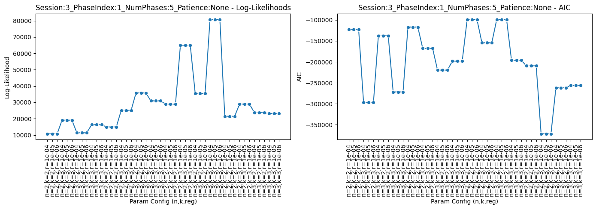
    


    Figure saved at: /Users/luiztauffer/Github/CoMPASS-Labyrinth/notebooks/my_project_2/figures/level_2_cv_performance_Session-4_PhaseIndex-1_NumPhases-5_Patience-None.pdf


    
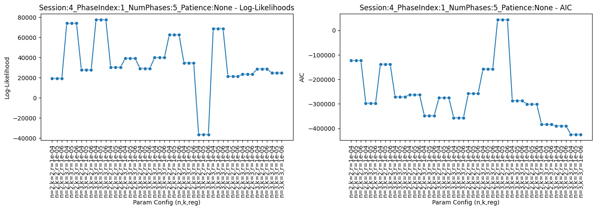
    


    Figure saved at: /Users/luiztauffer/Github/CoMPASS-Labyrinth/notebooks/my_project_2/figures/level_2_cv_performance_Session-5_PhaseIndex-1_NumPhases-5_Patience-None.pdf


    

    


    Figure saved at: /Users/luiztauffer/Github/CoMPASS-Labyrinth/notebooks/my_project_2/figures/level_2_cv_performance_Session-6_PhaseIndex-1_NumPhases-5_Patience-None.pdf


    
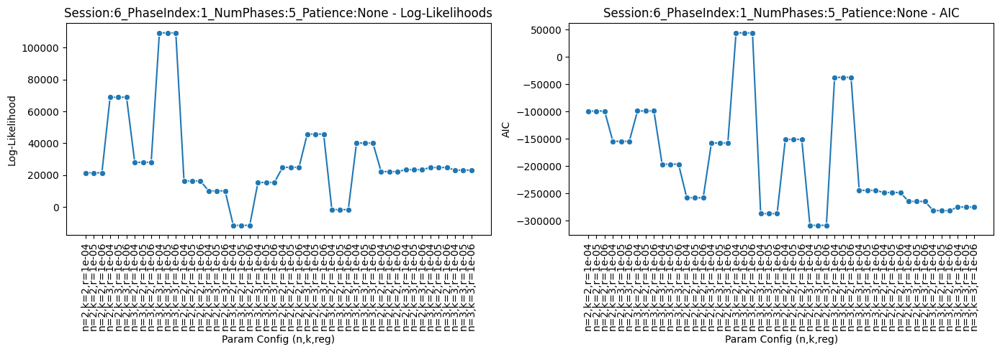
    


    Figure saved at: /Users/luiztauffer/Github/CoMPASS-Labyrinth/notebooks/my_project_2/figures/level_2_cv_performance_Session-7_PhaseIndex-1_NumPhases-5_Patience-None.pdf


    
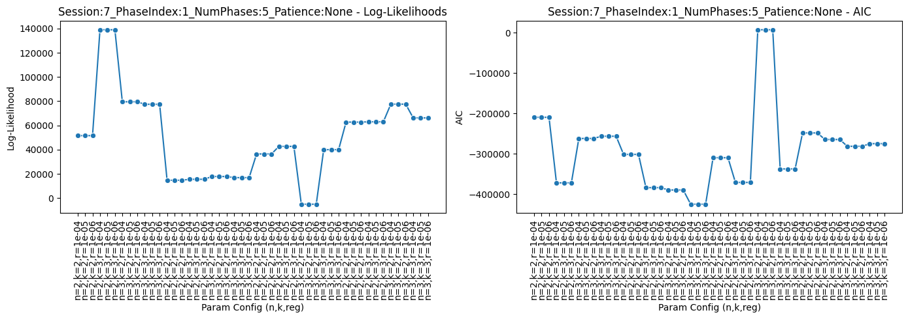
    


    Figure saved at: /Users/luiztauffer/Github/CoMPASS-Labyrinth/notebooks/my_project_2/figures/level_2_cv_performance_Session-3_PhaseIndex-2_NumPhases-5_Patience-None.pdf


    

    


    Figure saved at: /Users/luiztauffer/Github/CoMPASS-Labyrinth/notebooks/my_project_2/figures/level_2_cv_performance_Session-4_PhaseIndex-2_NumPhases-5_Patience-None.pdf


    
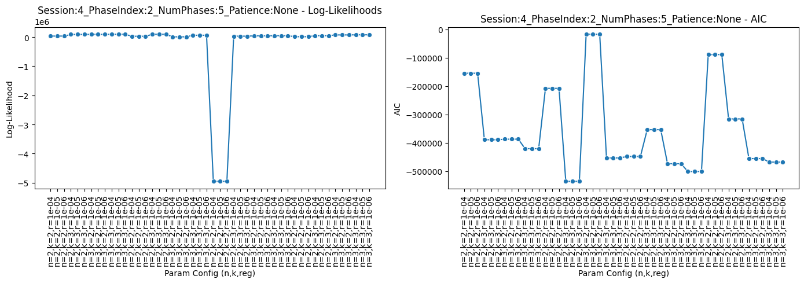
    


    Figure saved at: /Users/luiztauffer/Github/CoMPASS-Labyrinth/notebooks/my_project_2/figures/level_2_cv_performance_Session-5_PhaseIndex-2_NumPhases-5_Patience-None.pdf


    
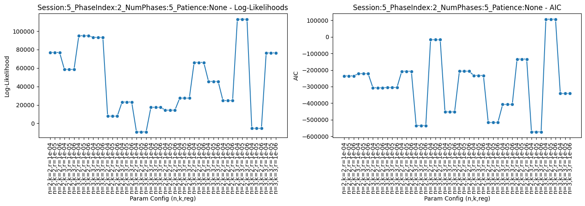
    


    Figure saved at: /Users/luiztauffer/Github/CoMPASS-Labyrinth/notebooks/my_project_2/figures/level_2_cv_performance_Session-6_PhaseIndex-2_NumPhases-5_Patience-None.pdf


    
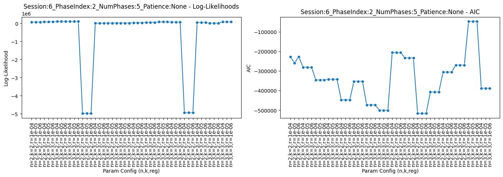
    


    Figure saved at: /Users/luiztauffer/Github/CoMPASS-Labyrinth/notebooks/my_project_2/figures/level_2_cv_performance_Session-7_PhaseIndex-2_NumPhases-5_Patience-None.pdf


    
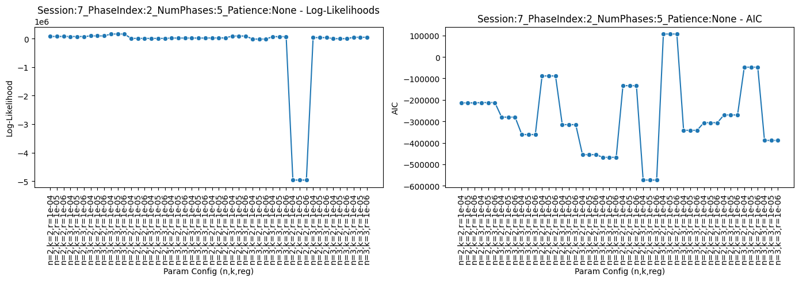
    


    Figure saved at: /Users/luiztauffer/Github/CoMPASS-Labyrinth/notebooks/my_project_2/figures/level_2_cv_performance_Session-3_PhaseIndex-3_NumPhases-5_Patience-None.pdf


    
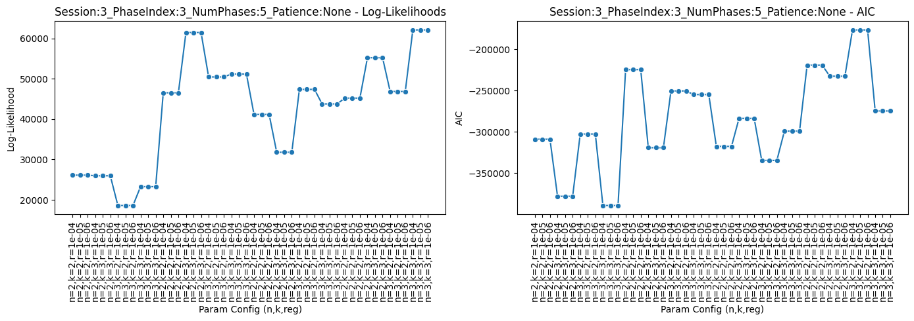
    


    Figure saved at: /Users/luiztauffer/Github/CoMPASS-Labyrinth/notebooks/my_project_2/figures/level_2_cv_performance_Session-4_PhaseIndex-3_NumPhases-5_Patience-None.pdf


    
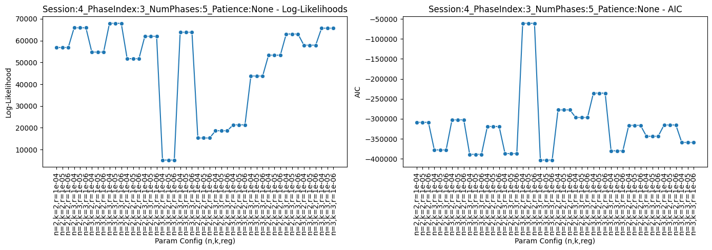
    


    Figure saved at: /Users/luiztauffer/Github/CoMPASS-Labyrinth/notebooks/my_project_2/figures/level_2_cv_performance_Session-5_PhaseIndex-3_NumPhases-5_Patience-None.pdf


    

    


    Figure saved at: /Users/luiztauffer/Github/CoMPASS-Labyrinth/notebooks/my_project_2/figures/level_2_cv_performance_Session-6_PhaseIndex-3_NumPhases-5_Patience-None.pdf


    
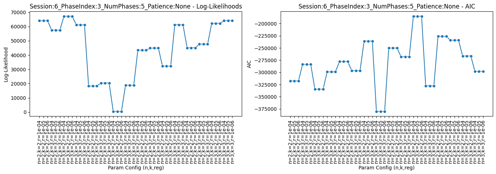
    


    Figure saved at: /Users/luiztauffer/Github/CoMPASS-Labyrinth/notebooks/my_project_2/figures/level_2_cv_performance_Session-7_PhaseIndex-3_NumPhases-5_Patience-None.pdf


    
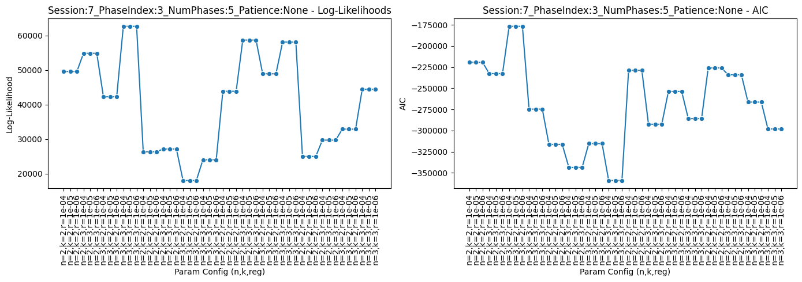
    


    Figure saved at: /Users/luiztauffer/Github/CoMPASS-Labyrinth/notebooks/my_project_2/figures/level_2_cv_performance_Session-3_PhaseIndex-4_NumPhases-5_Patience-None.pdf


    

    


    Figure saved at: /Users/luiztauffer/Github/CoMPASS-Labyrinth/notebooks/my_project_2/figures/level_2_cv_performance_Session-4_PhaseIndex-4_NumPhases-5_Patience-None.pdf


    
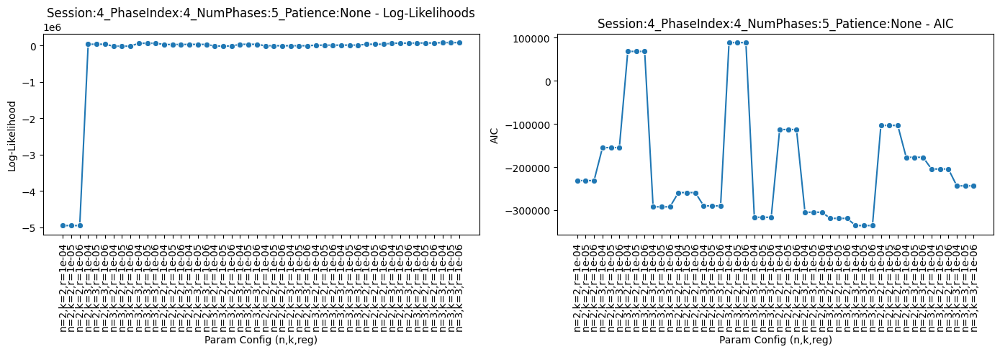
    


    Figure saved at: /Users/luiztauffer/Github/CoMPASS-Labyrinth/notebooks/my_project_2/figures/level_2_cv_performance_Session-5_PhaseIndex-4_NumPhases-5_Patience-None.pdf


    
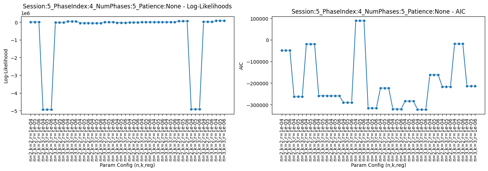
    


    Figure saved at: /Users/luiztauffer/Github/CoMPASS-Labyrinth/notebooks/my_project_2/figures/level_2_cv_performance_Session-6_PhaseIndex-4_NumPhases-5_Patience-None.pdf


    
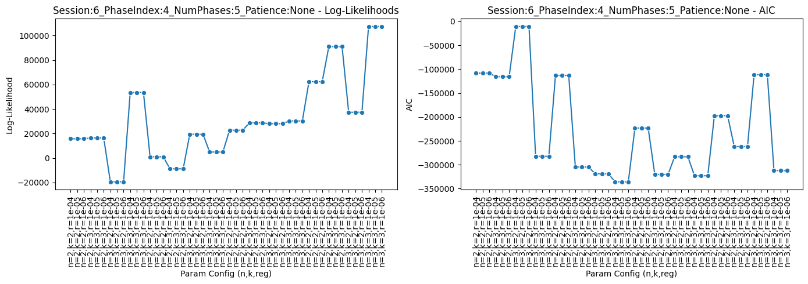
    


    Figure saved at: /Users/luiztauffer/Github/CoMPASS-Labyrinth/notebooks/my_project_2/figures/level_2_cv_performance_Session-7_PhaseIndex-4_NumPhases-5_Patience-None.pdf


    

    


    Figure saved at: /Users/luiztauffer/Github/CoMPASS-Labyrinth/notebooks/my_project_2/figures/level_2_cv_performance_Session-3_PhaseIndex-5_NumPhases-5_Patience-None.pdf


    
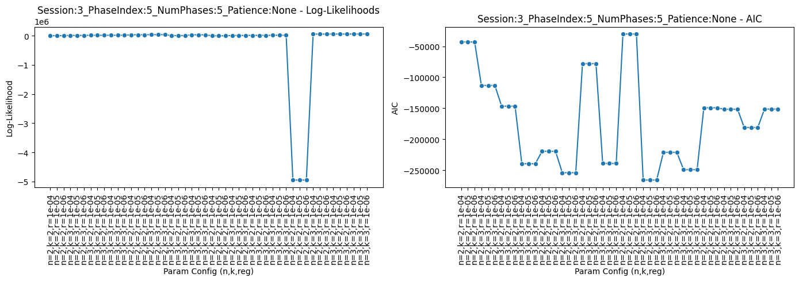
    


    Figure saved at: /Users/luiztauffer/Github/CoMPASS-Labyrinth/notebooks/my_project_2/figures/level_2_cv_performance_Session-4_PhaseIndex-5_NumPhases-5_Patience-None.pdf


    

    


    Figure saved at: /Users/luiztauffer/Github/CoMPASS-Labyrinth/notebooks/my_project_2/figures/level_2_cv_performance_Session-5_PhaseIndex-5_NumPhases-5_Patience-None.pdf


    

    


    Figure saved at: /Users/luiztauffer/Github/CoMPASS-Labyrinth/notebooks/my_project_2/figures/level_2_cv_performance_Session-6_PhaseIndex-5_NumPhases-5_Patience-None.pdf


    
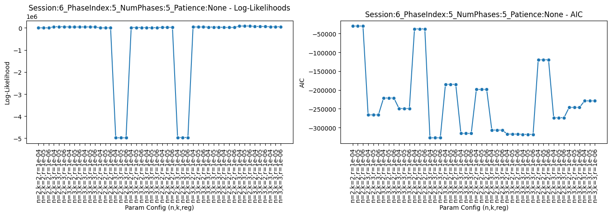
    


    Figure saved at: /Users/luiztauffer/Github/CoMPASS-Labyrinth/notebooks/my_project_2/figures/level_2_cv_performance_Session-7_PhaseIndex-5_NumPhases-5_Patience-None.pdf


    
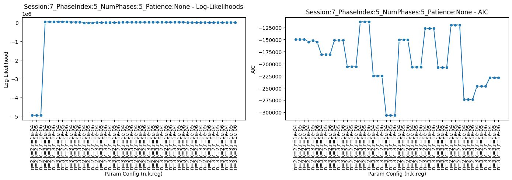
    


# Create 4 level HHMM States

```python
from compass_labyrinth.compass.level_2 import (
    assign_reward_orientation,    
    assign_hhmm_state,
)

# Assign reward orientation based on session-specific angle medians
df_hier = assign_reward_orientation(
    df_hier,
    angle_col='Targeted_Angle_smooth_abs',
    level_2_state_col='Level_2_States',
    session_col='Session',
)

# Then assign the final HHMM state
df_hier = assign_hhmm_state(
    df_hier,
    level_1_state_col='HMM_State',
    level_2_state_col='Reward_Oriented',
)
```

    /Users/luiztauffer/Github/CoMPASS-Labyrinth/src/compass_labyrinth/compass/level_2/model.py:460: FutureWarning: Setting an item of incompatible dtype is deprecated and will raise an error in a future version of pandas. Value 'Reward Oriented' has dtype incompatible with float64, please explicitly cast to a compatible dtype first.
      df.loc[(df[session_col] == sess) & (df[level_2_state_col] == reward_state), "Reward_Oriented"] = (


# Observe the raw state sequence

```python
from compass_labyrinth.compass.level_2 import plot_state_sequences


# Plot all sessions
plot_state_sequences(
    config=config,
    df=df_hier,     
    genotype='WT',
    state_col='Level_2_States',
    sessions_to_plot='all',
    title_prefix='State Sequence',
)
```

    Figure saved at: /Users/luiztauffer/Github/CoMPASS-Labyrinth/notebooks/my_project_2/figures/state_sequence_session_3.pdf


    

    


    Figure saved at: /Users/luiztauffer/Github/CoMPASS-Labyrinth/notebooks/my_project_2/figures/state_sequence_session_4.pdf


    

    


    Figure saved at: /Users/luiztauffer/Github/CoMPASS-Labyrinth/notebooks/my_project_2/figures/state_sequence_session_5.pdf


    

    


# Observe the HHMM state sequence

```python
from compass_labyrinth.compass.level_2 import plot_hhmm_state_sequence


colors = {
    'Surveillance, Non-Reward Oriented': 'coral',
    'Surveillance, Reward Oriented': 'maroon',
    'Ambulatory, Non-Reward Oriented': 'cyan',
    'Ambulatory, Reward Oriented': 'navy',
}

# Plot HHMM state sequences for all sessions
plot_hhmm_state_sequence(
    config=config,
    df=df_hier,
    session_col='Session',
    state_col='HHMM State',
    colors=colors,
)
```

    Figure saved at: /Users/luiztauffer/Github/CoMPASS-Labyrinth/notebooks/my_project_2/figures/hhmm_state_sequence_session_3.pdf


    
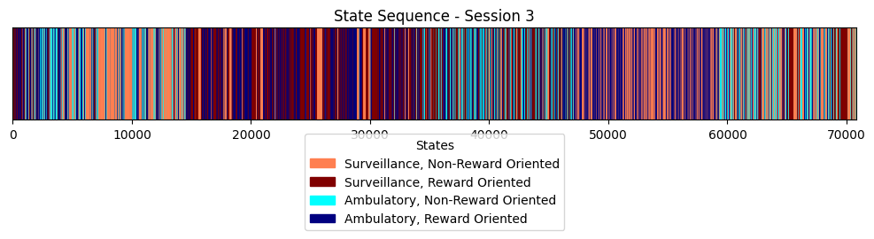
    


    Figure saved at: /Users/luiztauffer/Github/CoMPASS-Labyrinth/notebooks/my_project_2/figures/hhmm_state_sequence_session_4.pdf


    
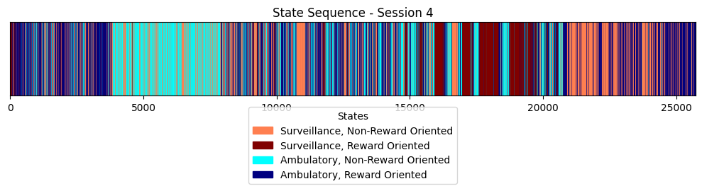
    


    Figure saved at: /Users/luiztauffer/Github/CoMPASS-Labyrinth/notebooks/my_project_2/figures/hhmm_state_sequence_session_5.pdf


    
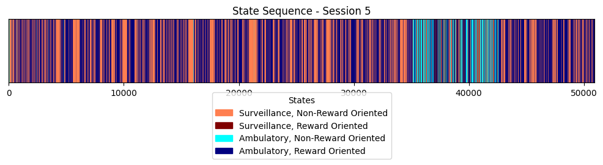
    


    Figure saved at: /Users/luiztauffer/Github/CoMPASS-Labyrinth/notebooks/my_project_2/figures/hhmm_state_sequence_session_6.pdf


    

    


    Figure saved at: /Users/luiztauffer/Github/CoMPASS-Labyrinth/notebooks/my_project_2/figures/hhmm_state_sequence_session_7.pdf


    
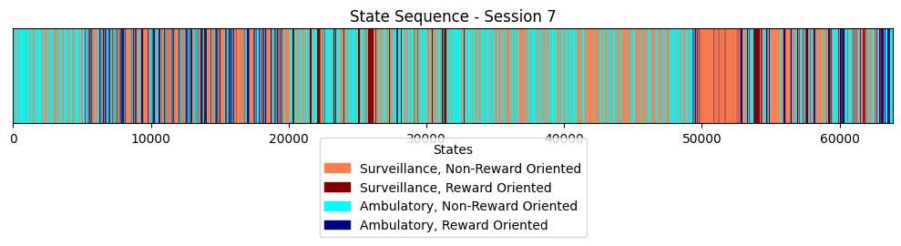
    

